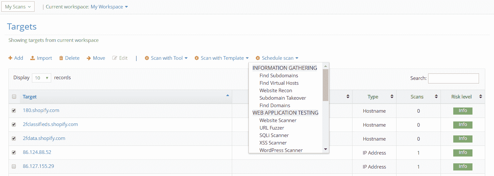
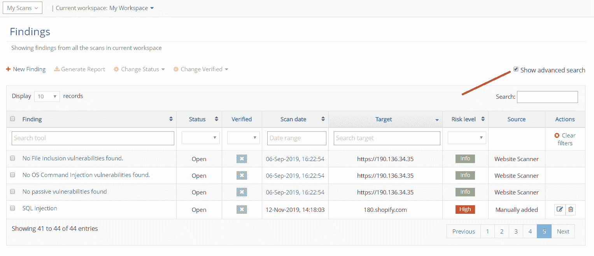
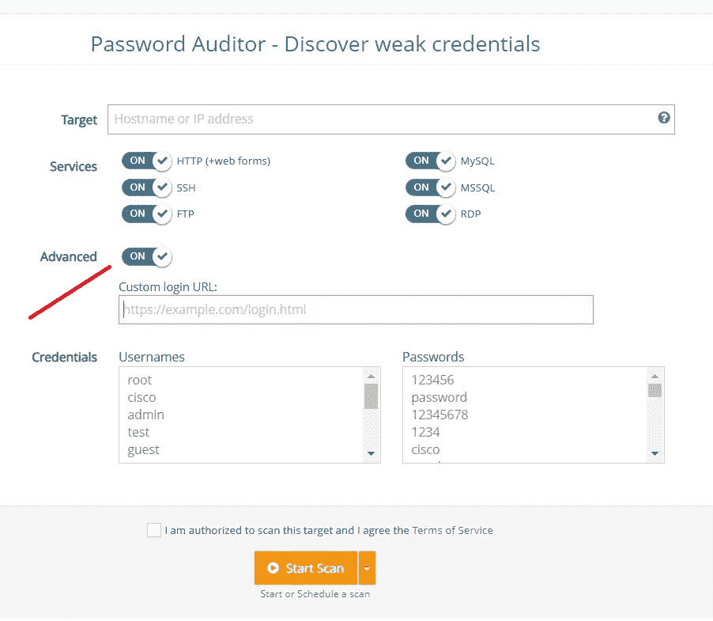
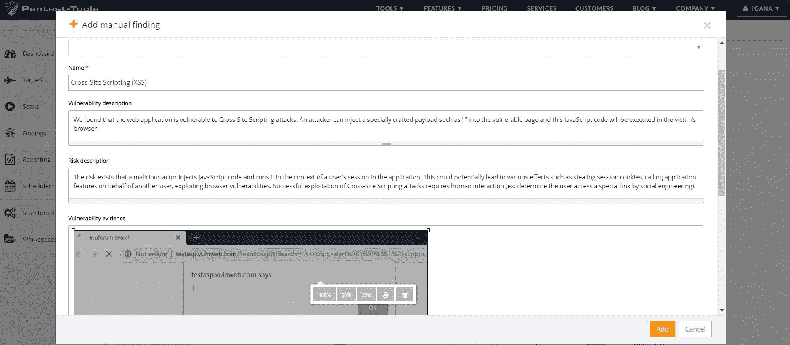

# 安排多次扫描、高级搜索过滤器和更多更新| Pentest-Tools.com

> 原文：<https://pentest-tools.com/blog/schedule-multiple-scans-platform-updates>

这里是我们在当前更新中开发和部署的 4 个平台改进，使 Pentest-Tools.com 成为满足您测试需求的宝贵资产。

1.  一次安排多个扫描

2.  添加了高级搜索过滤器

3.  密码审计改进

4.  向手动调查结果添加图像

[**登录尝试更新**](https://pentest-tools.com)

## **1。同时安排多项扫描**

我们改进了计划功能，因此您可以**同时计划对多个目标的扫描**。为此，请遵循以下四个简单的步骤:

1.  登录您的 Pentest-Tools.com 帐户

2.  转到**目标**并选择您想要安排的目标

3.  选择安排扫描所需的工具。

这样，您可以轻松安排在特定时间和日期运行多个扫描，并监控目标的安全性。

## **2。对扫描和结果执行高级搜索**

在您的 Pentest-Tools.com 仪表板中，对于**扫描**和**查找**页面，我们已经添加了**高级搜索过滤器**来执行深度搜索。

要使用特定过滤器，请单击每个扫描或查找页面右上角的“**显示高级搜索**”按钮。

在我们的 [**密码审计工具**](https://pentest-tools.com/network-vulnerability-scanning/password-auditor) 中，我们努力简化您处理登录 URL 和凭证的方式。

现在，您可以设置一个自定义的登录 URL，这将是蛮力，也可以自定义显示的用户名和密码列表。

为此，您必须启用“**高级**按钮，并开始扫描弱密码。

## **4。点击一下**将图片添加到您的手动调查结果中

我们还增强了向您插入漏洞报告的手动调查结果添加图像的选项。

现在，您可以通过快速复制(CTRL+C)和粘贴(CTRL+V)选项或一键上传按钮，轻松地在手动调查结果的描述、风险、证据或建议部分附加图像。

要将图像添加到手动查找中:

1.  登录您的 Pentest-Tools.com 帐户

2.  转到**调查结果**

3.  **添加(手动)查找**并选择想要插入图像的区域。添加后，您可以调整图像大小或删除它。

这一改进为您提供了更多的灵活性，使您更容易完成漏洞评估报告。

如果您想了解更多关于 Pentest-Tools.com 的信息或找到您问题的快速答案，**探索我们的[支持中心](https://support.pentest-tools.com)** 或发送电子邮件至[support@pentest-tools.com](mailto:support@pentest-tools.com)