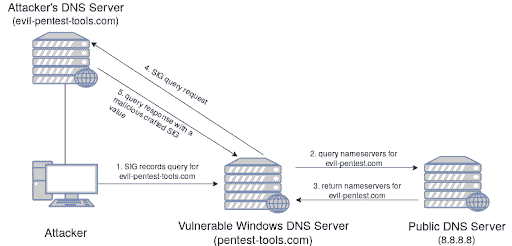

# 导致 Windows | Pentest-Tools.com RCE 的 17 年之久的 DNS 漏洞

> 原文：<https://pentest-tools.com/blog/sigred-dns-windows-rce>

在之前的博客中，我们揭示了 web 应用程序、防火墙、SMB 协议中的漏洞，现在我们有了一个 DNS 漏洞。

这证明每个服务、网络协议和应用程序都容易受到攻击。

只要设备连接到互联网，它就会成为潜在的目标。(即使那些不在线的也可能被滥用，使用集中于硬件振动的数据渗透技术，但那是另一天的话题。)

所以，让我们回到今天的主要话题:CVE-2020-1350(也称为 SIGRed)，这是一个在 Windows DNS 服务器中发现的高风险漏洞，可以导致远程代码执行，甚至更糟的是，导致整个基础设施受损。

你准备好认真对待事实了吗？

## 漏洞概述

这么大(甚至巨大！)在 Windows DNS 服务器协议中发现安全问题。它的概念非常类似于 SMBGhost(您可以使用我们的技术演练将其链接到 SMBleed)。

它获得了可能的最高 CVSS 奖——10/10——有两个原因:

*   此漏洞可导致远程代码执行，从而将其影响提升至严重级别

*   而且它的开发复杂度也在中等偏上。

事实上，它在雷达下停留了超过 17 年，使情况变得更糟。

自其披露以来，网络犯罪分子开始如预期的那样在野外滥用它。

### “SIGRed”这个名字背后有什么故事？

名称中的“SIG”来自“Signature record”，这是一种用于携带不同细节的 DNS，包括签名的加密算法、签名人姓名、到期时间以及关于客户端发送的特定 DNS 查询的更多信息。名称中的“红色”是指这个问题是一个关键问题。

还记得和 [**SMBGhost**](http://localhost:3000/blog/how-to-detect-microsoft-smbghost-vulnerability/) 的相似之处吗？这个 vuln 和著名的 [**永恒蓝**](https://docs.microsoft.com/en-us/security-updates/securitybulletins/2017/ms17-010) 也有共同之处。而且是很简单的一个方面:**Windows 相关网络协议中的缓冲区溢出**。

最初，SIGRed 是通过 DNS 查询的缓冲区溢出，当被 Windows DNS 服务器解释时，SIG 标志值超标。

## 受影响的版本

你可以在 2003 年到 2019 年每一个未打补丁的 Windows Server 版本**中找到这个漏洞。哎哟。**

## 技术方面

大多数人将矛头指向 Windows DNS 服务器实现中有罪的“SigWireRead”函数，即“dns.exe”进程。此函数负责解释来自 DNS 查询的 SIG 和 RRSIG 值。

SigWireRead 函数有一个名为“RR_AllocateEx”的子函数，它为 SIG 和 RRSIG 值分配内存，并通过 memcpy 传递分配的内存地址，memcpy 是一个通常与基于堆的缓冲区溢出相关的函数。

通过从客户端发送 SIG/RRSIG 值大于 64KB 的 DNS 响应，您可以触发受控的缓冲区溢出，这最终会导致服务崩溃(拒绝服务),甚至更糟的是远程代码执行。

## 影响

如果(什么时候？)利用此漏洞，您可以获得远程代码执行列车的 VIP 票，目的地为 Windows Server。小心，那些到达那里的人被称为“域管理员”！

Windows DNS 服务器是每个基于 Windows 的环境的核心组件，也常用于 Active Directory 中。此外，**该漏洞被标记为“可蠕虫攻击的”**，这意味着，在利用后，**攻击者可以通过您的网络**执行横向和纵向移动，从而导致潜在的全面危害。

在编写本报告时，通过 Shodan 登记的可能易受攻击的目标约有 23，244 个。

从这个基本的 Shodan 查询:`port:53 “Microsoft DNS”`开始，您可以尝试自己搜索并找到用于教育目的的潜在目标。

## 漏洞利用概述

在撰写本文时，迄今为止您能找到的唯一可用漏洞是 GitHub 上的一个 [**DoS one，它滥用 SIGRed 漏洞使 DNS 服务崩溃。**](https://github.com/maxpl0it/CVE-2020-1350-DoS)

利用原则是利用 DNS 服务器解析转发的 SIG-tagged(或 RRSIG)查询响应的方式。

使用 Github 的 [**  Python 脚本，可以托管自己的恶意域名，之后会如下运行:**](https://github.com/maxpl0it/CVE-2020-1350-DoS)

1.  从攻击者的机器上，使用以下命令通过易受攻击的 DNS 服务器发送针对恶意域的 SIG-records DNS 查询:`nslookup -type=sig {subdomain.attacker_domain} {vulnerable server IP}`

2.  易受攻击的 DNS 服务器将向公共 DNS 服务器询问恶意域的域名服务器

3.  攻击者的 DNS 服务器的名称服务器被返回给易受攻击的 Windows DNS 服务器

4.  易受攻击的 DNS 将充当客户端，并将初始 SIG 请求查询转发到攻击者的 DNS 服务器

5.  通过我们的脚本，恶意 DNS 服务器将使用恶意 SIG 值进行响应，该恶意 SIG 值被精心编制以产生缓冲区溢出并使受害服务器上的 DNS 服务崩溃。

<template x-if="showVideo"></template>

## 如何修复 CVE-2020-1350

最好的做法是**立即修补**，你可以用两种方式做到这一点:

1.  使机器联机并检查 Windows 更新(如果没有自动安装)

2.  使用此 [**链接**](https://portal.msrc.microsoft.com/en-US/security-guidance/advisory/CVE-2020-1350) 手动下载更新。

如果您不能修补服务器，有一个基于注册表的解决方法(不推荐，但总比没有好):

```
HKEY_LOCAL_MACHINE\SYSTEM\CurrentControlSet\Services\DNS\Parameters
DWORD = TcpReceivePacketSize
Value = 0xFF00
```

将它添加到 Windows 注册表中后，以管理员身份打开 CMD 并输入以下命令来重新启动 DNS 服务:

```
net stop dns
net start dns
```

鉴于 SIGRed 的性质和流行程度，**我们预计我们将更新这篇文章，提供新的漏洞或重要细节**，所以如果你打算关注这种情况，请确保将它加入书签。