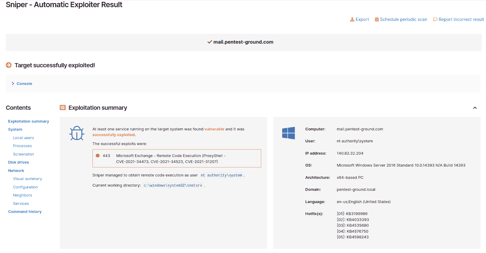

# 供应链攻击是如何运作的，以及减轻它们的 7 种方法| Pentest-Tools.com

> 原文：<https://pentest-tools.com/blog/supply-chain-attacks>

您的组织是一个由供应商、软件和人员组成的互联网络，使您的业务保持正常运行。这些元素中的每一个都有不同程度的敏感信息访问权限，不良行为者可以利用这些信息作为供应链攻击的切入点。

根据 2022 年 [软件供应链攻击报告](https://anchore.com/software-supply-chain-security-report-2022/) ， **62%的受访组织**受到过这些威胁的影响。 [Enisa 关于供应链攻击威胁形势的报告](https://www.enisa.europa.eu/publications/threat-landscape-for-supply-chain-attacks) 强调，在 **66%的案例中，恶意黑客关注供应商的代码**，而在**62%的案例中**他们依赖恶意软件作为主要攻击技术。此外，Gartner [估计](https://www.gartner.com/en/newsroom/press-releases/2022-03-07-gartner-identifies-top-security-and-risk-management-trends-for-2022) 到 2025 年，全球 **45%的组织**将遭遇对其软件供应链的攻击。

因此，对于攻击性安全专家来说，帮助决策者了解这些攻击带来的真正商业风险是至关重要的。

作为渗透测试人员或安全顾问，识别和报告供应链风险可以让你脱颖而出，特别是如果你可以用业务术语解释潜在的后果。所以让我们来帮你做到这一点。

## 什么是供应链攻击？快速复习

供应链攻击是一种日益增长的威胁类型，主要针对软件开发商和服务或技术提供商，目标是通过能够访问敏感数据的第三方供应商渗透到公司的基础架构中。

恶意行为者利用这些攻击来获取对源代码、开发流程或更新机制的访问权限，从而可以通过感染合法程序来传播恶意软件。

供应链攻击是将恶意软件引入目标组织的一种非常成功的方法。这是因为供应链攻击依赖于制造商或供应商与客户之间存在的信任关系。

但是这些攻击使用了什么策略呢？

让我们深入了解更多细节。

## 供应链攻击的工作原理

供应链攻击最常见的情况是第三方或合作伙伴(供应商)能够访问关键数据或部分内部基础设施。有了这些权限，威胁参与者就可以破坏第三方的安全机制，并获得对授予第三方供应商的资源的合法访问权。

例如，攻击者在构建和签署程序代码之前注入恶意软件*。这将恶意代码隐藏在常规安全签名后面，使反病毒工具更难检测到它。*

在其他情况下，攻击者通过更新、补丁或破坏专用于向客户发送合法电子邮件的电子邮件基础架构，将恶意软件引入合法软件版本和升级。

关于这种攻击最有趣的事情之一是，它的效率随着组织/客户使用的协作工具的数量而增加。

在发起供应链攻击时，**威胁行为者关注的 3 个主要切入点是:**

公司经常管理和共享第三方应用程序，如电子邮件客户端、网络浏览器或软件产品，如 Office 套件、Windows 操作系统及其组件。例如，VMware 有许多产品，如 VMware 工作站、VMware tools、vCenter 或 VMware ESXi，这些产品是大型组织大规模使用的。

恶意行为者的关键是穿透小公司的防御，并在那里植入自己的恶意软件。这种类型的中小型企业通常充当大公司的供应商，并且基础架构受保护程度较低。

供应链攻击最常见的情况是:

*   **受损的软件构建工具**或更新的基础设施

*   被劫持的代码签名证书或以开发公司名义签名的恶意程序

*   **已被劫持并分发到硬件或固件组件中的专用代码**

*   **在设备上预装恶意软件**(例如，相机、USB、手机等。)

为了更好地理解这种攻击是如何工作的，下面是其流程的可视化表示:

 <picture></picture>  <template x-if="showModal"></template>

## 3 个供应链攻击的例子:网络安全管理软件产品、CCleaner 和 FishPig

接下来，让我们看看一些最臭名昭著的供应链攻击。我们将看到攻击性安全方面的具体问题，以便向决策者解释并打击此类攻击。

### 1.网络安全管理软件产品供应链攻击

网络安全管理软件产品可能是这种攻击最能说明问题的例子。对手使用 SUNBURST 后门作为主要的攻击媒介来破坏网络安全管理软件产品的 Orion 管理平台。

他们通过第三方供应商安装恶意软件，在 IT 监控和管理包网络安全管理软件产品猎户座的最新更新中使用远程访问木马(RAT)。

[数据显示](https://www.theverge.com/2021/2/18/22288961/solarwinds-hack-100-companies-9-federal-agencies) 网络安全管理软件产品网络攻击影响了**100 多家公司**，包括政府机构、电信公司、财富 500 强大公司。IronNet 的 [2021 年网络安全影响报告](https://www.ironnet.com/hubfs/IronNet-2021-Cybersecurity-Impact-Report-June2021.pdf) 强调，平均而言，这一事件影响了公司 **11%的年收入**。在这一特定的网络攻击中，网络犯罪分子瞄准(并利用)了应用服务器和相关的软件更新渠道。

作为渗透测试人员，您可以通过*检测和报告在供应链的关键组件中发现的*关键漏洞(例如吉拉、比特桶或 GitLab 等协作平台)，帮助组织更好地保护其基础设施。

### 2.清洁供应链攻击

CCleaner 是最知名的软件维护工具之一，也是供应链攻击的中心，这次攻击影响了超过 230 万台设备。

这次攻击发生在**三个阶段:**

*   首先，攻击者入侵了一个 CCleaner 开发人员的无人值守工作站，该工作站连接到 Piriform 网络(CCleaner 开发网络)。为此，他们使用了远程支持软件工具 TeamViewer。

*   通过这个后门，攻击者尝试了**横向移动技术**来访问连接到同一网络的第二台无人值守计算机。他们编写了一个 ShadowPad 版本，这是一个后门程序，允许攻击者下载更多恶意模块或窃取数据。

*   然后，threat actors 在 Piriform 网络中的四台计算机(作为 mscoree.dll 库)和一台构建服务器(作为. NET 运行时库)上安装了另一个有效负载。这使得攻击者可以用他们的 CCleaner 后门版本替换 CCleaner 程序的正式版本，并将其推送给数百万用户。

思科 Talos [的安全研究人员检测到](https://thehackernews.com/2017/09/ccleaner-hacked-malware.html)该软件的恶意版本，该版本通过该公司官网传播了一个多月，并立即通知了 Avast。

CCleaner 的恶意版本有一个**多阶段恶意软件有效载荷**，旨在从受感染的计算机中窃取数据，并将其发送回攻击者控制的命令和控制服务器。

### 3.鱼叉供应链攻击

另一个有趣的供应链攻击是针对 [FishPig](https://fishpig.co.uk/) 软件，Magento 电子商务平台的供应商，提供 Magento-WordPress 集成软件。

网络罪犯将恶意代码注入许可证源代码，也就是 license.php，但几周内都没有检测到。在此期间，该软件被下载了大约 **200.000 次**。

恶意负载包括一些 PHP 代码，用于与受损的许可证进行交互，通过该代码下载旨在安装 Rekoobe 远程访问特洛伊木马的二进制文件。

影响之大足以让 [研究人员说出](https://www.helpnetsecurity.com/2022/09/14/fishpig-extensions-compromised/) :

> *“从那以后安装或更新付费 Fishpig 软件的任何 Magento 商店现在都可能运行 [Rekoobe 恶意软件](https://www.zdnet.com/article/this-new-linux-malware-has-a-sneaky-way-of-staying-hidden/) ”。*

## 供应链攻击中常见的攻击媒介和模式

NCSC(国家反情报和安全中心) [公布了](https://www.dni.gov/files/NCSC/documents/supplychain/Software_Supply_Chain_Attacks.pdf) 一份基于用于传播恶意代码的媒介分类的供应链攻击清单。

以下是 2021 年对手用来危害公司的 5 种常见攻击媒介示例:

*   VGCA

*   韦拉波特

*   Twilio SDK

*   金色间谍

*   共付额

 <picture></picture>  <template x-if="showModal"></template>

*来源: [国家情报总监](https://www.dni.gov/files/NCSC/documents/supplychain/Software_Supply_Chain_Attacks.pdf)*

正如我们所看到的，大多数利用供应链风险的网络攻击都集中在从 PKI (公钥基础设施)到**的一个**段，绕过授予完整性、真实性和不可否认性的机制**。**

了解大多数供应链攻击中的 3 种常见模式也很有帮助:

[攻击面](https://pentest-tools.com/features/attack-surface) 管理是一项非常有用的技术，可以让组织识别出哪里出现了偏差。它指导立即采取行动，因为这种类型的攻击凸显了网络犯罪分子如何无情地搜索公司日常使用的未受保护的网络协议和基础架构。

## pentesters 如何证明供应链攻击的风险

作为一名攻击性安全专家，您专注于了解恶意软件、勒索软件或供应链攻击等威胁是如何利用漏洞的。在大多数情况下，它有助于了解、识别和证明:

*   漏洞的类型(远程代码执行、本地文件包含、无限制的文件上传等。)

*   软件的类型、用途及其广泛使用。

例如，软件协作工具中的远程代码执行表明它可用于供应链攻击。

客观地看，在 2022 年，通过使用 [网络漏洞扫描器](https://pentest-tools.com/network-vulnerability-scanning/network-security-scanner-online-openvas) (狙击模块选项)运行的集中扫描，我们的团队检测到大约 **23 个目标**受到其中一个涉及交换服务器的 CVE 的影响，这些 CVE 可用于供应链攻击。

为了更好地大规模预防和报告这些问题，您可以使用专门的工具，如我们的[Sniper Auto-Exploiter](https://pentest-tools.com/exploit-helpers/sniper)并验证高风险 CVE 的影响，为您的报告提取证据。

此外，Sniper 的特征网络图提供了入站和出站连接的有用视图，显示了供应链构成的所有路径。

 <picture></picture>  <template x-if="showModal"></template> <picture></picture>  <template x-if="showModal"></template>

Sniper 的 [模块](https://pentest-tools.com/exploit-helpers/sniper#exploit-modules) 通过 [网络扫描器](https://pentest-tools.com/network-vulnerability-scanning/network-security-scanner-online-openvas) 提供检测，还提供提取确凿证据的自动利用功能，尤其是针对远程代码执行漏洞。此功能有助于您报告和缓解对易受攻击的 Microsoft Exchange 服务器的广泛利用，这是此次攻击中最重要的目标之一。

微软的 Exchange 服务器暴露了大约 [**250，000 个组织易受**](https://www.csoonline.com/article/3616699/the-microsoft-exchange-server-hack-a-timeline.html) 供应链攻击，并且还产生了潜在攻击蔓延到来自各个领域的其他组织的风险，如银行、大学、法律或政府机构等。

为了利用 Exchange 服务器，威胁参与者可以使用社会工程来攻击供应链，目的是向客户或另一家合作伙伴公司传播合法的电子邮件，从而危害他们的基础架构。

如果您的客户或组织受到其最常用软件中的关键漏洞的影响，您可以直接采取行动，并使用 Sniper 来验证其实际影响。例如，您可以涵盖 Exchange 服务器中的各种高风险漏洞，以获得危害证据并了解风险:

*   远程代码执行(CVE-2021-26855，CVE-2021-27065)

*   [proxy shell](https://pentest-tools.com/blog/detect-proxyshell)——远程代码执行(CVE-2021-34473，CVE-2021-34523，CVE-2021-31207)

每个漏洞都由一系列的漏洞组成，这些漏洞可以通过我们的狙击模块 检测出来。

 <picture></picture>  <template x-if="showModal"></template>

*上图显示了 [利用 Exchange 服务器](https://www.microsoft.com/en-us/security/blog/2021/03/25/analyzing-attacks-taking-advantage-of-the-exchange-server-vulnerabilities/) (ProxyLogon)* 的场景

## 用这 7 个缓解策略对抗供应链攻击

作为一名安全研究员，我建议**至少对关键基础设施进行****两个阶段的安全评估:** 

*   **首先，对您自己的基础设施进行审计，以验证所有端点的输入以及外部和内部流之间的交互。您可以通过以下方式实现这种机制:IDS(入侵检测系统)或 IPS(入侵防御系统)、漏洞扫描器、定期日志检查和手动验证，以评估漏洞扫描器提供的流量数据和证据的正确性。**

*   **第二阶段包括与第三方软件供应商实施合作策略，对其基础架构进行安全审计。即使你信任该供应商，最近的供应链攻击也揭示了防范这些攻击是多么困难。此协作流程的主要重点是识别潜在威胁参与者可能用来危害供应链的关键漏洞(例如，远程代码执行、绕过身份验证、任意写入文件等)。).**

**这里有 **7 个可行的策略**你可以在你的道德黑客报告中使用，以帮助客户减少供应链攻击的影响:**

### **1.实现最小特权原则**

**组织经常向他们的员工、合作伙伴和软件提供不必要的广泛访问和权限。这些过度的权限为供应链攻击提供了便利。尽量实现**最小特权**的原则，只提供他们工作实际需要的权限。**

****专业提示**:在受到攻击的情况下，威胁参与者将被限制在被入侵的操作系统中，而无法进一步部署他们的恶意代码。**

### **2.部署网络分段和零信任**

**第三方软件和合作伙伴公司不需要完整的网络访问。为了根据业务功能将网络划分成区域，请确保**使用网络分段**。因此，即使供应链攻击损害了网络的一部分，其余部分仍然是安全的，而零信任确保只有授权方才能在第一时间获得访问权。**

****专家提示**:采用这种方法，您可以更好地控制网络流量，简化您的安全策略。**

### **3.遵循 DevSecOps 最佳实践**

**在开发工作流程中添加强大的安全措施，帮助您检测欺诈性更新的软件，并快速响应变化。**

**这种措施经常被忽视，但却是强烈推荐的，因为严重的安全漏洞通常源于一系列糟糕的开发操作。**

### **4.评估关键资产**

**从准确理解哪些组件是您组织的*最有价值的 IT 资产*开始。然后，检查最坏的情况，并以此为基础建立您的事件响应计划。**

****专家提示**:这种方法也有助于将现有资源分配到在紧急情况下最有影响力的地方。**

### **5.定期检查供应商**

**在实现新的应用程序或技术之前，花时间检查产品的复杂性。查看供应商的帮助论坛，了解其他用户是否遇到了类似的问题，以及卖家对投诉的反应有多快。**

**有些类型的程序使用旧的、过时的软件代码，没有对关键漏洞进行定期检查，这是您绝对应该避免的。与选定的软件提供商建立一种开放透明的沟通文化，并全面了解他们的安全程序也是至关重要的。**

**这种做法将帮助你的公司做出更明智的商业决策，建立更好的供应商关系，降低安全和违规风险。**

### **6.查看远程监控和管理(RMM)技术**

**如果您的公司有一个外部技术合作伙伴，他可以使用 RMM 技术访问您的基础设施，*要格外小心*。如果该组织的 RMM 工具遭到破坏，攻击者可能会直接访问您的网络。**

****专业提示**:每月(或每年)检查一次你的 RMM 工具，检查它们是否缺少任何安全更新。**

### **7.帮助管理层了解风险**

**因为供应链安全不如 IT 安全的其他方面为人所知，所以向管理层和其他非安全决策者简单明了地解释业务影响及其风险至关重要。这样，您的公司可以采取必要的措施来防止此类攻击:识别关键风险、构建风险管理框架、监控和审查**

****专业提示:**确保负责开发、部署或集成供应商软件的团队训练有素，能够识别可能的攻击类型(例如 [网络钓鱼攻击](https://pentest-tools.com/blog/phishing-7-zip-misconfiguration) 、数据泄露或其他安全事件)。**

## **为供应链攻击制定事件响应流程**

**作为一名 pentester，您专注于帮助决策者优先考虑供应链安全，并使用正确的风险管理流程来更好地应对这些攻击。**

**一个具有挑战性的方面是帮助其他人理解一个严重的漏洞如何给企业带来严重且代价高昂的影响。例如，威胁行为者经常使用 RCE 从网络内部危及服务或程序，以触发另一次供应链攻击。**

**如果作为一名 pentester，您为一个客户机成功地执行了远程代码，我建议您进一步调查内部网络，寻找更易受攻击的入口点。**

**如果暴露的目标有足够的潜力实施供应链攻击，与企业所有者合作实施良好的事件响应流程。通过这种方式，您可以帮助组织快速处理此类攻击，并最大限度地降低跨业务领域(如财务、声誉、合规性等)的风险。).**