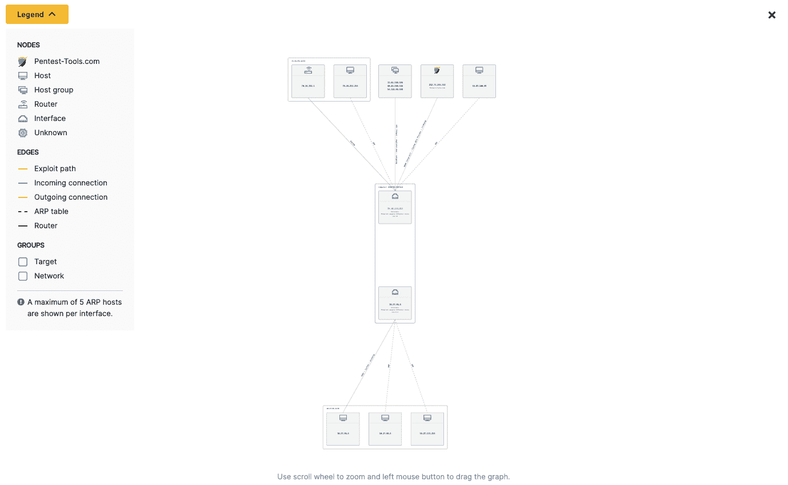

# 用狙击手网络图可视化攻击路径| Pentest-Tools.com

> 原文：<https://pentest-tools.com/blog/visualize-exploit-paths-with-the-sniper-network-graph>

当我们在 2021 年 9 月初推出 Sniper Auto-Exploiter 时，我们最初的目标是帮助攻击性安全专家更快、更准确地验证、利用和进行后期利用。

这个目标没有改变，但是进攻安全专家使用狙击手的方式已经发生了变化。因此，我们继续加强狙击手的漏洞利用能力，使用自动化不是为了取代人类专家，而是为了扩展他们的能力。

> 我们花在努力回忆事情上的每一点精力都没有花在只有人类才能做的思考上:发明新事物、编故事、识别模式、跟随直觉、与他人合作、调查新课题、制定计划、测试理论。

[打造第二个大脑](https://www.goodreads.com/book/show/59616977-building-a-second-brain)，蒂亚戈·福特

## **TL；为什么我们要建造狙击手自动开发机**

无论是在攻击性还是防御性安全领域工作，我们都看到了这一点:高风险、广泛存在的漏洞会对本已举步维艰的安全团队造成重大破坏。

2021 年，1100+个 CVSSv3 分数在 9-10 的 CVE 充斥了科技生态系统。Pentesting 统计数据还显示，修复一个关键漏洞平均需要 100 多天，而其中一些漏洞需要数年时间才能通过修补或其他解决方案消除。例如， [Log4Shell](https://pentest-tools.com/blog/how-we-detect-log4shell) 、OMIGOD、 [ProxyShell](https://pentest-tools.com/blog/detect-proxyshell) 和 ProxyLogon 等等。

如果没有可靠的帮助，越来越复杂和庞大的 VA(漏洞评估)和 VM(漏洞管理)活动会加重安全专家的负担，直到他们筋疲力尽，这已经是一个常见的问题。

我们相信集中自动化可以帮助他们应对和扩展，但它必须可靠，在他们的控制下，并产生实际影响。

因为我们非常关心这个问题，我们的研究团队构建了 Sniper 来帮助安全团队更快地确认 CVE 与 RCE 或任意文件读取风险的实际影响。

我们集成[新的、广泛传播的漏洞](https://pentest-tools.com/exploit-helpers/sniper#exploit-modules)的速度最快可达 72 小时(平均),从他们获得 CVE 的那一刻开始，因此有道德的黑客可以依靠 Sniper 快速而精确地做出反应，并大大降低业务风险。

<template x-if="showVideo"></template>

我们很高兴看到[各种各样的安全专家](https://pentest-tools.com/reviews)每天都在使用 Sniper。他们喜欢该工具节省时间和停留的能力，因为它提供了透明度和控制，并且还消除了手动利用有时会造成的意外损坏的风险。

有了 Sniper，有道德的黑客可以在一个安全、可控的序列中模拟**外部攻击和认证攻击**。每次利用都会以未经身份验证的攻击者或有权访问登录凭据的对手的身份自动从目标中提取数据。

让[狙击自动开发者](https://pentest-tools.com/exploit-helpers/sniper)甚至*更加*强大的是它嵌入到了 Pentest-Tools.com 平台中。这意味着道德黑客可以将它与我们的[网络漏洞扫描器](https://pentest-tools.com/network-vulnerability-scanning/network-security-scanner-online-openvas)一起使用，例如，通过专用的 [pentest 机器人](https://pentest-tools.com/features/pentest-robots)(例如，网络扫描器全域机器人或网络扫描器关键 CVEs 机器人)在安全、自动化的测试序列中使用。

这些有重点的扫描产生准确的结果，支持对受高知名度软件(如 Confluence、BIG IP、Struts、Redis、Magento、Zabbix 等)中的关键漏洞影响的目标进行紧急检测和验证。).

> 现在，您可以通过单击“利用狙击手”按钮，使用狙击手自动利用工具，将我们的网络扫描仪(仅检测漏洞)的发现链接起来。
> 
> *[**丹尼尔·贝切内**](https://www.linkedin.com/in/danielbechenea/) ，安全研究主管*

除了能够弥合普通漏洞扫描器产生的结果和真实威胁参与者使用的攻击方法之间的差距，Sniper 最近获得了一个重要的升级。这项最新的改进扩展了其作为关键工具的作用，使专注于一些高效和有针对性的入侵技术的对手的机会窗口最小化。

## **狙击网络图:安全自动开采 x 即时可视化**

我们希望进一步利用 Sniper 的功能，帮助我们的客户了解被利用主机背后的网络架构，而无需手动操作，并且只需手动操作的一小部分时间。

> *为什么是现在？
> 像任何其他伟大的功能一样，我们希望几年前就拥有它。但是，和其他东西一样，Sniper 还在继续开发中，因此，每个月都会有新的很酷的功能出现。*
> 
> *[**鲁本秃鹰**](https://www.linkedin.com/in/ruben-condor-b3b6aa1a3/) [，](https://www.linkedin.com/in/ruben-condor-b3b6aa1a3/)安全研究工程师*

由于可视化网络拓扑对于攻击性和防御性信息安全专家来说都是一个必不可少的步骤，我们在[狙击手自动攻击者结果](https://pentest-tools.com/exploit-helpers/sniper#sample-report)中构建了一个网络图。

在该工具结果的**可视化摘要**部分，Pentest-Tools.com 客户现在可以看到其目标主机网络配置的即时可视化。他们可以浏览**自动生成的网络图**来查看:

*   **您的目标与网络上其他主机(路由器、工作站等)之间的所有 TCP 连接**(入站或出站)。)及其系统信息

*   被利用主机上配置的**接口**

*   **漏洞利用路径，**哪个狙击手使用了安全危害机器

*   **每个连接的通信协议**(SSH、HTTPs、HTTP、ms-wbt-server 等。)

*   来自附近网络子网的**相邻主机**的列表

*   **ARP 路由和主机组**，特别有助于与被利用目标在同一个端口上通信的多个目标。

<template x-if="showVideo"></template>

狙击手网络图从提取的[工件](https://pentest-tools.com/exploit-helpers/sniper#artefacts)中提取数据，当工具获得目标的 RCE 时**自动关联网络信息**。有了这一新功能，Sniper 消除了耗时的手动工作，为您提供了目标的大背景，并为您腾出了更多刺激的工作。

> 狙击手现在拥有强大的攻击能力，包括定制的网络神器。
> 
> *基于这些，这是将所有网络信息放入网络图以快速评估网络架构并了解系统连接方式的最佳时机。*
> 
> *我们构建了 Sniper 网络图，以帮助其他攻击性安全专家节省大量时间，他们目前需要花费大量时间来了解被利用主机背后的网络架构。*
> 
> 作为一名红色团队成员，很容易在图表上发现精选目标(敏感且重要的目标),并将其作为重点。作为一名蓝队队员，您希望发现目标建立的所有未知连接，这样您就可以审计它们，并确定系统是否被利用，以及恶意攻击者是否有后门连接。
> 
> ***丹尼尔*** ，安全研究负责人

如您所见，我们非常热衷于构建既能为攻击性安全专业人员解决真实、痛苦的问题，又能符合他们工作流程逻辑的工具。

> *我们创建了 Sniper 网络图，为我们的客户提供了一种在成功利用漏洞后，甚至是经过认证扫描后，轻松获取网络拓扑的方法。*
> 
> *他们的时间非常宝贵，因此我们的目标是以最友好的方式提供尽可能多的信息。*
> 
> *使用网络图，你可以很容易地看到网络连接，系统上的相关进程，甚至网络协议和接口，而不一定需要在网络领域有丰富的经验。*
> 
> ***鲁本秃鹰*** ，安全研究工程师

我们对 Pentest-Tools.com 上的全部[工具](https://pentest-tools.com/alltools)和[功能的目标是从安全专业人员的工作流程中移除一大块认知负担和许多低效率。我们坚信:](https://pentest-tools.com/features)

> 只有人类才能理解目标背后的网络，但是，使用 Sniper 及其网络图，当实现远程代码执行时，您可以节省大量时间来关联您拥有的所有网络信息。
> 
> ***丹尼尔·贝切尼亚*** ，安全研究负责人

我们在方法上也很务实，因为没有其他方法可以在重要问题上取得有意义的进展。作为信息安全社区的成员，我们需要解决如此多的系统性问题，因此没有必要进行修饰。

> 网络图不包括任何好的测试者可能得不到的信息。然而，这个 pentester 将需要比 Sniper 多得多的时间来聚集和关联信息，以便他们可以看到更大的(ger)图片。
> 
> 你不得不思考:什么值得你把有限的时间和精力放在上面？
> 
> *此外，随着目标基础架构变得越来越复杂，活动连接的数量也在增加，关联所有数据变得更加困难。*
> 
> *安全专家无需手动完成这项任务，他们可以利用自己的时间和空间展示自己独特的才能，并根据几分钟内从狙击手那里获得的信息进行专业训练。*
> 
> ***鲁本秃鹰**，安全研究工程师*

这种目标网络体系结构的可视化表示方式便于理解系统的连接方式。它还强调了漏洞的影响，提供了与安全和 It 领域的同行或业务部门的决策者进行有说服力的辩论的证据。

例如，Sniper 网络图可以帮助您了解多个目标是否在同一个端口上与被利用的目标进行通信，这实质上是将它们暴露给恶意利用。

> 如果有人需要其他目标的网络图，他们也可以通过运行经过认证的狙击手扫描，从不容易受到攻击的系统中获得。
> 
> *目前，我们支持针对认证场景的 SSH、WinRM 和 SMB 扫描选项，并将继续为我们的客户添加选项。*
> 
> ***鲁本秃鹰*** ，安全研究工程师

在您的安全测试工作流程中，有大量的**用例用于[狙击手自动开发者](https://pentest-tools.com/exploit-helpers/sniper)** 。使用它来:

*   显著加快漏洞验证

*   运行安全、受控的开采

*   自动获得初始访问权限

*   可视化网络拓扑

*   有条不紊地减少[攻击面](https://pentest-tools.com/features/attack-surface)

*   找到旋转和横向运动的目标。

## **关于构建狙击网络图的最佳部分**

> 将想法变成现实是最棒的部分。
> 
> *将一堆一开始很难联系起来的文本转换成一种易于理解的视觉表现是非常有益的。看到它在我们的客户手中更是如此。*
> 
> ***丹尼尔·贝切尼亚*** ，安全研究负责人

> 虽然我可以访问图表上显示的信息，但在图表成形后，有几次我在测试图表时，它让我大吃一惊。
> 
> 这清楚地证明了，如果重要信息没有以清晰和可用的方式呈现出来，就很容易被忽略。
> 
> ***鲁本秃鹰**，安全研究工程师*

无论你是同情 Ruben 使用这一新功能扩展其网络知识的经历，还是同情 Daniel 使用支持网络配置可视化表示的工具的兴奋，我们都很高兴看到*您使用[狙击手自动开发工具](https://pentest-tools.com/exploit-helpers/sniper)做了什么*！

如果您对我们集成到漏洞利用工具 [**中的新关键 CVE 的更新感兴趣，请订阅我们的 Youtube 频道**](https://www.youtube.com/c/PentestToolscom/videos) 以在我们发布它们时获得演示和演练。