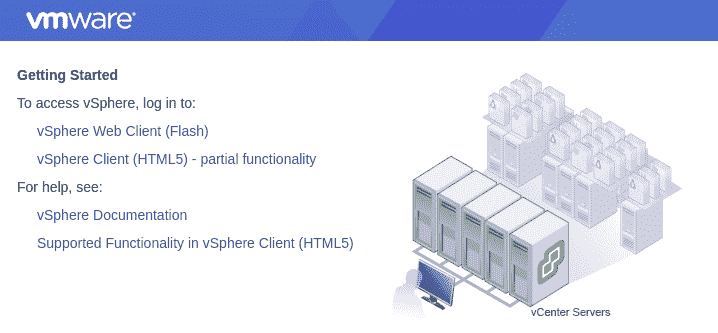
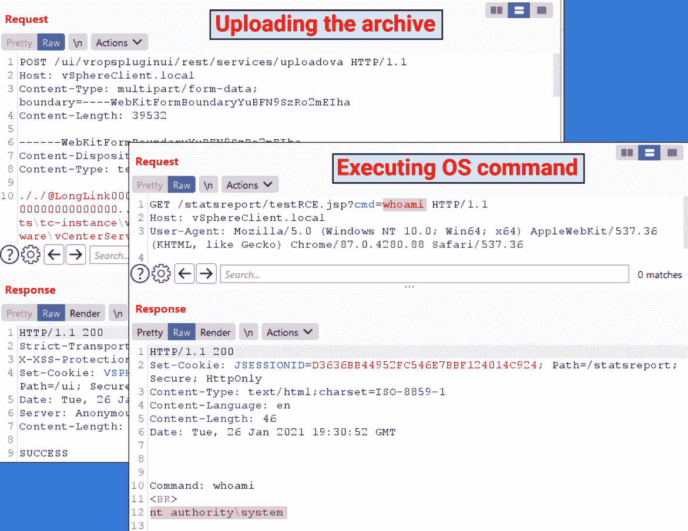
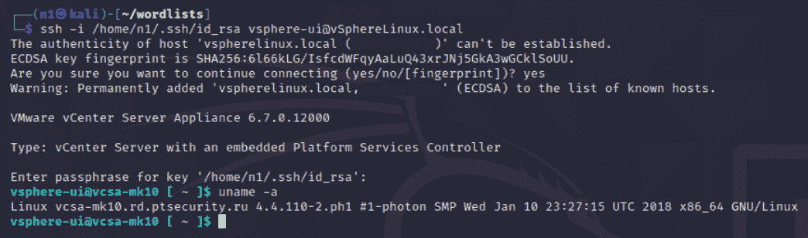
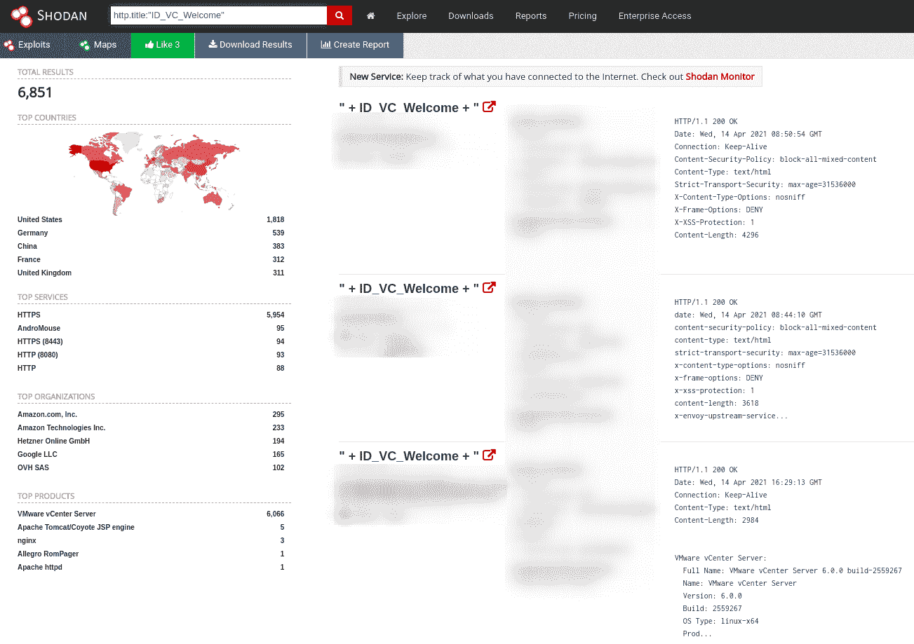
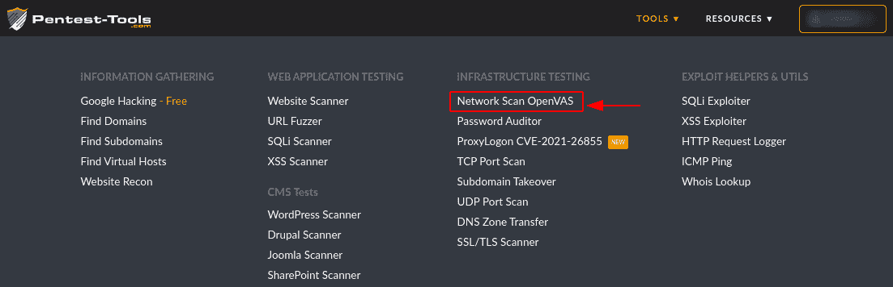
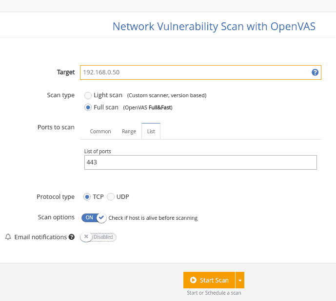
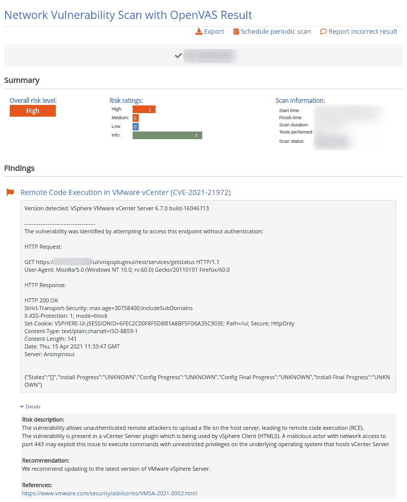

# 如何检测 Pentest-Tools.com(CVE-2021-21972)| Pentest-Tools.com 的 VMware vCenter RCE

> 原文：<https://pentest-tools.com/blog/vmware-rce-cve-2021-21972>

大型组织运行的当前多层设置是一个管理挑战，我们都知道这一点(这是一种保守的说法)。当像 CVE-2021-21972 这样的漏洞出现时，它揭示了修补和缓解过程是多么混乱。

但是，唯一的办法就是通过！因为发现和报告漏洞是我们帮助您完成的任务，所以我们通常会深入研究这些漏洞，这样您就不必付出额外的努力。

让我们从一个快速的时间表开始，解开这个特殊的 CVE。

2021 年 2 月 23 日，VMWare 发布了 CVE-2021-21972 的补丁(VMSA-2021-0002)。在他们的安全公告中，他们还提到了在 VMWare ESXi 虚拟机管理程序中发现的另一个漏洞。

第二天，安全专家 [Mikhail Klyuchnikov](https://swarm.ptsecurity.com/author/mikhail-klyuchnikov/) 发表了一篇[博文](https://swarm.ptsecurity.com/unauth-rce-vmware/)，详细介绍了 VMWare vCenter 的 vSphere Client 组件中的两个关键漏洞:

让我们补充一点背景知识。

## **什么是 VMware vSphere？**

[VMware vSphere](https://docs.vmware.com/en/VMware-vSphere/index.html) 是 VMware 的虚拟化平台，它将数据中心转变为包含 CPU、存储和网络资源的聚合计算基础架构。vSphere 将这些基础架构作为统一的操作环境进行管理，并为您提供管理参与该环境的数据中心的工具。

vSphere 的两个核心组件是 ESXi 和 vCenter Server:

*   ESXi 是您创建和运行虚拟机和虚拟设备的虚拟化平台

*   vCenter Server 是一项服务，您可以通过它来管理网络中连接的多台主机并共享主机资源。

## **VMware vCenter RCE vuln 的工作原理**

vSphere Client (HTML5)受到 vCenter Server 插件中的远程代码执行漏洞的影响。对端口 443 具有网络访问权限的恶意参与者可以利用此问题，在托管 vCenter Server 的底层操作系统上以不受限制的权限执行命令。

该病毒被追踪为 [CVE-2021-21972](https://nvd.nist.gov/vuln/detail/CVE-2021-21972) 影响:

*   VMware vCenter Server(7.0 U1c 之前的 7.x、6.7 U3l 之前的 6.7 以及 6.5 U3n 之前的 6.5)

*   VMware 云基础(4.2 之前的 4.x 和 3.10.1.2 之前的 3.x)。

由于大量公司在其网络上运行 VMWare vCenter，积极技术公司[最初计划](https://twitter.com/ptswarm/status/1364323986251907072)在系统管理员有足够的时间应用补丁之前，将关于这一关键漏洞的技术细节和概念验证保密。
然而，[一名中国研究员](http://noahblog.360.cn/vcenter-6-5-7-0-rce-lou-dong-fen-xi/)和其他 infosec 分析师发布了一个概念验证代码，有效地迫使受此漏洞影响的公司应用补丁。此外，他们开始对易受攻击的 vCenter 系统进行大规模扫描，这些系统保持在线连接，而攻击者则匆忙破坏这些系统。

## **CVE-2021-21972 如何将您的系统暴露给远程利用**

[vRealize Operations vCenter 插件](https://blogs.vmware.com/management/2018/04/vrealize-operations-within-vcenter-plugin.html)是此漏洞的根本原因。攻击者可以通过加载精心编制的文件来远程利用易受攻击的系统。这就是公司尽快应用可用补丁程序如此重要的原因。
但是在我们深入探讨修补细节之前，我们必须对 **CVE-2021-21972** 有一个深入的了解。

### **漏洞详情及分析**

vSphere Client 中存在 vuln，因为*/ui/vropspluginui/rest/services/**端点不需要身份验证。
在上述端点中，易受攻击的函数是 uploadOvaFile，URL*/ui/vropspluginui/rest/services/uploadova*允许上传恶意 jsp 外壳，这使得未经验证的攻击者能够远程执行代码。
upload ova 函数的处理程序允许您将任意文件上传到 vCenter server 上的任意位置。

对于 Windows 系统，对手可以上传一个精心制作的。jsp shell 文件，以便**获得服务器**上的管理权限。

对于 Linux 系统，恶意参与者可以生成 SSH 公钥并上传到服务器上的 authorized_keys 文件。因此，他们可以通过易受攻击的服务器上的 SSH 进行连接。

易受攻击的 Windows 系统
来源:[积极科技](https://swarm.ptsecurity.com/unauth-rce-vmware/)

易受攻击的 Linux 系统
来源:[正面技术](https://swarm.ptsecurity.com/unauth-rce-vmware/)

## **业务影响**

如果成功利用，此漏洞将允许未经验证的攻击者在 *vsphere-ui* 用户的上下文中获得远程代码执行飞机的“VIP 票”，目的地为 vCenter。

在撰写本文时，我们发现了通过 [Shodan](https://www.shodan.io/) 注册的 **6851** 潜在易受攻击的目标。

你可以从这个基本的 Shodan 查询:*http . title:" idvc welcome "*开始，自己尝试搜索、寻找**教育目的的潜在目标**。

> *从🇦🇱🇧🇷🇨🇦🇨🇳🇩🇪🇭🇰🇮🇳🇮🇩🇯🇵🇳🇱🇷🇺🇸🇬🇰🇷🇨🇭🇦🇪🇬🇧🇺🇸🇻🇳的主机中检测到针对易受远程代码执行攻击的 VMware vCenter 服务器的机会主义大规模扫描活动(CVE-2021-21972)。[#威胁](https://twitter.com/hashtag/threatintel?src=hash&ref_src=twsrc%5Etfw)[https://t.co/kOfqzW2Rmi](https://t.co/kOfqzW2Rmi)*
> 
> *—坏数据包(@ Bad _ Packets)[2021 年 2 月 26 日](https://twitter.com/bad_packets/status/1365194425584902147?ref_src=twsrc%5Etfw)*

根据您的操作系统和环境，攻击者利用此 CVE 会产生不同程度的后果:

*   如果威胁参与者能够成功利用此漏洞，他们就可以在 vCenter Server 的底层操作系统中远程执行代码。

*   对于 Windows 主机，攻击者可以上传恶意的。jsp 文件并获得服务器上的系统权限。

*   对于 Linux 服务器，攻击者需要生成一个 SSH 公钥并上传到。ssh 目录，并通过 SSH 连接到易受攻击的服务器。

*   任何能够到达易受攻击的 vCenter server 上的端口 443 的恶意黑客都可以完全获取数据信息，并危及设备及其包含的任何虚拟机。

无论哪种情况更有可能发生在你身上，后果都…不太好。

## **当您的终端防护无法检测到 CVE-2021-21972 时，如何进行检测**

如果您的终端安全解决方案无法检测到这一严重缺陷，这里有一种更简单的方法。查看 vCenter 日志并查找对*/ui/vropspluginui/rest/services/uploadova*端点的访问。

消除工作流程中的摩擦是我们的专长，因此这里介绍如何在不使用额外工具的情况下完成这项工作。登录您的[Pentest-Tools.com](https://pentest-tools.com)账户
。
在工具下，查看 Web 应用测试菜单，选择**使用 OpenVAS 进行网络漏洞扫描**。

在扫描仪的配置中，设置您的目标 URL 并选择“全面扫描”选项。
Do **not** 添加任何认证方法，因为您的目标是找到您可以访问*而无需*授权的资源。如果您想有效地利用时间，请选择在扫描完成时收到电子邮件通知。

一旦扫描程序结束，你可以浏览结果，看看你是否容易受到 CVE-2021-21972 的攻击。

如果您需要以 PDF、HTML 或可定制的 DOCX 格式传递此特定问题，您还可以导出一份快速报告。

## **如何缓解 CVE-2021-21972**

我们建议开始在您的环境中应用可用的补丁，因为 VMWare 已经发布了针对 CVE-2021-21972 的补丁。

| 产品版本> | 固定版本 | 月份地址 |
| --- | --- | --- |
| vCenter Server 7.0 | 7.0 U1c | 2020 年 12 月 |
| vCenter Server 6.7 | 6.7 U3l | 2020 年 11 月 |
| vCenter Server 6.5 | 6.5 U3n | 2021 年 2 月 |
| 云基础 3.x | 3.10.1.2 | 2021 年 2 月 |
| 云基础 4.x | 4.2 | 2021 年 2 月 |

如果您无法立即做到这一点，VMWare 为 CVE-2021-21972 和 CVE-2021-21973 提供了变通解决方案。系统管理员需要更改兼容性列表文件，并将 vRealize Operations vCenter 插件设置为不兼容。

## **虚拟机很棒——如果你持续关注它们的话**

全球企业都在运行 VMware 技术，以便更轻松地管理其 IT 基础架构和自动化工作负载。虽然这种云解决方案有助于组织提高 IT 效率，但未安装补丁的 vCenter servers 可能会给他们带来一系列安全问题。

定期监控是确保业务连续性的必备条件，定期扫描(你也可以在 Pentest-Tools.com[网站](https://pentest-tools.com)上获得)是一种在潜在问题升级之前发现它们的简单方法。

我们的团队一直致力于在[Pentest-Tools.com](https://pentest-tools.com)上添加新功能和改进工具(现在有 25 个以上)，这样你就可以快速检测出漏洞。