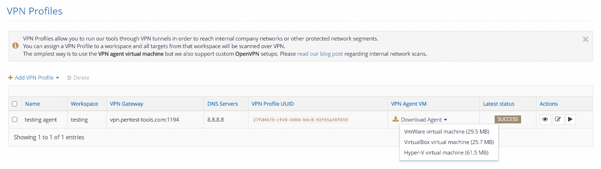
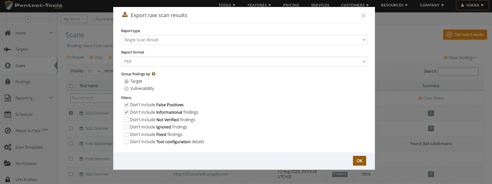
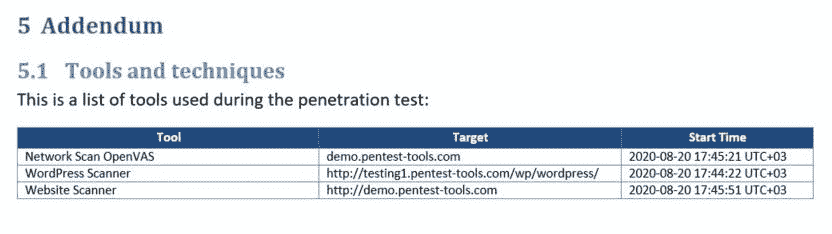

# 新的 VPN 代理格式、API 方法、过滤器和其他更新| Pentest-Tools.com

> 原文：<https://pentest-tools.com/blog/vpn-agent-formats-api-methods-updates>

这里是我们在当前更新中进行的 4 个平台改进，使 Pentest-Tools.com 成为你的 pentesting 工具箱的必备资产。

1.Hyper-V 和 VirtualBox 格式的 VPN 代理
2。添加了新的 API 方法和更新
3。更多过滤器生成更快的报告
4。pentest 报告的增强版(。docx)

让我们打开它们吧！

## **1。使用两种新的 VPN 代理格式**更轻松地设置内部扫描

您现在可以使用两种新格式的 VPN 代理虚拟机，即 **Hyper-V** 和 **VirtualBox** ，并在您的内部网络中运行它们。

要下载这些格式中的任何一种，[登录您的账户](https://pentest-tools.com/login)，进入 **VPN 档案**，选择**下载代理**。

要了解如何轻松地配置 VPN 代理和添加新的 VPN 配置文件，请查看我们支持中心的[分步教程](https://support.pentest-tools.com/en/vpn-profiles/internal-network-scan-vpn-agent)。

## **2。新的 API 方法和更新！**

我们增加了新的 API 方法来帮助你改善 Pentest-Tools.com 的**目标管理**。

**add_target** 操作创建一个带有可选描述的新目标。

**更新*目标*描述**操作更新目标的描述。

**开始*扫描* by_targetid** 操作使用特定的 target_id 开始新的扫描。

我们还为 **get_scans** 方法添加了新参数，以便**基于 *workspace_id* 和 *target_id* 过滤器提供更细粒度的结果**。

## **3。更多过滤器可更快导出特定报告**

当您从工具结果生成单次扫描报告时，现在您可以从这些报告中排除标记为忽略的结果、修复的结果、工具配置详细信息等的结果。

为此，请转到**扫描**，选择您想要包含在报告中的扫描结果，然后点击**导出**按钮。

## **4。可编辑的可定制、丰富的测试报告。docx 格式**

获得关于您的发现的丰富、预填充的信息，包括**一个新的附录部分**，其中包括渗透测试期间使用的工具和技术的列表。

从您的帐户中，选择您想要包含在报告中的**调查结果**，选择**可编辑。docx Pentest 报告**键入并点击 **OK** 。

我们还将低风险漏洞添加到报告的执行摘要部分，以便您可以更好地了解所有发现。

> *“我使用的所有扫描运行速度都很快，报告包含了你需要的细节，没有任何差错。”*

这是[客户使用](https://pentest-tools.com/reviews)报告部分的原因之一。

创建并[生成可定制的报告](https://support.pentest-tools.com/en/vulnerability-management-and-reporting/editable-reports)，其中包含漏洞详细信息和风险信息、现成的补救建议等等！