# 如何与 Pentest-Tools.com | Pentest-Tools.com 一起进行完整的网站漏洞评估

> 原文：<https://pentest-tools.com/blog/website-vulnerability-assessment>

作为一个 pentester，我有一个很好的一天，我的工作流程是顺利和不间断的。将常规任务推到后台(甜蜜的自动化！)帮助我保持专注。它解放了我的心灵，让我可以研究有趣的发现和不是每个人都能看到的攻击序列。另外，高效完成工作的感觉真好！

在运行了数百个 pentestsss 并从每个 pentest 中学习之后，我创建了一个微调过的 web 应用程序 pentest 流，每次都有效。它整合了行业标准的原则和策略，如 [OWASP Web 安全测试指南](https://owasp.org/www-project-web-security-testing-guide/)、[渗透测试执行标准](http://www.pentest-standard.org/index.php/Main_Page)和[开源安全测试方法手册](https://www.isecom.org/research.html)。

本分步指南涵盖了评估网站时如何使用我们的工具和功能来简化和加快您的工作流程的要点。

我们从绘制攻击面开始，然后通过运行特定工具来执行深入扫描，并找到影响 web 应用程序的已知漏洞。我将向您展示您的发现如何自动堆叠在您的 Pentest-Tools.com 仪表板的漏洞管理部分，在那里您可以过滤它们，验证它们，调整它们的风险级别，或者忽略您*不想*包含在最终报告中的内容。

此外，我还提供了大量节省时间的技巧，你可以用它们来减少每次约会的时间。

让我们深入细节！

**1。寻找子域[可选]来映射您的攻击面**

## 如果你已经知道[你的目标主机名的攻击面](https://pentest-tools.com/features/attack-surface)，你可以跳过这个阶段[识别它的子域](https://pentest-tools.com/information-gathering/find-subdomains-of-domain)。

**有用提示**:子域的有趣之处在于它们指向各种不太为人所知的应用，并指示不同的外部网络范围。此外，子域有时会托管非公共应用程序(如测试、开发、受限应用程序)，这些应用程序通常不如公共/官方应用程序安全，并且经常成为主要攻击目标。

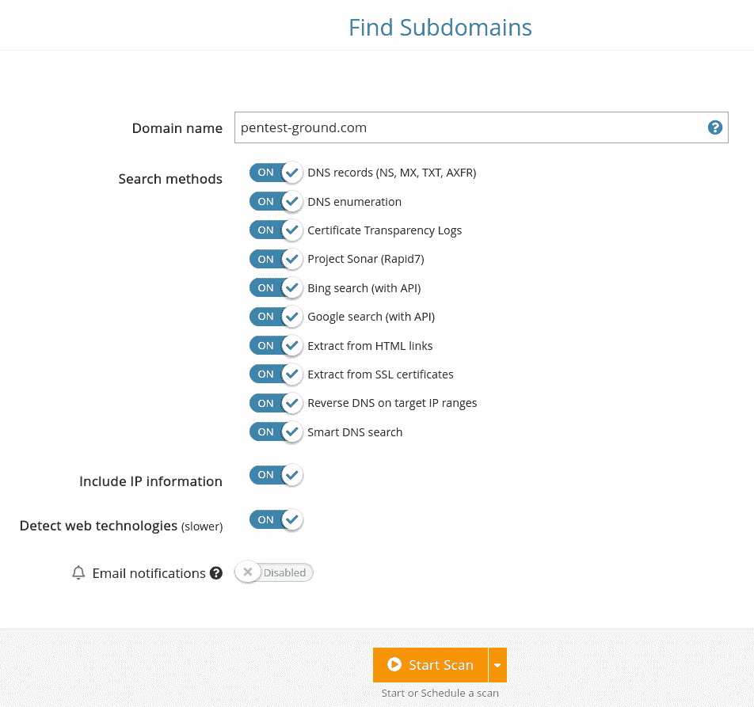 [进入查找子域工具](https://pentest-tools.com/information-gathering/find-subdomains-of-domain)

作为一个发现工具，[查找子域](https://pentest-tools.com/information-gathering/find-subdomains-of-domain)会生成一个……子域列表，但不能保证*能发现所有的子域*。只有当你可以访问该域的 DNS 服务器并查看区域文件时，你才能看到所有的子域。

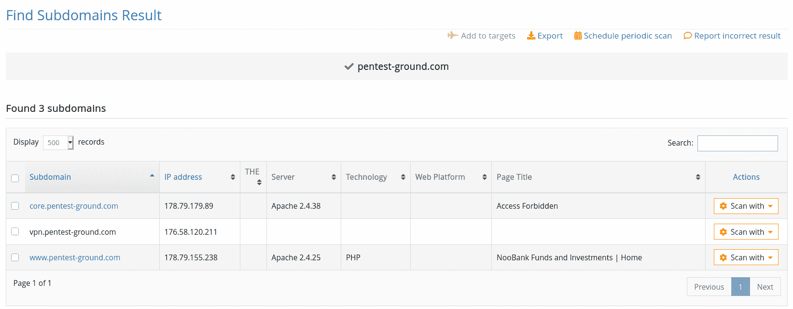

**2。查找虚拟主机[也是可选的]**

## 对于每个 web 应用程序，您还可以运行虚拟主机工具。原因如下。

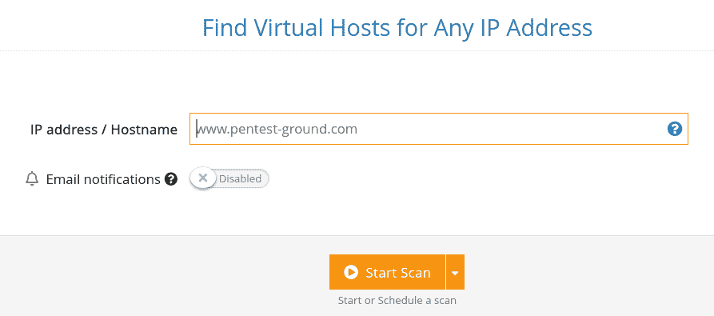 [转到查找虚拟主机工具](https://pentest-tools.com/information-gathering/find-virtual-hosts)

[找到在 web 服务器上运行的所有虚拟主机](https://pentest-tools.com/information-gathering/find-virtual-hosts)(基于其 IP 地址)非常重要，因为每个网站都可能包含影响同一服务器的漏洞。

如果攻击者破坏了其中一个网站，他们很有可能获得对同一服务器上运行的其他网站的未经授权的访问。这就是为什么测试 [*所有*](https://pentest-tools.com/information-gathering/find-virtual-hosts) [虚拟主机](https://pentest-tools.com/information-gathering/find-virtual-hosts)是运行广泛覆盖的渗透测试的必要步骤。

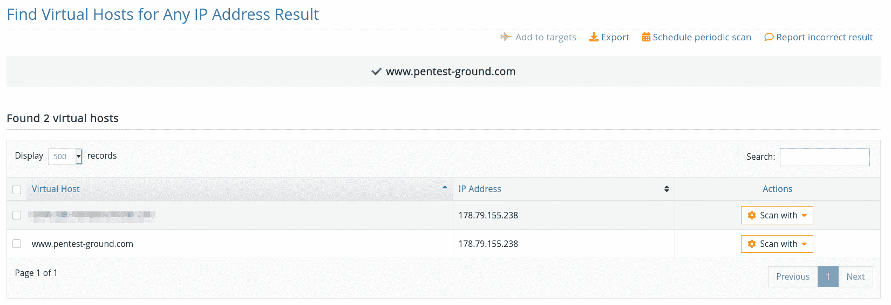

**3。运行 TCP 端口扫描器**

## 了解*哪些*网络服务暴露在互联网上对于保护 web 应用程序至关重要。对每个主机名运行 [TCP 端口扫描器](https://pentest-tools.com/network-vulnerability-scanning/tcp-port-scanner-online-nmap)，检查是否有任何不应该公开访问的开放端口。

例如，不基于预定义的白名单 IP 列表进行过滤的 SSH 服务。

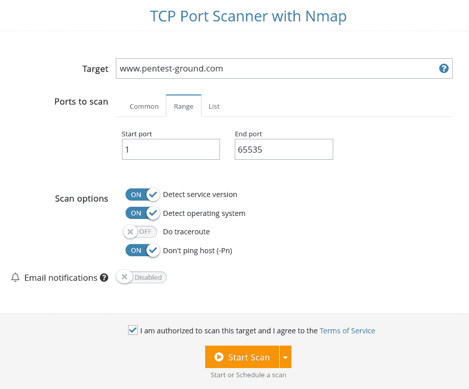 [转到 TCP 端口扫描器](https://pentest-tools.com/network-vulnerability-scanning/tcp-port-scanner-online-nmap)

找到端口列表后，该工具会进行深入检查，以确定该端口上运行的服务的确切类型，包括其版本。这是必要的，因为**公共服务可以在非标准端口**上运行(例如，在端口 32566 上运行的 web 服务器)。

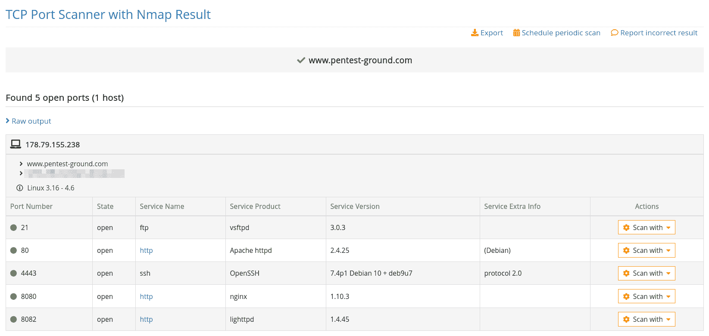

**发现 UDP 端口扫描器的更多问题**

### 尽管 UDP 服务不如 TCP 服务受欢迎，但易受攻击的 UDP 服务会使目标系统面临与易受攻击的 TCP 服务相同的风险。这就是为什么运行 [UDP 端口扫描](https://pentest-tools.com/network-vulnerability-scanning/udp-port-scanner-online-nmap)来发现所有开放的 UDP 端口在渗透测试中非常重要，这样您就可以在安全评估期间实现全面覆盖。

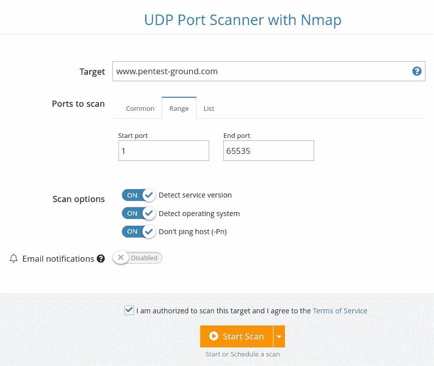 [转到 UDP 端口扫描工具](https://pentest-tools.com/network-vulnerability-scanning/udp-port-scanner-online-nmap)

结果要么是开放的，要么是封闭的。为了确保标记为`open|filtered`的特定端口确实是开放的，您必须启用服务版本检测。
因为此过程有时需要一段时间，所以您应该在后续扫描中执行此操作，并且只针对在第一次简单扫描中报告为`open|filtered`的端口。

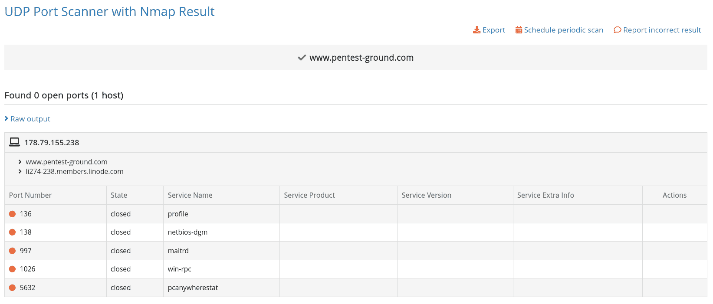 **有用提示**:🤖你可以使用预建的[域侦察机器人](https://pentest-tools.com/features/pentest-robots)来**自动化这些步骤**，它从发现目标域的子域开始。它继续对所有已识别的子域进行全面的 TCP 端口扫描，然后对所有 HTTP/S 端口运行网站侦察，以采集 web 技术的指纹并截图。

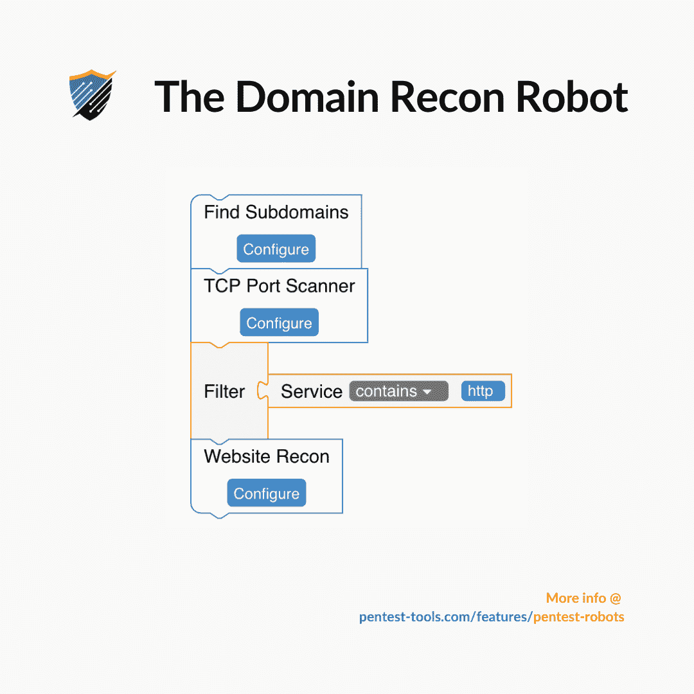

**4。使用网站扫描仪**

## [网站扫描器](https://pentest-tools.com/website-vulnerability-scanning/website-scanner)发现影响 web 应用的常见漏洞，如 [SQL 注入](/blog/sql-injection-attacks)、XSS、操作系统命令注入、目录遍历等。扫描仪还识别特定的**网络服务器配置问题**。

如果你不想发出任何警报，我们建议使用**光扫描**。它是被动的，只对目标系统执行一些合法的请求。然而，正如您所料，光扫描并没有深入到多深的地方，它只是在安全性测试方面触及了表面。在整个过程中，请记住这一点。

**全扫描**更详细，并试图通过各种策略来映射[目标系统的整个攻击面](https://pentest-tools.com/features/attack-surface):抓取应用程序、发现隐藏文件、使用更多攻击媒介来检查服务器配置问题和过时服务等。

注意:一个**全扫描**包括一个**光扫描**执行的所有测试，所以没有必要两个都运行。

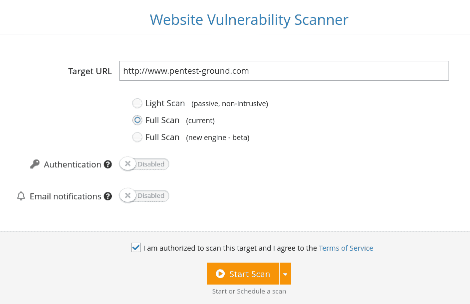 [转到网站漏洞扫描器](https://pentest-tools.com/website-vulnerability-scanning/website-scanner)

[网站漏洞扫描器](https://pentest-tools.com/website-vulnerability-scanning/website-scanner)返回的所有漏洞包括**详细的风险描述**和一个**建议部分**，这使得理解漏洞和学习如何修复它变得很容易。

此外，漏洞的证据还包含攻击媒介，您可以使用它来触发漏洞并验证它。我们有一个单独的、专门的指南，详细介绍了如何用 Pentest-Tools.com 做一个基本的网站漏洞评估，所以你也应该看看。

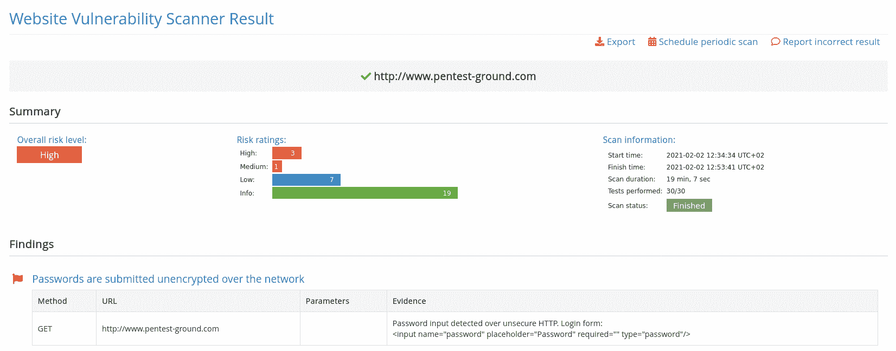

**运行特定的 CMS 扫描仪【可选】**

### 你可以运行一个特定的扫描器——比如针对 SharePoint 的扫描器——来发现这些特定 CMS 的各种安全弱点或过时版本。

**有用提示**:🤖你可以使用我们预建的 [**WordPress 扫描机器人**](https://pentest-tools.com/features/pentest-robots) 来自动化前面两个步骤。首先，它在目标 URL 上运行完整的网站扫描程序，并搜索过时的技术、SQLi、XSS 和其他 OWASP 十大漏洞。如果它发现了 WordPress 技术，它就会运行 [WordPress 扫描仪](https://pentest-tools.com/cms-vulnerability-scanning/wordpress-scanner-online-wpscan)来检测过时的插件、主题等等。

**执行经过验证的网站扫描【如果适用】**

### 如果您的目标应用程序需要身份验证，而您没有启用已验证的扫描，则网站扫描程序仅覆盖一小部分应用程序功能，特别是在用户必须登录之前显示的功能。由于经过身份验证的用户比未经身份验证的用户能够访问更多的功能，您可能会错过发现漏洞的机会，而您只能在登录到应用程序后才能发现这些漏洞。为了获得更深入的结果，我们建议[执行认证扫描](https://www.youtube.com/watch?v=C52vwMdTDqA)。

我们为我们的网站扫描工具提供了**四种认证方法**:**记录、自动、cookies 或标题**。如果您不知道哪一种适合您的目标应用，[请查看我们为您创建的专用指南中的每种身份验证方法的工作原理](/blog/authenticated-scanning)。

**运行 URL Fuzzer**

### [URL Fuzzer](https://pentest-tools.com/website-vulnerability-scanning/discover-hidden-directories-and-files) 通过 fuzzing 方法找到 web 服务器上隐藏的文件和目录。这是一种发现技术，允许您发现不应公开访问的资源(例如/backups、/index.php.old、/archive.tgz、/source_code.zip 等)。

由于“通过模糊实现安全性”不是一个好的实践，你经常可以在 URL Fuzzer 识别的隐藏位置找到敏感信息。

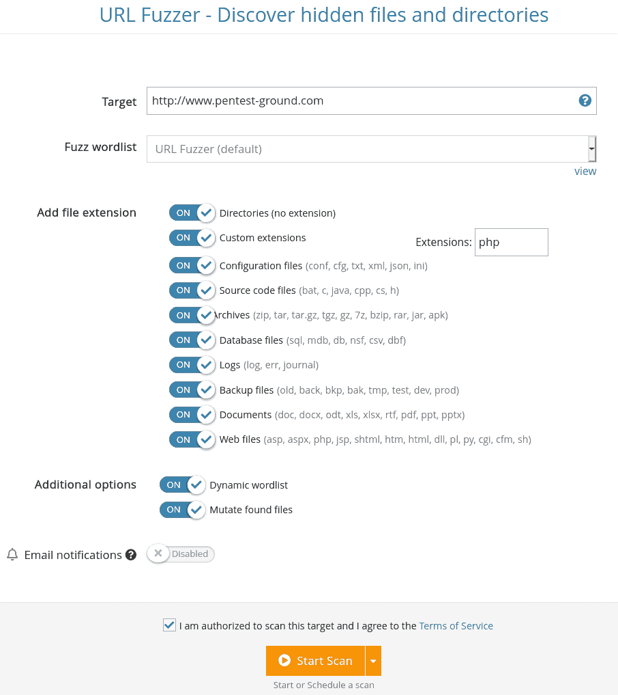 [转到网址模糊器](https://pentest-tools.com/website-vulnerability-scanning/discover-hidden-directories-and-files)

URL Fuzzer 使用一个**单词列表**(我们提供的默认列表或者您可以创建的自定义列表)来发现隐藏的文件和目录。对于添加到列表中的每个单词，如果您选择模糊特定的扩展名，该工具会向`BaseURL/WORD/ or to BaseURL/WORD.EXT`发出 HTTP 请求。

工具发现的文件和目录连同它们的 **HTTP 响应代码和页面大小**一起返回。

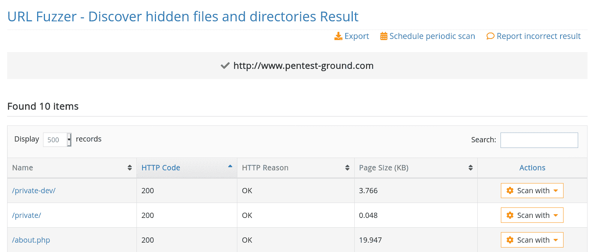

**通过谷歌黑客发现你的目标的敏感数据**

### 另一种找到不应该公开的敏感信息或数据的方法是使用公共搜索引擎。由于这些引擎已经从互联网上收集了几乎每个网站的大量信息，所以**进行特定的查询**并从中获取相关数据是一个好主意。

在 Pentest-Tools.com，你可以使用免费的谷歌黑客工具来快速运行查询，并扩展你挖掘有趣发现的能力。

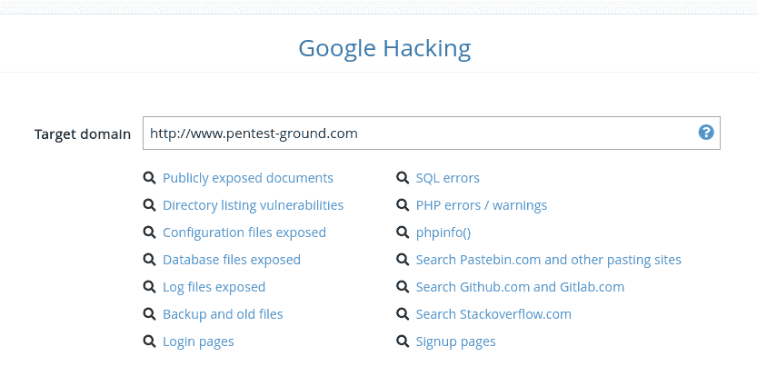 **有用提示**:Pentest-Tools.com 上的[攻击面](https://pentest-tools.com/features/attack-surface)从我们提到的所有扫描仪中提取数据。它会自动将扫描结果汇总到一个统一的集中视图中，让您全面了解目标的开放端口、服务以及与您的侦察工作相关的其他详细信息。

**5。执行密码审计**

## 对于需要认证的应用程序或 web 服务器，**通过尝试输入**单词列表**中的用户名和密码组合来检查正在使用的弱证书**。Pentest-Tools.com 上的单词列表为您提供了一个常用凭据的列表，但是您也可以设置、更新和管理自己的用户名/密码组合列表，以便更快地检测出弱项。

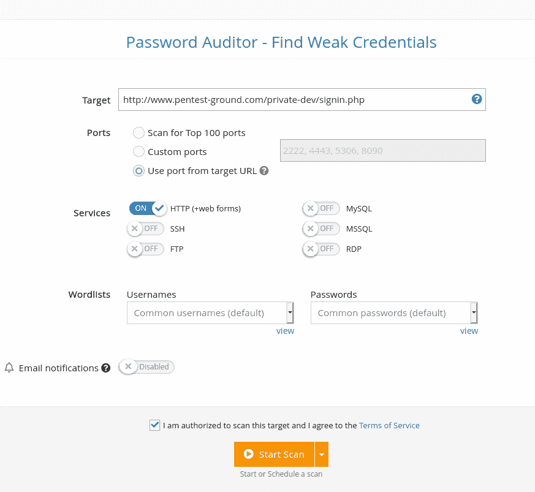 [转到密码审计工具](https://pentest-tools.com/network-vulnerability-scanning/password-auditor)

[密码审计器](https://pentest-tools.com/network-vulnerability-scanning/password-auditor)的独特优势之一是它可以检测网络应用程序中的网络表单，并且**会自动尝试使用给定的凭证登录**。它能够检测 web 表单认证是否成功，从而简化您的工作流程并消除手动检查的需要。

因此，您可以很容易地找到带有弱密码的 web 接口(例如 Jenkins、Tomcat、PhpMyAdmin、Cisco 路由器等。)以及 SSH、FTP、MySQL、MSSQL、RDP 等网络服务。其中也设置了默认凭据。

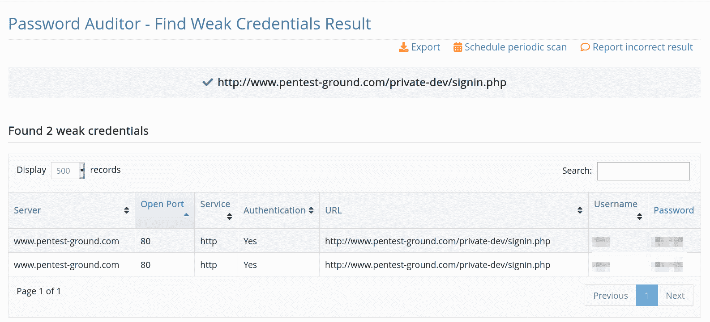 **有用提示**:🤖你也可以用**Auto HTTP log in brute forcer Robot**一次性运行整个测试序列。这个 [pentest 机器人](https://pentest-tools.com/features/pentest-robots)试图发现受密码保护的 URL(使用基本的 HTTP 认证-代码 401 ),并试图使用一系列常用用户名和密码进行自动暴力攻击。该测试针对目标主机的所有 HTTP/S 端口执行。

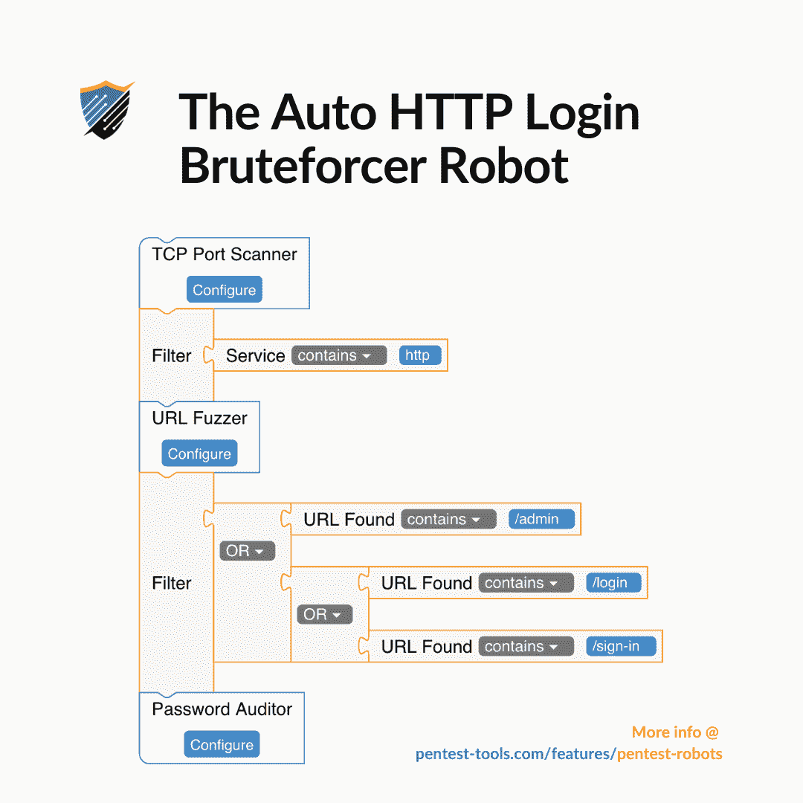

**6。使用 OpenVAS 运行网络漏洞扫描程序**

## 由于带有 OpenVAS 的[网络漏洞扫描器](https://pentest-tools.com/network-vulnerability-scanning/network-security-scanner-online-openvas)可帮助您检测网络服务、操作系统以及 web 服务器中的各种漏洞，因此其使用案例非常多样。确保测试您的每台服务器，以充分利用其功能。

如果您在内部网络中也有任何私有服务器(例如用于测试环境)，您可以[使用我们的 VPN 代理](/blog/feature-scan-internal-networks-vpn-agent)在我们的扫描工具和您的目标网络之间创建一个安全隧道。这样，您可以绕过本地网络限制，使用我们的工具从外部 IP 地址进行扫描。当你进行到这一步时，我们将通过一个方便的教程向你展示[配置 VPN 代理](https://support.pentest-tools.com/en/vpn-profiles/internal-network-scan-vpn-agent)并在 Pentest-Tools.com 上创建一个新的 VPN 配置文件是多么容易。

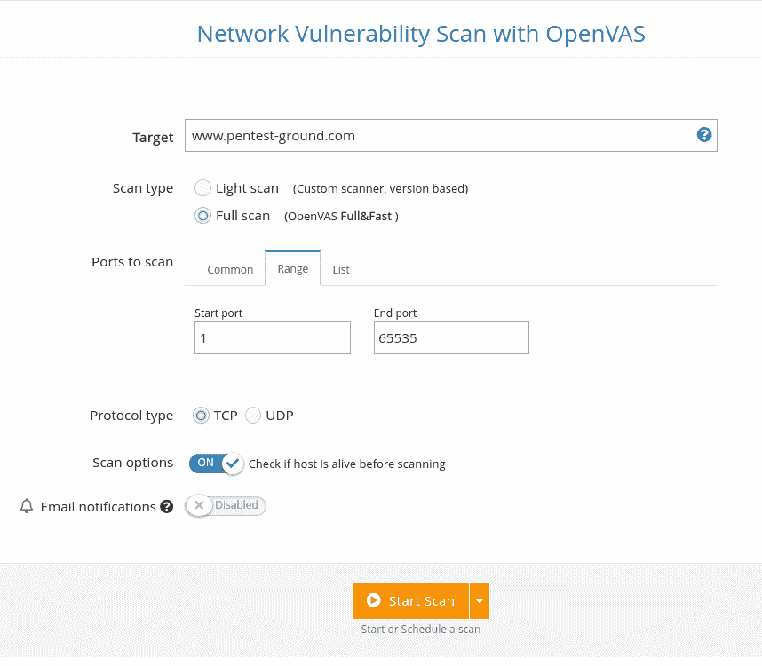 [使用 OpenVAS 进入网络漏洞扫描器](https://pentest-tools.com/network-vulnerability-scanning/network-security-scanner-online-openvas)

**快速提示**:如果扫描仪没有找到任何开放端口，即使您知道有一些，我们建议您禁用**选项**并重新运行扫描。这将跳过主机发现阶段，直接开始端口扫描。

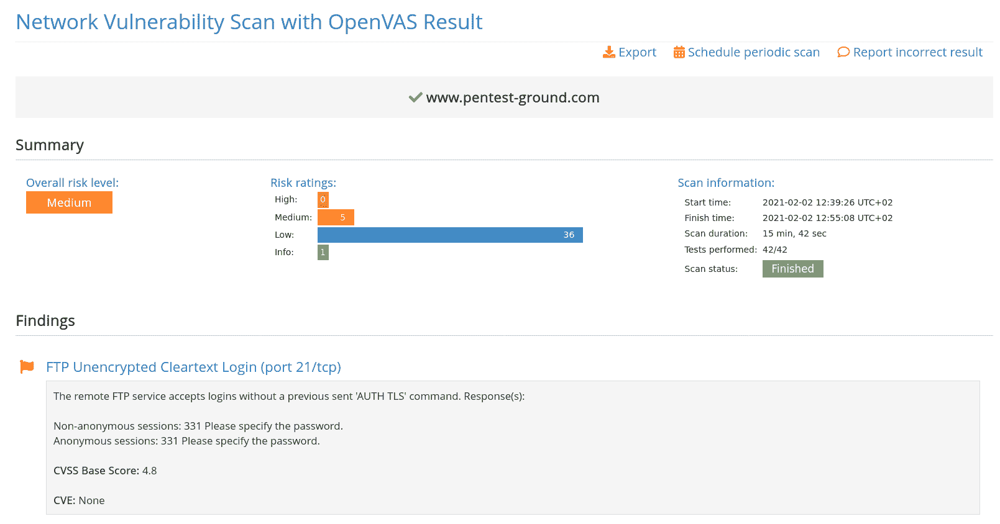

**7。检查 SSL/TLS【可选】**

## 对于没有托管在 Azure 或 AWS 等主要平台上的应用程序，您还可以使用我们专用的 [SSL/TLS 漏洞扫描器](https://pentest-tools.com/network-vulnerability-scanning/ssl-tls-scanner)来**检查 SSL 或 TLS 配置问题**。

该工具对目标的 SSL/TLS 服务的配置执行安全评估，提供它发现的安全缺陷和漏洞的列表，为您提供详细的补救建议。

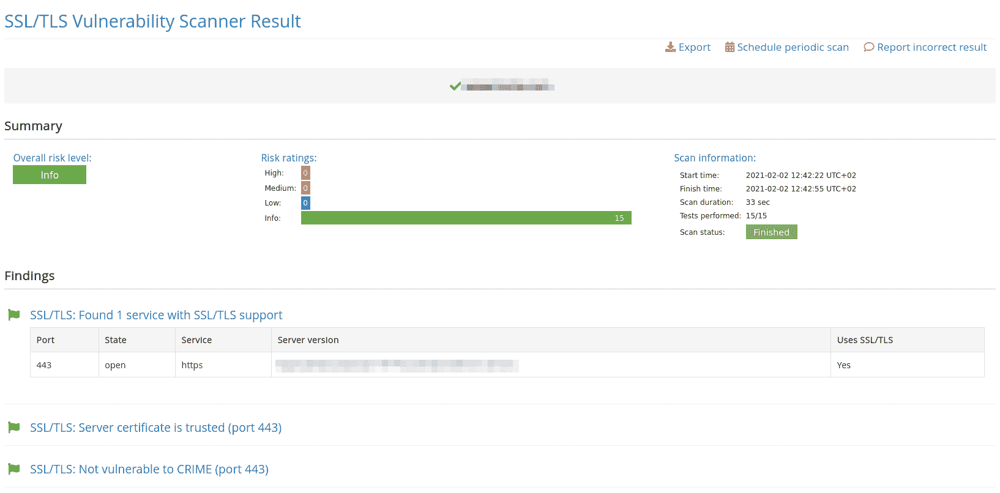 **有用提示**:您可以创建**扫描模板，自动运行本指南中提到的大多数工具**。扫描模板允许您链接多个工具和平台功能，以便按照您设计的顺序一次启动它们。

扫描模板和之间的主要区别是🤖 [pentest robots](https://pentest-tools.com/features/pentest-robots) 模板将运行所有扫描，即使有些扫描不适用于目标，而 robots 协调多个工具并按顺序运行它们，遵循您在过滤器中实现的逻辑。

**8。验证调查结果并从您的帐户生成报告**

## 通过使用我们的**漏洞管理功能**(您的 Pentest-Tools.com 仪表板的调查结果部分)，您可以验证调查结果、更改其风险级别(如果适用)、将其标记为已修复或已忽略，以及[通过从多个扫描器中选择调查结果来生成高级报告](https://pentest-tools.com/usage/pentest-reporting-tool)。您可以单独管理调查结果，挑选出最近的结果，并批量编辑它们，以节省大量时间和手动工作。

如果你有 3 分钟多一点的时间，看看下面的视频。

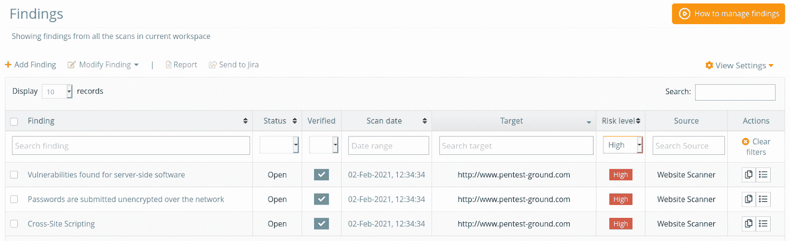 [看看先进的 Pentest 报道如何在 Pentest-Tools.com 运作](https://pentest-tools.com/usage/pentest-reporting-tool)

如何使用 pentest-Tools.com 快速准确的 Pentest 报告生成可编辑的 Pentest 报告

如何使用 pentest-Tools.com 快速准确的 Pentest 报告生成可编辑的 Pentest 报告

**重要提示**:为了确保扫描程序正常运行，**将以下 scanners.pentest-tools.com 的 FQDN 列入白名单**。该主机名解析我们的扫描服务器使用的多个 IP 地址。点击这里查看[IP 地址的完整列表](https://support.pentest-tools.com/en/getting-started/source-ip-addresses)。

<template x-if="showVideo"></template>

利用你独特的经验和专业知识来建立联系

## 将安全风险转化为业务风险

并提出有说服力的观点，帮助决策者根据你的建议采取行动。

*   有了这个循序渐进的指南和你在[Pentest-Tools.com](https://pentest-tools.com)上的完整工具箱，你现在已经准备好像专家一样执行完整的网站漏洞评估了！

*   因为处理漏洞有时感觉像踩水，我鼓励你宣扬持续扫描系统的好处。Pentest-Tools.com 背后的团队不断努力在平台上添加新功能和改进工具，以便您可以专注于完成工作。

*   并提出有说服力的观点，帮助决策者根据你的建议采取行动。

*   有了这个循序渐进的指南和你在[Pentest-Tools.com](https://pentest-tools.com)的完整工具箱，你现在已经准备好像专家一样执行完整的网站漏洞评估了！

因为处理漏洞有时感觉像踩水，我鼓励你宣扬持续扫描系统的好处。Pentest-Tools.com 背后的团队不断努力在平台上添加新功能和改进工具，以便您可以专注于完成工作。

Because dealing with vulnerabilities sometimes feels like treading water, I encourage you to preach the good word of continuously scanning systems. The team behind Pentest-Tools.com constantly works to add new features and improve the tools on the platform so you can focus on getting stuff done.