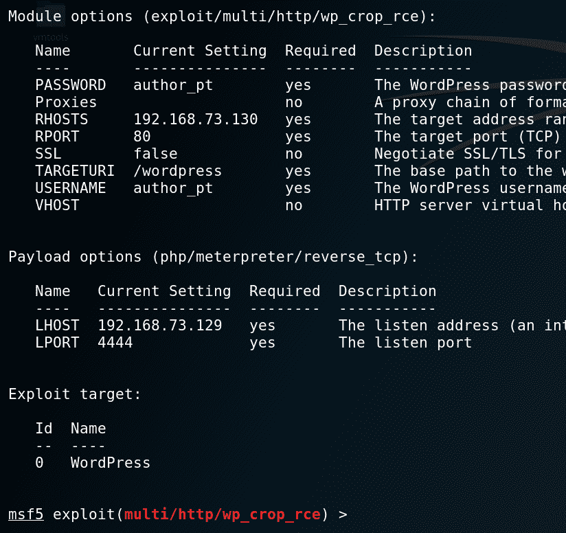

# 对 WordPress 远程代码执行攻击的分析| Pentest-Tools.com

> 原文：<https://pentest-tools.com/blog/wordpress-remote-code-execution-exploit-cve-2019-8942>

这篇文章展示了我们对针对 WordPress 5 . 0 . 0 及更低版本的已知攻击(2019 年 2 月提交)的分析，该攻击授予入侵者在 web 服务器上执行[任意代码的权限](https://pentest-tools.com/blog/log4shell-scanner-detect-cve-2021-44228)。本文涵盖了成功攻击所需的每个攻击步骤和 HTTP 请求。

我们将看到在 WordPress 5.0.0 中，路径遍历和本地文件包含漏洞的组合如何导致 **RCE。**

为了便于浏览，本文分为以下几个部分:

1.  [**背景**](#1-background)

2.  [**目标配置**](#2-target-configuration)

3.  [**CVE-2019-8942 的根本原因是什么？**](#3-what-is-the-root-cause-of-cve-2019-8942)

4.  [**HTTP 利用请求**](#4-http-requests-for-exploitation)

5.  [**现有战功**](#5-existing-exploits)

6.  [**如何缓解漏洞？**](#6-how-can-you-mitigate-the-vulnerability)

7.  [**检测使用 Pentest-Tools.com**](#7-detection-using-pentest-toolscom)

## **1。背景**

作为最受欢迎的内容管理系统，WordPress 经常成为黑客的攻击目标。易受攻击的 CMS 是攻击的诱因，这可能导致危及底层服务器的安全。

该攻击将 WordPress 中的路径遍历和本地文件包含(LFI)漏洞联系在一起。这些漏洞是由 RipsTech 在 2019 年 2 月发现的，西蒙·斯坎内尔在他们的博客上发布了[。](https://blog.ripstech.com/2019/wordpress-image-remote-code-execution/)

他们在 [MITRE 的](http://cve.mitre.org/)常见漏洞和暴露中的描述如下:

**CVE-2019-8942**

```
WordPress before 4.9.9 and 5.x before 5.0.1 allows remote code execution because an `_wp_attached_file` Post Meta entry can be changed to an arbitrary string, such as one ending with a .jpg?file.php substring. An attacker with author privileges can execute arbitrary code by uploading a crafted image containing PHP code in the Exif metadata. Exploitation can leverage CVE-2019-8943
```

**CVE-2019-8943**

```
WordPress through 5.0.3 allows Path Traversal in wp_crop_image(). An attacker (who has privileges to crop an image) can write the output image to an arbitrary directory via a filename containing two image extensions and ../ sequences, such as a filename ending with the .jpg?/../../file.jpg substring.
```

**开采要求:**

要成功执行此攻击场景并利用这两个漏洞，需要满足以下条件:

## **2。目标配置**

我们在 Ubuntu 虚拟机上安装了一个易受攻击的 WordPress 实例(v5.0.0)。在开始安装 WordPress 之前，确保将这两行添加到 wp-config.php 文件中:

```
define('AUTOMATIC_UPDATER_DISABLED',true);

define('WP_AUTO_UPDATE_CORE',false);
```

添加两行是必要的，因为它们禁用了 WordPress 中的自动更新。否则，CMS 实例会以无人值守的方式安装不受这两个漏洞影响的最新版本。

一旦你运行了 WordPress，通过查看管理面板，确保它是正确的版本:

现在我们必须创建一个具有作者角色的新用户:


## **3。CVE-2019-8942 的根本原因是什么？**

**简短版本:**帖子元条目可以被覆盖。

**长版:**一个 WordPress 网站的构建块叫做模板文件。它们定义了内容在网页上的显示方式。

博客与博客文章或帖子是一回事，可以有各种格式:音频、图像、链接、引用、视频、图库等等。一篇文章可能包含多个元素:标题、文章撰写的日期、正文、作者和关于文章的其他数据；所有这些都是帖子的附加信息，也称为元数据。

我们以一个图片帖子为例。在 WordPress 4.9.9 和 5.0.1 之前，一张图片更新时，调用`edit_post()`函数，直接作用于`$_POST`数组。该数组包含多个元素，如标题、内容、帖子的日期等，但更重要的变量是`meta_input`、`file`和`guid`。

在 WordPress 易受攻击的版本中，`wpupdatepost`函数直接将$post *数据作为参数，而不检查不允许的 post 数据字段。因此，拥有作者权限的用户可以通过恶意覆盖 meta* 输入参数来更改帖子的元数据。


## **4。利用漏洞的 HTTP 请求**

只需要 4 个 HTTP POST 请求就可以利用这两个漏洞并获得远程代码执行，如以下步骤所述:

基本上，我们将上传包含 PHP 代码的图像文件。然后我们改变它的一个元数据`wpattached_file`，使它包含一个路径遍历有效载荷(`?/../../../../themes/twentynineteen/shell`)。

当裁剪图像时，它的元数据被修改，并且在存储其他模板文件的`themes/twentynineteen`目录中自动创建一个名为 cropped-shell.jpg 的副本。

最后，通过用图像的裁剪版本作为模板创建一个新的图像帖子，我们确保了 PHP 代码在博客帖子打开时被执行。

### **请求顺序**

1.上传包含 PHP 代码的图片。该图片名为 **image *，文件名为* php_code.jpg** ，大小为 262×192 像素。

请求:

响应包含为图像新创建的`post_ID`:

 2。通过将图像的元数据`meta_input`更改为`2019/05/imagewithphp_code.jpg?/../../../../themes/twentynineteen/shell`来编辑图像

请求:

回应:

 3。我们裁剪图像(新尺寸:262×192)。这是一个假裁剪，因为图像的大小不会改变。

请求:

回应:

因为图像文件现在带有修改后的元数据，所以副本会自动保存在 themes/twenty 19 目录中。

 4。现在我们使用模板`cropped-shell.jpg`发布一篇文章

请求:

收到以下回复:


### **查看结果**

此时，我们只需查看新发布的帖子，就可以看到执行 PHP 代码的结果。以下是 Burp 中的 HTTP 响应:

这是它在网络浏览器中的样子:

## **5。现有漏洞**

目前，有两个公开利用实施这一攻击。

### **漏洞利用#1**

[JavaScript 漏洞利用](https://www.exploit-db.com/exploits/46511/):该漏洞利用将以下命令注入 JPEG 图像的 EXIF 元数据:`<?php phpinfo();/*`

下面你可以看到一段来自公开漏洞的摘录，其中包括 JPEG 图像的十六进制数据。占位符`\x07PAYLOAD`将被上述命令替换。这个占位符有一个有限的大小，这就是为什么我们需要 18 个字符或更少的有效载荷。

可以缩短命令`<?=phpinfo();?>`而不改变结果。下面你可以看到精心制作的图像的 hexdump，包含我们的有效载荷:

我们决定利用这段代码，把它变成在服务器上运行命令的入口点。有效载荷的新形式将是:`<?=$_GET[0];?>`

当有效负载被执行时，攻击者可以使用这个 URL 运行任何命令:`http://localhost/wordpress/index.php/2019/05/07/rce-45/?0=id`

一个更强大的 shell 需要更大的有效负载，这是不可能通过注入 JPEG 文件的 EXIF 数据实现的；但是有一种方法可以绕过这个限制。为此，我们通过滥用上面的 URL 创建了一个新的 PHP 文件。

我们希望在服务器上创建一个包含以下内容的`shell.php`文件:

`<?php passthru($_GET[0]);?>`

我们能够做到这一点，并通过使用 base64 方案对内容进行编码来避免转义特殊字符。但是，encoding 在字符串末尾添加了一个“+”号；这破坏了 URL，因为浏览器将“+”视为空格字符，就像“%20”一样解决方案是使用 base64 对有效载荷进行双重编码。


最终我们得到了下面的字符串:`UEQ5d2FIQWdjR0Z6YzNSb2NuVW9KRjlIUlZSYk1GMHBPejgr`；然后，我们将编码的内容包含在 URL 中，并获得了以下字符串:

http://localhost/WordPress/index。PHP/2019/04/18/rce-38/？0= `echo UEQ5d2FIQWdjR0Z6YzNSb2NuVW9KRjlIUlZSYk1GMHBPejgr|base64 -d|base64 -d > shell.php`

新创建的后门可以直接从 WordPress 的根文件夹中调用。

### **漏洞利用#2**

[Metasploit 模块](https://www.exploit-db.com/exploits/46662/)–`exploit/multi/http/wpcroprce`

Metasploit 模块很简单，需要凭据才能作为作者向 WordPress 的易受攻击实例进行身份验证。

设置阶段:

剥削阶段: 

在调查这两个漏洞时，我们发现`wp‑includes/media.php`文件包含一个名为`wpimageeditorchoose`的函数，该函数检查是否至少有 **ImageMagick** 或 **GD** 图像库可以使用；前者的优先级高于后者。

这里的关键是，虽然 ImageMagick 保留了图像的 EXIF 元数据，但 GD 在处理(裁剪/调整大小/编辑)图像时会删除它，因此有效负载不再可用。

下面的截图显示了` <?=phpinfo();?&gt`；GD 库处理图像时不执行代码，因为它剥离了 EXIF 元数据:

所以如果想给自己的图片添加 PHP 有效载荷，需要确保安装了 ImageMagick 否则，您将不知道裁剪操作后有效载荷是否仍存在于 EXIF 元数据中。

要安装`php-imagick`,您可以在终端中运行以下命令:

```
$ sudo apt-get install php-imagick
```

**注意！**我们在分析漏洞链时观察到的另一个有趣现象是，为 Metasploit 编写的漏洞也可以与 GD 一起使用(ImageMagick 不需要存在于系统中)。此漏洞利用所使用的图像中插入的 PHP 代码在调整大小后仍然存在，并且可以在裁剪后的文件中找到。

## **6。您如何缓解该漏洞？**

简短回答:总是将你的 WordPress 安装更新到最新版本。

**长回答:**从代号为“Betty”的 WordPress v5.1 开始，有一个名为`wpgetallowedpostdata`的新函数，它只返回允许的 post 数据字段，并从 post 数据数组中删除`meta_input`、`file`和`guid`字段。

函数`wpgetallowedpostdata`以后称为:

和`wpupdatepost`函数把新清理的变量`$translated`作为参数。

为了更好地理解`$post_data`和`$translated`变量内容的不同，我们在 post.php 文件中插入了两个钩子；这将两个变量的内容重定向到`/var/log/apache2/error.log`。

`errorlog(“DEBUG – postdata variable: “.varexport($postdata,TRUE));`

 `errorlog(“DEBUG – translated variable:”.varexport($translated,TRUE));`

很容易看出`$translated`变量不包含上面突出显示的`meta_input`字段。

我们使用了 [WordPress 漏洞扫描器](https://pentest-tools.com/cms-vulnerability-scanning/wordpress-scanner-online-wpscan)来检查我们的测试 WordPress 版本是否容易受到 CVE-2019-8942 的攻击。我们通过将扫描仪对准我们 VM 中的 WordPress 安装(因此是 http://127.0.0.1)并检查结果来做到这一点。

如上图所示，漏洞检测结果为阳性。

## **参考文献和致谢**

感谢西蒙·斯坎内尔回答了我的一些问题。