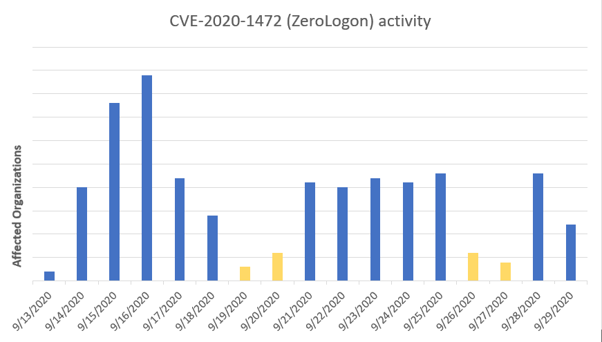
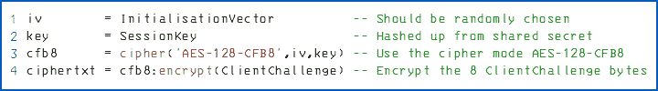
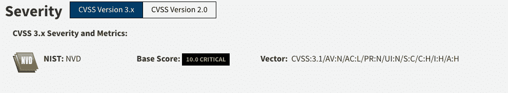
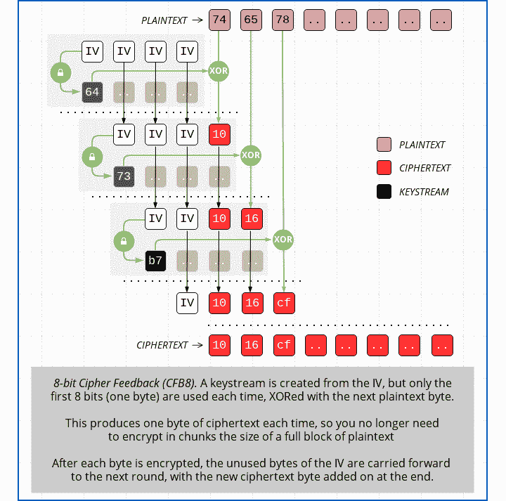

# 为什么 Zerologon 是您网络中的无声威胁| Pentest-Tools.com

> 原文：<https://pentest-tools.com/blog/zerologon-vulnerability-chaining>

没有危险信号。没有警报。完全妥协。

网络犯罪分子将微软基础设施中的各种漏洞整合在一起的方式，包括 **Zerologon 漏洞** (CVE-2020-1472)，不仅仅是信息安全社区中的一个热门话题。这对大大小小的组织都是一个巨大的威胁。

对于大多数组织来说，修补的平均时间跨越几个月，这种漏洞和对手的方法将在未来至少几个业务季度增加安全和 IT 人员的压力。

让我们解释一下为什么会发生这种情况，这样你就可以更深入地了解你的防御选项。

**什么是 Zerologon 漏洞？**

Zerologon 是 Microsoft Netlogon 进程的加密功能中的一个缺陷。它为精心策划针对 Microsoft Active Directory 域控制器的攻击打开了一个缺口，攻击者可以访问这些域控制器。以这种方式操纵域控制器意味着恶意参与者可以使用管理员权限管理环境。

*从 9 月 13 日开始，红队和真正的攻击者尝试利用零登录的组织*

*来源:[微软](https://techcommunity.microsoft.com/t5/microsoft-365-defender/zerologon-is-now-detected-by-microsoft-defender-for-identity-cve/ba-p/1734034)*

该漏洞的核心存在于初始化向量(IV)中，当登录过程始终被设置为全零时发生，而最初，它应该始终是一个随机数。通过这种方式，攻击者可以简单地组织攻击，然后直接进入业务领域。他们可以**冒充任何连接到被入侵网络的计算机或数字设备**。

*微软称之为 Netlogon 凭证计算*

 *来源:[裸保](https://nakedsecurity.sophos.com/2020/09/17/zerologon-hacking-windows-servers-with-a-bunch-of-zeros/)*

在 CVE 上，此漏洞的分数是关键的 10.0。

来源: [NIST NVD](https://nvd.nist.gov/vuln/detail/CVE-2020-1472)

## **漏洞的来源**

2020 年 9 月，为 Secura 工作的荷兰研究人员 Tom Tervoort 发现了 **Zerologon 检测**。在他的研究中，他提到了潜伏在周围的各种其他漏洞，他的分析导致了我们今天所知的 Zerologon。
微软已经在 2020 年 8 月针对该漏洞部署了两个补丁。

## **使用 Zerologon 的攻击如何工作**

Zerologon 漏洞使得攻击者能够控制域控制器(DC)以及根 DC。鉴于黑客已经渗透到网络中，他们可以通过**移除或更改控制器上的服务帐户**的凭证来轻松控制 DC。

之后，黑客就可以对网络为所欲为了。例如，他们可以发起拒绝服务攻击，彻底摧毁整个网络。

<template x-if="showVideo"></template>

但是在恶意黑客利用这个漏洞之前，他们必须能够在 DC 内建立 TCP(传输控制协议)会话。有许多方法可以做到这一点:在网络内部，坐在用户的桌子上，或者坐在会议室里。这些被称为**内部攻击**,是目前企业最昂贵的入侵类型。但是，要利用 Zerologon 漏洞，黑客不需要在网络内部。他们可以在外部，但是能够建立到控制器的 TCP 会话。

*来源:[裸保](https://nakedsecurity.sophos.com/wp-content/uploads/sites/2/2020/09/zlo-cfb8-720.png)*

Tervoort 在研究中还发现了其他东西:攻击路径使用 AES-CFB8，固定 IV 为 16 个字节的零，因此每使用 256 个密钥就会创建一个值全为 0 的密文。对于攻击者来说，这些只是少量的密钥，他们试图创建一个全是零的密文，对手只需要 2-3 秒就可以完成。

## **Zerologon 漏洞链——更大的问题**

CISA(网络安全和基础设施安全局)也警告说，有多个案例表明，攻击者在野外利用 Fortinet 安全套接字层 VPN 漏洞( [CVE-2018-13379](https://nvd.nist.gov/vuln/detail/CVE-2018-13379) )来获取网络访问权限。它还指出，攻击者正在积极利用 MobileIron 漏洞( [CVE-2020-15505](https://nvd.nist.gov/vuln/detail/CVE-2020-15505) )来达到同样的目的。
在利用这两个漏洞获得对系统的初始访问权限后，恶意行为者利用 Zerologon 来危害活动目录的身份服务，并通过 RDP 和 VPN 等远程访问工具对其进行操作。使用泄露的凭据可以让他们完全访问环境。
来自 Pulse Secure([CVE-2019-11510](https://nvd.nist.gov/vuln/detail/CVE-2019-11510))、Juniper ( [CVE-2020-1631](https://nvd.nist.gov/vuln/detail/CVE-2020-1631) )、Palo Alto Networks([CVE-2020-2021](https://nvd.nist.gov/vuln/detail/CVE-2020-2021))和 Citrix NetScaler([CVE-2019-19781](https://pentest-tools.com/blog/tool-to-detect-citrix-vulnerability))的产品中的其他类似安全问题可以与 Zerologon 链接，以实现类似的结果。

## **为什么您应该关注漏洞链的风险**

了解背景很重要，因为这不是一个简单的用户在这里过日子，而是一个动机很强的攻击者。
如果与域控制器通信的机器属于普通用户，那么根本不会有问题。网络认证过程将起作用，并删除结构不良的文本。由于我们面对的是试图积极利用漏洞的对手，漏洞链的风险很高，因为他们知道自己在做什么。对于一名普通员工来说，零登录检测是一项艰巨的任务。需要一个在这个领域非常有经验的人来考虑对公司安全的更广泛的影响。

让我们将整个过程分解成几个关键步骤:

### **1。不当锁定限制导致的欺骗**

Tervoort 发表的报告提到，恶意黑客必须首先伪造为入侵者计划操纵的企业工作的客户的密码。
由于 IV 在 MS-NRPC([Netlogon Remote Protocol](https://docs.microsoft.com/en-us/openspecs/windows_protocols/ms-nrpc/19896c1c-7e64-419b-a759-a9dc5662a780))中的糟糕实现，只需要大约 **256 次尝试就能找到正确的凭证集。这给了攻击者一个优势，因为无论他们尝试多少次，在 3 次密码猜测尝试后，客户的帐户不会像普通用户那样被锁定。
这是这里可能发生的对攻击者有利的完美事情:他们可以在短时间内**无限制地尝试获得正确的凭证**。他们所需要的是找到一个能产生全零密文的密钥。**

### **2。禁用签名和盖章–更简单，因为它是可选的**

到目前为止，对手只能提取一个客户帐户的正确凭证，但他们仍然不知道会话的实际加密密钥。这里的下一步是**禁用签名和盖章。**
签名和密封是一种用于在 MS-NRPC 内传输加密的机制。这似乎是一个合乎逻辑的过程找到那里，所以我们更多的数据可以在传输中加密。但是在 MS-NRPC 中，这仅仅是一个可选的特征，可以通过简单地不在报头或通知部分中设置任何标志来开启或关闭。
因此，当攻击者关闭签名和密封时，确保每一盎司数据在传输时都被加密的唯一检查和平衡系统被抢走了。

这导致消息被公开发送，没有任何加密。因此，对手可以随心所欲地操纵这些数据，**更改密码值，完全删除它们，或者为客户端设置新的登录过程。他们可以做任何他们想做的事情(T21)..**

### **3。在不触发任何警报的情况下更改凭证**

成功利用 Zerologon 的第三步，也是最后一步，是更改客户端假冒帐户的凭据。
最有效的策略是欺骗活动目录服务器，或者更好的是，接近根广告服务器。为了更改密码，攻击者使用 MS-NRPC 中的消息 **NetServerPasswordSet2** 。他们还可以通过发送带有只有他们(恶意参与者)知道的首选新密码的帧来做到这一点。

因此，即使客户端知道他们的旧密码(对他们来说是有效的密码),他们也不能做任何事情，因为新密码已经被对手设置和获取了。对于恶意黑客来说，最狡猾的事情就是不发出任何危险信号。这就像在没有警报或警笛响起的情况下完成了一次抢劫——永远不会。这是一次完美的黑客攻击，也正是这一点使得这个漏洞变得难以想象的危险。
网络罪犯在这里可以尝试的另一件事是**完全删除密码或将其设置为空值**。这样，他们可以照常登录。

但是假设攻击者的目标是网络上的任意一台计算机。那样的话，**电脑本身就无法登录了。**因此，攻击的第一个后果——众多后果中的第一个——是针对该计算机的简单的拒绝服务攻击。

## **CVE-2020-1472(zero logon)的补丁**

[CISA](https://www.cisa.gov/) 建议微软和其他使用登录过程的企业发布必要的补丁并安装这些更新，以控制该漏洞并作为 **Zerologon 修复**。
微软已经在 2020 年 8 月发布了[两套与众不同的补丁](https://portal.msrc.microsoft.com/en-us/security-guidance)，更多更新将适时推出。由于没有强制性的准则或规定来签名和盖章，攻击者可以利用 **Zerologon 漏洞**，同时防止组织检测到 **Zerologon 攻击**，因为没有任何危险信号。

微软决心在 2021 年 2 月发布一个补丁，强制签名盖章。根据微软发布的补丁设置，研究人员估计，组织最终安装补丁平均需要大约 60 到 150 天，或者大约 5 个月的整数。这其间又被称为 [**或**](https://securityintelligence.com/posts/how-do-you-measure-the-success-of-your-patch-management-efforts/)MTTP。

在同一个话题上，尽管微软发布了针对 Zerologon 攻击的新补丁，但它不会成为解决这个问题的通用补丁。因此，微软愿意最早在 2021 年 2 月发布第二阶段的补丁，其中将包括强制执行功能。

届时，根据微软的说法，所有设备都将被要求使用安全通道模式。如果他们中的一些人不使用它，那么这些特定的设备将被立即拒绝访问。但是，如果网络上有旧的不兼容设备，网络和安全专家必须手动将它们添加到明确允许访问不兼容设备的组策略中。

希望当微软的新补丁进入市场时，Zerologon 漏洞及其引发的所有相关问题都将成为过去。

在此之前，我们将随时更新本指南，提供您需要了解的所有信息！