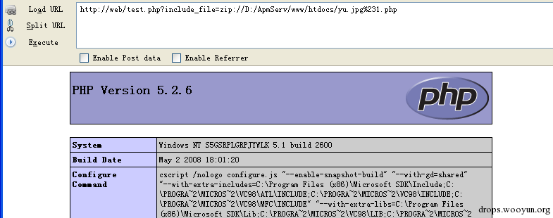
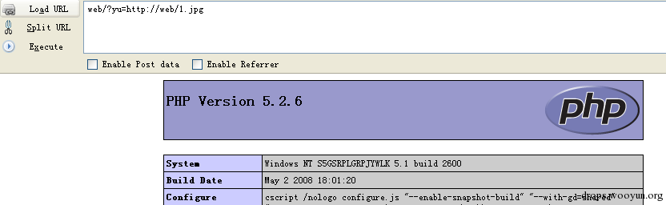
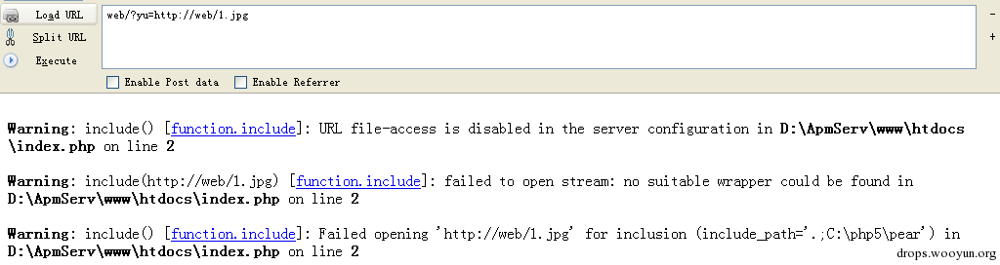
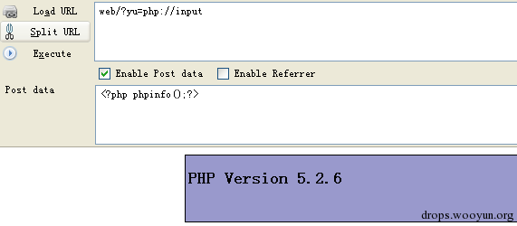
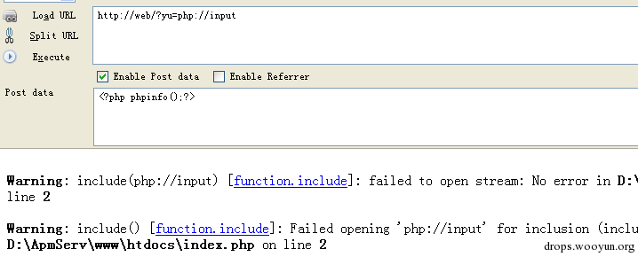
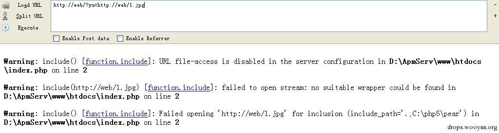
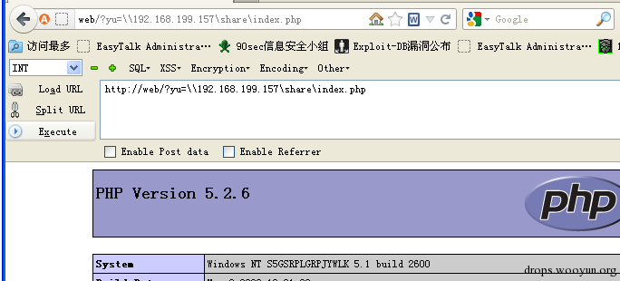

# 0x02 包含漏洞

* * *

这里再来谈一下包含

其实包含也并没有什么好说的。

包含一般也就分为 LFI RFI local file inclusion 和 remote 嘛

对于 LFI 的话 因为很多都限制了包含的后缀结尾必须为.php Include ($a.'.php') 例如这种的

所以我们想包含我们的图片马儿的话 那么就需要截断后面的这.php

1: 00 截断 需要 gpc off && php<5.3.4 2: 长文件名截断 反正这个我很少成功。 3: 转换字符集造成的截断 这个对包含的话基本用不上。上传的话 就是 felixk3y 牛发的那个转换字符集造成的上传截断那个。

还有一些 cms 限制包含的后缀必须为.php 的时候用的是截取字符判断是不是.php 例如下面一段简单的代码

```php
$include_file=$_GET[include_file];
if ( isset( $include_file ) && strtolower( substr( $include_file, -4 ) ) == ".php" )
{   
require( $include_file );
} 
```

对传递过来的截取了后面 4 个字符 判断是不是.php 如果是.php 才进行包含。

这里可以用 zip(或者 phar)协议嘛(当然这个也是找 laterain 学的 哈哈)。

首先新建一个 1.php 里面随便写个 phpinfo 把

然后压缩成.zip 然后把 zip 的名字改成 yu.jpg

然后把这个.jpg 上传上去 然后包含



对于一些 LFI 找不到上传图片的地方的话 也有很多牛发过了一些不能上传图片 LFI 的技巧 各种包含日志 环境变量啥的 这里我就也不多说了。

下面再来说 RFI

如果能 RFI 的话 那么就是最方便的了。

包含远程文件 或者又是 php://input data 啥的 各种伪协议。

但是也都知道 RFI 最大的限制条件就是需要 allow_url_include on

且 变量前未定义路径 或者 常量。

Allow_url_include 默认都是 off

那么无论是 allow_url_include on 还是 变量前无路径 或者 常量

那都是 rfi 的硬伤。

这里介绍一种在 allow_url_include off 的情况下也能 rfi 的

但是成功率也并不太高。

首先在 php.ini 里看一下 allow_url_include

```php
; Whether to allow include/require to open URLs (like http:// or ftp://) as files.
allow_url_include = Off 
```

翻译一下,允许包含 url 例如 http:// ftp:// 之类的协议。

当 off 的时候肯定就是不允许去包含这样的协议。

这里我们先来测试一下

```php
<?php
include($_GET[yu]); 
```

首先 allow_url_include && allow_url_fopen 都为 on 的时候



成功 RFI。

然后 allow_url_include 为 on allow_url_fopen 为 off



直接包含远程文件失败 这时候我们用一下伪协议试试。



再次成功 rfi。

当 allow_url_include && allow_url_fopen 为 off 的时候。



伪协议失败。

包含文件



URL file-access is disabled in the server configuration 不允许包含。

肯定还有不少人记得很久以前的那个星外无可执行目录的时候

利用远程调用 cmd 继续提权

那个利用的是共享文件 然后在星外主机上来执行。

那么这里我们也试试



包含共享文件成功。 这里只本地测试了 没具体测试。

但是由于 445 的原因 可能基本都失败。