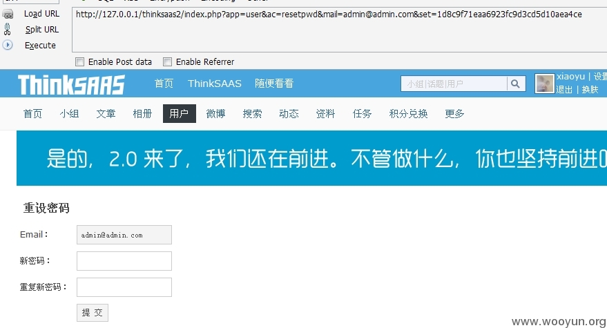

# 0x04 找回密码出现的问题。

* * *

下面介绍一些我在 cms 遇到的找回密码时候犯得错误。

找回密码很多都是验证的 token 就是在找回密码的时候生成一个 token 然后存储到数据库中。 然后把找回密码的地址发到邮箱中 url 中就含有 token 由用户点开后就能修改密码 基本就是验证的这个 token。 其实一般的可以找回任意用户密码的原因就是弱 token 导致可以被攻击者搞到。 包括很多厂商验证的时候就是四位纯数字啥的。 可以枚举。 当然也可以延伸一下, 一些 cms 的密码加密方式很难破掉。 有时候我们拿到了管理的密码破不掉也是鸡肋。 所以有时候也可以利用这种方法 一般找回密码是用的邮箱 首先我们可以注入把管理的邮箱注入出来 然后再去找回密码 再把数据库的 token 注入出来 再构造一下地址 就能重置密码。 这个给我印象比较深的是 在 ssctf 的比赛中嘛 当时机油问了问我 那 wordpress 那题 有个插件的注入 然后因为都知道 wp 的加密基本很难破。 所以也是用的这种方法。 因为一般都是弱 token 的问题 随便找几个例子了

## rand 函数生成的 token

* * *

```php
$resetpwd = md5(rand()); 
```

可以看到这个生成的 token 就是对 rand()函数生成出来的数字进行 md5 一次

来看一下 rand()

注释：在某些平台下（例如 Windows）RAND_MAX 只有 32768。如果需要的范围大于 32768，那么指定 min 和 max 参数就可以生成大于 RAND_MAX 的数了，或者考虑用 mt_rand() 来替代它。 如果不指定一些参数的话 那么最大值才 32768 一个并不算大的值 那么我们首先对这 32768 种可能 md5 出来一个列表 然后我们直接枚举这 32768 种可能 总会有一个对的。

例子: [WooYun: Thinksaas 找回密码处设计错误利用账户可找回密码。](http://www.wooyun.org/bugs/wooyun-2014-050304)

## 修改 hdwiki 任意用户密码

* * *

```php
$encryptstring=md5($this->time.$verification.$auth); 
```

补丁后 多了一个$auth$timetemp=date("Y-m-d H:i:s",$this->time);$auth = util::strcode($timetemp, 'ENCODE'); 可以$auch 是对时间来了一个算法。 结果这个算法的 KEY 并没有初始化 导致了如果我们知道了这个时间 就可以自己生成出来加密的字符串 这里带入算法的是时间 这里是我们可以知道的。

例子: [WooYun: Hdwiki 设计缺陷知邮箱可改密码（包括管理员）](http://www.wooyun.org/bugs/wooyun-2014-067410) //绕过补丁继续找回 hdwiki 任意用户密码

# WooYun-2014-50304：Thinksaas 找回密码处设计错误利用账户可找回密码。

漏洞作者： [′雨。](http://www.wooyun.org/whitehats/′雨。)

来源：[`www.wooyun.org/bugs/wooyun-2014-050304`](http://www.wooyun.org/bugs/wooyun-2014-050304)

## 简要描述

找回密码处 设置的链接不好把。。

## 详细说明

找回密码处 发送邮件给找回密码的地址 但是找回密码的地址只有一个变量。

只要知道要找回的账户 就可以直接爆破。

**.**.**.**/thinksaas2/index.php?app=user&ac=resetpwd&mail=admin@**.**.**.**&set=1d8c9f71eaa6923fc9d3cd5d10aea4ce

找回密码的地址。 app ac mail 这些都是知道的 只有 set 不知道。

在/app/user/action/forgetpwd.php 处。

```php
$resetpwd = md5(rand());

            $new['user']->update('user',array(

                'email'=>$email,

            ),array(

                'resetpwd'=>$resetpwd,

            ));

            //发送邮件

            $subject = $TS_SITE['base']['site_title'].'会员密码找回';

            $content = '您的登陆信息：<br />Email：'.$email.'<br />重设密码链接：<br /><a href="'.$TS_SITE['base']['site_url'].'index.php?app=user&ac=resetpwd&mail='.$email.'&set='.$resetpwd.'">'.$TS_SITE['base']['site_url'].'index.php?app=user&ac=resetpwd&mail='.$email.'&set='.$resetpwd.'</a>';

            echo $content; 
```

可以看到 只有$resetpwd 不知道。 但是

$resetpwd = md5(rand());

是随机的 然后再 md5 RAND_MAX 只有 32768

所以可以爆破之。

写个脚本 循环给 1-32768 md5 一次 然后再载入 burpsuite 进行爆破。

在测试过程中 最少的一次 只有 300 多。 最多的一次 20000 多 这个都看运气了。。

爆破速度也是很快的 吃个饭完了就好了。

## 漏洞证明

循环脚本。


循环出来的数据。

然后载入 Burpsuite


设置好变量


开始爆破。


观察 length 可以知道哪个是正确的。 可以看到我这个在 7446 的时候 就成功了。

然后直接访问



重置成功。

## 修复方案

还是不要用随机的把。。

# WooYun-2014-67410：Hdwiki 设计缺陷知邮箱可改密码（包括管理员）

漏洞作者： [′雨。](http://www.wooyun.org/whitehats/′雨。)

来源：[`www.wooyun.org/bugs/wooyun-2014-067410`](http://www.wooyun.org/bugs/wooyun-2014-067410)

## 简要描述

上 Hdwiki 官网 发现更新日期一直都没变。 还以为一直都没更新了, 结果今天下载一个下来看看。 发现之前发的洞竟然都补掉了。 看了看之前这个改密码那个 对比了一下。 发现增强了点验证。 加入了一个算法。

不过。。。。。。

——————————————————————————————————

ps. 更新程序了应该还是把日期更新了一下 要不别人会一直以为没更新的。

## 详细说明

[`**.**.**.**/bugs/wooyun-2014-055786`](http://**.**.**.**/bugs/wooyun-2014-055786)

上次的 现在来看看现在的。

依旧是 control/user.php

```php
}else{

            $timetemp=date("Y-m-d H:i:s",$this->time);

            $auth = util::strcode($timetemp, 'ENCODE');

            $verification= rand(1000,9999);

            $encryptstring=md5($this->time.$verification.$auth);

            $reseturl=WIKI_URL."/index.php?user-getpass-".$user['uid'].'-'.$encryptstring;

            $_ENV['user']->update_getpass($user['uid'],$encryptstring);

            $mail_subject = $this->setting['site_name'].$this->view->lang['getPass'];

            $mail_message = $this->view->lang['resetPassMs1'].$user['username'].$this->view->lang['resetPassMs2'].$timetemp.$this->view->lang['resetPassMs3']."<a href='".$reseturl."' target='_blank'>".$reseturl."</a>".$this->view->lang['resetPassMs4'].$this->setting['site_name'].$this->view->lang['resetPassMs5'].$this->setting['site_name'].$this->view->lang['resetPassMs6'];

            $this->load('mail');

            $_ENV['mail']->add(array(), array($email), $mail_subject, $mail_message, '', 1, 0);

            $this->message($this->view->lang['emailSucess'],'index.php?user-login',0);

        }

    } 
```

$encryptstring=md5($this->time.$verification.$auth);

现在所验证的 对比之前的可以发现多了一个$auth 来看看怎么来的。

$timetemp=date("Y-m-d H:i:s",$this->time);

$auth = util::strcode($timetemp, 'ENCODE');

这里获取了一下时间 然后

```php
function strcode($string,$action='ENCODE'){

        $key    = substr(md5($_SERVER["HTTP_USER_AGENT"].PP_KEY),8,18);

        $string    = $action == 'ENCODE' ? $string : base64_decode($string);

        $len    = strlen($key);

        $code    = '';

        for($i=0; $i < strlen($string); $i++){

            $k        = $i % $len;

            $code  .= $string[$i] ^ $key[$k];

        }

        $code = $action == 'DECODE' ? $code : base64_encode($code);

        return $code;

    } 
```

主要关注他的 key 怎么来的。

$key = substr(md5($_SERVER["HTTP_USER_AGENT"].PP_KEY),8,18);

首先对 USER_AGENT.PP_KEY MD5 一次 然后再来取。

等等。。 user agent 是用户可控的, PP_KEY 呢?

竟然没有初始化, 那么 PP_KEY 就是 PP_KEY 那么这个$key 全部就可控了。

所以我们可以想对什么加密就对神马加密了。

$timetemp=date("Y-m-d H:i:s",$this->time);

$auth = util::strcode($timetemp, 'ENCODE');

然后这个是对时间加密一次 如果知道时间的话就能知道$auth

然后继续$this->time.$verification.$auth

第一个就是时间戳 第二个 rand(1000,9999) 有 8999 种可能 直接枚举 第三个 知道时间就可以了。

## 漏洞证明

这里由于管理员和用户在同一个表所以可以直接改管理员的密码。

首先 [`**.**.**.**/web/hdwiki/index.php?user-getpass`](http://**.**.**.**/web/hdwiki/index.php?user-getpass)

然后把要管理员的邮箱输入进去。

在点提交之前打开 (提交的时候一定要改一下 user agent 如果不改 user agent 会对应不上的 我这里改成的是 asd)

[`**.**.**.**/Tools/unixtime.aspx`](http://**.**.**.**/Tools/unixtime.aspx)

然后在点提交的时候 看一下时间戳 并记录下来。

(我本地时间有点不准 无伤大雅)

以我演示的为例, 时间戳为 1405589070

然后把这个时间戳转换为时间

1405589070 -> 2014/7/17 17:24:30 （时间不准 别在意哈哈）

$timetemp=date("Y-m-d H:i:s",$this->time)

Y-m-d H:i:s 这个的格式是这样的 年份-月份-日子 小时:分钟:秒

所以把 2014/7/17 17:24:30 对应下来为 2014-7-17 17:24:30

但是这样是不对的 因为 Y-m-d H:i:s 获取的是 格林威治标准时间

与北京时间正好相差 8 个小时 所以$timetemp=2014-07-17 09:24:30

然后带入那个算法当中


然后这样就拿到了$auth

然后写个脚本 把 8999 种情况 全部遍历出来

1405589070$iBlMHBUkAVkwHBxYICw8BVw0BBA==


把 8999 种情况全部导出来 然后载入 burpsuite


前面那 uid 那里就是管理员的 id 肯定是为 1 的。

## 修复方案

增强验证

增强算法

随机生成一个 Key 咋样。