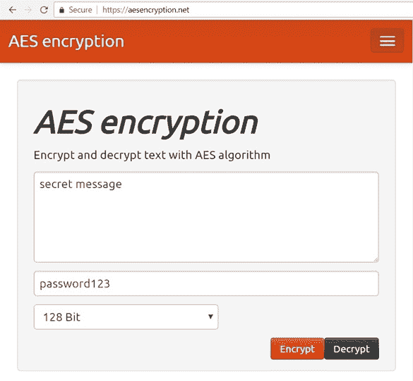

# 密码学 - 概述

> 原文：[`cryptobook.nakov.com/cryptography-overview`](https://cryptobook.nakov.com/cryptography-overview)

## 现代密码学概述

**密码学**从其最初的尝试（数千年以前）发展到为开发者提供第一个成功的密码学算法（如现在已退役的 MD5 和 DES）到现代密码算法（如 SHA-3、Argon2 和 ChaCha20）。

让我们先简要介绍一些基本**密码学概念**，开发者应该了解，例如密码学**哈希函数**（SHA-256、SHA3、RIPEMD 等），**HMAC**（散列消息认证码），密码到**密钥派生**函数（如**Scrypt**），Diffie-Hellman 密钥交换协议，**对称密钥**加密方案（如具有 CBC 和 CTR 块模式的**AES**加密算法）和具有公钥和私钥的**非对称密钥**加密方案（如**RSA**加密算法和基于椭圆曲线的密码学/**ECC**，secp256k1 曲线和 Ed25519 密码系统），**数字签名**和**ECDSA**，以及**熵**和安全的**随机数**生成和**量子安全密码学**。

### 加密/解密消息 - 实时演示

作为**一个简单示例**，我们将演示使用**AES 加密算法**的消息**加密**和**解密**。玩这个在线工具：[`aesencryption.net`](https://aesencryption.net)。

我们将在以后了解到，在这个简单的**AES 加密**背后，隐藏着**许多算法和设置**，如密码到密钥派生函数及其参数、块加密模式、加密初始向量、消息认证码等。

## 什么是密码学？

**密码学**是提供**安全和保护信息**的科学。在我们的数字世界中无处不在：当你打开一个网站，发送电子邮件或连接到 WiFi 网络时。这就是为什么开发者应该至少对密码学有一个**基本理解**，以及如何使用密码算法和密码库，了解散列、对称和非对称加密方案、数字签名以及它们背后的密码系统和算法。

### 加密和密钥

密码学涉及**以安全方式存储和传输数据**，使得只有那些有意者才能读取和处理它。这可能涉及使用对称或非对称加密方案**加密和解密数据**，其中使用一个或多个**密钥**将数据从明文形式转换为加密形式，然后再转换回来。

**对称加密**（如 AES、Twofish 和 ChaCha20）使用相同的密钥来加密和解密消息，而**非对称加密**使用**公钥密码系统**（如 RSA 或 ECC）和密钥对：公钥（加密密钥）和相应的私钥（解密密钥）。加密算法通常在加密方案中结合使用（如 AES-256-CTR-HMAC-SHA-256、ChaCha20-Poly1305 或 ECIES-secp256k1-AES-128-GCM）。

密码学处理**密钥**（大秘密数字）并在许多场景中，这些**密钥**是通过使用**密钥派生算法**（如 PBKDF2 和 Scrypt）从数字、密码或短语派生出来的。

### 数字签名和消息认证

密码学提供了**消息数字签名**的方法，这保证了消息的真实性、完整性和不可否认性。大多数数字签名算法（如 DSA、ECDSA 和 EdDSA）使用**非对称密钥对**（私钥和公钥）：消息由私钥**签名**，签名由相应的公钥**验证**。在银行系统中，**数字签名**用于签署和批准支付。在区块链中，签署的交易允许用户将区块链资产从一个地址转移到另一个地址。

密码学处理**消息认证**算法（如 HMAC）和消息认证码（MAC 码），以证明消息的真实性、完整性和作者身份。认证与加密并行使用，以确保安全通信。

### 安全随机数

密码学使用**随机数**并处理**熵**（不可预测的随机性）和随机数的**安全生成**（例如使用 CSPRNG）。**安全随机数**本质上不可预测，开发者应该关注它们，因为损坏的随机生成器意味着系统或应用被破坏或被黑客攻击。

### 密钥交换

密码学定义了**密钥交换算法**（如 Diffie-Hellman 密钥交换和 ECDH）和**密钥建立方案**，用于在打算使用**加密**安全传输消息的两个当事人之间安全地建立加密**密钥**。此类算法通常在建立两个当事人之间新的安全连接时执行，例如，当你打开一个现代网站或连接到 WiFi 网络时。

### 加密散列和密码散列

密码学提供了**加密散列函数**（如 SHA-3 和 BLAKE2），这些函数将消息转换为**消息摘要**（固定长度的散列），不能反向转换为原始消息，并且几乎唯一地标识了输入。例如，在**区块链**系统中，散列用于生成区块链地址、交易 ID 以及在许多其他算法和协议中。在**Git**中，加密散列用于生成文件和提交的唯一 ID。

**密码散列**和密码到**密钥派生函数**（如 Scrypt 和 Argon2）通过从基于文本的密码安全地派生出一个散列（或密钥），注入随机参数（盐），并使用大量的迭代和计算资源来使密码破解变慢，从而保护用户密码和加密文档及数据。

### 密码学中的混淆和扩散

在密码学中，散列、加密算法和随机生成器遵循香农的[混淆和扩散](https://en.wikipedia.org/wiki/Confusion_and_diffusion)原则。**混淆**意味着输出形式的每个比特应该依赖于密钥和输入数据的多个部分，因此不能建立直接映射。**扩散**意味着输入中的一个比特的变化应该大约改变输出中一半的比特。这些原则被纳入了大多数散列函数、MAC 算法、随机数生成器、对称和非对称加密中。

### 密码库

开发者应该了解他们编程语言和平台上的现代**密码库**以及如何使用它们。使用密码学进行开发需要**对密码学概念的理解**。从互联网复制/粘贴代码或遵循博客中的示例可能会导致不安全的设计和薄弱的安全。密码库非常有用，但你应该**首先理解概念**，然后选择合适的算法组合并仔细调整它们的参数。
