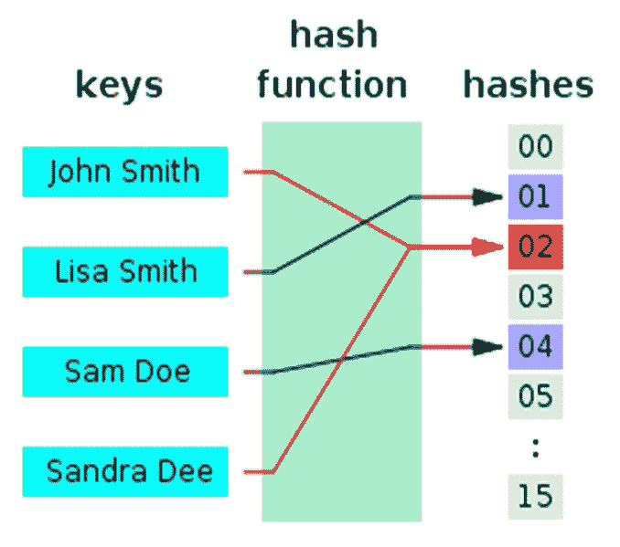
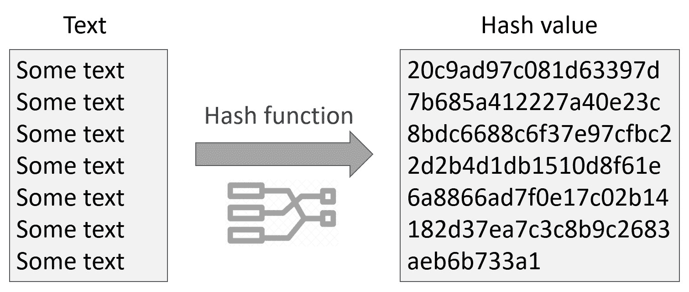

# 散列函数

> 原文：[`cryptobook.nakov.com/cryptographic-hash-functions`](https://cryptobook.nakov.com/cryptographic-hash-functions)

在计算机编程中，**散列函数**将文本（或其他数据）映射到整数。通常不同的输入映射到不同的输出，但有时可能会发生**冲突**（不同的输入具有相同的输出）。

**加密散列函数**将文本或二进制数据转换为固定长度的**哈希值**，并且已知是**抗冲突**和**不可逆**的。加密散列函数的例子是**SHA3-256**：

```py
SHA3-256("hello") = "3338be694f50c5f338814986cdf0686453a888b84f424d792af4b9202398f392"
```

上述 SHA3-256 哈希计算可以用 Python 这样编写：

```py
import hashlib, binascii sha3_256hash = hashlib.sha3_256(b'hello').digest() print("SHA3-256('hello') =", binascii.hexlify(sha3_256hash))
```

运行上述代码示例：[`repl.it/@nakov/SHA3-256-hello-in-Python`](https://repl.it/@nakov/SHA3-256-hello-in-Python)。

同样的 SHA3-256 哈希计算可以用 JavaScript 这样编写（在`npm install js-sha3`之后）：

```py
sha3 =  require('js-sha3'); let sha3_256hash =  sha3.sha3_256('hello').toString(); console.log("SHA3-256('hello') =", sha3_256hash);
```

运行上述代码示例：[`repl.it/@nakov/SHA3-256-hello-in-JS`](https://repl.it/@nakov/SHA3-256-hello-in-JS)。

## [](#hashing-in-software-engineering)散列（在软件工程中）

计算特定散列函数值的进程被称为“**散列**”。



在上述示例中，文本`John Smith`被散列到散列值`02`，而`Lisa Smith`被散列到`01`。输入文本`John Smith`和`Sandra Dee`都被散列到`02`，这被称为“**冲突**”。

散列函数是**设计上不可逆的**，这意味着没有快速算法可以从其哈希值恢复输入消息。

在编程中，**散列函数**用于实现数据结构“**哈希表**”（关联数组），它将某种输入类型的值映射到另一种类型的值，例如将产品名称（文本）映射到产品价格（十进制数）。

一个**简单的散列函数**只是将输入数据/文本的字节相加。这会导致很多冲突，例如`hello`和`ehllo`将具有相同的哈希码。**更好的散列函数**可能使用[Merkle–Damgård 构造](https://en.wikipedia.org/wiki/Merkle–Damgård_construction)方案，它将第一个字节作为**状态**，然后**转换状态**（例如乘以一个素数如 31），然后**将下一个字节**添加到状态中，然后再次转换状态并添加下一个字节，等等。这显著降低了冲突率并产生了更好的分布。

## [](#cryptographic-hash-functions)加密散列函数

在密码学中，**散列函数**将任意大小的**输入数据**（例如文本消息）转换为固定大小的**结果**（例如 256 位），这被称为**哈希值**（或哈希码、消息摘要，或简称哈希）。在计算机密码学中使用的散列函数被称为“**加密散列函数**”。此类函数的例子是**SHA-256**和**SHA3-256**，它们将任意输入转换为 256 位输出。



### [](#cryptographic-hash-functions-examples)加密哈希函数 - 示例

**例如**，我们可以取加密哈希函数 `SHA-256` 并计算特定文本消息 `hello` 的哈希值：

<template id="B:2"></template>
