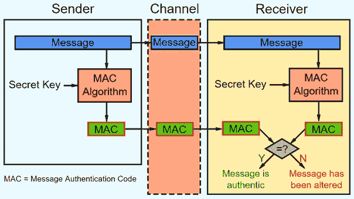

# MAC 和密钥派生

> 原文：[`cryptobook.nakov.com/mac-and-key-derivation`](https://cryptobook.nakov.com/mac-and-key-derivation)

**消息认证码**（**MAC**）、**HMAC**（基于哈希的消息认证码）和**KDF**（密钥派生函数）在密码学中扮演着重要的角色。让我们解释何时需要**MAC**，如何计算**HMAC**以及它与密钥派生函数的关系。

## [](#message-authentication-code-mac)消息认证码（MAC）

**M**essage **A**uthentication **C**ode（**MAC**）是一种加密代码，通过给定的**密钥**和给定的**消息**计算得出：

```py
auth_code = MAC(key, msg)
```

通常，它表现得**像哈希函数**：消息或密钥的微小变化会导致完全不同的**MAC 值**。实际上，改变密钥或消息以获得相同的**MAC 值**是不可能的。MAC 代码，像哈希一样，是**不可逆的**：无法从 MAC 代码中恢复原始消息或密钥。MAC 算法也被称为“**密钥哈希函数**”，因为它们具有带密钥的哈希函数的行为。

例如，MAC 代码可以通过**HMAC-SHA256**算法这样计算：

```py
HMAC-SHA256('key', 'some msg') = 32885b49c8a1009e6d66662f8462e7dd5df769a7b725d1d546574e6d5d6e76ad
```

上述 HMAC-SHA256 计算可以用 Python 这样编写：

```py
import hashlib, hmac, binascii   mac = hmac.new(b'key', b'some msg', hashlib.sha256).digest() print(binascii.hexlify(mac))
```

运行上述代码示例：[`repl.it/@nakov/HMAC-SHA256-in-Python`](https://repl.it/@nakov/HMAC-SHA256-in-Python)。

MAC 代码是**数字真实性代码**，就像**数字签名**一样，但带有**预共享密钥**。我们将在以后学习更多关于数字签名和数字签名的内容。

## [](#mac-algorithms)MAC 算法

现代密码学中存在许多用于计算消息认证码（MAC）的**算法**。最流行的是基于**哈希**算法的，如[**HMAC**](https://en.wikipedia.org/wiki/HMAC)（基于哈希的 MAC，例如 HMAC-SHA256）和[**KMAC**](https://www.cryptosys.net/manapi/api_kmac.html)（基于 Keccak 的 MAC）。其他基于**对称加密**，如[**CMAC**](https://en.wikipedia.org/wiki/One-key_MAC)（基于加密的 MAC）、[**GMAC**](https://en.wikipedia.org/wiki/Galois/Counter_Mode)（Galois MAC）和[**Poly1305**](https://en.wikipedia.org/wiki/Poly1305)（Bernstein 的一次性认证器）。其他 MAC 算法包括[**UMAC**](https://en.wikipedia.org/wiki/UMAC)（基于通用哈希）、[**VMAC**](https://en.wikipedia.org/wiki/VMAC)（基于高性能分组密码的 MAC）和[**SipHash**](https://en.wikipedia.org/wiki/SipHash)（简单、快速、安全的 MAC）。

## [](#when-we-need-mac-codes)我们需要 MAC 代码的情况？

使用 MAC 代码的一个示例场景如下：

+   双方以某种方式交换一个特定的**MAC 密钥**（预共享**密钥**）。

+   我们从某处（例如，从互联网、区块链或电子邮件消息）接收**msg** + **auth_code**。

+   我们想要确保**msg**没有被**篡改**，这意味着**密钥**和**msg**都是正确的，并且与 MAC 代码匹配。

+   如果发生**篡改消息**，MAC 代码将是不正确的。



## [](#authenticated-encryption-encrypt-decrypt-messages-using-mac)基于 MAC 的加密：使用 MAC 加密/解密消息

另一个使用**MAC 代码**的场景是用于**认证加密**：当我们**加密一条消息**并希望确保**解密密码是正确的**，并且解密后的消息与加密前的原始消息相同。

+   首先，我们从密码中**导出一个密钥**。我们可以使用这个密钥进行 MAC 计算算法（直接或通过散列以获得更好的安全性）。

+   接下来，我们使用导出的密钥**加密消息**并将密文存储在输出中。

+   最后，我们使用导出的密钥和原始消息计算**MAC 代码**并将其附加到输出中。

当我们**解密加密的消息**（密文 + MAC）时，我们按照以下步骤进行：

+   首先，我们从用户输入的密码中**导出一个密钥**。这可能是不正确的密码或正确的密码。我们稍后会找出答案。

+   接下来，我们使用导出的密钥**解密消息**。这可能是一条原始消息或错误消息（取决于输入的密码）。

+   最后，我们使用导出的密钥加上解密的消息计算一个**MAC 代码**。

    +   如果计算出的 MAC 代码与加密消息中的 MAC 代码匹配，则**密码是正确的**。

    +   否则，将证明解密后的消息不是原始消息，这意味着**密码是错误的**。

一些**认证加密算法**（如**AES-GCM**和**ChaCha20-Poly1305**）将 MAC 计算集成到加密算法中，将 MAC 验证集成到解密算法中。我们稍后会了解更多关于这些算法的信息。

MAC 代码与密文一起存储，它**不会泄露**密码或原始消息。存储可见给任何人的 MAC 代码是安全的，并且在解密后，我们知道消息是否是原始的（密码错误）。

## [](#mac-based-pseudo-random-generator)基于 MAC 的伪随机生成器

MAC 代码的另一个应用是用于**伪随机生成器**函数。我们可以从一个特定的**盐**（常数或当前日期和时间或某些其他随机数）和一些**种子**数（最后生成的随机数，例如**0**）开始。我们可以按照以下方式计算**下一个种子**：

<template id="B:2"></template>
