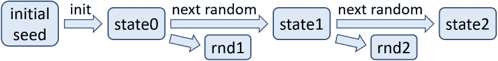

# 安全随机生成器

> 原文：[`cryptobook.nakov.com/secure-random-generators`](https://cryptobook.nakov.com/secure-random-generators)

## 安全随机数生成器、PRNG 和 CSPRNG

在密码学中，**随机性**（熵）起着非常重要的作用。在许多算法中，我们需要**随机数**（即不可预测的数）。如果这些数不可预测，算法将受到损害。

例如，假设我们需要一个**密钥**，这个密钥将保护我们的金融资产。这个密钥应该以**随机生成**的方式产生，使得其他人无法生成或拥有相同的密钥。如果我们从**安全的随机生成器**中生成密钥，那么它将是**不可预测**的，系统将是安全的。因此，“安全随机”意味着简单的“**不可预测的随机**”。

让我们更详细地讨论计算机科学中的**随机数**及其在**密码学**中的作用，以及伪随机数生成器（**PRNG**）、安全伪随机生成器（**CSPRNG**）以及一些关于开发者如何在代码中生成和使用随机数的指南。

## 随机生成器

在计算机科学中，**随机数**通常来自**伪随机数生成器**（PRNG），由一些不可预测的初始随机性（熵）初始化。在密码学中，使用安全的 PRNG，称为**CSPRNG**，通常将熵与 PRNG 和其他技术相结合，以使生成的随机性**不可预测**。

### 伪随机数生成器（PRNG）

伪随机数生成器（**PRNG**）用于将一小部分**初始随机性**扩展成大量**伪随机性**，通常用于密码系统。请注意，**PRNGs**不是密码学安全的，并且与**CSPRNGs**不同。

**PRNGs**是函数，它们从一个**初始熵**（种子）开始，通过某种计算来计算下一个随机数，这种计算在没有知道种子的情况下是不可预测的。这种计算被称为**伪随机函数**。

伪随机函数（对于密码学来说不安全）通常使用一个内部**状态**。在开始时，状态通过一个**初始种子**初始化。当生成**下一个随机数**时，它基于内部状态（使用某种计算或公式）计算，然后伪随机函数的内部**状态**被改变（使用某种计算或公式）。当生成**下一个随机数**时，它再次基于函数的内部状态计算，然后状态再次改变，依此类推。

这个过程在其最简单的形式中可以如下实现：

<template id="B:2"></template>
