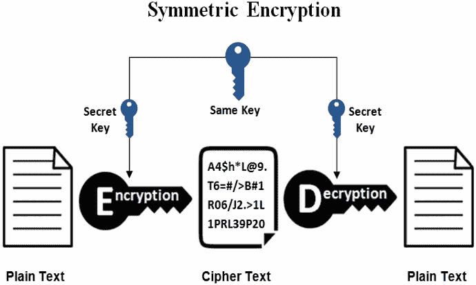

# 加密：对称加密和非对称加密

> 原文：[`cryptobook.nakov.com/encryption-symmetric-and-asymmetric`](https://cryptobook.nakov.com/encryption-symmetric-and-asymmetric)

在密码学中，广泛使用两种主要的加密方案：**对称加密**（使用单个**密钥**来加密和解密数据）和**非对称加密**（使用公钥密码系统，并且加密和解密使用**一对公钥和相应的私钥**）。让我们详细解释这些基本的密码学概念。

## 对称加密 - 概念和算法

**对称加密**方案使用**相同的对称密钥**（或密码）来**加密**数据并将加密数据解密回其原始形式：

对称加密通常将多个加密算法组合成一个**对称加密方案**，例如 AES-256-CTR-HMAC-SHA256。**加密方案**（密码构造）可能包括：密码到**密钥派生**算法（带有某些参数）+ **对称密码**算法（带有某些参数）+ **密码块模式**算法 + **消息认证**（MAC）算法。这意味着**上述所示图是简化的**，并不能完全代表这个过程。

### 密钥

用于**加密**（加密）和**解密**（解密）数据的**密钥**通常大小为 128、192 或 256 位，有时也称为“***加密密钥***”或“***共享密钥***”，因为发送和接收方都应该知道它。

大多数应用程序使用一个[**密码到密钥派生**](https://github.com/svetlin-nakov/practical-cryptography-for-developers/tree/34666e7576d7427e08bf3940a69214b0cda94676/content/part-1-blockchain-networks-concepts/blockchain-cryptography/blockchain-cryptography-overview/hmac-and-key-derivation.html)方案从某些密码中提取**密钥**，因为用户更容易记住密码而不是二进制数据。此外，**消息认证**通常与加密结合使用，以提供**完整性**和**真实性**（这种加密方法被称为“[**认证加密**](https://en.wikipedia.org/wiki/Authenticated_encryption)”）。

私钥看起来是什么样的？让我们从一个简单的**256 位密钥**的例子开始，它被编码为[**十六进制字符串**](https://en.wikipedia.org/wiki/Hexadecimal)：

<template id="B:2"></template>
