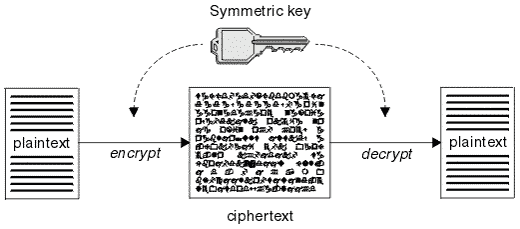

# 对称密钥密码

> 原文：[`cryptobook.nakov.com/symmetric-key-ciphers`](https://cryptobook.nakov.com/symmetric-key-ciphers)

**对称密钥密码**（如**AES**、**ChaCha20**、**RC6**、**Twofish**、**CAST**和许多其他）使用相同的密钥（或密码）来**加密**和**解密**数据。它们通常与其他算法结合成一个**对称加密方案**（如**ChaCha20-Poly1305**、**AES-128-GCM**和**AES-256-CTR-HMAC-SHA256**），通常与密码派生算法（如**Scrypt**和**Argon2**）结合使用。对称密钥密码是**量子抗性**的，这意味着强大的量子计算机将无法破解其安全性（当使用足够大的密钥长度时）。对称密码可以加密以固定大小块形式到来的数据（**块密码**）或以字节序列形式到来的数据（**流密码**）。通过某些称为“**块密码模式**”的操作构造，块密码可以被转换为流密码。

## 对称加密/解密

**对称加密**和解密使用**秘密密钥**或密码短语（从中派生密钥）。用于加密和解密数据的**秘密密钥**通常是 128 位或 256 位，称为“**加密密钥**”。有时它以十六进制或 base64 编码的整数形式给出，或者通过**密码到密钥派生方案**派生。

当输入数据被加密时，它被转换为**加密密文**，而当密文被解密时，它被转换回原始输入数据。

## 对称加密使用一组算法

作为概念，了解对称密钥加密算法通常不单独工作是很重要的。它们与其他相关加密算法一起工作，形成一个**对称加密方案**/**对称加密构造**。

在大多数加密方案中，**加密**与密码派生算法和**消息认证**方案相结合（参见[认证加密](https://en.wikipedia.org/wiki/Authenticated_encryption)）。通常，对称加密过程使用一系列步骤，涉及不同的加密算法：

+   **密码到密钥派生**算法（如 Scrypt 或 Argon2）：允许使用密码而不是密钥，并使密码破解变得困难且缓慢。

+   **块到流密码转换**算法（块密码模式如**CBC**或**CTR**）+ **消息填充**算法（如**PKCS7**）（在某些模式中）：允许使用块密码算法（如**AES**）加密任意大小的数据。

+   **分组密码算法**（如**AES**）：使用秘密密钥安全地加密固定长度的数据块。

+   **消息认证**算法（如**HMAC**）：用于检查解密后获得的结果是否与加密前的原始消息匹配。

在本节稍后，我们将提供**更多细节和示例**，说明如何配置和使用对称块加密（如 AES）以及上述所有描述的算法来安全地加密和解密任意大小的消息。
