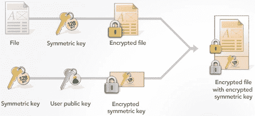
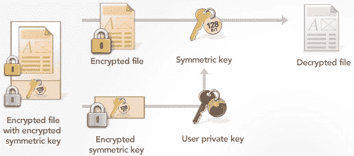

# 非对称密钥加密

> 原文：[`cryptobook.nakov.com/asymmetric-key-ciphers`](https://cryptobook.nakov.com/asymmetric-key-ciphers)

**非对称密钥加密系统/公钥加密系统**（如[**RSA**](https://en.wikipedia.org/wiki/RSA_%28cryptosystem%29)、[**椭圆曲线密码学（ECC**）](https://en.wikipedia.org/wiki/Elliptic-curve_cryptography)、[**Diffie-Hellman**](https://en.wikipedia.org/wiki/Diffie–Hellman_key_exchange)、[**ElGamal**](https://en.wikipedia.org/wiki/ElGamal_encryption)、[**McEliece**](https://en.wikipedia.org/wiki/McEliece_cryptosystem)、[**NTRU**](https://en.wikipedia.org/wiki/NTRU)和其他）使用一对数学上相关联的密钥：**公钥**（加密密钥）和**私钥**（解密密钥）。

非对称密钥加密系统提供**密钥对生成**（私钥 + 对应的公钥）、**加密算法**（非对称密钥加密和如**RSA-OAEP**和**ECIES**的加密方案）、**数字签名算法**（如**DSA**、**ECDSA**和**EdDSA**）以及**密钥交换算法**（如**DHKE**和**ECDH**）。

使用**公钥**加密的消息稍后由**私钥**解密。使用**私钥**签名的消息稍后由**公钥**验证。**公钥**通常与每个人共享，而**私钥**则保密。从其对应的公钥计算私钥在设计上是计算上不可行的。

## 公钥加密系统

众所周知的**公钥加密系统**有：[**RSA**](https://en.wikipedia.org/wiki/RSA_%28cryptosystem%29)、[**ECC**](https://en.wikipedia.org/wiki/Elliptic-curve_cryptography)、[**ElGamal**](https://en.wikipedia.org/wiki/ElGamal_encryption)、[**DHKE**](https://en.wikipedia.org/wiki/Diffie–Hellman_key_exchange)、[**ECDH**](https://en.wikipedia.org/wiki/Elliptic_curve_Diffie–Hellman)、[**DSA**](https://en.wikipedia.org/wiki/Digital_Signature_Algorithm)、[**ECDSA**](https://en.wikipedia.org/wiki/Elliptic_Curve_Digital_Signature_Algorithm)、[**EdDSA**](https://en.wikipedia.org/wiki/EdDSA)、[**Schnorr 签名**](https://en.wikipedia.org/wiki/Schnorr_signature)。不同的公钥加密系统可能提供以下一种或多种功能：

+   **密钥对生成**：生成随机的私钥 + 对应的公钥对。

+   **加密**/**解密**：使用公钥加密数据，使用私钥解密数据（通常使用混合加密方案）。

+   **数字签名**（消息认证）：使用私钥签名消息，使用公钥验证签名。

+   **密钥交换算法**：在两个当事人之间通过不安全通道安全地交换加密密钥。

最重要且最常用的公钥密码系统是 **RSA** 和 **ECC**。椭圆曲线密码学（ECC）是推荐且最首选的现代公钥密码系统，特别是对于现代高度优化和安全的曲线（如 Curve25519 和 Curve448），因为其密钥更小、签名更短且性能更好。

[RSA 公钥密码系统](https://en.wikipedia.org/wiki/RSA_%28cryptosystem%29) 基于数学概念 [模幂运算](https://en.wikipedia.org/wiki/Modular_exponentiation)（通过模数将数字提升到幂），以及一些数学构造和 [整数分解问题](https://en.wikipedia.org/wiki/RSA_problem)（对于足够大的密钥被认为是计算上不可行的）。

[椭圆曲线密码系统 (ECC)](https://en.wikipedia.org/wiki/Elliptic-curve_cryptography) 是基于有限域上椭圆曲线的代数结构以及 [椭圆曲线离散对数问题 (ECDLP)](https://en.wikipedia.org/wiki/Elliptic-curve_cryptography#Rationale) 的数学，后者被认为对于大密钥来说是计算上不可行的。**ECC** 与 **ECDSA** 算法（椭圆曲线数字签名算法）一起使用。ECC 使用比 RSA 更小的密钥和签名，因此在大多数现代应用中更受欢迎。我们将在后面详细讨论 ECC 和 ECDSA，并附带示例。

大多数 **公钥密码系统**（如 RSA、ECC、DSA、ECDSA 和 EdDSA）都是 **量子可破解的**（量子不安全），这意味着（至少在理论上）一个足够强大的量子计算机将能够破解它们的加密并从给定的公钥中在几秒钟内计算出私钥。

## 非对称加密方案

**非对称加密**比对称加密更复杂，不仅因为它使用**公钥**和**私钥**，而且因为非对称加密只能加密/解密小消息，这些消息应该映射到公钥密码系统的底层数学。一些密码系统（如 ECC）不直接提供加密原语，因此需要使用更复杂的方案。

在 **RSA** 系统中，输入消息应该被转换为 **大整数**（例如使用 OAEP 填充），而在 **ECC** 中，消息不能直接加密，需要使用更复杂的加密方案，基于椭圆曲线迪菲-赫尔曼密钥交换（ECDH）。这将在本章后面详细解释。此外，非对称加密算法比对称加密算法（例如 RSA 加密比 AES 慢 1000 倍）慢得多。

为了克服上述限制并允许加密任何大小的消息，现代密码学使用非对称加密方案（也称为公钥加密方案/非对称加密构造/混合加密方案），如 **密钥封装机制 (KEM)** 和 **综合加密方案**，这些方案结合了非对称加密和对称密钥加密。

这就是如何通过结合公钥密码学和对称加密算法来加密大型文档或文件：

在上述图中，加密的对称密钥被称为 **KEM 块**（封装密钥，使用公钥加密）和加密的数据文件被称为 **DEM 块**（封装数据，使用对称加密）。加密的消息由这两个块组成（封装密钥 + 封装数据）。

这是相应的 **解密**过程（使用公钥密码学和对称加密算法解密加密的大型文档）：

这样的非对称加密方案的例子包括：[**RSA-OAEP**](https://en.wikipedia.org/wiki/Optimal_asymmetric_encryption_padding)、[**RSA-KEM**](https://tools.ietf.org/html/rfc5990#appendix-A) 和 [**ECIES-KEM**](https://www.w3.org/TR/xmlsec-generic-hybrid/#sec-ecies-kem)。

### 综合加密方案

[**综合加密方案 (IES)**](https://en.wikipedia.org/wiki/Integrated_Encryption_Scheme) 是现代的公钥加密方案，它结合了对称加密、非对称加密和密钥派生算法，以提供基于公钥的加密（PKE）安全性。在 EIS 方案中，使用非对称算法（如 RSA 或 ECC）来加密或封装一个对称密钥，该密钥随后由对称加密（如 AES 或 ChaCha20）用于加密输入消息。一些 EIS 方案还提供消息认证。EIS 方案的例子包括 [**DLIES**](https://en.wikipedia.org/wiki/Integrated_Encryption_Scheme)（离散对数综合加密方案）和 [**ECIES**](https://en.wikipedia.org/wiki/Integrated_Encryption_Scheme)（椭圆曲线综合加密方案）。

### 密钥封装机制 (KEM)

[**密钥封装机制 (KEM)**](https://en.wikipedia.org/wiki/Key_encapsulation) 是一种非对称加密技术，用于加密和封装一个秘密密钥（称为“临时对称密钥”），该密钥用于使用对称加密算法加密输入消息。**KEM** 通过使用接收者的公钥加密临时对称加密密钥，将其封装为加密消息的一部分。在密码学中，这个过程被称为“**密钥封装**”。

基于 KEM 的混合加密方案的输出包括**KEM 块**，包含封装的加密对称密钥（或用于推导它的某些参数），以及**DEM 块**（数据封装机制），包含封装的对称加密数据（密文参数 + 密文 + 可选的认证标签）。

**密钥封装机制**（KEMs）用于混合加密方案和集成加密方案中，其中在底层公钥密码系统中生成一个随机元素，并通过哈希从这个随机元素中推导出对称密钥。这种方法简化了结合非对称和对称加密的过程。现代密钥封装机制的例子包括：[**RSA-KEM**](https://tools.ietf.org/html/rfc5990)，[**ECIES-KEM**](https://www.cosic.esat.kuleuven.be/nessie/reports/phase2/evalv2.pdf)和[**PSEC-KEM**](https://www.cryptrec.go.jp/cryptrec_03_spec_cypherlist_files/PDF/02_03e_jspec.pdf)。

**密钥封装**不应与**密钥封装**混淆。

+   **密钥封装**（KEM）指的是对另一个密钥（对称或非对称）的**公钥加密**。它用于创建可证明安全的**混合加密方案**，例如，通过给定的 ECC 公钥加密 AES 密钥。

+   **密钥封装**指的是对另一个密钥（可以是对称密钥或非对称密钥）的**对称密钥加密**。它用于加密、完整性保护和传输加密密钥。密钥封装为如加密密钥等专用数据提供隐私和完整性保护，而不使用随机数。有关详细信息，请参阅[RFC 3394](https://tools.ietf.org/html/rfc3394.html)。

## 数字签名

在密码学中，**数字签名**为数字文档提供消息**认证**、**完整性**和**不可否认性**。数字签名在公钥密码系统中工作，并使用公钥/私钥对。消息**签名**由**私钥**执行，消息**验证**由相应的**公钥**执行。

**消息签名**从数学上保证了某些消息是由某些（秘密）**私钥**签名的，这些私钥对应于某些（非秘密）**公钥**。在消息签名后，消息和**签名不能被修改**，因此提供了消息**认证**和**完整性**。任何知道消息签名者**公钥**的人都可以**验证签名**。签名后，签名者不能拒绝签名的行为（这被称为**不可否认性**）。

**数字签名**今天被广泛用于签署数字合同、授权银行支付以及在公共区块链系统中签署交易以转移数字资产。

大多数公钥密码系统，如**RSA**和**ECC**，提供了安全的数字签名方案，例如[**DSA**](https://en.wikipedia.org/wiki/Digital_Signature_Algorithm)、[**ECDSA**](https://en.wikipedia.org/wiki/Elliptic_Curve_Digital_Signature_Algorithm)和[**EdDSA**](https://en.wikipedia.org/wiki/EdDSA)。我们将在本节后面更详细地讨论数字签名。

## 密钥交换算法

在密码学中，[**密钥交换算法**](https://en.wikipedia.org/wiki/Key_exchange)（[**密钥协商协议**](https://en.wikipedia.org/wiki/Key-agreement_protocol) / **密钥协商方案**)允许在两个实体之间交换加密密钥，从而允许使用加密算法，在大多数情况下是对称加密算法。例如，当笔记本电脑连接到家庭**WiFi 路由器**时，双方同意一个**会话密钥**，用于对称加密他们之间的网络流量。

大多数密钥交换算法基于公钥密码学和该系统的数学原理：离散对数、椭圆曲线或其他。

**匿名密钥交换**，如 Diffie–Hellman（**DHKE**和**ECDH**），不提供参与方的身份验证，因此容易受到[中间人攻击](https://en.wikipedia.org/wiki/Man-in-the-middle_attack)的影响，但可以免受[流量截获（嗅探）攻击](https://en.wikipedia.org/wiki/Sniffing_attack)。

**认证密钥协商**方案通过使用**数字签名密钥**（例如[PKI 证书](https://en.wikipedia.org/wiki/Public_key_certificate)）、[**密码认证密钥协商**](https://en.wikipedia.org/wiki/Password-authenticated_key_agreement)或其他方法来验证参与密钥交换的各方身份，从而防止中间人攻击。
