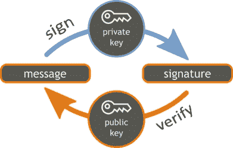
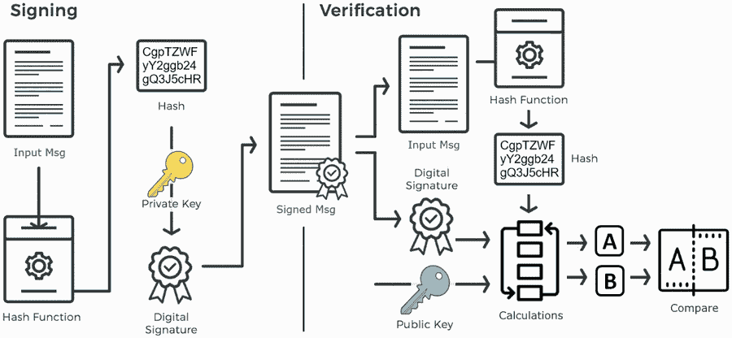

# 数字签名

> 原文：[`cryptobook.nakov.com/digital-signatures`](https://cryptobook.nakov.com/digital-signatures)

[**数字签名**](https://en.wikipedia.org/wiki/Digital_signature)是一种加密工具，用于**签名消息**和**验证消息签名**，以提供对数字消息或电子文件的**真实性**证明。数字签名提供：

+   消息**认证** - 证明某些已知的发送者（密钥所有者）创建了并签发了该消息。

+   消息**完整性** - 证明消息在签名后未被更改。

+   **不可否认性** - 签名一旦创建，签名者不能否认对文档的签名。

**数字签名**在商业和金融行业中广泛使用，例如用于授权银行支付（货币转账）、交换已签名的电子文件、在公共区块链系统中签名交易（例如货币、代币或其他数字资产的转让）、签名数字合同以及在许多其他场景中。

**数字签名**不能识别创建特定签名的个人。这可以通过与[**数字证书**](https://en.wikipedia.org/wiki/Public_key_certificate)结合来解决，它将公钥所有者与身份（个人、组织、网站或其他）绑定。按设计，数字签名将消息绑定到公钥，而不是数字身份。

## 签名消息和验证签名：它是如何工作的？

**数字签名**方案通常使用**公钥密码系统**（如 RSA 或 ECC）并使用**公钥/私钥对**。消息通过私钥签名，并通过相应的公钥验证签名：

消息是由发送者使用**私钥**（签名密钥）**签名**的。通常，输入消息会被**散列**，然后通过签名算法计算**签名**。大多数签名算法都会对消息散列和签名密钥进行一些计算，使得没有签名密钥就无法计算出结果。消息签名的结果是**数字签名**（一个或多个整数）：

`signMsg(msg, privKey) 🡒 签名`

消息**签名**由相应的**公钥**（验证密钥）**验证**。通常，已签名的消息会被**散列**，签名算法使用消息散列和公钥进行一些计算。签名的结果是布尔值（有效或无效签名）：

`verifyMsgSignature(msg, signature, pubKey) 🡒 有效 / 无效`

**消息签名**在数学上保证某些消息是由某些（秘密）**私钥**签名的，该私钥对应于某些（非秘密）**公钥**。消息签名后，消息和**签名不能被修改**，因此保证了消息的**认证**和**完整性**。任何知道消息签名者**公钥**的人都可以**验证签名**。签名后，签名者不能拒绝签名的行为（这被称为**不可否认性**）。

大多数签名方案的工作原理如下所示：在**签名**过程中，输入消息会被**散列**（单独，或与公钥和其他输入参数一起），然后基于椭圆曲线、离散对数或其他密码学原语进行一些**计算**来计算**数字签名**。产生的**已签名消息**由原始消息和计算出的签名组成。

在**签名验证**过程中，要验证的消息会被**散列**（单独或与公钥一起），然后会在消息**散列**、**数字签名**和**公钥**之间执行一些计算，最后通过**比较**来决定签名是否有效。

**数字签名**与**MAC**（消息认证码）不同，因为 MAC 是通过使用**对称算法**由相同的密钥创建和验证的，而数字签名是由签名密钥创建的，并由不同的验证密钥验证，该验证密钥与签名密钥相对应，使用**非对称算法**。签名和 MAC 代码都提供消息认证和完整性。

## 数字签名方案和算法

大多数公钥密码系统，如**RSA**和**ECC**，都提供安全的**数字签名方案**（签名算法）。以下是一些知名的数字签名方案的例子：[**DSA**](https://en.wikipedia.org/wiki/Digital_Signature_Algorithm), [**ECDSA**](https://en.wikipedia.org/wiki/Elliptic_Curve_Digital_Signature_Algorithm), [**EdDSA**](https://en.wikipedia.org/wiki/EdDSA), [**RSA 签名**](https://en.wikipedia.org/wiki/RSA_%28cryptosystem%29#Signing_messages), [**ElGamal 签名**](https://en.wikipedia.org/wiki/ElGamal_signature_scheme)和[**Schnorr 签名**](https://en.wikipedia.org/wiki/Schnorr_signature)。

上述提到的签名方案基于**DLP**（离散对数问题）和**ECDLP**（椭圆曲线离散对数问题）的难度，并且是**量子可破解**的（足够强大的量子计算机可以从消息签名中计算出签名密钥）。与 ECDSA 和 EdDSA 相比，**量子安全**的签名（如**SPHINCS**、**BLISS**和**XMSS**）由于密钥长度长、签名长和性能较慢，因此没有被广泛使用。

截至 2018 年 11 月，最受欢迎的数字签名方案是：[**RSA 签名**](https://en.wikipedia.org/wiki/RSA_%28cryptosystem%29#Signing_messages)、[**ECDSA**](https://en.wikipedia.org/wiki/Elliptic_Curve_Digital_Signature_Algorithm)和[**EdDSA**](https://en.wikipedia.org/wiki/EdDSA)。让我们详细介绍一下它们，并附带一些实时代码示例。

### RSA 签名

**RSA**公钥密码系统提供了一个基于**模幂运算**和离散对数以及**整数分解问题**（**IFP**）难度的加密安全**数字签名方案**（签名 + 验证）。**RSA 签名/验证**过程如下：

+   [**RSA 签名**](https://en.wikipedia.org/wiki/RSA_%28cryptosystem%29#Signing_messages)算法计算消息**哈希**，然后使用私钥指数**加密**哈希以获得**签名**。得到的签名是一个**整数**（RSA 加密的消息哈希）。

+   **RSA 验证**算法首先计算消息**哈希**，然后使用**公钥**指数**解密**消息**签名**，并将得到的**解密哈希**与已签名消息的**哈希**进行比较，以确保签名的有效性。

RSA 签名是**确定性的**（相同的消息 + 相同的私钥产生相同的签名）。可以通过在签名前在输入消息中填充一些随机字节来设计 RSA 签名的非确定性变体。

**RSA 签名**在现代密码学中得到了广泛应用，例如用于签名数字证书以保护网站。例如（截至 2018 年 11 月），微软的官方网站使用`Sha256RSA`为其数字证书签名。然而，在过去十年中，趋势是从 RSA 和 DSA 转向基于**椭圆曲线**的签名（如 ECDSA 和 EdDSA）。现代密码学家和开发者**更倾向于 ECC 签名**，因为它们的密钥长度更短、签名更短、安全性更高（对于相同的密钥长度）且性能更好。

### DSA（数字签名算法）

[**DSA（数字签名算法**）](https://en.wikipedia.org/wiki/Digital_Signature_Algorithm)是一个基于**模幂运算**和离散对数以及离散对数问题难度（**DLP**）的加密安全标准，用于**数字签名**（签名消息和签名验证）。它是 RSA 的替代方案，由于 RSA 的专利限制（直到 2000 年 9 月），因此被使用。**DSA**是[**ElGamal 签名方案**](https://en.wikipedia.org/wiki/ElGamal_signature_scheme)的变体。**DSA 签名/验证**过程如下：

+   **DSA 签名**算法首先计算消息**哈希**，然后生成一个随机整数**k**并计算签名（一对整数{**r**，**s**}），其中**r**由**k**计算得出，**s**使用消息**哈希**+ 私钥指数 + 随机数**k**计算得出。由于随机性，签名是**非确定性的**。

+   **DSA 签名验证**算法涉及基于消息**哈希**+ 公钥指数 + 签名{**r**，**s**}的计算。

在计算签名时生成的**随机值 k**可能存在潜在漏洞：如果使用相同的**k**值和相同的**私钥**对两个不同的消息进行签名，那么攻击者可以直接计算出签名者的私钥（参见[`github.com/tintinweb/ecdsa-private-key-recovery`](https://github.com/tintinweb/ecdsa-private-key-recovery)）。

在[**RFC 6979**](https://tools.ietf.org/html/rfc6979)中定义了一种**确定性 DSA**变体，该变体通过从私钥、消息哈希和少量其他参数计算随机数**k**，作为**HMAC**。**确定性 DSA 被认为更安全**。

在现代密码学中，基于**椭圆曲线签名**（例如 ECDSA 和 EdDSA）**更受欢迎**于 DSA，因为其密钥长度更短，签名长度更短，安全性更高（对于相同的密钥长度）并且性能更好。

### ECDSA (椭圆曲线数字签名算法)

[**ECDSA**](https://en.wikipedia.org/wiki/Elliptic_Curve_Digital_Signature_Algorithm)（椭圆曲线数字签名算法）是一种基于椭圆曲线密码学（**ECC**）的加密安全**数字签名**方案。**ECDSA**依赖于**有限域上的椭圆曲线循环群**的数学以及**ECDLP 问题**（椭圆曲线离散对数问题）的难度。

**ECDSA**是经典**DSA**算法的改编，该算法源自[**ElGamal 签名方案**](https://en.wikipedia.org/wiki/ElGamal_signature_scheme)。更确切地说，**ECDSA**算法是**ElGamal 签名**的一个变体，经过一些修改和优化以处理群元素（椭圆曲线上的点）的表示。像任何其他椭圆曲线加密算法一样，**ECDSA**使用一个椭圆**曲线**（例如`secp256k1`），**私钥**（曲线密钥长度内的随机整数 - 用于签名消息）和**公钥**（通过将私钥乘以曲线生成点计算得出的 EC 点 - 用于验证签名）。**ECDSA 签名/验证**过程如下：

+   **ECDSA 签名**算法首先计算消息**哈希**，然后生成一个随机整数**k**并计算**签名**（一对整数{**r**，**s**}），其中**r**由**k**计算得出，**s**则使用消息**哈希**、**私钥**和随机数**k**来计算。由于随机性，签名是**非确定性的**。

+   **ECDSA 签名验证**算法涉及基于消息**哈希**、**公钥**和签名{**r**，**s**}的计算。

在计算签名时生成的**随机值 k**可能存在潜在的安全漏洞：如果使用相同的**k**值和相同的**私钥**对两个不同的消息进行签名，那么攻击者可以直接计算出签名者的私钥（参见[`github.com/tintinweb/ecdsa-private-key-recovery`](https://github.com/tintinweb/ecdsa-private-key-recovery)）。

在[**RFC 6979**](https://tools.ietf.org/html/rfc6979)中定义了一个**确定性-ECDSA**变体，该变体将随机数**k**计算为私钥+消息哈希+少量其他参数的**HMAC**。**确定性 ECDSA 被认为更安全**。

**ECDSA 签名**是最广泛使用的签名算法，每天有数百万人在使用（截至 2018 年 11 月）。例如，亚马逊网站上的数字证书是由`Sha256ECDSA`签名方案签名的。

### EdDSA（Edwards 曲线数字签名算法）

**EdDSA**（Edwards 曲线数字签名算法）是一种快速的**数字签名算法**，使用 Edwards 形式的**椭圆曲线**（如[**Ed25519**](https://ed25519.cr.yp.to)和[**Ed448-Goldilocks**](https://eprint.iacr.org/2015/625.pdf)），是[**Schnorr 签名**](https://en.wikipedia.org/wiki/Schnorr_signature)方案的确定性变体，由著名密码学家[**Daniel Bernstein**](https://cr.yp.to/djb.html)团队设计。

**EdDSA**比**ECDSA**更**简单**，比**ECDSA**更**安全**，并且设计得比**ECDSA**更**快**（对于具有可比密钥长度的曲线）。与**ECDSA**一样，**EdDSA**签名方案依赖于**ECDLP 问题**（椭圆曲线离散对数问题）的难度来保证其安全性。

**EdDSA**签名算法与 Edwards 椭圆曲线（如**Curve25519**和**Curve448**）一起工作，这些曲线在**性能**和**安全性**方面进行了高度优化。研究表明，**Ed25519 签名**在具有可比密钥长度的曲线上通常比传统的**ECDSA 签名**更快。然而，性能竞争是有争议的。**EdDSA 签名/验证**过程如下：

+   **EdDSA 签名**算法生成一个确定性的（非随机的）整数**r**（通过**哈希**消息和私钥的哈希计算得出），然后计算**签名** {**Rs**, **s**}，其中**Rs**由**r**计算得出，**s**由（**消息** + 从私钥派生的**公钥** + 数字**r**）+ **私钥**的哈希计算得出。签名是**确定性的**（相同的消息由相同的密钥签名总是给出相同的签名）。

+   **EdDSA 签名验证**算法涉及椭圆曲线计算，基于**消息**（与公钥和签名中的椭圆曲线点**Rs**一起哈希）+ **公钥** + **签名**中的数字**s** {**Rs**, **s**}。

按设计，**EdDSA**签名是**确定性的**（这提高了它们的安全性）。可以通过在签名前对输入消息填充一些随机字节来轻松设计 EdDSA 签名的非确定性变体。

以下给出**Ed25519 EdDSA**签名与**secp256k ECDSA**签名的简要比较：

EdDSA-Ed25519ECDSA-secp256k1

**性能** ([source](http://justmoon.github.io/curvebench/benchmark.html))

8% **更快**

8% **更慢**

**私钥长度**

**32**字节（256 位 = 251 可变位 + 5 预定义位）

**32**字节（256 位）

**公钥长度**（压缩）

**32**字节（256 位 = 255 位 y 坐标 + 1 位 x 坐标）

**33**字节（257 位 = 256 位 x 坐标 + 1 位 y 坐标）

**签名大小**

**64**字节（512 位）

**64**字节（512 位）或 65 字节（513 位）带有公钥恢复位

**公钥恢复**

**不可能**（签名验证涉及公钥的哈希处理）

**可能**（在签名中添加 1 个恢复位）

**安全级别** ([source](https://safecurves.cr.yp.to/rho.html))

**~128 位**（更精确地是 125.8）

**~128 位**（更精确地是 127.8）

**SafeCurves 安全性** ([source](https://safecurves.cr.yp.to))

**11 项测试全部通过**

**11 项测试中的 7 项通过**

现代开发者通常使用**Ed25519 签名**而不是**256 位曲线 ECDSA 签名**，因为 EdDSA-Ed25519 签名方案使用的密钥，适合 32 字节（64 十六进制数字），签名适合 64 字节（128 十六进制数字），签名和验证更快，且安全性被认为更好。

公共**区块链**（如比特币和以太坊）通常使用基于**secp2561 的 ECDSA**签名，因为签名者的公钥（及其区块链地址）可以通过在签名中添加 1 个额外的位（连同签名消息一起）轻松恢复。

在一般情况下，认为**EdDSA 签名推荐用于 ECDSA**，但这高度有争议，并取决于用例、涉及的曲线以及许多其他参数。

### 其他签名方案和算法

大多数签名算法都是从通用签名方案，如[**ElGamal 签名**](https://en.wikipedia.org/wiki/ElGamal_signature_scheme)和[**Schnorr 签名**](https://en.wikipedia.org/wiki/Schnorr_signature)派生出来的。

+   **RSA 签名** 是从 **RSA** 加密方案派生出来的。

+   **DSA** 和 **ECDSA** 是从 **ElGamal** 签名方案派生出来的。

+   **EdDSA** 是从 **Schnorr** 签名方案派生出来的。

其他 **签名方案** 包括：

+   [**ECGDSA**](https://www.teletrust.de/fileadmin/files/oid/ecgdsa_final.pdf)：一种基于椭圆曲线数字签名方案（基于 ECDLP 问题的难度），是 ECDSA 的略微简化变体，被称为 **ECDSA 的德国版本**。

+   [**ECKDSA**](https://eprint.iacr.org/2007/357.pdf)：一种基于椭圆曲线数字签名方案（基于 ECDLP 问题的难度），是 ECDSA 的复杂变体，被称为 **ECDSA 的韩国版本**。ECKDSA 使用给定的 EC **私钥**对给定的 **消息**进行签名，并附上签名者的 **数字证书**哈希值。这为数字签名增加了 **身份**，除了消息认证、完整性和不可否认性。

+   [**SM2 签名**](https://tools.ietf.org/html/draft-shen-sm2-ecdsa-00)：一种基于椭圆曲线数字签名方案（基于 ECDLP 问题的难度），被称为 **中国数字签名算法**，由中国科学院开发。

+   [**GOST R 34.10-2001**](https://tools.ietf.org/html/rfc5832)：一种基于椭圆曲线数字签名方案（基于 ECDLP 问题的难度），被称为 **俄罗斯数字签名算法**，是俄罗斯加密标准算法之一（称为 GOST 算法）。

在简要回顾了最流行的数字签名算法之后，让我们深入了解 RSA 签名、ECDSA 和 EdDSA 签名算法的技术细节，并附上代码示例。
