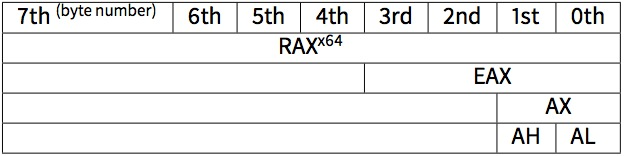

# 第二章 Hello,world!

让我们用最著名的代码例子开始吧：

```cpp
#!cpp
#include <stdio.h> 
int main() {
    printf("hello, world");
    return 0;
}; 
```

## 2.1 x86

### 2.1.1 MSVC-x86

在 MSVC 2010 中编译一下：

```cpp
#!bash    
cl 1.cpp /Fa1.asm 
```

（/Fa 选项表示生产汇编列表文件）

```cpp
#!bash
CONST   SEGMENT
$SG3830 DB      'hello, world', 00H
CONST   ENDS
PUBLIC  _main
EXTRN   _printf:PROC
; Function compile flags: /Odtp
_TEXT   SEGMENT
_main   PROC

        push    ebp
        mov     ebp, esp
        push    OFFSET $SG3830
        call    _printf
        add     esp, 4
        xor     eax, eax
        pop     ebp
        ret     0

_main   ENDP 
_TEXT   ENDS 
```

MSVC 生成的是 Intel 汇编语法。Intel 语法与 AT&T 语法的区别将在后面讨论。

编译器会把 1.obj 文件连接成 1.exe。

在我们的例子当中，文件包含两个部分：CONST（放数据）和 _TEXT（放代码）。

字符串“hello,world”在 C/C++ 类型为`const char*`，然而他没有自己的名称。

编译器需要处理这个字符串，就自己给他定义了一个$SG3830。

所以例子可以改写为：

```cpp
#!cpp
#include <stdio.h>
const char *$SG3830="hello, world";
int main() {
    printf($SG3830);
    return 0; 
}; 
```

我们回到汇编列表，正如我们看到的，字符串是由 0 字节结束的，这也是 C/C++的标准。

在代码部分，`_TEXT`，只有一个函数：main()。

函数 main()与大多数函数一样都有开始的代码与结束的代码。

函数当中的开始代码结束以后，调用了 printf()函数：`CALL _printf`。

在 PUSH 指令的帮助下，我们问候语字符串的地址（或指向它的指针）在被调用之前存放在栈当中。

当 printf()函数执行完返回到 main()函数的时候，字符串地址(或指向它的指针)仍然在堆栈中。

当我们都不再需要它的时候，堆栈指针（ESP 寄存器）需要改变。

```cpp
#!bash
ADD ESP, 4 
```

意思是 ESP 寄存器加 4。

为什么是 4 呢？由于是 32 位的代码，通过栈传送地址刚好需要 4 个字节。

在 64 位系统当中它是 8 字节。

“`ADD ESP, 4`” 实际上等同于“`POP register`”。

一些编辑器（如 Intel C++编译器）在同样的情况下可能会用 POP ECX 代替 ADD（例如这样的模式可以在 Oracle RDBMS 代码中看到，因为它是由 Intel C++编译器编译的），这条指令的效果基本相同，但是 ECX 的寄存器内容会被改写。

Intel C++编译器可能用`POP ECX`，因为这比`ADD ESP, X`需要的字节数更短，（1 字节对应 3 字节）。

在调用 printf()之后，在 C/C++代码之后执行`return 0`，return 0 是 main()函数的返回结果。

代码被编译成指令 `XOR EAX, EAX`

XOR 事实上就是异或，但是编译器经常用它来代替 `MOV EAX, 0` 原因就是它需要的字节更短（2 字节对应 5 字节）。

有些编译器用`SUB EAX, EAX` 就是 EXA 的值减去 EAX，也就是返回 0。

最后的指令 RET 返回给调用者，他是 C/C++代码吧控制返还给操作系统。

### 2.1.2 GCC-x86

现在我们尝试同样的 C/C++代码在 linux 中的 GCC 4.4.1 编译

```cpp
#!bash
gcc 1.c -o 1 
```

下一步，在 IDA 反汇编的帮助下，我们看看 main()函数是如何被创建的。

（IDA，与 MSVC 一样，也是显示 Intel 语法）。

我也可以是 GCC 生成 Intel 语法的汇编代码，添加参数

```cpp
#!bash
-S -masm=intel 
```

汇编代码：

```cpp
#!bash
main            proc near 

var_10          = dword ptr -10h

                push    ebp
                mov     ebp, esp
                and     esp, 0FFFFFFF0h
                sub     esp, 10h
                mov     eax, offset aHelloWorld ; "hello, world"
                mov     [esp+10h+var_10], eax
                call _printf
                mov eax, 0
                leave
                retn
main            endp 
```

结果几乎是相同的，“hello,world”字符串地址（保存在 data 段的）一开始保存在 EAX 寄存器当中，然后保存到栈当中。

同样的在函数开始我们看到了

```cpp
AND ESP, 0FFFFFFF0h 
```

这条指令该指令对齐在 16 字节边界在 ESP 寄存器中的值。这导致堆栈对准的所有值。

`SUB ESP，10H`在栈上分配 16 个字节。 这里其实只需要 4 个字节。

这是因为，分配堆栈的大小也被排列在一个 16 字节的边界。

该字符串的地址（或这个字符串指针），不使用 PUSH??指令，直接写入到堆栈空间。 var_10，是一个局部变量，也是 printf()的参数。

?然后调用 printf()函数。

不像 MSVC，当 gcc 编译不开启优化，它使用 MOV EAX，0 清空 EAX，而不是更短的代码。

最后一条指令，LEAVE 相当于 MOV ESP，EBP 和 POP EBP 两条指令。

换句话说，这相当于指令将堆栈指针（ESP）恢复，EBP 寄存器到其初始状态。

这是必须的，因为我们在函数的开头修改了这些寄存器的值（ESP 和 EBP）（执行 MOV EBP，ESP/AND ESP...）。

### 2.1.3 GCC:AT&T 语法

我们来看一看在 AT&T 当中的汇编语法，这个语法在 UNIX 当中更普遍。

```cpp
#!bash
gcc -S 1_1.c 
```

我们将得到这个：

```cpp
#!bash
.file   "1_1.c" 
.section    .rodata

.LC0:
        .string "hello, world"
        .text
        .globl  main
        .type   main, @function
main:
.LFB0:
        .cfi_startproc
        pushl   %ebp
        .cfi_def_cfa_offset 8
        .cfi_offset 5, -8
        movl    %esp, %ebp
        .cfi_def_cfa_register 5
        andl    $-16, %esp
        subl    $16, %esp
        movl    $.LC0, (%esp)
        call    printf
        movl    $0, %eax
        leave
        .cfi_restore 5
        .cfi_def_cfa 4, 4
        ret
        .cfi_endproc
.LFE0:
        .size   main, .-main
        .ident  "GCC: (Ubuntu/Linaro 4.7.3-1ubuntu1) 4.7.3"
        .section        .note.GNU-stack,"",@progbits 
```

有很多的宏（用点开始）。现在为了简单起见，我们先不看这些。（除了 .string ，就像一个 C 字符串编码一个 null 结尾的字符序列）。然后，我们将看到这个：

```cpp
#!bash
.LC0:
        .string "hello, world"
main:
        pushl   %ebp
        movl    %esp, %ebp
        andl    $-16, %esp
        subl    $16, %esp
        movl    $.LC0, (%esp)
        call    printf
        movl    $0, %eax
        leave
        ret 
```

在 Intel 与 AT&T 语法当中比较重要的区别就是：

操作数写在后面

```cpp
在 Intel 语法中：<instruction> <destination operand> <source operand>
在 AT&T 语法中：<instruction> <source operand> <destination operand> 
```

有一个理解它们的方法: 当你面对 intel 语法的时候，你可以想象把等号放到 2 个操作数中间，当面对 AT&T 语法的时候，你可以放一个右箭头(→）到两个操作数之间。

AT&T: 在寄存器名之前需要写一个百分号(%)并且在数字前面需要美元符($)。方括号被圆括号替代。 AT&T: 一些用来表示数据形式的特殊的符号

```cpp
l      long(32 bits)
w      word(16bits)
b      byte(8 bits) 
```

让我们回到上面的编译结果：它和在 IDA 里看到的是一样的。只有一点不同：0FFFFFFF0h 被写成了$-16，但这是一样的，10 进制的 16 在 16 进制里表示为 0x10。-0x10 就等同于 0xFFFFFFF0(这是针对于 32 位构架)。

外加返回值这里用的 MOV 来设定为 0，而不是用 XOR。MOV 仅仅是加载（load）了变量到寄存器。指令的名称并不直观。在其他的构架上，这条指令会被称作例如”load”这样的。

## 2.2 x86-64

### 2.2.1 MSVC-x86-64

让我们来试试 64-bit 的 MSVC：

```cpp
#!bash
$SG2989 DB      ’hello, world’, 00H
main    PROC 
        sub     rsp, 40
        lea     rcx, OFFSET FLAT:$SG2923
        call    printf
        xor     eax, eax
        add     rsp, 40
        ret     0
main ENDP 
```

在 x86-64 里，所有被扩展到 64 位的寄存器都有 R-前缀。并且尽量不用栈来传递函数的参数了，大量使用寄存器来传递参数，非常类似于 fastcall。

在 win64 里，RCX,RDX,R8,R9 寄存器被用来传递函数参数，如果还有更多就使用栈，在这里我们可以看到 printf()函数的参数没用通过栈来传递，而是使用了 rcx。 让我们针对 64 位来看，作为 64 位寄存器会有 R-前缀，并且这些寄存器向下兼容，32 位的部分使用 E-前缀。

如下图所示，这是 RAX/EAX/AX/AL 在 64 位 x86 兼容 cpu 里的情况 ? 

在 main()函数会返回一个 int 类型的值，在 64 位的程序里为了兼容和移植性，还是用 32 位的，所以可以看到 EAX（寄存器的低 32 位部分）在函数最后替代 RAX 被清空成 0。

### 2.2.2 GCC-x86-64

这次试试 GCC 在 64 位的 Linux 里：

```cpp
#!bash
        .string "hello, world"
main:
        sub     rsp, 8
        mov     edi, OFFSET FLAT:.LC0 ; "hello, world"
        xor     eax, eax  ; number of vector registers passed
        call    printf
        xor     eax, eax
        add     rsp, 8
        ret 
```

在 Linux,*BSD 和 Mac OS X 里使用同一种方式来传递函数参数。头 6 个参数使用`RDI,RSI,RDX,RCX,R8,R9`来传递的，剩下的要靠栈。

所以在这个程序里，字串的指针被放到 EDI（RDI 的低 32 位部）。为什么不是 64 位寄存器 RDI 那？

这是一个重点，在 64 位模式下，对低 32 位进行操作的时候，会清空高 32 位的内容。比如 MOV EAX，011223344h 将会把值写到 RAX 里，并且清空 RAX 的高 32 位区域。 如果我们打开编译好的对象文件(object file(.o)),我们会看到所有的指令：

Listing 2.8：GCC 4.4.6 x64

```cpp
#!bash
.text:00000000004004D0                  main proc near
.text:00000000004004D0 48 83 EC 08           sub rsp, 8
.text:00000000004004D4 BF E8 05 40 00        mov edi, offset format ; "hello, world"
.text:00000000004004D9 31 C0                 xor eax, eax
.text:00000000004004DB E8 D8 FE FF FF        call _printf
.text:00000000004004E0 31 C0                 xor eax, eax
.text:00000000004004E2 48 83 C4 08           add rsp, 8
.text:00000000004004E6 C3                    retn
.text:00000000004004E6                  main endp 
```

就像看到的那样，在 04004d4 那行给 edi 写字串指针的那句花了 5 个 bytes。如果把这句换做给 rdi 写指针，会花掉 7 个 bytes.就是说 GCC 在试图节省空间，为此数据段(data segment)中包含的字串不会被分配到高于 4GB 地址的空间上。

可以看到在 printf()函数调用前 eax 被清空了，这样做事因为要 eax 被用作传递向量寄存器(vector registers)的个数。

参考【21】 MichaelMatz/JanHubicka/AndreasJaeger/MarkMitchell. Systemvapplicationbinaryinterface.amdarchitecture processor supplement, . Also available as [`x86-64.org/documentation/abi.pdf`](http://x86-64.org/documentation/abi.pdf).

## 2.3 ARM

根据作者自身对 ARM 处理器的经验，选择了 2 款在嵌入式开发流行的编译器，Keil Release 6/2013 和苹果的 Xcode 4.6.3 IDE(其中使用了 LLVM-GCC4.2 编译器)，这些可以为 ARM 兼容处理器和系统芯片(System on Chip)(SOC))来进行编码。比如 ipod/iphone/ipad,windows8 rt,并且包括 raspberry pi。

### 2.3.1 未进行代码优化的 Keil 编译：ARM 模式

让我们在 Keil 里编译我们的例子

```cpp
#!bash
armcc.exe –arm –c90 –O0 1.c 
```

armcc 编译器可以生成 intel 语法的汇编程序列表，但是里面有高级的 ARM 处理器相关的宏，对我们来讲更希望看到的是 IDA 反汇编之后的结果。

```cpp
Listing 2.9: Non-optimizing Keil + ARM mode + IDA
#!bash
.text:00000000                  main
.text:00000000 10 40 2D E9              STMFD SP!, {R4,LR}
.text:00000004 1E 0E 8F E2              ADR R0, aHelloWorld ; "hello, world"
.text:00000008 15 19 00 EB              BL __2printf
.text:0000000C 00 00 A0 E3              MOV R0, #0
.text:00000010 10 80 BD E8              LDMFD SP!, {R4,PC}

.text:000001EC 68 65 6C 6C+aHelloWorld  DCB "hello, world",0 ; DATA XREF: main+4 
```

针对 ARM 处理器，我们需要预备一点知识，要知道 ARM 处理器至少有 2 种模式：ARM 模式和 thumb 模式，在 ARM 模式下，所有的指令都被激活并且都是 32 位的。在 thumb 模式下所有的指令都是 16 位的。Thumb 模式比较需要注意，因为程序可能需要更为紧凑，或者当微处理器用的是 16 位内存地址时会执行的更快。但也存在缺陷，在 thumb 模式下可用的指令没 ARM 下多，只有 8 个寄存器可以访问，有时候 ARM 模式下一条指令就能解决的问题，thumb 模式下需要多个指令来完成。

从 ARMv7 开始引入了 thumb-2 指令集。这是一个加强的 thumb 模式。拥有了更多的指令，通常会有误解，感觉 thumb-2 是 ARM 和 thumb 的混合。Thumb-2 加强了处理器的特性，并且媲美 ARM 模式。程序可能会混合使用 2 种模式。其中大量的 ipod/iphone/ipad 程序会使用 thumb-2 是因为 Xcode 将其作为了默认模式。

在例子中，我们可以发现所有指令都是 4bytes 的，因为我们编译的时候选择了 ARM 模式，而不是 thumb 模式。

最开始的指令是”`STMFD SP!, {R4, LR}`”，这条指令类似 x86 平台的 PUSH 指令，会写 2 个寄存器（R4 和 LR）的变量到栈里。不过在 armcc 编译器里输出的汇编列表里会写成”PUSH {R4, LR}”，但这并不准确，因为 PUSH 命令只在 thumb 模式下有，所以我建议大家注意用 IDA 来做反汇编工具。

这指令开始会减少 SP 的值，已加大栈空间，并且将 R4 和 LR 写入分配好的栈里。

这条指令（类似于 PUSH 的 STMFD）允许一次压入好几个值，非常实用。有一点跟 x86 上的 PUSH 不同的地方也很赞，就是这条指令不像 x86 的 PUSH 只能对 sp 操作，而是可以指定操作任意的寄存器。

“ADR R0, aHelloWorld”这条指令将 PC 寄存器的值与”hello, world”字串的地址偏移相加放入 R0，为什么说要 PC 参与这个操作那？这是因为代码是 PIC（position-independet code）的，这段代码可以独立在内存运行，而不需要更改内存地址。ADR 这条指令中，指令中字串地址和字串被放置的位置是不同的。但变化是相对的，这要看系统是如何安排字串放置的位置了。这也就说明了，为何每次获取内存中字串的绝对地址，都要把这个指令里的地址加上 PC 寄存器里的值了。

”`BL __2print`”这条指令用于调用 printf()函数，这是来说下这条指令时如何工作的：

```cpp
将 BL 指令（0xC）后面的地址写入 LR 寄存器；
然后把 printf()函数的入口地址写入 PC 寄存器，进入 printf()函数。 
```

当 printf()函数完成之后，函数会通过 LR 寄存器保存的地址，来进行返回操作。

函数返回地址的存放位置也正是“纯”RISC 处理器（例如：ARM）和 CISC 处理器(例如 x86)的区别。

另外，一个 32 位地址或者偏移不能被编码到 BL 指令里，因为 BL 指令只有 24bits 来存放地址，所有的 ARM 模式下的指令都是 4bytes（32bits）,所以一条指令里不能放满 4bytes 的地址，这也就意味着最后 2bits 总会被设置成 0，总的来说也就是有 26bits 的偏移（包括了最后 2 个 bit 一直被设为 0）会被编码进去。这也够去访问大约±32M 的了。

下面我们来看“MOV R0， #0“这条语句，这条语句就是把 0 写到了 R0 寄存器里，这是因为 C 函数返回了 0，返回值当然是放在 R0 里的。

最后一条指令是”LDMFD SP!, R4,PC“，这条指令的作用跟开始的那条 STMFD 正好相反，这条指令将栈上的值保存到 R4 和 PC 寄存器里，并且增加 SP 栈寄存器的值。这非常类似 x86 平台里的 POP 指令。最前面那条 STMFD 指令成对保存了 R4，和 LR 寄存器，LDMFD 的时候将当时这两个值保存到了 R4 和 PC 里完成了函数的返回。

我前面也说过，函数的返回地址会保存到 LD 寄存器里。在函数的最开始会把他保存到栈里，这是因为 main()函数里还需要调用 printf()函数，这个时候就会影响 LD 寄存器。在函数的最后就会将 LD 拿出栈放入 PC 寄存器里，完成函数的返回操作。最后 C/C++程序的 main()函数会返回到类似系统加载器上或者 CRT 里面。

汇编代码里的 DCB 关键字用来定义 ASCII 字串数组，就像 x86 汇编里的 DB 关键字。

### 2.3.2 未进行代码优化的 Keil 编译： thumb 模式

让我们用下面的指令讲例程用 Keil 的 thumb 模式来编译一下。

```cpp
#!bash
armcc.exe –thumb –c90 –O0 1.c 
```

我们可以在 IDA 里得到下面这样的代码： Listing 2.10:Non-optimizing Keil + thumb mode + IDA

```cpp
#!bash
.text:00000000          main
.text:00000000 10 B5                    PUSH {R4,LR}
.text:00000002 C0 A0                    ADR R0, aHelloWorld ; "hello, world"
.text:00000004 06 F0 2E F9              BL __2printf
.text:00000008 00 20                    MOVS R0, #0
.text:0000000A 10 BD                    POP {R4,PC}

.text:00000304 68 65 6C 6C+aHelloWorld  DCB "hello, world",0 ; DATA XREF: main+2 
```

我们首先就能注意到指令都是 2bytes(16bits)的了，这正是 thumb 模式的特征，BL 指令作为特例是 2 个 16bits 来构成的。只用 16bits 没可能加载 printf()函数的入口地址到 PC 寄存器。所以前面的 16bits 用来加载函数偏移的高 10bits 位，后面的 16bits 用来加载函数偏移的低 11bits 位，正如我说过的，所有的 thumb 模式下的指令都是 2bytes(16bits)。但是这样的话 thumb 指令就没法使用更大的地址。就像上面那样，最后一个 bits 的地址将会在编码指令的时候省略。总的来讲，BL 在 thumb 模式下可以访问自身地址大于±2M 大的周边的地址。

至于其他指令:PUSH 和 POP，它们跟上面讲到的 STMFD 跟 LDMFD 很类似，但这里不需要指定 SP 寄存器，ADR 指令也跟上面的工作方式相同。MOVS 指令将函数的返回值 0 写到了 R0 里，最后函数返回。

### 2.3.3 开启代码优化的 Xcode（LLVM）编译： ARM 模式

Xcode 4.6.3 不开启代码优化的情况下，会产生非常多冗余的代码，所以我们学习一个尽量小的版本。

开启-O3 编译选项

```cpp
#!bash
Listing2.11：Optimizing Xcode(LLVM)+ARM mode
__text:000028C4         _hello_world
__text:000028C4 80 40 2D E9                     STMFD   SP!, {R7,LR}
__text:000028C8 86 06 01 E3                     MOV     R0, #0x1686
__text:000028CC 0D 70 A0 E1                     MOV     R7, SP
__text:000028D0 00 00 40 E3                     MOVT    R0, #0
__text:000028D4 00 00 8F E0                     ADD     R0, PC, R0
__text:000028D8 C3 05 00 EB                     BL      _puts
__text:000028DC 00 00 A0 E3                     MOV     R0, #0
__text:000028E0 80 80 BD E8                     LDMFD   SP!, {R7,PC}

__cstring:00003F62 48 65 6C 6C+aHelloWorld_0    DCB "Hello world!",0 
```

STMFD 和 LDMFD 对我们来说已经非常熟悉了。

MOV 指令就是将 0x1686 写入 R0 寄存器里。这个值也正是字串”Hello world！”的指针偏移。

R7 寄存器里放入了栈地址，我们继续。

MOVT R0， #0 指令时将 R0 的高 16bits 写入 0。这是因为普通情况下 MOV 这条指令在 ARM 模式下，只对低 16bits 进行操作。需要记住的是所有在 ARM 模式下的指令都被限定在 32bits 内。当然这个限制并不影响 2 个寄存器直接的操作。这也是 MOVT 这种写高 16bits 指令存在的意义。其实这样写的代码会感觉有点多余，因为”`MOVS R0，#0x1686`”这条指令也能把高 16 位清 0。或许这就是相对于人脑来说编译器的不足。

“`ADD R0，PC，R0`“指令把 R0 寄存器的值与 PC 寄存器的值进行相加并且保存到 R0 寄存器里面，用来计算”Hello world!”这个字串的绝对地址。上面已经介绍过了，这是因为代码是 PIC(Position-independent code)的，所以这里需要这么做。

BL 指令用来调用 printf()的替代函数 puts()函数。

GCC 将 printf（）函数替换成了 puts()。因为 printf()函数只有一个参数的时候跟 puts()函数是类似的。

printf()函数的字串参数里存在特殊控制符（例如 ”%s”,”\n” ，需要注意的是，程序里字串里没有“\n”，因为在 puts()函数里这是不需要的）的时候，两个函数的功效就会不同。

为什么编译器会替换 printf()到 puts()那？因为 puts()函数更快。

puts()函数效率更快是因为它只是做了字串的标准输出(stdout)并不用比较%符号。

下面，我们可以看到非常熟悉的”MOV R0, #0”指令，用来将 R0 寄存器设为 0。

### 2.3.4 开启代码优化的 Xcode(LLVM)编译 thumb-2 模式

在默认情况下，Xcode4.6.3 会生成如下的 thumb-2 代码

Listing 2.12:Optimizing Xcode(LLVM)+thumb-2 mode

```cpp
#!bash
__text:00002B6C         _hello_world
__text:00002B6C 80 B5           PUSH    {R7,LR}
__text:00002B6E 41 F2 D8 30     MOVW    R0, #0x13D8
__text:00002B72 6F 46           MOV     R7, SP
__text:00002B74 C0 F2 00 00     MOVT.W  R0, #0
__text:00002B78 78 44           ADD     R0, PC
__text:00002B7A 01 F0 38 EA     BLX     _puts
__text:00002B7E 00 20           MOVS    R0, #0
__text:00002B80 80 BD           POP     {R7,PC}
...
__cstring:00003E70 48 65 6C 6C 6F 20+aHelloWorld DCB "Hello world!",0xA,0 
```

BL 和 BLX 指令在 thumb 模式下情况需要我们回忆下刚才讲过的，它是由一对 16-bit 的指令来构成的。在 thumb-2 模式下这条指令跟 thumb 一样被编码成了 32-bit 指令。非常容易观察到的是，thumb-2 的指令的机器码也是从 0xFx 或者 0xEx 的。对于 thumb 和 thumb-2 模式来说，在 IDA 的结果里机器码的位置和这里是交替交换的。对于 ARM 模式来说 4 个 byte 也是反向的，这是因为他们用了不同的字节序。所以我们可以知道，MOVW，MOVT.W 和 BLX 这几个指令的开始都是 0xFx。

在 thumb-2 指令里有一条是”MOVW R0, #0x13D8”,它的作用是写数据到 R0 的低 16 位里面。

“`MOVT.W R0, #0`”的作用类似与前面讲到的 MOVT 指令，但它可以工作在 thumb-2 模式下。

还有些跟上面不同的地方，比如 BLX 指令替代了上面用到的 BL 指令，这条指令不仅将控制 puts()函数返回的地址放入了 LR 寄存器里，并且讲代码从 thumb 模式转换到了 ARM 模式（或者 ARM 转换到 thumb（根据现有情况判断））。这条指令跳转到下面这样的位置（下面的代码是 ARM 编码模式）。

```cpp
#!bash
__symbolstub1:00003FEC _puts             ; CODE XREF: _hello_world+E
__symbolstub1:00003FEC 44 F0 9F E5       LDR PC, =__imp__puts 
```

可能会有细心的读者要问了:为什么不直接跳转到 puts()函数里面去？

因为那样做会浪费内存空间。

很多程序都会使用额外的动态库(dynamic libraries)(Windows 里面的 DLL，还有*NIX 里面的.so，MAC OS X 里面的.dylib),通常使用的库函数会被放入动态库中，当然也包括标准 C 函数 puts()。

在可执行的二进制文件里(Windows 的 PE 里的.exe 文件，ELF 和 Mach-O 文件)都会有输入表段。它是一个用来引入额外模块里模块名称和符号（函数或者全局变量）的列表。

系统加载器（OS loader）会加载所有需要的模块，当在主模块里枚举输入符号的时候，会把每个符号正确的地址与相应的符号确立起来。

在我们的这个例子里，`__imp__puts`就是一个系统加载器加载额外模块的 32 位的地址值。LDR 指令只需要把这个值加载到 PC 里面去，就可以控制程序流程到 puts()函数里去。

所以只需要在系统加载器里的时候，一次性的就能将每个符号所对应的地址确定下来，这是个提高效率的好方式。

外加，我们前面也指出过，我们没办法只用一条指令并且不做内存操作的情况下就将一个 32bit 的值保存到寄存器里，ARM 并不是唯一的模式的情况下，程序里去跳入动态库中的某个函数里，最好的办法就是这样做一些类似与上面这样单一指令的函数（称做 thunk function），然后从 thumb 模式里也能去调用。

在上面的例子（ARM 编译的那个例子）中 BL 指令也是跳转到了同一个 thunk function 里。尽管没有进行模式的转变（所以指令里不存在那个”X”）。