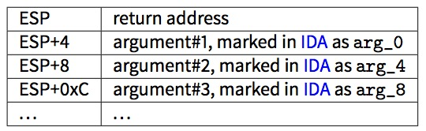

# 第四章 栈

栈在计算科学中是最重要和最基本的数据结构。

严格的来说,它只是在 x86 中被 ESP,或 x64 中被 RSP,或 ARM 中被 SP 所指向的一段程序内存区域。 ?? ?访问栈内存,最常使用的指令是 PUSH 和 POP(在 x86 和 ARM Thumb 模式中)。

PUSH 指令在 32 位模式下,会将 ESP/RSP/SP 的值减去 4(在 64 位系统中,会减去 8),然后将操作数写入到 ESP/RSP/SP 指向的内存地址。

POP 是相反的操作运算:从 SP 指向的内存地址中获取数据,存入操作数(一般为寄存器), 然后将 SP(栈指针)加 4(或 8)。

## 4.1 为什么栈反向增长?

按正常思维来说,我们会认为像其它数据结构一样,栈是正向增长的,比如:栈指针会指向高地址。


我们知道:

????? ?户核心部分的映像文件被合理的分为三个部分,程度代码段在内存空闲部分运行。 在运行过程中,这部分是具有写保护的,所有进程都可以共享访问这个程序。在内存空间 中,程序 text 区段开始的 8k 字节是不能共享的可写区段,这个?大?小可以使?用系统函数来扩 ?大。在内存?高位地址是可以像硬件指针?自由活动向下增长的栈区段。 ?????

## 4.2 栈可以用来做什么?

### 4.2.1 保存函数返回地址以便在函数执行完成时返回控制权

#### x86

当使用 CALL 指令去调用一个函数时,CALL 后面一条指令的地址会被保存到栈中,使用无条件跳转指令跳转到 CALL 中执行。 ? ?CALL 指令等价于 PUSH 函数返回地址和 JMP 跳转。

```cpp
#!cpp
void f()
{
    f();
}; 
```

?MSVC 2008 显示的问题:

```cpp
#!bash
c:\tmp6>cl ss.cpp /Fass.asm
Microsoft (R) 32-bit C/C++ Optimizing Compiler Version 15.00.21022.08 for 80x86
Copyright (C) Microsoft Corporation.  All rights reserved.
ss.cpp
c:\tmp6\ss.cpp(4) : warning C4717: ’f’ : recursive on all control paths, function will cause
    runtime stack overflow 
```

但无论如何还是生成了正确的代码:

```cpp
#!bash
?f@@YAXXZ PROC                                          ; f
; File c:\tmp6\ss.cpp
; Line 2
        push ebp
        mov     ebp, esp
; Line 3
        call    ?f@@YAXXZ                               ; f
; Line 4
        pop ebp
        ret     0
?f@@YAXXZ ENDP                                          ; f 
```

??如果我们设置优化(/0x)标识,生成的代码将不会出现栈溢出,并且会运行的很好。

```cpp
#!bash
?f@@YAXXZ PROC                                          ; f
; File c:\tmp6\ss.cpp
; Line 2
$LL3@f:
; Line 3
        jmp     SHORT $LL3@f
?f@@YAXXZ ENDP                                          ; f 
```

GCC 4.4.1 在这两种条件下,会生成同样的代码,而且不会有任何警告。

#### ARM

ARM 程序员经常使用栈来保存返回地址,但有些不同。像是提到的“Hello,World!(2.3), RA 保存在 LR(链接寄存器)。然而,如果需要调用另外一个函数,需要多次使用 LR 寄存器,它的值会被保存起来。通常会在函数开始的时候保存。像我们经常看到的指令“`PUSH R4-R7, LR`”,在函数结尾处的指令“`POP R4-R7, PC`”,在函数中使?用到的寄存器会被保存到栈中,包括 LR。

尽管如此,如果一个函数从未调用其它函数,在 ARM 专用术语中被叫称作叶子函数。因此,叶?函数不需要 LR 寄存器。如果一个函数很小并使用了少量的寄存器,可能不会?到栈。因此,是可以不使用栈而实现调用叶子函数的。在扩展 ARM 上不使用栈,这样就会比在 x86 上运行要快。在未分配栈内存或栈内存不可用的情况下,这种方式是非常有用的。

### 4.2.2 传递函数参数

在 x86 中,最常见的传参方式是“cdecl”:

```cpp
#!bash
push arg3
push arg2
push arg1
call f
add esp, 4*3 
```

被调用函数通过栈指针访问函数参数。因此,这就是为什么要在函数 f()执行之前将数据放入栈中的原因。



来看一下其它调用约定。没有意义也没有必要强迫程序员一定要使用栈来传递参数。

这不是必需的,可以不使用栈,通过其它方式来实现。

例如,可以为参数分配一部分堆空间,存入参数,将指向这部分内存的指针存入 EAX,这样就可以了。然而,在 x86 和 ARM 中,使用栈传递参数还是更加方便的。

另外一个问题,被调用的函数并不知道有多少参数被传递进来。有些函数可以传递不同个数的参数(如:printf()),通过一些说明性的字符(以%开始)才可以判断。如果我们这样调用函数

```cpp
#!cpp
printf("%d %d %d", 1234); 
```

`printf()`会传?入 1234,然后另外传入栈中的两个随机数字。这就让我们使用哪种方式调用 main()函数变得不重要,像`main(),main(int argc, char *argv[])`或`main(int argc, char *argv[], char *envp[])`。

事实上,CRT 函数在调?main()函数时,使用了下面的指令: ???? #!bash push envp push argv push argc call main ...

?如果你使用了没有参数的 main()函数,尽管如此,但它们仍然在栈中,只是无法使用。如果你使用了`main(int argc, char *argv[])`,你可以使用两个参数,第三个参数对你的函数是“不可见的”。如果你使用`main(int argc)`这种方式,同样是可以正常运?的。

### 4.2.3 局部变量存放

局部变量存放到任何你想存放的地方,但传统上来说,大家更喜欢通过将栈指针移动到栈底,来存放局部变量,当然,这不是必需的。

### 4.2.4 x86: alloca() 函数

对 alloca()函数并没有值得学习的。

该函数的作用像 malloc()一样,但只会在栈上分配内存。

它分配的内存并不需要在函数结束时,调用像 free()这样的函数来释放,当函数运行结束,ESP 的值还原时,这部分内存会自动释放。对 alloca()函数的实现也没有什么值得介绍的。

这个函数,如果精简一下,就是将 ESP 指针指向栈底,根据你所需要的内存大小将 ESP 指向所分配的内存块。让我们试一下:

```cpp
#!cpp
#include <malloc.h>
#include <stdio.h>
void f() {
    char *buf=(char*)alloca (600);
    _snprintf (buf, 600, "hi! %d, %d, %d\n", 1, 2, 3);
    puts (buf);
}; 
```

(`_snprintf()`函数作用与 printf()函数基本相同,不同的地方是 printf()会将结果输出到的标准输出 stdout,?`_snprintf()`会将结果保存到内存中,后面两?代码可以使用 printf()替换,但我想说明小内存的使用习惯。)

#### MSVC

让我们来编译 (MSVC 2010):

```cpp
#!bash
...
???????        mov    eax, 600         ; 00000258H
        call   __alloca_probe_16
        mov    esi, esp

???????        push   3
        push   2
        push   1
        push   OFFSET $SG2672
        push   600              ; 00000258H
        push   esi
        call   __snprintf

???????        push   esi
        call   _puts
        add    esp, 28          ; 0000001cH
... 
```

? ??这唯一的函数参数是通过 EAX(未使用栈)传递。在函数调用结束时,ESP 会指向 600 字节的内存,我们可以像使用一般内存一样来使用它做为缓冲区。

#### GCC + Intel 格式

GCC 4.4.1 不需要调用函数就可以实现相同的功能:

```cpp
#!bash
.LC0:
           .string "hi! %d, %d, %d\n"
f:
           push    ebp
           mov     ebp, esp
           push    ebx
           sub     esp, 660
           lea     ebx, [esp+39]
           and     ebx, -16                             ; align pointer by 16-bit border
           mov     DWORD PTR [esp], ebx                 ; s
           mov     DWORD PTR [esp+20], 3
           mov     DWORD PTR [esp+16], 2
           mov     DWORD PTR [esp+12], 1
           mov     DWORD PTR [esp+8], OFFSET FLAT:.LC0  ; "hi! %d, %d, %d\n"
           mov     DWORD PTR [esp+4], 600               ; maxlen
           call    _snprintf
           mov     DWORD PTR [esp], ebx
           call    puts
           mov     ebx, DWORD PTR [ebp-4]
           leave
           ret 
```

?####GCC + AT&T 格式

我们来看相同的代码,但使用了 AT&T 格式:

```cpp
#!bash
.LC0:
        .string "hi! %d, %d, %d\n"
f:
        pushl %ebp
        movl    %esp, %ebp
        pushl   %ebx
        subl    $660, %esp
        leal    39(%esp), %ebx
        andl    $-16, %ebx
        movl    %ebx, (%esp)
        movl    $3, 20(%esp)
        movl    $2, 16(%esp)
        movl    $1, 12(%esp)
        movl    $.LC0, 8(%esp)
        movl    $600, 4(%esp)
        call    _snprintf
        movl    %ebx, (%esp)
        call    puts
        movl    -4(%ebp), %ebx
        leave
        ret 
```

?代码与上面的那个图是相同的。

例如:`movl $3, 20(%esp)`与`mov DWORD PTR [esp + 20],3`是等价的,Intel 的内存地址增加是使用 register+offset,而 AT&T 使用的是 offset(%register)。

### 4.2.5 (Windows) 结构化异常处理

SEH 也是存放在栈中的(如果存在的话)。 想了解更多，请等待后续翻译在(51.3)。

### 4.2.6 缓冲区溢出保护

想了解更多，请等待后续翻译，在(16.2)。

## 4.3 典型的内存布局

在 32 位系统中，函数开始时，栈的布局:

