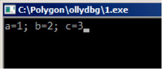
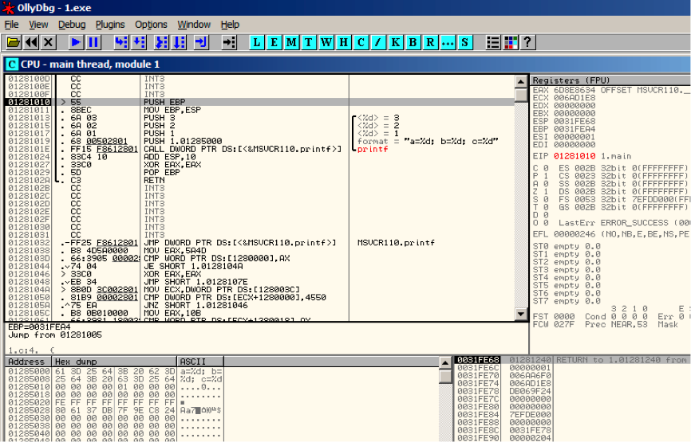
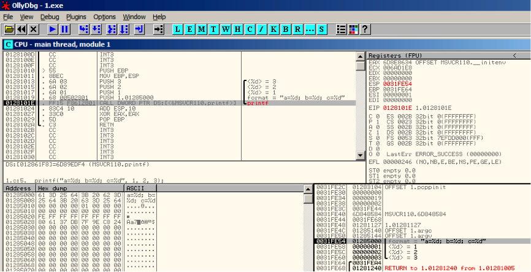
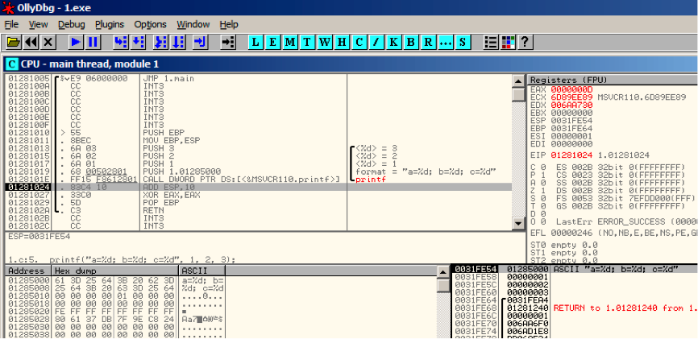
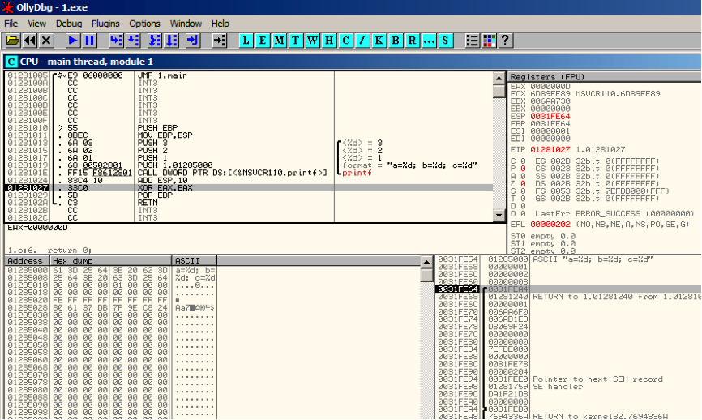

# Chapter 5 printf() 与参数处理

现在让我们扩展"hello, world"(2)中的示例，将其中 main()函数中 printf 的部分替换成这样

```cpp
#!cpp
#include <stdio.h>
int main()
{
    printf("a=%d; b=%d; c=%d", 1, 2, 3);
    return 0;
}; 
```

## 5.1 x86: 3 个参数

### 5.1.1 MSVC

在我们用 MSVC 2010 Express 编译后可以看到：

```cpp
#!bash
$SG3830 DB ’a=%d; b=%d; c=%d’, 00H
...
        push 3
        push 2
        push 1
        push OFFSET $SG3830
        call _printf
        add esp, 16        ; 00000010H 
```

这和之前的代码几乎一样，但是我们现在可以看到 printf() 的参数被反序压入了栈中。第一个参数被最后压入。

另外，在 32bit 的环境下 int 类型变量占 4 bytes。

那么，这里有 4 个参数 `4*4=16 ——` 恰好在栈中占据了 16bytes：一个 32bit 字符串指针，和 3 个 int 类型变量。

当函数执行完后，执行"`ADD ESP, X`"指令恢复栈指针寄存器(ESP 寄存器)。通常可以在这里推断函数参数的个数:用 X 除以 4。

当然，这只涉及`__cdecl`函数调用方式。

也可以在最后一个函数调用后，把几个"`ADD ESP, X`"指令合并成一个。

```cpp
#!bash
push a1
push a2
call ...
...
push a1
call ...
...
push a1
push a2
push a3
call ...
add esp, 24 
```

### 5.1.2 MSVC 与 ollyDbg

现在我们来在 OllyDbg 中加载这个范例。我们可以尝试在 MSVC 2012 加 /MD 参数编译这个示例，也就是链接 `MSVCR*.dll`，那么我们就可以在 debugger 中清楚的看到调用的函数。

在 OllyDbg 中载入程序，最开始的断点在 ntdll.dll 中，接着按 F9(run)，然后第二个断点在 CRT-code 中。现在我们来找 main()函数。

往下滚动屏幕，找到下图这段代码(MSVC 把 main()函数分配在代码段开始处) 见图 5.3

点击 PUSH EBP 指令，按下 F2(设置断点)然后按下 F9(run),通过这些操作来跳过 CRT-code，因为我们现在还不必关注这部分。

按 6 次 F8(step over)。见图 5.4 现在 EIP 指向了 CALL printf 的指令。和其他调试器一样，OllyDbg 高亮了有值改变的寄存器。所以每次你按下 F8,EIP 都在改变然后它看起来便是红色的。ESP 同时也在改变，因为它是指向栈的

栈中的数据又在哪？那么看一下调试器右下方的窗口:


图 5.1

然后我们可以看到有三列，栈的地址，元组数据，以及一些 OllyDbg 的注释，OllyDbg 可以识别像 printf()这样的字符串，以及后面的三个值。

右击选中字符串，然后点击”follow in dump”,然后字符串就会出现在左侧显示内存数据的地方，这些内存的数据可以被编辑。我们可以修改这些字符串，之后这个例子的结果就会变的不同，现在可能并不是很实用。但是作为练习却非常好，可以体会每部分是如何工作的。

再按一次 F8(step over)

然后我们就可以看到输出



图 5.2 执行 printf()函数

让我们看看寄存器和栈是怎样变化的 见图 5.5

EAX 寄存器现在是 0xD(13).这是正确的，printf()返回打印的字符，EIP 也变了——

事实上现在指向 CALL printf 之后下一条指令的地址.ECX 和 EDX 的值也改变了。显然，printf()函数的内部机制对它们进行了使用。

很重要的一点 ESP 的值并没有发生变化，栈的状态也是！我们可以清楚地看到字符串和相应的 3 个值还是在那里，实际上这就是 cdecl 调用方式。被调用的函数并不清楚栈中参数，因为这是调用体的任务。

再按一下 F8 执行 ADD ESP， 10 见图 5.6

ESP 改变了，但是值还是在栈中！当然 没有必要用 0 或者别的数据填充这些值。

因为在栈指针寄存器之上的数据都是无用的。



图 5.3 OllyDbg:main()初始处



图 5.4 OllyDbg:printf()执行时



图 5.5 Ollydbg:printf()执行后



图 5.6 OllyDbg ADD ESP, 10 执行完后

### 5.1.3 GCC

现在我们将同样的程序在 linux 下用 GCC4.4.1 编译后放入 IDA 看一下:

```cpp
#!bash
main            proc near

var_10          = dword ptr -10h
var_C           = dword ptr -0Ch
var_8           = dword ptr -8
var_4           = dword ptr -4

                push    ebp
                mov     ebp, esp
                and     esp, 0FFFFFFF0h
                sub     esp, 10h
                mov     eax, offset aADBDCD ; "a=%d; b=%d; c=%d"
                mov     [esp+10h+var_4], 3
                mov     [esp+10h+var_8], 2
                mov     [esp+10h+var_C], 1
                mov     [esp+10h+var_10], eax
                call    _printf
                mov     eax, 0
                leave
                retn
main            endp 
```

MSVC 与 GCC 编译后代码的不同点只是参数入栈的方法不同，这里 GCC 不用 PUSH/POP 而是直接对栈操作。

### 5.1.4 GCC 与 GDB

接着我们尝试在 linux 中用 GDB 运行下这个示例程序。

-g 表示将 debug 信息插入可执行文件中

```cpp
#!bash
$ gcc 1.c -g -o 1 
```

反编译：

```cpp
#!bash
$ gdb 1
GNU gdb (GDB) 7.6.1-ubuntu
Copyright (C) 2013 Free Software Foundation, Inc.
License GPLv3+: GNU GPL version 3 or later <http://gnu.org/licenses/gpl.html>
This is free software: you are free to change and redistribute it.
There is NO WARRANTY, to the extent permitted by law. Type "show copying"
and "show warranty" for details.
This GDB was configured as "i686-linux-gnu".
For bug reporting instructions, please see:
<http://www.gnu.org/software/gdb/bugs/>...
Reading symbols from /home/dennis/polygon/1...done. 
```

表 5.1 在 printf()处设置断点

```cpp
#!bash
(gdb) b printf
Breakpoint 1 at 0x80482f0 
```

Run 这里没有 printf()函数的源码，所以 GDB 没法显示出源码，但是却可以这样做

```cpp
#!bash
(gdb) run
Starting program: /home/dennis/polygon/1

Breakpoint 1, __printf (format=0x80484f0 "a=%d; b=%d; c=%d") at printf.c:29
29 printf.c: No such file or directory. 
```

打印 10 组栈中的元组数据，左边是栈中的地址

```cpp
#!bash
(gdb) x/10w $esp
0xbffff11c: 0x0804844a 0x080484f0 0x00000001 0x00000002
0xbffff12c: 0x00000003 0x08048460 0x00000000 0x00000000
0xbffff13c: 0xb7e29905 0x00000001 
```

最开始的是返回地址(0x0804844a),我们可以确定在这里，于是可以反汇编这里的代码

```cpp
#!bash
(gdb) x/5i 0x0804844a
0x804844a <main+45>: mov $0x0,%eax
0x804844f <main+50>: leave
0x8048450 <main+51>: ret
0x8048451: xchg %ax,%ax
0x8048453: xchg %ax,%ax 
```

两个 XCHG 指令，明显是一些垃圾数据,可以忽略 第二个(0x080484f0)是一处格式化字符串

```cpp
#!bash
(gdb) x/s 0x080484f0
0x80484f0: "a=%d; b=%d; c=%d" 
```

而其他三个则是 printf()函数的参数，另外的可能只是栈中的垃圾数据，但是也可能是其他函数的数据，例如它们的本地变量。这里可以忽略。 执行 finish ，表示执行到函数结束。在这里是执行到 printf()完。

```cpp
#!bash
(gdb) finish
Run till exit from #0 __printf (format=0x80484f0 "a=%d; b=%d; c=%d") at printf.c:29
main () at 1.c:6
6 return 0;
Value returned is $2 = 13 
```

GDB 显示了 printf()函数在 eax 中的返回值，这是打印字符的数量，就像在 OllyDbg 中一样。

我们同样看到了”return 0;” 及这在 1.c 文件中第 6 行所代表的含义。1.c 文件就在当前目录下，GDB 就在那找到了字符串。但是 GDB 又是怎么知道当前执行到了哪一行？

事实上这和编译器有关，当生成调试信息时，同样也保存了一张代码行号与指令地址的关系表。

查看 EAX 中储存的 13:

```cpp
#!bash
(gdb) info registers
eax            0xd      13
ecx            0x0      0
edx            0x0      0
ebx            0xb7fc0000       -1208221696
esp            0xbffff120       0xbffff120
ebp            0xbffff138       0xbffff138
esi            0x0      0
edi            0x0      0
eip            0x804844a        0x804844a <main+45>
... 
```

反汇编当前的指令

```cpp
#!bash
(gdb) disas
Dump of assembler code for function main:
    0x0804841d <+0>:    push    %ebp
    0x0804841e <+1>:    mov     %esp,%ebp
    0x08048420 <+3>:    and     $0xfffffff0,%esp
    0x08048423 <+6>:    sub     $0x10,%esp
    0x08048426 <+9>:    movl    $0x3,0xc(%esp)
    0x0804842e <+17>:   movl    $0x2,0x8(%esp)
    0x08048436 <+25>:   movl    $0x1,0x4(%esp)
    0x0804843e <+33>:   movl    $0x80484f0,(%esp)
    0x08048445 <+40>:   call    0x80482f0 <printf@plt>
=>  0x0804844a <+45>:   mov     $0x0,%eax
    0x0804844f <+50>:   leave
    0x08048450 <+51>:   ret
End of assembler dump. 
```

GDB 默认使用 AT&T 语法显示，当然也可以转换至 intel:

```cpp
#!bash
(gdb) set disassembly-flavor intel
(gdb) disas
Dump of assembler code for function main:
    0x0804841d <+0>:    push    ebp
    0x0804841e <+1>:    mov     ebp,esp
    0x08048420 <+3>:    and     esp,0xfffffff0
    0x08048423 <+6>:    sub     esp,0x10
    0x08048426 <+9>:    mov     DWORD PTR [esp+0xc],0x3
    0x0804842e <+17>:   mov     DWORD PTR [esp+0x8],0x2
    0x08048436 <+25>:   mov     DWORD PTR [esp+0x4],0x1
    0x0804843e <+33>:   mov     DWORD PTR [esp],0x80484f0
    0x08048445 <+40>:   call    0x80482f0 <printf@plt>
=>  0x0804844a <+45>:   mov     eax,0x0
    0x0804844f <+50>:   leave
    0x08048450 <+51>:   ret
End of assembler dump. 
```

执行下一条指令,GDB 显示了结束大括号，代表着这里是函数结束部分。

```cpp
#!bash
(gdb) step
7 }; 
```

在执行完 MOV EAX, 0 后我们可以看到 EAX 就已经变为 0 了。

```cpp
#!bash
(gdb) info registers
eax 0x0 0
ecx 0x0 0
edx 0x0 0
ebx 0xb7fc0000 -1208221696
esp 0xbffff120 0xbffff120
ebp 0xbffff138 0xbffff138
esi 0x0 0
edi 0x0 0
eip 0x804844f 0x804844f <main+50>
... 
```

## 5.2 x64: 8 个参数

为了看其他参数如何通过栈传递的，我们再次修改代码将参数个数增加到 9 个(printf()格式化字符串和 8 个 int 变量)

```cpp
#!cpp
#include <stdio.h>
int main() {
        printf("a=%d; b=%d; c=%d; d=%d; e=%d; f=%d; g=%d; h=%d
", 1, 2, 3, 4, 5, 6, 7, 8);
        return 0;
}; 
```

### 5.2.1 MSVC

正如我们之前所见，在 win64 下开始的 4 个参数传递至 RCX，RDX，R8，R9 寄存器，

然而 MOV 指令，替代 PUSH 指令。用来准备栈数据，所以值都是直接写入栈中

```cpp
#!bash
$SG2923 DB ’a=%d; b=%d; c=%d; d=%d; e=%d; f=%d; g=%d; h=%d’, 0aH, 00H

main    PROC
        sub     rsp, 88

        mov     DWORD PTR [rsp+64], 8
        mov     DWORD PTR [rsp+56], 7
        mov     DWORD PTR [rsp+48], 6
        mov     DWORD PTR [rsp+40], 5
        mov     DWORD PTR [rsp+32], 4
        mov     r9d, 3
        mov     r8d, 2
        mov     edx, 1
        lea     rcx, OFFSET FLAT:$SG2923
        call    printf

        ; return 0
        xor eax, eax

        add     rsp, 88
        ret     0
main ENDP
_TEXT ENDS
END 
```

表 5.2：msvc 2010 x64

### 5.2.2 GCC

在*NIX 系统，对于 x86-64 这也是同样的原理，除了前 6 个参数传递给了 RDI，RSI，RDX，RCX，R8，R9 寄存器。GCC 将生成的代码字符指针写入了 EDI 而不是 RDI(如果有的话)——我们在 2.2.2 节看到过这部分

同样我们也看到在寄存器 EAX 被清零前有个`printf() call`:

```cpp
.LC0:
    .string "a=%d; b=%d; c=%d; d=%d; e=%d; f=%d; g=%d; h=%d
"

main:
    sub     rsp, 40

    mov     r9d, 5
    mov     r8d, 4
    mov     ecx, 3
    mov     edx, 2
    mov     esi, 1
    mov     edi, OFFSET FLAT:.LC0
    xor     eax, eax ; number of vector registers passed
    mov     DWORD PTR [rsp+16], 8
    mov     DWORD PTR [rsp+8], 7
    mov     DWORD PTR [rsp], 6
    call    printf

    ; return 0

    xor     eax, eax
    add     rsp, 40
    ret 
```

表 5.3:GCC 4.4.6 –o 3 x64

### 5.2.3 GCC + GDB

让我们在 GDB 中尝试这个例子。

```cpp
#!bash
$ gcc -g 2.c -o 2 
```

反编译：

```cpp
#!bash
$ gdb 2
GNU gdb (GDB) 7.6.1-ubuntu
Copyright (C) 2013 Free Software Foundation, Inc.
License GPLv3+: GNU GPL version 3 or later <http://gnu.org/licenses/gpl.html>
This is free software: you are free to change and redistribute it.
There is NO WARRANTY, to the extent permitted by law. Type "show copying"
and "show warranty" for details.
This GDB was configured as "x86_64-linux-gnu".
For bug reporting instructions, please see:
<http://www.gnu.org/software/gdb/bugs/>...
Reading symbols from /home/dennis/polygon/2...done. 
```

表 5.4:在 printf()处下断点，然后 run

```cpp
(gdb) b printf
Breakpoint 1 at 0x400410
(gdb) run
Starting program: /home/dennis/polygon/2
Breakpoint 1, __printf (format=0x400628 "a=%d; b=%d; c=%d; d=%d; e=%d; f=%d; g=%d; h=%d
") at
printf.c:29
29 printf.c: No such file or directory. 
```

寄存器 RSI/RDX/RCX/R8/R9 都有应有的值，RIP 则是 printf()函数地址

```cpp
#!bash
(gdb) info registers
rax     0x0     0
rbx     0x0     0
rcx     0x3     3
rdx     0x2     2
rsi     0x1     1
rdi     0x400628 4195880
rbp     0x7fffffffdf60 0x7fffffffdf60
rsp     0x7fffffffdf38 0x7fffffffdf38
r8      0x4     4
r9      0x5     5
r10     0x7fffffffdce0 140737488346336
r11     0x7ffff7a65f60 140737348263776
r12     0x400440 4195392
r13     0x7fffffffe040 140737488347200
r14     0x0     0
r15     0x0     0
rip     0x7ffff7a65f60 0x7ffff7a65f60 <__printf>
... 
```

表 5.5 检查格式化字符串

```cpp
#!bash
(gdb) x/s $rdi
0x400628: "a=%d; b=%d; c=%d; d=%d; e=%d; f=%d; g=%d; h=%d
" 
```

用 x/g 命令显示栈内容

```cpp
#!bash
(gdb) x/10g $rsp
0x7fffffffdf38: 0x0000000000400576 0x0000000000000006
0x7fffffffdf48: 0x0000000000000007 0x00007fff00000008
0x7fffffffdf58: 0x0000000000000000 0x0000000000000000
0x7fffffffdf68: 0x00007ffff7a33de5 0x0000000000000000
0x7fffffffdf78: 0x00007fffffffe048 0x0000000100000000 
```

与之前一样，第一个栈元素是返回地址，我们也同时也看到在高 32 位的 8 也没有被清除。 0x00007fff00000008，这是因为是 32 位 int 类型的，因此，高寄存器或堆栈部分可能包含一些随机垃圾数值。

printf()函数执行之后将返回控制，GDB 会显示整个 main()函数。

```cpp
#!bash
(gdb) set disassembly-flavor intel
(gdb) disas 0x0000000000400576
Dump of assembler code for function main:
    0x000000000040052d <+0>:    push    rbp
    0x000000000040052e <+1>:    mov     rbp,rsp
    0x0000000000400531 <+4>:    sub     rsp,0x20
    0x0000000000400535 <+8>:    mov     DWORD PTR [rsp+0x10],0x8
    0x000000000040053d <+16>:   mov     DWORD PTR [rsp+0x8],0x7
    0x0000000000400545 <+24>:   mov     DWORD PTR [rsp],0x6
    0x000000000040054c <+31>:   mov     r9d,0x5
    0x0000000000400552 <+37>:   mov     r8d,0x4
    0x0000000000400558 <+43>:   mov     ecx,0x3
    0x000000000040055d <+48>:   mov     edx,0x2
    0x0000000000400562 <+53>:   mov     esi,0x1
    0x0000000000400567 <+58>:   mov     edi,0x400628
    0x000000000040056c <+63>:   mov     eax,0x0
    0x0000000000400571 <+68>:   call    0x400410 <printf@plt>
    0x0000000000400576 <+73>:   mov     eax,0x0
    0x000000000040057b <+78>:   leave
    0x000000000040057c <+79>:   ret
End of assembler dump. 
```

执行完 printf()后，就会清零 EAX，然后发现 EAX 早已为 0，RIP 现在则指向 LEAVE 指令。

```cpp
#!bash
(gdb) finish
Run till exit from #0 __printf (format=0x400628 "a=%d; b=%d; c=%d; d=%d; e=%d; f=%d; g=%d; h=%d
n") at printf.c:29
a=1; b=2; c=3; d=4; e=5; f=6; g=7; h=8
main () at 2.c:6
6       return 0;
Value returned is $1 = 39
(gdb) next
7 };
(gdb) info registers
rax     0x0     0
rbx     0x0     0
rcx     0x26    38
rdx     0x7ffff7dd59f0 140737351866864
rsi     0x7fffffd9 2147483609
rdi     0x0     0
rbp     0x7fffffffdf60 0x7fffffffdf60
rsp     0x7fffffffdf40 0x7fffffffdf40
r8      0x7ffff7dd26a0 140737351853728
r9      0x7ffff7a60134 140737348239668
r10     0x7fffffffd5b0 140737488344496
r11     0x7ffff7a95900 140737348458752
r12     0x400440 4195392
r13     0x7fffffffe040 140737488347200
r14     0x0     0
r15     0x0     0
rip     0x40057b 0x40057b <main+78>
... 
```

## 5.3 ARM:3 个参数

习惯上，ARM 传递参数的规则(参数调用)如下:前 4 个参数传递给了 R0-R3 寄存器，其余的参数则在栈中。这和 fastcall 或者 win64 传递参数很相似

### 5.3.1 Non-optimizing Keil + ARM mode(非优化 keil 编译模式 + ARM 环境)

```cpp
#!bash
.text:00000014            printf_main1
.text:00000014 10 40 2D E9       STMFD   SP!, {R4,LR}
.text:00000018 03 30 A0 E3       MOV     R3, #3
.text:0000001C 02 20 A0 E3       MOV     R2, #2
.text:00000020 01 10 A0 E3       MOV     R1, #1
.text:00000024 1D 0E 8F E2       ADR     R0, aADBDCD ; "a=%d; b=%d; c=%d
"
.text:00000028 0D 19 00 EB       BL      __2printf
.text:0000002C 10 80 BD E8       LDMFD   SP!, {R4,PC} 
```

所以 前四个参数按照它们的顺序传递给了 R0-R3， printf()中的格式化字符串指针在 R0 中，然后 1 在 R1，2 在 R2，3 在 R3\. 到目前为止没有什么不寻常的。

### 5.3.2 Optimizing Keil + ARM mode(优化的 keil 编译模式 + ARM 环境)

```cpp
#!bash
.text:00000014     EXPORT printf_main1
.text:00000014     printf_main1
.text:00000014 03 30 A0 E3     MOV    R3, #3
.text:00000018 02 20 A0 E3     MOV    R2, #2
.text:0000001C 01 10 A0 E3     MOV    R1, #1
.text:00000020 1E 0E 8F E2     ADR    R0, aADBDCD ; "a=%d; b=%d; c=%d
"
.text:00000024 CB 18 00 EA     B     __2printf 
```

表 5.7: Optimizing Keil + ARM mode

这是在针对 ARM optimized (-O3)版本下的，我们可以 B 作为最后一个指令而不是熟悉的 BL。另外一个不同之处在 optimized 与之前的(compiled without optimization)对比发现函数 prologue 和 epilogue(储存 R0 和 LR 值的寄存器)，B 指令仅仅跳向另一处地址，没有任何关于 LR 寄存器的操作，也就是说它和 x86 中的 jmp 相似，为什么会这样？因为代码就是这样，事实上，这和前面相似，主要有两点原因 1)不管是栈还是 SP(栈指针)，都有被修改。2)printf()的调用是最后的指令，所以之后便没有了。完成之后，printf()函数就返回到 LR 储存的地址处。但是指针地址从函数调用的地方转移到了 LR 中！接着就会从 printf()到那里。结果，我们不需要保存 LR，因为我们没有必要修改 LR。因为除了 printf()函数外没有其他函数了。另外，除了这个调用外，我们不需要再做别的。这就是为什么这样编译是可行的。

### 5.3.3 Optimizing Keil + thumb mode

```cpp
#!bash
.text:0000000C     printf_main1
.text:0000000C 10 B5           PUSH {R4,LR}
.text:0000000E 03 23           MOVS R3, #3
.text:00000010 02 22           MOVS R2, #2
.text:00000012 01 21           MOVS R1, #1
.text:00000014 A4 A0           ADR R0, aADBDCD ; "a=%d; b=%d; c=%d
"
.text:00000016 06 F0 EB F8     BL __2printf
.text:0000001A 10 BD           POP {R4,PC} 
```

表 5.8：Optimizing Keil + thumb mode

和 non-optimized for ARM mode 代码没什么明显的区别

## 5.4 ARM: 8 arguments

我们再用之前 9 个参数的那个例子

```cpp
#!bash
void printf_main2()
{
    printf("a=%d; b=%d; c=%d; d=%d; e=%d; f=%d; g=%d; h=%d
", 1, 2, 3, 4, 5, 6, 7, 8);
}; 
```

### 5.4.1 Optimizing Keil: ARM mode

```cpp
#!bash
.text:00000028      printf_main2
.text:00000028
.text:00000028      var_18 = -0x18
.text:00000028      var_14 = -0x14
.text:00000028      var_4 = -4
.text:00000028
.text:00000028 04 E0 2D E5      STR     LR, [SP,#var_4]!
.text:0000002C 14 D0 4D E2      SUB     SP, SP, #0x14
.text:00000030 08 30 A0 E3      MOV     R3, #8
.text:00000034 07 20 A0 E3      MOV     R2, #7
.text:00000038 06 10 A0 E3      MOV     R1, #6
.text:0000003C 05 00 A0 E3      MOV     R0, #5
.text:00000040 04 C0 8D E2      ADD     R12, SP, #0x18+var_14
.text:00000044 0F 00 8C E8      STMIA   R12, {R0-R3}
.text:00000048 04 00 A0 E3      MOV     R0, #4
.text:0000004C 00 00 8D E5      STR     R0, [SP,#0x18+var_18]
.text:00000050 03 30 A0 E3      MOV     R3, #3
.text:00000054 02 20 A0 E3      MOV     R2, #2
.text:00000058 01 10 A0 E3      MOV     R1, #1
.text:0000005C 6E 0F 8F E2      ADR     R0, aADBDCDDDEDFDGD ; "a=%d; b=%d; c=%d; d=%d;
e=%d; f=%d; g=%"...
.text:00000060 BC 18 00 EB      BL      __2printf
.text:00000064 14 D0 8D E2      ADD     SP, SP, #0x14
.text:00000068 04 F0 9D E4      LDR     PC, [SP+4+var_4],#4 
```

这些代码可以分成几个部分:

#### Function prologue:

最开始的”STR LR, [SP,#var_4]!”指令将 LR 储存在栈中，因为我们将用这个寄存器调用 printf()。

第二个” SUB SP, SP, #0x14”指令减了 SP(栈指针),为了在栈上分配 0x14(20)bytes 的内存，实际上我们需要传递 5 个 32-bit 的数据通过栈传递给 printf()函数，而且每个占 4bytes，也就是 5*4=20。另外 4 个 32-bit 的数据将会传递给寄存器。

#### 通过栈传递 5，6，7 和 8：

然后，5，6，7，8 分别被写入了 R0，R1，R2 及 R3 寄存器。然后`”ADD R12, SP,#0x18+var_14”`指令将栈中指针的地址写入，并且在这里会向 R12 写入 4 个值，var*14 是一个汇编宏，相当于 0x14，这些都由 IDA 简明的创建表示访问栈的变量，var*?在 IDA 中表示栈中的本地变量，所以 SP+4 将被写入 R12 寄存器。下一步的” `STMIA R12, R0-R3`”指令将 R0-R3 寄存器的内容写在了 R2 指向的指针处。STMIA 指令指 Store Multiple Increment After, Increment After 指 R12 寄存器在有值写入后自增 4。

#### 通过栈传递 4:

4 存在 R0 中，然后这个值在” `STR R0, [SP,#0x18+var_18]`”指令帮助下，存在了栈上，var_18 是 0x18，偏移量为 0.所以 R0 寄存器中的值将会写在 SP 指针指向的指针处。

#### 通过寄存器传递 1，2，3:

开始 3 个数(a,b,c)(分别是 1,2,3)正好在 printf()函数调用前被传递到了 R1，R2，R3 寄存器中。 然后另外 5 个值通过栈传递。

#### printf() 调用

#### Function epilogue：

“`ADD SP, SP, #0x14`”指令将 SP 指针返回到之前的指针处，因此清除了栈，当然，栈中之前写入的数据还在那，但是当后来的函数被调用时那里则会被重写。 “`LDR PC, [SP+4+var_4],#4`"指令将 LR 中储存的值载入到 PC 指针，因此函数结束。

### 5.4.2 Optimizing Keil: thumb mode

```cpp
#!bash
.text:0000001C      printf_main2
.text:0000001C
.text:0000001C      var_18 = -0x18
.text:0000001C      var_14 = -0x14
.text:0000001C      var_8 = -8
.text:0000001C
.text:0000001C 00 B5        PUSH    {LR}
.text:0000001E 08 23        MOVS    R3, #8
.text:00000020 85 B0        SUB     SP, SP, #0x14
.text:00000022 04 93        STR     R3, [SP,#0x18+var_8]
.text:00000024 07 22        MOVS    R2, #7
.text:00000026 06 21        MOVS    R1, #6
.text:00000028 05 20        MOVS    R0, #5
.text:0000002A 01 AB        ADD     R3, SP, #0x18+var_14
.text:0000002C 07 C3        STMIA   R3!, {R0-R2}
.text:0000002E 04 20        MOVS    R0, #4
.text:00000030 00 90        STR     R0, [SP,#0x18+var_18]
.text:00000032 03 23        MOVS    R3, #3
.text:00000034 02 22        MOVS    R2, #2
.text:00000036 01 21        MOVS    R1, #1
.text:00000038 A0 A0        ADR     R0, aADBDCDDDEDFDGD ; "a=%d; b=%d; c=%d; d=%d; e=%d; f=%d; g=%"...
.text:0000003A 06 F0 D9 F8  BL __2printf
.text:0000003E
.text:0000003E              loc_3E ; CODE XREF: example13_f+16
.text:0000003E 05 B0        ADD SP, SP, #0x14
.text:00000040 00 BD        POP {PC} 
```

几乎和之前的例子是一样的，然后这是 thumb 代码，值入栈的确不同:先是 8，然后 5，6，7，第三个是 4。

### 5.4.3 Optimizing Xcode (LLVM): ARM mode

```cpp
#!bash
__text:0000290C     _printf_main2
__text:0000290C
__text:0000290C     var_1C = -0x1C
__text:0000290C     var_C = -0xC
__text:0000290C
__text:0000290C 80 40 2D E9     STMFD   SP!, {R7,LR}
__text:00002910 0D 70 A0 E1     MOV     R7, SP
__text:00002914 14 D0 4D E2     SUB     SP, SP, #0x14
__text:00002918 70 05 01 E3     MOV     R0, #0x1570
__text:0000291C 07 C0 A0 E3     MOV     R12, #7
__text:00002920 00 00 40 E3     MOVT    R0, #0
__text:00002924 04 20 A0 E3     MOV     R2, #4
__text:00002928 00 00 8F E0     ADD     R0, PC, R0
__text:0000292C 06 30 A0 E3     MOV     R3, #6
__text:00002930 05 10 A0 E3     MOV     R1, #5
__text:00002934 00 20 8D E5     STR     R2, [SP,#0x1C+var_1C]
__text:00002938 0A 10 8D E9     STMFA   SP, {R1,R3,R12}
__text:0000293C 08 90 A0 E3     MOV     R9, #8
__text:00002940 01 10 A0 E3     MOV     R1, #1
__text:00002944 02 20 A0 E3     MOV     R2, #2
__text:00002948 03 30 A0 E3     MOV     R3, #3
__text:0000294C 10 90 8D E5     STR     R9, [SP,#0x1C+var_C]
__text:00002950 A4 05 00 EB     BL      _printf
__text:00002954 07 D0 A0 E1     MOV     SP, R7
__text:00002958 80 80 BD E8     LDMFD   SP!, {R7,PC} 
```

几乎和我们之前遇到的一样，除了 STMFA(Store Multiple Full Ascending)指令，它和 STMIB(Store Multiple Increment Before)指令一样，这个指令直到下个寄存器的值写入内存时会增加 SP 寄存器中的值，但是反过来却不同。

另外一个地方我们可以轻松的发现指令是随机分布的，例如，R0 寄存器中的值在三个地方初始，在 0x2918，0x2920,0x2928。而这一个指令就可以搞定。然而，optimizing compiler 有它自己的原因，对于如何更好的放置指令，通常，处理器尝试同时执行并行的指令，例如像” MOVT R0, #0”和” ADD R0, PC,R0”就不能同时执行了，因为它们同时都在修改 R0 寄存器，另一方面”MOVT R0, #0”和”MOV R2, #4”指令却可以同时执行，因为执行效果并没有任何冲突。 大概，编译器就是这样尝试编译的，可能。

### 5.4.4 Optimizing Xcode (LLVM): thumb-2 mode

```cpp
#!bash
__text:00002BA0     _printf_main2
__text:00002BA0
__text:00002BA0     var_1C = -0x1C
__text:00002BA0     var_18 = -0x18
__text:00002BA0     var_C = -0xC
__text:00002BA0
__text:00002BA0 80 B5           PUSH    {R7,LR}
__text:00002BA2 6F 46           MOV     R7, SP
__text:00002BA4 85 B0           SUB     SP, SP, #0x14
__text:00002BA6 41 F2 D8 20     MOVW    R0, #0x12D8
__text:00002BAA 4F F0 07 0C     MOV.W   R12, #7
__text:00002BAE C0 F2 00 00     MOVT.W  R0, #0
__text:00002BB2 04 22           MOVS    R2, #4
__text:00002BB4 78 44           ADD     R0, PC ; char *
__text:00002BB6 06 23           MOVS    R3, #6
__text:00002BB8 05 21           MOVS    R1, #5
__text:00002BBA 0D F1 04 0E     ADD.W   LR, SP, #0x1C+var_18
__text:00002BBE 00 92           STR     R2, [SP,#0x1C+var_1C]
__text:00002BC0 4F F0 08 09     MOV.W   R9, #8
__text:00002BC4 8E E8 0A 10     STMIA.W LR, {R1,R3,R12}
__text:00002BC8 01 21           MOVS    R1, #1
__text:00002BCA 02 22           MOVS    R2, #2
__text:00002BCC 03 23           MOVS    R3, #3
__text:00002BCE CD F8 10 90     STR.W   R9, [SP,#0x1C+var_C]
__text:00002BD2 01 F0 0A EA     BLX     _printf
__text:00002BD6 05 B0           ADD     SP, SP, #0x14
__text:00002BD8 80 BD           POP     {R7,PC} 
```

几乎和前面的例子相同，除了 thumb-instructions 在这里被替代使用了

## 5.5 by the way

值得一提的是，这些 x86,x64,fastcall 和 ARM 传递参数的不同表现了 CPU 并不在意函数参数是怎样传递的，同样也假想编译器可能用特殊的结构传送参数而一点也不是通过栈。