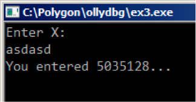

# Chapter 6 scanf()

现在我们来使用 scanf()。

```cpp
#!bash
#include <stdio.h>
int main() 
{
    int x;
    printf ("Enter X:
");
    scanf ("%d", &x);
    printf ("You entered %d...
", x);
    return 0; 
}; 
```

好吧，我承认现在使用 scanf()是不明智的，但是我想说明如何把指针传递给 int 变量。

## 6.1 关于指针

这是计算机科学中最基础的概念之一。通常，大数组、结构或对象经常被传递给其它函数，而传递它们的地址要更加简单。更重要的是：如果调用函数要修改数组或结构中的数据，并且作为整体返回，那么最简单的办法就是把数组或结构的地址传递给函数，让函数进行修改。

在 C/C++中指针就是某处内存的地址。

在 x86 中，地址是以 32 位数表示的（占 4 字节）；在 x86-64 中是 64 位数（占 8 字节）。顺便一说，这也是为什么有些人在改用 x86-64 时感到愤怒——x64 架构中所有的指针需要的空间是原来的两倍。

通过某种方法，只使用无类型指针也是可行的。例如标准 C 函数 memcpy()，用于把一个区块复制到另外一个区块上，需要两个 void*型指针作为输入，因为你无法预知，也无需知道要复制区块的类型，区块的大小才是重要的。

当函数需要一个以上的返回值时也经常用到指针（等到第九章再讲）。scanf()就是这样，函数除了要显示成功读入的字符个数外，还要返回全部值。

在 C/C++中，指针类型只是用于在编译阶段进行类型检查。本质上，在已编译的代码中并不包含指针类型的信息。

## 6.2 x86

### 6.2.1 MSVC

MVSC 2010 编译后得到下面代码

```cpp
#!bash
CONST SEGMENT
$SG3831 DB ’Enter X:’, 0aH, 00H
$SG3832 DB ’%d’, 00H
35
6.2\. X86 CHAPTER 6\. SCANF()
$SG3833 DB ’You entered %d...’, 0aH, 00H
CONST ENDS
PUBLIC _main
EXTRN _scanf:PROC
EXTRN _printf:PROC
; Function compile flags: /Odtp
_TEXT SEGMENT
_x$ = -4 ; size = 4
_main PROC
        push    ebp
        mov     ebp, esp
        push    ecx
        push    OFFSET $SG3831 ; ’Enter X:’
        call    _printf
        add     esp, 4
        lea     eax, DWORD PTR _x$[ebp]
        push    eax
        push    OFFSET $SG3832 ; ’%d’
        call    _scanf
        add     esp, 8
        mov     ecx, DWORD PTR _x$[ebp]
        push    ecx
        push    OFFSET $SG3833 ; ’You entered %d...’
        call    _printf
        add     esp, 8
        ; return 0
        xor     eax, eax
        mov     esp, ebp
        pop     ebp
        ret     0
_main ENDP
_TEXT ENDS 
```

X 是局部变量。

C/C++标准告诉我们它只对函数内部可见，无法从外部访问。习惯上，局部变量放在栈中。也可能有其他方法，但在 x86 中是这样。

函数序言后下一条指令 PUSH ECX 目的并不是要存储 ECX 的状态（注意程序结尾没有与之相对的 POP ECX）。

事实上这条指令仅仅是在栈中分配了 4 字节用于存储变量 x。

变量 x 可以用宏 `_x$` 来访问（等于-4），EBP 寄存器指向当前栈帧。

在一个函数执行完之后，EBP 将指向当前栈帧，就无法通过`EBP+offset`来访问局部变量和函数参数了。

也可以使用 ESP 寄存器，但由于它经常变化所以使用不方便。所以说在函数刚开始时，EBP 的值保存了此时 ESP 的值。

下面是一个非常典型的 32 位栈帧结构 ... ... EBP-8 local variable #2, marked in IDA as var_8 EBP-4 local variable #1, marked in IDA as var_4 EBP saved value of EBP EBP+4 return address EBP+8 argument#1, marked in IDA as arg_0 EBP+0xC argument#2, marked in IDA as arg_4 EBP+0x10 argument#3, marked in IDA as arg_8 ... ...

在我们的例子中，scanf()有两个参数。

第一个参数是指向"%d"的字符串指针，第二个是变量 x 的地址。

首先，`lea eax, DWORD PTR _x$[ebp]` 指令将变量 x 的地址放入 EAX 寄存器。LEA 作用是"取有效地址"，然而之后的主要用途有所变化（b.6.2）。

可以说，LEA 在这里只是把 EBP 的值与宏 `_x$`的值相乘，并存储在 EAX 寄存器中。

`lea eax, [ebp-4]` 也是一样。

EBP 的值减去 4，结果放在 EAX 寄存器中。接着 EAX 寄存器的值被压入栈中，再调用`printf()`。

之后，`printf()`被调用。第一个参数是一个字符串指针："`You entered %d …` "。

第二个参数是通过`mov ecx, [ebp-4]`使用的，这个指令把变量 x 的内容传给 ECX 而不是它的地址。

然后，ECX 的值放入栈中，接着最后一次调用`printf()`。

### 6.2.2 MSVC+OllyDbg

让我们在 OllyDbg 中使用这个例子。首先载入程序，按 F8 直到进入我们的可执行文件而不是 ntdll.dll。往下滚动屏幕找到 main()。点击第一条指令（PUSH EBP），按 F2，再按 F9，触发 main()开始处的断点。

让我们来跟随到准备变量 x 的地址的位置。图 6.2

可以右击寄存器窗口的 EAX，再点击"堆栈窗口中跟随"。这个地址会在堆栈窗口中显示。观察，这是局部栈中的一个变量。我在图中用红色箭头标出。这里是一些无用数据（0x77D478）。PUSH 指令将会把这个栈元素的地址压入栈中。然后按 F8 直到 scanf()函数执行完。在 scanf()执行时，我们要在命令行窗口中输入，例如输入 123。


图 6.1 命令行输出

scanf()在这里执行。图 6.3。scanf()在 EAX 中返回 1，这意味着成功读入了一个值。现在我们关心的那个栈元素中的值是 0x7B(123)。

接下来，这个值从栈中复制到 ECX 寄存器中，然后传递给 printf()。图 6.4


图 6.2 OllyDbg：计算局部变量的地址


图 6.3：OllyDbg：scanf()执行


图 6.4：OllyDbg：准备把值传递给 printf()

### 6.2.3 GCC

让我们在 Linux GCC 4.4.1 下编译这段代码

GCC 把第一个调用的 printf()替换成了 puts()，原因在 2.3.3 节中讲过了。

和之前一样，参数都是用 MOV 指令放入栈中。

## 6.3 x64

和原来一样，只是传递参数时不使用栈而使用寄存器。

### 6.3.1 MSVC

```cpp
#!bash
_DATA   SEGMENT
$SG1289 DB ’Enter X:’, 0aH, 00H
$SG1291 DB ’%d’, 00H
$SG1292 DB ’You entered %d...’, 0aH, 00H
_DATA   ENDS

_TEXT   SEGMENT
x$ = 32
main    PROC
$LN3:
        sub rsp, 56
        lea rcx, OFFSET FLAT:$SG1289 ; ’Enter X:’
        call printf
        lea rdx, QWORD PTR x$[rsp]
        lea rcx, OFFSET FLAT:$SG1291 ; ’%d’
        call scanf
        mov edx, DWORD PTR x$[rsp]
        lea rcx, OFFSET FLAT:$SG1292 ; ’You entered %d...’
        call printf
        ; return 0
        xor eax, eax
        add rsp, 56
        ret 0
main    ENDP
_TEXT   ENDS 
```

### 6.3.2 GCC

```cpp
#!bash
.LC0:
        .string "Enter X:"
.LC1:
        .string "%d"
.LC2:
        .string "You entered %d...
"
main:
        sub     rsp, 24
        mov     edi, OFFSET FLAT:.LC0 ; "Enter X:"
        call    puts
        lea     rsi, [rsp+12]
        mov     edi, OFFSET FLAT:.LC1 ; "%d"
        xor     eax, eax
        call    __isoc99_scanf
        mov     esi, DWORD PTR [rsp+12]
        mov     edi, OFFSET FLAT:.LC2 ; "You entered %d...
"
        xor     eax, eax
        call    printf
        ; return 0
        xor     eax, eax
        add     rsp, 24
        ret 
```

## 6.4 ARM

### 6.4.1 keil 优化+thumb mode

```cpp
#!bash
.text:00000042      scanf_main
.text:00000042
.text:00000042      var_8 = -8
.text:00000042
.text:00000042 08 B5            PUSH    {R3,LR}
.text:00000044 A9 A0            ADR     R0, aEnterX ; "Enter X:
"
.text:00000046 06 F0 D3 F8      BL      __2printf
.text:0000004A 69 46            MOV     R1, SP
.text:0000004C AA A0            ADR     R0, aD ; "%d"
.text:0000004E 06 F0 CD F8      BL      __0scanf
.text:00000052 00 99            LDR     R1, [SP,#8+var_8]
.text:00000054 A9 A0            ADR     R0, aYouEnteredD___ ; "You entered %d...
"
.text:00000056 06 F0 CB F8      BL      __2printf
.text:0000005A 00 20            MOVS    R0, #0
.text:0000005C 08 BD            POP     {R3,PC} 
```

必须把一个指向 int 变量的指针传递给 scanf()，这样才能通过这个指针返回一个值。Int 是一个 32 位的值，所以我们在内存中需要 4 字节存储，并且正好符合 32 位的寄存器。局部变量 x 的空间分配在栈中，IDA 把他命名为 var_8。然而并不需要分配空间，因为栈指针指向的空间可以被立即使用。所以栈指针的值被复制到 R1 寄存器中，然后和格式化字符串一起送入 scanf()。然后 LDR 指令将这个值从栈中送入 R1 寄存器，用以送入 printf()中。

用 ARM-mode 和 Xcode LLVM 编译的代码区别不大，这里略去。

## 6.5 Global Variables

如果之前的例子中的 x 变量不再是本地变量而是全局变量呢？那么就有机会接触任何指针，不仅仅是函数体，全局变量被认为 anti-pattern(通常被认为是一个不好的习惯)，但是为了试验，我们可以这样做。

```cpp
#!cpp
#include <stdio.h>
int x;
int main()
{
    printf ("Enter X:
");
    scanf ("%d", &x);
    printf ("You entered %d...
", x);
    return 0;
}; 
```

### 6.5.1 MSVC: x86

```cpp
#!bash
_DATA       SEGMENT
COMM        _x:DWORD
$SG2456     DB      ’Enter X:’, 0aH, 00H
$SG2457     DB      ’%d’, 00H
$SG2458     DB      ’You entered %d...’, 0aH, 00H
_DATA   ENDS
PUBLIC  _main
EXTRN   _scanf:PROC
EXTRN   _printf:PROC
; Function compile flags: /Odtp
_TEXT   SEGMENT
_main   PROC
    push    ebp
    mov     ebp, esp
    push    OFFSET $SG2456
    call    _printf
    add     esp, 4
    push    OFFSET _x
    push    OFFSET $SG2457
    call    _scanf
    add     esp, 8
    mov     eax, DWORD PTR _x
    push    eax
    push    OFFSET $SG2458
    call    _printf
    add     esp, 8
    xor     eax, eax
    pop     ebp
    ret     0
_main ENDP
_TEXT ENDS 
```

现在 x 变量被定义为在 _DATA 部分，局部堆栈不允许再分配任何内存，除了直接访问内存所有通过栈的访问都不被允许。在执行的文件中全局变量还未初始化(实际上，我们为什么要在执行文件中为未初始化的变量分配一块？)但是当访问这里时，系统会在这里分配一块 0 值。

现在让我们明白的来分配变量吧"

```cpp
#!bash
int x=10; // default value 
```

我们得到:

```cpp
_DATA   SEGMENT
_x      DD      0aH
... 
```

这里我们看见一个双字节的值 0xA(DD 表示双字节 = 32bit)

如果你在 IDA 中打开 compiled.exe，你会发现 x 变量被放置在 _DATA 块的开始处，接着你就会看见文本字符串。

如果你在 IDA 中打开之前例子中的 compiled.exe 中 X 变量没有定义的地方，你就会看见像这样的东西:

```cpp
#!bash
.data:0040FA80 _x               dd ?        ; DATA XREF: _main+10
.data:0040FA80                              ; _main+22
.data:0040FA84 dword_40FA84     dd ?        ; DATA XREF: _memset+1E
.data:0040FA84                              ; unknown_libname_1+28
.data:0040FA88 dword_40FA88     dd ?        ; DATA XREF: ___sbh_find_block+5
.data:0040FA88                              ; ___sbh_free_block+2BC
.data:0040FA8C ; LPVOID lpMem
.data:0040FA8C lpMem            dd ?        ; DATA XREF: ___sbh_find_block+B
.data:0040FA8C                              ; ___sbh_free_block+2CA
.data:0040FA90 dword_40FA90     dd ?        ; DATA XREF: _V6_HeapAlloc+13
.data:0040FA90                              ; __calloc_impl+72
.data:0040FA94 dword_40FA94     dd ?        ; DATA XREF: ___sbh_free_block+2FE 
```

被`_x`替换了？其它变量也并未要求初始化，这也就是说在载入 exe 至内存后，在这里有一块针对所有变量的空间，并且还有一些随机的垃圾数据。但在在 exe 中这些没有初始化的变量并不影响什么，比如它适合大数组。

### 6.5.2 MSVC: x86 + OllyDbg

到这里事情就变得简单了(见表 6.5)，变量都在 data 部分，顺便说一句，在 PUSH 指令后，压入 x 的地址，被执行后，地址将会在栈中显示，那么右击元组数据，点击"Fllow in dump"，然后变量就会在左侧内存窗口显示.

在命令行窗口中输入 123 后，这里就会显示 0x7B

但是为什么第一个字节是 7B?合理的猜测，这里会有一组 00 00 7B，被称为是字节顺序，然后在 x86 中使用的是小端，也就是说低位数据先写，高位数据后写。

不一会，这里的 32-bit 值就会载入到 EAX 中，然后被传递给 printf().

X 变量地址是 0xDC3390.在 OllyDbg 中我们看进程内存映射(Alt-M)，然后发现这个地在 PE 文件.data 结构处。见表 6.6


表 6.5 OllyDbg: scanf()执行后


表 6.6: OllyDbg 进程内存映射

### 6.5.3 GCC: x86

这和 linux 中几乎是一样的，除了 segment 的名称和属性:未初始化变量被放置在 _bss 部分。

在 ELF 文件格式中，这部分数据有这样的属性:

```cpp
; Segment type: Uninitialized
; Segment permissions: Read/Write 
```

如果静态的分配一个值，比如 10，它将会被放在 _data 部分，这部分有下面的属性:

```cpp
; Segment type: Pure data
; Segment permissions: Read/Write 
```

### 6.5.4 MSVC: x64

```cpp
#!bash
_DATA       SEGMENT
COMM        x:DWORD
$SG2924     DB      ’Enter X:’, 0aH, 00H
$SG2925     DB      ’%d’, 00H
$SG2926     DB      ’You entered %d...’, 0aH, 00H
_DATA       ENDS

_TEXT       SEGMENT
main        PROC
$LN3:
            sub     rsp, 40
            lea     rcx, OFFSET FLAT:$SG2924 ; ’Enter X:’
            call    printf
            lea     rdx, OFFSET FLAT:x
            lea     rcx, OFFSET FLAT:$SG2925 ; ’%d’
            call    scanf
            mov     edx, DWORD PTR x
            lea     rcx, OFFSET FLAT:$SG2926 ; ’You entered %d...’
            call    printf
            ; return 0
            xor     eax, eax
            add     rsp, 40
            ret     0
main ENDP
_TEXT ENDS 
```

几乎和 x86 中的代码是一样的，发现 x 变量的地址传递给 scanf()用的是 LEA 指令，尽管第二处传递给 printf()变量时用的是 MOV 指令，"DWORD PTR"——是汇编语言中的一部分(和机器码没有联系)。这就表示变量数据类型是 32-bit，于是 MOV 指令就被编码了。

### 6.5.5 ARM:Optimizing Keil + thumb mode

```cpp
#!bash
.text:00000000 ; Segment type: Pure code
.text:00000000          AREA .text, CODE
...
.text:00000000 main
.text:00000000                  PUSH    {R4,LR}
.text:00000002                  ADR     R0, aEnterX         ; "Enter X:
"
.text:00000004                  BL      __2printf
.text:00000008                  LDR     R1, =x
.text:0000000A                  ADR     R0, aD              ; "%d"
.text:0000000C                  BL      __0scanf
.text:00000010                  LDR     R0, =x
.text:00000012                  LDR     R1, [R0]
.text:00000014                  ADR     R0, aYouEnteredD___ ; "You entered %d...
"
.text:00000016                  BL      __2printf
.text:0000001A                  MOVS    R0, #0
.text:0000001C                  POP     {R4,PC}
...
.text:00000020 aEnterX          DCB     "Enter X:",0xA,0    ; DATA XREF: main+2
.text:0000002A                  DCB     0
.text:0000002B                  DCB     0
.text:0000002C off_2C           DCD x                       ; DATA XREF: main+8
.text:0000002C                                      ; main+10
.text:00000030 aD               DCB     "%d",0              ; DATA XREF: main+A
.text:00000033                  DCB 0
.text:00000034 aYouEnteredD___  DCB "You entered %d...",0xA,0 ; DATA XREF: main+14
.text:00000047                  DCB 0
.text:00000047 ; .text          ends
.text:00000047
...
.data:00000048 ; Segment type:  Pure data
.data:00000048                  AREA .data, DATA
.data:00000048                  ; ORG 0x48
.data:00000048                  EXPORT x
.data:00000048 x                DCD 0xA                     ; DATA XREF: main+8
.data:00000048                                              ; main+10
.data:00000048                                              ; .data ends 
```

那么，现在 x 变量以某种方式变为全局的，现在被放置在另一个部分中。命名为 data 块(.data)。有人可能会问，为什么文本字符串被放在了代码块(.text)，而且 x 可以被放在这？因为这是变量，而且根据它的定义，它可以变化，也有可能会频繁变化，不频繁变化的代码块可以被放置在 ROM 中，变化的变量在 RAM 中，当有 ROM 时在 RAM 中储存不变的变量是不利于节约资源的。

此外，RAM 中数据部分常量必须在之前初始化，因为在 RAM 使用后，很明显，将会包含杂乱的信息。

继续向前，我们可以看到，在代码片段，有个指针指向 X 变量(0ff_2C)。然后所有关于变量的操作都是通过这个指针。这也是 x 变量可以被放在远离这里地方的原因。所以他的地址一定被存在离这很近的地方。LDR 指令在 thumb 模式下只可访问指向地址在 1020bytes 内的数据。同样的指令在 ARM 模式下——范围就达到了 4095bytes，也就是 x 变量地址一定要在这附近的原因。因为没法保证链接时会把这个变量放在附近。

另外，如果变量以 const 声明，Keil 编译环境下则会将变量放在.constdata 部分，大概从那以后，链接时就可以把这部分和代码块放在 ROM 里了。

## 6.6 scanf()结果检查

正如我之前所见的，现在使用 scanf()有点过时了，但是如过我们不得不这样做时，我们需要检查 scanf()执行完毕时是否发生了错误。

```cpp
#!bash
#include <stdio.h>
int main()
{
    int x;
    printf ("Enter X:
");

    if (scanf ("%d", &x)==1)
        printf ("You entered %d...
", x);
    else
        printf ("What you entered? Huh?
");

    return 0;
}; 
```

按标准，scanf()函数返回成功获取的字段数。

在我们的例子中，如果事情顺利，用户输入一个数字，scanf()将会返回 1 或 0 或者错误情况下返回 EOF.

这里，我们添加了一些检查 scanf()结果的 c 代码，用来打印错误信息:

按照预期的回显:

```cpp
#!bash
C:...>ex3.exe
Enter X:
123
You entered 123...

C:...>ex3.exe
Enter X:
ouch
What you entered? Huh? 
```

### 6.6.1 MSVC: x86

我们可以得到这样的汇编代码(msvc2010):

```cpp
#!bash
        lea     eax, DWORD PTR _x$[ebp]
        push    eax
        push    OFFSET $SG3833 ; ’%d’, 00H
        call    _scanf
        add     esp, 8
        cmp     eax, 1
        jne     SHORT $LN2@main
        mov     ecx, DWORD PTR _x$[ebp]
        push    ecx
        push    OFFSET $SG3834 ; ’You entered %d...’, 0aH, 00H
        call    _printf
        add     esp, 8
        jmp     SHORT $LN1@main
$LN2@main:
        push    OFFSET $SG3836 ; ’What you entered? Huh?’, 0aH, 00H
        call    _printf
        add     esp, 4
$LN1@main:
        xor     eax, eax 
```

调用函数(main())必须能够访问到被调用函数(scanf())的结果，所以 callee 把这个值留在了 EAX 寄存器中。

然后我们在"`CMP EAX, 1`"指令的帮助下，换句话说，我们将 eax 中的值与 1 进行比较。

JNE 根据 CMP 的结果判断跳至哪，JNE 表示(jump if Not Equal)

所以，如果 EAX 中的值不等于 1，那么处理器就会将执行流程跳转到 JNE 指向的，在我们的例子中是$LN2@main，当流程跳到这里时，CPU 将会带着参数"What you entered? Huh?"执行 printf(),但是执行正常，就不会发生跳转，然后另外一个 printf()就会执行，两个参数为"`You entered %d…`"及 x 变量的值。

因为第二个 printf()并没有被执行，后面有一个 JMP(无条件跳转)，就会将执行流程到第二个 printf()后"XOR EAX, EAX"前，执行完返回 0。

那么，可以这么说，比较两个值通常使用 CMP/Jcc 这对指令，cc 是条件码，CMP 比较两个值，然后设置 processor flag，Jcc 检查 flags 然后判断是否跳。

但是事实上，这却被认为是诡异的。但是 CMP 指令事实上,但是 CMP 指令实际上是 SUB(subtract),所有算术指令都会设置 processor flags,不仅仅只有 CMP，当我们比较 1 和 1 时，1 结果就变成了 0，ZF flag 就会被设定(表示最后一次的比较结果为 0)，除了两个数相等以外，再没有其他情况了。JNE 检查 ZF flag，如果没有设定就会跳转。JNE 实际上就是 JNZ(Jump if Not Zero)指令。JNE 和 JNZ 的机器码都是一样的。所以 CMP 指令可以被 SUB 指令代替，几乎一切的都没什么变化。但是 SUB 会改变第一个数，CMP 是"SUB without saving result".

### 6.6.2 MSVC: x86:IDA

现在是时候打开 IDA 然后尝试做些什么了，顺便说一句。对于初学者来说使用在 MSVC 中使用/MD 是个非常好的主意。这样所有独立的函数不会从可执行文件中 link，而是从 MSVCR*.dll。因此这样可以简单明了的发现函数在哪里被调用。

当在 IDA 中分析代码时，建议一定要做笔记。比如在分析这个例子的时候，我们看到了 JNZ 将要被设置为 error，所以点击标注，然后标注为"error"。另外一处标注在"exit":

```cpp
#!bash
.text:00401000 _main proc near
.text:00401000
.text:00401000 var_4        = dword ptr -4
.text:00401000 argc         = dword ptr 8
.text:00401000 argv         = dword ptr 0Ch
.text:00401000 envp         = dword ptr 10h
.text:00401000
.text:00401000              push    ebp
.text:00401001              mov     ebp, esp
.text:00401003              push    ecx
.text:00401004              push    offset Format   ; "Enter X:
"
.text:00401009              call    ds:printf
.text:0040100F              add     esp, 4
.text:00401012              lea     eax, [ebp+var_4]
.text:00401015              push    eax
.text:00401016              push    offset aD       ; "%d"
.text:0040101B              call    ds:scanf
.text:00401021              add     esp, 8
.text:00401024              cmp     eax, 1
.text:00401027              jnz     short error
.text:00401029              mov     ecx, [ebp+var_4]
.text:0040102C              push    ecx
.text:0040102D              push    offset aYou     ; "You entered %d...
"
.text:00401032              call    ds:printf
.text:00401038              add     esp, 8
.text:0040103B              jmp     short exit
.text:0040103D ; ---------------------------------------------------------------------------
.text:0040103D
.text:0040103D error:                               ; CODE XREF: _main+27
.text:0040103D              push    offset aWhat    ; "What you entered? Huh?
"
.text:00401042              call    ds:printf
.text:00401048              add     esp, 4
.text:0040104B
.text:0040104B exit:                                ; CODE XREF: _main+3B
.text:0040104B              xor     eax, eax
.text:0040104D              mov     esp, ebp
.text:0040104F              pop     ebp
.text:00401050              retn
.text:00401050 _main   endp 
```

现在理解代码就变得非常简单了。然而过分的标注指令却不是一个好主意。

函数的一部分有可能也会被 IDA 隐藏:

我隐藏了两部分然后分别给它们命名:

```cpp
#!bash
.text:00401000 _text        segment para public ’CODE’ use32
.text:00401000              assume cs:_text
.text:00401000              ;org 401000h
.text:00401000 ; ask for X
.text:00401012 ; get X
.text:00401024              cmp     eax, 1
.text:00401027              jnz     short error
.text:00401029 ; print result
.text:0040103B              jmp     short exit
.text:0040103D ; ---------------------------------------------------------------------------
.text:0040103D
.text:0040103D error:                               ; CODE XREF: _main+27
.text:0040103D              push    offset aWhat    ; "What you entered? Huh?
"
.text:00401042              call    ds:printf
.text:00401048              add     esp, 4
.text:0040104B
.text:0040104B exit:                                ; CODE XREF: _main+3B
.text:0040104B              xor     eax, eax
.text:0040104D              mov     esp, ebp
.text:0040104F              pop     ebp
.text:00401050              retn
.text:00401050 _main        endp 
```

如果要显示这些隐藏的部分，我们可以点击数字上的+。

为了压缩"空间"，我们可以看到 IDA 怎样用图表代替一个函数的(见图 6.7)，然后在每个条件跳转处有两个箭头，绿色和红色。绿色箭头代表如果跳转触发的方向，红色则相反。

当然可以折叠节点，然后备注名称,我像这样处理了 3 块(见图 6.8):

这个非常的有用。可以这么说，逆向工程师很重要的一点就是缩小他所有的信息。


图 6.7: IDA 图形模式


图 6.8: Graph mode in IDA with 3 nodes folded

### 6.6.3 MSVC: x86 + OllyDbg

让我们继续在 OllyDbg 中看这个范例程序，使它认为 scanf()怎么运行都不会出错。

当本地变量地址被传递给 scanf()时，这个变量还有一些垃圾数据。这里是 0x4CD478:见图 6.10

当 scanf()执行时，我在命令行窗口输入了一些不是数字的东西，像"asdasd".scanf()结束后 eax 变为了 0.也就意味着有错误发生:见图 6.11

我们也可以发现栈中的本地变量并没有发生变化，scanf()会在那里写入什么呢？其实什么都没有，只是返回了 0.

现在让我们尝试修改这个程序，右击 EAX，在选项中有个"set to 1"，这正是我们所需要的。

现在 EAX 是 1 了。那么接下来的检查就会按照我们的需求执行，然后 printf()将会打印出栈上的变量。

按下 F9 我们可以在窗口中看到:



图 6.9

实际上，5035128 是栈上一个数据(0x4CD478)的十进制表示!


图 6.10


图 6.11

### 6.6.4 MSVC: x86 + Hlew

这也是一个关于可执行文件 patch 的简单例子，我们之前尝试 patch 程序，所以程序总是打印数字，不管我们输入什么。

假设编译时并没有使用/MD,我们可以在.text 开始的地方找到 main()函数，现在让我们在 Hiew 中打开执行文件。找到.text 的开始处(enter,F8,F6,enter,enter)

我们可以看到这个:表 6.13

然后按下 F9(update),现在文件保存在了磁盘中，就像我们想要的。

两个 NOP 可能看起来并不是那么完美，另一个方法是把 0 写在第二处（jump offset）,所以 JNZ 就可以总是跳到下一个指令了。

另外我们也可以这样做：替换第一个字节为 EB，这样就不修改第二处（jump offset），这样就会无条件跳转，不管我们输入什么，错误信息都可以打印出来了。


图 6.12:main()函数


图 6.13:Hiew 用两个 NOP 替换 JNZ

### 6.6.5 GCC: x86

生成的代码和 gcc 4.4.1 是一样的，除了我们之前已经考虑过的

### 6.6.6 MSVC: x64

因为我们这里处理的是无整型变量。在 x86-64 中还是 32bit,我们可以看出 32bit 的寄存器(前缀为 E)在这种情况下是怎样使用的,然而 64bit 的寄存也有被使用(前缀 R)

```cpp
#!bash
_DATA       SEGMENT
$SG2924     DB      ’Enter X:’, 0aH, 00H
$SG2926     DB      ’%d’, 00H
$SG2927     DB      ’You entered %d...’, 0aH, 00H
$SG2929     DB      ’What you entered? Huh?’, 0aH, 00H
_DATA       ENDS

_TEXT       SEGMENT
x$ = 32
main        PROC
$LN5:
            sub         rsp, 56
            lea         rcx, OFFSET FLAT:$SG2924 ; ’Enter X:’
            call        printf
            lea         rdx, QWORD PTR x$[rsp]
            lea         rcx, OFFSET FLAT:$SG2926 ; ’%d’
            call        scanf
            cmp         eax, 1
            jne         SHORT $LN2@main
            mov         edx, DWORD PTR x$[rsp]
            lea         rcx, OFFSET FLAT:$SG2927 ; ’You entered %d...’
            call        printf
            jmp         SHORT $LN1@main
$LN2@main:
            lea rcx, OFFSET FLAT:$SG2929 ; ’What you entered? Huh?’
            call printf
$LN1@main:
            ; return 0
            xor         eax, eax
            add         rsp, 56
            ret         0
main        ENDP
_TEXT       ENDS
END 
```

### 6.6.7 ARM:Optimizing Keil + thumb mode

```cpp
#!bash
var_8       = -8

            PUSH    {R3,LR}
            ADR     R0, aEnterX         ; "Enter X:
"
            BL      __2printf
            MOV     R1, SP
            ADR     R0, aD              ; "%d"
            BL      __0scanf
            CMP     R0, #1
            BEQ     loc_1E
            ADR     R0, aWhatYouEntered ; "What you entered? Huh?
"
            BL      __2printf
loc_1A                                  ; CODE XREF: main+26
            MOVS    R0, #0
            POP     {R3,PC}

loc_1E                                  ; CODE XREF: main+12
            LDR     R1, [SP,#8+var_8]
            ADR     R0, aYouEnteredD___ ; "You entered %d...
"
            BL      __2printf
            B       loc_1A 
```

这里有两个新指令 CMP 和 BEQ.

CMP 和 x86 指令中的相似，它会用一个参数减去另外一个参数然后保存 flag.

BEQ 是跳向另一处地址，如果数相等就会跳，如果最后一次比较结果为 0，或者 Z flag 是 1。和 x86 中的 JZ 是一样的。

其他的都很简单，执行流程分为两个方向，当 R0 被写入 0 后，两个方向则会合并，作为函数的返回值，然后函数结束。