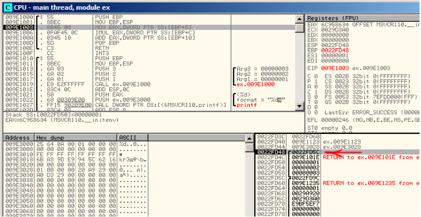

# CHAPER7 访问传递参数

现在我们来看函数调用者通过栈把参数传递到被调用函数。被调用函数是如何访问这些参数呢？

```cpp
#!cpp
#include <stdio.h>
int f (int a, int b, int c)
{
        return a*b+c;
};
int main() 
{
        printf ("%d
", f(1, 2, 3));
        return 0; 
}; 
```

## 7.1 X86

### 7.1.1 MSVC

如下为相应的反汇编代码（MSVC 2010 Express）

Listing 7.2 MSVC 2010 Express

```cpp
#!bash
_TEXT   SEGMENT
_a$ = 8                                  ; size = 4
_b$ = 12                                 ; size = 4
_c$ = 16                                 ; size = 4
_f      PROC
        push ebp
        mov ebp, esp
        mov eax, DWORD PTR _a$[ebp]
        imul eax, DWORD PTR _b$[ebp]
        add eax, DWORD PTR _c$[ebp]
        pop ebp
        ret 0
_f      ENDP

_main   PROC
        push ebp
        mov ebp, esp
        push 3 ; 3rd argument
        push 2 ; 2nd argument
        push 1 ; 1st argument
        call _f
        add esp, 12
        push eax
        push OFFSET $SG2463 ; ’%d’, 0aH, 00H
        call _printf
        add esp, 8
        ; return 0
        xor eax, eax
        pop ebp
        ret 0
_main ENDP 
```

我们可以看到函数 main()中 3 个数字被圧栈，然后函数 f(int, int, int)被调用。函数 f()内部访问参数时使用了像 _ a$=8 的宏，同样，在函数内部访问局部变量也使用了类似的形式，不同的是访问参数时偏移值（为正值）。因此 EBP 寄存器的值加上宏 _a$的值指向压栈参数。

`_a$[ebp]`的值被存储在寄存器 eax 中，IMUL 指令执行后，eax 的值为 eax 与`_b$[ebp]`的乘积，然后 eax 与`_c$[ebp]`的值相加并将和放入 eax 寄存器中,之后返回 eax 的值。返回值作为 printf()的参数。

### 7.1.2 MSVC+OllyDbg

我们在 OllyDbg 中观察，跟踪到函数 f()使用第一个参数的位置，可以看到寄存器 EBP 指向栈底，图中使用红色箭头标识。栈帧中第一个被保存的是 EBP 的值，第二个是返回地址（RA），第三个是参数 1，接下来是参数 2，以此类推。因此，当我们访问第一个参数时 EBP 应该加 8（2 个 32-bit 字节宽度）。



Figure 7.1: OllyDbg: 函数 f()内部

### 7.1.3 GCC

使用 GCC4.4.1 编译后在 IDA 中查看

Listing 7.3: GCC 4.4.1

```cpp
#!bash
            public f
f           proc near

arg_0       = dword ptr 8
arg_4       = dword ptr 0Ch
arg_8       = dword ptr 10h

            push    ebp
            mov     ebp, esp
            mov     eax, [ebp+arg_0]  ; 1st argument
            imul    eax, [ebp+arg_4]  ; 2nd argument
            add     eax, [ebp+arg_8]  ; 3rd argument
            pop     ebp
            retn
f           endp

            public main
main        proc near

var_10      = dword ptr -10h
var_C       = dword ptr -0Ch
var_8       = dword ptr -8

            push    ebp
            mov     ebp, esp
            and     esp, 0FFFFFFF0h
            sub     esp, 10h
            mov     [esp+10h+var_8], 3  ; 3rd argument
            mov     [esp+10h+var_C], 2  ; 2nd argument
            mov     [esp+10h+var_10], 1  ; 1st argument
            call    f
            mov     edx, offset aD ; "%d
"
            mov     [esp+10h+var_C], eax
            mov     [esp+10h+var_10], edx
            call    _printf
            mov     eax, 0
            leave
            retn
main    endp 
```

几乎相同的结果。

执行两个函数后栈指针 ESP 并没有显示恢复，因为倒数第二个指令 LEAVE（B.6.2）会自动恢复栈指针。

## 7.2 X64

x86-64 架构下有点不同，函数参数（4 或 6）使用寄存器传递，被调用函数通过访问寄存器来访问传递进来的参数。

### 7.2.1 MSVC

MSVC 优化后：

Listing 7.4: MSVC 2012 /Ox x64

```cpp
#!bash
$SG2997     DB      ’%d’, 0aH, 00H

main        PROC
            sub     rsp, 40
            mov     edx, 2
            lea     r8d, QWORD PTR [rdx+1]  ; R8D=3
            lea     ecx, QWORD PTR [rdx-1]  ; ECX=1
            call    f
            lea     rcx, OFFSET FLAT:$SG2997  ; ’%d’
            mov     edx, eax
            call    printf
            xor     eax, eax
            add     rsp, 40
            ret     0
main        ENDP

f           PROC
            ; ECX - 1st argument
            ; EDX - 2nd argument
            ; R8D - 3rd argument
            imul    ecx, edx
            lea     eax, DWORD PTR [r8+rcx]
            ret     0
f           ENDP 
```

我们可以看到函数 f()直接使用寄存器来操作参数，LEA 指令用来做加法，编译器认为使用 LEA 比使用 ADD 指令要更快。在 mian()中也使用了 LEA 指令，编译器认为使用 LEA 比使用 MOV 指令效率更高。

我们来看看 MSVC 没有优化的情况：

Listing 7.5: MSVC 2012 x64

```cpp
#!bash
f           proc near

; shadow space:
arg_0       = dword ptr 8
arg_8       = dword ptr 10h
arg_10      = dword ptr 18h

            ; ECX - 1st argument
            ; EDX - 2nd argument
            ; R8D - 3rd argument
            mov     [rsp+arg_10], r8d
            mov     [rsp+arg_8], edx
            mov     [rsp+arg_0], ecx
            mov     eax, [rsp+arg_0]
            imul    eax, [rsp+arg_8]
            add     eax, [rsp+arg_10]
            retn
f endp

main        proc    near
            sub     rsp, 28h
            mov     r8d, 3 ; 3rd argument
            mov     edx, 2 ; 2nd argument
            mov     ecx, 1 ; 1st argument
            call    f
            mov     edx, eax
            lea     rcx, $SG2931 ; "%d
"
            call    printf

            ; return 0
            xor     eax, eax
            add     rsp, 28h
            retn
main        endp 
```

这里从寄存器传递进来的 3 个参数因为某种情况又被保存到栈里。这就是所谓的“shadow space”2：每个 Win64 通常（不是必需）会保存所有 4 个寄存器的值。这样做由两个原因：1）为输入参数分配所有寄存器（即使是 4 个）太浪费，所以要通过堆栈来访问；2）每次中断下来调试器总是能够定位函数参数 3。

调用者负责在栈中分配“shadow space”。

### 7.2.2 GCC

GCC 优化后的代码：

Listing 7.6: GCC 4.4.6 -O3 x64

```cpp
#!bash
f:
        ; EDI - 1st argument
        ; ESI - 2nd argument
        ; EDX - 3rd argument
        imul    esi, edi
        lea     eax, [rdx+rsi]
        ret

main:
        sub     rsp, 8
        mov     edx, 3
        mov     esi, 2
        mov     edi, 1
        call    f
        mov     edi, OFFSET FLAT:.LC0 ; "%d
"
        mov     esi, eax
        xor     eax, eax ; number of vector registers passed
        call    printf
        xor     eax, eax
        add     rsp, 8
        ret 
```

GCC 无优化代码：

Listing 7.7: GCC 4.4.6 x64

```cpp
#!bash
f:
        ; EDI - 1st argument
        ; ESI - 2nd argument
        ; EDX - 3rd argument
        push    rbp
        mov     rbp, rsp
        mov     DWORD PTR [rbp-4], edi
        mov     DWORD PTR [rbp-8], esi
        mov     DWORD PTR [rbp-12], edx
        mov     eax, DWORD PTR [rbp-4]
        imul    eax, DWORD PTR [rbp-8]
        add     eax, DWORD PTR [rbp-12]
        leave
        ret

main:
        push    rbp
        mov     rbp, rsp
        mov     edx, 3
        mov     esi, 2
        mov     edi, 1
        call    f
        mov     edx, eax
        mov     eax, OFFSET FLAT:.LC0 ; "%d
"
        mov     esi, edx
        mov     rdi, rax
        mov     eax, 0 ; number of vector registers passed
        call    printf
        mov     eax, 0
        leave
        ret 
```

System V *NIX [21]没有“shadow space”，但被调用者可能会保存参数，这也是造成寄存器短缺的原因。

### 7.2.3 GCC: uint64_t instead int

我们例子使用的是 32 位 int，寄存器也为 32 位寄存器（前缀为 E-）。

为处理 64 位数值内部会自动调整为 64 位寄存器：

```cpp
#!cpp
#include <stdio.h>
#include <stdint.h>

uint64_t f (uint64_t a, uint64_t b, uint64_t c)
{
    return a*b+c;
};
int main()
{
    printf ("%lld
", f(0x1122334455667788,0x1111111122222222,0x3333333344444444));
    return 0;
}; 
```

Listing 7.8: GCC 4.4.6 -O3 x64

```cpp
#!cpp
f       proc near
        imul    rsi, rdi
        lea     rax, [rdx+rsi]
        retn
f       endp

main    proc near
        sub     rsp, 8
        mov     rdx, 3333333344444444h ; 3rd argument
        mov     rsi, 1111111122222222h ; 2nd argument
        mov     rdi, 1122334455667788h ; 1st argument
        call    f
        mov     edi, offset format ; "%lld
"
        mov     rsi, rax
        xor     eax, eax ; number of vector registers passed
        call    _printf
        xor     eax, eax
        add     rsp, 8
        retn
main    endp 
```

代码非常相似，只是使用了 64 位寄存器（前缀为 R）。

## 7.3 ARM

### 7.3.1 未优化的 Keil + ARM mode

```cpp
#!bash
.text:000000A4 00 30 A0 E1              MOV     R3, R0
.text:000000A8 93 21 20 E0              MLA     R0, R3, R1, R2
.text:000000AC 1E FF 2F E1              BX      LR
...
.text:000000B0             main
.text:000000B0 10 40 2D E9              STMFD   SP!, {R4,LR}
.text:000000B4 03 20 A0 E3              MOV     R2, #3
.text:000000B8 02 10 A0 E3              MOV     R1, #2
.text:000000BC 01 00 A0 E3              MOV     R0, #1
.text:000000C0 F7 FF FF EB              BL      f
.text:000000C4 00 40 A0 E1              MOV     R4, R0
.text:000000C8 04 10 A0 E1              MOV     R1, R4
.text:000000CC 5A 0F 8F E2              ADR     R0, aD_0  ; "%d
"
.text:000000D0 E3 18 00 EB              BL      __2printf
.text:000000D4 00 00 A0 E3              MOV     R0, #0
.text:000000D8 10 80 BD E8              LDMFD   SP!, {R4,PC} 
```

main()函数里调用了另外两个函数，3 个值被传递到 f();

正如前面提到的，ARM 通常使用前四个寄存器（R0-R4）传递前四个值。

f()函数使用了前三个寄存器（R0-R2）作为参数。

MLA (Multiply Accumulate)指令将 R3 寄存器和 R1 寄存器的值相乘，然后再将乘积与 R2 寄存器的值相加将结果存入 R0，函数返回 R0。

一条指令完成乘法和加法 4，如果不包括 SIMD 新的 FMA 指令 5，通常 x86 下没有这样的指令。

第一条指令 MOV R3,R0，看起来冗余是因为该代码是非优化的。

BX 指令返回到 LR 寄存器存储的地址，处理器根据状态模式从 Thumb 状态转换到 ARM 状态，或者反之。函数 f()可以被 ARM 代码或者 Thumb 代码调用，如果是 Thumb 代码调用 BX 将返回到调用函数并切换到 Thumb 模式，或者反之。

### 7.3.2 Optimizing Keil + ARM mode

```cpp
#!bash
.text:00000098            f
.text:00000098 91 20 20 E0                MLA R0, R1, R0, R2
.text:0000009C 1E FF 2F E1                BX  LR 
```

这里 f()编译时使用完全优化模式(-O3),MOV 指令被优化，现在 MLA 使用所有输入寄存器并将结果置入 R0 寄存器。

### 7.3.3 Optimizing Keil + thumb mode

```cpp
#!bash
.text:0000005E 48 43                  MULS R0, R1
.text:00000060 80 18                  ADDS R0, R0, R2
.text:00000062 70 47                  BX   LR 
```

Thumb 模式下没有 MLA 指令，编译器做了两次间接处理，MULS 指令使 R0 寄存器的值与 R1 寄存器的值相乘并将结果存入 R0。ADDS 指令将 R0 与 R2 的值相加并将结果存入 R0。