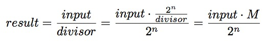
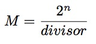
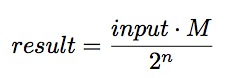
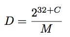
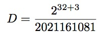
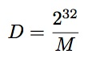
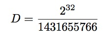

# Chapter 14 Division by 9

下面是一个非常简单的函数

```cpp
#!bash
int f(int a)
{
    return a/9;
}; 
```

## 14.1 x86

以一种十分容易预测的方式编译的

```cpp
#!bash
_a$ = 8             ; size = 4
_f   PROC
    push    ebp
    mov     ebp, esp
    mov     eax, DWORD PTR _a$[ebp]
    cdq             ; sign extend EAX to EDX:EAX
    mov     ecx, 9
    idiv    ecx
    pop     ebp
    ret     0
_f  ENDP 
```

IDIV 有符号数除法指令 64 位的被除数分存在两个寄存器 EDX:EAX,除数放在单个寄存器 ECX 中。运算结束后，商放在 EAX，余数放在 EDX。f（）函数的返回值将包含在 eax 寄存器中，也就是说，在进行除法运算之后，值不会再放到其他位置，它已经在合适的地方了。正因为 IDIV 指令要求被除数分存在 EDX：EAX 里，所以需要在做除法前用 CDQ 指令将 EAX 中的值扩展成 64 位有符号数，就像 MOVSX 指令(13.1.1)所做的一样。如果我们切换到优化模式（/0x），我们会得到

清单 14.2:MSVC 优化模式

```cpp
#!bash
_a$ = 8                         ; size = 4
_f   PROC

    mov     ecx, DWORD PTR _a$[esp-4]
    mov     eax, 954437177      ; 38e38e39H
    imul    ecx
    sar     edx, 1
    mov     eax, edx
    shr     eax, 31             ; 0000001fH
    add     eax, edx
    ret     0
_f   ENDP 
```

这里将除法优化为乘法。乘法运算要快得多。使用这种技巧可以得到更高效的代码。

在编译器优化中，这也称为“strength reduction”

GCC4.4.1 甚至在没有打开优化模式的情况下生成了和在 MSVC 下打开优化模式的生成的几乎一样的代码。

清单 14.3 GCC 4.4.1 非优化模式

```cpp
#!bash
        public f
f       procnear
arg_0   = dword ptr 8

        push    ebp
        mov     ebp, esp
        mov     ecx, [ebp+arg_0]
        mov     edx, 954437177 ; 38E38E39h
        mov     eax, ecx
        imul    edx
        sar     edx, 1
        mov     eax, ecx
        sar     eax, 1Fh
        mov     ecx, edx
        sub     ecx, eax
        mov     eax, ecx
        pop     ebp
        retn
f       endp 
```

## 14.2 ARM

ARM 处理器，就像其他的“纯”RISC 处理器一样，缺少除法指令，缺少 32 位常数乘法的单条指令。利用一个技巧，通过加法，减法，移位是可以实现除法的。 这里有一个 32 位数被 10（20，3.3 常量除法）除的例子，输出商和余数。

```cpp
#!bash
; takes argument in a1
; returns quotient in a1, remainder in a2
; cycles could be saved if only divide or remainder is required
    SUB     a2, a1, #10         ; keep (x-10) for later
    SUB     a1, a1, a1, lsr #2
    ADD     a1, a1, a1, lsr #4
    ADD     a1, a1, a1, lsr #8
    ADD     a1, a1, a1, lsr #16
    MOV     a1, a1, lsr #3
    ADD     a3, a1, a1, asl #2
    SUBS    a2, a2, a3, asl #1  ; calc (x-10) - (x/10)*10
    ADDPL   a1, a1, #1          ; fix-up quotient
    ADDMI   a2, a2, #10         ; fix-up remainder
    MOV     pc, lr 
```

### 14.2.1 Xcode 优化模式（LLVM）+ARM 模式

```cpp
#!bash
__text:00002C58 39 1E 08 E3 E3 18 43 E3     MOV     R1, 0x38E38E39
__text:00002C60 10 F1 50 E7                 SMMUL   R0, R0, R1
__text:00002C64 C0 10 A0 E1                 MOV     R1, R0,ASR#1
__text:00002C68 A0 0F 81 E0                 ADD     R0, R1, R0,LSR#31
__text:00002C6C 1E FF 2F E1                 BX      LR 
```

运行原理

这里的代码和优化模式的 MSVC 和 GCC 生成的基本相同。显然，LLVM 在产生常量上使用相同的算法。

善于观察的读者可能会问，MOV 指令是如何将 32 位数值写入寄存器中的，因为这在 ARM 模式下是不可能的。实际上是可能的，但是，就像我们看到的，与标准指令每条有四个字节不同的是，这里的每条指令有 8 个字节，其实这是两条指令。第一条指令将值 0x8E39 装入寄存器的低十六位，第二条指令是 MOVT,它将 0x383E 装入寄存器的高 16 位。IDA 知道这些顺序，并且为了精简紧凑，将它精简转换成一条伪代码。

SMMUL (Signed Most Significant Word Multiply)实现两个 32 位有符号数的乘法，并且将高 32 位的部分放在 r0 中，弃掉结果的低 32 位部分。

```cpp
“MOV R1,R0,ASR#1“指令算数右移一位。
“ADD R0,R1,LSR#31” R0=R1+R0>>32 
```

事实上，在 ARM 模式下，并没有单独的移位指令。相反，像（MOV,ADD,SUB,RSB）3 这样的数据处理指令，第二个操作数需要被移位。ASR 表示算数右移，LSR 表示逻辑右移。

### 14.2.2 优化 Xcode(LLVM)+thumb-2 模式

```cpp
#!bash
MOV         R1, 0x38E38E39
SMMUL.W     R0, R0, R1
ASRS        R1, R0, #1
ADD.W       R0, R1, R0,LSR#31
BX          LR 
```

在 thumb 模式下有些单独的移位指令，这个例子中使用了 ASRS（算数右移）

### 14.2.3 Xcode 非优化模式（LLVM） keil 模式

非优化模式 LLVM 不生成我们之前看到的那样的代码，它插入了一个调用库函数的`call __divsi3`

关于 keil：通常插入一个调用库函数的`call __aeabi_idivmod`

## 14.3 工作原理

下面展示的是怎样用乘法来优化除法，其中借助了 2^n 的阶乘



M 是一个 magic 系数

M 的计算过程



因此这些代码片段通常具有这样的形式



n 可以是任意数，可能是 32（那么这样运算结果的高位部分从 EX 或者 RDX 寄存器中获取），可能是 31（这种情况下乘法结果的高位部分结果右移）

n 的选取是为了减少错误。

当进行有符号数除法运算，乘法结果的符号也会被放到输出结果中。

下面来看看不同之处。

```cpp
#!bash
int f3_32_signed(int a)
{
    return a/3;
};
unsigned int f3_32_unsigned(unsigned int a)
{
    return a/3;
}; 
```

在无符号版本的函数中，magic 系数是 0xAAAAAAAB，乘法结果被 2³*3 除。

在有符号版本的函数中，magic 系数是 0x55555556，乘法结果被 2³² 除。

符号来自于乘法结果：高 32 位的结果右移 31 位（将符号位放在 EAX 中最不重要的位置）。如果最后结果为负，则会设置为 1。

清单 14.4：MSVC 2012/OX

```cpp
#!bash
_f3_32_unsigned     PROC
        mov     eax, -1431655765        ; aaaaaaabH
        mul     DWORD PTR _a$[esp-4]    ; unsigned multiply
        shr     edx, 1
        mov     eax, edx
        ret     0
_f3_32_unsigned ENDP

_f3_32_signed PROC
        mov     eax, 1431655766         ; 55555556H
        imul    DWORD PTR _a$[esp-4]    ; signed multiply
        mov     eax, edx
        shr     eax, 31                 ; 0000001fH
        add     eax, edx                ; add 1 if sign is negative
        ret     0
_f3_32_signed ENDP 
```

## 14.4 得到除数

### 14.4.1 变形＃1

通常，代码具有这样一种形式

```cpp
#!bash
mov     eax, MAGICAL CONSTANT
imul    input value
sar     edx, SHIFTING COEFFICIENT ; signed division by 2^x using arithmetic shift right
mov     eax, edx
shr     eax, 31
add     eax, edx 
```

我们将 32 位的 magic 系数表示为 M，移位表示为 C，除数表示为 D

我们得到的除法是



举个例子

清单 14.5：优化模式 MSVC2012

```cpp
#!bash
mov     eax, 2021161081     ; 78787879H
imul    DWORD PTR _a$[esp-4]
sar     edx, 3
mov     eax, edx
shr     eax, 31             ; 0000001fH
add     eax, edx 
```

即



比 32 位的数字大，为了方便，于是我们使用用 Wolfram Mathematica 软件。

```cpp
In[1]:=N[2^(32+3)/2021161081]
Out[1]:=17. 
```

因此例子中的代码得到结果是 17。

对于 64 位除法来说，原理是一样的，但是应该使用 2⁶⁴ 来代替 2³²。

```cpp
#!bash
uint64_t f1234(uint64_t a)
{
    return a/1234;
}; 
```

清单 14.7：MSVC2012/Ox

```cpp
#!bash
f1234   PROC
        mov     rax, 7653754429286296943 ; 6a37991a23aead6fH
        mul     rcx
        shr     rdx, 9
        mov     rax, rdx
        ret     0
f1234   ENDP 
```

清单 14.8：Wolfram Mathematica

```cpp
In[1]:=N[2^(64+9)/16^⁶a37991a23aead6f]
Out[1]:=1234. 
```

### 14.4.2 变形＃2

忽略算数移位的变形也是存在的

```cpp
#!bash
mov     eax, 55555556h ; 1431655766
imul    ecx
mov     eax, edx
shr     eax, 1Fh 
```

更加简洁



在这个例子中



再用一次 Wolfram Mathematica

```cpp
In[1]:=N[2³²/16^⁵⁵⁵⁵⁵⁵⁵⁶]
Out[1]:=3. 
```

得到的除数是 3