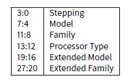

# 第十八章 结构体

C/C++的结构体可以这么定义：它是一组存储在内存中的变量的集合，成员变量类型不要求相同。

## 18.1 SYSTEMTIME 的例子

让我们看看 Win32 结构体 SYSTEMTIME 的定义：

清单 18.1: WinBase.h

```cpp
#!cpp
typedef struct _SYSTEMTIME {
    WORD wYear;
    WORD wMonth;
    WORD wDayOfWeek;
    WORD wDay;
    WORD wHour;
    WORD wMinute;
    WORD wSecond;
    WORD wMilliseconds;
} SYSTEMTIME, *PSYSTEMTIME; 
```

让我们写一个获取当前时间的 C 程序：

```cpp
#!cpp
#include <windows.h>
#include <stdio.h>
void main()
{
SYSTEMTIME t;
    GetSystemTime (&t);
    printf ("%04d-%02d-%02d %02d:%02d:%02d
",
    t.wYear, t.wMonth, t.wDay,
    t.wHour, t.wMinute, t.wSecond);
    return;
}; 
```

反汇编结果如下（MSVC 2010）：

清单 18.2: MSVC 2010

```cpp
#!bash
_t$ = -16 ; size = 16
_main PROC
    push ebp
    mov ebp, esp
    sub esp, 16 ; 00000010H
    lea eax, DWORD PTR _t$[ebp]
    push eax
    call DWORD PTR __imp__GetSystemTime@4
    movzx ecx, WORD PTR _t$[ebp+12] ; wSecond
    push ecx
    movzx edx, WORD PTR _t$[ebp+10] ; wMinute
    push edx
    movzx eax, WORD PTR _t$[ebp+8] ; wHour
    push eax
    movzx ecx, WORD PTR _t$[ebp+6] ; wDay
    push ecx
    movzx edx, WORD PTR _t$[ebp+2] ; wMonth
    push edx
    movzx eax, WORD PTR _t$[ebp] ; wYear
    push eax
    push OFFSET $SG78811 ; ’%04d-%02d-%02d %02d:%02d:%02d’, 0aH, 00H
    call _printf
    add esp, 28 ; 0000001cH
    xor eax, eax
    mov esp, ebp
    pop ebp
    ret 0
_main ENDP 
```

在本地栈上程序为这个结构体分配了 16 个字节：这正是 sizeof(WORD)*8 的大小（因为结构体里有 8 个 WORD）。 请注意结构体是由 wYear 开始的，因此，我们既可以说这是“传给 GetSystemTime()函数的，一个指向 SYSTEMTIME 结构体的指针”，也可以说是它“传递了 wYear 的指针”。这两种说法是一样的！GetSystemTime()函数会把当前的年份写入指向的 WORD 指针中，然后把指针向后移动 2 个字节（译注：WORD 大小为 2 字节），再写入月份，以此类推。 事实上，结构体的成员其实就是一个个紧贴在一起的变量。我可以用下面的方法来访问 SYSTEMTIME 结构体，代码如下：

```cpp
#!cpp
#include <windows.h>
#include <stdio.h>
void main()
{
    WORD array[8];
    GetSystemTime (array);
    printf ("%04d-%02d-%02d %02d:%02d:%02d
",
    array[0] /* wYear */, array[1] /* wMonth */, array[3] /* wDay */,
    array[4] /* wHour */, array[5] /* wMinute */, array[6] /* wSecond */);
    return;
}; 
```

编译器会稍稍给出一点警告：

```cpp
#!cpp
systemtime2.c(7) : warning C4133: ’function’ : incompatible types - from ’WORD [8]’ to ’LPSYSTEMTIME’ 
```

不过至少，它会产生如下代码：

清单 18.3: MSVC 2010

```cpp
#!bash
$SG78573 DB ’%04d-%02d-%02d %02d:%02d:%02d’, 0aH, 00H
_array$ = -16 ; size = 16
_main PROC
    push ebp
    mov ebp, esp
    sub esp, 16 ; 00000010H
    lea eax, DWORD PTR _array$[ebp]
    push eax
    call DWORD PTR __imp__GetSystemTime@4
    movzx ecx, WORD PTR _array$[ebp+12] ; wSecond
    push ecx
    movzx edx, WORD PTR _array$[ebp+10] ; wMinute
    push edx
    movzx eax, WORD PTR _array$[ebp+8] ; wHoure
    push eax
    movzx ecx, WORD PTR _array$[ebp+6] ; wDay
    push ecx
    movzx edx, WORD PTR _array$[ebp+2] ; wMonth
    push edx
    movzx eax, WORD PTR _array$[ebp] ; wYear
    push eax
    push OFFSET $SG78573
    call _printf
    add esp, 28 ; 0000001cH
    xor eax, eax
    mov esp, ebp
    pop ebp
    ret 0
_main ENDP 
```

当然，它也能一样正常工作！ 一个很有趣的情况是这两次编译结果居然一样，所以光看编译结果，我们还看不出来到底别人用的结构体还是单单用的变量数组。 不过，没几个人会这么无聊的用这种方法写代码，因为这太麻烦了。还有，结构体也有可能会被开发者更改，交换，等等，所以还是用结构体方便。

## 18.2 让我们用 malloc()为结构体分配空间

但是，有时候把结构体放在堆中而不是栈上却更简单：

```cpp
#!cpp
#include <windows.h>
#include <stdio.h>
void main()
{
    SYSTEMTIME *t;
    t=(SYSTEMTIME *)malloc (sizeof (SYSTEMTIME));
    GetSystemTime (t);
    printf ("%04d-%02d-%02d %02d:%02d:%02d
",
    t->wYear, t->wMonth, t->wDay,
    t->wHour, t->wMinute, t->wSecond);
    free (t);
    return;
}; 
```

让我们用优化/Ox 编译一下它，看看我们得到什么东西

清单 18.4: 优化的 MSVC

```cpp
#!bash
_main PROC
    push esi
    push 16 ; 00000010H
    call _malloc
    add esp, 4
    mov esi, eax
    push esi
    call DWORD PTR __imp__GetSystemTime@4
    movzx eax, WORD PTR [esi+12] ; wSecond
    movzx ecx, WORD PTR [esi+10] ; wMinute
    movzx edx, WORD PTR [esi+8] ; wHour
    push eax
    movzx eax, WORD PTR [esi+6] ; wDay
    push ecx
    movzx ecx, WORD PTR [esi+2] ; wMonth
    push edx
    movzx edx, WORD PTR [esi] ; wYear
    push eax
    push ecx
    push edx
    push OFFSET $SG78833
    call _printf
    push esi
    call _free
    add esp, 32 ; 00000020H
    xor eax, eax
    pop esi
    ret 0
_main ENDP 
```

所以，sizeof(SYSTEMTIME) = 16, 这正是 malloc 所分配的字节数。它返回了刚刚分配的地址空间，这个指针存在 EAX 寄存器里。然后，这个指针会被移动到 ESI 结存器中， GetSystemTime()会用它来存储返回值，这也就是为什么这里分配完之后并没有把 EAX 放到某个地方保存起来，而是直接使用它的原因。

新指令：MOVZX（Move with Zero eXtent， 0 扩展移动）。它可以说是和 MOVSX 基本一样（13.1.1 节），但是，它把其他位都设置为 0。这是因为 printf()需要一个 32 位的整数，但是我们的结构体里面是 WORD，这只有 16 位厂。这也就是为什么从 WORD 复制到 INT 时第 16～31 位必须清零的原因了。因为，如果不清除的话，剩余位可能有之前操作留下来的干扰数据。

在下面这个例子里面，我可以用 WORD 数组来重现这个结构：

```cpp
#!cpp
#include <windows.h>
#include <stdio.h>
void main()
{
    WORD *t;
    t=(WORD *)malloc (16);
    GetSystemTime (t);
    printf ("%04d-%02d-%02d %02d:%02d:%02d
",
    t[0] /* wYear */, t[1] /* wMonth */, t[3] /* wDay */,
    t[4] /* wHour */, t[5] /* wMinute */, t[6] /* wSecond */);
    free (t);
    return;
}; 
```

我们得到：

```cpp
#!bash
$SG78594 DB ’%04d-%02d-%02d %02d:%02d:%02d’, 0aH, 00H
_main PROC
    push esi
    push 16 ; 00000010H
    call _malloc
    add esp, 4
    mov esi, eax
    push esi
    call DWORD PTR __imp__GetSystemTime@4
    movzx eax, WORD PTR [esi+12]
    movzx ecx, WORD PTR [esi+10]
    movzx edx, WORD PTR [esi+8]
    push eax
    movzx eax, WORD PTR [esi+6]
    push ecx
    movzx ecx, WORD PTR [esi+2]
    push edx
    movzx edx, WORD PTR [esi]
    push eax
    push ecx
    push edx
    push OFFSET $SG78594
    call _printf
    push esi
    call _free
    add esp, 32 ; 00000020H
    xor eax, eax
    pop esi
    ret 0
_main ENDP 
```

同样，我们可以看到编译结果和之前一样。个人重申一次，你不应该在写代码的时候用这么晦涩的方法来表达它。

## 18.3 结构体 tm

### 18.3.1 linux

在 Linux 下，我们看看 time.h 中的 tm 结构体是什么样子的：

```cpp
#!cpp
#include <stdio.h>
#include <time.h>
void main()
{
    struct tm t;
    time_t unix_time;
    unix_time=time(NULL);
    localtime_r (&unix_time, &t);
    printf ("Year: %d
", t.tm_year+1900);
    printf ("Month: %d
", t.tm_mon);
    printf ("Day: %d
", t.tm_mday);
    printf ("Hour: %d
", t.tm_hour);
    printf ("Minutes: %d
", t.tm_min);
    printf ("Seconds: %d
", t.tm_sec);
}; 
```

在 GCC 4.4.1 下编译得到：

清单 18.6：GCC 4.4.1

```cpp
#!bash
main proc near
    push ebp
    mov ebp, esp
    and esp, 0FFFFFFF0h
    sub esp, 40h
    mov dword ptr [esp], 0 ; first argument for time()
    call time
    mov [esp+3Ch], eax
    lea eax, [esp+3Ch] ; take pointer to what time() returned
    lea edx, [esp+10h] ; at ESP+10h struct tm will begin
    mov [esp+4], edx ; pass pointer to the structure begin
    mov [esp], eax ; pass pointer to result of time()
    call localtime_r
    mov eax, [esp+24h] ; tm_year
    lea edx, [eax+76Ch] ; edx=eax+1900
    mov eax, offset format ; "Year: %d
"
    mov [esp+4], edx
    mov [esp], eax
    call printf
    mov edx, [esp+20h] ; tm_mon
    mov eax, offset aMonthD ; "Month: %d
"
    mov [esp+4], edx
    mov [esp], eax
    call printf
    mov edx, [esp+1Ch] ; tm_mday
    mov eax, offset aDayD ; "Day: %d
"
    mov [esp+4], edx
    mov [esp], eax
    call printf
    mov edx, [esp+18h] ; tm_hour
    mov eax, offset aHourD ; "Hour: %d
"
    mov [esp+4], edx
    mov [esp], eax
    call printf
    mov edx, [esp+14h] ; tm_min
    mov eax, offset aMinutesD ; "Minutes: %d
"
    mov [esp+4], edx
    mov [esp], eax
    call printf
    mov edx, [esp+10h]
    mov eax, offset aSecondsD ; "Seconds: %d
"
    mov [esp+4], edx ; tm_sec
    mov [esp], eax
    call printf
    leave
    retn
main endp 
```

可是，IDA 并没有为本地栈上变量建立本地变量名。但是因为我们已经学了汇编了，我们也不需要在这么简单的例子里面如此依赖它。

请也注意一下 lea edx, [eax+76ch]，这个指令把 eax 的值加上 0x76c，但是并不修改任何标记位。请也参考 LEA 的相关章节（B.6.2 节）

为了表现出结构体只是一个个的变量连续排列的东西，让我们重新测试一下这个例子，我们看看 time.h： 清单 18.7 time.h

```cpp
#!cpp
struct tm
{
    int tm_sec;
    int tm_min;
    int tm_hour;
    int tm_mday;
    int tm_mon;
    int tm_year;
    int tm_wday;
    int tm_yday;
    int tm_isdst;
};
#include <stdio.h>
#include <time.h>
void main()
{
    int tm_sec, tm_min, tm_hour, tm_mday, tm_mon, tm_year, tm_wday, tm_yday, tm_isdst;
    time_t unix_time;
    unix_time=time(NULL);
    localtime_r (&unix_time, &tm_sec);
    printf ("Year: %d
", tm_year+1900);
    printf ("Month: %d
", tm_mon);
    printf ("Day: %d
", tm_mday);
    printf ("Hour: %d
", tm_hour);
    printf ("Minutes: %d
", tm_min);
    printf ("Seconds: %d
", tm_sec);
}; 
```

注：指向 tm_sec 的指针会传递给 localtime_r，或者说第一个“结构体”元素。 编译器会这么警告我们

清单 18.8 GCC4.7.3

```cpp
#!bash
GCC_tm2.c: In function ’main’:
GCC_tm2.c:11:5: warning: passing argument 2 of ’localtime_r’ from incompatible pointer type [
enabled by default]
In file included from GCC_tm2.c:2:0:
/usr/include/time.h:59:12: note: expected ’struct tm *’ but argument is of type ’int *’ 
```

但是至少，它会生成这段代码：

清单 18.9 GCC 4.7.3

```cpp
#!bash
main proc near
    var_30 = dword ptr -30h
    var_2C = dword ptr -2Ch
    unix_time = dword ptr -1Ch
    tm_sec = dword ptr -18h
    tm_min = dword ptr -14h
    tm_hour = dword ptr -10h
    tm_mday = dword ptr -0Ch
    tm_mon = dword ptr -8
    tm_year = dword ptr -4
    push ebp
    mov ebp, esp
    and esp, 0FFFFFFF0h
    sub esp, 30h
    call __main
    mov [esp+30h+var_30], 0 ; arg 0
    mov [esp+30h+unix_time], eax
    lea eax, [esp+30h+tm_sec]
    mov [esp+30h+var_2C], eax
    lea eax, [esp+30h+unix_time]
    mov [esp+30h+var_30], eax
    call localtime_r
    mov eax, [esp+30h+tm_year]
    add eax, 1900
    mov [esp+30h+var_2C], eax
    mov [esp+30h+var_30], offset aYearD ; "Year: %d
"
    call printf
    mov eax, [esp+30h+tm_mon]
    mov [esp+30h+var_2C], eax
    mov [esp+30h+var_30], offset aMonthD ; "Month: %d
"
    call printf
    mov eax, [esp+30h+tm_mday]
    mov [esp+30h+var_2C], eax
    mov [esp+30h+var_30], offset aDayD ; "Day: %d
"
    call printf
    mov eax, [esp+30h+tm_hour]
    mov [esp+30h+var_2C], eax
    mov [esp+30h+var_30], offset aHourD ; "Hour: %d
"
    call printf
    mov eax, [esp+30h+tm_min]
    mov [esp+30h+var_2C], eax
    mov [esp+30h+var_30], offset aMinutesD ; "Minutes: %d
"
    call printf
    mov eax, [esp+30h+tm_sec]
    mov [esp+30h+var_2C], eax
    mov [esp+30h+var_30], offset aSecondsD ; "Seconds: %d
"
    call printf
    leave
    retn
main endp 
```

这个代码和我们之前看到的一样，依然无法分辨出源代码是用了结构体还是只是数组而已。

当然这样也是可以运行的，但是实际操作中还是不建议用这种晦涩的方法。因为通常，编译器会在栈上按照声明顺序分配变量空间，但是并不能保证每次都是这样。

还有，其他编译器可能会警告 tm_year,tm_mon, tm_mday, tm_hour, tm_min 变量而不是 tm_sec 使用时未初始化。事实上，计算机并不知道调用 localtime_r()的时候他们会被自动填充上。

我选择了这个例子来解释是因为他们都是 int 类型的，而 SYSTEMTIME 的所有成员是 16 位的 WORD，如果把它们作为本地变量来声明的话，他们会按照 32 位的边界值来对齐，因此什么都用不了了（因为由于数据对齐，此时 GetSystemTime()会把它们错误的填充起来）。请继续读下一节的内容：“结构体的成员封装”。

所以，结构体只是把一组变量封装到一个位置上，数据是一个接一个的。我可以说结构体是一个语法糖，因为它只是用来让编译器把一组变量保存在一个地方。但是，我不是编程方面的专家，所以更有可能的是，我可能会误读这个术语。还有，在早期（1972 年以前）的时候，C 是不支持结构体的。

### 18.3.2 ARM+优化 Keil+thumb 模式

同样的例子： 清单 18.10： 优化 Keil+thumb 模式

```cpp
#!bash
var_38 = -0x38
var_34 = -0x34
var_30 = -0x30
var_2C = -0x2C
var_28 = -0x28
var_24 = -0x24
timer = -0xC
    PUSH {LR}
    MOVS R0, #0 ; timer
    SUB SP, SP, #0x34
    BL time
    STR R0, [SP,#0x38+timer]
    MOV R1, SP ; tp
    ADD R0, SP, #0x38+timer ; timer
    BL localtime_r
    LDR R1, =0x76C
    LDR R0, [SP,#0x38+var_24]
    ADDS R1, R0, R1
    ADR R0, aYearD ; "Year: %d
"
    BL __2printf
    LDR R1, [SP,#0x38+var_28]
    ADR R0, aMonthD ; "Month: %d
"
    BL __2printf
    LDR R1, [SP,#0x38+var_2C]
    ADR R0, aDayD ; "Day: %d
"
    BL __2printf
    LDR R1, [SP,#0x38+var_30]
    ADR R0, aHourD ; "Hour: %d
"
    BL __2printf
    LDR R1, [SP,#0x38+var_34]
    ADR R0, aMinutesD ; "Minutes: %d
"
    BL __2printf
    LDR R1, [SP,#0x38+var_38]
    ADR R0, aSecondsD ; "Seconds: %d
"
    BL __2printf
    ADD SP, SP, #0x34
    POP {PC} 
```

### 18.3.3 ARM+优化 Xcode（LLVM）+thumb-2 模式

IDA“碰巧知道”tm 结构体（因为 IDA“知道”例如 localtime_r()这些库函数的参数类型），所以他把这里的结构变量的名字也显示出来了。

```cpp
#!bash
var_38 = -0x38
var_34 = -0x34
    PUSH {R7,LR}
    MOV R7, SP
    SUB SP, SP, #0x30
    MOVS R0, #0 ; time_t *
    BLX _time
    ADD R1, SP, #0x38+var_34 ; struct tm *
    STR R0, [SP,#0x38+var_38]
    MOV R0, SP ; time_t *
    BLX _localtime_r
    LDR R1, [SP,#0x38+var_34.tm_year]
    MOV R0, 0xF44 ; "Year: %d
"
    ADD R0, PC ; char *
    ADDW R1, R1, #0x76C
    BLX _printf
    LDR R1, [SP,#0x38+var_34.tm_mon]
    MOV R0, 0xF3A ; "Month: %d
"
    ADD R0, PC ; char *
    BLX _printf
    LDR R1, [SP,#0x38+var_34.tm_mday]
    MOV R0, 0xF35 ; "Day: %d
"
    ADD R0, PC ; char *
    BLX _printf
    LDR R1, [SP,#0x38+var_34.tm_hour]
    MOV R0, 0xF2E ; "Hour: %d
"
    ADD R0, PC ; char *
    BLX _printf
    LDR R1, [SP,#0x38+var_34.tm_min]
    MOV R0, 0xF28 ; "Minutes: %d
"
    ADD R0, PC ; char *
    BLX _printf
    LDR R1, [SP,#0x38+var_34]
    MOV R0, 0xF25 ; "Seconds: %d
"
    ADD R0, PC ; char *
    BLX _printf
    ADD SP, SP, #0x30
    POP {R7,PC}
...
00000000 tm struc ; (sizeof=0x2C, standard type)
00000000 tm_sec DCD ?
00000004 tm_min DCD ?
00000008 tm_hour DCD ?
0000000C tm_mday DCD ?
00000010 tm_mon DCD ?
00000014 tm_year DCD ?
00000018 tm_wday DCD ?
0000001C tm_yday DCD ?
00000020 tm_isdst DCD ?
00000024 tm_gmtoff DCD ?
00000028 tm_zone DCD ? ; offset
0000002C tm ends 
```

清单 18.11： ARM+优化 Xcode（LLVM）+thumb-2 模式

## 18.4 结构体的成员封装

结构体做的一个重要的事情就是封装了成员，让我们看看简单的例子：

```cpp
#!bash
#include <stdio.h>
struct s
{
    char a;
    int b;
    char c;
    int d;
};
void f(struct s s)
{
    printf ("a=%d; b=%d; c=%d; d=%d
", s.a, s.b, s.c, s.d);
}; 
```

如我们所看到的，我们有 2 个 char 成员（每个 1 字节），和两个 int 类型的数据（每个 4 字节）。

### 18.4.1 x86

编译后得到：

```cpp
#!bash
_s$ = 8 ; size = 16
?f@@YAXUs@@@Z PROC ; f
    push ebp
    mov ebp, esp
    mov eax, DWORD PTR _s$[ebp+12]
    push eax
    movsx ecx, BYTE PTR _s$[ebp+8]
    push ecx
    mov edx, DWORD PTR _s$[ebp+4]
    push edx
    movsx eax, BYTE PTR _s$[ebp]
    push eax
    push OFFSET $SG3842
    call _printf
    add esp, 20 ; 00000014H
    pop ebp
    ret 0
?f@@YAXUs@@@Z ENDP ; f
_TEXT ENDS 
```

如我们所见，每个成员的地址都按 4 字节对齐了，这也就是为什么 char 也会像 int 一样占用 4 字节。为什么？因为对齐后对 CPU 来说更容易读取数据。

但是，这么看明显浪费了一些空间。 让我们能用/Zp1（/Zp[n]代表结构体边界值为 n 字节）来编译它：

清单 18.12: MSVC /Zp1

```cpp
#!bash
_TEXT SEGMENT
_s$ = 8 ; size = 10
?f@@YAXUs@@@Z PROC ; f
    push ebp
    mov ebp, esp
    mov eax, DWORD PTR _s$[ebp+6]
    push eax
    movsx ecx, BYTE PTR _s$[ebp+5]
    push ecx
    mov edx, DWORD PTR _s$[ebp+1]
    push edx
    movsx eax, BYTE PTR _s$[ebp]
    push eax
    push OFFSET $SG3842
    call _printf
    add esp, 20 ; 00000014H
    pop ebp
    ret 0
?f@@YAXUs@@@Z ENDP ; f 
```

现在，结构体只用了 10 字节，而且每个 char 都占用 1 字节。我们得到了最小的空间，但是反过来看，CPU 却无法用最优化的方式存取这些数据。 可以容易猜到的是，如果这个结构体在很多源代码和对象中被使用的话，他们都需要用同一种方式来编译起来。 除了 MSVC /Zp 选项，还有一个是#pragma pack 编译器选项可以在源码中定义边界值。这个语句在 MSVC 和 GCC 中均被支持。 回到 SYSTEMTIME 结构体中的 16 位成员，我们的编译器怎么才能把它们按 1 字节边界来打包？ WinNT.h 有这么个代码：

清单 18.13:WINNT.H

```cpp
#!cpp
#include "pshpack1.h" 
```

和这个：

清单 18.14:WINNT.H

```cpp
#!cpp
#include "pshpack4.h" // 4 byte packing is the default 
```

文件 PshPack1.h 看起来像

清单 18.15: PSHPACK1.H

```cpp
#!bash
#if ! (defined(lint) || defined(RC_INVOKED))
#if ( _MSC_VER >= 800 && !defined(_M_I86)) || defined(_PUSHPOP_SUPPORTED)
#pragma warning(disable:4103)
#if !(defined( MIDL_PASS )) || defined( __midl )
#pragma pack(push,1)
#else
#pragma pack(1)
#endif
#else
#pragma pack(1)
#endif
#endif /* ! (defined(lint) || defined(RC_INVOKED)) */ 
```

这就是#pragma pack 处理结构体大小的方法。

### 18.4.2 ARM+优化 Keil+thumb 模式

清单 18.16

```cpp
#!bash
.text:0000003E exit ; CODE XREF: f+16
.text:0000003E 05 B0 ADD SP, SP, #0x14
.text:00000040 00 BD POP {PC}

.text:00000280 f
.text:00000280
.text:00000280 var_18 = -0x18
.text:00000280 a = -0x14
.text:00000280 b = -0x10
.text:00000280 c = -0xC
.text:00000280 d = -8
.text:00000280
.text:00000280 0F B5 PUSH {R0-R3,LR}
.text:00000282 81 B0 SUB SP, SP, #4
.text:00000284 04 98 LDR R0, [SP,#16] ; d
.text:00000286 02 9A LDR R2, [SP,#8] ; b
.text:00000288 00 90 STR R0, [SP]
.text:0000028A 68 46 MOV R0, SP
.text:0000028C 03 7B LDRB R3, [R0,#12] ; c
.text:0000028E 01 79 LDRB R1, [R0,#4] ; a
.text:00000290 59 A0 ADR R0, aADBDCDDD ; "a=%d; b=%d; c=%d; d=%d
"
.text:00000292 05 F0 AD FF BL __2printf
.text:00000296 D2 E6 B exit 
```

我们可以回忆到的是，这里它直接用了结构体而不是指向结构体的指针，而且因为 ARM 里函数的前 4 个参数是通过寄存器传递的，所以结构体其实是通过 R0-R3 寄存器传递的。

LDRB 指令将内存中的一个字节载入，然后把它扩展到 32 位，同时也考虑它的符号。这和 x86 架构的 MOVSX（参考 13.1.1 节）基本一样。这里它被用来传递结构体的 a、c 两个成员。

还有一个我们可以容易指出来的是，在函数的末尾处，这里它没有使用正常的函数尾该有的指令，而是直接跳转到了另一个函数的末尾！ 的确，这是一个相当不同的函数，而且跟我们的函数没有任何关联。但是，他却有着相同的函数结尾（也许是因为他也有 5 个本地变量（5 x 4 = 0x14））。而且他就在我们的函数附近（看看地址就知道了）。事实上，函数结尾并不重要，只要函数好好执行就行了嘛。显然，Keil 决定要重用另一个函数的一部分，原因就是为了优化代码大小。普通函数结尾需要 4 字节，而跳转指令只要 2 个字节。

### 18.4.3 ARM+优化 XCode（LLVM）+thumb-2 模式

清单 18.17: 优化的 Xcode （LLVM）+thumb-2 模式

```cpp
#!bash
var_C = -0xC
    PUSH {R7,LR}
    MOV R7, SP
    SUB SP, SP, #4
    MOV R9, R1 ; b
    MOV R1, R0 ; a
    MOVW R0, #0xF10 ; "a=%d; b=%d; c=%d; d=%d
"
    SXTB R1, R1 ; prepare a
    MOVT.W R0, #0
    STR R3, [SP,#0xC+var_C] ; place d to stack for printf()
    ADD R0, PC ; format-string
    SXTB R3, R2 ; prepare c
    MOV R2, R9 ; b
    BLX _printf
    ADD SP, SP, #4
    POP {R7,PC} 
```

SXTB（Singned Extend Byte，有符号扩展字节）和 x86 的 MOVSX（见 13.1.1 节）差不多，但是它不是对内存操作的，而是对一个寄存器操作的，至于剩余的——都一样。

## 18.5 嵌套结构

如果一个结构体里定义了另一个结构体会怎么样？

```cpp
#!cpp
#include <stdio.h>
struct inner_struct
{
    int a;
    int b;
};
struct outer_struct
{
    char a;
    int b;
    struct inner_struct c;
    char d;
    int e;
};
void f(struct outer_struct s)
{
    printf ("a=%d; b=%d; c.a=%d; c.b=%d; d=%d; e=%d
",
s.a, s.b, s.c.a, s.c.b, s.d, s.e);
}; 
```

在这个例子里，我们把 inner_struct 放到了 outer_struct 的 abde 中间。 让我们在 MSVC 2010 中编译：

清单 18.18： MSVC 2010

```cpp
#!bash
_s$ = 8 ; size = 24
_f PROC
    push ebp
    mov ebp, esp
    mov eax, DWORD PTR _s$[ebp+20] ; e
    push eax
    movsx ecx, BYTE PTR _s$[ebp+16] ; d
    push ecx
    mov edx, DWORD PTR _s$[ebp+12] ; c.b
    push edx
    mov eax, DWORD PTR _s$[ebp+8] ; c.a
    push eax
    mov ecx, DWORD PTR _s$[ebp+4] ; b
    push ecx
    movsx edx, BYTE PTR _s$[ebp] ;a
    push edx
    push OFFSET $SG2466
    call _printf
    add esp, 28 ; 0000001cH
    pop ebp
    ret 0
_f ENDP 
```

一个令我们好奇的事情是，看看这个反汇编代码，我们甚至不知道它的体内有另一个结构体！因此，我们可以说，嵌套的结构体，最终都会转化为线性的或者一维的结构。 当然，如果我们把 struct inner_struct c;换成 struct inner_struct *c（因此这里其实是定义个了一个指针），这个情况下状况则会大为不同。

## 18.6 结构体中的位

### 18.6.1 CPUID 的例子

C/C++中允许给结构体的每一个成员都定义一个准确的位域。如果我们想要节省空间的话，这个对我们来说将是非常有用的。比如，对 BOOL 来说，1 位就足矣了。但是当然，如果我们想要速度的话，必然会浪费点空间。 让我们以 CPUID 指令为例，这个指令返回当前 CPU 的信息和特性。 如果 EAX 在指令执行之前就设置为了 1，CPUID 将会返回这些内容到 EAX 中。



MSVC 2010 有 CPUID 的宏，但是 GCC 4.4.1 没有，所以，我们就手动的利用它的内联汇编器为 GCC 写一个吧。

```cpp
#!cpp
#include <stdio.h>
#ifdef __GNUC__
static inline void cpuid(int code, int *a, int *b, int *c, int *d) {
asm volatile("cpuid":"=a"(*a),"=b"(*b),"=c"(*c),"=d"(*d):"a"(code));
}
#endif
#ifdef _MSC_VER
#include <intrin.h>
#endif
struct CPUID_1_EAX
{
    unsigned int stepping:4;
    unsigned int model:4;
    unsigned int family_id:4;
    unsigned int processor_type:2;
    unsigned int reserved1:2;
    unsigned int extended_model_id:4;
    unsigned int extended_family_id:8;
    unsigned int reserved2:4;
};
int main()
{
    struct CPUID_1_EAX *tmp;
    int b[4];
    #ifdef _MSC_VER
    __cpuid(b,1);
    #endif
    #ifdef __GNUC__
    cpuid (1, &b[0], &b[1], &b[2], &b[3]);
    #endif
    tmp=(struct CPUID_1_EAX *)&b[0];
    printf ("stepping=%d
", tmp->stepping);
    printf ("model=%d
", tmp->model);
    printf ("family_id=%d
", tmp->family_id);
    printf ("processor_type=%d
", tmp->processor_type);
    printf ("extended_model_id=%d
", tmp->extended_model_id);
    printf ("extended_family_id=%d
", tmp->extended_family_id);
    return 0;
}; 
```

之后 CPU 会填充 EAX,EBX,ECX,EDX，这些寄存器的值会通过 b[]数组显现出来。接着我们用一个指向 CPUID_1_EAX 结构体的指针，把它指向 b[]数组的 EAX 值。 换句话说，我们将把 32 位的 INT 类型的值当作一个结构体来看。 然后我们就能从结构体中读取数据。 让我们在 MSVC 2008 用/Ox 编译一下：

清单 18.19: MSVC 2008

```cpp
#!bash
_b$ = -16 ; size = 16
_main PROC
    sub esp, 16 ; 00000010H
    push ebx
    xor ecx, ecx
    mov eax, 1
    cpuid
    push esi
    lea esi, DWORD PTR _b$[esp+24]
    mov DWORD PTR [esi], eax
    mov DWORD PTR [esi+4], ebx
    mov DWORD PTR [esi+8], ecx
    mov DWORD PTR [esi+12], edx
    mov esi, DWORD PTR _b$[esp+24]
    mov eax, esi
    and eax, 15 ; 0000000fH
    push eax
    push OFFSET $SG15435 ; ’stepping=%d’, 0aH, 00H
    call _printf
    mov ecx, esi
    shr ecx, 4
    and ecx, 15 ; 0000000fH
    push ecx
    push OFFSET $SG15436 ; ’model=%d’, 0aH, 00H
    call _printf
    mov edx, esi
    shr edx, 8
    and edx, 15 ; 0000000fH
    push edx
    push OFFSET $SG15437 ; ’family_id=%d’, 0aH, 00H
    call _printf
    mov eax, esi
    shr eax, 12 ; 0000000cH
    and eax, 3
    push eax
    push OFFSET $SG15438 ; ’processor_type=%d’, 0aH, 00H
    call _printf
    mov ecx, esi
    shr ecx, 16 ; 00000010H
    and ecx, 15 ; 0000000fH
    push ecx
    push OFFSET $SG15439 ; ’extended_model_id=%d’, 0aH, 00H
    call _printf
    shr esi, 20 ; 00000014H
    and esi, 255 ; 000000ffH
    push esi
    push OFFSET $SG15440 ; ’extended_family_id=%d’, 0aH, 00H
    call _printf
    add esp, 48 ; 00000030H
    pop esi
    xor eax, eax
    pop ebx
    add esp, 16 ; 00000010H
    ret 0
_main ENDP 
```

SHR 指令将 EAX 寄存器的值右移位，移出去的值必须被忽略，例如我们会忽略右边的位。 AND 指令将清除左边不需要的位，换句话说，它处理过后 EAX 将只留下我们需要的值。 让我们在 GCC4.4.1 下用-O3 编译。

清单 18.20: GCC 4.4.1

```cpp
#!cpp
main proc near ; DATA XREF: _start+17
    push ebp
    mov ebp, esp
    and esp, 0FFFFFFF0h
    push esi
    mov esi, 1
    push ebx
    mov eax, esi
    sub esp, 18h
    cpuid
    mov esi, eax
    and eax, 0Fh
    mov [esp+8], eax
    mov dword ptr [esp+4], offset aSteppingD ; "stepping=%d
"
    mov dword ptr [esp], 1
    call ___printf_chk
    mov eax, esi
    shr eax, 4
    and eax, 0Fh
    mov [esp+8], eax
    mov dword ptr [esp+4], offset aModelD ; "model=%d
"
    mov dword ptr [esp], 1
    call ___printf_chk
    mov eax, esi
    shr eax, 8
    and eax, 0Fh
    mov [esp+8], eax
    mov dword ptr [esp+4], offset aFamily_idD ; "family_id=%d
"
    mov dword ptr [esp], 1
    call ___printf_chk
    mov eax, esi
    shr eax, 0Ch
    and eax, 3
    mov [esp+8], eax
    mov dword ptr [esp+4], offset aProcessor_type ; "processor_type=%d
"
    mov dword ptr [esp], 1
    call ___printf_chk
    mov eax, esi
    shr eax, 10h
    shr esi, 14h
    and eax, 0Fh
    and esi, 0FFh
    mov [esp+8], eax
    mov dword ptr [esp+4], offset aExtended_model ; "extended_model_id=%d
"
    mov dword ptr [esp], 1
    call ___printf_chk
    mov [esp+8], esi
    mov dword ptr [esp+4], offset unk_80486D0
    mov dword ptr [esp], 1
    call ___printf_chk
    add esp, 18h
    xor eax, eax
    pop ebx
    pop esi
    mov esp, ebp
    pop ebp
    retn
main endp 
```

几乎一样。只有一个需要注意的地方就是 GCC 在调用每个 printf()之前会把 extended_model_id 和 extended_family_id 的计算联合到一块去，而不是把它们分开计算。

### 18.6.2 将浮点数当作结构体看待

我们已经在 FPU（15 章）中注意到了 float 和 double 两个类型都是有符号的，他们分为符号、有效数字和指数部分。但是我们能直接用上这些位嘛？让我们试一试 float。


```cpp
#!cpp
#include <stdio.h>
#include <assert.h>
#include <stdlib.h>
#include <memory.h>
struct float_as_struct
{
    unsigned int fraction : 23; // fractional part
    unsigned int exponent : 8; // exponent + 0x3FF
    unsigned int sign : 1; // sign bit
};
float f(float _in)
{
    float f=_in;
    struct float_as_struct t;
    assert (sizeof (struct float_as_struct) == sizeof (float));
    memcpy (&t, &f, sizeof (float));
    t.sign=1; // set negative sign
    t.exponent=t.exponent+2; // multiple d by 2^n (n here is 2)
    memcpy (&f, &t, sizeof (float));
    return f;
};
int main()
{
    printf ("%f
", f(1.234));
}; 
```

float_as_struct 结构占用了和 float 一样多的内存空间，也就是 4 字节，或者说，32 位。 现在我们给输入值设置一个负值，然后指数加 2，这样我们就能把整个数按照 22 的值来倍乘，也就是乘以 4。 让我们在 MSVC2008 无优化模式下编译它。

清单 18.21: MSVC 2008

```cpp
#!bash
_t$ = -8 ; size = 4
_f$ = -4 ; size = 4
__in$ = 8 ; size = 4
?f@@YAMM@Z PROC ; f
    push ebp
    mov ebp, esp
    sub esp, 8
    fld DWORD PTR __in$[ebp]
    fstp DWORD PTR _f$[ebp]
    push 4
    lea eax, DWORD PTR _f$[ebp]
    push eax
    lea ecx, DWORD PTR _t$[ebp]
    push ecx
    call _memcpy
    add esp, 12 ; 0000000cH
    mov edx, DWORD PTR _t$[ebp]
    or edx, -2147483648 ; 80000000H - set minus sign
    mov DWORD PTR _t$[ebp], edx
    mov eax, DWORD PTR _t$[ebp]
    shr eax, 23 ; 00000017H - drop significand
    and eax, 255 ; 000000ffH - leave here only exponent
    add eax, 2 ; add 2 to it
    and eax, 255 ; 000000ffH
    shl eax, 23 ; 00000017H - shift result to place of bits 30:23
    mov ecx, DWORD PTR _t$[ebp]
    and ecx, -2139095041 ; 807fffffH - drop exponent
    or ecx, eax ; add original value without exponent with new calculated exponent
    mov DWORD PTR _t$[ebp], ecx
    push 4
    lea edx, DWORD PTR _t$[ebp]
    push edx
    lea eax, DWORD PTR _f$[ebp]
    push eax
    call _memcpy
    add esp, 12 ; 0000000cH
    fld DWORD PTR _f$[ebp]
    mov esp, ebp
    pop ebp
    ret 0
?f@@YAMM@Z ENDP ; f 
```

有点多余。如果用/Ox 编译的话，这里就没有 memcpy 调用了。f 变量会被直接使用，但是没有优化的版本看起来会更容易理解一点。 GCC 4.4.1 的-O3 选项会怎么做？

清单 18.22： Gcc 4.4.1

```cpp
#!bash
; f(float)
public _Z1ff
_Z1ff proc near
var_4 = dword ptr -4
arg_0 = dword ptr 8
    push ebp
    mov ebp, esp
    sub esp, 4
    mov eax, [ebp+arg_0]
    or eax, 80000000h ; set minus sign
    mov edx, eax
    and eax, 807FFFFFh ; leave only significand and exponent in EAX
    shr edx, 23 ; prepare exponent
    add edx, 2 ; add 2
    movzx edx, dl ; clear all bits except 7:0 in EAX
    shl edx, 23 ; shift new calculated exponent to its place
    or eax, edx ; add new exponent and original value without exponent
    mov [ebp+var_4], eax
    fld [ebp+var_4]
    leave
    retn
    _Z1ff endp
    public main
    main proc near
    push ebp
    mov ebp, esp
    and esp, 0FFFFFFF0h
    sub esp, 10h
    fld ds:dword_8048614 ; -4.936
    fstp qword ptr [esp+8]
    mov dword ptr [esp+4], offset asc_8048610 ; "%f
"
    mov dword ptr [esp], 1
    call ___printf_chk
    xor eax, eax
    leave
    retn
main endp 
```

F（）函数基本可以理解，但是有趣的是，GCC 可以在编译阶段就通过我们这堆大杂烩一样的代码计算出 f(1.234)的值，从而会把他当作参数直接给 printf()。