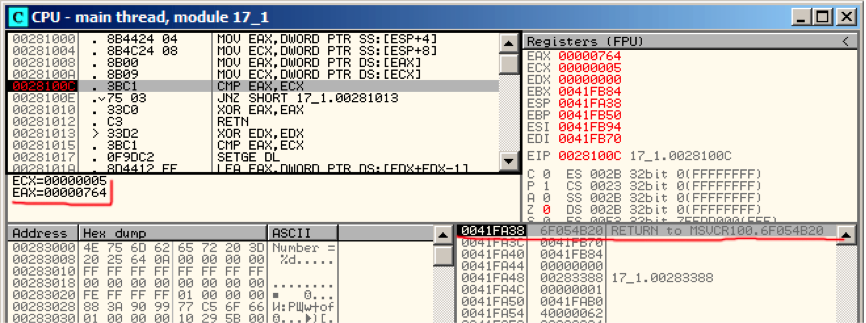
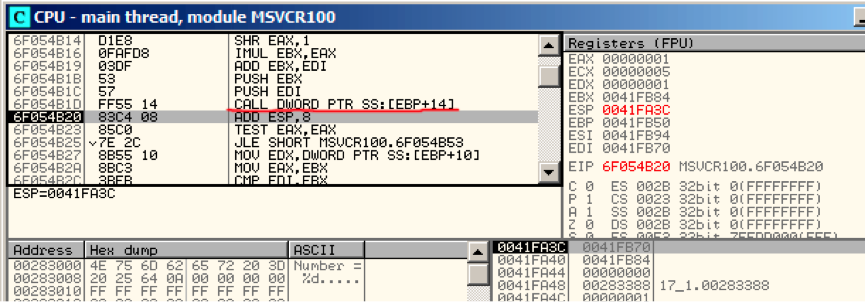
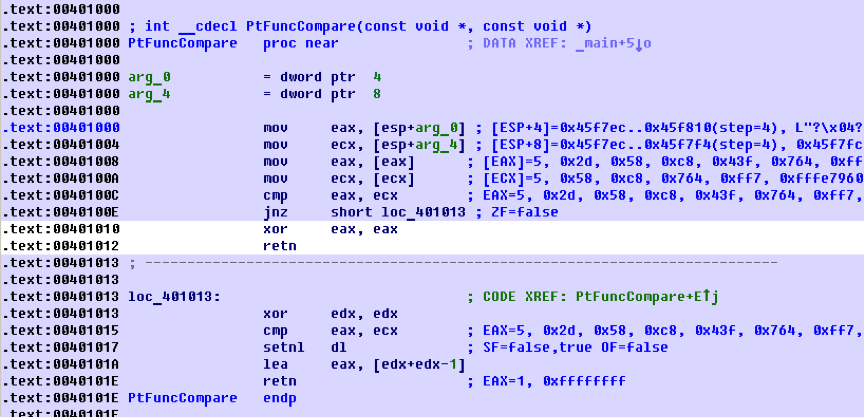

# 第二十章 函数指针

函数指针是指向函数的指针，和其他指针一样，只是该指针指向函数代码段的开始地址。函数指针经常用作回调 1。

典型的例子如下：

```cpp
C 标准库的 qsort()2, aexit()3；
*NIX OS 的信号机制；
线程启动：CreateThread()(Win32)，pthread_create()(POSIX)；
其他更多的 Win32 函数，比如 EnumChildWindows()5。 
```

qsort()函数是 C/C++标准库快速排序函数。该函数能够排序任意类型的数据。qsort()调用比较函数。

比较函数被定义为如下形式：

```cpp
#!cpp
int (*compare)(const void *, const void *) 
```

我们稍作修改：

```cpp
#!cpp
/* ex3 Sorting ints with qsort */
#include <stdio.h>
#include <stdlib.h>

int comp(const void * _a, const void * _b)
{
    const int *a=(const int *)_a;
    const int *b=(const int *)_b;

    if (*a==*b)
        return 0;
    else
        if (*a < *b)
            return -1;
        else
            return 1;
}

int main(int argc, char* argv[])
{
    int numbers[10]={1892,45,200,-98,4087,5,-12345,1087,88,-100000};
    int i;
    /* Sort the array */
    qsort(numbers,10,sizeof(int),comp) ;
    for (i=0;i<9;i++)
        printf("Number = %d
",numbers[ i ]) ;
    return 0;
} 
```

## 20.1 MSVC

MSVC2010 /Ox 选项编译：

Listing 20.1: Optimizing MSVC 2010: /Ox /GS- /MD

```cpp
#!bash
__a$ = 8                                            ; size = 4
__b$ = 12                                           ; size = 4
_comp   PROC
        mov     eax, DWORD PTR __a$[esp-4]
        mov     ecx, DWORD PTR __b$[esp-4]
        mov     eax, DWORD PTR [eax]
        mov     ecx, DWORD PTR [ecx]
        cmp     eax, ecx
        jne     SHORT $LN4@comp
        xor     eax, eax
        ret     0
$LN4@comp:
        xor     edx, edx
        cmp     eax, ecx
        setge   dl
        lea     eax, DWORD PTR [edx+edx-1]
        ret     0
_comp ENDP

_numbers$ = -40                                     ; size = 40
_argc$ = 8                                          ; size = 4
_argv$ = 12                                         ; size = 4
_main   PROC
        sub     esp, 40                             ; 00000028H
        push    esi
        push    OFFSET _comp
        push    4
        lea     eax, DWORD PTR _numbers$[esp+52]
        push    10 ; 0000000aH
        push    eax
        mov     DWORD PTR _numbers$[esp+60], 1892   ; 00000764H
        mov     DWORD PTR _numbers$[esp+64], 45     ; 0000002dH
        mov     DWORD PTR _numbers$[esp+68], 200    ; 000000c8H
        mov     DWORD PTR _numbers$[esp+72], -98    ; ffffff9eH
        mov     DWORD PTR _numbers$[esp+76], 4087   ; 00000ff7H
        mov     DWORD PTR _numbers$[esp+80], 5
        mov     DWORD PTR _numbers$[esp+84], -12345 ; ffffcfc7H
        mov     DWORD PTR _numbers$[esp+88], 1087   ; 0000043fH
        mov     DWORD PTR _numbers$[esp+92], 88     ; 00000058H
        mov     DWORD PTR _numbers$[esp+96], -100000 ; fffe7960H
        call    _qsort
        add     esp, 16 ; 00000010H
... 
```

第四个参数传递了一个地址标签 _comp，指向了 comp()函数。

我们来看 MSVCR80.DLL（包含 C 标准库函数的 MSVC DLL 模块）里该函数的内部调用：

Listing 20.2: MSVCR80.DLL

```cpp
#!bash
.text:7816CBF0 ; void __cdecl qsort(void *, unsigned int, unsigned int, int (__cdecl *)(const void *, const void *))
.text:7816CBF0          public _qsort
.text:7816CBF0 _qsort   proc near
.text:7816CBF0
.text:7816CBF0 lo       = dword ptr -104h
.text:7816CBF0 hi       = dword ptr -100h
.text:7816CBF0 var_FC   = dword ptr -0FCh
.text:7816CBF0 stkptr   = dword ptr -0F8h
.text:7816CBF0 lostk    = dword ptr -0F4h
.text:7816CBF0 histk    = dword ptr -7Ch
.text:7816CBF0 base     = dword ptr 4
.text:7816CBF0 num      = dword ptr 8
.text:7816CBF0 width    = dword ptr 0Ch
.text:7816CBF0 comp     = dword ptr 10h
.text:7816CBF0
.text:7816CBF0 sub      esp, 100h
....
.text:7816CCE0 loc_7816CCE0:                ; CODE XREF: _qsort+B1
.text:7816CCE0          shr     eax, 1
.text:7816CCE2          imul    eax, ebp
.text:7816CCE5          add     eax, ebx
.text:7816CCE7          mov     edi, eax
.text:7816CCE9          push    edi
.text:7816CCEA          push    ebx
.text:7816CCEB          call    [esp+118h+comp]
.text:7816CCF2          add     esp, 8
.text:7816CCF5          test    eax, eax
.text:7816CCF7          jle     short loc_7816CD04 
```

第四个参数 comp 传递函数指针，comp()有两个参数，参数被检测后才执行。

这种使用函数指针的方式有一定的风险。第一种原因是如果你用 qsort()调用了错误的函数指针，可能造成程序崩溃，并且这个错误很难被发现。

第二个原因是即使回调函数类型完全正确，使用错误的参数调用函数可能会导致更严重的问题。进程崩溃不是最大的问题，最大的问题是崩溃的原因—编译器很难发现这种潜在的问题。

### 20.1.1 MSVC + OllyDbg

我们在 OD 中加载我们的例子，并在 comp()函数下断点。

我们可以看到第一次 comp()调用时是如何比较的：fig.20.1.OD 代码窗口显示了比较的值。我们还可以看到 SP 指向的 RA 地址在 qsort()函数空间里（实际上位于 MSVCR100.DLL）。

按 F8 直到函数返回到 qsort()函数：fig20.2.这里比较函数被调用。

第二次调用 comp()—当前比较的值不相同：fig203。



Figure 20.1: OllyDbg: first call of comp()



Figure 20.2: OllyDbg: the code in qsort() right a_er comp() call


Figure 20.3: OllyDbg: second call of comp()

### 20.1.2 MSVC + tracer

我们来看成对比较，来对 10 个数字进行排序：1892, 45, 200, -98, 4087, 5, -12345, 1087, 88,-100000.

我们找到 comp()函数中的 CMP 指令地址，并在其地址 0x0040100C 上设置断点。

```cpp
#!bash
tracer.exe -l:17_1.exe bpx=17_1.exe!0x0040100C 
```

断点中断是的寄存器地址：

```cpp
#!bash
PID=4336|New process 17_1.exe
(0) 17_1.exe!0x40100c
EAX=0x00000764 EBX=0x0051f7c8 ECX=0x00000005 EDX=0x00000000
ESI=0x0051f7d8 EDI=0x0051f7b4 EBP=0x0051f794 ESP=0x0051f67c
EIP=0x0028100c
FLAGS=IF
(0) 17_1.exe!0x40100c
EAX=0x00000005 EBX=0x0051f7c8 ECX=0xfffe7960 EDX=0x00000000
ESI=0x0051f7d8 EDI=0x0051f7b4 EBP=0x0051f794 ESP=0x0051f67c
EIP=0x0028100c
FLAGS=PF ZF IF
(0) 17_1.exe!0x40100c
EAX=0x00000764 EBX=0x0051f7c8 ECX=0x00000005 EDX=0x00000000
ESI=0x0051f7d8 EDI=0x0051f7b4 EBP=0x0051f794 ESP=0x0051f67c
EIP=0x0028100c
FLAGS=CF PF ZF IF
... 
```

过滤 EAX 和 ECX 得到：

```cpp
EAX=0x00000764 ECX=0x00000005
EAX=0x00000005 ECX=0xfffe7960
EAX=0x00000764 ECX=0x00000005
EAX=0x0000002d ECX=0x00000005
EAX=0x00000058 ECX=0x00000005
EAX=0x0000043f ECX=0x00000005
EAX=0xffffcfc7 ECX=0x00000005
EAX=0x000000c8 ECX=0x00000005
EAX=0xffffff9e ECX=0x00000005
EAX=0x00000ff7 ECX=0x00000005
EAX=0x00000ff7 ECX=0x00000005
EAX=0xffffff9e ECX=0x00000005
EAX=0xffffff9e ECX=0x00000005
EAX=0xffffcfc7 ECX=0xfffe7960
EAX=0x00000005 ECX=0xffffcfc7
EAX=0xffffff9e ECX=0x00000005
EAX=0xffffcfc7 ECX=0xfffe7960
EAX=0xffffff9e ECX=0xffffcfc7
EAX=0xffffcfc7 ECX=0xfffe7960
EAX=0x000000c8 ECX=0x00000ff7
EAX=0x0000002d ECX=0x00000ff7
EAX=0x0000043f ECX=0x00000ff7
EAX=0x00000058 ECX=0x00000ff7
EAX=0x00000764 ECX=0x00000ff7
EAX=0x000000c8 ECX=0x00000764
EAX=0x0000002d ECX=0x00000764
EAX=0x0000043f ECX=0x00000764
EAX=0x00000058 ECX=0x00000764
EAX=0x000000c8 ECX=0x00000058
EAX=0x0000002d ECX=0x000000c8
EAX=0x0000043f ECX=0x000000c8
EAX=0x000000c8 ECX=0x00000058
EAX=0x0000002d ECX=0x000000c8
EAX=0x0000002d ECX=0x00000058 
```

有 34 对。因此快速排序算法对 10 个数字排序需要 34 此对比操作。

### 20.1.3 MSVC + tracer (code coverage)

我们使用跟踪特性收集寄存器的值并在 IDA 中查看。

跟踪 comp()函数所有指令：

```cpp
tracer.exe -l:17_1.exe bpf=17_1.exe!0x00401000,trace:cc 
```

IDA 加载.idc 脚本：fig20.4。

IDA 给出了函数名字(PtFuncCompare)—IDA 认为该函数指针被传递给 qsort()。

可以看到 a 和 b 指向数组不同的位置，并且相差 4-32bit 的字节数。

0x401010 和 0x401012 之间的指令从没有被执行：事实上 comp()从来不返回 0，因为没有相等的元素。



Figure 20.4: tracer and IDA. N.B.: some values are cutted at right

## 20.2 GCC

没有太大的不同：

Listing 20.3: GCC

```cpp
#!bash
lea eax, [esp+40h+var_28]
mov [esp+40h+var_40], eax
mov [esp+40h+var_28], 764h
mov [esp+40h+var_24], 2Dh
mov [esp+40h+var_20], 0C8h
mov [esp+40h+var_1C], 0FFFFFF9Eh
mov [esp+40h+var_18], 0FF7h
mov [esp+40h+var_14], 5
mov [esp+40h+var_10], 0FFFFCFC7h
mov [esp+40h+var_C], 43Fh
mov [esp+40h+var_8], 58h
mov [esp+40h+var_4], 0FFFE7960h
mov [esp+40h+var_34], offset comp
mov [esp+40h+var_38], 4
mov [esp+40h+var_3C], 0Ah
call _qsort 
```

comp() 函数：

```cpp
#!bash
        public comp
comp    proc near
arg_0   = dword ptr 8
arg_4   = dword ptr 0Ch
        push ebp
        mov ebp, esp
        mov eax, [ebp+arg_4]
        mov ecx, [ebp+arg_0]
        mov edx, [eax]
        xor eax, eax
        cmp [ecx], edx
        jnz short loc_8048458
        pop ebp
        retn
loc_8048458:
        setnl al
        movzx eax, al
        lea eax, [eax+eax-1]
        pop ebp
        retn
comp    endp 
```

qsort()的实现在 libc.so 里，它实际上是 qsort_r()的封装。

我们通过传递函数指针然后调用快速排序：

Listing 20.4: (file libc.so.6, glibc version—2.10.1)

```cpp
#!bash
.text:0002DDF6 mov edx, [ebp+arg_10]
.text:0002DDF9 mov [esp+4], esi
.text:0002DDFD mov [esp], edi
.text:0002DE00 mov [esp+8], edx
.text:0002DE04 call [ebp+arg_C]
... 
```

### 20.2.1 GCC + GDB (with source code)

因为我们有例子的 C 源代码，我们能在行数(11—第一次比较的地方)设置断点(b)。编译例子的时候使用了带有调试信息的选项(-g)，当前可以查看地址及行号，也可以打印变量(p):调试信息包含寄存器和变量值信息。

我们查看堆栈(bt)，看到 glibc 使用的中间函数 msort_with_tmp()。

Listing 20.5: GDB session

```cpp
#!bash
dennis@ubuntuvm:~/polygon$ gcc 17_1.c -g
dennis@ubuntuvm:~/polygon$ gdb ./a.out
GNU gdb (GDB) 7.6.1-ubuntu
Copyright (C) 2013 Free Software Foundation, Inc.
License GPLv3+: GNU GPL version 3 or later <http://gnu.org/licenses/gpl.html>
This is free software: you are free to change and redistribute it.
There is NO WARRANTY, to the extent permitted by law. Type "show copying"
and "show warranty" for details.
This GDB was configured as "i686-linux-gnu".
For bug reporting instructions, please see:
<http://www.gnu.org/software/gdb/bugs/>...
Reading symbols from /home/dennis/polygon/a.out...done.
(gdb) b 17_1.c:11
Breakpoint 1 at 0x804845f: file 17_1.c, line 11.
(gdb) run
Starting program: /home/dennis/polygon/./a.out
Breakpoint 1, comp (_a=0xbffff0f8, _b=_b@entry=0xbffff0fc) at 17_1.c:11
11 if (*a==*b)
(gdb) p *a
$1 = 1892
(gdb) p *b
$2 = 45
(gdb) c
Continuing.
Breakpoint 1, comp (_a=0xbffff104, _b=_b@entry=0xbffff108) at 17_1.c:11
11 if (*a==*b)
(gdb) p *a
$3 = -98
(gdb) p *b
$4 = 4087
(gdb) bt
#0 comp (_a=0xbffff0f8, _b=_b@entry=0xbffff0fc) at 17_1.c:11
#1 0xb7e42872 in msort_with_tmp (p=p@entry=0xbffff07c, b=b@entry=0xbffff0f8, n=n@entry=2)
at msort.c:65
#2 0xb7e4273e in msort_with_tmp (n=2, b=0xbffff0f8, p=0xbffff07c) at msort.c:45
#3 msort_with_tmp (p=p@entry=0xbffff07c, b=b@entry=0xbffff0f8, n=n@entry=5) at msort.c:53
#4 0xb7e4273e in msort_with_tmp (n=5, b=0xbffff0f8, p=0xbffff07c) at msort.c:45
#5 msort_with_tmp (p=p@entry=0xbffff07c, b=b@entry=0xbffff0f8, n=n@entry=10) at msort.c:53
#6 0xb7e42cef in msort_with_tmp (n=10, b=0xbffff0f8, p=0xbffff07c) at msort.c:45
#7 __GI_qsort_r (b=b@entry=0xbffff0f8, n=n@entry=10, s=s@entry=4, cmp=cmp@entry=0x804844d <comp
>,
arg=arg@entry=0x0) at msort.c:297
#8 0xb7e42dcf in __GI_qsort (b=0xbffff0f8, n=10, s=4, cmp=0x804844d <comp>) at msort.c:307
#9 0x0804850d in main (argc=1, argv=0xbffff1c4) at 17_1.c:26
(gdb) 
```

### 20.2.2 GCC + GDB (no source code)

更多时候我们没有源码，我们可以反汇编 comp()函数（disas），找到 CMP 指令地址并设置断点(b)。每次中断后，dump 所有寄存器的值(info registers)，堆栈信息(bt)，但是没有 comp()函数对应的行号信息。

Listing 20.6: GDB session

```cpp
#!bash
dennis@ubuntuvm:~/polygon$ gcc 17_1.c
dennis@ubuntuvm:~/polygon$ gdb ./a.out
GNU gdb (GDB) 7.6.1-ubuntu
Copyright (C) 2013 Free Software Foundation, Inc.
License GPLv3+: GNU GPL version 3 or later <http://gnu.org/licenses/gpl.html>
This is free software: you are free to change and redistribute it.
There is NO WARRANTY, to the extent permitted by law. Type "show copying"
and "show warranty" for details.
This GDB was configured as "i686-linux-gnu".
For bug reporting instructions, please see:
<http://www.gnu.org/software/gdb/bugs/>...
Reading symbols from /home/dennis/polygon/a.out...(no debugging symbols found)...done.
(gdb) set disassembly-flavor intel
(gdb) disas comp
Dump of assembler code for function comp:
0x0804844d <+0>: push ebp
0x0804844e <+1>: mov ebp,esp
0x08048450 <+3>: sub esp,0x10
0x08048453 <+6>: mov eax,DWORD PTR [ebp+0x8]
0x08048456 <+9>: mov DWORD PTR [ebp-0x8],eax
0x08048459 <+12>: mov eax,DWORD PTR [ebp+0xc]
0x0804845c <+15>: mov DWORD PTR [ebp-0x4],eax
0x0804845f <+18>: mov eax,DWORD PTR [ebp-0x8]
0x08048462 <+21>: mov edx,DWORD PTR [eax]
0x08048464 <+23>: mov eax,DWORD PTR [ebp-0x4]
0x08048467 <+26>: mov eax,DWORD PTR [eax]
0x08048469 <+28>: cmp edx,eax
0x0804846b <+30>: jne 0x8048474 <comp+39>
0x0804846d <+32>: mov eax,0x0
0x08048472 <+37>: jmp 0x804848e <comp+65>
0x08048474 <+39>: mov eax,DWORD PTR [ebp-0x8]
0x08048477 <+42>: mov edx,DWORD PTR [eax]
0x08048479 <+44>: mov eax,DWORD PTR [ebp-0x4]
0x0804847c <+47>: mov eax,DWORD PTR [eax]
0x0804847e <+49>: cmp edx,eax
0x08048480 <+51>: jge 0x8048489 <comp+60>
0x08048482 <+53>: mov eax,0xffffffff
0x08048487 <+58>: jmp 0x804848e <comp+65>
0x08048489 <+60>: mov eax,0x1
0x0804848e <+65>: leave
0x0804848f <+66>: ret
End of assembler dump.
(gdb) b *0x08048469
Breakpoint 1 at 0x8048469
(gdb) run
Starting program: /home/dennis/polygon/./a.out

Breakpoint 1, 0x08048469 in comp ()
(gdb) info registers
eax 0x2d 45
ecx 0xbffff0f8 -1073745672
edx 0x764 1892
ebx 0xb7fc0000 -1208221696
esp 0xbfffeeb8 0xbfffeeb8
ebp 0xbfffeec8 0xbfffeec8
esi 0xbffff0fc -1073745668
edi 0xbffff010 -1073745904
eip 0x8048469 0x8048469 <comp+28>
eflags 0x286 [ PF SF IF ]
cs 0x73 115
ss 0x7b 123
ds 0x7b 123
es 0x7b 123
fs 0x0 0
gs 0x33 51
(gdb) c
Continuing.

Breakpoint 1, 0x08048469 in comp ()
(gdb) info registers
eax 0xff7 4087
ecx 0xbffff104 -1073745660
edx 0xffffff9e -98
ebx 0xb7fc0000 -1208221696
esp 0xbfffee58 0xbfffee58
ebp 0xbfffee68 0xbfffee68
esi 0xbffff108 -1073745656
edi 0xbffff010 -1073745904
eip 0x8048469 0x8048469 <comp+28>
eflags 0x282 [ SF IF ]
cs 0x73 115
ss 0x7b 123
ds 0x7b 123
es 0x7b 123
fs 0x0 0
gs 0x33 51
(gdb) c
Continuing.
Breakpoint 1, 0x08048469 in comp ()
(gdb) info registers
eax 0xffffff9e -98
ecx 0xbffff100 -1073745664
edx 0xc8 200
ebx 0xb7fc0000 -1208221696
esp 0xbfffeeb8 0xbfffeeb8
ebp 0xbfffeec8 0xbfffeec8
esi 0xbffff104 -1073745660
edi 0xbffff010 -1073745904
eip 0x8048469 0x8048469 <comp+28>
eflags 0x286 [ PF SF IF ]
cs 0x73 115
ss 0x7b 123
ds 0x7b 123
es 0x7b 123
fs 0x0 0
gs 0x33 51
(gdb) bt
#0 0x08048469 in comp ()
#1 0xb7e42872 in msort_with_tmp (p=p@entry=0xbffff07c, b=b@entry=0xbffff0f8, n=n@entry=2)
at msort.c:65
#2 0xb7e4273e in msort_with_tmp (n=2, b=0xbffff0f8, p=0xbffff07c) at msort.c:45
#3 msort_with_tmp (p=p@entry=0xbffff07c, b=b@entry=0xbffff0f8, n=n@entry=5) at msort.c:53
#4 0xb7e4273e in msort_with_tmp (n=5, b=0xbffff0f8, p=0xbffff07c) at msort.c:45
#5 msort_with_tmp (p=p@entry=0xbffff07c, b=b@entry=0xbffff0f8, n=n@entry=10) at msort.c:53
#6 0xb7e42cef in msort_with_tmp (n=10, b=0xbffff0f8, p=0xbffff07c) at msort.c:45
#7 __GI_qsort_r (b=b@entry=0xbffff0f8, n=n@entry=10, s=s@entry=4, cmp=cmp@entry=0x804844d <comp
>,
arg=arg@entry=0x0) at msort.c:297
#8 0xb7e42dcf in __GI_qsort (b=0xbffff0f8, n=10, s=4, cmp=0x804844d <comp>) at msort.c:307
#9 0x0804850d in main () 
```