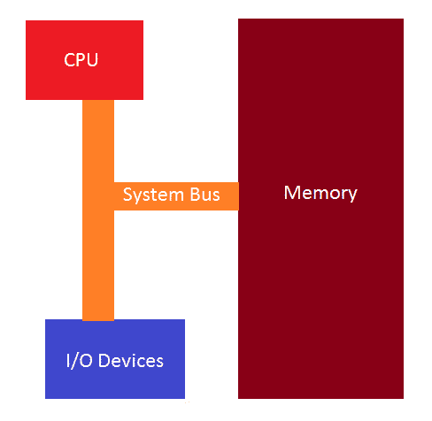

# 第九部分:x86 基础架构

> 原文：<https://0xinfection.github.io/reversing/pages/part-9-x86-basic-architecture.html>

如需所有课程的完整目录，请点击下方，因为除了课程涵盖的主题之外，它还会为您提供每个课程的简介。[`github . com/mytechnotalent/逆向工程-教程`](https://github.com/mytechnotalent/Reverse-Engineering-Tutorial)

计算机应用程序只是存储在内存中的一张机器指令表，对它来说，组成程序的二进制数只有在 CPU 处理它们的方式上是唯一的。

基本架构由 CPU、内存和 I/O 设备组成，这些设备是输入/输出设备，它们都通过系统总线连接，如下所述。

CPU 由 4 部分组成，分别是:

1)控制单元-检索和解码来自 CPU 的指令，然后将它们存储到内存中或从内存中检索。

2)执行单元-执行获取和检索指令的地方。

3)寄存器-用于临时数据存储的内部 CPU 内存位置。

4)标志-指示执行发生时的事件。

我们将讨论 32 位 x86，因此 32 位 CPU 首先从内存中的特定地址获取一个双字(4 字节或 32 位长度),然后从内存中读取并加载到 CPU 中。此时，CPU 查看双字中的二进制位模式，并开始执行获取的机器指令所指示的过程。

执行完一条指令后，CPU 进入内存，按顺序取出下一条机器指令。CPU 有一个寄存器，我们将在以后的教程中讨论寄存器，称为 EIP 或指令指针，它包含下一条要从内存中取出并执行的指令的地址。

我们可以立即看到，如果我们控制了 EIP 流，我们就可以改变程序来做它不打算做的事情。这是恶意软件赖以运行的一种流行技术。

整个获取和执行过程依赖于系统时钟，系统时钟是一个振荡器，以精确的间隔发出方波脉冲。

在下一篇教程中，我们将深入探讨 IA-32 架构，讨论通用寄存器。