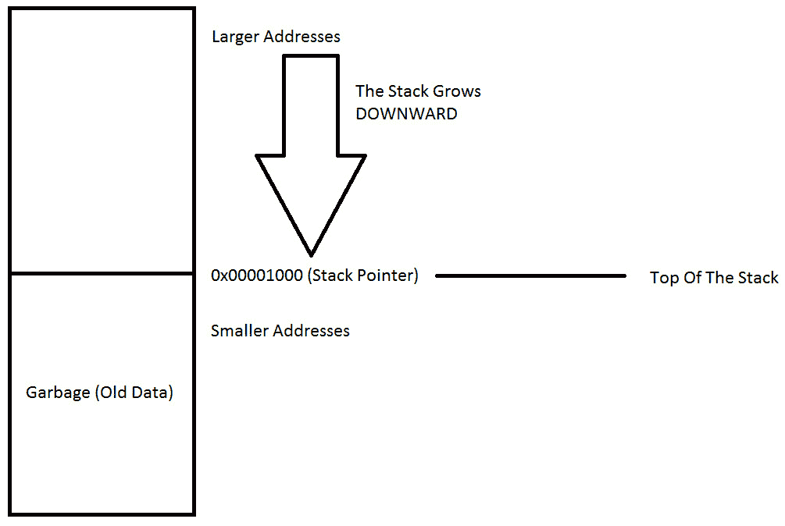
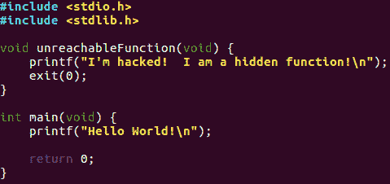
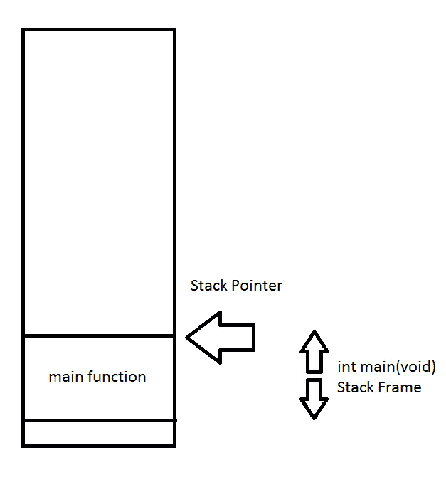
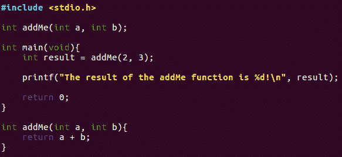
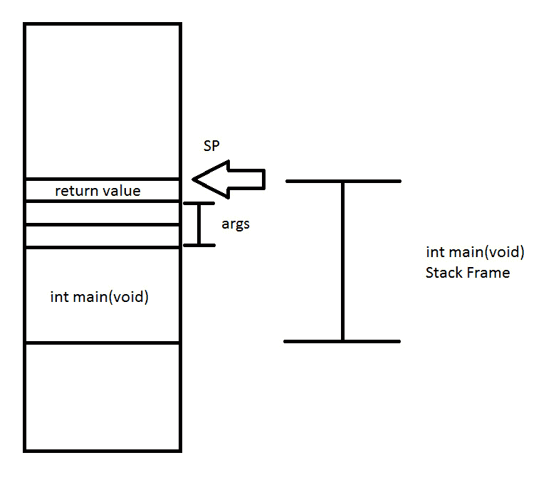
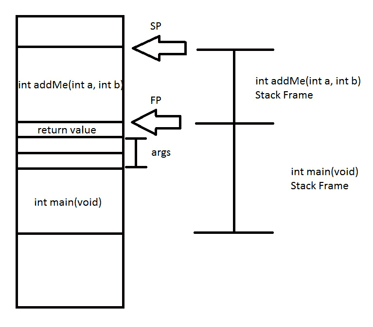

# 第十五部分:堆栈

> 原文：<https://0xinfection.github.io/reversing/pages/part-15-stack.html>

如需所有课程的完整目录，请点击下方，因为除了课程涵盖的主题之外，它还会为您提供每个课程的简介。[`github . com/mytechnotalent/逆向工程-教程`](https://github.com/mytechnotalent/Reverse-Engineering-Tutorial)

功能是软件开发中最基本的特征。函数允许您以逻辑方式组织代码来执行指定的任务。在这个阶段，理解函数如何工作并不重要，重要的是理解当我们开始学习开发时，我们希望通过使用可以多次调用的函数来最小化重复，而不是占用过多内存的重复代码。

当一个程序开始执行时，内存中的某个连续部分被留出给这个程序，称为堆栈。

堆栈指针是包含堆栈顶部的寄存器。堆栈指针包含最小的地址，例如 0x00001000，因此任何小于 0x00001000 的地址都被认为是垃圾，任何大于 0x00001000 的地址都被认为是有效的。

上面的地址是随机的，并不是绝对的，因为它会随着程序的不同而变化。让我们从抽象的角度来看看堆栈是什么样子的:

上面的图表是我希望你在头脑中保持清楚的，因为那是在记忆中实际发生的事情。接下来的一系列图表将显示与上述相反的情况。

在下图中，您将看到堆栈向上增长，但实际上它是从较高的内存向较低的内存向下增长的。

在下面的 addMe 示例中，当在内存中检查 main 函数上的断点时，堆栈指针(ESP)列出 0xffffd050。当程序从 main 调用 addMe 函数时，ESP 现在是 0xffffd030，它在内存中的位置较低。因此堆栈向下增长，尽管图中显示它指向上。请记住，当下面的箭头指向上方时，它们实际上是指向较低的内存地址。

堆栈底部是堆栈的最大有效地址，位于较大的地址区域或内存模型的顶部。这可能会引起混淆，因为堆栈底部在内存中的位置较高。堆栈在内存中向下增长，随着我们向前发展，您必须理解这一点。

堆栈限制是堆栈的最小有效地址。如果堆栈指针变得小于这个值，就会出现堆栈溢出，这会破坏程序，从而使攻击者能够控制系统。恶意软件试图利用堆栈溢出。最近，现代操作系统内置了一些保护措施，试图防止这种情况发生。

栈上有两个操作，分别是 push 和 pop。通过将堆栈指针设置为较小的值，可以推送一个或多个寄存器。这通常是通过减去要推入堆栈的寄存器数量的四倍，并将寄存器复制到堆栈来完成的。

您可以通过将数据从堆栈复制到寄存器来弹出一个或多个寄存器，然后向堆栈指针添加一个值。这通常是通过在堆栈上增加四倍数量的寄存器来实现的。

让我们看看如何使用堆栈来实现函数。对于每个函数调用，堆栈中都有一部分是为该函数保留的。这被称为堆栈帧。

让我们看看我们在教程 12 中创建的 C 程序，看看主函数是什么样子的:

我们在这里看到两个功能。第一个是 unreachableFunction，它在正常情况下永远不会执行，我们还看到 main 函数总是第一个被调用到堆栈上的函数。

当我们运行这个程序时，堆栈看起来像这样:

我们可以在上面看到 int main(void)的堆栈框架。它也被称为激活记录。每当一个函数已经开始但尚未完成时，就存在一个堆栈帧。例如，在 int main(void)的主体内部，有一个对 int addMe(int a，int b)的调用，它接受两个参数 a 和 b，int main(void)中需要有汇编语言代码来将 int addMe(int a，int b)的参数推送到堆栈上。让我们检查一些代码。

当我们编译并运行这个程序时，我们将看到 5 的值被打印出来，如下所示:

非常简单，int main(void)首先调用 int addMe(int a，int b ),然后像这样放入堆栈:

您可以看到，通过将参数放在堆栈上， **int main(void)** 的堆栈帧的大小增加了。我们还为由 **int addMe(int a，int b)** 计算的返回值保留了空间，当函数返回时， **int main(void)** 中的返回值被恢复，并且在 **int main(void)** 中继续执行，直到它完成。

一旦我们得到了 **int addMe(int a，int b)** 的指令，该函数可能需要局部变量，因此该函数需要在堆栈上推送一些空间，如下所示:

**int addMe(int a，int b)** 可以访问从 **int main(void)** 传递给它的参数，因为 **int main(void)** 中的代码正如 **int addMe(int a，int b)** 所期望的那样放置参数。

FP 是帧指针，指向堆栈指针刚好在 **int addMe(int a，int b)** 移动堆栈指针或 SP 为 int **addMe(int a，int b)** 自己的局部变量之前的位置。

当一个函数在运行过程中可能会多次移动堆栈指针时，使用帧指针是非常必要的。这个想法是在 **int addMe(int a，int b)** 的堆栈帧期间保持帧指针固定。同时，堆栈指针可以改变值。

我们可以使用帧指针来计算参数和局部变量在内存中的位置。由于它不移动，这些位置的计算应该是从帧指针的某个固定偏移。

一旦到了退出 **int addMe(int a，int b)** 的时候，堆栈指针被设置到弹出 **int addMe(int a，int b)** 堆栈帧的帧指针所在的位置。

总之，堆栈是一个特殊的内存区域，用来存储每个函数(包括 main 函数)创建的临时变量。堆栈是后进先出的数据结构，由 CPU 密切管理和优化。每当一个函数声明一个新变量时，它就被推送到堆栈上。每当一个函数存在时，由该函数推入堆栈的所有变量都被释放或删除。一旦一个堆栈变量被释放，该内存区域就可供其他堆栈变量使用。

堆栈存储变量的好处是内存是为你管理的。您不必手动分配内存或手动释放内存。CPU 非常有效地管理和组织堆栈内存，速度非常快。

理解当一个函数退出时，它的所有变量都从堆栈中弹出并永远丢失是很重要的。堆栈变量是局部的。当函数推入和弹出局部变量时，堆栈会增长和收缩。

我可以看到你的头不停地旋转。请记住，这些主题很复杂，并将在未来的教程中继续发展。我们一直在处理很多令人困惑的话题，比如寄存器、内存，现在是堆栈，这可能会让人不知所措。如果你有任何问题，请在下面评论，我会帮助你更好地理解这个框架。

在我们的下一个教程中，我们将讨论堆。