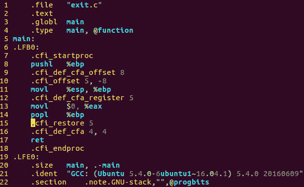
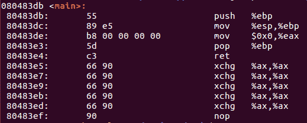
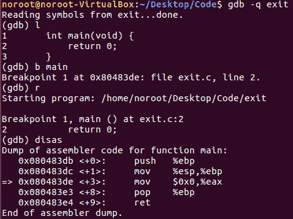
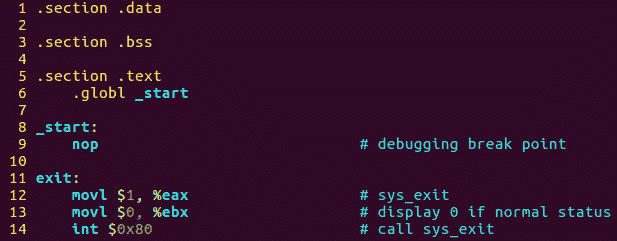

# 第二十一部分-如何编译程序

> 原文：<https://0xinfection.github.io/reversing/pages/part-21-how-to-compile-a-program.html>

如需所有课程的完整目录，请点击下方，因为除了课程涵盖的主题之外，它还会为您提供每个课程的简介。[`github . com/mytechnotalent/逆向工程-教程`](https://github.com/mytechnotalent/Reverse-Engineering-Tutorial)

让我们再来看看上周的 C 程序，更深入地看看我们如何把源代码变成可执行文件。

要用 C 编译这个程序，我们只需输入:

这一步将创建二进制目标文件 **exit.o** 和二进制可执行文件 **exit** 。

如果我们想把这个 C 源代码转换成汇编，我们需要以下面的方式使用 GNU 编译器。让我们从在终端中运行以下命令开始:

让我们从-S 开关开始。-S 开关将创建可比较的美国电话电报公司语法汇编源代码。-m32 将创建一个 32 位可执行文件，而-O0 将告诉编译器在编译二进制文件时要进行多少优化。那是大写的 O 和数字 0。在这种情况下，数值 0 意味着没有优化，这意味着它是人类最可读的指令集。如果用 1、2 或 3 来代替，优化量会随着值的增加而增加。

上面的这个步骤创建了 exit.s，它是我们上面提到的等价的汇编语言源代码。

然后我们需要将汇编源代码编译成二进制目标文件，这将生成一个 **exit.o** 文件。

最后，我们需要使用一个链接器从二进制目标文件中创建实际的二进制可执行代码，这将创建一个名为 exit 的可执行文件。

上周，当我们检查名为 objdump 的程序中的可执行文件出口，并检查主要区域时，我们看到了以下内容，只是这次我们将使用美国电话电报公司汇编语言语法:

上面的命令将创建以下输出:

让我们在调试器中检查代码。让我们启动 GNU 调试器 GDB，首先通过键入 l 列出源代码，然后在 main 上设置一个断点并运行程序。最后，我们将反汇编并查看以下输出:

在上述三个考试中的每一个考试中，你都会看到相同的一组说明，我们将在以后的教程中更深入地了解这些说明。

到目前为止，在本系列教程中，我们一直在学习英特尔语法汇编语言。我们将把我们的焦点转向美国电话电报公司语法，正如我上面所说的，因为这是在 Linux 中 GNU 汇编程序和 GNU 调试器中使用的自然语法。

你将看到的最大不同是，在美国电话电报公司语法中，源和目的地是相反的。

美国电话电报公司语法: **movl %esp，%ebp** 【这意味着将 esp 移入 ebp。]

英特尔语法: **mov esp，ebp** 【这意味着将 ebp 移入 esp。]

你还会看到一些额外的差异，因为美国电话电报公司使用了额外的差异，我们将在后面的教程中介绍。

如果我们想创建一个纯粹的汇编代码程序，做上面同样的事情，我们应该键入:

为了编译它，我们将使用 GAS 汇编器和链接器:

在 Linux 中运行你输入的任何可执行文件。/和二进制可执行文件的名称。在这种情况下，我们输入。/退出并按回车键。当我们这样做时，什么也没有发生。这很好，因为我们所做的只是创建了一个退出到操作系统的程序。

我期待下周我们深入学习更多汇编代码时与大家见面！