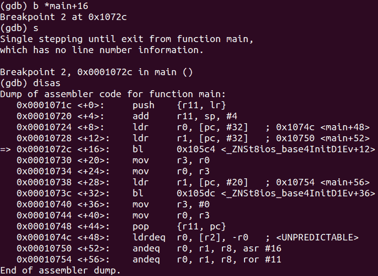
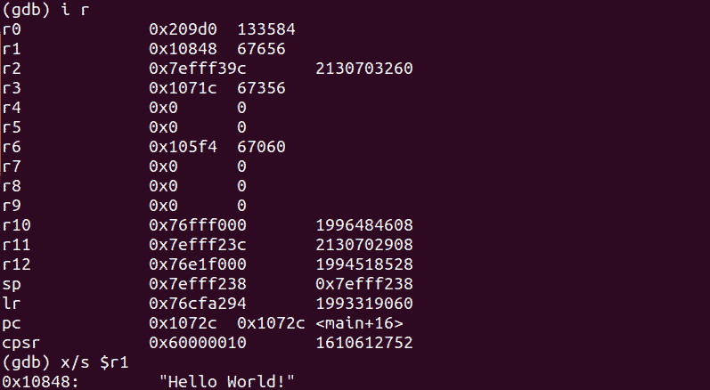

# 第十五部分-调试 Hello World

> 原文：<https://0xinfection.github.io/reversing/pages/part-15-debugging-hello-world.html>

如需所有课程的完整目录，请点击下方，因为除了课程涵盖的主题之外，它还会为您提供每个课程的简介。[`github . com/mytechnotalent/逆向工程-教程`](https://github.com/mytechnotalent/Reverse-Engineering-Tutorial)

让我们回顾一下上周的代码。

我们来调试吧！让我们启动 GDB，这是一个 GNU 调试器，我们将分解 C++二进制文件，并在 ARM 汇编中一行一行地调试它。

这是我们看到的手臂拆卸。不管你用什么语言编程，最终都会降到这个水平。

如果你没有上过我之前的 ARM 组装课程，这可能会让你感到有点害怕。如果您需要复习，请链接回该系列。

您可能会问自己，为什么我们不使用原始源代码进行调试，看看它如何与程序集完美匹配。答案是，当你是一个专业的逆向工程师时，当你在逆向二进制文件时，你没有看到源代码的奢侈。

这是一个非常简单的例子，我们将通过非常简单的例子继续这个系列，这样你就可以学习有效的技术。我们在这里使用一个基于文本的调试器，这样你就可以完全理解正在发生的事情，并且如果你不得不把自己附加到一台外部机器中的一个正在运行的进程上，你也可以得到一些培训，你将知道如何正确地调试或破解。

我将只关注这种方法，而不是使用像 IDA 之类的图形调试器，这样您就可以在非常低的级别上操作。

我们首先将链接寄存器加载到 **r11** 中，并将 **4** 添加到堆栈指针中，然后将其添加到 **r11** 。这是一个简单的例程，允许二进制保存链接寄存器并在堆栈上设置空间。

我们注意到内存地址 **0x10750** 被从内存加载到寄存器 **r1** 。让我们做一个字符串检查，看看在那个地址上有什么。

瞧啊。我们看到了我们的绳子。**“你好世界！”**位于该内存地址。

让我们在 **main+16 设置一个断点。**

让我们看看我们的寄存器值。

现在让我们来看看 **r1** 寄存器中有什么，然后逐步查看二进制文件。

我们看到了**“你好世界！”**现在驻留在内存地址 **0x10848** 的 **r1** 内的字符串。最后让我们继续看二进制。

理解汇编和一步一步的调试可以让你对任何二进制文件有完全和最终的控制！更复杂的二进制文件可能会让你花费数小时、数天或数周的时间进行真正的逆向工程，然而这些技术都是一样的，只是更耗时。

逆向工程是高级计算机工程中最复杂的分析形式。有许多工具，一个专业的逆向工程师使用，但每一个工具都有一个用途和目的，但这项技术是最复杂和全面的。

下周我们将深入破解世界。