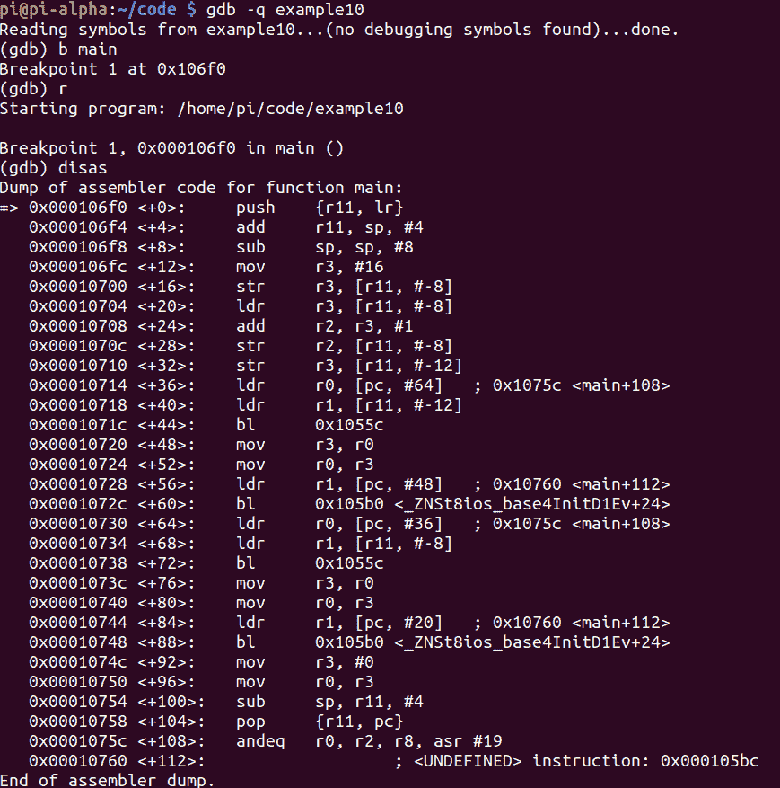

# 第四十三部分–破解后增量运算符

> 原文：<https://0xinfection.github.io/reversing/pages/part-43-hacking-post-increment-operator.html>

如需所有课程的完整目录，请点击下方，因为除了课程涵盖的主题之外，它还会为您提供每个课程的简介。[`github . com/mytechnotalent/逆向工程-教程`](https://github.com/mytechnotalent/Reverse-Engineering-Tutorial)

让我们重新检查我们的代码。

```
#include <iostream>

int main(void) {
    int myNumber = 16;
    int myNewNumber = ++myNumber;

    std::cout << myNewNumber << std::endl;

    return 0;
}

```

我们创建一个变量 **myNumber = 16** ，并在此基础上创建另一个变量 **myNewNumber** ，后者对 **myNumber** 的值进行后递增。我们看到，当我们执行我们的代码时，它将 **16** 显示为 **myNewNumber** 的值，将 **17** 显示为 **myNumber** 的值，将 **myNewNumber** 显示为不递增，因为只有 **myNumber** 递增，因为它是后操作符。

当我们后递增时，变量的值在赋给另一个变量后递增。例如**我的号码**是 **16** ，所以它在被分配给**我的新号码**后增加，所以我们得到 **17** 。

我们来调试一下。



让我们打断一下 ***main+28** 继续。


我们可以看到， **r3** 中的值是 **16** ，而 **r2** 中的值是 **17** 。我们可以看到，由于它们是由 **mov** 指令和 ***main+24** 指令直接从内存加载到 ***main+12** 寄存器中的，我们将 **1** 加到 **r3** 中，然后将该值放入 **r2** 中。

让我们黑了这个宝贝！


我们知道我们现在可以根据自己的意愿设置 r3 的值！


当我们继续时，我们看到 c++ **cout** 函数将我们新破解的值回显到屏幕上！

下周我们将深入探讨预减量运算符。