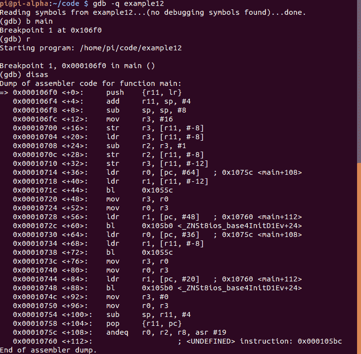

# 第四十八部分–调试后减量运算符

> 原文：<https://0xinfection.github.io/reversing/pages/part-48-debugging-post-decrement-operator.html>

如需所有课程的完整目录，请点击下方，因为除了课程涵盖的主题之外，它还会为您提供每个课程的简介。[`github . com/mytechnotalent/逆向工程-教程`](https://github.com/mytechnotalent/Reverse-Engineering-Tutorial)

让我们重新检查我们的代码。

```
#include <iostream>

int main(void) {
    int myNumber = 16;
    int myNewNumber = myNumber--;

    std::cout << myNewNumber << std::endl;
    std::cout << myNumber << std::endl;

    return 0;
}

```

我们可以看到上面非常简单的 C++代码，我们只不过是将一个数赋给一个变量，然后初始化另一个 int 变量，再将这个数赋给后减的原始变量。然后，我们将每个值输出到终端。

我们来调试一下。



很明显，后递减运算符的值在 **main+68** 处被加载到 **r1** 中，所以让我们在 **main+72** 处中断。


我们可以清楚地看到， **r1** 实际上保存了从我们的原始值中减去的 **15** 的值。


下周我们将深入研究如何破解后减量操作符。