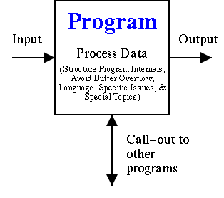

# 第一章. 简介

> 原文：[`dwheeler.com/secure-programs/Secure-Programs-HOWTO/introduction.html`](https://dwheeler.com/secure-programs/Secure-Programs-HOWTO/introduction.html)

|   |  **智者攻击强者的城池，拆毁他们所信靠的坚固堡垒**。 |
| --- | --- |
|   | *箴言 21:22 (NIV)* |

这本书描述了一套编写安全程序的指南。在本书中，一个“安全程序”是指位于安全边界上的程序，它从没有与程序相同访问权限的来源接收输入。这类程序包括用作远程数据查看器的应用程序程序、Web 应用程序（包括 CGI 脚本）、网络服务器以及 setuid/setgid 程序。本书不涉及修改操作系统内核本身，尽管这里讨论的许多原则同样适用。这些指南是在对来自各种来源的“经验教训”进行调研的基础上开发的，包括作者的一些额外观察，并将其重组为一系列更广泛的原则。本书为包括 C、C++、Java、Perl、PHP、Python、Tcl 和 Ada95 在内的多种语言提供了具体指导。它特别涵盖了基于 Linux 和 Unix 的系统，但其中许多内容也适用于任何系统。

为什么阅读这本书？因为今天，程序正受到攻击。像不断修补系统和培训用户计算机安全技能这样的技术，简单地不足以对抗计算机攻击。例如，2004 年的[Witty 蠕虫](http://www.caida.org/analysis/security/witty/)就证明了依赖于补丁“失败得非常惨重”，因为攻击者部署攻击的速度比用户安装补丁的速度快（攻击在补丁宣布后的第二天开始，45 分钟后大多数易受攻击的系统都被感染）。Witty 蠕虫还证明，部署主动措施是不够的：所有受害者至少安装了防火墙。很久以前，在计算机周围设置栅栏就能消除大多数威胁。今天，大多数程序都有网络连接或接收通过网络发送的数据（可能还来自攻击者），而其他防御措施根本无法对抗攻击者。因此，所有软件开发人员都必须知道如何对抗攻击。

您可以在[`www.dwheeler.com/secure-programs`](http://www.dwheeler.com/secure-programs)找到这本书的主副本。这本书也是 Linux 文档项目（LDP）的一部分，网址为[`www.tldp.org`](http://www.tldp.org)。它还在其他几个地方有镜像。请注意，这些镜像，包括 LDP 副本和/或您分发中的副本，可能比主副本更旧。我希望听到对这本书的评论，但请在发送评论之前检查以确保您的评论适用于最新版本。

本书不涵盖保证措施、软件工程流程和质量保证方法，这些虽然很重要，但已在其他地方广泛讨论。这些措施包括测试、同行评审、配置管理和形式化方法。具体识别安全问题的开发保证措施集合的文档包括通用标准（CC，[CC 1999]）和系统安全工程能力成熟度模型[SSE-CMM 1999]。检查和其他同行评审技术在 Wheeler [1996]中讨论。本书简要讨论了 CC 中的想法，但仅作为讨论安全需求的组织辅助。更一般的软件工程流程集合在软件工程研究所的软件能力成熟度模型（SW-CMM）[Paulk 1993a, 1993b]和 ISO 12207 [ISO 12207]中定义。质量系统的国际通用标准在 ISO 9000 和 ISO 9001 [ISO 9000, 9001]中定义。

本书不讨论如何在特定环境中配置系统（或网络）以确保其安全性。这显然对于确保特定程序的安全使用是必要的，但许多其他文档都讨论了安全配置。一本关于如何配置 Unix-like 系统以确保安全性的优秀通用书籍是 Garfinkel [1996]。其他用于保护 Unix-like 系统的书籍包括 Anonymous [1998]。你还可以在诸如[`www.unixtools.com/security.html`](http://www.unixtools.com/security.html)之类的网站上找到有关配置 Unix-like 系统的信息。有关配置 Linux 系统以确保安全性的信息可以在包括 Fenzi [1999]、Seifried [1999]、Wreski [1998]、Swan [2001]和 Anonymous [1999]在内的广泛文档中找到。Geodsoft [2001]描述了如何加固 OpenBSD，其中许多建议对任何 Unix-like 系统都很有用。关于审计现有 Unix-like 系统的信息在 Mookhey [2002]中讨论。对于 Linux 系统（以及最终其他 Unix-like 系统），你可能想检查 Bastille 加固系统，该系统试图“加固”或“收紧”Linux 操作系统。你可以在[`www.bastille-linux.org`](http://www.bastille-linux.org)了解更多关于 Bastille 的信息；它可以在通用公共许可证（GPL）下免费获得。其他加固系统包括[grsecurity](http://www.grsecurity.net)。对于 Windows 2000，你可能想看看 Cox [2000]。美国国家安全局（NSA）在[`nsa1.www.conxion.com`](http://nsa1.www.conxion.com)维护一套安全推荐指南，包括“60 分钟网络安全指南”。如果你正在尝试使用开源工具建立公钥基础设施（PKI），你可能想看看[Open Source PKI Book.](http://ospkibook.sourceforge.net)。有关防火墙和互联网安全的信息可以在 Cheswick [1994]中找到。

配置计算机只是计算机安全管理的一部分，这是一个更大的领域，它还包括如何处理病毒、需要什么样的组织安全政策、业务连续性计划等内容。安全管理有国际标准和指南。ISO 13335 是一个五部分的技术报告，提供了关于安全管理的指导[ISO 13335]。ISO/IEC 17799:2000 定义了一项实践准则[ISO 17799]；其声明的目的是为那些负责在其组织中启动、实施或维护安全的人员提供高级和一般性的“信息安全管理的推荐”。该文件特别声明自己是“制定特定组织指导的起点。”它还指出，其中包含的并非所有指导和控制都适用，并且可能需要额外的控制。更重要的是，它们旨在提供广泛的指南，涵盖多个领域，而不是提供明确的细节或“如何做”。值得注意的是，ISO/IEC 17799:2000 的原始签署是有争议的；比利时、加拿大、法国、德国、意大利、日本和美国投票**反对**其采用。然而，这些投票似乎主要是对议会程序的抗议，而不是对文件内容的反对，当然，如果人们觉得 ISO 17799 有用，欢迎使用它。关于 ISO 17799 的更多信息可以在 NIST 的[ISO/IEC 17799:2000 常见问题解答](http://csrc.nist.gov/publications/secpubs/otherpubs/reviso-faq.pdf)中找到。ISO 17799 与 BS 7799 第一部分和第二部分高度相关；关于 BS 7799 的更多信息可以在[`www.xisec.com/faq.htm`](http://www.xisec.com/faq.htm)找到。ISO 17799 目前正在修订中。重要的是要注意，这些标准（ISO 13335、ISO 17799 或 BS 7799 第一部分和第二部分）都不是为软件开发人员提供详细技术指南的；它们都旨在在多个领域提供广泛的指南。这一点很重要，因为仅仅遵循（例如）ISO 17799 的软件开发人员通常**不会**生产出安全的软件——开发者需要比 ISO 17799 提供得多的详细信息。

当然，计算机安全管理是更广泛的通用安全领域的一部分。显然，你应该确保你的物理环境也是安全的，这取决于你的威胁。你可能觉得[这个反诽谤联盟文档](http://www.adl.org/security/safe.pdf)很有用。

在[`www.caspr.org`](http://www.caspr.org)的“通常接受的安全实践与建议”（CASPR）项目试图将信息安全知识提炼成一系列可供所有人使用的论文（在 GNU FDL 许可下，这样未来的文档衍生品将继续对所有用户可用）。显然，安全管理需要包括随着漏洞被发现和修复而保持补丁。Beattie [2002]提供了一种有趣的分析，对比了坏补丁的风险与入侵的风险，以确定何时应用补丁（例如，在特定条件下，补丁在发布后 10 天或 30 天应用可能是最佳选择）。

如果你感兴趣于当前漏洞的状态，还有其他可用的资源。在 http://cve.mitre.org 上的 CVE 提供了每个（广泛传播的）漏洞的标准标识符。论文[SecurityTracker 统计数据](http://securitytracker.com/learn/securitytracker-stats-2002.pdf)分析了漏洞，以确定最常见的漏洞有哪些。位于 http://isc.incidents.org/的互联网风暴中心展示了世界各地各种互联网攻击的突出情况。

本书假设读者理解计算机安全的一般问题、类似 Unix 系统的通用安全模型、网络（特别是基于 TCP/IP 的网络）以及 C 编程语言。本书还包括一些关于 Linux 和 Unix 编程模型安全的信息。如果你需要更多关于基于 TCP/IP 的网络和协议如何工作以及它们的安全协议的信息，包括它们的网络安全协议，可以参考 TCP/IP 的一般著作，如[Murhammer 1998]。

当我最初编写这份文档时，有许多关于编写安全程序的短篇文章，但没有关于编写安全程序的书籍。现在有其他关于编写安全程序的书籍。其中一本是约翰·维加和加里·麦格雷格合著的《构建安全软件》（Viega 2002）；这是一本非常好的书，讨论了许多重要的安全问题，但它省略了许多重要的安全问题，这些问题在这里得到了涵盖。基本上，这本书选择了几个重要主题，并对其进行了很好的覆盖，但代价是省略了许多其他重要主题。维加的书在 Unix 类系统方面比在 Windows 系统方面提供的信息更多一些，但其中大部分内容与系统类型无关。另一本书是迈克尔·霍华德和大卫·勒布兰克合著的《编写安全代码》（Howard 2002）。那本书的标题具有误导性；那本书仅关于为 Windows 编写安全程序，如果您为任何其他系统编写程序，它并不很有帮助。这并不令人惊讶；它由微软出版社出版，版权归微软所有。如果您正在尝试为微软的 Windows 系统编写安全程序，那么它是一本好书。另一个有用的安全编程指导来源是 [开放式网络应用安全项目（OWASP）构建安全 Web 应用程序和 Web 服务的指南](http://www.owasp.org/guide)；它更多地涉及过程，比本书更少具体内容，但它包含了一些有用的材料。

本书特别关注所有类 Unix 系统，包括基于 Linux 的系统（包括 Debian、Ubuntu、Red Hat Enterprise Linux、Fedora、CentOS 和 SuSE）、Unix 系统（包括 Solaris、FreeBSD、NetBSD 和 OpenBSD）、MacOS、Android 和 iOS。在几个地方，它还具体介绍了 Linux 的细节。尽管如此，这些材料并不局限于特定的操作系统，其中一些材料专门针对其他系统，如 Windows。如果您知道这里尚未包含的相关信息，请告知我。

本书版权所有（C）1999-2015 大卫·A·惠勒，受 GNU 自由文档许可证（GFDL）保护；有关更多信息，请参阅 附录 C 和 附录 D。

第二章 讨论了 Unix、Linux 和安全性的背景。第三章 描述了通用的 Unix 和 Linux 安全模型，概述了进程、文件系统对象等的安全属性和操作。（Windows 与之不同，但有许多相似之处。）接着是本书的核心内容，即一组开发应用程序的设计和实施指南。本书更侧重于 Linux 和 Unix 系统，但并非仅限于此。本书以 第十二章 的结论结束，随后是篇幅较长的参考文献和附录。

设计和实现指南被分为几个类别，我认为这些类别强调了程序员的视角。程序接受输入，处理数据，调用其他资源，并产生输出，如图图 1-1 所示；从概念上讲，所有安全指南都适合这些类别之一。我将“处理数据”细分为结构化程序内部和方式、避免缓冲区溢出（在某些情况下也可以被视为输入问题）、特定语言的信息和特殊主题。章节的顺序安排使得材料更容易跟随。因此，提供指南的书籍章节讨论了验证所有输入（第五章）、避免缓冲区溢出（第六章）、结构化程序内部和方式（第七章）、谨慎调用其他资源（第八章）、审慎发送信息回（第九章）、特定语言的信息（第十章），以及最后关于如何获取随机数等特殊主题的信息（第十一章）。

**图 1-1. 程序的抽象视图**

