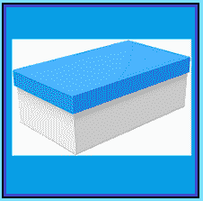

# 初学者密封盒法

> 原文：<https://www.socialengineering.info/2022/01/beginners-sealed-box-method.html>

## 密封盒法入门

作为社会工程领域的**完全的新手**第一次希望进入这个领域，从**“公司操纵和剥削”**的艺术开始可能是一项相当艰巨的任务。虽然有许多在线资源可供筛选，如活跃的社会工程委员会/论坛和 Discord 服务器，它们致力于讨论如何**欺骗公司退款和更换物品**，但很少有消息和帖子以纯粹从初学者的角度**谈论一步一步的程序** -这就是促使我写这篇文章的原因。

 

此外，你会发现他们都缩写了他们的术语——比如**色尔**、**色尔**、**色尔**、 **DNA** 、 **PEB** 、**点燃**、 **SN** 等等，如果你是人类黑客的新手，你会完全搞不清它们指的是什么这同样适用于我们在社会工程术语中称之为**“方法”——**如果你以前还没有遇到过**方法**，毫无疑问你会对它的参与和**它在每个攻击媒介中扮演的重要角色一无所知。**迷茫？放心，没什么可担心的——我会保护你的。

 

鉴于为打击网上零售商的每一种方法编写一个教程已经超出了本文的范围，比如约翰·路易斯(John Lewis)、[耐克(Nike)](https://www.nike.com/)、[扎兰多(Zalando)](https://www.zalando.com/)、[亚马逊(Amazon)](https://www.amazon.com/)等等，我将向你介绍一种在各种身材&大小的顾客中非常流行的方法，名为**“密封盒子法”**。我还将讨论**如何有效地准备**，以及**在进行中会发生什么**和**在最终确定返回后可能发生的事件**。最后，我创建了一个合适项目的列表**当你制定密封盒方法的时候，它可以作为一个通用的指南。**

 

简单地说，这是针对**【初级社会工程师】**的，他们要么从未有机会将**密封盒方法**付诸实践，要么在理解其结构和整体准备的机制方面遇到困难。**因为你将要阅读的所有内容都与初学者有关，所以主题简单且直截了当**，因此它将让你以难以置信的轻松掌握并理解**密封盒方法**是如何工作的。好吧，鉴于你是个新手，我将以一个**【社会工程方法】**的来龙去脉开始这篇文章，所以让我们开始吧。

**什么是社会工程方法？**

 

当你选择了你要瞄准的公司并研究了他们的条款&条件后，下一步就是制定一个**“策略”**关于你将如何实施攻击并在事后操纵他们的代表。也就是说，**你需要一个“计划”，用来从头到尾指导销售工程师**。而**“计划”**就是**“方法”**没有它，你的 SE 就不能、也不会有一个开始。为了让您深入了解**应用**方法的方式，这里有一个您可以与之相关的类比。

 

假设你从当地家具店买了一套**卧室套房**，里面有梳妆台、一个高脚凳、床头柜&镜子，显然还有带木条的床- **处于折叠状态**。为了将所有这些放在一起并成功完成手头的任务，你需要**“组装说明”**，如果它们丢失或属于不同类型的卧室套件，工作就无法完成。同样的原则也适用于*社会工程*——在这种情况下，**“组装说明”**就是**“方法”** **，它支持你的目标**——退款或更换项目。明白了吗？很好！

 

现在，选择产品并不像选择第一个想到的方法那么简单。除了 [DNA](https://www.socialengineers.net/2020/08/the-dna-method.html) (未到货)和[错收物品](https://www.socialengineers.net/2020/07/wrong-item-received-method.html)这两种几乎可以用于任何合理尺寸&重量**的物品外，其他每一种传统方法都必须基于物品的性质**—**“密封盒法”**当然也不例外，即其**“包装”**。在准备方法时，一个错误的举动或一个错误的判断都会暴露你的意图。那么什么是**封箱法**，它是为了什么目的？我们现在就去看看。

 

 

**什么是封箱法？**

 

我必须说，这是我最喜欢的方法之一，因为事实上**这种方法在任何规模的公司中都有非常高的成功率**。如果你仔细阅读从这一点开始写的东西，并吸收我建议的每一个字，你将获得极其准确地应用这一方法的技能。好吧，我就开门见山，解释如下。它的工作原理是购买一个**“六面完全封装在一个纸板箱中，并包含一个或多个工厂封条和/或用透明薄膜包裹”**。

 

然后你小心翼翼地打开盒子**，确保不要损坏它的任何部分**，然后取出物品，**用同等重量的东西** - *替换它，最好是与原产品类似的东西*。接下来发生的事情，是这个方法形成过程中最重要的部分，所以请注意我所说的。**当“重新密封盒子”时，必须在没有任何篡改迹象的情况下完成**，最终结果应该是从公司购买的准确表示，并且“密封”/密封/薄膜保持在制造商的状态。

 

如果你到现在还没想出来，密封盒法的目的是**【貌似】****退回你购买的产品(由于改变主意或其他原因)**看似完好无损**，然后收到退款。**实际上，你已经退回了之前在**更换的另一件物品。基本上，当公司接受你的退货时，他们会看到盒子里没有不一致的迹象，并认为这是真货。然后，它将被扫描，放回库存，您的银行帐户将在 ex-amount 的工作日内贷记。你很可能想知道如何**完美地打开和重新密封盒子**，这让我想到了下一个话题。**

 

 

**如何应用封箱法:**

 

在阅读了关于组装密封盒方法的最后几段后，这听起来像是一个快速而简单的任务，但事实并非如此。由于**工厂**包装和封箱方式不同的货物非常多，**采用封箱方式是根据具体情况**进行的。例如，同样的方法不能同时用在**笔记本电脑**和 **IPhone 13** 上。前者(笔记本电脑)，通常在盒子的顶部和/或底部有一个 ***塑料粘合密封*** ，至于 IPhone 13，有几个 ***防篡改纸拉环密封*** ，打开盒子的唯一方法是提起每个拉环/密封，从左向右拉。

 

当然，其他产品需要其他方法来拆开包装，但我不可能一一介绍，因此在本教程中，我将重点介绍**使用密封盒法来拆开“笔记本电脑”，特别是“IPhone 13** ”。我选择它们的原因是，首先，它们对社会工程师来说是非常受欢迎的物品，其次，由于它们包装的性质，每一个在打开和重新密封的方式上都完全不同。因此，它会让你很好地理解**如何将类似的方法应用到你计划用密封盒方法**销售 **的其他项目。说够了，让我们从处理笔记本电脑开始。**

 

 

用笔记本电脑使用密封盒法

 

在我开始之前，请注意**这不是基于任何特定的笔记本电脑**，而是展示了制造商如何包装大多数设备，因此**请确保您将销售的笔记本电脑**具有一定的灵活性。向前看，有相当多的笔记本电脑装在一个盒子里，顶部有一个工厂封条&底部写着这样的话:**“如果封条破损，请检查内容”**。*这是销售代表(或处理您退货的任何人)首先要看的地方* -这也适用于每一件有封条的产品，所以请时刻牢记这一点。

 

如果使用最低温度设置的**吹风机或者小心翼翼地将**薄刀片**放在封条下侧**轻轻提起而不损坏封条**很容易剥离，那么继续使用这两种技术中的任何一种。但是一定要记住最重要的部分——重新密封，不要有任何瑕疵**。为此，**使用不会留下残留物的透明胶水**，或者如果密封件上的粘合剂仍然完好无损，将其牢牢压回原位。或者，导航到[该站点](https://sening.en.alibaba.com/product/60527749691-200533919/Adhesive_Security_Packing_Tape_Warranty_VOID_Tempered_Tape_If_Removed.html)并查看是否有合适的封条/胶带可用，如果有，我不需要解释，你知道该怎么做。

 

另一方面，许多封条几乎不可能一片拆下来，因此在这种情况下，把它放在一边，瞄准**“盒子连接的地方”**——目的是找出**最薄弱和最容易的地方，在那里它可以被拉开而不会造成损坏**。将笔记本电脑换成**另一个同等** **重量**的物品后，简单地将它重新粘在一起。我亲自在几个笔记本电脑盒子上做过，最终结果是原物的精确再现，因此**没有理由检查我的退货**并处理退款。

 

 

使用 IPhone 13 的密封盒方法

 

在这篇文章发表时，IPhone 13 是最新发布的产品，鉴于**它的包装与 IPhone 12** 相比发生了显著变化，许多社会工程师很难打开和重新密封它，以避免显示它被篡改。这样做的原因是因为它有**“两个长条状纸拉环密封”**，它们粘在盒子的顶部&和底部**，取出手机的唯一方法是从一端向另一端**拉动条带(密封)，直到它们完全移除。与上面主题中阐述的笔记本电脑的方法不同，**IPhone 13 盒子不能在连接处打开** -因为这将损坏密封并显示篡改的迹象。

 

苹果当然在**“帮助阻止”**任何有欺诈意图的人访问其内容方面做得很好，但 **SEing 完全是为了操纵每一个障碍和实体以对你有利**，对 IPhone 13 使用密封盒方法绝对是等式的一部分。注意到我是如何引用上面的**“帮助预防”**的吗？那是因为苹果**【防不胜防】**，无论他们在手机外包装上的防篡改保护已经实施的多么安全。下面是密封盒方法的执行过程，在工作完成时不会留下任何不一致的地方。

 

如你所知，**盒子只能通过撕掉封条**才能打开，所以与其专注于寻找不损坏封条的方法，还有一个很好的替代方法，可以让**给人一个完美密封的盒子**的印象——那就是**“从[这里](https://www.aliexpress.com/item/1005003386660685.html?spm=a2g0o.search0304.0.0.17b14d4cZcHPMv&algo_pvid=4b9785b4-c90e-4f1e-b3e5-b05366506a35&algo_exp_id=4b9785b4-c90e-4f1e-b3e5-b05366506a35-4)或者[这里](https://www.aliexpress.com/item/1005003389299019.html?spm=a2g0o.search0304.0.0.17b14d4cZcHPMv&algo_pvid=4b9785b4-c90e-4f1e-b3e5-b05366506a35&algo_exp_id=4b9785b4-c90e-4f1e-b3e5-b05366506a35-3)购买 IPhone 13 的包装盒封条**。本质上，你不必担心原来的密封- **它们会被你买的**所取代，因此唯一关心的事情是完美地应用新的密封-这一点也不太困难。如果需要的话，请一整周的假！你最终会成功的。

 

 

**用封箱法期待什么:**

 

您刚才有幸读到的内容，**都是在您当地的环境**中完成的，通过制定密封箱方法(精确)**为攻击媒介**做好准备——即组织将您的货物发送到公司进行退款/更换。然而，在你发起攻击的那一刻**，你对公司范围内发生的事情几乎没有任何控制**，因此了解一下销售代表如何处理你的诉求是至关重要的

 

因此，如果他们向你提出各种各样的问题和要求，你就能有效地满足他们的要求。**就密封盒方法本身而言，当公司收到你的退货时，以及当它在未来某个时候被卖给另一个客户时，有【5 个事件】可能*(而不是将会)****会经历。**我在**下面的副主题中列出了每个事件，为了避免拥挤和便于理解，我添加了一个简短的描述。*

 **

 **

*返回时扫描箱子*

 **

*在今天的仓储&物流和货运&配送中，每一个大规模经营的主要零售商都使用**【扫描系统】** **来监控他们的库存**的动向。因此，在发送您的 SE 密封盒进行退款时，务必确保**“这是您实际购买的盒子”**，这样当他们扫描它时，它将成为他们库存的一部分，您的退款申请将在此后继续进行。*

 **

 **

*箱子在返回时称重*

 **

*为了核实货物并将退货处理到公司的库存中，**箱子、包裹、包裹等在进口货物中心**称重，并保存每批货物的记录——当[调查](https://www.socialengineers.net/2020/04/company-investigation.html)开始时，该记录可用于与承运人交叉核对细节。如果发现差异，很可能会暴露你的销售意图，这就是为什么**“密封箱返回时，重量不得有明显差异”**。*

 **

 **

*箱子可能被检查是否被篡改*

 **

*最重要的是**你的成品密封箱是原件**的复制品，因为你的退货很有可能会被公司收货区的工人(从外部)检查。如果在盒子上发现缺陷，**特别是“损坏的封条”**，那么他们就有充分的理由进一步调查。我不是说**会被检查，而是说**【可能】**会被检查，因此**你的密封盒必须完好无损地返回**。***

 ******

 ******

***箱子可能被打开&检查***

 ******

***即使你已经重新密封了盒子，没有任何不一致的迹象，但由于这样或那样的原因，(在极少数情况下，**它可能会被打开，里面的东西会被检查**，这将使你别无选择，只能合法地将原产品退回，以获得退款。但要做到这一点，你必须想出一个非常可信的借口。其中之一，就是说**你在准备寄回的时候很匆忙，误将不正确的物品放在了**的箱子里。为了证明为什么它被完美地重新密封，告诉销售代表您担心**损坏的盒子会使您的退款权利无效**。***

 ******

 ******

***另一个买家将购买你的退货***

 ******

***毫无疑问，每一件被退回的商品都以其原始和可销售的状态被放回库存，等待出售给下一个顾客——**，他实际上会购买你的密封盒退货**，并明显收到与他所支付的完全不同的东西。许多人担心这件事会被追查到他们身上，但事实并非如此。一旦产品被**退回、入库，然后** **拣货、包装、发货、传送到承运商并最终交付**，它会经过这么多人的手，因此不可能精确到社会工程师。***

 ******

 ******

*****物品适合封箱方法:*****

 ******

***重申密封箱方法的要求，箱子必须**“所有六面都用硬纸板覆盖”**，并且绝对有必要**“用制造商贴的一个或多个工厂封条和/或薄膜固定”**。由于这些先决条件，**挑选你打算销售的商品至关重要** -其包装必须与上述必需品完全兼容。那么如何确定和建立一个合适的产品呢？***

 ******

***嗯，这真的很简单，导航到 YouTube 并输入关键字:**(你的物品)拆箱“**——显然是用*你的产品描述*替换“你的物品”。它将清楚地展示盒子的**性质，以及它是否包含密封/薄膜**以防止篡改。如果合适，你可以使用**密封盒法**。为了让你在选择物品时了解要带什么，我在下面列出了一个小清单，并详细说明了封条的类型以及它们在盒子上的位置。***

 ******

****   Apple iPhone 13 -the top two strips of paper tab seal & the bottom of the box*   Apple AirPods Generation 3 -same as above, but the box size is smaller*   GoPro Hero 9 action camera -There is a tension ring seal at the bottom of the box.*   Acer Nitro 5 game notebook -the seal on the top of the small single (square) box*   BOSE QC35 series II -the kind wrapped in the transparent film from the factory is similar to the seal*   Kingston internal SSD -same as above, transparent film fixed box*   Logitech G502 Game Mouse -A small transparent rectangular seal at the top of the box*   NVIDIA RTX3080GPU -Two small transparent square seals at both ends of the box*   iPad mini 5 -A long plastic strip along the length of the box is used for***

 ******

*****总之:*****

 ******

***现在这篇文章已经结束，基于你已经阅读了每一个主题/子主题，你会意识到**密封盒方法指的是基于技术的产品**。我特意决定了这一点，因为事实上**大多数货物通常包装有防篡改封条和/或薄膜**，从而实现了整个指南的目标。自然，密封盒方法并不局限于科技产品，但是为了简单起见，我只讨论了这一类。***

 ******

***最后，根据上述主题中的几个项目，我想指出的是，工厂生产的用透明薄膜包裹的**盒子，其作用与封条**相同——如果被撕开，那就是被篡改了。如果您在重新密封透明薄膜时遇到问题，例如通常应用在 **IPhone 12** 上的透明薄膜，请使用[这种热合机](https://www.amazon.com.au/Impulse-Sealing-Machine-Electric-Plastic/dp/B07D46WRYH/ref=asc_df_B07D46WRYH/?tag=googleshopdsk-22&linkCode=df0&hvadid=341792986796&hvpos=&hvnetw=g&hvrand=6375031582507440950&hvpone=&hvptwo=&hvqmt=&hvdev=c&hvdvcmdl=&hvlocint=&hvlocphy=9071221&hvtargid=pla-795151274299&psc=1)并从[这个网站](https://www.aliexpress.com/item/4001294442504.html?spm=a2g0o.search0304.0.0.17b14d4ckYhmtq&algo_pvid=1e245a2f-efa6-494d-a66d-b78b4091d8dd&algo_exp_id=1e245a2f-efa6-494d-a66d-b78b4091d8dd-38)购买薄膜，并使用网站的搜索功能找到其他产品的包装薄膜。***