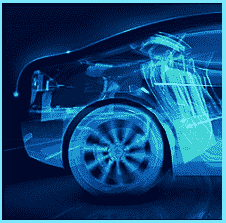

# 免费公共交通

> 原文：<https://www.socialengineering.info/2020/04/free-public-transport.html>

## **通过售检票员免费乘坐公交。**

This does not apply to every transport system around the globe, hence I'll provide a ***general example*** of how social engineers **"travel on public transport free of charge"**, by way of SEing the ticket Inspectors. You can manipulate this method, against the public transport system In your location. 
  **Transport And Ticketing System Explained:**
  This Is In fact based on a **"real system"** that I've been personally abusing for over 5 years. I will use a bus as the transportation and the ticketing system that's In place, requires a **"swipe"** to validate the ticket, thereby money Is **ONLY** deducted at the time of the swipe as each passenger boards the bus. This Is where the vulnerability exists- the **"Inspectors arrive on the bus randomly"**, thus are not present at all times. As such, there's no need to validate (swipe) the ticket when the Inspectors are not around! Here's Is how the SE works.
  **The SE In Action:**
  The social engineer carries a ticket at all times, solely used to SE and not for payment purposes. As the bus arrives, he jumps on **"without swiping/validating"**, and sits In the same direction of travel- constantly checking for Inspectors at every stop. Then at some point, the ticket Inspectors jump on and ask every passenger for their ticket. 
  The social engineer has noticed this and makes his way to the exit door, ready to get off at the next stop. To avoid being approached by the Inspectors, he ensures that **"his ticket Is clearly visible"** In one hand, and at the same time, pretends to be arguing on his cell phone VERY loudly with obscene language. He also appears very distressed- as though he'd throw a punch at anyone who crosses his path. The ticket Inspectors are very hesitant to question him and under the circumstances, decide to leave him be.
  **Why The SE Succeeded:**
  Due to the Intense argument he's (seemingly) having over the phone, the ticket Inspectors feel they may be under threat, thus dare not question him. Furthermore, given that the social engineer's ticket Is In full view of the Inspectors, they're on the assumption that It Is In fact valid, which gives them more reason not to approach him.   
  **In Conclusion:**
  The social engineer jumps off the bus at the next stop, enjoyed his free ride, and waits to board the next one. When a similar scenario comes around, he'll do the very same thing again, and repeat the process to keep travelling without paying a single dime! This clearly demonstrates the power of human manipulation to get free transport.