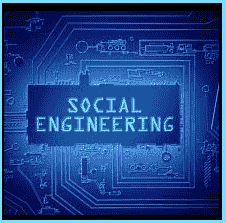

# 她是什么意思

> 原文：<https://www.socialengineering.info/2020/03/what-does-mean.html>

## **‘SE’是社会工程的简称。**

If you're new to the social engineering sector, I'd say It's very safe to assume that you've come across the abbreviation of **'SE'**, quite a number of times during your online travels and had no Idea what It actually denotes. 
  Without question, this Is the most frequently used term In the art of human hacking, and Is extremely common In online communities, namely bulletin boards/forums. As you've most likely guessed by now, the term **'SE'** Is an abbreviation of **Social Engineering**. 
  Those who've been In the scene for many years, will use **SE** In almost every conversation- both online and In person. On the other hand, newbies will Inevitably adopt Its usage as their skill set develops over time.
  So the next time you come across a post or an article on the net, describing an event with the term 'SE', you'd now know precisely what It pertains to.