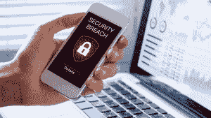

# 2021 年社会工程攻击:回顾

> 原文：<https://www.social-engineer.com/2021-social-engineering-attacks-a-look-back/>

## 2021 年亮点

2021 年是充满各种事情的一年，从金和坎耶离婚，到过多的新社会工程攻击。与前者不同，后一个问题可能永远不会真正结束。这一年带来了哪些攻击？更重要的是，我们如何保护我们自己、我们的公司和我们所爱的人免受这些攻击？考虑到这一点，让我们来看看亮点。
[T3】](https://www.social-engineer.com/wp-content/uploads/2021/11/2021-December-SECOM-Blog.webp)

## 罗宾汉数据泄露

[Robinhood](https://robinhood.com/us/en/) 是一款免佣金的投资应用。2021 年 11 月，一场针对它的攻击从一个[视觉](https://www.social-engineer.com/glossary/vishing/)呼叫开始。攻击者拨打了客户服务热线，并将呼叫升级。最终，攻击者能够访问交易平台的一些客户支持系统。这次攻击导致大约 500 万人的电子邮件地址被暴露。另外一个由 200 万人组成的独立团体的全名也被访问了。此外，约有 310 人的其他个人信息遭到破坏，如出生日期和邮政编码。

## 3500 万美元的假货

在过去的几年里，深度造假已经成为越来越多的讨论话题。WhatIs.comT2 将 deepfakes 定义为“一种用于创建令人信服的图像、音频和视频恶作剧的人工智能。”

作为深度伪装危险的一个例子，考虑一下最近的银行抢劫案。利用人工智能增强的语音模拟，攻击者从阿拉伯联合酋长国的一家银行窃取了 3500 万美元。这段被篡改的音频被用来影响一名银行职员，让他以为自己在转账是合法商业交易的一部分。攻击者自称是一家大公司的董事，此前曾与目标公司的一名经理通话。攻击者将 deepfake 音频与似乎来自该公司及其律师的钓鱼电子邮件结合在一起。综合起来，这些技巧使经理相信公司正在进行一笔价值 3500 万美元的大生意。由于这个原因，经理发起了资金转移。

## Covid 疫苗接种

不讨论与新冠肺炎相关的袭击事件，2021 年的回顾就不完整。[华盛顿邮报](https://www.washingtonpost.com/technology/2021/08/24/covid-vaccine-proof-scam-email/)报道称，六月份与流行病相关的网络钓鱼企图增加了 33%。值得注意的是，它指出，这一峰值是与谷歌搜索“delta variant”的激增同时出现的。我们已经看到这些攻击涵盖了从测试结果到失业索赔骗局的所有内容。疫苗的生产带来了新一波的攻击，涉及到这一确切的因素。

据《华盛顿邮报》报道，2021 年出现了伪装成企业人力资源部门并要求个人提交其疫苗接种状态信息的网络钓鱼活动。这些电子邮件有时包含虚假登录页面的链接，目的是获取员工的凭据。其他人要求提供疫苗接种证明。疫苗接种卡包含攻击者可能会发现有用的信息，如您的出生日期。随着疫情的不断发展，我们可以肯定攻击也会随之发展。

## 如何保护自己

虽然攻击者和他们的战术在不断演变，但保护我们自己的基本原则保持不变。为了简洁起见，我们将把本月的技巧局限于本文中讨论的攻击类型。

#### ***使用密码管理器***

维护帐户安全的一个关键是永远不要重复使用密码。有鉴于此，我们强烈建议使用密码管理器。这将有助于您保持密码的组织性、多样性和安全性。想了解更多？开始[这里](https://money.com/how-to-pick-password-manager/)。

#### ***启用双因素认证***

实施双因素身份验证是保护您的帐户免受恶意行为者攻击的简单而有效的方法。如果你不确定从哪里开始，我们在这里提供了一个链接[来帮助你。](https://www.pcmag.com/how-to/two-factor-authentication-who-has-it-and-how-to-set-it-up)

#### ***如何识别假货***

低质量的 deepfakes 相当容易识别。特别是，注意不良的嘴唇同步，不自然的眼球运动或眨眼，以及变换图像边缘的闪烁。如果不确定，看看头发和珠宝等更精细的细节，看看你是否能发现它。然而，deepfake 技术在不断发展，所以，无论如何，要保持警惕。

#### ***有疑问时，核实***

如果你不确定你正在观看的视频是否是伪造的，电子邮件中的链接是否是真实的，或者你接到的电话是否是合法的， ***验证，验证，验证*** 。例如，您可以通过将鼠标悬停在链接上来查看其指向的位置，从而识别潜在的网络钓鱼电子邮件。此外，一定要检查发件人，寻找任何鼓励你迅速采取行动的措辞。关于保护自己免受钓鱼邮件侵害的更深入的讨论，请点击这里阅读我们的文章[。如果你想核实你接到的电话，花点时间看看打电话的人要求的信息是否有意义。例如，银行不应该问你的银行代号。向打电话的人提问，直到你认为电话是合法的为止。要了解更多识别视觉的技巧，请点击这里阅读我们的提示](https://www.social-engineer.com/fight-the-phish/)[。](https://www.social-engineer.org/framework/attack-vectors/how-can-you-protect-yourself-against-common-attacks/)

## 教育是关键

一如既往，教育是保护你自己、你所爱的人和你的公司免受潜在的社会工程攻击的关键。有鉴于此，确保持久行为改变的最佳方式是教员工如何识别和应对视觉威胁。毕竟，只需一次攻击就可能摧毁整个公司。[请立即联系我们的团队进行报价](https://www.social-engineer.com/services/vishing-service/#request)。

*来源:*
*[https://robinhood.com/us/en/](https://robinhood.com/us/en/)*
*[https://www.social-engineer.com/glossary/vishing/](https://www.social-engineer.com/glossary/vishing/)*
*[https://www . the guardian . com/technology/2020/Jan/13/what-are-deep fakes-and-how-can-you-spot-them](https://www.theguardian.com/technology/2020/jan/13/what-are-deepfakes-and-how-can-you-spot-them)*
*[https://oig . hhs . gov/fraud/consumer-alerts/fraud-alert-新冠肺炎](https://oig.hhs.gov/fraud/consumer-alerts/fraud-alert-covid-19-scams/)*

*图片:*
*[https://security brief . co . NZ/story/94-of-organizations-experied-insider-data-breakes-last-year-human-error-top-cause](https://securitybrief.co.nz/story/94-of-organisations-experienced-insider-data-breaches-last-year-human-error-top-cause)*