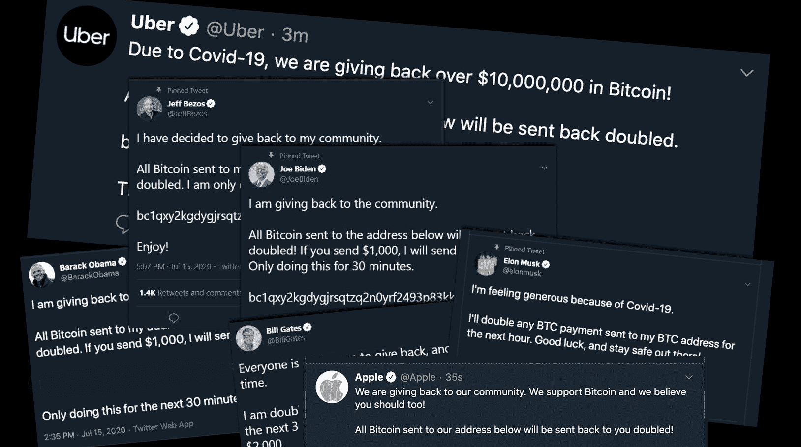

# 分析 2020 年的 Twitter 攻击

> 原文：<https://www.social-engineer.com/analyzing-the-2020-twitter-attack/>

2020 年 7 月 15 日，社交媒体平台 Twitter 似乎运行正常。当天的热门话题是说唱歌手 T-Pain 与唱片艺术家特拉维斯·斯科特的最新口角。随着人们在推特上发布伦敦地铁移除班克斯艺术品的消息，讨论变得激烈起来。随着一切进展顺利，许多 Twitter 安全团队刚刚开始了他们当天的常规工作任务。这时候，疯狂的消息开始到达。他们都说了同样的话:“有人试图收集员工凭据”。

这次袭击不仅老练，而且让整个世界大吃一惊。到底发生了什么？为什么会如此成功？我们来分析一下 2020 年的 Twitter 攻击。

## 袭击

7 月 15 日早些时候，一个名为 Kirk#5270 的 Discord 用户发布了一个令人兴奋的帖子，其中有一个有趣的提议。“我为推特工作。我可以自称任何名字，如果你想工作，请告诉我。”吹嘘他可以控制任何账户，激起了一些人的兴趣。许多人回答说:“证明它。”7 月 15 日上午，Twitter 的一些员工开始接到电话。打电话的人冒充内部员工，联系那些在消费者服务和技术支持部门工作的人。

说明很简单——我们需要您重置密码。一些人将电话标记为可疑，挂断了攻击者的电话，并将其报告给他们的安全团队。然而，有几个员工更通融。按照来电者的指示，他们进入了一个由攻击者控制的欺骗性网站。在那里，他们输入自己的用户名和密码，以及他们的多因子认证(MFA)代码。有了这只装满凭证的小手，攻击者就有了他们需要的东西来收集他们想要的信息。

## 复杂且有针对性

值得注意的是，这些电话是复杂而有针对性的。打电话的人利用他在每次电话中了解到的信息来获得下一次电话的新信息。并非所有被 vishing 攻击的员工都可以使用内部工具。然而，他们所提供的信息使得打电话的人可以联系到提供信息的员工。通过使用这些信息，呼叫者设法获得了能够访问[客户支持工具的员工凭证。](https://twitter.com/TwitterSupport/status/1286123465276178433)这些信息正是攻击者所需要的。

到美国东部时间下午 3 点 13 分，人们开始注意到一些可疑的推文。加密货币交易所币安表示，他们将向社区“返还”5200 万美元的比特币。这条推文附带链接指向一个欺诈网站。到下午 4 点 17 分，埃隆·马斯克和比尔·盖茨在推特上表示，他们将向粉丝免费发放比特币。到下午 4 点 55 分，优步、苹果、坎耶·韦斯特、杰夫·贝索斯和乔·拜登的账户也在发同样的微博。安全团队当时就知道“事情变得非常糟糕。”

## 阻止骗局

最初攻击后的几个小时对 Twitter 团队来说是混乱的。如何阻止攻击的混乱导致他们的团队不得不做出艰难的决定。由于不知道攻击来自哪里，安全团队只剩下几个选择，但似乎只有一个可行。下午 6 点 18 分，该团队决定阻止所有验证过的账户发推。他们还对最近更改过密码的账户进行了限制。

虽然对许多阅读这篇文章的人来说，这似乎没什么大不了的，但事实是它确实有它的后果。根据 2020 年 5 月的一份报告，Twitter 上有超过 3 . 3 亿的月活跃用户。每天有 1.45 亿人使用 Twitter。许多用户将 Twitter 作为媒体突发新闻或政府当局公共安全和紧急事件更新的主要来源。随着推特的关闭，国家气象局无法发出龙卷风警报来警告人们潜在的危险。新闻媒体公司无法让人们了解最新的突发新闻，包括当时 Twitter 上发生的事情。

## 余波

Twitter 发现自己处于与许多公司相同的境地，因为他们发现了一个漏洞。做出疯狂的决定，讨论权衡，并计划潜在的行动过程。然而，正如 Twitter 发现的那样，你关闭内部网络越紧，你就越不能对抗这个骗局。这样做意味着您失去了跟踪肇事者的能力，更重要的是，您失去了找出您团队中谁已经受到危害的能力。所以，随着每个人都开始使用内部 VPN，他们开始使用所谓的“零信任”系统。因此，从首席执行官杰克·多西开始，每个人都要和一名主管进行视频会议。在通话过程中，他们需要在主管面前手动更改密码。一旦他们做到了这一点，他们的服务就会慢慢恢复正常。

这给每个人留下了一个问题——谁完成了这次复杂的攻击？起初，谣言满天飞，说罪魁祸首是一名胭脂员工，或者可能是专业人士。然而，令所有人惊讶的是，这次攻击背后的“策划者”是一名刚刚毕业的高中生，年仅 17 岁。联邦当局已经掌握了格雷厄姆·伊万·克拉克的信息，并在袭击前一直在跟踪他的网上活动。事实上，在 2020 年 4 月，特勤局已经从他那里没收了超过 70 万美元的比特币。对于 Twitter 的攻击，克拉克设法访问了 100 多个账户，从其中 45 个账户发了推文，获得了其中 36 个账户的直接信息，并从他入侵的 7 个账户下载了完整的信息。他还净赚了约 11.7 万美元的比特币。

## 保护自己不被钓鱼

每个人都在问，这次袭击是怎么发生的？几个电话怎么会导致整个系统的破坏？让我们给你一个统计数据。根据 2020 年威瑞森 DBIR 调查，在 3950 起数据泄露事件中，超过 22%的泄露事件是由“社交攻击”造成的社会工程之所以有效，是因为它以人类为目标，而人类可能很容易被操纵。如果像 Twitter 一样，有太多的人可以访问太多的东西，这就特别危险。

视像或电话钓鱼并不新鲜。事实上，在 2015 年，它被作为官方词汇添加到词典中。但是 2020 年的 Twitter 攻击让它成为了一个主流的名字。这也让很多人认识到了视觉的真正危险。这次攻击也证明了公司中的所有工作职能都可以访问敏感信息，即使攻击者没有意识到这一点。这些信息非常有价值。

但是，如果员工理解了可视攻击带来的威胁，他们就不太可能向恶意呼叫者透露重要信息。此外，他们更有可能报告可疑活动。这就是为什么像虚拟服务这样的安全项目如此重要。定期进行拜访培训可以极大地减少拜访电话的影响，并有助于保护您公司的重要资产和商业秘密。

来源:
*[https://Twitter . com/Twitter support/status/1286123465276178433/](https://twitter.com/TwitterSupport/status/1286123465276178433")*
*[https://www . wired . com/story/inside-Twitter-hack-election-plan//](https://www.wired.com/story/inside-twitter-hack-election-plan/)*
*[https://www . nytimes . com/2020/07/31/technology/Twitter-hack-arrest . html【图片来源](https://www.nytimes.com/2020/07/31/technology/twitter-hack-arrest.html)*

图片:
*[https://threatpost . com/Twitter-elite-accounts-is-劫持-前所未有-加密货币-scam/157463/](https://threatpost.com/twitter-elite-accounts-are-hijacked-in-unprecedented-cryptocurrency-scam/157463/)*
*[https://www . engadget . com/everything-we-know-on-the-Twitter-bit coin-scam-hack-202447973 . html](https://www.engadget.com/everything-we-know-about-the-twitter-bitcoin-scam-hack-202447973.html)*