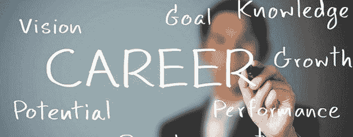

# 你准备好从事网络安全工作了吗？

> 原文：<https://www.social-engineer.com/are-you-ready-for-a-career-in-cybersecurity/>

你准备好从事网络安全工作了吗？你可能已经看到了关于网络安全专家严重短缺的报道。事实上，根本没有足够的工人来跟上渗透到商业和政府部门的持续不断的网络攻击。事实上，来自 Tripwire 的一项新的 [，](https://www.tripwire.com/state-of-security/wp-content/uploads/sites/3/Tripwire-Dimensional-Research-Skills-Gap-Report.pdf) 调查显示，接受调查的 300 家公司中有 85%声称他们的 IT 安全部门人手不足。

网络安全领域的一个日益增长的趋势是关注网络犯罪分子如何使用 *社会工程* 发动攻击。到底什么是社会工程？我们将社会工程定义为 [*“影响一个人采取可能或可能不符合其最佳利益的行动的行为。”*](https://www.social-engineer.com/) C 网络犯罪分子发现，与实施复杂的技术攻击相比，瞄准组织内的人员往往更容易。

鉴于此，作为职业社交 工程师 ， 我们研究网络罪犯是如何影响人们获取关键信息的。我们提供[托管服务](https://www.social-engineer.com/managed-services/)，在您组织的人际网络中识别风险并评估漏洞。所以，如果你对安全的人性方面感兴趣，那么专业社会工程的这个专业领域是适合你的。我们让你上瘾了吗？如果有，你会发现简单看一下最流行的社会工程攻击媒介会很有帮助。

### 最普遍的社会工程载体

最普遍的社会工程攻击载体是 [【网络钓鱼】](https://www.social-engineer.org/framework/attack-vectors/phishing-attacks-2/) [vishing、](https://www.social-engineer.org/framework/attack-vectors/vishing/) [smishing、](https://www.social-engineer.org/framework/attack-vectors/smishing/) 和 [冒名顶替](https://www.social-engineer.org/framework/attack-vectors/impersonation/) 。事实上， [冒充 CEO 的邮件占了所有钓鱼邮件的近一半？](https://www.itproportal.com/news/fake-ceos-appear-in-nearly-half-of-phishing-scam-emails/)2015 年针对 [美泰就使用了这种类型的社交工程攻击。](https://www.csoonline.com/article/3049392/chinese-scammers-take-mattel-to-the-bank-phishing-them-for-3-million.html) 是如何进行的？网络罪犯挖掘社交媒体平台，专门寻找公司新闻、政策和 Mattel 内部关键人物的姓名。他们了解到的一个重要因素是，美泰将很快迎来新的首席执行官。现在，他们有了攻击目标。网络犯罪分子冒充新的首席执行官，给一名财务主管发电子邮件，要求将一笔 300 万美元的新供应商款项电汇至中国的一家银行。因为大家都知道新 CEO 正在为在中国的发展做准备，所以这个要求对财务总监来说并不奇怪。T37】

有什么外卖？ *所有的* 商家都容易受到社会工程的攻击。它突出了一个有价值的观点。所有员工都需要接受培训，以了解社会工程技术。

### 如何让社会工程成为你的职业？

如何让社交工程成为你的职业？说到教育，推荐基于表现的 [高级实用社会工程](https://www.social-engineer.com/advanced-practical-social-engineering-training/) 课程。此外，获得以下证书也是非常有价值的:攻击性安全认证[认证信息系统安全专业人员。](https://www.isc2.org/Certifications/CISSP) S 安全专家兼 Social-Engineer，LLC 首席执行官[克里斯·哈德纳吉](https://www.social-engineer.com/about/)， 指出，对他来说，成为一名专业社会工程师最重要的一个方面就是批判性思考的能力。 他还有一句*“让别人因为遇见你而感觉更好。”一个专业的社会工程师可能需要像坏人一样思考。然而，* Hadnagy 的 目标是为他们的约定和客户创造积极的学习环境和生产场景。

在开始任何新的职业生涯时，与那些成功完成旅程并愿意分享他们在此过程中学到的经验教训的人联系会很有帮助。这里有一个必去的列表，既能激励又能教育。

*   [如何成为社会工程师](https://www.social-engineer.org/newsletter/social-engineer-newsletter-vol-05-issue-61/)
*   [让社会工程成为你的职业](https://www.social-engineer.org/newsletter/social-engineer-newsletter-vol-05-issue-62/)
*   [从 SECTF 到 Pro SE with Whitney and Rachel](https://www.social-engineer.org/podcast/ep-110-from-sectf-to-pro-se-with-whitney-and-rachel/)
*   [塞维利亚 在 Defcon 26:从内向到 SE，旅程](https://www.social-engineer.org/resources/sevillage-at-defcon-26-from-introvert-to-se-the-journey/)
*   成为专业社会工程师的小贴士
*   [网络安全中需要的女性](https://www.social-engineer.org/general-blog/women-needed-in-cybersecurity/)

职业生涯 社会工程师 会很充实。现在是时候开始你的网络安全之路了。 *形象:*  [*https://www.google.com/search?client=firefox-b-1-d&biw = 1152&BIH = 555&TBM = isch&sa = 1&ei = mdKOXMu-cvhc 5 glznbradw&q = career&OQ = career..* *16218…0.0..0 . 0 . 0……. 0……GWS-wiz-img . yd 6 JM 1 FD dro # imgrc = mjlzpj 8 C3 pebrm:*](https://www.google.com/search?client=firefox-b-1-d&biw=1152&bih=555&tbm=isch&sa=1&ei=mdKOXMu-CvHc5gLZnbrADw&q=career&oq=career&gs_l=img.3...0.0..16218...0.0..0.0.0.......0......gws-wiz-img.yD6Jm1fddro#imgrc=MJLzPJ8c3PeBRM:)