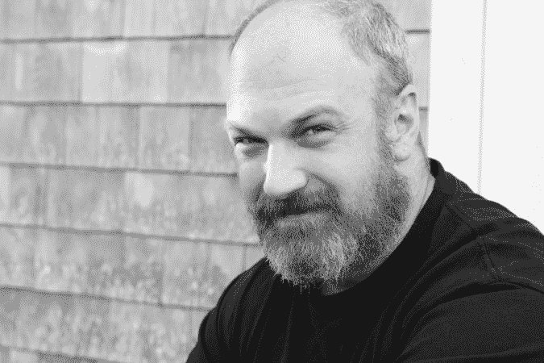

# 闯入 NOOBZ！:社会工程现场渗透

> 原文：<https://www.social-engineer.com/breaking-in-for-noobz-social-engineering-onsite-infiltration/>

你好。我是个菜鸟。我不知道 GPS 时钟是如何工作的。不知道。我知道其中一个的控制盒是什么样的。更重要的是，我知道这个特定客户使用的时钟的许可证将于今年到期。这就够了。我只是问在哪里可以找到 GPS 时钟的控制盒。这就是我如何发现自己站在这座大楼的网络运营中心(NOC)的一个服务器机柜里，由一名正式员工陪同。这是我第一份社会工程现场渗透工作的亮点之一。有那么容易吗？是也不是。让我告诉你这个故事。

<figure id="attachment_3877" aria-describedby="caption-attachment-3877" style="width: 675px" class="wp-caption aligncenter">

<figcaption id="caption-attachment-3877" class="wp-caption-text">Curt Klump</figcaption>

</figure>

几周前，我成为了一个社会工程(SE)团队的一员，参加了一系列的现场渗透活动。我们的任务是在三天两夜的时间里闯入九栋被批准的建筑。这是我第一次参与现场渗透活动，以下几点最让我吃惊。

## 不断升级的成功

作为一个社会工程团队的新成员，第一天是最慢的。但是，这也是我们做一些最重要的工作的一天。通过[开源情报](https://www.social-engineer.org/newsletter/what-is-your-favorite-osint-tool/) (OSINT)，我们了解了我们目标地点的情况，但仍然不确定进入大楼的最佳方式。所以，我们分成两队。一个小组审查了 OSINT 并提出了我们最有希望的借口。另一个团队(我的团队)去了现场，看看我们能从与一大早到达的员工的不那么随意的互动中学到什么。

这些互动是我们最初的小成功，对我们后来更大的成功很有帮助。因为这些，我们能够学习作为客人进入大楼的协议，我们得到了一个名字。在另一栋楼里，我们看到了他们的访客卡亭，我们拍到了一张员工卡的不错的照片。下午晚些时候，一个非常友好的保安带我通过使用信息亭。他甚至让我“打电话”给我自己的“联系人”(我假装的，我的手机摄像头甚至还在录音)。一个徽章印在了保安的侧面，但是因为“我的联系人”不在大楼里(不存在)，所以就被扔掉了。在接下来的几天里，我们将在几次渗透中使用员工徽章和访客亭。我使用了一个“我的徽章不起作用了”的策略，用我们在现场拍摄的早期照片制作的假徽章，进入了九座建筑中的至少三座。

## 借口是关键(字面意思是开门)

有了像样的借口(现场技术人员检查 GPS 时钟以更新许可证)，我们有充分的理由在大楼里四处走动寻找东西。但令我高兴的是，当有人问我我们在做什么时，这也让我们有了一个护卫，他的徽章可以进入比我们可以尾随进入的区域更受限制的区域。这就是我如何进入我们第二高优先级建筑的 NOC。我们的借口还让我进入了 NOC 中的一个服务器机柜，一个不同的高级 IT 办公室，以及大楼数据中心外面的受限通道。

在订婚之前，我认为由目标员工陪同会让我们的事情变得更困难。我惊讶地发现，有一个陪同人员让我们能够接触到我们自己无法接触到的地区和人群。获得护送，以及随后的访问，只是有一个好的借口，发挥我的优势——分散注意力，装傻，问问题。

## 惊喜！！

有趣的是，我不感到焦虑。作为一个人，我伴随着大量的噪音、干扰和混乱，但我的内心生活相当平静。所以，第二天我感到非常震惊，我的胸腔里有一种令人不安的嗡嗡声。当我坐在酒店房间休息的时候，事情开始发生了。我内心的第一个想法是“发生了什么？”我的第二个(半有用的)想法是“哦哇，人们是如何这样操作的？”

事实证明，缺乏休息和闯入建筑物时肾上腺素的反复飙升会让一个人在停机时产生一些额外的情绪。谁知道呢？我发现帮助我渡过难关的是小睡一会儿，给我吃点像样的食物，而且令人惊讶的是，那天晚上我出去闯入了另一栋大楼。

我演戏时的导师会告诉他的学生“感到恐惧和焦虑是正常的。让这种恐惧或焦虑将你拒之门外是不好的，”通过进入另一个目标建筑来治愈我不熟悉的焦虑痛苦提醒了我这一点。我们的夜间闯入是我那天早上去过的同一个地方。当我们离开去现场时，我仍然感到肾上腺有些疲劳。我只是让自己意识到我内心发生了什么，并认为“不能让它关闭你”。这句话已经成为我重新定义一种情况的一种方式，并提醒我自己，一旦我进入工作，我将能够全力以赴。

## 现场渗透—并非所有事情都可以计划

在我们的社会工程现场渗透的最后一天，我最终会见了我们的主要联系人，同时把世界上最美味的玉米面包塞到我的脸上。让我解释一下。

我们的许多参赛作品都是机会主义的产物。这对我太好了！我天生就是一个机会主义者。在团队的最后一天，当我们在户外午餐区等待尾随机会时，一辆烧烤食品车停了下来。我看到了一个帮助我们融入的好机会，所以我去点了一些玉米面包(这 100%不是因为我爱吃零食)。就在那时，我的一个队友进入了大楼。所以，我最终带着一个外带盒完成了整个约定。事实证明，这是分散注意力的最佳方式。当我的搭档给他们桌子上的文件拍照时，这给了我一些聊天的内容。唯一的失败是，我们在这个地方被抓住了。所以，当我们的主要联系人被叫去的时候，当我和他握手的时候，我的脸上挂满了美味松软的蜂蜜玉米面包。

## 保持平衡

也就是说，并不是每个机会都是好的。我通常非常愿意尝试有风险的事情，只是为了看看我是否能做到。我发现我需要问两个问题来让自己保持在正确的轨道上。第一个是“我变得贪婪了吗？”如果我已经达成妥协，但决定继续努力，我会问自己这个问题。它将帮助我决定我的选择有多明智。第二个问题是“这是否以任何有意义的方式推进了工作？”如果答案是否定的，那么不管这个想法是什么，我可能都不会去做。通常情况下。但在第一天，我做了一些事情(谁知道是什么)让我们的项目经理说，“你是一个愚蠢的，愚蠢的，愚蠢的人。”这很棒也很有趣。但是，你知道，没有销售工程师退款。因此，对一个想法深思熟虑比仅仅为了尝试而尝试更能促进项目。

这也是有队友来平衡我混乱的天性的时候。就像第一天我的问题是“我应该跳过十字转门吗？”合乎逻辑的正确答案是“也许不是在第一天”。这是最好的建议，我在 3 个摄像头的视野范围内。我们通过一种不同的机会主义方式进入——我们跟着一些承包商穿过一个装货码头的门。还有一次，一个队友明智地和我分开，因为看起来我就要被抓住了，她想确保我们中的一个能留在大楼里。这是一个伟大的选择，我真的差点被发现！

## 退出战略

记住要有一个好的退出策略。不要陷在一个社会工程现场渗透工作中太久。让我们以现在为例。我正要告诉你“我不得不停止写作，这样我终于可以去谷歌一个 GPS 时钟做什么”(def 不要谷歌那个)。希望我在 noob 休息时的一些想法和经历是有帮助的，或者至少是有效的。

总结一下我从这次项目中学到的重要经验:

*   最初的小成功会带来更大的成功。
*   有一个好借口。
*   有时候会有残留的情感内容。
*   接受不可预见的机遇。
*   有让你平衡的队友。
*   制定退出策略。我用这个作为写结论的一种廉价方式。但说真的，想想怎么离开那里。

照顾好自己，休息一下，计划好你的借口，不要忽视你的小成功！希望以后我能写更多关于这个话题的东西，但是现在我不得不停止写作…这样我就可以去谷歌一下 GPS 时钟是做什么的了。

*作者:[柯特·克鲁普](https://www.social-engineer.com/social-engineer-team/curt-klump/)T3】*

*来源:*
*[https://www.social-engineer.com/social-engineer-pentesting/](https://www.social-engineer.com/social-engineer-pentesting/)*
*[https://www . social-engineer . org/newslett/what-is-your-favorite-osint-tool/](https://www.social-engineer.org/newsletter/what-is-your-favorite-osint-tool/)*