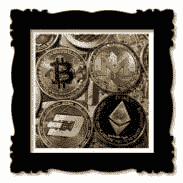

# 郑的大唐币庞氏骗局

> 原文：<https://www.social-engineer.org/general-blog/cha-ching-zhengs-datang-coin-ponzi-scheme/>

11 岁的查理·施雷姆(Charlie Shrem)，早期投资比特币，赚了数百万！戴夫·卡尔森每月用比特币赚 800 万美元！受到这些和其他真实生活故事的启发，一些人认为，只要时机合适，他们也可以提前进入，成为下一个加密货币百万富翁。毕竟，如果一个 11 岁的孩子都能做到，又能有多难呢？对于中国西北地区成千上万的人来说，他们的机会来了，或者说他们认为，这是一种叫做“大唐币”的新加密货币。然而，这将被证明是一个精心策划的庞氏骗局。

## 郑的大唐币庞氏骗局-精心安排和细节

一个化名为“郑”的诈骗犯据称在 18 天内从 13000000 美元中骗走了 1300000 美元。郑花了几个月的时间准备这个精心策划的庞氏骗局。他的骗局主要是投资者购买加密货币大唐币，这种货币与他控制的“香港李咏大唐国际集团”有关。郑承诺巨额回报。新会员每天可以赚大约 13，000 美元，初始投资为 480，000 美元，以每枚 0.50 美元的价格购买大唐币。

为了提高大唐币和大唐国际集团作为一家国际创业公司的可信度，郑聘请了俄罗斯人叶夫根尼·苏博廷(Evgeny Subbotin)担任董事长兼董事总经理。苏博廷参加了中国媒体报道的多个加密货币推广活动。他吹捧大唐币被添加到商亚、优信和 ZB.com 等交易所的潜力。此外，他声称加密货币将用于酒店、零售和教育行业。

对于大唐钱币的投资者来说，如果他们早期进入，似乎有可能成为下一个查理·施雷姆。事实上，多重影响策略被巧妙地用来使这个骗局看起来真实。这四个线索使这个骗局看起来合法:

*   俄罗斯人叶夫根尼·苏博廷(Evgeny Subbotin)受雇担任这家总部位于香港的公司的董事长兼总经理。这增强了香港李咏大唐国际集团作为一个合法的国际区块链创业公司的看法。
*   [权威](https://www.social-engineer.org/framework/influencing-others/influence-tactics/authority/):Subbotin 先生作为董事长兼总经理出席了多场推广活动，中国知名媒体对此进行了报道。
*   社会证据:成千上万的人在投资。既然这是一个受欢迎的决定，它一定是正确的。
*   [情感触发](https://www.social-engineer.org/framework/influencing-others/manipulation/):承诺每天 13000 美元的巨额回报。

## 你知道的越多，你就越安全，对吗？

骗局受害者必须容易受骗，轻信，过度信任，容易说服。对吗？不对！在英国进行的一项研究发现了完全相反的情况。骗局受害者往往事业有成，是熟练的决策者，有良好的认知能力。最精明的骗子甚至可以愚弄最聪明的人。他们在骗局中使用的精心制作的细节让它看起来——哦！如此真实！

## 不要让知识成为弱点

根据[英国研究](https://www.social-engineer.org/wiki/archives/Scam/Scam-PsycologyOfScams.pdf)，“诈骗受害者在诈骗内容领域的背景知识通常比一般人要好。例如，似乎有合法抽奖和彩票经验的人比在这方面知识和经验较少的人更容易上当受骗。”令人惊讶的是，该研究进一步发现，一个人对特定内容的了解增加了他们成为使用该内容的骗局受害者的机会。这一发人深省的发现强调了运用批判性思维的必要性。质疑证据和假设。 [Social-Engineer，LLC](https://www.social-engineer.com/) 发表了一篇[的优秀博客](https://www.social-engineer.com/protect-social-engineering-age-cryptocurrency/)，讲述了区块链、加密货币以及如何将成为骗局受害者的风险降至最低。它建议的四项保障措施是:

*   总是验证
*   核实
*   导航到已知良好的链接
*   问题

骗子被称为“艺术家”是有原因的。他们是幻觉和欺骗的大师。当一个投资机会好得令人难以置信时，一个突出的问题是，“我没有看到什么？”

“让你陷入麻烦的不是你不知道的事情。你肯定知道的事情并不一定如此”——马克·吐温

*来源:*
*[http://crypto curry . com/investments-2/top-7-people-been-rich-bit coin/](http://cryptocurry.com/investments-2/top-7-people-became-rich-bitcoin/)*
*[https://www . social-engineer . org/wiki/archives/Scam/Scam-psycologyofscams . pdf](https://www.social-engineer.org/wiki/archives/Scam/Scam-PsycologyOfScams.pdf)*
*[https://www . social-engineer . org/framework/general-discussion/categories-social-engineers/Scam-artists/【艺术家】](https://www.social-engineer.org/framework/general-discussion/categories-social-engineers/scam-artists/)*

*图片:*